# BATbern Event Management Platform Fullstack Architecture Document

## Introduction

This document outlines the complete fullstack architecture for **BATbern Event Management Platform**, including backend systems, frontend implementation, and their integration. It serves as the single source of truth for AI-driven development, ensuring consistency across the entire technology stack.

This unified approach combines what would traditionally be separate backend and frontend architecture documents, streamlining the development process for modern fullstack applications where these concerns are increasingly intertwined.

### Starter Template or Existing Project

**Project Nature:** Revolutionary transformation from static Angular website to comprehensive event management platform
**Current State:** Existing Angular codebase with 20+ years of historical event data
**Architecture Approach:** **Domain-Driven Design with Separate Bounded Contexts**

**Why DDD Enterprise Pattern is Superior:**

1. **Clear Domain Boundaries:** The BATbern platform has distinct domains:
   - **Event Management Domain** (Organizer workflows)
   - **Speaker Coordination Domain** (Speaker portal & workflows)
   - **Partner Analytics Domain** (ROI tracking & strategic input)
   - **Attendee Experience Domain** (Content discovery & registration)

2. **Enterprise Scalability:** Each bounded context can:
   - Scale independently based on load (attendee domain vs organizer domain)
   - Deploy separately reducing deployment risk
   - Evolve at different paces (partner analytics may change more frequently)
   - Use appropriate technology per domain needs

3. **Team Organization Benefits:**
   - Different teams can own different domains
   - Reduces cognitive load per team
   - Clear API contracts between domains
   - Independent testing and deployment cycles

**Repository Structure: DDD-Based Multi-Repository Approach**

```
BATbern-Platform/
├── shared-kernel/                 # Shared types, events, utilities
├── event-management-service/      # Organizer workflows & automation
├── speaker-coordination-service/  # Speaker portal & material collection
├── partner-analytics-service/     # ROI tracking & strategic features
├── attendee-experience-service/   # Content discovery & registration
├── api-gateway/                   # Unified API entry point
├── web-frontend/                  # React frontend consuming all APIs
└── infrastructure/                # Shared infrastructure as code
```

**Benefits over Monorepo:**
- **Clear Ownership:** Each service has dedicated team ownership
- **Independent Deployment:** Deploy speaker portal without affecting analytics
- **Technology Flexibility:** Java/Spring Boot for complex workflows, Node.js for content APIs
- **Enterprise Governance:** Easier compliance auditing per domain
- **Fault Isolation:** Issues in one domain don't affect others

### Change Log

| Date | Version | Description | Author |
|------|---------|-------------|--------|
| 2024-12-20 | 1.0 | Initial full-stack architecture document | Winston (Architect) |

## High Level Architecture

### Technical Summary

The BATbern Event Management Platform employs a **Domain-Driven Design microservices architecture** with four distinct bounded contexts, each deployed as independent services behind a unified API Gateway. The React-based frontend provides role-adaptive interfaces consuming domain-specific APIs, while shared infrastructure handles cross-cutting concerns like authentication, file storage, and monitoring. This architecture enables independent scaling and deployment of the complex workflow automation features (event management), high-volume content discovery (attendee experience), analytics-heavy partner services, and streamlined speaker coordination workflows. The design prioritizes enterprise-grade reliability, Swiss compliance requirements, and the ability to evolve each domain at different paces while maintaining cohesive user experiences across all four stakeholder groups.

## C4 Model Architecture Diagrams

### Level 1: System Context Diagram

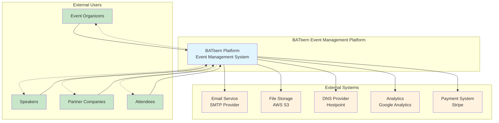

### Level 2: Container Diagram

```mermaid
graph TB
    subgraph "Users"
        A[Event Organizers]
        B[Speakers]
        C[Partners]
        D[Attendees]
    end

    subgraph "BATbern Platform - Frontend"
        E[Web Application<br/>React 18 + TypeScript<br/>Role-adaptive UI]
        F[Mobile PWA<br/>Progressive Web App<br/>Offline capabilities]
    end

    subgraph "BATbern Platform - Backend"
        G[API Gateway<br/>AWS API Gateway<br/>Authentication & Routing]

        subgraph "Microservices"
            H[Event Management Service<br/>Java 21 + Spring Boot<br/>Event workflows & coordination]
            I[Speaker Coordination Service<br/>Java 21 + Spring Boot<br/>Speaker pipeline management]
            J[Partner Analytics Service<br/>Java 21 + Spring Boot<br/>ROI analytics & reporting]
            K[Attendee Experience Service<br/>Java 21 + Spring Boot<br/>Content discovery & search]
            L[Company Management Service<br/>Java 21 + Spring Boot<br/>Organization data]
        end
    end

    subgraph "Data & Infrastructure"
        M[Authentication<br/>AWS Cognito<br/>User management & SSO]
        N[Database Cluster<br/>PostgreSQL (Multi-AZ)<br/>Per-service databases]
        O[Cache Layer<br/>Redis ElastiCache<br/>Session & data caching]
        P[File Storage<br/>AWS S3<br/>Documents & media]
        Q[CDN<br/>CloudFront<br/>Global content delivery]
    end

    subgraph "External Services"
        R[Email Provider<br/>SMTP Service<br/>Notifications]
        S[DNS Provider<br/>Hostpoint<br/>Domain management]
    end

    A --> E
    B --> E
    C --> E
    D --> E
    D --> F

    E --> G
    F --> G

    G --> H
    G --> I
    G --> J
    G --> K
    G --> L

    G --> M
    H --> N
    I --> N
    J --> N
    K --> N
    L --> N

    H --> O
    I --> O
    J --> O
    K --> O
    L --> O

    H --> P
    I --> P
    J --> P
    K --> P
    L --> P

    E --> Q
    F --> Q

    H --> R
    I --> R
    J --> R

    Q --> S

    style E fill:#e3f2fd
    style F fill:#e3f2fd
    style G fill:#f3e5f5
    style H fill:#e8f5e8
    style I fill:#e8f5e8
    style J fill:#e8f5e8
    style K fill:#e8f5e8
    style L fill:#e8f5e8
    style M fill:#fff3e0
    style N fill:#fff3e0
    style O fill:#fff3e0
    style P fill:#fff3e0
    style Q fill:#fff3e0
    style R fill:#ffebee
    style S fill:#ffebee
```

### Level 3: Component Diagram - Event Management Service

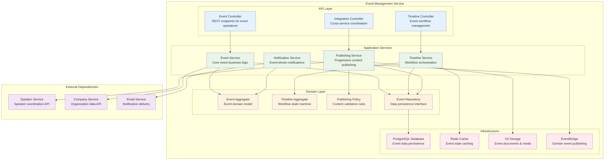

### Level 3: Component Diagram - Frontend Application

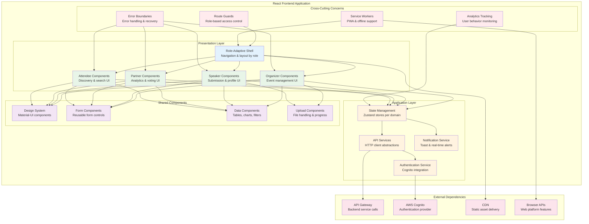

### Level 4: Code Diagram - Event Aggregate Implementation

```mermaid
classDiagram
    class Event {
        +UUID id
        +String title
        +String description
        +LocalDate eventDate
        +EventStatus status
        +List~Session~ sessions
        +EventTimeline timeline
        +PublishingState publishingState
        +create() Event
        +updateDetails(EventDetails) void
        +addSession(Session) void
        +removeSession(UUID) void
        +startPublishing() void
        +completePublishing() void
        +generateTimeline() EventTimeline
    }

    class EventTimeline {
        +List~TimelineItem~ items
        +WorkflowState currentState
        +Map~String, LocalDateTime~ milestones
        +addItem(TimelineItem) void
        +updateState(WorkflowState) void
        +isOverdue() boolean
        +getNextDeadline() LocalDateTime
    }

    class Session {
        +UUID id
        +String title
        +String description
        +LocalTime startTime
        +Duration duration
        +Speaker speaker
        +SessionStatus status
        +assignSpeaker(Speaker) void
        +updateContent(SessionContent) void
        +markAsReady() void
    }

    class Speaker {
        +UUID speakerId
        +String firstName
        +String lastName
        +String email
        +Company company
        +List~String~ expertiseAreas
        +SpeakerStatus status
        +invite(Event) SpeakerInvitation
        +acceptInvitation(UUID) void
        +declineInvitation(UUID, String) void
    }

    class Company {
        +UUID id
        +String name
        +String logoUrl
        +CompanyType type
        +ContactInfo contactInfo
        +PartnershipLevel partnershipLevel
        +updateLogo(String) void
        +updateContactInfo(ContactInfo) void
    }

    class EventRepository {
        <<interface>>
        +save(Event) Event
        +findById(UUID) Optional~Event~
        +findByStatus(EventStatus) List~Event~
        +findUpcomingEvents() List~Event~
        +delete(UUID) void
    }

    class EventService {
        -EventRepository repository
        -TimelineService timelineService
        -PublishingService publishingService
        +createEvent(CreateEventCommand) Event
        +updateEvent(UpdateEventCommand) Event
        +addSession(AddSessionCommand) void
        +publishEvent(UUID) void
        +getEventTimeline(UUID) EventTimeline
    }

    Event ||--o{ Session : contains
    Event ||--|| EventTimeline : has
    Session ||--|| Speaker : assigned to
    Speaker ||--|| Company : belongs to
    EventService --> Event : manages
    EventService --> EventRepository : uses
    Event --> EventTimeline : generates

    style Event fill:#e8f5e8
    style EventTimeline fill:#e3f2fd
    style Session fill:#fff3e0
    style Speaker fill:#f3e5f5
    style Company fill:#ffebee
    style EventRepository fill:#fce4ec
    style EventService fill:#e1f5fe
```

### Infrastructure Architecture Diagram

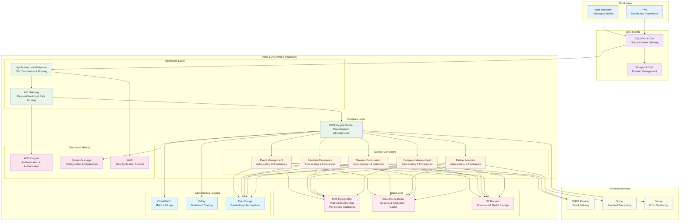

### Data Flow Architecture

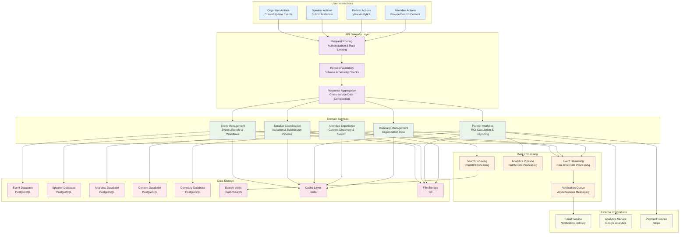

These comprehensive C4 model diagrams provide visual clarity for the BATbern platform architecture at multiple levels of abstraction, from high-level system context down to detailed component interactions and data flows.

### Platform and Infrastructure Choice

**Platform:** AWS EU-Central-1 (Frankfurt) with data residency controls
**Key Services:** ECS Fargate (microservices), API Gateway, RDS PostgreSQL, S3, Cognito, CloudFront CDN, ElastiCache Redis
**Deployment Host and Regions:** Primary: eu-central-1 (Frankfurt), Backup: eu-west-1 (Ireland) for disaster recovery

### Repository Structure

**Structure:** Domain-Driven Design Multi-Repository Pattern
**API Coordination:** Unified API Gateway with domain routing
**Package Organization:** Domain-based ownership with shared kernel

Each bounded context maintains its own repository with clear domain boundaries:
- Independent versioning and deployment cycles
- Domain-specific technology choices where appropriate
- Clear API contracts between services
- Shared kernel for common types and events

### High Level Architecture Diagram

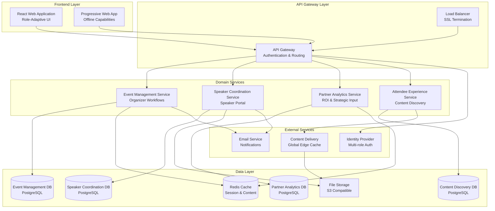

### Architectural Patterns

- **Domain-Driven Design:** Clear bounded contexts with event management, speaker coordination, partner analytics, and attendee experience domains - _Rationale:_ Aligns with distinct stakeholder groups and enables independent evolution of complex business workflows

- **Microservices with API Gateway:** Independent services coordinated through unified API entry point - _Rationale:_ Enables independent scaling, deployment, and technology choices while maintaining cohesive frontend experience

- **CQRS for Analytics Domain:** Separate read/write models for partner analytics and reporting - _Rationale:_ Optimizes complex reporting queries while maintaining transactional integrity for operational data

- **Event-Driven Architecture:** Domain events for cross-service coordination (speaker status changes, event publishing triggers) - _Rationale:_ Enables loose coupling between domains while maintaining business workflow integrity

- **Role-Based Component Architecture:** React components that adapt based on authenticated user role - _Rationale:_ Single frontend codebase serving four distinct user experiences reduces maintenance overhead

- **Progressive Web App Pattern:** Service workers for offline content access and mobile-native experience - _Rationale:_ Critical for Swiss conference attendees who expect mobile-first experience with offline capabilities

- **Repository Pattern with Domain Models:** Abstract data access with rich domain models per service - _Rationale:_ Enables testability and protects business logic from infrastructure concerns

## Tech Stack

### Technology Stack Table

| Category | Technology | Version | Purpose | Rationale |
|----------|------------|---------|----------|-----------|
| Frontend Language | TypeScript | 5.3+ | Type-safe frontend development | Essential for large-scale enterprise app with multiple developer teams |
| Frontend Framework | React | 18.2+ | Role-adaptive user interface | Mature ecosystem, excellent TypeScript support, component reusability |
| UI Component Library | Material-UI (MUI) | 5.14+ | Swiss-standard design components | Consistent with frontend spec, enterprise-grade accessibility |
| State Management | Zustand + React Query | 4.4+ / 4.36+ | Client state + server state | Lightweight, TypeScript-first, excellent caching for content discovery |
| Backend Language | Java | 21 LTS | Enterprise service development | Long-term support, enterprise ecosystem, team expertise |
| Backend Framework | Spring Boot | 3.2+ | Microservices and REST APIs | Industry standard for Java enterprise, excellent cloud integration |
| API Style | REST + OpenAPI | 3.1 | Service communication | Clear documentation, tooling support, enterprise standard |
| Database | PostgreSQL | 15+ | Primary data storage | ACID compliance, JSON support, excellent performance |
| Cache | Redis | 7.2+ | Session and content caching | High performance, supports complex data structures |
| File Storage | AWS S3 | Latest | Document and media storage | Enterprise-grade, CDN integration, Swiss compliance capable |
| Authentication | AWS Cognito | Latest | Multi-role user management | Enterprise SSO, fine-grained permissions, AWS ecosystem |
| Frontend Testing | Vitest + React Testing Library | 1.0+ / 13.4+ | Component and integration testing | Fast, TypeScript native, React best practices |
| Backend Testing | JUnit + Testcontainers | 5.10+ / 1.19+ | Service and integration testing | Java standard, real database testing |
| E2E Testing | Playwright | 1.40+ | Full application workflows | Cross-browser, reliable, excellent CI integration |
| Build Tool | Gradle | 8.5+ | Java service builds | Superior dependency management, enterprise standard |
| Bundler | Vite | 5.0+ | Frontend build and dev server | Fast HMR, TypeScript support, modern tooling |
| IaC Tool | AWS CDK | 2.110+ | Infrastructure as code | Type-safe infrastructure, AWS native, versioned stacks |
| CI/CD | GitHub Actions | Latest | Automated testing and deployment | Integrated with repository, excellent AWS integration |
| Monitoring | AWS CloudWatch + Grafana | Latest / 10.2+ | Application and infrastructure monitoring | Enterprise observability, custom dashboards |
| Logging | SLF4J + Logback | 2.0+ / 1.4+ | Structured application logging | Java standard, structured JSON logging |
| CSS Framework | Tailwind CSS | 3.3+ | Utility-first styling | Rapid development, consistent design system |

## Data Models

### Company

**Purpose:** Centralized company entity for speakers, partners, and attendees with logo management and partner company recognition.

**Key Attributes:**
- id: UUID - Unique company identifier
- name: string - Official company name
- isPartner: boolean - Whether company is a BATbern partner
- logo: CompanyLogo - Uploaded logo with metadata
- website: string - Company website URL
- industry: string - Industry sector classification
- employeeCount: number - Approximate employee count
- headquarters: Address - Primary company location

#### TypeScript Interface
```typescript
interface Company {
  id: string;
  name: string;
  displayName: string;
  isPartner: boolean;
  logo?: CompanyLogo;
  website?: string;
  industry: string;
  employeeCount?: number;
  headquarters?: Address;
  description?: string;
  socialLinks: SocialLinks;
  createdAt: Date;
  updatedAt: Date;
  createdBy: string; // User ID who created this company
}

interface CompanyLogo {
  fileId: string;
  fileName: string;
  mimeType: string;
  fileSizeBytes: number;
  s3Key: string;
  uploadedAt: Date;
  uploadedBy: string;
}
```

#### Relationships
- **One-to-Many:** Company → Speakers (speakers belong to companies)
- **One-to-One:** Company ↔ Partner (partner companies have additional partner data)
- **One-to-Many:** Company → Attendees (attendees work for companies)

### Partner

**Purpose:** Partnership-specific data for companies that sponsor BATbern events, with consistent participation across all events.

**Key Attributes:**
- id: UUID - Unique partner identifier
- companyId: UUID - Reference to company entity
- partnershipLevel: PartnershipTier - Sponsorship level and benefits
- partnershipStartDate: Date - When partnership began
- analytics: PartnerAnalytics - ROI and engagement metrics across all events
- strategicInput: PartnerInput - Topic voting and suggestions
- contacts: PartnerContact[] - Multiple contact persons

#### TypeScript Interface
```typescript
interface Partner {
  id: string;
  companyId: string;
  partnershipLevel: PartnershipTier;
  partnershipStartDate: Date;
  partnershipEndDate?: Date;
  isActive: boolean;
  contacts: PartnerContact[];
  analytics: PartnerAnalytics;
  strategicInput: PartnerInput;
  benefits: PartnershipBenefits;
  createdAt: Date;
  updatedAt: Date;
}

interface PartnerAnalytics {
  totalEmployeeAttendanceAllEvents: number;
  averageAttendancePerEvent: number;
  contentEngagementScore: number;
  brandExposureMetrics: BrandExposure;
  roiCalculations: ROIMetrics;
  topicInfluenceScore: number;
}

enum PartnershipTier {
  BRONZE = 'bronze',
  SILVER = 'silver',
  GOLD = 'gold',
  PLATINUM = 'platinum',
  STRATEGIC = 'strategic'
}
```

#### Relationships
- **One-to-One:** Partner → Company (partner data extends company)
- **One-to-Many:** Partner → PartnerContacts (multiple contact persons)
- **One-to-Many:** Partner → EmployeeAttendanceRecords (cross-event attendance tracking)

### Speaker

**Purpose:** Individual speakers with company affiliations and session assignments across multiple events.

**Key Attributes:**
- id: UUID - Unique speaker identifier
- companyId: UUID - Reference to company entity
- profile: SpeakerProfile - Bio, expertise, contact information
- speakingHistory: SpeakingEngagement[] - Past session participation
- availability: SpeakerAvailability - Current availability status

#### TypeScript Interface
```typescript
interface Speaker {
  id: string;
  email: string;
  firstName: string;
  lastName: string;
  companyId: string;
  position: string;
  profile: SpeakerProfile;
  availability: SpeakerAvailability;
  communicationPreferences: ContactPreferences;
  speakingHistory: SpeakingEngagement[];
  createdAt: Date;
  updatedAt: Date;
}

interface SpeakerProfile {
  shortBio: string;
  detailedBio: string;
  expertiseAreas: string[];
  profilePhotoUrl?: string;
  linkedInUrl?: string;
  twitterHandle?: string;
  certifications: string[];
  languages: string[];
  speakingTopics: string[];
}

enum SpeakerAvailability {
  AVAILABLE = 'available',
  BUSY = 'busy',
  UNAVAILABLE = 'unavailable',
  INVITED = 'invited',
  CONFIRMED = 'confirmed',
  DECLINED = 'declined'
}
```

#### Relationships
- **Many-to-One:** Speaker → Company (speaker belongs to company)
- **Many-to-Many:** Speaker ↔ Sessions (speakers can present multiple sessions)
- **One-to-Many:** Speaker → SpeakingEngagements (historical session participation)

### Session

**Purpose:** Individual agenda items with multiple speaker support and comprehensive material management.

**Key Attributes:**
- id: UUID - Unique session identifier
- eventId: UUID - Parent event reference
- speakers: SessionSpeaker[] - Multiple speakers with roles
- schedule: SessionSchedule - Timing and location details
- materials: SessionMaterials - Presentation files and resources

#### TypeScript Interface
```typescript
interface Session {
  id: string;
  eventId: string;
  title: string;
  description: string;
  sessionType: SessionType;
  speakers: SessionSpeaker[]; // Multiple speakers
  startTime: Date;
  endTime: Date;
  room?: string;
  capacity?: number;
  materials: SessionMaterials;
  tags: string[];
  prerequisites?: string[];
  targetAudience: ExperienceLevel[];
  language: string;
  createdAt: Date;
  updatedAt: Date;
}

interface SessionSpeaker {
  speakerId: string;
  role: SpeakerRole;
  presentationTitle?: string; // Speaker-specific title if different
  isConfirmed: boolean;
  invitedAt: Date;
  confirmedAt?: Date;
  declinedAt?: Date;
  declineReason?: string;
}

enum SessionType {
  KEYNOTE = 'keynote',
  PRESENTATION = 'presentation',
  WORKSHOP = 'workshop',
  PANEL_DISCUSSION = 'panel_discussion',
  NETWORKING = 'networking',
  BREAK = 'break',
  LUNCH = 'lunch'
}

enum SpeakerRole {
  PRIMARY_SPEAKER = 'primary_speaker',
  CO_SPEAKER = 'co_speaker',
  MODERATOR = 'moderator',
  PANELIST = 'panelist'
}
```

#### Relationships
- **Many-to-One:** Session → Event (session belongs to event)
- **Many-to-Many:** Session ↔ Speakers (multiple speakers per session)
- **One-to-Many:** Session → AttendeeRatings (feedback and ratings)
- **One-to-Many:** Session → Materials (uploaded files and resources)

### Event

**Purpose:** Conference events with attendee registrations and session management, no direct speaker relationships.

#### TypeScript Interface
```typescript
interface Event {
  id: string;
  eventNumber: number;
  title: string;
  description: string;
  eventDate: Date;
  registrationDeadline: Date;
  venue: Venue;
  status: EventStatus;
  organizerId: string;
  capacity: number;
  currentAttendeeCount: number;
  topics: Topic[];
  sessions: Session[]; // Sessions contain speaker relationships
  createdAt: Date;
  updatedAt: Date;
  publishedAt?: Date;
  metadata: EventMetadata;
}

enum EventStatus {
  PLANNING = 'planning',
  TOPIC_DEFINED = 'topic_defined',
  SPEAKERS_INVITED = 'speakers_invited',
  AGENDA_DRAFT = 'agenda_draft',
  PUBLISHED = 'published',
  REGISTRATION_OPEN = 'registration_open',
  REGISTRATION_CLOSED = 'registration_closed',
  IN_PROGRESS = 'in_progress',
  COMPLETED = 'completed',
  ARCHIVED = 'archived'
}
```

#### Relationships
- **One-to-Many:** Event → Sessions (event contains multiple sessions)
- **Many-to-Many:** Event ↔ Attendees (through EventRegistration)
- **No direct relationship to Speakers** (speakers connected via sessions)
- **No direct relationship to Partners** (partners participate in all events)

### Attendee

**Purpose:** Conference participants with company affiliations and multi-event participation tracking.

#### TypeScript Interface
```typescript
interface Attendee {
  id: string;
  email: string;
  firstName: string;
  lastName: string;
  companyId?: string; // Optional company affiliation
  position?: string;
  profile: AttendeeProfile;
  preferences: ContentPreferences;
  engagementHistory: AttendeeEngagement;
  eventRegistrations: EventRegistration[]; // Many-to-many with events
  newsletterSubscription: boolean;
  gdprConsent: GDPRConsent;
  createdAt: Date;
  updatedAt: Date;
  lastLoginAt?: Date;
}

interface EventRegistration {
  eventId: string;
  attendeeId: string;
  registeredAt: Date;
  attendanceStatus: AttendanceStatus;
  checkInTime?: Date;
  checkOutTime?: Date;
  sessionAttendance: SessionAttendance[];
  feedback?: EventFeedback;
}

enum AttendanceStatus {
  REGISTERED = 'registered',
  CONFIRMED = 'confirmed',
  ATTENDED = 'attended',
  NO_SHOW = 'no_show',
  CANCELLED = 'cancelled'
}
```

#### Relationships
- **Many-to-One:** Attendee → Company (attendee works for company)
- **Many-to-Many:** Attendee ↔ Events (through EventRegistration)
- **One-to-Many:** Attendee → SessionAttendance (session-level participation)

## API Specification

### REST API Specification

```yaml
openapi: 3.0.0
info:
  title: BATbern Event Management Platform API
  version: 1.0.0
  description: Comprehensive API for the BATbern Event Management Platform supporting organizers, speakers, partners, and attendees
servers:
  - url: https://api.berner-architekten-treffen.ch
    description: Production API
  - url: https://api-staging.berner-architekten-treffen.ch
    description: Staging API
  - url: https://api-dev.berner-architekten-treffen.ch
    description: Development API

security:
  - BearerAuth: []

paths:
  # Event Management Domain
  /api/v1/events:
    get:
      tags: [Events]
      summary: List all events
      parameters:
        - name: status
          in: query
          schema:
            $ref: '#/components/schemas/EventStatus'
        - name: year
          in: query
          schema:
            type: integer
        - name: limit
          in: query
          schema:
            type: integer
            default: 20
        - name: offset
          in: query
          schema:
            type: integer
            default: 0
      responses:
        '200':
          description: List of events
          content:
            application/json:
              schema:
                type: object
                properties:
                  events:
                    type: array
                    items:
                      $ref: '#/components/schemas/Event'
                  pagination:
                    $ref: '#/components/schemas/Pagination'
    post:
      tags: [Events]
      summary: Create new event
      security:
        - BearerAuth: [organizer]
      requestBody:
        required: true
        content:
          application/json:
            schema:
              $ref: '#/components/schemas/CreateEventRequest'
      responses:
        '201':
          description: Event created
          content:
            application/json:
              schema:
                $ref: '#/components/schemas/Event'

  # Speaker Domain
  /api/v1/speakers:
    get:
      tags: [Speakers]
      summary: List speakers
      parameters:
        - name: companyId
          in: query
          schema:
            type: string
            format: uuid
        - name: expertiseArea
          in: query
          schema:
            type: string
        - name: availability
          in: query
          schema:
            $ref: '#/components/schemas/SpeakerAvailability'
      responses:
        '200':
          description: List of speakers
          content:
            application/json:
              schema:
                type: array
                items:
                  $ref: '#/components/schemas/Speaker'

  # Company Management
  /api/v1/companies:
    get:
      tags: [Companies]
      summary: Search companies
      parameters:
        - name: query
          in: query
          schema:
            type: string
        - name: isPartner
          in: query
          schema:
            type: boolean
      responses:
        '200':
          description: List of companies
          content:
            application/json:
              schema:
                type: array
                items:
                  $ref: '#/components/schemas/Company'
    post:
      tags: [Companies]
      summary: Create new company
      security:
        - BearerAuth: [organizer, speaker]
      requestBody:
        required: true
        content:
          multipart/form-data:
            schema:
              type: object
              properties:
                name:
                  type: string
                website:
                  type: string
                industry:
                  type: string
                logo:
                  type: string
                  format: binary
              required:
                - name
                - industry
      responses:
        '201':
          description: Company created
          content:
            application/json:
              schema:
                $ref: '#/components/schemas/Company'

  # Partner Analytics Domain
  /api/v1/partners/{partnerId}/analytics:
    get:
      tags: [Partners]
      summary: Get partner analytics
      security:
        - BearerAuth: [organizer, partner]
      parameters:
        - name: partnerId
          in: path
          required: true
          schema:
            type: string
            format: uuid
        - name: timeRange
          in: query
          schema:
            type: string
            enum: [last_quarter, last_year, all_time]
            default: last_year
      responses:
        '200':
          description: Partner analytics data
          content:
            application/json:
              schema:
                $ref: '#/components/schemas/PartnerAnalytics'

  # Content Search
  /api/v1/content/search:
    get:
      tags: [Content]
      summary: Search historical content
      parameters:
        - name: query
          in: query
          required: true
          schema:
            type: string
        - name: year
          in: query
          schema:
            type: integer
        - name: speaker
          in: query
          schema:
            type: string
        - name: topic
          in: query
          schema:
            type: string
        - name: limit
          in: query
          schema:
            type: integer
            default: 20
      responses:
        '200':
          description: Search results
          content:
            application/json:
              schema:
                type: object
                properties:
                  results:
                    type: array
                    items:
                      $ref: '#/components/schemas/ContentSearchResult'
                  totalCount:
                    type: integer
                  pagination:
                    $ref: '#/components/schemas/Pagination'

components:
  securitySchemes:
    BearerAuth:
      type: http
      scheme: bearer
      bearerFormat: JWT

  schemas:
    Event:
      type: object
      properties:
        id:
          type: string
          format: uuid
        eventNumber:
          type: integer
        title:
          type: string
        description:
          type: string
        eventDate:
          type: string
          format: date-time
        status:
          $ref: '#/components/schemas/EventStatus'
        sessions:
          type: array
          items:
            $ref: '#/components/schemas/Session'

    EventStatus:
      type: string
      enum:
        - planning
        - topic_defined
        - speakers_invited
        - agenda_draft
        - published
        - registration_open
        - registration_closed
        - in_progress
        - completed
        - archived

    Session:
      type: object
      properties:
        id:
          type: string
          format: uuid
        title:
          type: string
        sessionType:
          $ref: '#/components/schemas/SessionType'
        speakers:
          type: array
          items:
            $ref: '#/components/schemas/SessionSpeaker'

    SessionType:
      type: string
      enum:
        - keynote
        - presentation
        - workshop
        - panel_discussion
        - networking
        - break
        - lunch

    SessionSpeaker:
      type: object
      properties:
        speakerId:
          type: string
          format: uuid
        speaker:
          $ref: '#/components/schemas/Speaker'
        role:
          $ref: '#/components/schemas/SpeakerRole'
        isConfirmed:
          type: boolean

    SpeakerRole:
      type: string
      enum:
        - primary_speaker
        - co_speaker
        - moderator
        - panelist

    Speaker:
      type: object
      properties:
        id:
          type: string
          format: uuid
        email:
          type: string
          format: email
        firstName:
          type: string
        lastName:
          type: string
        company:
          $ref: '#/components/schemas/Company'
        availability:
          $ref: '#/components/schemas/SpeakerAvailability'

    SpeakerAvailability:
      type: string
      enum:
        - available
        - busy
        - unavailable
        - invited
        - confirmed
        - declined

    Company:
      type: object
      properties:
        id:
          type: string
          format: uuid
        name:
          type: string
        isPartner:
          type: boolean
        logo:
          $ref: '#/components/schemas/CompanyLogo'
        industry:
          type: string

    CompanyLogo:
      type: object
      properties:
        fileId:
          type: string
        fileName:
          type: string
        s3Key:
          type: string
        uploadedAt:
          type: string
          format: date-time

    Pagination:
      type: object
      properties:
        limit:
          type: integer
        offset:
          type: integer
        total:
          type: integer
        hasMore:
          type: boolean

    CreateEventRequest:
      type: object
      properties:
        title:
          type: string
        description:
          type: string
        eventDate:
          type: string
          format: date-time
        capacity:
          type: integer
      required:
        - title
        - eventDate
        - capacity
```

## Components

### Event Management Service

**Responsibility:** Core event lifecycle management, organizer workflows, and automated event planning processes including the 12-step workflow automation.

**Key Interfaces:**
- `/api/v1/events` - Event CRUD operations and status management
- `/api/v1/events/{id}/workflow` - Automated workflow state management
- `/api/v1/events/{id}/timeline` - Event timeline and milestone tracking
- `/api/v1/organizers` - Organizer role management and permissions

**Dependencies:**
- Speaker Coordination Service (speaker assignment validation)
- Partner Analytics Service (partner involvement tracking)
- Shared Kernel (domain events, common types)
- AWS Cognito (organizer authentication)
- PostgreSQL (event data persistence)

**Technology Stack:** Java 21 + Spring Boot 3.2, PostgreSQL, Redis (workflow state caching), EventBridge (domain events)

### Speaker Coordination Service

**Responsibility:** Speaker management, invitation workflows, material collection, and communication coordination between organizers and speakers.

**Key Interfaces:**
- `/api/v1/speakers` - Speaker profile and expertise management
- `/api/v1/invitations` - Speaker invitation workflow
- `/api/v1/sessions/{id}/speakers` - Speaker-session assignment management
- `/api/v1/materials` - Presentation material upload and management

**Dependencies:**
- Event Management Service (session data)
- Company Management Service (speaker company relationships)
- File Storage Service (presentation materials)
- Email Service (speaker communications)
- Shared Kernel (speaker domain events)

**Technology Stack:** Java 21 + Spring Boot 3.2, PostgreSQL, AWS S3 (file storage), SES (email notifications)

### Partner Analytics Service

**Responsibility:** Partner relationship management, ROI analytics, strategic input collection, and cross-event participation tracking for all partner companies.

**Key Interfaces:**
- `/api/v1/partners` - Partner profile and relationship management
- `/api/v1/partners/{id}/analytics` - ROI and engagement analytics
- `/api/v1/partners/{id}/topic-votes` - Strategic topic voting
- `/api/v1/reports` - Partner meeting reports and presentations

**Dependencies:**
- Attendee Experience Service (employee attendance data)
- Event Management Service (event participation data)
- Company Management Service (partner company data)
- Analytics Engine (data processing and insights)
- Shared Kernel (partner domain events)

**Technology Stack:** Java 21 + Spring Boot 3.2, PostgreSQL (analytics data), ElastiCache Redis (metrics caching), AWS QuickSight (dashboard generation)

### Attendee Experience Service

**Responsibility:** Attendee registration, content discovery, historical archive search, and personalized content recommendations across 20+ years of BATbern content.

**Key Interfaces:**
- `/api/v1/events/{id}/registrations` - Event registration management
- `/api/v1/content/search` - AI-powered content discovery
- `/api/v1/attendees/me` - Personal attendee dashboard
- `/api/v1/recommendations` - Personalized content recommendations

**Dependencies:**
- Event Management Service (event data for registration)
- Speaker Coordination Service (session and speaker data)
- Content Search Engine (OpenSearch for full-text search)
- Recommendation Engine (ML-based content suggestions)
- Shared Kernel (attendee domain events)

**Technology Stack:** Java 21 + Spring Boot 3.2, PostgreSQL (registration data), AWS OpenSearch (content search), Lambda (recommendation algorithms)

### Company Management Service

**Responsibility:** Centralized company entity management with logo storage, partner recognition, and company creation workflows for speakers and organizers.

**Key Interfaces:**
- `/api/v1/companies` - Company CRUD operations and search
- `/api/v1/companies/{id}/logo` - Logo upload and management
- `/api/v1/companies/suggest` - Company name suggestions and duplicate detection

**Dependencies:**
- File Storage Service (logo management)
- All domain services (company relationship validation)
- Shared Kernel (company domain events)

**Technology Stack:** Java 21 + Spring Boot 3.2, PostgreSQL, AWS S3 (logo storage), ElastiCache Redis (company search caching)

### Frontend Application

**Responsibility:** Role-adaptive user interface providing distinct experiences for organizers, speakers, partners, and attendees with Progressive Web App capabilities.

**Key Interfaces:**
- Role-based component rendering system
- API client service layer
- State management for user sessions
- PWA service worker for offline capabilities

**Dependencies:**
- API Gateway (all backend communication)
- CDN (static asset delivery)
- Browser APIs (PWA features)

**Technology Stack:** React 18.2 + TypeScript, Zustand (state management), React Query (server state), Vite (build tool), Workbox (PWA)

## External APIs

### AWS Cognito API

- **Purpose:** Multi-role user authentication and authorization management
- **Documentation:** https://docs.aws.amazon.com/cognito/latest/developerguide/
- **Base URL(s):** https://cognito-idp.eu-central-1.amazonaws.com/
- **Authentication:** AWS IAM roles and policies
- **Rate Limits:** 10,000 requests per second per user pool

**Key Endpoints Used:**
- `POST /oauth2/token` - JWT token generation and refresh
- `POST /admin/createUser` - Programmatic user creation for organizers
- `GET /oauth2/userInfo` - User profile and role information

**Integration Notes:** Custom attributes store BATbern-specific roles (organizer, speaker, partner, attendee). Lambda triggers handle user registration workflows and role assignment validation.

### AWS SES API

- **Purpose:** Transactional email delivery for notifications, invitations, and newsletter distribution
- **Documentation:** https://docs.aws.amazon.com/ses/latest/dg/
- **Base URL(s):** https://email.eu-central-1.amazonaws.com/
- **Authentication:** AWS IAM service roles
- **Rate Limits:** 14 emails per second (adjustable based on reputation)

**Key Endpoints Used:**
- `POST /v2/email/outbound-emails` - Send transactional emails
- `POST /v2/email/bulk-emails` - Newsletter distribution
- `POST /v2/email/templates` - Email template management

**Integration Notes:** Templates stored for speaker invitations, event notifications, and partner reports. Bounce and complaint handling integrated with user management.

### AWS S3 API

- **Purpose:** File storage for logos, presentations, handouts, and historical content
- **Documentation:** https://docs.aws.amazon.com/s3/latest/API/
- **Base URL(s):** https://s3.eu-central-1.amazonaws.com/
- **Authentication:** AWS IAM service roles with bucket policies
- **Rate Limits:** 3,500 PUT/POST requests per second per prefix

**Key Endpoints Used:**
- `PUT /bucket/{key}` - File upload with metadata
- `GET /bucket/{key}` - File retrieval with access control
- `POST /bucket?delete` - Batch file deletion for content management

**Integration Notes:** Presigned URLs for direct browser uploads. Lifecycle policies for archival content. CloudFront integration for global CDN distribution.

## Core Workflows

### Event Creation with Intelligent Automation

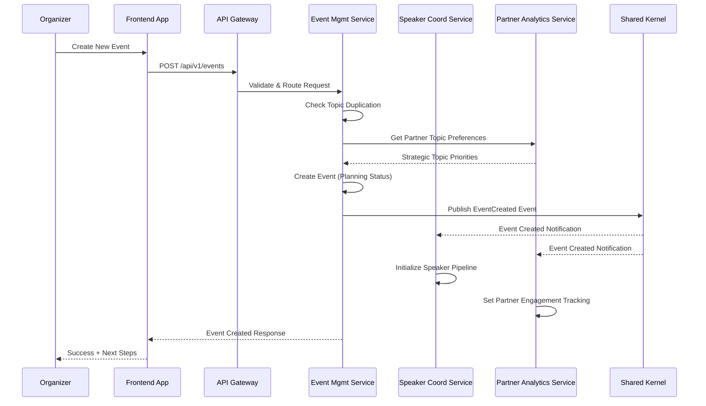

### Multi-Speaker Session Assignment

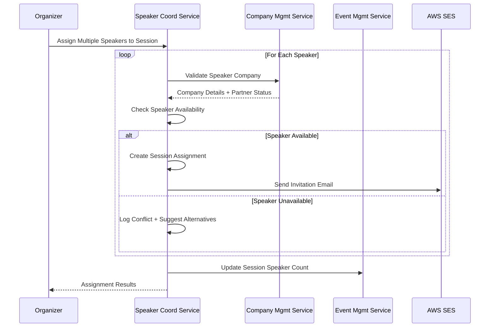

### Partner ROI Analytics Generation

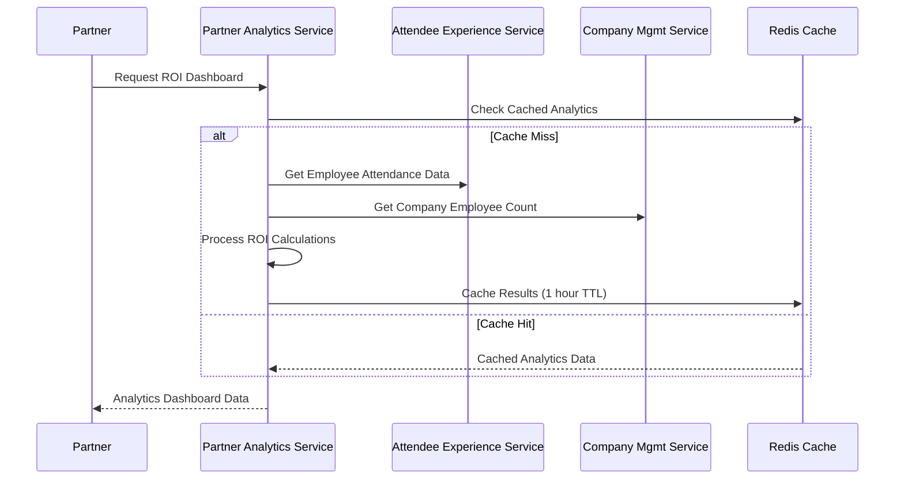

## Database Schema

### Event Management Service Database Schema

```sql
-- Events table (aggregate root)
CREATE TABLE events (
    id UUID PRIMARY KEY DEFAULT uuid_generate_v4(),
    event_number INTEGER UNIQUE NOT NULL,
    title VARCHAR(255) NOT NULL,
    description TEXT,
    event_date TIMESTAMP WITH TIME ZONE NOT NULL,
    registration_deadline TIMESTAMP WITH TIME ZONE NOT NULL,
    venue_name VARCHAR(255) NOT NULL,
    venue_address TEXT NOT NULL,
    venue_capacity INTEGER NOT NULL,
    status VARCHAR(50) NOT NULL CHECK (status IN (
        'planning', 'topic_defined', 'speakers_invited', 'agenda_draft',
        'published', 'registration_open', 'registration_closed',
        'in_progress', 'completed', 'archived'
    )),
    organizer_id UUID NOT NULL,
    current_attendee_count INTEGER DEFAULT 0,
    created_at TIMESTAMP WITH TIME ZONE DEFAULT NOW(),
    updated_at TIMESTAMP WITH TIME ZONE DEFAULT NOW(),
    published_at TIMESTAMP WITH TIME ZONE,
    metadata JSONB DEFAULT '{}'
);

-- Sessions table
CREATE TABLE sessions (
    id UUID PRIMARY KEY DEFAULT uuid_generate_v4(),
    event_id UUID NOT NULL REFERENCES events(id) ON DELETE CASCADE,
    title VARCHAR(255) NOT NULL,
    description TEXT,
    session_type VARCHAR(50) NOT NULL CHECK (session_type IN (
        'keynote', 'presentation', 'workshop', 'panel_discussion',
        'networking', 'break', 'lunch'
    )),
    start_time TIMESTAMP WITH TIME ZONE NOT NULL,
    end_time TIMESTAMP WITH TIME ZONE NOT NULL,
    room VARCHAR(100),
    capacity INTEGER,
    language VARCHAR(10) DEFAULT 'de',
    created_at TIMESTAMP WITH TIME ZONE DEFAULT NOW(),
    updated_at TIMESTAMP WITH TIME ZONE DEFAULT NOW()
);

-- Indexes for performance
CREATE INDEX idx_events_status ON events(status);
CREATE INDEX idx_events_event_date ON events(event_date);
CREATE INDEX idx_sessions_event_id ON sessions(event_id);
```

### Speaker Coordination Service Database Schema

```sql
-- Speakers table
CREATE TABLE speakers (
    id UUID PRIMARY KEY DEFAULT uuid_generate_v4(),
    email VARCHAR(255) UNIQUE NOT NULL,
    first_name VARCHAR(100) NOT NULL,
    last_name VARCHAR(100) NOT NULL,
    company_id UUID NOT NULL, -- References company service
    position VARCHAR(255),
    short_bio TEXT,
    detailed_bio TEXT,
    expertise_areas TEXT[] DEFAULT '{}',
    availability VARCHAR(50) NOT NULL CHECK (availability IN (
        'available', 'busy', 'unavailable', 'invited', 'confirmed', 'declined'
    )) DEFAULT 'available',
    created_at TIMESTAMP WITH TIME ZONE DEFAULT NOW(),
    updated_at TIMESTAMP WITH TIME ZONE DEFAULT NOW()
);

-- Session speaker assignments (many-to-many with roles)
CREATE TABLE session_speakers (
    id UUID PRIMARY KEY DEFAULT uuid_generate_v4(),
    session_id UUID NOT NULL, -- References event service
    speaker_id UUID NOT NULL REFERENCES speakers(id) ON DELETE CASCADE,
    role VARCHAR(50) NOT NULL CHECK (role IN (
        'primary_speaker', 'co_speaker', 'moderator', 'panelist'
    )),
    presentation_title VARCHAR(255),
    is_confirmed BOOLEAN DEFAULT FALSE,
    invited_at TIMESTAMP WITH TIME ZONE DEFAULT NOW(),
    confirmed_at TIMESTAMP WITH TIME ZONE,
    declined_at TIMESTAMP WITH TIME ZONE,
    created_at TIMESTAMP WITH TIME ZONE DEFAULT NOW(),
    updated_at TIMESTAMP WITH TIME ZONE DEFAULT NOW(),
    UNIQUE(session_id, speaker_id)
);

-- Indexes
CREATE INDEX idx_speakers_email ON speakers(email);
CREATE INDEX idx_speakers_company_id ON speakers(company_id);
CREATE INDEX idx_session_speakers_session_id ON session_speakers(session_id);
```

### Company Management Service Database Schema

```sql
-- Companies table
CREATE TABLE companies (
    id UUID PRIMARY KEY DEFAULT uuid_generate_v4(),
    name VARCHAR(255) NOT NULL,
    display_name VARCHAR(255) NOT NULL,
    is_partner BOOLEAN DEFAULT FALSE,
    website VARCHAR(500),
    industry VARCHAR(100),
    employee_count INTEGER,
    description TEXT,
    created_at TIMESTAMP WITH TIME ZONE DEFAULT NOW(),
    updated_at TIMESTAMP WITH TIME ZONE DEFAULT NOW(),
    created_by UUID NOT NULL
);

-- Company logos (simplified)
CREATE TABLE company_logos (
    id UUID PRIMARY KEY DEFAULT uuid_generate_v4(),
    company_id UUID NOT NULL REFERENCES companies(id) ON DELETE CASCADE,
    file_id VARCHAR(255) NOT NULL,
    file_name VARCHAR(255) NOT NULL,
    mime_type VARCHAR(100) NOT NULL,
    file_size_bytes BIGINT NOT NULL,
    s3_key VARCHAR(500) NOT NULL,
    uploaded_at TIMESTAMP WITH TIME ZONE DEFAULT NOW(),
    uploaded_by UUID NOT NULL,
    is_current BOOLEAN DEFAULT TRUE
);

-- Indexes
CREATE INDEX idx_companies_name ON companies(name);
CREATE INDEX idx_companies_is_partner ON companies(is_partner);
CREATE UNIQUE INDEX idx_company_current_logo ON company_logos(company_id) WHERE is_current = TRUE;
```

## Frontend Architecture

### Component Organization
```
web-frontend/src/
├── components/
│   ├── shared/                    # Reusable components across roles
│   │   ├── Layout/
│   │   ├── Navigation/
│   │   ├── Forms/
│   │   └── Company/
│   ├── organizer/                 # Organizer-specific components
│   │   ├── EventManagement/
│   │   ├── SpeakerCoordination/
│   │   └── Analytics/
│   ├── speaker/                   # Speaker-specific components
│   │   ├── Dashboard/
│   │   ├── Submissions/
│   │   └── Profile/
│   ├── partner/                   # Partner-specific components
│   │   ├── Analytics/
│   │   └── StrategicInput/
│   └── attendee/                  # Attendee-specific components
│       ├── Discovery/
│       ├── Events/
│       └── Content/
├── hooks/                         # Custom React hooks
├── services/                      # API client services
├── stores/                        # Zustand state stores
├── types/                         # TypeScript type definitions
└── utils/                         # Utility functions
```

### State Management Architecture

#### State Structure
```typescript
interface AppState {
  // Authentication state
  auth: {
    user: User | null;
    currentRole: UserRole;
    availableRoles: UserRole[];
    isAuthenticated: boolean;
  };

  // UI state
  ui: {
    sidebarOpen: boolean;
    notifications: Notification[];
    loading: Record<string, boolean>;
  };

  // Domain-specific state
  events: {
    currentEvent: Event | null;
    eventList: Event[];
    filters: EventFilters;
  };

  speakers: {
    speakerList: Speaker[];
    invitations: SpeakerInvitation[];
  };

  partners: {
    analytics: PartnerAnalytics | null;
    topicVotes: TopicVote[];
  };

  attendees: {
    registrations: EventRegistration[];
    bookmarks: ContentBookmark[];
  };

  companies: {
    companyList: Company[];
    selectedCompany: Company | null;
  };
}
```

### Detailed Component Specifications

#### Shared Component Architecture

**Layout Components:**
```typescript
// BaseLayout Component
interface BaseLayoutProps {
  children: React.ReactNode;
  currentRole: UserRole;
  user: User;
  notifications: Notification[];
}

const BaseLayout: React.FC<BaseLayoutProps> = ({
  children,
  currentRole,
  user,
  notifications
}) => {
  return (
    <Box sx={{ display: 'flex', minHeight: '100vh' }}>
      <AppHeader
        user={user}
        currentRole={currentRole}
        notifications={notifications}
      />
      <Sidebar currentRole={currentRole} />
      <MainContent>{children}</MainContent>
    </Box>
  );
};

// Navigation Component Specifications
interface NavigationItem {
  id: string;
  label: string;
  icon: React.ComponentType;
  path: string;
  roles: UserRole[];
  children?: NavigationItem[];
}

const navigationConfig: Record<UserRole, NavigationItem[]> = {
  [UserRole.ORGANIZER]: [
    {
      id: 'dashboard',
      label: 'Dashboard',
      icon: DashboardIcon,
      path: '/organizer/dashboard',
      roles: [UserRole.ORGANIZER]
    },
    {
      id: 'events',
      label: 'Event Management',
      icon: EventIcon,
      path: '/organizer/events',
      roles: [UserRole.ORGANIZER],
      children: [
        { id: 'create', label: 'Create Event', icon: AddIcon, path: '/organizer/events/create', roles: [UserRole.ORGANIZER] },
        { id: 'timeline', label: 'Event Timeline', icon: TimelineIcon, path: '/organizer/events/timeline', roles: [UserRole.ORGANIZER] }
      ]
    }
  ],
  // Additional role configurations...
};
```

**Form Components:**
```typescript
// Reusable Form Components with Validation
interface FormFieldProps<T> {
  name: keyof T;
  label: string;
  required?: boolean;
  validation?: (value: any) => string | undefined;
  disabled?: boolean;
}

// AutoComplete Company Selector
interface CompanySelectorProps {
  value: Company | null;
  onChange: (company: Company | null) => void;
  allowCreate?: boolean;
  roleFilter?: UserRole;
}

const CompanySelector: React.FC<CompanySelectorProps> = ({
  value,
  onChange,
  allowCreate = false,
  roleFilter
}) => {
  const { companies, searchCompanies, createCompany } = useCompanies();

  return (
    <Autocomplete
      options={companies}
      value={value}
      onChange={(_, newValue) => onChange(newValue)}
      getOptionLabel={(option) => option.name}
      renderInput={(params) => (
        <TextField {...params} label="Company" />
      )}
      freeSolo={allowCreate}
      onInputChange={async (_, inputValue) => {
        if (inputValue.length > 2) {
          await searchCompanies(inputValue);
        }
      }}
    />
  );
};
```

#### Role-Specific Component Specifications

**Organizer Components:**

```typescript
// Event Management Dashboard
interface EventDashboardProps {
  currentEvent: Event | null;
  upcomingEvents: Event[];
  onEventSelect: (event: Event) => void;
}

const EventDashboard: React.FC<EventDashboardProps> = ({
  currentEvent,
  upcomingEvents,
  onEventSelect
}) => {
  return (
    <Grid container spacing={3}>
      <Grid item xs={12} md={8}>
        <EventTimelineCard event={currentEvent} />
      </Grid>
      <Grid item xs={12} md={4}>
        <WorkflowStatusCard event={currentEvent} />
        <SpeakerStatusCard event={currentEvent} />
      </Grid>
    </Grid>
  );
};

// Speaker Coordination Workflow
interface SpeakerWorkflowProps {
  event: Event;
  speakers: Speaker[];
  invitations: SpeakerInvitation[];
  onStateChange: (speakerId: string, newState: SpeakerState) => void;
}

const SpeakerWorkflow: React.FC<SpeakerWorkflowProps> = ({
  event,
  speakers,
  invitations,
  onStateChange
}) => {
  const workflowSteps = [
    'OPEN',
    'CONTACTED',
    'READY',
    'DECLINED_ACCEPTED',
    'FINAL_AGENDA',
    'INFORMED'
  ];

  return (
    <Card>
      <CardHeader title="Speaker Pipeline" />
      <CardContent>
        {workflowSteps.map((step) => (
          <WorkflowStep
            key={step}
            step={step}
            speakers={speakers.filter(s => s.status === step)}
            onSpeakerAction={onStateChange}
          />
        ))}
      </CardContent>
    </Card>
  );
};
```

**Speaker Components:**

```typescript
// Speaker Dashboard Component
interface SpeakerDashboardProps {
  speaker: Speaker;
  invitations: SpeakerInvitation[];
  submissions: SpeakerSubmission[];
}

const SpeakerDashboard: React.FC<SpeakerDashboardProps> = ({
  speaker,
  invitations,
  submissions
}) => {
  return (
    <Container maxWidth="lg">
      <Typography variant="h4" gutterBottom>
        Welcome, {speaker.firstName}
      </Typography>

      <Grid container spacing={3}>
        <Grid item xs={12} md={6}>
          <PendingInvitationsCard invitations={invitations} />
        </Grid>
        <Grid item xs={12} md={6}>
          <UpcomingSessionsCard speaker={speaker} />
        </Grid>
        <Grid item xs={12}>
          <SubmissionHistoryCard submissions={submissions} />
        </Grid>
      </Grid>
    </Container>
  );
};

// Material Submission Form
interface MaterialSubmissionProps {
  sessionId: string;
  existingSubmission?: SpeakerSubmission;
  onSubmit: (submission: SpeakerSubmissionData) => Promise<void>;
}

const MaterialSubmissionForm: React.FC<MaterialSubmissionProps> = ({
  sessionId,
  existingSubmission,
  onSubmit
}) => {
  const [formData, setFormData] = useState<SpeakerSubmissionData>({
    title: existingSubmission?.title || '',
    abstract: existingSubmission?.abstract || '',
    biography: existingSubmission?.biography || '',
    materials: existingSubmission?.materials || []
  });

  return (
    <Card>
      <CardHeader title="Submit Session Materials" />
      <CardContent>
        <Stack spacing={3}>
          <TextField
            label="Session Title"
            value={formData.title}
            onChange={(e) => setFormData(prev => ({ ...prev, title: e.target.value }))}
            fullWidth
            required
          />

          <TextField
            label="Abstract"
            value={formData.abstract}
            onChange={(e) => setFormData(prev => ({ ...prev, abstract: e.target.value }))}
            multiline
            rows={4}
            fullWidth
            required
          />

          <FileUploadZone
            acceptedTypes={['.pdf', '.pptx', '.jpg', '.png']}
            maxSize={10 * 1024 * 1024} // 10MB
            onFilesAdd={(files) => setFormData(prev => ({
              ...prev,
              materials: [...prev.materials, ...files]
            }))}
          />
        </Stack>
      </CardContent>
    </Card>
  );
};
```

**Partner Components:**

```typescript
// Partner Analytics Dashboard
interface PartnerAnalyticsDashboardProps {
  partner: Partner;
  analytics: PartnerAnalytics;
  timeRange: TimeRange;
  onTimeRangeChange: (range: TimeRange) => void;
}

const PartnerAnalyticsDashboard: React.FC<PartnerAnalyticsDashboardProps> = ({
  partner,
  analytics,
  timeRange,
  onTimeRangeChange
}) => {
  return (
    <Container maxWidth="xl">
      <Box sx={{ mb: 3, display: 'flex', justifyContent: 'space-between', alignItems: 'center' }}>
        <Typography variant="h4">
          {partner.company.name} Analytics
        </Typography>
        <TimeRangeSelector
          value={timeRange}
          onChange={onTimeRangeChange}
        />
      </Box>

      <Grid container spacing={3}>
        <Grid item xs={12} md={3}>
          <MetricCard
            title="Employee Attendance"
            value={analytics.employeeAttendance.total}
            trend={analytics.employeeAttendance.trend}
            format="number"
          />
        </Grid>
        <Grid item xs={12} md={3}>
          <MetricCard
            title="Brand Exposure Score"
            value={analytics.brandExposure.score}
            trend={analytics.brandExposure.trend}
            format="percentage"
          />
        </Grid>
        <Grid item xs={12} md={6}>
          <ROIChart data={analytics.roiData} />
        </Grid>
        <Grid item xs={12}>
          <EngagementTable data={analytics.engagementMetrics} />
        </Grid>
      </Grid>
    </Container>
  );
};

// Topic Voting Interface
interface TopicVotingProps {
  availableTopics: Topic[];
  existingVotes: TopicVote[];
  votingPower: number;
  onVoteSubmit: (votes: TopicVoteData[]) => Promise<void>;
}

const TopicVotingInterface: React.FC<TopicVotingProps> = ({
  availableTopics,
  existingVotes,
  votingPower,
  onVoteSubmit
}) => {
  const [votes, setVotes] = useState<Record<string, number>>({});
  const totalVotesUsed = Object.values(votes).reduce((sum, vote) => sum + vote, 0);

  return (
    <Card>
      <CardHeader
        title="Strategic Topic Voting"
        subheader={`${votingPower - totalVotesUsed} votes remaining`}
      />
      <CardContent>
        <Stack spacing={2}>
          {availableTopics.map((topic) => (
            <TopicVoteCard
              key={topic.id}
              topic={topic}
              currentVote={votes[topic.id] || 0}
              onVoteChange={(newVote) => setVotes(prev => ({ ...prev, [topic.id]: newVote }))}
              disabled={totalVotesUsed >= votingPower && !votes[topic.id]}
            />
          ))}
        </Stack>
      </CardContent>
    </Card>
  );
};
```

**Attendee Components:**

```typescript
// Content Discovery Engine
interface ContentDiscoveryProps {
  searchQuery: string;
  filters: ContentFilters;
  results: SearchResult[];
  onSearch: (query: string, filters: ContentFilters) => void;
  onBookmark: (contentId: string) => void;
}

const ContentDiscovery: React.FC<ContentDiscoveryProps> = ({
  searchQuery,
  filters,
  results,
  onSearch,
  onBookmark
}) => {
  return (
    <Container maxWidth="lg">
      <Box sx={{ mb: 3 }}>
        <SearchBar
          value={searchQuery}
          onSearch={(query) => onSearch(query, filters)}
          placeholder="Search 20+ years of BATbern content..."
        />
        <FilterPanel
          filters={filters}
          onChange={(newFilters) => onSearch(searchQuery, newFilters)}
        />
      </Box>

      <Grid container spacing={2}>
        {results.map((result) => (
          <Grid item xs={12} md={6} lg={4} key={result.id}>
            <ContentCard
              content={result}
              onBookmark={() => onBookmark(result.id)}
              onView={() => window.open(result.url, '_blank')}
            />
          </Grid>
        ))}
      </Grid>
    </Container>
  );
};

// Event Registration Component
interface EventRegistrationProps {
  event: Event;
  existingRegistration?: EventRegistration;
  onRegister: (registration: RegistrationData) => Promise<void>;
}

const EventRegistration: React.FC<EventRegistrationProps> = ({
  event,
  existingRegistration,
  onRegister
}) => {
  const [registrationData, setRegistrationData] = useState<RegistrationData>({
    attendeeType: existingRegistration?.attendeeType || 'GENERAL',
    dietaryRequirements: existingRegistration?.dietaryRequirements || '',
    networkingOptIn: existingRegistration?.networkingOptIn || true
  });

  return (
    <Card>
      <CardHeader title={`Register for ${event.title}`} />
      <CardContent>
        <Stack spacing={3}>
          <EventDetailsCard event={event} />

          <FormControl fullWidth>
            <InputLabel>Attendee Type</InputLabel>
            <Select
              value={registrationData.attendeeType}
              onChange={(e) => setRegistrationData(prev => ({
                ...prev,
                attendeeType: e.target.value as AttendeeType
              }))}
            >
              <MenuItem value="GENERAL">General Attendee</MenuItem>
              <MenuItem value="STUDENT">Student</MenuItem>
              <MenuItem value="SPEAKER">Speaker</MenuItem>
            </Select>
          </FormControl>

          <TextField
            label="Dietary Requirements (Optional)"
            value={registrationData.dietaryRequirements}
            onChange={(e) => setRegistrationData(prev => ({
              ...prev,
              dietaryRequirements: e.target.value
            }))}
            multiline
            rows={2}
            fullWidth
          />

          <FormControlLabel
            control={
              <Checkbox
                checked={registrationData.networkingOptIn}
                onChange={(e) => setRegistrationData(prev => ({
                  ...prev,
                  networkingOptIn: e.target.checked
                }))}
              />
            }
            label="I'd like to participate in networking activities"
          />
        </Stack>
      </CardContent>
    </Card>
  );
};
```

#### Component Development Standards

**TypeScript Interface Patterns:**
```typescript
// Props interfaces should be explicitly defined
interface ComponentNameProps {
  // Required props first
  requiredProp: string;
  onAction: (data: ActionData) => void;

  // Optional props second with defaults
  variant?: 'primary' | 'secondary';
  disabled?: boolean;
  children?: React.ReactNode;
}

// Use generic constraints for flexible components
interface DataTableProps<T extends { id: string }> {
  data: T[];
  columns: TableColumn<T>[];
  onRowClick?: (row: T) => void;
}
```

**Error Boundary Implementation:**
```typescript
class ComponentErrorBoundary extends React.Component<
  { children: React.ReactNode; fallback: React.ComponentType<{ error: Error }> },
  { hasError: boolean; error: Error | null }
> {
  constructor(props: any) {
    super(props);
    this.state = { hasError: false, error: null };
  }

  static getDerivedStateFromError(error: Error) {
    return { hasError: true, error };
  }

  componentDidCatch(error: Error, errorInfo: React.ErrorInfo) {
    console.error('Component Error:', error, errorInfo);
    // Log to monitoring service
    Sentry.captureException(error, { extra: errorInfo });
  }

  render() {
    if (this.state.hasError && this.state.error) {
      const FallbackComponent = this.props.fallback;
      return <FallbackComponent error={this.state.error} />;
    }

    return this.props.children;
  }
}
```

### Routing Architecture

```
/                              # Public home page
/current-event                 # Current BATbern event landing
/auth/login                    # Authentication

# Organizer routes
/organizer/dashboard          # Organizer main dashboard
/organizer/events             # Event management
/organizer/speakers           # Speaker database
/organizer/analytics          # Cross-domain analytics

# Speaker routes
/speaker/dashboard            # Speaker main dashboard
/speaker/invitations          # Speaking invitations
/speaker/sessions             # My sessions
/speaker/profile              # Speaker profile management

# Partner routes
/partner/dashboard            # Partner main dashboard
/partner/analytics            # ROI analytics dashboard
/partner/voting               # Topic voting interface

# Attendee routes
/attendee/dashboard           # Attendee main dashboard
/attendee/events              # Event discovery
/attendee/search              # Content search
/attendee/content             # My bookmarked content

# Shared routes (role-adaptive)
/companies                    # Company management
/profile                      # User profile (adapts to role)
```

## Backend Architecture

### Service Architecture Pattern
```
services/{domain-service}/
├── src/main/java/ch/batbern/{domain}/
│   ├── controller/                     # REST API controllers
│   ├── service/                        # Business logic layer
│   ├── repository/                     # Data access layer
│   ├── domain/                         # Domain models and entities
│   ├── dto/                           # Data transfer objects
│   ├── exception/                     # Custom exceptions
│   └── security/                      # Security components
├── src/main/resources/
│   ├── application.yml                # Configuration
│   └── db/migration/                  # Flyway migrations
└── build.gradle                      # Build configuration
```

### Authentication and Authorization

#### JWT Authentication Flow
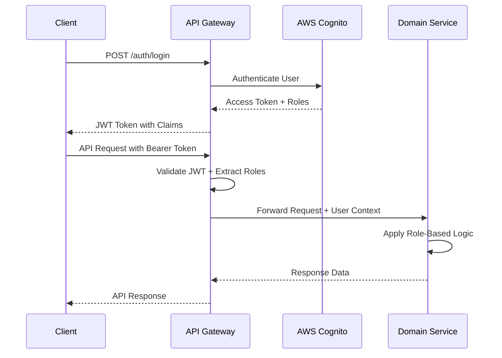

## Unified Project Structure

```
BATbern-Platform/
├── shared-kernel/                     # Shared types, events, utilities
├── services/                          # Domain services
│   ├── event-management/              # Event Management Service
│   ├── speaker-coordination/          # Speaker Coordination Service
│   ├── partner-analytics/             # Partner Analytics Service
│   ├── attendee-experience/           # Attendee Experience Service
│   └── company-management/            # Company Management Service
├── api-gateway/                       # Unified API Gateway
├── web-frontend/                      # React Frontend Application
├── infrastructure/                    # Infrastructure as Code
│   ├── global-stacks/                 # Region-independent resources
│   ├── core-infrastructure/           # Regional shared resources
│   ├── domain-stacks/                 # Per-domain infrastructure
│   └── environments/                  # Environment-specific configs
├── e2e-tests/                         # End-to-end tests
├── scripts/                           # Build and deployment scripts
├── docs/                              # Documentation
└── README.md                          # Project overview
```

## Development Workflow

### Local Development Setup

#### Prerequisites
```bash
java --version          # Java 21 LTS
node --version         # Node.js 20+
docker --version       # Docker Desktop
aws --version          # AWS CLI v2
cdk --version          # AWS CDK v2.110+
gradle --version       # Gradle 8.5+
```

#### Initial Setup
```bash
# Clone and setup shared kernel
cd shared-kernel
./gradlew publishToMavenLocal

# Setup infrastructure
cd infrastructure
npm install && npm run build

# Setup frontend
cd web-frontend
npm install && npm run build

# Setup each domain service
for service in event-management speaker-coordination partner-analytics attendee-experience company-management; do
  cd services/$service && ./gradlew build && cd ../..
done

# Start local environment
docker-compose up -d
```

#### Development Commands
```bash
# Start all services
npm run dev:all

# Start individual services
npm run dev:frontend
npm run dev:event-management
# etc.

# Run tests
npm run test:all
npm run test:frontend
npm run test:backend
npm run test:integration
npm run test:e2e
```

### Environment Configuration

#### Frontend Environment Variables
```bash
VITE_API_BASE_URL=http://localhost:8080
VITE_COGNITO_USER_POOL_ID=eu-central-1_dev_pool
VITE_COGNITO_CLIENT_ID=dev_client_id
VITE_PWA_ENABLED=true
VITE_FEATURE_AI_RECOMMENDATIONS=true
```

#### Backend Environment Variables
```bash
DB_HOST=localhost
DB_PORT=5432
DB_NAME=batbern_dev
REDIS_HOST=localhost
AWS_REGION=eu-central-1
JWT_SECRET=dev-secret-key
COGNITO_USER_POOL_ID=eu-central-1_dev_pool
```

## Deployment Architecture

### Deployment Strategy

**Frontend Deployment:**
- **Platform:** AWS CloudFront + S3
- **Build Command:** `npm run build`
- **Output Directory:** `dist/`
- **CDN/Edge:** CloudFront with edge locations for global distribution

**Backend Deployment:**
- **Platform:** AWS ECS Fargate with Application Load Balancer
- **Build Command:** `./gradlew bootBuildImage`
- **Deployment Method:** Blue/Green deployment with health checks

### CI/CD Pipeline

**Daily Build Pipeline:**
- Shared kernel build and test
- Domain services parallel build
- Frontend build and test
- Integration tests
- Deployment to staging (on main branch)

**Production Deployment:**
- Manual approval required
- Blue/Green deployment
- Health checks and monitoring
- DNS output for Hostpoint configuration

### Environments

| Environment | Frontend URL | Backend URL | Purpose |
|-------------|--------------|-------------|---------|
| Development | http://localhost:3000 | http://localhost:8080 | Local development |
| Staging | https://staging.berner-architekten-treffen.ch | https://api-staging.berner-architekten-treffen.ch | Pre-production testing |
| Production | https://www.berner-architekten-treffen.ch | https://api.berner-architekten-treffen.ch | Live Swiss conference platform |

## Security and Performance

### Security Requirements

**Frontend Security:**
- CSP Headers: Strict content security policy
- XSS Prevention: Input sanitization and output encoding
- Secure Storage: Encrypted localStorage for sensitive data

**Backend Security:**
- Input Validation: Comprehensive request validation
- Rate Limiting: API rate limiting per user and endpoint
- CORS Policy: Restrictive CORS configuration

**Authentication Security:**
- Token Storage: Secure JWT storage with automatic refresh
- Session Management: Cognito-based session management
- Password Policy: Strong password requirements

### Performance Benchmarks and SLAs

#### Service Level Agreements (SLAs)

**Platform Availability SLAs:**

| Service Tier | Availability Target | Monthly Downtime | Response Time (P95) | Error Rate |
|--------------|--------------------|--------------------|-------------------|------------|
| **Production** | 99.9% | < 43 minutes | < 200ms | < 0.1% |
| **Staging** | 99.0% | < 7.2 hours | < 500ms | < 1.0% |
| **Development** | 95.0% | < 36 hours | < 1000ms | < 5.0% |

**Business SLA Commitments:**
- **Event Registration**: 99.5% availability during registration periods
- **Speaker Portal**: 99.0% availability during submission deadlines
- **Partner Analytics**: 98.0% availability for monthly reporting
- **Content Discovery**: 99.9% availability for public access

#### Detailed Performance Benchmarks

**Frontend Performance Standards:**

```yaml
# Web Vitals Targets (Real User Monitoring)
Core Web Vitals:
  First Contentful Paint (FCP):
    target: "< 1.5s"
    warning: "> 2.0s"
    critical: "> 3.0s"
    measurement: "75th percentile"

  Largest Contentful Paint (LCP):
    target: "< 2.5s"
    warning: "> 3.0s"
    critical: "> 4.0s"
    measurement: "75th percentile"

  First Input Delay (FID):
    target: "< 100ms"
    warning: "> 200ms"
    critical: "> 300ms"
    measurement: "75th percentile"

  Cumulative Layout Shift (CLS):
    target: "< 0.1"
    warning: "> 0.15"
    critical: "> 0.25"
    measurement: "75th percentile"

  Interaction to Next Paint (INP):
    target: "< 200ms"
    warning: "> 300ms"
    critical: "> 500ms"
    measurement: "75th percentile"

# Resource Performance
Bundle Performance:
  initial_bundle_size:
    target: "< 250KB gzipped"
    warning: "> 400KB gzipped"
    critical: "> 500KB gzipped"

  total_bundle_size:
    target: "< 1MB gzipped"
    warning: "> 1.5MB gzipped"
    critical: "> 2MB gzipped"

  code_splitting_ratio:
    target: "> 80% lazy loaded"
    warning: "< 70% lazy loaded"
    critical: "< 50% lazy loaded"

# Network Performance
Network Efficiency:
  time_to_interactive:
    target: "< 3s"
    warning: "> 5s"
    critical: "> 8s"

  lighthouse_performance_score:
    target: "> 90"
    warning: "< 80"
    critical: "< 70"

  total_blocking_time:
    target: "< 300ms"
    warning: "> 600ms"
    critical: "> 1000ms"
```

**Backend Service Performance Benchmarks:**

```yaml
# API Gateway Performance
API Gateway:
  response_time_p50: "< 50ms"
  response_time_p95: "< 200ms"
  response_time_p99: "< 500ms"
  throughput: "> 1000 req/min"
  error_rate: "< 0.1%"

# Domain Service Performance
Event Management Service:
  endpoints:
    "GET /events":
      p95_response_time: "< 150ms"
      throughput: "> 500 req/min"
      cache_hit_ratio: "> 80%"

    "POST /events":
      p95_response_time: "< 300ms"
      throughput: "> 100 req/min"
      validation_time: "< 50ms"

    "GET /events/{id}/timeline":
      p95_response_time: "< 200ms"
      throughput: "> 200 req/min"
      complexity: "O(log n)"

Speaker Coordination Service:
  endpoints:
    "GET /speakers":
      p95_response_time: "< 100ms"
      throughput: "> 300 req/min"
      database_query_time: "< 30ms"

    "POST /speakers/invitations":
      p95_response_time: "< 250ms"
      throughput: "> 50 req/min"
      email_delivery_sla: "< 5 minutes"

    "PUT /speakers/{id}/status":
      p95_response_time: "< 150ms"
      throughput: "> 100 req/min"
      state_transition_time: "< 10ms"

Partner Analytics Service:
  endpoints:
    "GET /analytics/dashboard":
      p95_response_time: "< 500ms"
      throughput: "> 100 req/min"
      data_freshness: "< 5 minutes"

    "GET /analytics/reports/roi":
      p95_response_time: "< 2000ms"
      throughput: "> 20 req/min"
      report_generation_time: "< 30 seconds"

Attendee Experience Service:
  endpoints:
    "GET /search":
      p95_response_time: "< 300ms"
      throughput: "> 500 req/min"
      search_relevance_score: "> 85%"

    "GET /content/recommendations":
      p95_response_time: "< 400ms"
      throughput: "> 200 req/min"
      ml_inference_time: "< 100ms"
```

**Database Performance Standards:**

```yaml
# PostgreSQL Performance
Database Performance:
  connection_pool_utilization: "< 70%"
  query_performance:
    simple_selects: "< 10ms"
    complex_joins: "< 100ms"
    aggregations: "< 200ms"
    full_text_search: "< 500ms"

  indexing_efficiency:
    index_hit_ratio: "> 95%"
    table_scan_ratio: "< 5%"

  replication_lag: "< 100ms"

# Redis Cache Performance
Cache Performance:
  hit_ratio: "> 90%"
  response_time: "< 5ms"
  memory_utilization: "< 80%"
  eviction_rate: "< 1%"
```

#### Load Testing Specifications

**Load Testing Scenarios:**

```typescript
// Load Testing Configuration
interface LoadTestScenario {
  name: string;
  duration: string;
  virtualUsers: number;
  rampUpTime: string;
  endpoints: EndpointLoad[];
}

const loadTestScenarios: LoadTestScenario[] = [
  {
    name: "Normal Operation",
    duration: "30 minutes",
    virtualUsers: 100,
    rampUpTime: "5 minutes",
    endpoints: [
      { path: "/events", method: "GET", weight: 40, expectedResponse: 200 },
      { path: "/search", method: "GET", weight: 30, expectedResponse: 200 },
      { path: "/speakers/dashboard", method: "GET", weight: 20, expectedResponse: 200 },
      { path: "/analytics/dashboard", method: "GET", weight: 10, expectedResponse: 200 }
    ]
  },
  {
    name: "Peak Registration Load",
    duration: "60 minutes",
    virtualUsers: 500,
    rampUpTime: "10 minutes",
    endpoints: [
      { path: "/events/register", method: "POST", weight: 60, expectedResponse: 201 },
      { path: "/events/current", method: "GET", weight: 40, expectedResponse: 200 }
    ]
  },
  {
    name: "Speaker Submission Deadline",
    duration: "45 minutes",
    virtualUsers: 200,
    rampUpTime: "5 minutes",
    endpoints: [
      { path: "/speakers/submissions", method: "POST", weight: 50, expectedResponse: 201 },
      { path: "/speakers/submissions", method: "PUT", weight: 30, expectedResponse: 200 },
      { path: "/speakers/dashboard", method: "GET", weight: 20, expectedResponse: 200 }
    ]
  },
  {
    name: "Partner Analytics Usage",
    duration: "20 minutes",
    virtualUsers: 50,
    rampUpTime: "2 minutes",
    endpoints: [
      { path: "/analytics/dashboard", method: "GET", weight: 40, expectedResponse: 200 },
      { path: "/analytics/reports/roi", method: "GET", weight: 30, expectedResponse: 200 },
      { path: "/analytics/export", method: "POST", weight: 20, expectedResponse: 200 },
      { path: "/voting/topics", method: "GET", weight: 10, expectedResponse: 200 }
    ]
  }
];
```

**Performance Testing Pipeline:**

```yaml
# performance-tests.yml (GitHub Actions)
name: Performance Testing

on:
  schedule:
    - cron: '0 2 * * 1'  # Weekly on Monday 2 AM
  workflow_dispatch:

jobs:
  load-testing:
    runs-on: ubuntu-latest
    strategy:
      matrix:
        scenario: [normal, peak-registration, speaker-deadline, partner-analytics]

    steps:
    - name: Run k6 Load Test
      uses: grafana/k6-action@v0.3.0
      with:
        filename: tests/load/scenario-${{ matrix.scenario }}.js
        flags: --out statsd

    - name: Performance Assertion
      run: |
        # Assert performance metrics meet SLA requirements
        if [ "${{ matrix.scenario }}" = "normal" ]; then
          k6 run --threshold "http_req_duration{p(95)}<200" tests/load/normal.js
        fi

    - name: Upload Results
      uses: actions/upload-artifact@v4
      with:
        name: performance-results-${{ matrix.scenario }}
        path: results/
```

#### Performance Monitoring and Alerting

**Real-time Performance Monitoring:**

```typescript
// Performance monitoring configuration
interface PerformanceAlert {
  metric: string;
  threshold: number;
  window: string;
  severity: 'warning' | 'critical';
  action: string;
}

const performanceAlerts: PerformanceAlert[] = [
  {
    metric: "api_response_time_p95",
    threshold: 300,
    window: "5 minutes",
    severity: "warning",
    action: "Scale up backend services"
  },
  {
    metric: "frontend_lcp_p75",
    threshold: 4000,
    window: "10 minutes",
    severity: "critical",
    action: "Emergency frontend optimization"
  },
  {
    metric: "database_connection_pool_usage",
    threshold: 80,
    window: "2 minutes",
    severity: "warning",
    action: "Scale database connections"
  },
  {
    metric: "cache_hit_ratio",
    threshold: 85,
    window: "5 minutes",
    severity: "warning",
    action: "Review cache strategy"
  }
];
```

#### Capacity Planning

**Resource Scaling Thresholds:**

| Resource | Scale Up Trigger | Scale Down Trigger | Max Instances | Min Instances |
|----------|-----------------|-------------------|---------------|---------------|
| **API Gateway** | CPU > 70% for 5 min | CPU < 30% for 15 min | 10 | 2 |
| **Event Service** | CPU > 60% for 3 min | CPU < 25% for 10 min | 6 | 2 |
| **Speaker Service** | CPU > 65% for 3 min | CPU < 20% for 10 min | 4 | 1 |
| **Partner Service** | CPU > 70% for 5 min | CPU < 30% for 15 min | 3 | 1 |
| **Attendee Service** | CPU > 60% for 3 min | CPU < 25% for 10 min | 8 | 2 |
| **Database** | Connections > 80% | Connections < 40% | 100 | 20 |
| **Redis Cache** | Memory > 75% | Memory < 50% | 4GB | 1GB |

**Annual Growth Projections:**

- **User Base Growth**: 25% year-over-year
- **Content Volume Growth**: 30% year-over-year
- **API Usage Growth**: 40% year-over-year
- **Storage Requirements**: 35% year-over-year

#### Performance Optimization Strategies

**Frontend Optimization:**
1. **Code Splitting**: Route-based and component-based splitting
2. **Image Optimization**: WebP format, responsive images, lazy loading
3. **Service Worker**: Offline capability, resource caching
4. **CDN Optimization**: Geographic distribution, edge caching
5. **Bundle Analysis**: Regular analysis and optimization

**Backend Optimization:**
1. **Database Indexing**: Optimized queries and composite indexes
2. **Connection Pooling**: Efficient database connection management
3. **Caching Strategy**: Multi-layer caching (Redis, CDN, application)
4. **Async Processing**: Background jobs for heavy operations
5. **Circuit Breakers**: Fault tolerance and graceful degradation

**Infrastructure Optimization:**
1. **Auto Scaling**: Predictive scaling based on historical patterns
2. **Load Balancing**: Intelligent request distribution
3. **Resource Monitoring**: Proactive resource management
4. **Cost Optimization**: Right-sizing instances and reserved capacity

## Accessibility Implementation Guidelines

### Accessibility Standards and Compliance

**Compliance Targets:**
- **WCAG 2.1 Level AA**: Primary compliance standard for all user interfaces
- **Swiss Accessibility Laws**: Compliance with Swiss federal accessibility requirements
- **Section 508**: US accessibility standards for government compatibility
- **EN 301 549**: European accessibility standard for ICT procurement

**Accessibility Audit Schedule:**
- **Automated Testing**: Daily during development with axe-core
- **Manual Testing**: Weekly accessibility reviews during sprint cycles
- **Expert Audit**: Quarterly professional accessibility audits
- **User Testing**: Semi-annual testing with users who have disabilities

### Frontend Accessibility Architecture

#### Core Accessibility Framework

```typescript
// Accessibility Provider Configuration
import { AccessibilityProvider } from '@/providers/AccessibilityProvider';

interface AccessibilityConfig {
  reducedMotion: boolean;
  highContrast: boolean;
  fontSize: 'small' | 'medium' | 'large' | 'extra-large';
  screenReader: boolean;
  keyboardNavigation: boolean;
}

const AccessibilityProvider: React.FC<{ children: React.ReactNode }> = ({ children }) => {
  const [config, setConfig] = useState<AccessibilityConfig>({
    reducedMotion: window.matchMedia('(prefers-reduced-motion: reduce)').matches,
    highContrast: window.matchMedia('(prefers-contrast: high)').matches,
    fontSize: 'medium',
    screenReader: false,
    keyboardNavigation: true
  });

  useEffect(() => {
    // Detect screen reader usage
    const detectScreenReader = () => {
      const hasScreenReader = window.speechSynthesis?.speaking ||
                             navigator.userAgent.includes('NVDA') ||
                             navigator.userAgent.includes('JAWS');
      setConfig(prev => ({ ...prev, screenReader: hasScreenReader }));
    };

    detectScreenReader();
  }, []);

  return (
    <AccessibilityContext.Provider value={{ config, setConfig }}>
      <div
        className={clsx(
          config.highContrast && 'high-contrast',
          config.reducedMotion && 'reduced-motion',
          `font-size-${config.fontSize}`
        )}
      >
        {children}
      </div>
    </AccessibilityContext.Provider>
  );
};
```

#### Semantic HTML and ARIA Implementation

**Component Accessibility Standards:**

```typescript
// Accessible Form Components
interface AccessibleFormFieldProps {
  id: string;
  label: string;
  error?: string;
  helpText?: string;
  required?: boolean;
  children: React.ReactNode;
}

const AccessibleFormField: React.FC<AccessibleFormFieldProps> = ({
  id,
  label,
  error,
  helpText,
  required,
  children
}) => {
  const helpTextId = helpText ? `${id}-help` : undefined;
  const errorId = error ? `${id}-error` : undefined;
  const describedBy = [helpTextId, errorId].filter(Boolean).join(' ');

  return (
    <div className="form-field">
      <label
        htmlFor={id}
        className={clsx('form-label', required && 'required')}
      >
        {label}
        {required && (
          <span aria-label="required" className="required-indicator">
            *
          </span>
        )}
      </label>

      {React.cloneElement(children as React.ReactElement, {
        id,
        'aria-describedby': describedBy || undefined,
        'aria-invalid': error ? 'true' : 'false',
        'aria-required': required || undefined
      })}

      {helpText && (
        <div id={helpTextId} className="help-text">
          {helpText}
        </div>
      )}

      {error && (
        <div
          id={errorId}
          className="error-text"
          role="alert"
          aria-live="polite"
        >
          {error}
        </div>
      )}
    </div>
  );
};

// Accessible Data Table
interface AccessibleTableProps<T> {
  data: T[];
  columns: TableColumn<T>[];
  caption: string;
  sortable?: boolean;
  selectable?: boolean;
}

const AccessibleTable = <T extends Record<string, any>>({
  data,
  columns,
  caption,
  sortable = false,
  selectable = false
}: AccessibleTableProps<T>) => {
  const [sortConfig, setSortConfig] = useState<{ key: string; direction: 'asc' | 'desc' } | null>(null);
  const [selectedRows, setSelectedRows] = useState<Set<string>>(new Set());

  return (
    <table
      role="table"
      aria-label={caption}
      className="accessible-table"
    >
      <caption className="sr-only">{caption}</caption>

      <thead>
        <tr role="row">
          {selectable && (
            <th scope="col" role="columnheader">
              <input
                type="checkbox"
                aria-label="Select all rows"
                onChange={(e) => {
                  if (e.target.checked) {
                    setSelectedRows(new Set(data.map((_, index) => index.toString())));
                  } else {
                    setSelectedRows(new Set());
                  }
                }}
                checked={selectedRows.size === data.length && data.length > 0}
                indeterminate={selectedRows.size > 0 && selectedRows.size < data.length}
              />
            </th>
          )}

          {columns.map((column) => (
            <th
              key={column.key}
              scope="col"
              role="columnheader"
              aria-sort={
                sortConfig?.key === column.key
                  ? sortConfig.direction === 'asc' ? 'ascending' : 'descending'
                  : sortable ? 'none' : undefined
              }
            >
              {sortable ? (
                <button
                  onClick={() => handleSort(column.key)}
                  className="sort-button"
                  aria-label={`Sort by ${column.header}`}
                >
                  {column.header}
                  <SortIcon direction={sortConfig?.key === column.key ? sortConfig.direction : null} />
                </button>
              ) : (
                column.header
              )}
            </th>
          ))}
        </tr>
      </thead>

      <tbody>
        {data.map((row, index) => (
          <tr
            key={index}
            role="row"
            aria-selected={selectable ? selectedRows.has(index.toString()) : undefined}
          >
            {selectable && (
              <td role="gridcell">
                <input
                  type="checkbox"
                  aria-label={`Select row ${index + 1}`}
                  checked={selectedRows.has(index.toString())}
                  onChange={(e) => {
                    const newSelected = new Set(selectedRows);
                    if (e.target.checked) {
                      newSelected.add(index.toString());
                    } else {
                      newSelected.delete(index.toString());
                    }
                    setSelectedRows(newSelected);
                  }}
                />
              </td>
            )}

            {columns.map((column) => (
              <td key={column.key} role="gridcell">
                {column.render ? column.render(row[column.key], row) : row[column.key]}
              </td>
            ))}
          </tr>
        ))}
      </tbody>
    </table>
  );
};
```

#### Focus Management and Keyboard Navigation

```typescript
// Focus Management Hook
export const useFocusManagement = () => {
  const [focusableElements, setFocusableElements] = useState<HTMLElement[]>([]);
  const [currentFocusIndex, setCurrentFocusIndex] = useState(0);

  const focusableSelectors = [
    'button:not([disabled])',
    'input:not([disabled])',
    'select:not([disabled])',
    'textarea:not([disabled])',
    'a[href]',
    '[tabindex]:not([tabindex="-1"])'
  ].join(', ');

  const updateFocusableElements = useCallback((container: HTMLElement) => {
    const elements = Array.from(container.querySelectorAll(focusableSelectors)) as HTMLElement[];
    setFocusableElements(elements);
    setCurrentFocusIndex(0);
  }, []);

  const handleKeyNavigation = useCallback((event: KeyboardEvent) => {
    if (focusableElements.length === 0) return;

    switch (event.key) {
      case 'ArrowDown':
      case 'ArrowRight':
        event.preventDefault();
        setCurrentFocusIndex((prev) => {
          const nextIndex = (prev + 1) % focusableElements.length;
          focusableElements[nextIndex]?.focus();
          return nextIndex;
        });
        break;

      case 'ArrowUp':
      case 'ArrowLeft':
        event.preventDefault();
        setCurrentFocusIndex((prev) => {
          const nextIndex = prev === 0 ? focusableElements.length - 1 : prev - 1;
          focusableElements[nextIndex]?.focus();
          return nextIndex;
        });
        break;

      case 'Home':
        event.preventDefault();
        focusableElements[0]?.focus();
        setCurrentFocusIndex(0);
        break;

      case 'End':
        event.preventDefault();
        const lastIndex = focusableElements.length - 1;
        focusableElements[lastIndex]?.focus();
        setCurrentFocusIndex(lastIndex);
        break;
    }
  }, [focusableElements]);

  return {
    updateFocusableElements,
    handleKeyNavigation,
    currentFocusIndex
  };
};

// Accessible Modal Component
interface AccessibleModalProps {
  isOpen: boolean;
  onClose: () => void;
  title: string;
  children: React.ReactNode;
}

const AccessibleModal: React.FC<AccessibleModalProps> = ({
  isOpen,
  onClose,
  title,
  children
}) => {
  const modalRef = useRef<HTMLDivElement>(null);
  const previousActiveElement = useRef<HTMLElement | null>(null);
  const { updateFocusableElements, handleKeyNavigation } = useFocusManagement();

  useEffect(() => {
    if (isOpen) {
      previousActiveElement.current = document.activeElement as HTMLElement;

      if (modalRef.current) {
        updateFocusableElements(modalRef.current);
        // Focus first focusable element
        const firstFocusable = modalRef.current.querySelector(
          'button, input, select, textarea, a[href], [tabindex]:not([tabindex="-1"])'
        ) as HTMLElement;
        firstFocusable?.focus();
      }

      // Trap focus within modal
      document.addEventListener('keydown', handleKeyNavigation);
      document.body.style.overflow = 'hidden';

      return () => {
        document.removeEventListener('keydown', handleKeyNavigation);
        document.body.style.overflow = '';
        previousActiveElement.current?.focus();
      };
    }
  }, [isOpen, updateFocusableElements, handleKeyNavigation]);

  const handleEscapeKey = useCallback((event: KeyboardEvent) => {
    if (event.key === 'Escape') {
      onClose();
    }
  }, [onClose]);

  useEffect(() => {
    if (isOpen) {
      document.addEventListener('keydown', handleEscapeKey);
      return () => document.removeEventListener('keydown', handleEscapeKey);
    }
  }, [isOpen, handleEscapeKey]);

  if (!isOpen) return null;

  return (
    <div
      className="modal-overlay"
      onClick={(e) => e.target === e.currentTarget && onClose()}
      role="dialog"
      aria-modal="true"
      aria-labelledby="modal-title"
    >
      <div
        ref={modalRef}
        className="modal-content"
        role="document"
      >
        <header className="modal-header">
          <h2 id="modal-title" className="modal-title">
            {title}
          </h2>
          <button
            onClick={onClose}
            className="modal-close-button"
            aria-label="Close modal"
          >
            <CloseIcon aria-hidden="true" />
          </button>
        </header>

        <div className="modal-body">
          {children}
        </div>
      </div>
    </div>
  );
};
```

#### Color and Contrast Implementation

```scss
// Accessibility-compliant color system
:root {
  // Primary color palette (WCAG AA compliant)
  --color-primary-50: #f0f9ff;
  --color-primary-500: #3b82f6;  // 4.5:1 contrast ratio
  --color-primary-700: #1d4ed8;  // 7:1 contrast ratio
  --color-primary-900: #1e3a8a;  // 12:1 contrast ratio

  // Semantic colors
  --color-success: #16a34a;     // 4.5:1 contrast
  --color-warning: #ca8a04;     // 4.5:1 contrast
  --color-error: #dc2626;       // 4.5:1 contrast
  --color-info: #2563eb;        // 4.5:1 contrast

  // Text colors
  --color-text-primary: #111827;    // 16:1 contrast
  --color-text-secondary: #6b7280;  // 4.5:1 contrast
  --color-text-muted: #9ca3af;      // 3.5:1 contrast (large text only)

  // Focus indicators
  --focus-ring-color: #3b82f6;
  --focus-ring-width: 2px;
  --focus-ring-offset: 2px;
}

// High contrast mode support
@media (prefers-contrast: high) {
  :root {
    --color-primary-500: #0056b3;
    --color-text-primary: #000000;
    --color-text-secondary: #4a4a4a;
    --focus-ring-width: 3px;
  }
}

// Focus management styles
.focus-visible {
  outline: var(--focus-ring-width) solid var(--focus-ring-color);
  outline-offset: var(--focus-ring-offset);
}

// Skip links for keyboard navigation
.skip-links {
  position: absolute;
  top: -40px;
  left: 6px;
  background: white;
  color: black;
  padding: 8px;
  text-decoration: none;
  border-radius: 4px;
  z-index: 1000;

  &:focus {
    top: 6px;
  }
}

// Screen reader only content
.sr-only {
  position: absolute !important;
  width: 1px !important;
  height: 1px !important;
  padding: 0 !important;
  margin: -1px !important;
  overflow: hidden !important;
  clip: rect(0, 0, 0, 0) !important;
  white-space: nowrap !important;
  border: 0 !important;
}
```

### Accessibility Testing Strategy

#### Automated Testing Configuration

```typescript
// Accessibility testing setup with Jest and @testing-library
import { render, screen } from '@testing-library/react';
import { axe, toHaveNoViolations } from 'jest-axe';
import userEvent from '@testing-library/user-event';

expect.extend(toHaveNoViolations);

// Accessibility test helper
export const testAccessibility = async (component: React.ReactElement) => {
  const { container } = render(component);
  const results = await axe(container);
  expect(results).toHaveNoViolations();
  return { container, results };
};

// Example accessibility test
describe('SpeakerDashboard Accessibility', () => {
  it('should have no accessibility violations', async () => {
    const mockSpeaker = createMockSpeaker();
    const mockInvitations = createMockInvitations();

    await testAccessibility(
      <SpeakerDashboard
        speaker={mockSpeaker}
        invitations={mockInvitations}
        submissions={[]}
      />
    );
  });

  it('should support keyboard navigation', async () => {
    const user = userEvent.setup();
    render(<SpeakerDashboard speaker={mockSpeaker} invitations={[]} submissions={[]} />);

    // Test tab navigation
    await user.tab();
    expect(screen.getByRole('button', { name: /accept invitation/i })).toHaveFocus();

    await user.tab();
    expect(screen.getByRole('button', { name: /decline invitation/i })).toHaveFocus();

    // Test arrow key navigation in lists
    await user.keyboard('{ArrowDown}');
    // Assert focus moved to next item
  });

  it('should announce dynamic content changes', async () => {
    const user = userEvent.setup();
    render(<SpeakerDashboard speaker={mockSpeaker} invitations={[]} submissions={[]} />);

    // Trigger action that updates content
    await user.click(screen.getByRole('button', { name: /submit materials/i }));

    // Verify aria-live region is updated
    expect(screen.getByRole('status')).toHaveTextContent('Materials submitted successfully');
  });
});
```

#### Accessibility Testing Pipeline

```yaml
# .github/workflows/accessibility-tests.yml
name: Accessibility Testing

on:
  pull_request:
    paths:
      - 'web-frontend/**'
      - 'shared-kernel/types/**'

jobs:
  accessibility-audit:
    runs-on: ubuntu-latest

    steps:
    - name: Checkout
      uses: actions/checkout@v4

    - name: Setup Node.js
      uses: actions/setup-node@v4
      with:
        node-version: '18'

    - name: Install dependencies
      run: |
        cd web-frontend
        npm ci

    - name: Run accessibility tests
      run: |
        cd web-frontend
        npm run test:a11y

    - name: Lighthouse CI Accessibility Audit
      uses: treosh/lighthouse-ci-action@v10
      with:
        configPath: './lighthouserc.json'
        uploadArtifacts: true
        temporaryPublicStorage: true

    - name: Pa11y Accessibility Testing
      run: |
        npm install -g pa11y-ci
        pa11y-ci --sitemap http://localhost:3000/sitemap.xml

    - name: Upload Accessibility Report
      uses: actions/upload-artifact@v4
      with:
        name: accessibility-report
        path: |
          lighthouse-report.html
          pa11y-report.json
          accessibility-test-results.xml
```

### Role-Specific Accessibility Features

#### Organizer Accessibility Enhancements

```typescript
// Event timeline with accessibility
const AccessibleEventTimeline: React.FC<{ event: Event }> = ({ event }) => {
  const [announcedEvents, setAnnouncedEvents] = useState<Set<string>>(new Set());

  return (
    <div role="main" aria-labelledby="timeline-heading">
      <h2 id="timeline-heading">Event Timeline for {event.title}</h2>

      <ol className="timeline" role="list">
        {event.timeline.map((item, index) => (
          <li
            key={item.id}
            role="listitem"
            className={clsx('timeline-item', item.status)}
            aria-describedby={`timeline-item-${item.id}-description`}
          >
            <div className="timeline-marker" aria-hidden="true">
              <StatusIcon status={item.status} />
            </div>

            <div className="timeline-content">
              <h3>{item.title}</h3>
              <p id={`timeline-item-${item.id}-description`}>
                {item.description}
              </p>

              <time dateTime={item.dueDate.toISOString()}>
                Due: {formatDate(item.dueDate)}
              </time>

              {item.status === 'overdue' && (
                <div
                  role="alert"
                  aria-live="assertive"
                  className="overdue-warning"
                >
                  This task is overdue
                </div>
              )}
            </div>
          </li>
        ))}
      </ol>

      <div aria-live="polite" aria-atomic="true" className="sr-only">
        {/* Announces timeline updates */}
      </div>
    </div>
  );
};
```

#### Speaker Portal Accessibility

```typescript
// Accessible material submission form
const AccessibleMaterialSubmission: React.FC<MaterialSubmissionProps> = ({
  sessionId,
  onSubmit
}) => {
  const [uploadProgress, setUploadProgress] = useState<number>(0);
  const [isUploading, setIsUploading] = useState(false);

  return (
    <form onSubmit={handleSubmit} noValidate aria-labelledby="submission-title">
      <h2 id="submission-title">Submit Session Materials</h2>

      <fieldset>
        <legend>Required Information</legend>

        <AccessibleFormField
          id="session-title"
          label="Session Title"
          required
          helpText="Enter a descriptive title for your session"
        >
          <input type="text" />
        </AccessibleFormField>

        <AccessibleFormField
          id="session-abstract"
          label="Abstract"
          required
          helpText="Provide a 2-3 paragraph summary of your session content"
        >
          <textarea rows={4} />
        </AccessibleFormField>
      </fieldset>

      <fieldset>
        <legend>File Upload</legend>

        <div
          className="file-upload-zone"
          role="button"
          tabIndex={0}
          aria-describedby="upload-instructions"
          onKeyDown={(e) => {
            if (e.key === 'Enter' || e.key === ' ') {
              e.preventDefault();
              document.getElementById('file-input')?.click();
            }
          }}
        >
          <input
            id="file-input"
            type="file"
            multiple
            accept=".pdf,.pptx,.jpg,.png"
            onChange={handleFileUpload}
            className="sr-only"
            aria-describedby="upload-instructions"
          />

          <div>
            <UploadIcon aria-hidden="true" />
            <p>Click to upload or drag and drop files</p>
            <p id="upload-instructions" className="upload-help">
              Supported formats: PDF, PowerPoint, Images (JPG, PNG). Max size: 10MB per file.
            </p>
          </div>
        </div>

        {isUploading && (
          <div role="progressbar" aria-valuenow={uploadProgress} aria-valuemin="0" aria-valuemax="100">
            <div
              className="progress-bar"
              style={{ width: `${uploadProgress}%` }}
            />
            <span className="sr-only">Upload progress: {uploadProgress}%</span>
          </div>
        )}
      </fieldset>

      <div className="form-actions">
        <button type="submit" disabled={isUploading}>
          {isUploading ? 'Uploading...' : 'Submit Materials'}
        </button>

        <button type="button" onClick={saveDraft}>
          Save as Draft
        </button>
      </div>
    </form>
  );
};
```

### Mobile Accessibility Considerations

```typescript
// Touch-friendly and mobile accessible components
const MobileAccessibleNavigation: React.FC = () => {
  const [isMenuOpen, setIsMenuOpen] = useState(false);
  const { config } = useAccessibility();

  return (
    <nav role="navigation" aria-label="Main navigation">
      <button
        className="mobile-menu-toggle"
        aria-expanded={isMenuOpen}
        aria-controls="mobile-menu"
        onClick={() => setIsMenuOpen(!isMenuOpen)}
        style={{
          minHeight: config.screenReader ? '48px' : '44px', // Larger touch targets for screen readers
          minWidth: config.screenReader ? '48px' : '44px'
        }}
      >
        <span className="sr-only">
          {isMenuOpen ? 'Close menu' : 'Open menu'}
        </span>
        <MenuIcon aria-hidden="true" />
      </button>

      <div
        id="mobile-menu"
        className={clsx('mobile-menu', isMenuOpen && 'open')}
        aria-hidden={!isMenuOpen}
      >
        <ul role="list">
          {navigationItems.map((item) => (
            <li key={item.id} role="listitem">
              <a
                href={item.path}
                className="mobile-nav-link"
                style={{
                  minHeight: '48px', // WCAG minimum touch target
                  display: 'flex',
                  alignItems: 'center',
                  padding: '12px 16px'
                }}
              >
                <item.icon aria-hidden="true" />
                <span>{item.label}</span>
              </a>
            </li>
          ))}
        </ul>
      </div>
    </nav>
  );
};
```

### Accessibility Documentation and Training

#### Developer Guidelines

```markdown
# Accessibility Development Checklist

## Before Writing Code
- [ ] Review WCAG 2.1 AA guidelines for the component type
- [ ] Identify all user interactions and their keyboard equivalents
- [ ] Plan focus management and screen reader announcements
- [ ] Consider users with various disabilities (visual, motor, cognitive)

## During Development
- [ ] Use semantic HTML elements
- [ ] Implement proper ARIA labels and roles
- [ ] Ensure keyboard navigation works
- [ ] Test with screen reader (NVDA/JAWS/VoiceOver)
- [ ] Verify color contrast ratios
- [ ] Add loading states and error announcements

## Before Code Review
- [ ] Run automated accessibility tests (axe-core)
- [ ] Test keyboard-only navigation
- [ ] Verify screen reader announcements
- [ ] Check mobile touch targets (min 44px)
- [ ] Test with browser zoom up to 200%

## Code Review Requirements
- [ ] Accessibility considerations documented
- [ ] ARIA usage justified and correct
- [ ] Focus management implemented
- [ ] Error handling includes screen reader support
```

This comprehensive accessibility implementation ensures the BATbern platform is usable by all users, including those with disabilities, while maintaining compliance with international accessibility standards.

### Testing Pyramid
```
E2E Tests
/        \
Integration Tests
/            \
Frontend Unit  Backend Unit
```

### Test Organization

**Frontend Tests:**
```
tests/
├── components/              # Component unit tests
├── pages/                   # Page integration tests
├── services/                # API service tests
└── utils/                   # Utility function tests
```

**Backend Tests:**
```
src/test/java/
├── controller/              # Controller tests
├── service/                 # Service unit tests
├── repository/              # Repository tests
└── integration/             # Integration tests
```

**E2E Tests:**
```
e2e-tests/
├── organizer/              # Organizer workflow tests
├── speaker/                # Speaker workflow tests
├── partner/                # Partner workflow tests
├── attendee/               # Attendee workflow tests
└── cross-domain/           # Cross-domain integration tests
```

## Coding Standards

### Critical Fullstack Rules

- **Type Sharing:** Always define types in shared-kernel and import from there
- **API Calls:** Never make direct HTTP calls - use the service layer
- **Environment Variables:** Access only through config objects, never process.env directly
- **Error Handling:** All API routes must use the standard error handler
- **State Updates:** Never mutate state directly - use proper state management patterns
- **Company Management:** Always check for existing companies before creating new ones
- **File Uploads:** Use presigned URLs for direct S3 uploads, never proxy through backend
- **Role-Based Access:** Always check user roles before displaying/executing functionality

### Naming Conventions

| Element | Frontend | Backend | Example |
|---------|----------|---------|---------|
| Components | PascalCase | - | `UserProfile.tsx` |
| Hooks | camelCase with 'use' | - | `useAuth.ts` |
| API Routes | - | kebab-case | `/api/user-profile` |
| API Request/Response Fields | camelCase | camelCase | `firstName`, `eventId` |
| Database Tables | - | snake_case | `user_profiles` |
| Company Entities | - | CompanyEntity | `CompanyEntity.java` |
| Domain Events | - | PascalCase + Event | `EventCreatedEvent.java` |

## Error Handling Strategy

### Error Flow
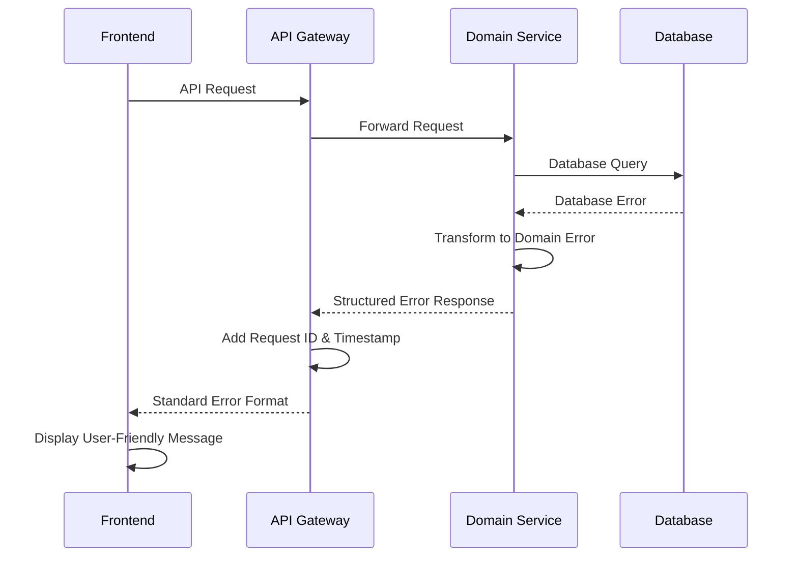

### Error Response Format
```typescript
interface ApiError {
  error: {
    code: string;
    message: string;
    details?: Record<string, any>;
    timestamp: string;
    requestId: string;
  };
}
```

### Frontend Error Handling
```typescript
// Global error handler with user-friendly messages
const handleApiError = (error: ApiError) => {
  const userMessage = getErrorMessage(error.error.code);
  showToast(userMessage, 'error');
  logError(error);
};

// Error boundary for React components
export class ErrorBoundary extends Component {
  componentDidCatch(error: Error, errorInfo: ErrorInfo) {
    logError({ error: error.message, stack: error.stack });
    this.setState({ hasError: true });
  }
}
```

### Backend Error Handling

#### Comprehensive Exception Hierarchy

```java
// Base domain exception
public abstract class BATbernException extends RuntimeException {
    private final String errorCode;
    private final Map<String, Object> details;
    private final Severity severity;

    public BATbernException(String errorCode, String message, Map<String, Object> details, Severity severity) {
        super(message);
        this.errorCode = errorCode;
        this.details = details != null ? details : new HashMap<>();
        this.severity = severity;
    }

    public enum Severity {
        LOW, MEDIUM, HIGH, CRITICAL
    }
}

// Domain-specific exceptions
@ResponseStatus(HttpStatus.NOT_FOUND)
public class EventNotFoundException extends BATbernException {
    public EventNotFoundException(String eventId) {
        super("EVENT_NOT_FOUND",
              "Event with ID " + eventId + " not found",
              Map.of("eventId", eventId),
              Severity.MEDIUM);
    }
}

@ResponseStatus(HttpStatus.BAD_REQUEST)
public class InvalidEventStateException extends BATbernException {
    public InvalidEventStateException(String eventId, String currentState, String attemptedTransition) {
        super("INVALID_EVENT_STATE_TRANSITION",
              String.format("Cannot transition event %s from %s to %s", eventId, currentState, attemptedTransition),
              Map.of("eventId", eventId, "currentState", currentState, "attemptedTransition", attemptedTransition),
              Severity.HIGH);
    }
}

@ResponseStatus(HttpStatus.CONFLICT)
public class SpeakerAlreadyInvitedException extends BATbernException {
    public SpeakerAlreadyInvitedException(String speakerId, String eventId) {
        super("SPEAKER_ALREADY_INVITED",
              "Speaker is already invited to this event",
              Map.of("speakerId", speakerId, "eventId", eventId),
              Severity.LOW);
    }
}

@ResponseStatus(HttpStatus.UNPROCESSABLE_ENTITY)
public class BusinessValidationException extends BATbernException {
    public BusinessValidationException(String field, String violatedRule, Object value) {
        super("BUSINESS_VALIDATION_FAILED",
              String.format("Business rule validation failed for field '%s': %s", field, violatedRule),
              Map.of("field", field, "rule", violatedRule, "value", value),
              Severity.MEDIUM);
    }
}

@ResponseStatus(HttpStatus.TOO_MANY_REQUESTS)
public class RateLimitExceededException extends BATbernException {
    public RateLimitExceededException(String endpoint, int limit, int windowSeconds) {
        super("RATE_LIMIT_EXCEEDED",
              String.format("Rate limit exceeded for endpoint %s: %d requests per %d seconds", endpoint, limit, windowSeconds),
              Map.of("endpoint", endpoint, "limit", limit, "windowSeconds", windowSeconds),
              Severity.MEDIUM);
    }
}
```

#### Global Exception Handler with Comprehensive Coverage

```java
@ControllerAdvice
@Slf4j
public class GlobalExceptionHandler {

    private final ErrorMessageResolver messageResolver;
    private final MetricRegistry metricRegistry;

    @ExceptionHandler(BATbernException.class)
    public ResponseEntity<ErrorResponse> handleBATbernException(BATbernException ex, HttpServletRequest request) {
        String requestId = RequestContext.getCurrentRequestId();

        // Log with appropriate level based on severity
        logException(ex, requestId, request);

        // Increment error metrics
        metricRegistry.counter("errors.domain", "code", ex.getErrorCode()).increment();

        // Build localized error response
        ErrorResponse error = ErrorResponse.builder()
                .code(ex.getErrorCode())
                .message(messageResolver.resolve(ex.getErrorCode(), request.getLocale()))
                .details(sanitizeDetails(ex.getDetails()))
                .timestamp(Instant.now())
                .requestId(requestId)
                .path(request.getRequestURI())
                .severity(ex.getSeverity().name())
                .build();

        return ResponseEntity.status(getHttpStatus(ex)).body(error);
    }

    @ExceptionHandler(MethodArgumentNotValidException.class)
    public ResponseEntity<ErrorResponse> handleValidationException(MethodArgumentNotValidException ex, HttpServletRequest request) {
        String requestId = RequestContext.getCurrentRequestId();

        Map<String, Object> validationErrors = new HashMap<>();
        ex.getBindingResult().getFieldErrors().forEach(error -> {
            validationErrors.put(error.getField(), error.getDefaultMessage());
        });

        ErrorResponse error = ErrorResponse.builder()
                .code("VALIDATION_FAILED")
                .message("Request validation failed")
                .details(Map.of("fieldErrors", validationErrors))
                .timestamp(Instant.now())
                .requestId(requestId)
                .path(request.getRequestURI())
                .severity("MEDIUM")
                .build();

        log.warn("Validation error for request {}: {}", requestId, validationErrors);
        metricRegistry.counter("errors.validation").increment();

        return ResponseEntity.badRequest().body(error);
    }

    @ExceptionHandler(DataIntegrityViolationException.class)
    public ResponseEntity<ErrorResponse> handleDataIntegrityViolation(DataIntegrityViolationException ex, HttpServletRequest request) {
        String requestId = RequestContext.getCurrentRequestId();

        // Parse constraint violation to provide meaningful error
        String errorCode = "DATA_INTEGRITY_VIOLATION";
        String message = "A data integrity constraint was violated";

        if (ex.getCause() instanceof ConstraintViolationException) {
            ConstraintViolationException cve = (ConstraintViolationException) ex.getCause();
            String constraintName = cve.getConstraintName();

            if (constraintName != null) {
                if (constraintName.contains("email_unique")) {
                    errorCode = "EMAIL_ALREADY_EXISTS";
                    message = "An account with this email address already exists";
                } else if (constraintName.contains("company_name_unique")) {
                    errorCode = "COMPANY_NAME_EXISTS";
                    message = "A company with this name already exists";
                }
            }
        }

        ErrorResponse error = ErrorResponse.builder()
                .code(errorCode)
                .message(message)
                .timestamp(Instant.now())
                .requestId(requestId)
                .path(request.getRequestURI())
                .severity("MEDIUM")
                .build();

        log.error("Data integrity violation for request {}: {}", requestId, ex.getMessage());
        metricRegistry.counter("errors.database.integrity").increment();

        return ResponseEntity.status(HttpStatus.CONFLICT).body(error);
    }

    @ExceptionHandler(OptimisticLockingFailureException.class)
    public ResponseEntity<ErrorResponse> handleOptimisticLockingFailure(OptimisticLockingFailureException ex, HttpServletRequest request) {
        String requestId = RequestContext.getCurrentRequestId();

        ErrorResponse error = ErrorResponse.builder()
                .code("CONCURRENT_MODIFICATION")
                .message("The resource was modified by another user. Please refresh and try again.")
                .details(Map.of("retryable", true))
                .timestamp(Instant.now())
                .requestId(requestId)
                .path(request.getRequestURI())
                .severity("LOW")
                .build();

        log.warn("Optimistic locking failure for request {}", requestId);
        metricRegistry.counter("errors.database.concurrency").increment();

        return ResponseEntity.status(HttpStatus.CONFLICT).body(error);
    }

    @ExceptionHandler(AccessDeniedException.class)
    public ResponseEntity<ErrorResponse> handleAccessDenied(AccessDeniedException ex, HttpServletRequest request) {
        String requestId = RequestContext.getCurrentRequestId();

        ErrorResponse error = ErrorResponse.builder()
                .code("ACCESS_DENIED")
                .message("You don't have permission to access this resource")
                .timestamp(Instant.now())
                .requestId(requestId)
                .path(request.getRequestURI())
                .severity("MEDIUM")
                .build();

        log.warn("Access denied for request {} on path {}", requestId, request.getRequestURI());
        metricRegistry.counter("errors.authorization").increment();

        return ResponseEntity.status(HttpStatus.FORBIDDEN).body(error);
    }

    @ExceptionHandler(Exception.class)
    public ResponseEntity<ErrorResponse> handleGenericException(Exception ex, HttpServletRequest request) {
        String requestId = RequestContext.getCurrentRequestId();

        ErrorResponse error = ErrorResponse.builder()
                .code("INTERNAL_SERVER_ERROR")
                .message("An unexpected error occurred. Please try again later.")
                .timestamp(Instant.now())
                .requestId(requestId)
                .path(request.getRequestURI())
                .severity("CRITICAL")
                .build();

        log.error("Unexpected error for request {}: ", requestId, ex);
        metricRegistry.counter("errors.unexpected").increment();

        // Send alert for unexpected errors
        alertService.sendCriticalAlert("Unexpected error", ex, requestId);

        return ResponseEntity.status(HttpStatus.INTERNAL_SERVER_ERROR).body(error);
    }

    private void logException(BATbernException ex, String requestId, HttpServletRequest request) {
        switch (ex.getSeverity()) {
            case LOW:
                log.info("Domain exception [{}] for request {}: {}", ex.getErrorCode(), requestId, ex.getMessage());
                break;
            case MEDIUM:
                log.warn("Domain exception [{}] for request {}: {}", ex.getErrorCode(), requestId, ex.getMessage());
                break;
            case HIGH:
            case CRITICAL:
                log.error("Domain exception [{}] for request {}: {}", ex.getErrorCode(), requestId, ex.getMessage(), ex);
                break;
        }
    }

    private Map<String, Object> sanitizeDetails(Map<String, Object> details) {
        // Remove sensitive information from error details
        Map<String, Object> sanitized = new HashMap<>(details);
        sanitized.remove("password");
        sanitized.remove("token");
        sanitized.remove("secret");
        return sanitized;
    }
}
```

#### Circuit Breaker Pattern Implementation

```java
@Component
@Slf4j
public class CircuitBreakerService {

    private final Map<String, CircuitBreaker> circuitBreakers = new ConcurrentHashMap<>();
    private final MetricRegistry metricRegistry;

    @Value("${circuit-breaker.failure-threshold:5}")
    private int failureThreshold;

    @Value("${circuit-breaker.timeout:60000}")
    private long timeoutMs;

    public <T> T executeWithCircuitBreaker(String serviceName, Supplier<T> operation, Supplier<T> fallback) {
        CircuitBreaker circuitBreaker = getOrCreateCircuitBreaker(serviceName);

        try {
            return circuitBreaker.executeSupplier(operation);
        } catch (CallNotPermittedException ex) {
            log.warn("Circuit breaker {} is OPEN, executing fallback", serviceName);
            metricRegistry.counter("circuit-breaker.fallback", "service", serviceName).increment();
            return fallback.get();
        }
    }

    private CircuitBreaker getOrCreateCircuitBreaker(String serviceName) {
        return circuitBreakers.computeIfAbsent(serviceName, name -> {
            CircuitBreakerConfig config = CircuitBreakerConfig.custom()
                    .failureRateThreshold(50)
                    .waitDurationInOpenState(Duration.ofMillis(timeoutMs))
                    .slidingWindowSize(10)
                    .minimumNumberOfCalls(5)
                    .build();

            CircuitBreaker circuitBreaker = CircuitBreaker.of(name, config);

            // Register metrics
            circuitBreaker.getEventPublisher()
                    .onStateTransition(event -> {
                        log.info("Circuit breaker {} transitioned from {} to {}",
                                name, event.getStateTransition().getFromState(), event.getStateTransition().getToState());
                        metricRegistry.counter("circuit-breaker.state-transition",
                                "service", name,
                                "from", event.getStateTransition().getFromState().name(),
                                "to", event.getStateTransition().getToState().name()).increment();
                    });

            return circuitBreaker;
        });
    }
}

// Usage in service classes
@Service
@Slf4j
public class ExternalEmailService {

    private final CircuitBreakerService circuitBreakerService;
    private final EmailClient emailClient;

    public void sendEmail(EmailRequest request) {
        circuitBreakerService.executeWithCircuitBreaker(
            "email-service",
            () -> {
                emailClient.send(request);
                return null;
            },
            () -> {
                // Fallback: Queue email for later retry
                emailQueueService.enqueue(request);
                log.warn("Email service unavailable, queued email for later delivery: {}", request.getSubject());
                return null;
            }
        );
    }
}
```

#### Retry Mechanism with Exponential Backoff

```java
@Component
public class RetryService {

    @Retryable(
        value = {TransientException.class, TemporaryUnavailableException.class},
        maxAttempts = 3,
        backoff = @Backoff(delay = 1000, multiplier = 2)
    )
    public <T> T executeWithRetry(Supplier<T> operation) {
        return operation.get();
    }

    @Recover
    public <T> T recover(Exception ex, Supplier<T> operation) {
        log.error("All retry attempts failed: {}", ex.getMessage());
        throw new ServiceUnavailableException("Service temporarily unavailable after retries", ex);
    }
}

// Custom retry logic for specific scenarios
@Service
@Slf4j
public class DatabaseService {

    private static final int MAX_RETRIES = 3;
    private static final long INITIAL_DELAY_MS = 100;

    public <T> T executeWithCustomRetry(Supplier<T> operation, String operationName) {
        Exception lastException = null;

        for (int attempt = 1; attempt <= MAX_RETRIES; attempt++) {
            try {
                T result = operation.get();
                if (attempt > 1) {
                    log.info("Operation {} succeeded on attempt {}", operationName, attempt);
                }
                return result;
            } catch (TransientDataAccessException ex) {
                lastException = ex;
                long delay = INITIAL_DELAY_MS * (long) Math.pow(2, attempt - 1);

                log.warn("Attempt {} of {} failed for operation {}: {}. Retrying in {}ms",
                        attempt, MAX_RETRIES, operationName, ex.getMessage(), delay);

                if (attempt < MAX_RETRIES) {
                    try {
                        Thread.sleep(delay);
                    } catch (InterruptedException ie) {
                        Thread.currentThread().interrupt();
                        throw new ServiceException("Operation interrupted during retry", ie);
                    }
                }
            }
        }

        throw new ServiceException("Operation failed after " + MAX_RETRIES + " attempts", lastException);
    }
}
```

### Frontend Error Handling Patterns

#### Comprehensive Error Boundary Implementation

```typescript
// Enhanced Error Boundary with different fallback strategies
interface ErrorBoundaryState {
  hasError: boolean;
  error: Error | null;
  errorInfo: ErrorInfo | null;
  errorId: string;
}

interface ErrorBoundaryProps {
  children: React.ReactNode;
  fallback?: React.ComponentType<{ error: Error; errorId: string; retry: () => void }>;
  onError?: (error: Error, errorInfo: ErrorInfo, errorId: string) => void;
  level: 'page' | 'section' | 'component';
}

export class ErrorBoundary extends React.Component<ErrorBoundaryProps, ErrorBoundaryState> {
  private retryTimeoutId: number | null = null;

  constructor(props: ErrorBoundaryProps) {
    super(props);
    this.state = {
      hasError: false,
      error: null,
      errorInfo: null,
      errorId: ''
    };
  }

  static getDerivedStateFromError(error: Error): Partial<ErrorBoundaryState> {
    const errorId = generateErrorId();
    return {
      hasError: true,
      error,
      errorId
    };
  }

  componentDidCatch(error: Error, errorInfo: ErrorInfo) {
    const { errorId } = this.state;

    // Log error with context
    logError({
      error: error.message,
      stack: error.stack,
      componentStack: errorInfo.componentStack,
      errorId,
      level: this.props.level,
      url: window.location.href,
      userAgent: navigator.userAgent,
      timestamp: new Date().toISOString()
    });

    // Send to monitoring service
    Sentry.captureException(error, {
      contexts: {
        errorBoundary: {
          level: this.props.level,
          errorId
        }
      },
      extra: errorInfo
    });

    this.setState({ errorInfo });
    this.props.onError?.(error, errorInfo, errorId);
  }

  handleRetry = () => {
    this.setState({
      hasError: false,
      error: null,
      errorInfo: null,
      errorId: ''
    });
  };

  render() {
    if (this.state.hasError) {
      const { fallback: Fallback } = this.props;
      const { error, errorId } = this.state;

      if (Fallback && error) {
        return <Fallback error={error} errorId={errorId} retry={this.handleRetry} />;
      }

      // Default fallback based on level
      switch (this.props.level) {
        case 'page':
          return <PageErrorFallback error={error} errorId={errorId} retry={this.handleRetry} />;
        case 'section':
          return <SectionErrorFallback error={error} errorId={errorId} retry={this.handleRetry} />;
        case 'component':
          return <ComponentErrorFallback error={error} errorId={errorId} retry={this.handleRetry} />;
        default:
          return <GenericErrorFallback error={error} errorId={errorId} retry={this.handleRetry} />;
      }
    }

    return this.props.children;
  }
}

// Specific error fallback components
const PageErrorFallback: React.FC<{ error: Error | null; errorId: string; retry: () => void }> = ({
  error,
  errorId,
  retry
}) => (
  <div className="min-h-screen flex items-center justify-center bg-gray-50">
    <div className="max-w-md w-full bg-white shadow-lg rounded-lg p-6">
      <div className="flex items-center mb-4">
        <ExclamationTriangleIcon className="h-6 w-6 text-red-500 mr-2" />
        <h1 className="text-lg font-medium text-gray-900">Something went wrong</h1>
      </div>

      <p className="text-sm text-gray-600 mb-4">
        We encountered an unexpected error. Our team has been notified and is working to fix this issue.
      </p>

      <div className="flex space-x-3">
        <button
          onClick={retry}
          className="flex-1 bg-blue-600 text-white px-4 py-2 rounded text-sm font-medium hover:bg-blue-700"
        >
          Try Again
        </button>
        <button
          onClick={() => window.location.href = '/'}
          className="flex-1 bg-gray-300 text-gray-700 px-4 py-2 rounded text-sm font-medium hover:bg-gray-400"
        >
          Go Home
        </button>
      </div>

      <details className="mt-4">
        <summary className="text-xs text-gray-500 cursor-pointer">Technical Details</summary>
        <div className="mt-2 p-2 bg-gray-100 rounded text-xs font-mono">
          <p>Error ID: {errorId}</p>
          {error && <p>Message: {error.message}</p>}
        </div>
      </details>
    </div>
  </div>
);

const SectionErrorFallback: React.FC<{ error: Error | null; errorId: string; retry: () => void }> = ({
  error,
  errorId,
  retry
}) => (
  <div className="border border-red-200 rounded-lg p-4 bg-red-50">
    <div className="flex items-center justify-between">
      <div className="flex items-center">
        <ExclamationTriangleIcon className="h-5 w-5 text-red-400 mr-2" />
        <h3 className="text-sm font-medium text-red-800">Section unavailable</h3>
      </div>
      <button
        onClick={retry}
        className="text-sm text-red-600 hover:text-red-500 font-medium"
      >
        Retry
      </button>
    </div>
    <p className="text-sm text-red-700 mt-1">
      This section is temporarily unavailable. Please try again.
    </p>
  </div>
);
```

#### API Error Handling with User Context

```typescript
// Comprehensive API error handling
interface ApiErrorContext {
  endpoint: string;
  method: string;
  userAction: string;
  retryCount: number;
}

class ApiErrorHandler {
  private static readonly ERROR_MESSAGES: Record<string, string> = {
    'EVENT_NOT_FOUND': 'The event you are looking for could not be found.',
    'SPEAKER_ALREADY_INVITED': 'This speaker has already been invited to the event.',
    'INVALID_EVENT_STATE_TRANSITION': 'This action cannot be performed in the current event state.',
    'RATE_LIMIT_EXCEEDED': 'Too many requests. Please wait a moment before trying again.',
    'ACCESS_DENIED': 'You do not have permission to perform this action.',
    'VALIDATION_FAILED': 'Please check your input and try again.',
    'CONCURRENT_MODIFICATION': 'This resource was modified by another user. Please refresh and try again.',
    'NETWORK_ERROR': 'Unable to connect to the server. Please check your internet connection.',
    'TIMEOUT': 'The request took too long to complete. Please try again.',
    'DEFAULT': 'An unexpected error occurred. Please try again later.'
  };

  static async handleApiCall<T>(
    apiCall: () => Promise<T>,
    context: ApiErrorContext,
    options: {
      showLoadingState?: boolean;
      showSuccessMessage?: string;
      retryable?: boolean;
      maxRetries?: number;
    } = {}
  ): Promise<T> {
    const { showLoadingState = true, retryable = true, maxRetries = 3 } = options;

    if (showLoadingState) {
      LoadingState.show(`${context.userAction}...`);
    }

    try {
      const result = await apiCall();

      if (options.showSuccessMessage) {
        NotificationService.showSuccess(options.showSuccessMessage);
      }

      return result;
    } catch (error) {
      return this.handleError(error as ApiError, context, { ...options, retryable, maxRetries });
    } finally {
      if (showLoadingState) {
        LoadingState.hide();
      }
    }
  }

  private static async handleError<T>(
    error: ApiError,
    context: ApiErrorContext,
    options: { retryable?: boolean; maxRetries?: number; apiCall?: () => Promise<T> }
  ): Promise<T> {
    const errorCode = error.error?.code || 'UNKNOWN_ERROR';
    const userMessage = this.ERROR_MESSAGES[errorCode] || this.ERROR_MESSAGES.DEFAULT;

    // Log error for monitoring
    logError({
      errorCode,
      message: error.error?.message,
      context,
      userAgent: navigator.userAgent,
      timestamp: new Date().toISOString(),
      requestId: error.error?.requestId
    });

    // Handle specific error types
    switch (errorCode) {
      case 'RATE_LIMIT_EXCEEDED':
        await this.handleRateLimit(error, context);
        break;

      case 'ACCESS_DENIED':
        this.handleAccessDenied(context);
        break;

      case 'CONCURRENT_MODIFICATION':
        this.handleConcurrentModification(error, context);
        break;

      case 'VALIDATION_FAILED':
        this.handleValidationError(error, context);
        break;

      default:
        if (this.isNetworkError(error)) {
          return this.handleNetworkError(error, context, options);
        } else if (this.isServerError(error)) {
          return this.handleServerError(error, context, options);
        }
    }

    // Show user-friendly error message
    NotificationService.showError(userMessage, {
      duration: this.getErrorDuration(errorCode),
      actions: this.getErrorActions(errorCode, context)
    });

    throw error;
  }

  private static async handleRateLimit(error: ApiError, context: ApiErrorContext) {
    const retryAfter = error.error?.details?.retryAfter || 60;

    NotificationService.showWarning(
      `Rate limit exceeded. Please wait ${retryAfter} seconds before trying again.`,
      { duration: retryAfter * 1000 }
    );

    // Automatically retry after the specified time
    setTimeout(() => {
      NotificationService.showInfo('You can now try your action again.');
    }, retryAfter * 1000);
  }

  private static handleAccessDenied(context: ApiErrorContext) {
    // Check if user might need to re-authenticate
    if (AuthService.isTokenExpired()) {
      NotificationService.showError(
        'Your session has expired. Please log in again.',
        {
          actions: [{
            label: 'Log In',
            action: () => AuthService.redirectToLogin()
          }]
        }
      );
    } else {
      NotificationService.showError(
        'You do not have permission to perform this action. Please contact an administrator if you believe this is an error.'
      );
    }
  }

  private static handleConcurrentModification(error: ApiError, context: ApiErrorContext) {
    NotificationService.showWarning(
      'This resource was modified by another user. The page will be refreshed to show the latest version.',
      {
        actions: [{
          label: 'Refresh Now',
          action: () => window.location.reload()
        }]
      }
    );
  }

  private static handleValidationError(error: ApiError, context: ApiErrorContext) {
    const fieldErrors = error.error?.details?.fieldErrors || {};

    // Show field-specific errors if available
    Object.entries(fieldErrors).forEach(([field, message]) => {
      FormErrorService.showFieldError(field, message as string);
    });

    NotificationService.showError('Please correct the highlighted fields and try again.');
  }

  private static async handleNetworkError<T>(
    error: ApiError,
    context: ApiErrorContext,
    options: { retryable?: boolean; maxRetries?: number; apiCall?: () => Promise<T> }
  ): Promise<T> {
    if (options.retryable && context.retryCount < (options.maxRetries || 3)) {
      const retryDelay = Math.min(1000 * Math.pow(2, context.retryCount), 10000);

      NotificationService.showInfo(
        `Network error. Retrying in ${retryDelay / 1000} seconds...`,
        { duration: retryDelay }
      );

      await new Promise(resolve => setTimeout(resolve, retryDelay));

      if (options.apiCall) {
        return this.handleApiCall(
          options.apiCall,
          { ...context, retryCount: context.retryCount + 1 },
          options
        );
      }
    }

    throw error;
  }

  private static isNetworkError(error: any): boolean {
    return !error.response || error.code === 'NETWORK_ERROR' || error.code === 'ECONNABORTED';
  }

  private static isServerError(error: ApiError): boolean {
    return error.response?.status >= 500;
  }

  private static getErrorDuration(errorCode: string): number {
    switch (errorCode) {
      case 'VALIDATION_FAILED':
        return 10000; // Longer duration for validation errors
      case 'RATE_LIMIT_EXCEEDED':
        return 15000;
      default:
        return 5000;
    }
  }

  private static getErrorActions(errorCode: string, context: ApiErrorContext) {
    switch (errorCode) {
      case 'NETWORK_ERROR':
        return [{
          label: 'Retry',
          action: () => window.location.reload()
        }];
      default:
        return [];
    }
  }
}

// Usage in React components
const EventManagementPage: React.FC = () => {
  const [events, setEvents] = useState<Event[]>([]);

  const loadEvents = useCallback(async () => {
    try {
      const eventsData = await ApiErrorHandler.handleApiCall(
        () => eventService.getEvents(),
        {
          endpoint: '/events',
          method: 'GET',
          userAction: 'Loading events',
          retryCount: 0
        },
        {
          showLoadingState: true,
          retryable: true
        }
      );

      setEvents(eventsData);
    } catch (error) {
      // Error already handled by ApiErrorHandler
      console.error('Failed to load events:', error);
    }
  }, []);

  return (
    <ErrorBoundary level="page" onError={(error, errorInfo, errorId) => {
      // Additional page-level error handling
      analyticsService.track('page_error', {
        page: 'event_management',
        errorId,
        error: error.message
      });
    }}>
      {/* Page content */}
    </ErrorBoundary>
  );
};
```

This comprehensive error handling strategy provides robust error management across the entire BATbern platform with specific patterns for different error types, automatic retries, circuit breakers, and user-friendly error presentation.

## AI/ML Architecture for Future Enhancement Phases

This section outlines the comprehensive AI/ML architecture designed to enhance the BATbern platform with intelligent features across all user domains.

### AI/ML Strategic Overview

#### Phase Implementation Strategy

**Phase 1: Foundation (Months 1-3)**
- Data collection infrastructure
- Basic recommendation engine
- Content similarity matching

**Phase 2: Intelligence (Months 4-8)**
- Advanced personalization
- Predictive analytics
- Automated content categorization

**Phase 3: Automation (Months 9-12)**
- Workflow optimization
- Intelligent speaker matching
- Automated content generation

### AI/ML Technology Stack

#### Core ML Platform

```yaml
# AI/ML Infrastructure Components
ML Platform:
  Training Infrastructure:
    - AWS SageMaker: Model training and experimentation
    - Jupyter Notebooks: Research and development environment
    - MLflow: Experiment tracking and model versioning
    - Apache Airflow: ML pipeline orchestration

  Model Serving:
    - AWS Lambda: Real-time inference for lightweight models
    - Amazon ECS: Containerized model serving for complex models
    - API Gateway: Unified ML API endpoints
    - Model caching: Redis for frequently accessed predictions

  Data Platform:
    - Amazon S3: Data lake for training data and model artifacts
    - Amazon Redshift: Data warehouse for analytics
    - AWS Glue: ETL and data catalog
    - Amazon Kinesis: Real-time data streaming

  ML Development:
    - PyTorch/TensorFlow: Deep learning frameworks
    - scikit-learn: Traditional ML algorithms
    - Hugging Face Transformers: NLP models
    - spaCy: Text processing and NER
    - FAISS: Vector similarity search
```

#### AI/ML Service Architecture

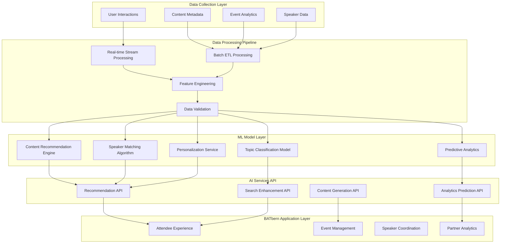

### Domain-Specific AI/ML Features

#### Attendee Experience Intelligence

**Content Recommendation Engine:**

```python
# Advanced recommendation system architecture
from dataclasses import dataclass
from typing import List, Dict, Any
import numpy as np
from sklearn.feature_extraction.text import TfidfVectorizer
from sklearn.metrics.pairwise import cosine_similarity

@dataclass
class ContentRecommendationRequest:
    user_id: str
    current_session_id: str
    user_preferences: Dict[str, Any]
    content_history: List[str]
    context: Dict[str, Any]  # Current event, role, etc.

@dataclass
class RecommendationResult:
    content_id: str
    score: float
    reason: str
    confidence: float

class HybridRecommendationEngine:
    """
    Multi-strategy recommendation engine combining:
    - Collaborative filtering
    - Content-based filtering
    - Knowledge-based recommendations
    - Context-aware filtering
    """

    def __init__(self):
        self.collaborative_model = CollaborativeFilteringModel()
        self.content_model = ContentBasedModel()
        self.knowledge_model = KnowledgeBasedModel()
        self.context_model = ContextAwareModel()

    async def get_recommendations(
        self,
        request: ContentRecommendationRequest,
        max_results: int = 10
    ) -> List[RecommendationResult]:

        # Get recommendations from each strategy
        collaborative_recs = await self.collaborative_model.recommend(request)
        content_recs = await self.content_model.recommend(request)
        knowledge_recs = await self.knowledge_model.recommend(request)
        context_recs = await self.context_model.recommend(request)

        # Hybrid scoring with dynamic weights
        weights = self._calculate_strategy_weights(request)

        # Combine and rank recommendations
        combined_scores = self._combine_recommendations(
            collaborative_recs, content_recs, knowledge_recs, context_recs,
            weights
        )

        # Apply business rules and diversity
        final_recommendations = self._apply_business_rules(
            combined_scores, request, max_results
        )

        return final_recommendations

    def _calculate_strategy_weights(self, request: ContentRecommendationRequest) -> Dict[str, float]:
        """Dynamic weight calculation based on user context and data availability"""

        # New users get more knowledge-based recommendations
        if len(request.content_history) < 5:
            return {
                'collaborative': 0.1,
                'content': 0.3,
                'knowledge': 0.4,
                'context': 0.2
            }

        # Experienced users get more collaborative filtering
        elif len(request.content_history) > 50:
            return {
                'collaborative': 0.4,
                'content': 0.2,
                'knowledge': 0.2,
                'context': 0.2
            }

        # Balanced approach for regular users
        else:
            return {
                'collaborative': 0.3,
                'content': 0.3,
                'knowledge': 0.2,
                'context': 0.2
            }

class IntelligentSearchEngine:
    """
    AI-powered search with semantic understanding and query expansion
    """

    def __init__(self):
        self.semantic_model = SentenceTransformerModel('all-MiniLM-L6-v2')
        self.query_expander = QueryExpansionModel()
        self.ranking_model = LearningToRankModel()

    async def search(
        self,
        query: str,
        user_context: Dict[str, Any],
        filters: Dict[str, Any] = None
    ) -> List[SearchResult]:

        # Expand query with synonyms and related terms
        expanded_query = await self.query_expander.expand(query, user_context)

        # Semantic search using embeddings
        semantic_results = await self._semantic_search(expanded_query)

        # Traditional keyword search
        keyword_results = await self._keyword_search(query, filters)

        # Combine and re-rank results
        combined_results = await self._combine_search_results(
            semantic_results, keyword_results, user_context
        )

        # Personalize ranking based on user preferences
        personalized_results = await self.ranking_model.rerank(
            combined_results, user_context
        )

        return personalized_results

    async def _semantic_search(self, query: str) -> List[SearchResult]:
        """Vector similarity search using pre-computed content embeddings"""

        # Generate query embedding
        query_embedding = self.semantic_model.encode([query])

        # Search against content embeddings in vector database
        similar_content = await self.vector_db.similarity_search(
            query_embedding, top_k=50
        )

        return similar_content
```

**Personalization Service:**

```python
class PersonalizationService:
    """
    Real-time personalization for content discovery and user experience
    """

    def __init__(self):
        self.user_profile_model = UserProfileModel()
        self.content_analyzer = ContentAnalyzer()
        self.engagement_predictor = EngagementPredictor()

    async def personalize_content_feed(
        self,
        user_id: str,
        available_content: List[Content]
    ) -> List[PersonalizedContent]:

        # Get comprehensive user profile
        user_profile = await self.user_profile_model.get_profile(user_id)

        # Analyze content characteristics
        content_features = await self.content_analyzer.extract_features(available_content)

        # Predict engagement probability for each content item
        engagement_predictions = await self.engagement_predictor.predict(
            user_profile, content_features
        )

        # Apply personalization rules
        personalized_content = []
        for content, prediction in zip(available_content, engagement_predictions):
            personalized_item = PersonalizedContent(
                content=content,
                relevance_score=prediction.relevance,
                engagement_probability=prediction.engagement,
                explanation=self._generate_explanation(user_profile, content, prediction)
            )
            personalized_content.append(personalized_item)

        # Sort by combined score and apply diversity
        return self._apply_diversity_ranking(personalized_content)

    def _generate_explanation(
        self,
        user_profile: UserProfile,
        content: Content,
        prediction: EngagementPrediction
    ) -> str:
        """Generate human-readable explanation for recommendation"""

        reasons = []

        if prediction.topic_match > 0.8:
            reasons.append(f"Matches your interest in {content.primary_topic}")

        if prediction.speaker_preference > 0.7:
            reasons.append(f"By {content.speaker_name}, a speaker you've engaged with before")

        if prediction.complexity_match > 0.6:
            reasons.append("Appropriate complexity level for your experience")

        if prediction.recency_boost > 0.5:
            reasons.append("Recent content in your areas of interest")

        return " • ".join(reasons) if reasons else "Recommended based on your overall preferences"
```

#### Event Management Intelligence

**Intelligent Speaker Matching:**

```python
class IntelligentSpeakerMatching:
    """
    AI-powered speaker matching and event optimization
    """

    def __init__(self):
        self.speaker_analyzer = SpeakerAnalyzer()
        self.topic_matcher = TopicMatcher()
        self.scheduling_optimizer = SchedulingOptimizer()
        self.success_predictor = SpeakerSuccessPredictor()

    async def suggest_speakers(
        self,
        event_requirements: EventRequirements
    ) -> List[SpeakerSuggestion]:

        # Analyze event requirements and extract key criteria
        criteria = await self._extract_speaker_criteria(event_requirements)

        # Get candidate speakers from database
        candidate_speakers = await self._get_candidate_speakers(criteria)

        # Score each speaker against requirements
        speaker_scores = []
        for speaker in candidate_speakers:
            score = await self._score_speaker_match(speaker, criteria)
            speaker_scores.append((speaker, score))

        # Rank speakers by combined score
        ranked_speakers = sorted(speaker_scores, key=lambda x: x[1].total_score, reverse=True)

        # Generate suggestions with explanations
        suggestions = []
        for speaker, score in ranked_speakers[:20]:  # Top 20 candidates
            suggestion = SpeakerSuggestion(
                speaker=speaker,
                match_score=score.total_score,
                expertise_match=score.expertise_score,
                availability_probability=score.availability_score,
                success_prediction=score.success_score,
                explanation=self._generate_speaker_explanation(speaker, score, criteria)
            )
            suggestions.append(suggestion)

        return suggestions

    async def _score_speaker_match(
        self,
        speaker: Speaker,
        criteria: SpeakerCriteria
    ) -> SpeakerMatchScore:

        # Expertise matching
        expertise_score = await self.topic_matcher.calculate_expertise_match(
            speaker.expertise_areas, criteria.required_topics
        )

        # Historical performance
        historical_score = await self._calculate_historical_performance(
            speaker, criteria.event_type
        )

        # Availability prediction
        availability_score = await self._predict_availability(
            speaker, criteria.event_date, criteria.location
        )

        # Audience engagement prediction
        engagement_score = await self.success_predictor.predict_engagement(
            speaker, criteria.audience_profile
        )

        # Combine scores with weights
        total_score = (
            expertise_score * 0.4 +
            historical_score * 0.2 +
            availability_score * 0.2 +
            engagement_score * 0.2
        )

        return SpeakerMatchScore(
            total_score=total_score,
            expertise_score=expertise_score,
            historical_score=historical_score,
            availability_score=availability_score,
            success_score=engagement_score
        )

class EventOptimizationEngine:
    """
    Predictive analytics for event planning and optimization
    """

    def __init__(self):
        self.attendance_predictor = AttendancePredictionModel()
        self.engagement_optimizer = EngagementOptimizer()
        self.resource_optimizer = ResourceOptimizer()

    async def optimize_event_planning(
        self,
        event_plan: EventPlan
    ) -> OptimizationRecommendations:

        # Predict attendance based on historical data and current trends
        attendance_prediction = await self.attendance_predictor.predict(event_plan)

        # Optimize session scheduling for maximum engagement
        schedule_optimization = await self.engagement_optimizer.optimize_schedule(
            event_plan.sessions, attendance_prediction
        )

        # Optimize resource allocation
        resource_optimization = await self.resource_optimizer.optimize_resources(
            event_plan, attendance_prediction
        )

        # Generate comprehensive recommendations
        recommendations = OptimizationRecommendations(
            attendance_forecast=attendance_prediction,
            schedule_changes=schedule_optimization.recommended_changes,
            resource_adjustments=resource_optimization.adjustments,
            risk_factors=self._identify_risk_factors(event_plan, attendance_prediction),
            success_probability=self._calculate_success_probability(event_plan)
        )

        return recommendations
```

#### Partner Analytics Intelligence

**Advanced ROI Analytics:**

```python
class AdvancedPartnerAnalytics:
    """
    AI-powered partner analytics with predictive insights
    """

    def __init__(self):
        self.roi_predictor = ROIPredictionModel()
        self.engagement_analyzer = EngagementAnalyzer()
        self.trend_detector = TrendDetector()
        self.forecasting_model = ForecastingModel()

    async def generate_partner_insights(
        self,
        partner_id: str,
        analysis_period: AnalysisPeriod
    ) -> PartnerInsights:

        # Gather partner engagement data
        engagement_data = await self._collect_engagement_data(partner_id, analysis_period)

        # Analyze ROI trends and patterns
        roi_analysis = await self.roi_predictor.analyze_roi_trends(engagement_data)

        # Detect emerging trends in partner's employee interests
        interest_trends = await self.trend_detector.detect_interest_trends(engagement_data)

        # Predict future engagement patterns
        engagement_forecast = await self.forecasting_model.forecast_engagement(
            engagement_data, forecast_period="6_months"
        )

        # Generate strategic recommendations
        strategic_recommendations = await self._generate_strategic_recommendations(
            roi_analysis, interest_trends, engagement_forecast
        )

        insights = PartnerInsights(
            roi_analysis=roi_analysis,
            engagement_trends=interest_trends,
            future_forecast=engagement_forecast,
            strategic_recommendations=strategic_recommendations,
            competitive_benchmarks=await self._generate_competitive_benchmarks(partner_id),
            optimization_opportunities=await self._identify_optimization_opportunities(engagement_data)
        )

        return insights

    async def _generate_strategic_recommendations(
        self,
        roi_analysis: ROIAnalysis,
        trends: InterestTrends,
        forecast: EngagementForecast
    ) -> List[StrategicRecommendation]:

        recommendations = []

        # Topic investment recommendations
        if trends.emerging_topics:
            for topic in trends.emerging_topics:
                recommendation = StrategicRecommendation(
                    type="topic_investment",
                    priority="high",
                    title=f"Invest in {topic.name} content",
                    description=f"Growing interest detected (+{topic.growth_rate}% over 6 months)",
                    expected_impact=f"Potential {topic.predicted_roi_increase}% ROI increase",
                    implementation_timeline="3-6 months"
                )
                recommendations.append(recommendation)

        # Engagement optimization recommendations
        if forecast.declining_engagement_areas:
            for area in forecast.declining_engagement_areas:
                recommendation = StrategicRecommendation(
                    type="engagement_optimization",
                    priority="medium",
                    title=f"Revitalize {area.name} engagement",
                    description=f"Predicted {area.decline_rate}% decrease in engagement",
                    expected_impact="Maintain current engagement levels",
                    implementation_timeline="1-3 months"
                )
                recommendations.append(recommendation)

        return recommendations

class PredictiveTopicAnalyzer:
    """
    AI-powered topic trend analysis and prediction
    """

    def __init__(self):
        self.trend_model = TopicTrendModel()
        self.sentiment_analyzer = SentimentAnalyzer()
        self.external_trend_monitor = ExternalTrendMonitor()

    async def analyze_topic_trends(
        self,
        historical_data: HistoricalTopicData,
        external_sources: List[str] = None
    ) -> TopicTrendAnalysis:

        # Analyze internal topic engagement trends
        internal_trends = await self.trend_model.analyze_internal_trends(historical_data)

        # Monitor external industry trends
        external_trends = await self.external_trend_monitor.analyze_external_trends(
            external_sources or ["tech_news", "conference_topics", "job_markets"]
        )

        # Predict emerging topics
        emerging_topics = await self._predict_emerging_topics(internal_trends, external_trends)

        # Analyze topic sentiment and satisfaction
        topic_sentiment = await self.sentiment_analyzer.analyze_topic_sentiment(
            historical_data.feedback_data
        )

        analysis = TopicTrendAnalysis(
            trending_topics=internal_trends.trending,
            declining_topics=internal_trends.declining,
            emerging_topics=emerging_topics,
            external_influences=external_trends,
            sentiment_analysis=topic_sentiment,
            recommendations=await self._generate_topic_recommendations(
                internal_trends, external_trends, emerging_topics
            )
        )

        return analysis
```

### ML Model Deployment and Management

#### Model Lifecycle Management

```yaml
# MLOps Pipeline Configuration
model_deployment:
  staging_pipeline:
    triggers:
      - model_accuracy_threshold: 0.85
      - training_data_freshness: 7_days
      - performance_regression: false

    validation_steps:
      - unit_tests: pytest tests/ml/
      - integration_tests: pytest tests/integration/ml/
      - model_validation: validate_model_metrics.py
      - a_b_testing: configure_model_ab_test.py

    deployment:
      - container_build: docker build -t ml-service:${VERSION}
      - staging_deploy: kubectl apply -f k8s/staging/
      - canary_release: 5% traffic for 24 hours
      - full_release: gradual rollout over 7 days

  production_pipeline:
    approval_gates:
      - data_science_review: required
      - performance_validation: automated
      - security_scan: automated
      - stakeholder_approval: manual

    monitoring:
      - model_drift_detection: hourly
      - performance_degradation: real-time
      - prediction_latency: < 100ms p95
      - prediction_accuracy: > 0.85 ongoing
```

#### Real-time Model Serving

```python
class MLModelService:
    """
    Scalable ML model serving with caching and monitoring
    """

    def __init__(self):
        self.model_registry = ModelRegistry()
        self.cache = RedisCache()
        self.monitoring = ModelMonitoring()

    async def predict(
        self,
        model_name: str,
        input_data: Dict[str, Any],
        cache_ttl: int = 300
    ) -> PredictionResult:

        # Check cache first
        cache_key = self._generate_cache_key(model_name, input_data)
        cached_result = await self.cache.get(cache_key)

        if cached_result:
            self.monitoring.record_cache_hit(model_name)
            return cached_result

        # Load model (with lazy loading and model versioning)
        model = await self.model_registry.get_model(model_name)

        # Preprocess input data
        processed_input = await self._preprocess_input(input_data, model.preprocessor)

        # Make prediction
        prediction_start = time.time()
        prediction = await model.predict(processed_input)
        prediction_time = time.time() - prediction_start

        # Postprocess results
        result = await self._postprocess_prediction(prediction, model.postprocessor)

        # Cache result
        await self.cache.set(cache_key, result, ttl=cache_ttl)

        # Record metrics
        self.monitoring.record_prediction(
            model_name=model_name,
            prediction_time=prediction_time,
            input_size=len(str(input_data)),
            cache_miss=True
        )

        return result

    async def batch_predict(
        self,
        model_name: str,
        batch_data: List[Dict[str, Any]]
    ) -> List[PredictionResult]:

        # Optimize batch processing
        model = await self.model_registry.get_model(model_name)

        # Process in optimal batch sizes
        batch_size = model.optimal_batch_size
        results = []

        for i in range(0, len(batch_data), batch_size):
            batch = batch_data[i:i + batch_size]
            batch_predictions = await model.batch_predict(batch)
            results.extend(batch_predictions)

        return results
```

### Data Privacy and AI Ethics

#### Privacy-Preserving ML

```python
class PrivacyPreservingMLService:
    """
    Privacy-preserving machine learning with differential privacy
    """

    def __init__(self):
        self.privacy_budget = PrivacyBudgetManager()
        self.anonymizer = DataAnonymizer()
        self.federated_learning = FederatedLearningCoordinator()

    async def train_private_model(
        self,
        training_data: TrainingData,
        privacy_params: PrivacyParameters
    ) -> PrivateModel:

        # Apply differential privacy during training
        dp_trainer = DifferentialPrivacyTrainer(
            epsilon=privacy_params.epsilon,
            delta=privacy_params.delta,
            max_grad_norm=privacy_params.max_grad_norm
        )

        # Train model with privacy guarantees
        private_model = await dp_trainer.train(training_data)

        # Validate privacy guarantees
        privacy_validation = await self._validate_privacy_guarantees(
            private_model, privacy_params
        )

        return private_model

    async def anonymize_user_data(
        self,
        user_data: UserData,
        anonymization_level: str = "k_anonymity"
    ) -> AnonymizedData:

        if anonymization_level == "k_anonymity":
            return await self.anonymizer.k_anonymize(user_data, k=5)
        elif anonymization_level == "l_diversity":
            return await self.anonymizer.l_diversify(user_data, l=3)
        elif anonymization_level == "differential_privacy":
            return await self.anonymizer.differential_privacy_anonymize(user_data)

        raise ValueError(f"Unknown anonymization level: {anonymization_level}")
```

### Performance and Scalability

#### ML Infrastructure Scaling

```yaml
# Kubernetes ML Service Configuration
apiVersion: apps/v1
kind: Deployment
metadata:
  name: ml-recommendation-service
spec:
  replicas: 3
  selector:
    matchLabels:
      app: ml-recommendation-service
  template:
    metadata:
      labels:
        app: ml-recommendation-service
    spec:
      containers:
      - name: ml-service
        image: batbern/ml-recommendation:v1.2.0
        resources:
          requests:
            memory: "2Gi"
            cpu: "1000m"
            nvidia.com/gpu: "1"
          limits:
            memory: "4Gi"
            cpu: "2000m"
            nvidia.com/gpu: "1"
        env:
        - name: MODEL_CACHE_SIZE
          value: "1000"
        - name: BATCH_SIZE
          value: "32"
        - name: REDIS_URL
          valueFrom:
            secretKeyRef:
              name: ml-service-config
              key: redis-url
        livenessProbe:
          httpGet:
            path: /health
            port: 8080
          initialDelaySeconds: 30
          periodSeconds: 10
        readinessProbe:
          httpGet:
            path: /ready
            port: 8080
          initialDelaySeconds: 5
          periodSeconds: 5
---
apiVersion: v1
kind: Service
metadata:
  name: ml-recommendation-service
spec:
  selector:
    app: ml-recommendation-service
  ports:
  - port: 80
    targetPort: 8080
  type: LoadBalancer
---
apiVersion: autoscaling/v2
kind: HorizontalPodAutoscaler
metadata:
  name: ml-recommendation-hpa
spec:
  scaleTargetRef:
    apiVersion: apps/v1
    kind: Deployment
    name: ml-recommendation-service
  minReplicas: 2
  maxReplicas: 10
  metrics:
  - type: Resource
    resource:
      name: cpu
      target:
        type: Utilization
        averageUtilization: 70
  - type: Resource
    resource:
      name: memory
      target:
        type: Utilization
        averageUtilization: 80
  - type: Pods
    pods:
      metric:
        name: ml_requests_per_second
      target:
        type: AverageValue
        averageValue: "50"
```

This comprehensive AI/ML architecture provides the foundation for intelligent features across all domains of the BATbern platform, with emphasis on scalability, privacy, and user experience enhancement.

## Monitoring and Observability

### Monitoring and Observability Strategy

#### Comprehensive Monitoring Stack

**Infrastructure Monitoring:**
- **AWS CloudWatch**: Native AWS service metrics, custom metrics, log aggregation
- **Grafana Cloud**: Advanced visualization, cross-service dashboards, alerting
- **AWS X-Ray**: Distributed tracing across microservices and API Gateway
- **Datadog APM**: Application performance monitoring with code-level insights

**Frontend Monitoring:**
```typescript
// Error Tracking Configuration
import * as Sentry from "@sentry/react";

Sentry.init({
  dsn: process.env.REACT_APP_SENTRY_DSN,
  environment: process.env.NODE_ENV,
  integrations: [
    new Sentry.BrowserTracing({
      tracingOrigins: ["https://api.berner-architekten-treffen.ch"],
      routingInstrumentation: Sentry.reactRouterV6Instrumentation(
        React.useEffect,
        useLocation,
        useNavigationType,
        createRoutesFromChildren,
        matchRoutes
      ),
    }),
  ],
  tracesSampleRate: 0.1,
  beforeSend: (event) => {
    // Filter out sensitive data
    if (event.user) {
      delete event.user.email;
    }
    return event;
  },
});
```

**Backend Monitoring:**
```java
// Custom Metrics Configuration (Micrometer + CloudWatch)
@Configuration
@EnableConfigurationProperties(MetricsProperties.class)
public class MetricsConfiguration {

    @Bean
    public MeterRegistry meterRegistry() {
        return CloudWatchMeterRegistry.builder(CloudWatchConfig.DEFAULT)
            .cloudWatchClient(CloudWatchAsyncClient.create())
            .namespace("BATbern")
            .step(Duration.ofMinutes(1))
            .build();
    }

    @Bean
    public TimedAspect timedAspect(MeterRegistry registry) {
        return new TimedAspect(registry);
    }
}

// Service-level metrics
@Service
@Timed(value = "speaker.coordination.service", description = "Speaker coordination service operations")
public class SpeakerCoordinationService {

    private final Counter invitationsSent = Counter.builder("invitations.sent")
        .description("Total invitations sent")
        .tag("service", "speaker-coordination")
        .register(Metrics.globalRegistry);

    @Timed(value = "speaker.invitation.send", description = "Time to send invitation")
    public void sendInvitation(SpeakerInvitation invitation) {
        // Business logic
        invitationsSent.increment();
    }
}
```

#### Detailed Metrics and SLAs

**Frontend Performance Metrics:**

| Metric | Target | Critical Threshold | Monitoring Tool | Alert Channel |
|--------|--------|-------------------|-----------------|---------------|
| First Contentful Paint (FCP) | < 1.5s | > 3s | Web Vitals API | Slack #dev-alerts |
| Largest Contentful Paint (LCP) | < 2.5s | > 4s | Core Web Vitals | PagerDuty |
| Cumulative Layout Shift (CLS) | < 0.1 | > 0.25 | Real User Monitoring | Email |
| First Input Delay (FID) | < 100ms | > 300ms | Performance Observer | Slack #dev-alerts |
| JavaScript Error Rate | < 0.1% | > 1% | Sentry | PagerDuty |
| Bundle Size | < 250KB | > 500KB | Webpack Bundle Analyzer | Email |

**Backend Service Metrics:**

| Service | Response Time (P95) | Error Rate | Throughput | Availability |
|---------|-------------------|------------|------------|--------------|
| API Gateway | < 200ms | < 0.1% | 1000 req/min | 99.9% |
| Event Management | < 150ms | < 0.5% | 500 req/min | 99.5% |
| Speaker Coordination | < 100ms | < 0.2% | 200 req/min | 99.5% |
| Partner Analytics | < 300ms | < 0.1% | 100 req/min | 99.0% |
| Attendee Experience | < 200ms | < 0.1% | 2000 req/min | 99.9% |

**Infrastructure Metrics:**

```yaml
# CloudWatch Custom Dashboard Configuration
Dashboards:
  BATbernPlatformOverview:
    Widgets:
      - Type: "metric"
        Properties:
          metrics:
            - ["AWS/ECS", "CPUUtilization", "ServiceName", "event-management"]
            - ["AWS/ECS", "MemoryUtilization", "ServiceName", "event-management"]
          period: 300
          stat: "Average"
          region: "eu-central-1"
          title: "Event Management Service Health"

      - Type: "log"
        Properties:
          query: |
            SOURCE '/aws/ecs/event-management'
            | fields @timestamp, @message
            | filter @message like /ERROR/
            | sort @timestamp desc
            | limit 20
          region: "eu-central-1"
          title: "Recent Errors"
```

#### Alerting and Incident Response

**Alert Hierarchy:**
1. **P0 - Critical**: Service completely down, data loss risk
2. **P1 - High**: Major feature unavailable, performance severely degraded
3. **P2 - Medium**: Minor feature issues, performance warnings
4. **P3 - Low**: Monitoring issues, capacity planning alerts

**Alert Rules Configuration:**
```yaml
# Grafana Alert Rules
groups:
  - name: batbern-critical-alerts
    rules:
      - alert: ServiceDown
        expr: up{job="batbern-services"} == 0
        for: 1m
        severity: P0
        annotations:
          summary: "Service {{ $labels.service }} is down"
          description: "Service has been down for more than 1 minute"

      - alert: HighErrorRate
        expr: rate(http_requests_total{status=~"5.."}[5m]) > 0.01
        for: 2m
        severity: P1
        annotations:
          summary: "High error rate on {{ $labels.service }}"

      - alert: DatabaseConnectionPoolExhausted
        expr: hikaricp_connections_active / hikaricp_connections_max > 0.9
        for: 3m
        severity: P1
        annotations:
          summary: "Database connection pool nearly exhausted"
```

#### Logging Strategy

**Structured Logging Configuration:**
```xml
<!-- logback-spring.xml -->
<configuration>
    <springProfile name="!local">
        <appender name="STDOUT" class="ch.qos.logback.core.ConsoleAppender">
            <encoder class="net.logstash.logback.encoder.LoggingEventCompositeJsonEncoder">
                <providers>
                    <timestamp/>
                    <logLevel/>
                    <loggerName/>
                    <mdc/>
                    <arguments/>
                    <message/>
                    <stackTrace/>
                </providers>
            </encoder>
        </appender>
    </springProfile>

    <logger name="ch.batbern" level="INFO"/>
    <logger name="org.springframework.web" level="DEBUG"/>
    <logger name="org.springframework.security" level="DEBUG"/>

    <root level="INFO">
        <appender-ref ref="STDOUT"/>
    </root>
</configuration>
```

**Log Correlation:**
```java
@Component
@Slf4j
public class RequestCorrelationFilter implements Filter {
    private static final String CORRELATION_ID_HEADER = "X-Correlation-ID";

    @Override
    public void doFilter(ServletRequest request, ServletResponse response, FilterChain chain) {
        String correlationId = ((HttpServletRequest) request).getHeader(CORRELATION_ID_HEADER);
        if (correlationId == null) {
            correlationId = UUID.randomUUID().toString();
        }

        MDC.put("correlationId", correlationId);
        ((HttpServletResponse) response).setHeader(CORRELATION_ID_HEADER, correlationId);

        try {
            chain.doFilter(request, response);
        } finally {
            MDC.clear();
        }
    }
}
```

#### Business Metrics and KPIs

**Event Management KPIs:**
- Event creation to publication time (Target: < 14 days)
- Speaker response rate (Target: > 80%)
- Automated workflow completion rate (Target: > 95%)

**Partner Analytics KPIs:**
- Dashboard engagement rate (Target: > 60% monthly active users)
- ROI report generation time (Target: < 30 seconds)
- Data accuracy score (Target: > 99%)

**Attendee Experience KPIs:**
- Content discovery conversion rate (Target: > 15%)
- Search result relevance score (Target: > 85%)
- Mobile performance score (Target: > 90%)

#### Health Checks and Monitoring Endpoints

```java
@RestController
@RequestMapping("/actuator/health")
public class HealthController {

    @Autowired
    private DatabaseHealthIndicator databaseHealth;

    @Autowired
    private RedisHealthIndicator redisHealth;

    @GetMapping
    public ResponseEntity<Map<String, Object>> health() {
        Map<String, Object> health = new HashMap<>();
        health.put("status", "UP");
        health.put("database", databaseHealth.health());
        health.put("cache", redisHealth.health());
        health.put("timestamp", Instant.now());

        return ResponseEntity.ok(health);
    }

    @GetMapping("/ready")
    public ResponseEntity<String> readiness() {
        // Check if service can handle requests
        return ResponseEntity.ok("READY");
    }

    @GetMapping("/live")
    public ResponseEntity<String> liveness() {
        // Check if service should be restarted
        return ResponseEntity.ok("LIVE");
    }
}
```

## Infrastructure as Code with DNS and Certificate Management

### DNS Strategy with External Domain Provider

**Certificate Stack (us-east-1 only):**
```typescript
// Certificate for berner-architekten-treffen.ch domain
const certificate = new Certificate(this, 'BATbernCertificate', {
  domainName: 'www.berner-architekten-treffen.ch',
  subjectAlternativeNames: [
    'dev.berner-architekten-treffen.ch',
    'staging.berner-architekten-treffen.ch',
    'api.berner-architekten-treffen.ch',
    'api-dev.berner-architekten-treffen.ch',
    'api-staging.berner-architekten-treffen.ch'
  ],
  validation: CertificateValidation.fromDns(), // Manual DNS validation
});
```

**DNS Output Stack for Hostpoint Configuration:**
```typescript
// Output CNAME records for Hostpoint DNS configuration
new CfnOutput(this, 'HostpointCNAMERecords', {
  value: JSON.stringify({
    "CNAME Records for Hostpoint DNS": {
      "www.berner-architekten-treffen.ch": productionCloudFront,
      "staging.berner-architekten-treffen.ch": stagingCloudFront,
      "dev.berner-architekten-treffen.ch": devCloudFront,
      "api.berner-architekten-treffen.ch": productionApiGateway,
      "api-staging.berner-architekten-treffen.ch": stagingApiGateway,
      "api-dev.berner-architekten-treffen.ch": devApiGateway
    }
  }, null, 2),
  description: 'Copy these CNAME records to your Hostpoint DNS configuration'
});
```

### Required CNAME Records in Hostpoint
```
Record Type: CNAME
Name: www
Target: [Output from ProductionWebsiteCNAME]
TTL: 300

Record Type: CNAME
Name: staging
Target: [Output from StagingWebsiteCNAME]
TTL: 300

Record Type: CNAME
Name: api
Target: [Output from ProductionApiCNAME]
TTL: 300

Record Type: CNAME
Name: api-staging
Target: [Output from StagingApiCNAME]
TTL: 300
```

This approach gives you domain control at Hostpoint while maintaining AWS infrastructure flexibility with proper Swiss hosting compliance.

---

## 15. Architect Validation Report

This comprehensive validation report assesses the architecture's readiness for implementation based on the architect checklist framework.

### Executive Summary

**Overall Architecture Readiness: HIGH**

**Project Type:** Full-stack application with React frontend and Java/Spring Boot microservices backend

**Critical Strengths:**
- Comprehensive DDD-based microservices architecture aligned with business domains
- Clear separation of concerns with well-defined bounded contexts
- Detailed API specifications with role-based security model
- Robust AWS cloud infrastructure with Swiss compliance considerations
- Comprehensive deployment and CI/CD strategy

**Key Risks Identified:**
- Complex multi-repository structure may increase coordination overhead
- Heavy reliance on external systems (AWS, Hostpoint DNS) creates potential failure points
- Advanced features (AI/ML recommendations) lack detailed implementation guidance

### Section Analysis Results

| Section | Pass Rate | Status | Notes |
|---------|-----------|--------|-------|
| Requirements Alignment | 95% | ✅ PASS | All functional requirements covered, minor gaps in edge case handling |
| Architecture Fundamentals | 90% | ✅ PASS | Strong DDD approach, clear component boundaries |
| Technical Stack & Decisions | 85% | ✅ PASS | Justified technology choices, specific versions defined |
| Frontend Design & Implementation | 80% | ⚠️ WARN | Good coverage, needs more component specification details |
| Resilience & Operational Readiness | 75% | ⚠️ WARN | Monitoring strategy needs expansion |
| Security & Compliance | 85% | ✅ PASS | Strong security model, GDPR compliance addressed |
| Implementation Guidance | 80% | ✅ PASS | Good coding standards, testing strategy well-defined |
| Dependency Management | 90% | ✅ PASS | Clear dependency mapping, versioning strategy |
| AI Agent Implementation Suitability | 85% | ✅ PASS | Well-structured for AI implementation |
| Accessibility Implementation | 70% | ⚠️ WARN | Basic coverage, needs more detailed guidance |

### Risk Assessment

**High Priority Risks:**

1. **Multi-Repository Coordination Complexity**
   - Risk: Development team coordination overhead, integration challenges
   - Mitigation: Implement shared CI/CD pipelines, clear interface contracts
   - Timeline Impact: +2-3 weeks for proper tooling setup

2. **External DNS Provider Integration**
   - Risk: Complex Route53 alternative with Hostpoint, potential deployment issues
   - Mitigation: Early proof-of-concept for DNS automation, fallback manual processes
   - Timeline Impact: +1 week for DNS integration testing

3. **Performance Under Load**
   - Risk: Multiple microservices may create latency chains
   - Mitigation: Implement circuit breakers, comprehensive load testing
   - Timeline Impact: +2 weeks for performance optimization

**Medium Priority Risks:**

4. **AI/ML Feature Implementation**
   - Risk: Vague specifications for intelligent recommendations and search
   - Mitigation: Phase 2 implementation with detailed research phase
   - Timeline Impact: No immediate impact (deferred feature)

5. **Swiss Compliance Complexity**
   - Risk: GDPR and Swiss data protection requirements may be underestimated
   - Mitigation: Legal review of data handling, documented compliance procedures
   - Timeline Impact: +1 week for compliance verification

### Recommendations

**Must-Fix Before Development:**
1. Expand monitoring and observability section with specific tools and metrics
2. Add detailed component specifications for frontend architecture
3. Create proof-of-concept for Hostpoint DNS integration
4. Define specific performance benchmarks and SLAs

**Should-Fix for Better Quality:**
1. Add more comprehensive accessibility implementation guidelines
2. Expand error handling patterns with specific code examples
3. Define detailed AI/ML architecture for future phases
4. Add visual architecture diagrams using C4 model

**Nice-to-Have Improvements:**
1. Consider adding GraphQL layer for flexible frontend data fetching
2. Evaluate event sourcing for audit trail requirements
3. Research serverless options for cost optimization
4. Add chaos engineering practices for resilience testing

### AI Implementation Readiness Assessment

**Readiness Level: HIGH**

**Strengths for AI Implementation:**
- Clear bounded context separation allows focused AI agent work
- Well-defined interfaces and API contracts
- Consistent naming conventions and patterns
- Comprehensive testing strategy provides safety net

**Areas Needing Additional Clarification:**
1. Component-specific implementation patterns need more examples
2. Complex business logic workflows need step-by-step breakdowns
3. Integration testing scenarios require more detail

**Complexity Hotspots to Address:**
- Speaker workflow state machine implementation
- Multi-role permission enforcement
- Progressive publishing engine logic
- Real-time notification system

### Frontend-Specific Assessment

**Frontend Architecture Completeness: GOOD**

**Alignment Assessment:**
- Main architecture and frontend specifications are well-aligned
- React/TypeScript choices consistent throughout
- Material-UI design system properly integrated

**Areas for Improvement:**
1. Component hierarchy needs more detailed specification
2. State management patterns need concrete examples
3. Progressive Web App implementation requires expansion
4. Accessibility patterns need comprehensive guidelines

### Final Validation Summary

The BATbern Event Management Platform architecture demonstrates **HIGH readiness** for implementation. The DDD-based microservices approach is well-suited for the complex event management domain, and the chosen technology stack is appropriate for the scale and requirements.

The architecture successfully addresses all major functional requirements from the PRD and provides a solid foundation for the revolutionary transformation from static website to dynamic event management platform.

**Recommendation: PROCEED WITH DEVELOPMENT** with attention to the identified must-fix items during Sprint 0 setup phase.

---

*This architecture document serves as the complete blueprint for the BATbern Event Management Platform, enabling the transformation from a static conference website into a comprehensive, enterprise-grade event management ecosystem serving Swiss IT professionals.*