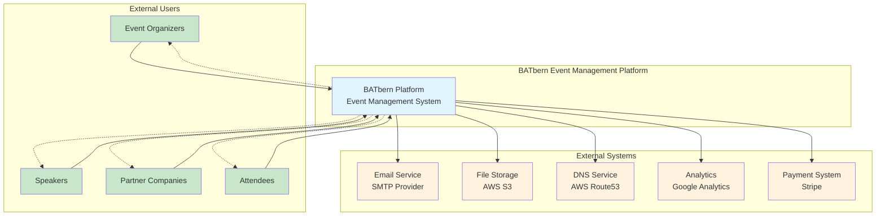
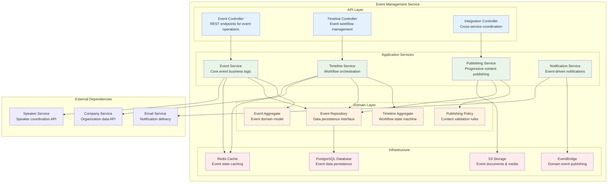

# System Overview

This document outlines the complete fullstack architecture for **BATbern Event Management Platform**, including backend systems, frontend implementation, and their integration. It serves as the single source of truth for AI-driven development, ensuring consistency across the entire technology stack.

This unified approach combines what would traditionally be separate backend and frontend architecture documents, streamlining the development process for modern fullstack applications where these concerns are increasingly intertwined.

## Project Context

**Project Nature:** Revolutionary transformation from static Angular website to comprehensive event management platform
**Current State:** Existing Angular codebase with 20+ years of historical event data
**Architecture Approach:** **Domain-Driven Design with Separate Bounded Contexts**

**Why DDD Enterprise Pattern is Superior:**

1. **Clear Domain Boundaries:** The BATbern platform has distinct domains:
   - **Event Management Domain** (Organizer workflows)
   - **Speaker Coordination Domain** (Speaker portal & workflows)
   - **Partner Analytics Domain** (ROI tracking & strategic input)
   - **Attendee Experience Domain** (Content discovery & registration)

2. **Enterprise Scalability:** Each bounded context can:
   - Scale independently based on load (attendee domain vs organizer domain)
   - Deploy separately reducing deployment risk
   - Evolve at different paces (partner analytics may change more frequently)
   - Use appropriate technology per domain needs

3. **Team Organization Benefits:**
   - Different teams can own different domains
   - Reduces cognitive load per team
   - Clear API contracts between domains
   - Independent testing and deployment cycles

**Repository Structure: DDD-Based Multi-Repository Approach**

```
BATbern-Platform/
├── shared-kernel/                 # Shared types, events, utilities
├── event-management-service/      # Organizer workflows & automation
├── speaker-coordination-service/  # Speaker portal & material collection
├── partner-analytics-service/     # ROI tracking & strategic features
├── attendee-experience-service/   # Content discovery & registration
├── api-gateway/                   # Unified API entry point
├── web-frontend/                  # React frontend consuming all APIs
└── infrastructure/                # Shared infrastructure as code
```

**Benefits over Monorepo:**
- **Clear Ownership:** Each service has dedicated team ownership
- **Independent Deployment:** Deploy speaker portal without affecting analytics
- **Technology Flexibility:** Java/Spring Boot for complex workflows, Node.js for content APIs
- **Enterprise Governance:** Easier compliance auditing per domain
- **Fault Isolation:** Issues in one domain don't affect others

## Change Log

| Date | Version | Description | Author |
|------|---------|-------------|--------|
| 2024-12-20 | 1.0 | Initial full-stack architecture document | Winston (Architect) |

## Technical Summary

The BATbern Event Management Platform employs a **Domain-Driven Design microservices architecture** with four distinct bounded contexts, each deployed as independent services behind a unified API Gateway. The React-based frontend provides role-adaptive interfaces consuming domain-specific APIs, while shared infrastructure handles cross-cutting concerns like authentication, file storage, and monitoring. This architecture enables independent scaling and deployment of the complex workflow automation features (event management), high-volume content discovery (attendee experience), analytics-heavy partner services, and streamlined speaker coordination workflows. The design prioritizes enterprise-grade reliability, Swiss compliance requirements, and the ability to evolve each domain at different paces while maintaining cohesive user experiences across all four stakeholder groups.

## C4 Model Architecture Diagrams

### Level 1: System Context Diagram



### Level 2: Container Diagram

```mermaid
graph TB
    subgraph "Users"
        A[Event Organizers]
        B[Speakers]
        C[Partners]
        D[Attendees]
    end

    subgraph "BATbern Platform - Frontend"
        E[Web Application<br/>React 18 + TypeScript<br/>Role-adaptive UI]
        F[Mobile PWA<br/>Progressive Web App<br/>Offline capabilities]
    end

    subgraph "BATbern Platform - Backend"
        G[API Gateway<br/>AWS API Gateway<br/>Authentication & Routing]

        subgraph "Microservices"
            H[Event Management Service<br/>Java 21 + Spring Boot<br/>Event workflows & coordination]
            I[Speaker Coordination Service<br/>Java 21 + Spring Boot<br/>Speaker pipeline management]
            J[Partner Analytics Service<br/>Java 21 + Spring Boot<br/>ROI analytics & reporting]
            K[Attendee Experience Service<br/>Java 21 + Spring Boot<br/>Content discovery & search]
            L[Company Management Service<br/>Java 21 + Spring Boot<br/>Organization data]
        end
    end

    subgraph "Data & Infrastructure"
        M[Authentication<br/>AWS Cognito<br/>User management & SSO]
        N[Database Cluster<br/>PostgreSQL (Multi-AZ)<br/>Per-service databases]
        O[Cache Layer<br/>Redis ElastiCache<br/>Session & data caching]
        P[File Storage<br/>AWS S3<br/>Documents & media]
        Q[CDN<br/>CloudFront<br/>Global content delivery]
    end

    subgraph "External Services"
        R[Email Provider<br/>SMTP Service<br/>Notifications]
        S[DNS Service<br/>AWS Route53<br/>Domain management & health checks]
    end

    A --> E
    B --> E
    C --> E
    D --> E
    D --> F

    E --> G
    F --> G

    G --> H
    G --> I
    G --> J
    G --> K
    G --> L

    G --> M
    H --> N
    I --> N
    J --> N
    K --> N
    L --> N

    H --> O
    I --> O
    J --> O
    K --> O
    L --> O

    H --> P
    I --> P
    J --> P
    K --> P
    L --> P

    E --> Q
    F --> Q

    H --> R
    I --> R
    J --> R

    Q --> S

    style E fill:#e3f2fd
    style F fill:#e3f2fd
    style G fill:#f3e5f5
    style H fill:#e8f5e8
    style I fill:#e8f5e8
    style J fill:#e8f5e8
    style K fill:#e8f5e8
    style L fill:#e8f5e8
    style M fill:#fff3e0
    style N fill:#fff3e0
    style O fill:#fff3e0
    style P fill:#fff3e0
    style Q fill:#fff3e0
    style R fill:#ffebee
    style S fill:#ffebee
```

### Level 3: Component Diagram - Event Management Service



## Component Overview

### Event Management Service

**Responsibility:** Core event lifecycle management, organizer workflows, and automated event planning processes including the comprehensive **16-step workflow automation** with slot management, quality control, overflow handling, and real-time collaboration.

**Enhanced Workflow Components:**
- **Event Workflow State Machine** - Manages 16-step progression from topic selection to publication
- **Slot Assignment Algorithm Service** - Intelligent speaker-to-slot matching with preferences
- **Quality Review Workflow Engine** - Automated content validation and moderator review
- **Overflow Management & Voting System** - Organizer voting for speaker selection when capacity exceeded
- **Real-time Notification & Escalation** - Cross-stakeholder alerts and deadline management

**Key Interfaces:**
- `/api/v1/events` - Event CRUD operations and status management
- `/api/v1/events/{id}/workflow` - Enhanced 16-step workflow state management
- `/api/v1/events/{id}/slots` - Slot configuration and assignment management
- `/api/v1/events/{id}/overflow` - Speaker overflow voting and waitlist management
- `/api/v1/events/{id}/timeline` - Event timeline and milestone tracking
- `/api/v1/organizers` - Organizer role management and permissions

**Dependencies:**
- Speaker Coordination Service (enhanced speaker preferences and workflow states)
- Partner Analytics Service (partner involvement tracking)
- Quality Review Service (content validation and moderator workflows)
- Notification Service (real-time alerts and escalations)
- Shared Kernel (enhanced domain events, workflow types)
- AWS Cognito (organizer authentication)
- PostgreSQL (event data persistence with workflow state)
- Redis (workflow state caching and slot assignment optimization)

**Technology Stack:** Java 21 + Spring Boot 3.2, PostgreSQL, Redis (enhanced workflow state caching), EventBridge (domain events), WebSocket (real-time notifications)

### Speaker Coordination Service

**Responsibility:** Enhanced speaker management with complex workflow states, slot preferences collection, material collection with quality control, and seamless coordination between organizers and speakers including waitlist management.

**Enhanced Speaker Workflow Features:**
- **Complex Workflow State Management** - 10-state progression: open → contacted → ready → declined/accepted → slot-assigned → quality-reviewed → final agenda → informed → waitlist
- **Slot Preferences Collection** - Time slot preferences, technical requirements, accessibility needs
- **Quality Review Integration** - Abstract validation (1000 char limit, lessons learned requirement)
- **Waitlist & Overflow Management** - Automatic waitlist handling for speaker dropouts

**Key Interfaces:**
- `/api/v1/speakers` - Enhanced speaker profile and expertise management
- `/api/v1/speakers/{id}/preferences` - Slot preferences and technical requirements
- `/api/v1/sessions/{id}/quality-review` - Content quality review workflow
- `/api/v1/invitations` - Speaker invitation workflow with enhanced context
- `/api/v1/sessions/{id}/speakers` - Speaker-session assignment with workflow states
- `/api/v1/materials` - Presentation material upload with quality validation

**Dependencies:**
- Event Management Service (enhanced session data and slot assignments)
- Company Management Service (speaker company relationships)
- Quality Review Service (content validation and moderator workflows)
- File Storage Service (presentation materials with versioning)
- Email Service (enhanced speaker communications and notifications)
- Notification Service (real-time speaker status updates)
- Shared Kernel (enhanced speaker domain events)

**Technology Stack:** Java 21 + Spring Boot 3.2, PostgreSQL, AWS S3 (file storage), SES (email notifications), WebSocket (real-time updates)

### Partner Analytics Service

**Responsibility:** Partner relationship management, ROI analytics, strategic input collection, and cross-event participation tracking for all partner companies.

**Key Interfaces:**
- `/api/v1/partners` - Partner profile and relationship management
- `/api/v1/partners/{id}/analytics` - ROI and engagement analytics
- `/api/v1/partners/{id}/topic-votes` - Strategic topic voting
- `/api/v1/reports` - Partner meeting reports and presentations

**Dependencies:**
- Attendee Experience Service (employee attendance data)
- Event Management Service (event participation data)
- Company Management Service (partner company data)
- Analytics Engine (data processing and insights)
- Shared Kernel (partner domain events)

**Technology Stack:** Java 21 + Spring Boot 3.2, PostgreSQL (analytics data), ElastiCache Redis (metrics caching), AWS QuickSight (dashboard generation)

### Attendee Experience Service

**Responsibility:** Attendee registration, content discovery, historical archive search, and personalized content recommendations across 20+ years of BATbern content.

**Key Interfaces:**
- `/api/v1/events/{id}/registrations` - Event registration management
- `/api/v1/content/search` - AI-powered content discovery
- `/api/v1/attendees/me` - Personal attendee dashboard
- `/api/v1/recommendations` - Personalized content recommendations

**Dependencies:**
- Event Management Service (event data for registration)
- Speaker Coordination Service (session and speaker data)
- Content Search Engine (OpenSearch for full-text search)
- Recommendation Engine (ML-based content suggestions)
- Shared Kernel (attendee domain events)

**Technology Stack:** Java 21 + Spring Boot 3.2, PostgreSQL (registration data), AWS OpenSearch (content search), Lambda (recommendation algorithms)

### Company Management Service

**Responsibility:** Centralized company entity management with logo storage, partner recognition, and company creation workflows for speakers and organizers.

**Key Interfaces:**
- `/api/v1/companies` - Company CRUD operations and search
- `/api/v1/companies/{id}/logo` - Logo upload and management
- `/api/v1/companies/suggest` - Company name suggestions and duplicate detection

**Dependencies:**
- File Storage Service (logo management)
- All domain services (company relationship validation)
- Shared Kernel (company domain events)

**Technology Stack:** Java 21 + Spring Boot 3.2, PostgreSQL, AWS S3 (logo storage), ElastiCache Redis (company search caching)

### Frontend Application

**Responsibility:** Role-adaptive user interface providing distinct experiences for organizers, speakers, partners, and attendees with Progressive Web App capabilities.

**Key Interfaces:**
- Role-based component rendering system
- API client service layer
- State management for user sessions
- PWA service worker for offline capabilities

**Dependencies:**
- API Gateway (all backend communication)
- CDN (static asset delivery)
- Browser APIs (PWA features)

**Technology Stack:** React 18.2 + TypeScript, Zustand (state management), React Query (server state), Vite (build tool), Workbox (PWA)