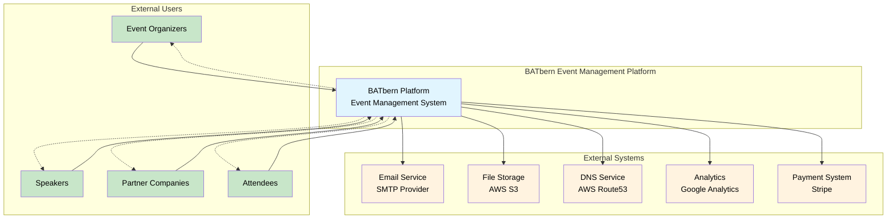
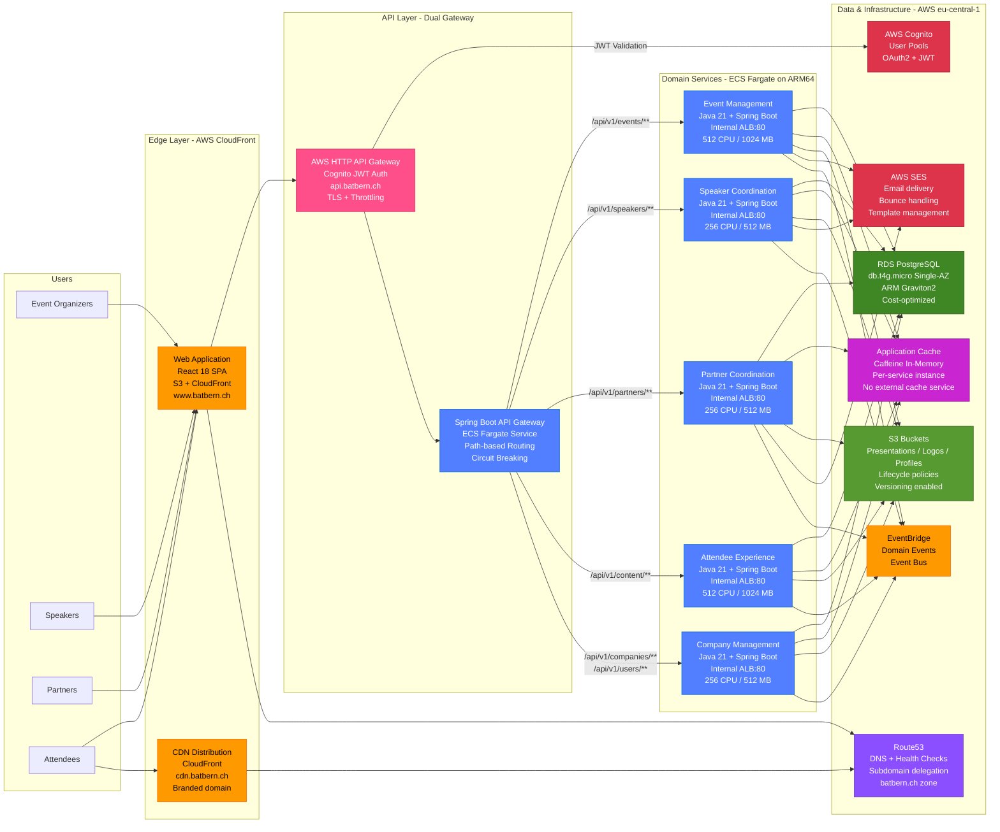
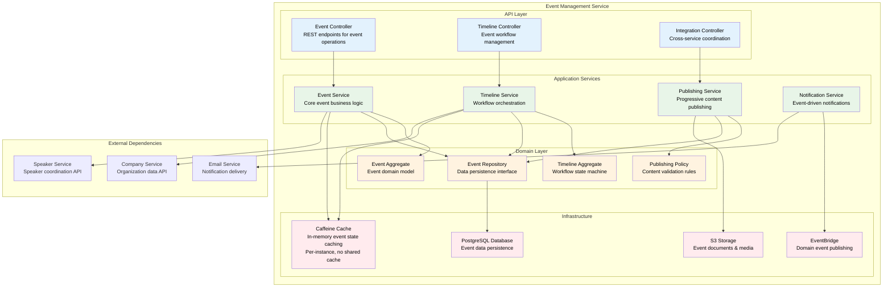

# System Overview

This document outlines the complete fullstack architecture for **BATbern Event Management Platform**, including backend systems, frontend implementation, and their integration. It serves as the single source of truth for AI-driven development, ensuring consistency across the entire technology stack.

This unified approach combines what would traditionally be separate backend and frontend architecture documents, streamlining the development process for modern fullstack applications where these concerns are increasingly intertwined.

## Project Context

**Project Nature:** Revolutionary transformation from static Angular website to comprehensive event management platform
**Current State:** Existing Angular codebase with 20+ years of historical event data
**Architecture Approach:** **Domain-Driven Design with Separate Bounded Contexts**

**Why DDD Enterprise Pattern is Superior:**

1. **Clear Domain Boundaries:** The BATbern platform has distinct domains:
   - **Event Management Domain** (Organizer workflows)
   - **Speaker Coordination Domain** (Speaker portal & workflows)
   - **Partner Analytics Domain** (ROI tracking & strategic input)
   - **Attendee Experience Domain** (Content discovery & registration)

2. **Enterprise Scalability:** Each bounded context can:
   - Scale independently based on load (attendee domain vs organizer domain)
   - Deploy separately reducing deployment risk
   - Evolve at different paces (partner analytics may change more frequently)
   - Use appropriate technology per domain needs

3. **Team Organization Benefits:**
   - Different teams can own different domains
   - Reduces cognitive load per team
   - Clear API contracts between domains
   - Independent testing and deployment cycles

**Repository Structure: DDD-Based Multi-Repository Approach**

```
BATbern-Platform/
├── shared-kernel/                 # Shared types, events, utilities
├── event-management-service/      # Organizer workflows & automation
├── speaker-coordination-service/  # Speaker portal & material collection
├── partner-coordination-service/  # Topic voting & meeting coordination
├── attendee-experience-service/   # Content discovery & registration
├── api-gateway/                   # Unified API entry point
├── web-frontend/                  # React frontend consuming all APIs
└── infrastructure/                # Shared infrastructure as code
```

**Benefits over Monorepo:**
- **Clear Ownership:** Each service has dedicated team ownership
- **Independent Deployment:** Deploy speaker portal without affecting analytics
- **Technology Flexibility:** Java/Spring Boot for complex workflows, Node.js for content APIs
- **Enterprise Governance:** Easier compliance auditing per domain
- **Fault Isolation:** Issues in one domain don't affect others

## Change Log

| Date | Version | Description | Author |
|------|---------|-------------|--------|
| 2024-12-20 | 1.0 | Initial full-stack architecture document | Winston (Architect) |

## Technical Summary

The BATbern Event Management Platform employs a **Domain-Driven Design microservices architecture** with four distinct bounded contexts, each deployed as independent services behind a unified API Gateway. The React-based frontend provides role-adaptive interfaces consuming domain-specific APIs, while shared infrastructure handles cross-cutting concerns like authentication, file storage, and monitoring. This architecture enables independent scaling and deployment of the complex workflow automation features (event management), high-volume content discovery (attendee experience), analytics-heavy partner services, and streamlined speaker coordination workflows. The design prioritizes enterprise-grade reliability, Swiss compliance requirements, and the ability to evolve each domain at different paces while maintaining cohesive user experiences across all four stakeholder groups.

## C4 Model Architecture Diagrams

### Level 1: System Context Diagram


```mermaid
graph TB
    subgraph "External Users"
        A[Event Organizers]
        B[Speakers]
        C[Partner Companies]
        D[Attendees]
    end

    subgraph "External Systems"
        E[Email Service<br/>SMTP Provider]
        F[File Storage<br/>AWS S3]
        G[DNS Service<br/>AWS Route53]
        H[Analytics<br/>Google Analytics]
        I[Payment System<br/>Stripe]
    end

    subgraph "BATbern Event Management Platform"
        J[BATbern Platform<br/>Event Management System]
    end

    A --> J
    B --> J
    C --> J
    D --> J

    J --> E
    J --> F
    J --> G
    J --> H
    J --> I

    J -.-> A
    J -.-> B
    J -.-> C
    J -.-> D

    style J fill:#e1f5fe,color:#000
    style A fill:#c8e6c9,color:#000
    style B fill:#c8e6c9,color:#000
    style C fill:#c8e6c9,color:#000
    style D fill:#c8e6c9,color:#000
    style E fill:#fff3e0,color:#000
    style F fill:#fff3e0,color:#000
    style G fill:#fff3e0,color:#000
    style H fill:#fff3e0,color:#000
    style I fill:#fff3e0,color:#000
```

### Level 2: Container Diagram (AWS-Optimized Architecture)


```mermaid
graph LR
    subgraph "Users"
        A[Event Organizers]
        B[Speakers]
        C[Partners]
        D[Attendees]
    end

    subgraph "Edge Layer - AWS CloudFront"
        E[Web Application<br/>React 18 SPA<br/>S3 + CloudFront<br/>www.batbern.ch]
        Q[CDN Distribution<br/>CloudFront<br/>cdn.batbern.ch<br/>Branded domain]
    end

    subgraph "API Layer - Dual Gateway"
        G[AWS HTTP API Gateway<br/>Cognito JWT Auth<br/>api.batbern.ch<br/>TLS + Throttling]
        GW[Spring Boot API Gateway<br/>ECS Fargate Service<br/>Path-based Routing<br/>Circuit Breaking]
    end

    subgraph "Domain Services - ECS Fargate on ARM64"
        H[Event Management<br/>Java 21 + Spring Boot<br/>Internal ALB:80<br/>512 CPU / 1024 MB]
        I[Speaker Coordination<br/>Java 21 + Spring Boot<br/>Internal ALB:80<br/>256 CPU / 512 MB]
        J[Partner Coordination<br/>Java 21 + Spring Boot<br/>Internal ALB:80<br/>256 CPU / 512 MB]
        K[Attendee Experience<br/>Java 21 + Spring Boot<br/>Internal ALB:80<br/>512 CPU / 1024 MB]
        L[Company Management<br/>Java 21 + Spring Boot<br/>Internal ALB:80<br/>256 CPU / 512 MB]
    end

    subgraph "Data & Infrastructure - AWS eu-central-1"
        M[AWS Cognito<br/>User Pools<br/>OAuth2 + JWT]
        N[RDS PostgreSQL<br/>db.t4g.micro Single-AZ<br/>ARM Graviton2<br/>Cost-optimized]
        O[Application Cache<br/>Caffeine In-Memory<br/>Per-service instance<br/>No external cache service]
        P[S3 Buckets<br/>Presentations / Logos / Profiles<br/>Lifecycle policies<br/>Versioning enabled]
        R[AWS SES<br/>Email delivery<br/>Bounce handling<br/>Template management]
        S[Route53<br/>DNS + Health Checks<br/>Subdomain delegation<br/>batbern.ch zone]
        EB[EventBridge<br/>Domain Events<br/>Event Bus]
    end

    A & B & C & D --> E
    D --> Q

    E --> G
    G -->|JWT Validation| M
    G --> GW

    GW -->|/api/v1/events/**| H
    GW -->|/api/v1/speakers/**| I
    GW -->|/api/v1/partners/**| J
    GW -->|/api/v1/content/**| K
    GW -->|/api/v1/companies/**<br/>/api/v1/users/**| L

    H & I & J & K & L --> N
    H & I & J & K & L --> O
    H & I & J & K & L --> P
    H & I & J --> R
    H & I & J & K & L --> EB

    E & Q --> S

    style E fill:#FF9900,stroke:#FF6600,color:#000
    style Q fill:#FF9900,stroke:#FF6600,color:#000
    style G fill:#FF4F8B,stroke:#C7365F,color:#fff
    style GW fill:#527FFF,stroke:#0066CC,color:#fff
    style H fill:#527FFF,stroke:#0066CC,color:#fff
    style I fill:#527FFF,stroke:#0066CC,color:#fff
    style J fill:#527FFF,stroke:#0066CC,color:#fff
    style K fill:#527FFF,stroke:#0066CC,color:#fff
    style L fill:#527FFF,stroke:#0066CC,color:#fff
    style M fill:#DD344C,stroke:#A21835,color:#fff
    style N fill:#3F8624,stroke:#2D5016,color:#fff
    style O fill:#C925D1,stroke:#8B1A8B,color:#fff
    style P fill:#569A31,stroke:#3A6B1F,color:#fff
    style R fill:#DD344C,stroke:#A21835,color:#fff
    style S fill:#8C4FFF,stroke:#6B3ACC,color:#fff
    style EB fill:#FF9900,stroke:#FF6600,color:#000
```

**AWS Service Color Legend:**
- 🟠 **Orange** (#FF9900): Compute/CDN (CloudFront, ECS, EventBridge)
- 🔴 **Red/Pink** (#DD344C, #FF4F8B): Security/Messaging (Cognito, SES, API Gateway)
- 🔵 **Blue** (#527FFF): Containers/Applications (ECS Fargate Services)
- 🟢 **Green** (#3F8624, #569A31): Database & Storage (RDS, S3)
- 🟣 **Purple** (#C925D1, #8C4FFF): Caching & DNS (Caffeine, Route53)

**Note:** This diagram uses AWS official color scheme. When AWS icons become stable in Mermaid,
we can convert this to architecture-beta syntax with icon support.

**Key Architecture Decisions:**
1. **Dual API Gateway**: AWS HTTP API for edge security + Spring Boot Gateway for routing
2. **ECS Fargate ARM64**: 20% cost savings with Graviton2 processors
3. **Single-AZ RDS**: Cost-optimized for 1000 users/month workload
4. **Application-level Caching**: Caffeine in-memory per service instance (eliminates ElastiCache Redis, $149/month savings)
5. **Branded CDN**: Custom CloudFront domains (cdn.batbern.ch) for professional appearance
6. **Event-Driven Architecture**: EventBridge for loosely coupled domain events

**Technology Stack:**
- **Frontend**: React 18 + TypeScript, deployed on S3 + CloudFront
- **API Gateway**: Spring Boot 3 + Spring Cloud Gateway
- **Microservices**: Java 21 + Spring Boot, running on ECS Fargate
- **Database**: PostgreSQL 15 on RDS (ARM Graviton2)
- **Authentication**: AWS Cognito with OAuth2/JWT
- **Storage**: S3 with lifecycle policies
- **Messaging**: EventBridge for domain events

### Level 3: Component Diagram - Event Management Service


```mermaid
graph TB
    subgraph "Event Management Service"
        subgraph "API Layer"
            A[Event Controller<br/>REST endpoints for event operations]
            B[Timeline Controller<br/>Event workflow management]
            C[Integration Controller<br/>Cross-service coordination]
        end

        subgraph "Application Services"
            D[Event Service<br/>Core event business logic]
            E[Timeline Service<br/>Workflow orchestration]
            F[Publishing Service<br/>Progressive content publishing]
            G[Notification Service<br/>Event-driven notifications]
        end

        subgraph "Domain Layer"
            H[Event Aggregate<br/>Event domain model]
            I[Timeline Aggregate<br/>Workflow state machine]
            J[Publishing Policy<br/>Content validation rules]
            K[Event Repository<br/>Data persistence interface]
        end

        subgraph "Infrastructure"
            L[PostgreSQL Database<br/>Event data persistence]
            M[Caffeine Cache<br/>In-memory event state caching<br/>Per-instance, no shared cache]
            N[S3 Storage<br/>Event documents & media]
            O[EventBridge<br/>Domain event publishing]
        end
    end

    subgraph "External Dependencies"
        P[Speaker Service<br/>Speaker coordination API]
        Q[Company Service<br/>Organization data API]
        R[Email Service<br/>Notification delivery]
    end

    A --> D
    B --> E
    C --> F

    D --> H
    E --> I
    F --> J

    D --> K
    E --> K
    F --> K

    K --> L
    D --> M
    E --> M
    F --> N
    G --> O

    D --> P
    E --> Q
    G --> R

    style A fill:#e3f2fd,color:#000
    style B fill:#e3f2fd,color:#000
    style C fill:#e3f2fd,color:#000
    style D fill:#e8f5e8,color:#000
    style E fill:#e8f5e8,color:#000
    style F fill:#e8f5e8,color:#000
    style G fill:#e8f5e8,color:#000
    style H fill:#fff3e0,color:#000
    style I fill:#fff3e0,color:#000
    style J fill:#fff3e0,color:#000
    style K fill:#fff3e0,color:#000
    style L fill:#ffebee,color:#000
    style M fill:#ffebee,color:#000
    style N fill:#ffebee,color:#000
    style O fill:#ffebee,color:#000
```

## Component Overview

### Event Management Service

**Responsibility:** Core event lifecycle management, organizer workflows, and automated event planning processes including the comprehensive **9-state workflow** with slot management, quality control, overflow handling, and real-time collaboration.

**Enhanced Workflow Components:**
- **Event Workflow State Machine** - Manages 9-state progression from creation to archival (see 06a-workflow-state-machines.md)
- **Slot Assignment Algorithm Service** - Intelligent speaker-to-slot matching with preferences
- **Quality Review Workflow Engine** - Automated content validation and moderator review
- **Overflow Management & Voting System** - Organizer voting for speaker selection when capacity exceeded
- **Real-time Notification & Escalation** - Cross-stakeholder alerts and deadline management

**Key Interfaces:**
- `/api/v1/events` - Event CRUD operations and status management
- `/api/v1/events/{id}/workflow` - Enhanced 9-state workflow state management
- `/api/v1/events/{id}/slots` - Slot configuration and assignment management
- `/api/v1/events/{id}/overflow` - Speaker overflow voting and waitlist management
- `/api/v1/events/{id}/timeline` - Event timeline and milestone tracking
- `/api/v1/organizers` - Organizer role management and permissions

**Dependencies:**
- Speaker Coordination Service (enhanced speaker preferences and workflow states)
- Partner Coordination Service (partner topic voting integration)
- Quality Review Service (content validation and moderator workflows)
- Notification Service (real-time alerts and escalations)
- Shared Kernel (enhanced domain events, workflow types)
- AWS Cognito (organizer authentication)
- PostgreSQL (event data persistence with workflow state)
- Caffeine Cache (in-memory workflow state caching and optimization)

**Technology Stack:** Java 21 + Spring Boot 3.x, PostgreSQL 15+, Caffeine 3.x (in-memory caching), EventBridge (domain events), WebSocket (real-time notifications)

### Speaker Coordination Service

**Responsibility:** Enhanced speaker management with complex workflow states, slot preferences collection, material collection with quality control, and seamless coordination between organizers and speakers including waitlist management.

**Enhanced Speaker Workflow Features:**
- **Workflow State Management** - 11-state progression with parallel paths: identified → contacted → ready → accepted/declined; then content_submitted → quality_reviewed ∥ slot_assigned → confirmed; plus overflow and withdrew states
- **Slot Preferences Collection** - Time slot preferences, technical requirements, accessibility needs
- **Quality Review Integration** - Abstract validation (1000 char limit), moderator review workflow
- **Overflow Management** - Separate tracking of overflow speakers with automatic promotion on dropouts

**Key Interfaces:**
- `/api/v1/speakers` - Enhanced speaker profile and expertise management
- `/api/v1/speakers/{id}/preferences` - Slot preferences and technical requirements
- `/api/v1/sessions/{id}/quality-review` - Content quality review workflow
- `/api/v1/invitations` - Speaker invitation workflow with enhanced context
- `/api/v1/sessions/{id}/speakers` - Speaker-session assignment with workflow states
- `/api/v1/materials` - Presentation material upload with quality validation

**Dependencies:**
- Event Management Service (enhanced session data and slot assignments)
- Company Management Service (speaker company relationships)
- Quality Review Service (content validation and moderator workflows)
- File Storage Service (presentation materials with versioning)
- Email Service (enhanced speaker communications and notifications)
- Notification Service (real-time speaker status updates)
- Shared Kernel (enhanced speaker domain events)

**Technology Stack:** Java 21 + Spring Boot 3.2, PostgreSQL, AWS S3 (file storage), SES (email notifications), WebSocket (real-time updates)

### Partner Coordination Service

**Responsibility:** Partner relationship management, strategic topic voting, partner meeting coordination, and partnership lifecycle management.

**Key Interfaces:**
- `/api/v1/partners` - Partner profile and relationship management
- `/api/v1/partners/{id}/topic-votes` - Strategic topic voting and suggestions
- `/api/v1/partners/{id}/meetings` - Partner meeting scheduling and coordination
- `/api/v1/topics/voting` - Topic voting and prioritization

**Dependencies:**
- Event Management Service (topic backlog integration, event participation data)
- Company Management Service (partner company data)
- Notification Service (meeting reminders and voting notifications)
- Shared Kernel (partner domain events)

**Technology Stack:** Java 21 + Spring Boot 3.2, PostgreSQL (partnership and voting data), AWS SES (meeting notifications)

### Attendee Experience Service

**Responsibility:** Attendee registration, content discovery, historical archive search, and personalized content recommendations across 20+ years of BATbern content.

**Key Interfaces:**
- `/api/v1/events/{id}/registrations` - Event registration management
- `/api/v1/content/search` - AI-powered content discovery
- `/api/v1/attendees/me` - Personal attendee dashboard
- `/api/v1/recommendations` - Personalized content recommendations

**Dependencies:**
- Event Management Service (event data for registration)
- Speaker Coordination Service (session and speaker data)
- Content Search Engine (PostgreSQL full-text search)
- Shared Kernel (attendee domain events)

**Technology Stack:** Java 21 + Spring Boot 3.2, PostgreSQL (registration data and content search)

### Company Management Service

**Responsibility:** Centralized company entity management with logo storage, partner recognition, and company creation workflows for speakers and organizers.

**Key Interfaces:**
- `/api/v1/companies` - Company CRUD operations and search
- `/api/v1/companies/{id}/logo` - Logo upload and management
- `/api/v1/companies/suggest` - Company name suggestions and duplicate detection

**Dependencies:**
- File Storage Service (logo management)
- All domain services (company relationship validation)
- Shared Kernel (company domain events)

**Technology Stack:** Java 21 + Spring Boot 3.x, PostgreSQL 15+, AWS S3 (logo storage), Caffeine 3.x (company search caching)

### Frontend Application

**Responsibility:** Role-adaptive user interface providing distinct experiences for organizers, speakers, partners, and attendees with Progressive Web App capabilities.

**Key Interfaces:**
- Role-based component rendering system
- API client service layer
- State management for user sessions
- PWA service worker for offline capabilities

**Dependencies:**
- API Gateway (all backend communication)
- CDN (static asset delivery)
- Browser APIs (PWA features)

**Technology Stack:** React 18.2 + TypeScript, Zustand (state management), React Query (server state), Vite (build tool), Workbox (PWA)