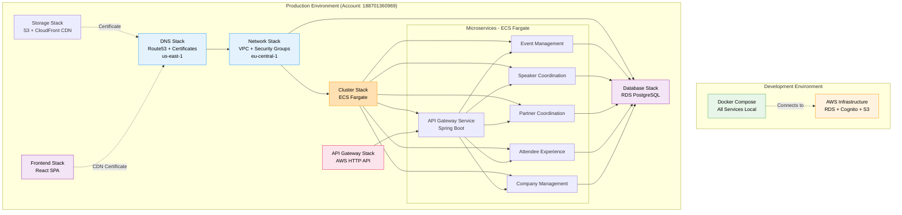
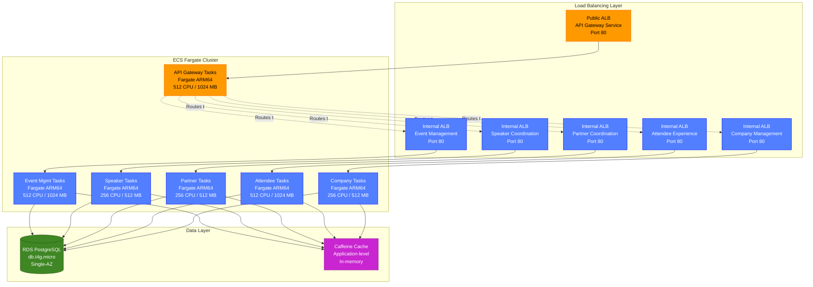
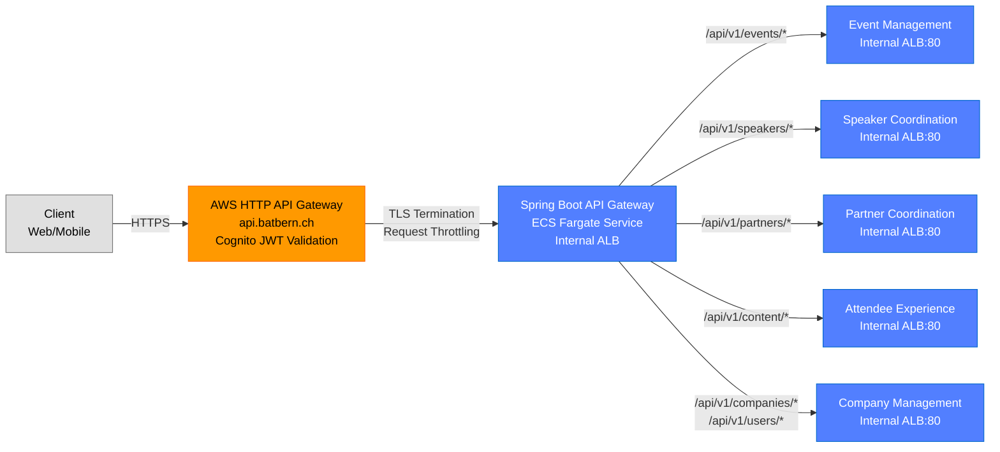
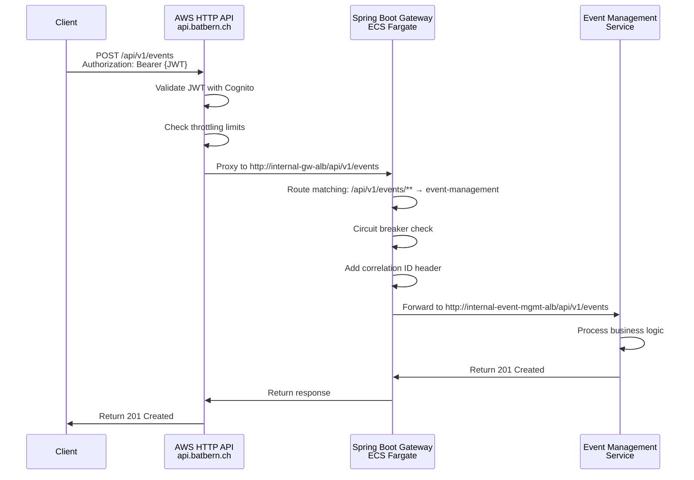
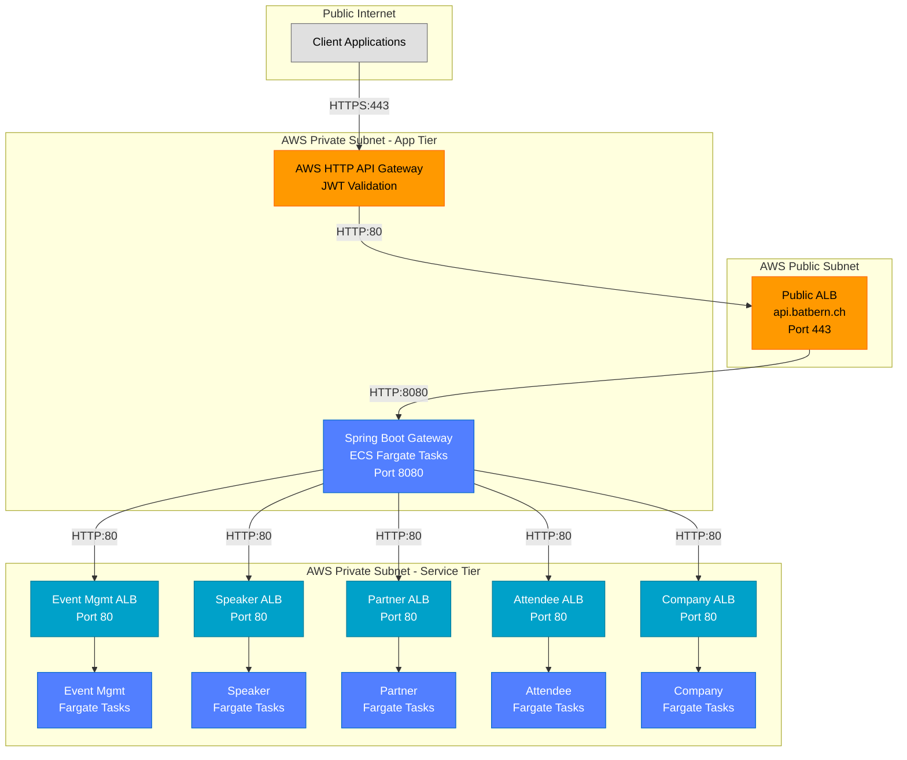
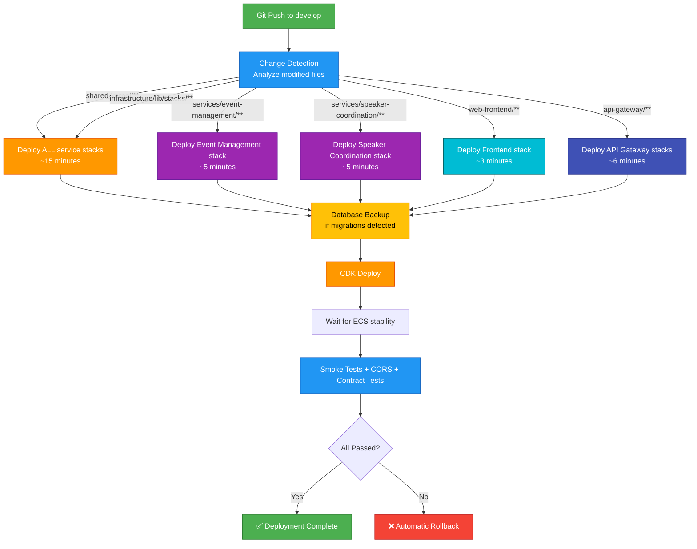
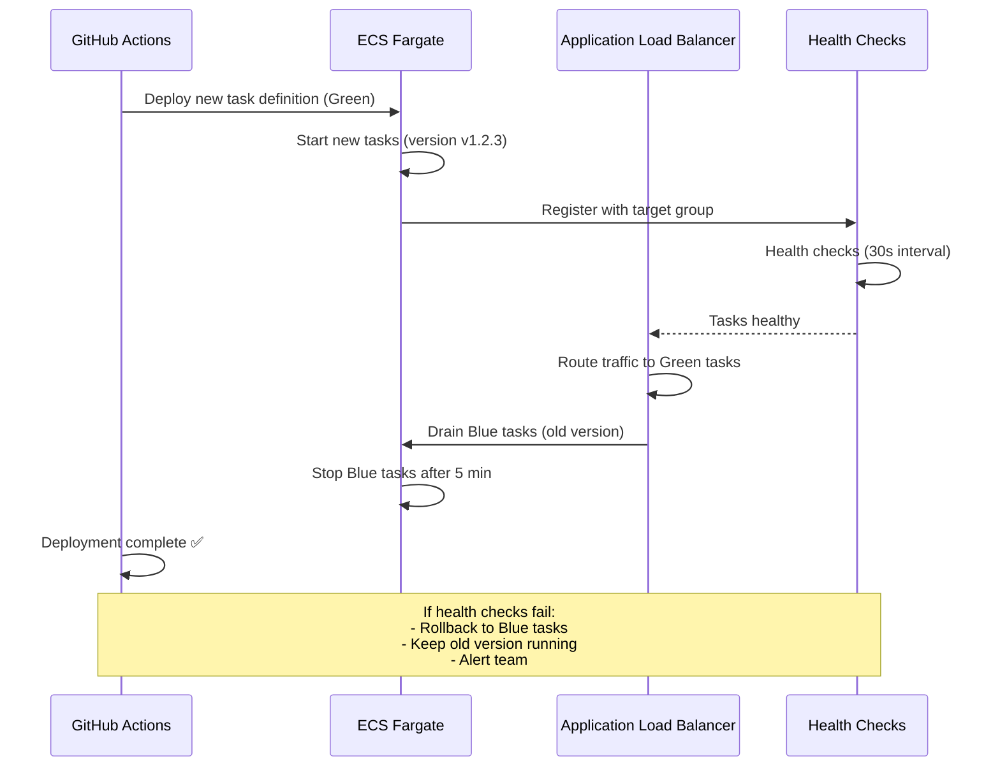
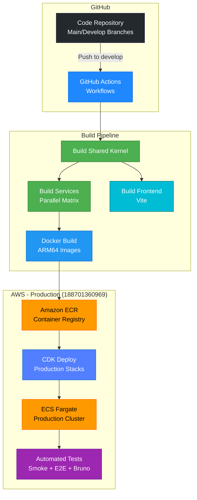
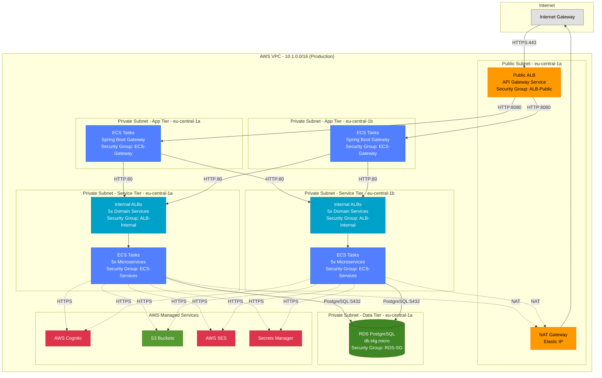
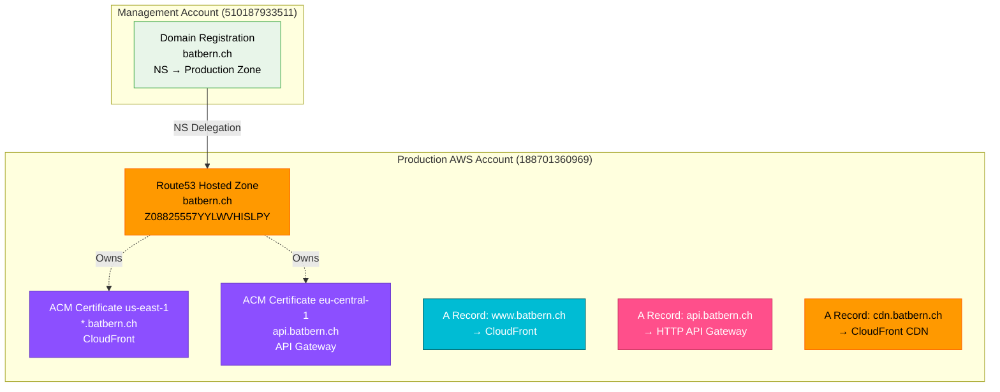

# Infrastructure & Deployment

## Deployment Architecture Overview

### Multi-Environment Strategy

BATbern uses a **local-first development model** optimized for cost and developer productivity:

| Environment | Infrastructure | Services & Frontend | Rationale |
|-------------|---------------|---------------------|-----------|
| **Development** | Local PostgreSQL (Docker) | Native execution (Java + Vite) | Zero AWS costs + 60-70% less resources |
| **Production** | AWS (Full stack) | AWS ECS Fargate | Swiss hosting, GDPR compliance |

**Development Environment Details:**
- Uses production Cognito for authentication (shared with AWS)
- Uses production S3 for file storage (shared with AWS)
- **Saves $600-720/year** by eliminating dedicated development AWS environment

### AWS Account Architecture (Consolidated)

> **Environment Consolidation (March 2026):** Staging account promoted to serve production traffic.
> CloudFormation stacks retain `BATbern-staging-*` names. The `isProduction: true` flag in CDK config controls production behavior.

- **Development**: No AWS account (local PostgreSQL + production Cognito/S3)
- **Production**: 188701360969 (Full stack, root domain `batbern.ch`, CDK `envName: 'staging'`)
- **Management**: 510187933511 (Domain registration only, profile `batbern-mgmt`)
- **Former Production**: 422940799530 (Decommissioned)

### CDK Stack Deployment Order

The infrastructure is deployed as **14+ interconnected CDK stacks** with explicit dependencies:

```
1. DNS Stack (us-east-1) → Creates certificates for CloudFront
2. Network Stack → VPC, security groups, regional API certificate
3. Secrets Stack → AWS Secrets Manager, KMS keys
4. Database Stack → RDS PostgreSQL, automated backups
5. Storage Stack → S3 buckets, CloudFront CDN
6. EventBus Stack → EventBridge for domain events
7. Monitoring Stack → CloudWatch dashboards, alarms, GitHub issues integration
8. CI/CD Stack → ECR repositories, GitHub Actions OIDC roles
9. Cognito Stack → User pools, identity providers
10. SES Stack → Email templates, bounce handling
11. Cluster Stack → ECS Fargate cluster (staging/production only)
12. Domain Service Stacks → Each microservice deployed separately
    - Event Management Stack
    - Speaker Coordination Stack
    - Partner Coordination Stack
    - Attendee Experience Stack
    - Company Management Stack
    - API Gateway Service Stack (Spring Boot)
13. API Gateway Stack → AWS HTTP API (proxy to Spring Boot)
14. Frontend Stack → React SPA on S3 + CloudFront
```

**Key Insights:**
- Stacks have explicit dependencies (e.g., Database depends on Network + Secrets)
- Production deploys all stacks; Development skips stacks 11-14
- CI/CD supports **selective deployment** (only changed service stacks)
- Average full deployment: ~15 minutes; selective deployment: ~5 minutes

### Deployment Architecture Diagram



## Cost-Optimized AWS Infrastructure

### Overview

The BATbern platform infrastructure has been optimized for cost-efficiency while maintaining reliability for our use case of 1000 monthly active users with 3 peak event periods per year.

**Total Cost Reduction: 83% (from original design)**
- Production (single account): ~$150/month
- Development: $0/month (fully local)
- **Additional savings from environment consolidation:** ~$1,800/year (eliminated separate production account)

### Infrastructure Configuration by Environment

#### Production Environment (Account: 188701360969, CDK envName: `staging`)

| Component | Configuration | Cost Optimization |
|-----------|--------------|-------------------|
| **VPC** | 2 AZ (eu-central-1a) | Reduced from 3 AZs |
| **NAT Gateway** | 1 NAT Gateway | Reduced from 3 |
| **RDS Database** | db.t4g.micro (ARM-based), Single-AZ | Reduced from db.t3.medium Multi-AZ |
| **Storage** | 20GB gp3 | Cost-optimized |
| **ElastiCache Redis** | Removed | Now using in-memory caching (Caffeine) |
| **Log Retention** | 30 days | Reduced from 180 days |
| **Backup Retention** | 14 days | GDPR compliance |
| **Deletion Protection** | Enabled | Production safety |
| **Domains** | www.batbern.ch, api.batbern.ch, cdn.batbern.ch | Production traffic |

#### Development Environment (Local PostgreSQL)

| Component | Configuration | Cost Optimization |
|-----------|--------------|-------------------|
| **PostgreSQL** | Docker container (localhost) | Fully local - no AWS costs |
| **Cognito** | Staging Cognito (AWS) | Shared with staging environment |
| **S3 Buckets** | Staging buckets (AWS) | Shared with staging environment |
| **Services** | Native execution (Java processes) | 60-70% less resources than Docker |
| **Frontend** | Vite dev server (localhost) | Hot reload development |
| **Note** | **No AWS development environment** | **Saves $600-720/year** |

### Deployment Model Details

#### Development Environment Architecture (Local-First)

**What Runs Locally:**
- **PostgreSQL 15** - Docker container with persistent volume
- **All Microservices** - Native Java processes (ports 8080-8085)
- **Frontend** - Vite dev server (port 3000)

**What Uses AWS (Production Account):**
- **AWS Cognito** - Authentication (shared with production)
- **S3 Buckets** - File storage (shared with production)

**Local Development Commands:**
```bash
# 1. Start local PostgreSQL
docker compose -f docker-compose-dev.yml up -d

# 2. Start all services natively (recommended)
make dev-native-up

# 3. First time only: Sync users from production Cognito
./scripts/auth/get-token.sh staging your-email@example.com your-password
./scripts/dev/sync-users-from-cognito.sh

# Running services:
# → PostgreSQL on localhost:5432 (Docker)
# → api-gateway on http://localhost:8080 (native)
# → company-user-management on http://localhost:8081 (native)
# → event-management on http://localhost:8082 (native)
# → speaker-coordination on http://localhost:8083 (native)
# → partner-coordination on http://localhost:8084 (native)
# → attendee-experience on http://localhost:8085 (native)
# → React frontend on http://localhost:3000 (Vite)
```

**Benefits:**
- ✅ **Zero AWS development environment costs** ($600-720/year savings)
- ✅ Instant code changes with hot reload
- ✅ 60-70% less resource usage than Docker Compose
- ✅ Full debugging capabilities (breakpoints, profiling)
- ✅ Local database with production-parity (PostgreSQL 15)
- ✅ Uses production Cognito for realistic authentication testing
- ✅ Completely isolated developer environments

**Developer Workflow:**
```bash
# Morning: Start development environment
docker compose -f docker-compose-dev.yml up -d  # PostgreSQL
make dev-native-up                              # All services

# During development:
# - Make code changes → services auto-reload
# - Local PostgreSQL → instant database queries
# - Staging Cognito → realistic auth testing
# - View logs: make dev-native-logs

# Evening: Stop services
make dev-native-down
```

#### Production Architecture

**Full AWS Deployment using ECS Fargate:**



**ECS Configuration:**
- **Container Platform**: AWS ECS Fargate (serverless containers)
- **Architecture**: ARM64 (Graviton2) for 20% cost savings
- **Networking**: Private subnets with NAT Gateway egress
- **Service Discovery**: Internal ALB DNS names passed as environment variables
- **Auto-scaling**: CPU-based (target 70% utilization)
- **Health Checks**: Spring Boot Actuator `/actuator/health` endpoints

**Production Service Sizing:**

| Service | CPU | Memory | Desired Count | Max Count | Monthly Cost |
|---------|-----|--------|---------------|-----------|--------------|
| API Gateway Service | 512 | 1024 MB | 2 | 8 | ~$25 |
| Event Management | 512 | 1024 MB | 2 | 8 | ~$25 |
| Speaker Coordination | 256 | 512 MB | 2 | 8 | ~$12 |
| Partner Coordination | 256 | 512 MB | 2 | 8 | ~$12 |
| Attendee Experience | 512 | 1024 MB | 2 | 8 | ~$25 |
| Company Management | 256 | 512 MB | 2 | 8 | ~$12 |
| **Total ECS Costs** | | | | | **~$111/month** |

> **Note:** Production uses the same sizing as the table above. There is no separate staging environment.

### Architecture Decisions & Trade-offs

#### 1. Single Availability Zone Deployment

**Decision:** Deploy all infrastructure in a single AZ instead of Multi-AZ configuration.

**Benefits:**
- **Cost Reduction:** Eliminates cross-AZ data transfer costs ($70/month savings on NAT Gateways alone)
- **Simplified Management:** Reduced complexity in networking and service coordination
- **Sufficient Reliability:** For 1000 users/month, manual failover within 5 minutes is acceptable

**Trade-offs:**
- **No Automatic Failover:** AZ-level failures require manual intervention
- **Acceptable for Use Case:** BAT events occur 3 times per year; minimal impact window
- **Mitigation:** Comprehensive monitoring, automated backups, documented runbooks

#### 2. RDS Database Optimization

**Decision:** Migrate from db.t3.medium Multi-AZ to db.t4g.micro Single-AZ.

**Benefits:**
- **80% Cost Reduction:** From $99/month to $19/month (production)
- **ARM Performance:** T4G instances provide better price/performance ratio
- **Sufficient Capacity:** 1GB RAM and burstable CPU handles 1000 users effectively

**Trade-offs:**
- **No Automatic Failover:** Single-AZ means database downtime during AZ failure
- **Connection Limits:** Max 100 connections (sufficient for current load)
- **Mitigation:** Daily automated backups (30-day retention), point-in-time recovery, event-based scaling

#### 3. ElastiCache Redis Removal

**Decision:** Remove ElastiCache Redis entirely and use application-level in-memory caching.

**Benefits:**
- **$149/month Savings:** Complete elimination of Redis costs (production)
- **Simplified Architecture:** One less service to manage and monitor
- **Application Caching:** Spring Boot Caffeine cache provides excellent performance

**Trade-offs:**
- **Cache Not Shared:** Each application instance maintains separate cache
- **Slight Latency Increase:** +20-50ms for cache misses (acceptable for low traffic)
- **Mitigation:** Optimized database queries, selective caching of frequently accessed data

**Application Configuration:**
```yaml
# application-production.yml
spring:
  cache:
    type: caffeine
    caffeine:
      spec: maximumSize=500,expireAfterWrite=10m
```

#### 4. Log Retention Reduction

**Decision:** Reduce CloudWatch Logs retention from 180 days to 30 days.

**Benefits:**
- **$13/month Savings:** Significant reduction in log storage costs
- **Compliance:** 30 days sufficient for operational troubleshooting

**Trade-offs:**
- **Limited Historical Analysis:** Cannot analyze logs older than 30 days
- **Mitigation:** Export critical logs to S3 for long-term archival if needed

### Event Scaling Strategy

For the 3 annual BAT events, the infrastructure can be temporarily scaled up:

**Pre-Event Scaling (1 week before event):**
```bash
# Scale up RDS instance
aws rds modify-db-instance \
  --db-instance-identifier batbern-production \
  --db-instance-class db.t4g.small \
  --apply-immediately
```

**Post-Event Scaling:**
```bash
# Scale back down
aws rds modify-db-instance \
  --db-instance-identifier batbern-production \
  --db-instance-class db.t4g.micro \
  --apply-immediately
```

**Event Cost Impact:** ~$40 per event week × 3 = $120/year additional
**Total Annual Cost with Events:** $2,160 + $120 = $2,280/year (vs. $12,672 previously)

### Monitoring Cost-Optimized Infrastructure

**Critical Metrics to Monitor:**

1. **RDS Performance**
   - CPU utilization (alert > 80%)
   - Connection count (alert > 80 connections)
   - Storage usage (alert > 80% of 50GB)
   - Burst credits remaining

2. **NAT Gateway**
   - Single point of failure monitoring
   - Data transfer metrics
   - Connection tracking

3. **Application Performance**
   - API response time (P95 < 500ms)
   - Cache hit ratio (target > 80%)
   - Memory usage per service instance

4. **Cost Monitoring**
   - AWS Cost Explorer daily checks
   - Budget alerts at $200/month (production)
   - Unexpected cost spike detection

**CloudWatch Alarms:**
```yaml
Alarms:
  RDS_HighCPU:
    Metric: CPUUtilization
    Threshold: 80%
    Action: SNS notification to ops team

  RDS_HighConnections:
    Metric: DatabaseConnections
    Threshold: 80
    Action: SNS notification

  API_HighLatency:
    Metric: P95Latency
    Threshold: 500ms
    Action: Slack alert #dev-alerts

  CostAnomaly:
    Metric: EstimatedCharges
    Threshold: $150
    Action: Email + PagerDuty
```

### Disaster Recovery & Business Continuity

**Recovery Time Objective (RTO):** 4 hours
**Recovery Point Objective (RPO):** 1 hour (automated backups every hour)

**Backup Strategy:**
- **RDS Automated Backups:** Daily, 14-day retention (production)
- **Database Snapshots:** Weekly manual snapshots, 90-day retention
- **S3 Content:** Versioning enabled, lifecycle policies to Glacier after 2 years
- **Infrastructure as Code:** All infrastructure defined in CDK (infrastructure/)

**Disaster Recovery Procedures:**
1. **Database Failure:** Restore from latest automated backup (< 1 hour old)
2. **AZ Failure:** Manual deployment to different AZ (documented in COST_OPTIMIZATION.md)
3. **Region Failure:** Cross-region replication for S3 only; database restore from snapshots

### Cost Optimization Documentation

For detailed deployment instructions, rollback procedures, and performance considerations, refer to:
- `infrastructure/COST_OPTIMIZATION.md` - Complete deployment guide
- `infrastructure/lib/config/staging-config.ts` - Production infrastructure configuration (`isProduction: true`)
- `infrastructure/lib/config/dev-config.ts` - Development infrastructure configuration

## API Gateway Architecture Pattern

### Dual Gateway Pattern: AWS HTTP API + Spring Boot Gateway

BATbern uses a **two-tier API Gateway** architecture that combines AWS-managed infrastructure with application-level routing:



**Tier 1: AWS HTTP API Gateway (`api.batbern.ch`)**

**Responsibilities:**
- ✅ TLS termination with AWS Certificate Manager
- ✅ DNS integration via Route53
- ✅ AWS Cognito JWT validation
- ✅ Request throttling (10,000 req/sec burst)
- ✅ DDoS protection via AWS Shield
- ✅ CloudWatch logging and metrics
- ✅ CORS headers configuration

**Technology:** AWS HTTP API (API Gateway v2)
**Access:** Public internet via custom domain
**Routing:** Simple proxy: `/{proxy+}` → Spring Boot API Gateway

**Configuration:**
```typescript
// infrastructure/lib/stacks/api-gateway-stack.ts
const httpApi = new HttpApi(this, 'BATbernHttpApi', {
  defaultAuthorizer: new HttpJwtAuthorizer('CognitoAuthorizer',
    cognitoIssuer, {
      jwtAudience: [userPoolClient.userPoolClientId],
    }
  ),
  defaultDomainMapping: {
    domainName: apiDomain, // api.batbern.ch
    certificate: apiCertificate,
  },
  corsPreflight: {
    allowOrigins: ['https://www.batbern.ch'],
    allowMethods: [CorsHttpMethod.GET, CorsHttpMethod.POST,
                   CorsHttpMethod.PUT, CorsHttpMethod.DELETE],
    allowHeaders: ['Authorization', 'Content-Type', 'X-Correlation-ID'],
  },
});

// Proxy ALL requests to Spring Boot API Gateway
httpApi.addRoutes({
  path: '/{proxy+}',
  methods: [HttpMethod.ANY],
  integration: new HttpAlbIntegration('SpringGatewayIntegration',
    springBootApiGatewayAlb.listener),
});
```

---

**Tier 2: Spring Boot API Gateway (ECS Fargate)**

**Responsibilities:**
- ✅ Path-based routing to domain microservices
- ✅ Request/response transformation
- ✅ Circuit breaking and retry logic (Resilience4j)
- ✅ Distributed tracing correlation IDs
- ✅ Business-level authorization checks
- ✅ Request validation and sanitization
- ✅ Rate limiting per user/organization

**Technology:** Spring Cloud Gateway 4.x
**Access:** Internal VPC only (private ALB)
**Routing:** Dynamic path-based routing to internal ALBs

**Route Configuration:**
```yaml
# api-gateway/src/main/resources/application.yml
spring:
  cloud:
    gateway:
      routes:
        # Event Management Service
        - id: event-management
          uri: ${EVENT_MANAGEMENT_SERVICE_URL} # Internal ALB DNS
          predicates:
            - Path=/api/v1/events/**, /api/v1/organizers/**
          filters:
            - AddRequestHeader=X-Service-Name, event-management
            - CircuitBreaker=eventManagementCircuitBreaker

        # Speaker Coordination Service
        - id: speaker-coordination
          uri: ${SPEAKER_COORDINATION_SERVICE_URL}
          predicates:
            - Path=/api/v1/speakers/**, /api/v1/sessions/**, /api/v1/materials/**
          filters:
            - AddRequestHeader=X-Service-Name, speaker-coordination
            - CircuitBreaker=speakerCircuitBreaker

        # Partner Coordination Service
        - id: partner-coordination
          uri: ${PARTNER_COORDINATION_SERVICE_URL}
          predicates:
            - Path=/api/v1/partners/**, /api/v1/topics/**
          filters:
            - AddRequestHeader=X-Service-Name, partner-coordination

        # Attendee Experience Service
        - id: attendee-experience
          uri: ${ATTENDEE_EXPERIENCE_SERVICE_URL}
          predicates:
            - Path=/api/v1/content/**, /api/v1/registrations/**
          filters:
            - AddRequestHeader=X-Service-Name, attendee-experience

        # Company & User Management Service
        - id: company-management
          uri: ${COMPANY_USER_MANAGEMENT_SERVICE_URL}
          predicates:
            - Path=/api/v1/companies/**, /api/v1/users/**
          filters:
            - AddRequestHeader=X-Service-Name, company-management
```

**Environment Variables (passed from CDK):**
```bash
EVENT_MANAGEMENT_SERVICE_URL=http://internal-event-mgmt-alb-xxx.eu-central-1.elb.amazonaws.com
SPEAKER_COORDINATION_SERVICE_URL=http://internal-speaker-alb-xxx.eu-central-1.elb.amazonaws.com
PARTNER_COORDINATION_SERVICE_URL=http://internal-partner-alb-xxx.eu-central-1.elb.amazonaws.com
ATTENDEE_EXPERIENCE_SERVICE_URL=http://internal-attendee-alb-xxx.eu-central-1.elb.amazonaws.com
COMPANY_USER_MANAGEMENT_SERVICE_URL=http://internal-company-alb-xxx.eu-central-1.elb.amazonaws.com
```

---

### Why Two Tiers?

| Requirement | Solution | Benefit |
|-------------|----------|---------|
| **Swiss TLS Compliance** | AWS Certificate Manager | Auto-renewal, managed certificates |
| **Complex Routing Logic** | Spring Cloud Gateway | Full control over routing rules |
| **Vendor Independence** | Core routing in Spring Boot | Portable to any cloud/on-prem |
| **AWS-Native Auth** | Cognito at HTTP API tier | Lightweight JWT validation at edge |
| **Cost Optimization** | HTTP API (not REST API) | 70% cheaper than API Gateway v1 |
| **Service Discovery** | Internal ALB DNS | No external dependencies (Consul/Eureka) |
| **Circuit Breaking** | Resilience4j in Spring Boot | Application-level failure handling |
| **Future Flexibility** | Swap AWS gateway layer | Can replace with Kong/Traefik/nginx |

---

### Request Flow Example

**POST `/api/v1/events` - Create Event**



---

### Network Architecture for API Gateway



**Security Groups:**
- **HTTP API → Public ALB**: Allows HTTPS (443) from internet
- **Public ALB → Spring Gateway**: Allows HTTP (80) from public ALB only
- **Spring Gateway → Service ALBs**: Allows HTTP (80) from gateway security group only
- **Service ALBs → Services**: Allows HTTP (8080) from service ALB security group only

---

## Deployment Strategy

**Frontend Deployment:**
- **Platform:** AWS CloudFront + S3
- **Build Command:** `npm run build`
- **Output Directory:** `dist/`
- **CDN/Edge:** CloudFront with edge locations for global distribution

**Backend Deployment:**
- **Platform:** AWS ECS Fargate with Application Load Balancer
- **Build Command:** `./gradlew bootBuildImage`
- **Deployment Method:** Blue/Green deployment with health checks

## CI/CD Pipeline

### Selective Deployment Strategy

The deployment pipeline uses **intelligent change detection** to deploy only affected stacks, significantly reducing deployment time and risk:



**Change Detection Logic:**

| Changed Path | Deployed Stacks | Deployment Time | Reason |
|-------------|-----------------|-----------------|--------|
| `shared-kernel/**` | ALL service stacks | ~15 min | Shared code affects all services |
| `infrastructure/lib/stacks/**` | ALL stacks | ~18 min | Infrastructure changes require full deployment |
| `services/event-management-service/**` | `EventManagement` | ~5 min | Only this service affected |
| `services/speaker-coordination-service/**` | `SpeakerCoordination` | ~5 min | Only this service affected |
| `services/partner-coordination-service/**` | `PartnerCoordination` | ~5 min | Only this service affected |
| `services/attendee-experience-service/**` | `AttendeeExperience` | ~5 min | Only this service affected |
| `services/company-user-management-service/**` | `CompanyManagement` | ~5 min | Only this service affected |
| `web-frontend/**` | `Frontend` | ~3 min | Only frontend stack |
| `api-gateway/**` | `ApiGatewayService`, `ApiGateway` | ~6 min | Both gateway tiers |

**Deployment Commands:**

```bash
# Full deployment (infrastructure changes or shared-kernel)
npm run deploy:staging -- --all --context environment=staging

# Selective deployment (specific service changes)
# Automatically run by CI/CD based on changed files
npm run deploy:staging:selective -- \
  BATbern-staging-SpeakerCoordination \
  --context environment=staging \
  --require-approval never
```

**Safety Mechanisms:**
- ✅ Database backup created before deployment if Dockerfile or migrations changed
- ✅ ECS services wait for stability (health checks must pass)
- ✅ Smoke tests validate critical endpoints after deployment
- ✅ CORS validation ensures frontend can access API
- ✅ Contract tests (Bruno) verify API behavior
- ✅ Automatic rollback on failure (previous task definition restored)

---

### Daily Build Pipeline

**Continuous Integration (Every Push to `develop`):**

```yaml
# .github/workflows/build.yml
on:
  push:
    branches: [develop]

jobs:
  build-shared-kernel:
    - Build shared-kernel JAR
    - Run unit tests
    - Publish to package registry

  build-services:
    needs: build-shared-kernel
    strategy:
      matrix:
        service:
          - event-management
          - speaker-coordination
          - partner-coordination
          - attendee-experience
          - company-user-management
          - api-gateway
    steps:
      - Build Gradle project
      - Run unit tests (parallel)
      - Build Docker image (ARM64)
      - Tag: {sha}-staging.{run-number}
      - Push to Amazon ECR

  build-frontend:
    - Install dependencies (npm ci)
    - Build with Vite
    - Run unit tests (Vitest)
    - Build artifacts for CDK
```

**Deployment Time Comparison:**

| Scenario | Stacks Deployed | Time | Cost |
|----------|----------------|------|------|
| Full infrastructure change | All 14 stacks | ~18 min | $0.05 |
| Shared kernel update | 6 service stacks | ~15 min | $0.04 |
| Single service change | 1 service stack | ~5 min | $0.01 |
| Frontend only change | 1 frontend stack | ~3 min | $0.01 |

---

### Staging Deployment (Automatic)

**Trigger:** Successful build on `develop` branch

```yaml
# .github/workflows/deploy-staging.yml
on:
  workflow_call: # Called from build.yml
  workflow_dispatch: # Manual trigger

jobs:
  deploy-to-staging:
    steps:
      1. Detect changed components (Git diff analysis)
      2. Create database backup (if needed)
      3. Build frontend (Vite with staging env vars)
      4. Deploy changed CDK stacks
      5. Wait for ECS service stabilization
      6. Run smoke tests
      7. Run CORS validation tests
      8. Run header propagation tests
      9. Run Bruno API contract tests
      10. Notify on success/failure
```

**Environment Variables:**
```bash
# Production Frontend Build (deployed via staging workflow)
VITE_API_URL=https://api.batbern.ch
VITE_AWS_REGION=eu-central-1
VITE_COGNITO_USER_POOL_ID=${STAGING_COGNITO_USER_POOL_ID}
VITE_COGNITO_CLIENT_ID=${STAGING_COGNITO_CLIENT_ID}
```

**Docker Image Tagging:**
```bash
# Build workflow creates images with format:
${SHORT_SHA}-staging.${BUILD_RUN_NUMBER}

# Example:
# a1b2c3d-staging.142
# ↑       ↑        ↑
# commit  env      build number
```

---

### Production Deployment (Manual Approval)

**Trigger:** Manual workflow dispatch with version tag

```yaml
# .github/workflows/deploy-production.yml
on:
  workflow_dispatch:
    inputs:
      version:
        description: 'Version to deploy (e.g., v1.2.3)'
        required: true
      migrate_database:
        description: 'Run database migrations'
        type: boolean
        default: true

jobs:
  pre-deployment-checks:
    - Verify version tag exists
    - Check staging deployment status
    - Validate version matches staging

  backup-database:
    - Create RDS snapshot
    - Wait for snapshot completion
    - Store snapshot ID for potential rollback

  blue-green-deployment:
    - Checkout version tag
    - Deploy infrastructure (CDK)
    - Wait for ECS service stabilization
    - Run comprehensive E2E tests

  smoke-tests:
    - Run smoke tests
    - Run CORS validation
    - Run header propagation tests
    - Run Bruno API contract tests
    - Verify critical endpoints

  rollback-on-failure:
    if: failure()
    - Restore previous ECS task definitions
    - Restore database snapshot (if needed)
    - Notify team of rollback
```

**Blue/Green Deployment Strategy:**



**Production Deployment Checklist:**

- [ ] Version deployed and tested in staging
- [ ] Database backup completed
- [ ] All E2E tests passing
- [ ] Monitoring dashboards ready
- [ ] Team notified of deployment window
- [ ] Rollback plan documented

---

### CI/CD Architecture Diagram



**OIDC Authentication (No Long-Lived Credentials):**

```yaml
# GitHub Actions assumes AWS role via OIDC
- name: Configure AWS credentials
  uses: aws-actions/configure-aws-credentials@v4
  with:
    role-to-assume: arn:aws:iam::188701360969:role/batbern-staging-github-actions-role
    aws-region: eu-central-1

# No AWS_ACCESS_KEY_ID or AWS_SECRET_ACCESS_KEY needed!
# Short-lived credentials automatically refreshed
```

## Network Architecture

### VPC and Subnet Design



### Security Group Rules

**ALB-Public (Public ALB for API Gateway Service)**
```
Inbound:
  - 0.0.0.0/0 → 443 (HTTPS) - Public internet access

Outbound:
  - ECS-Gateway SG → 8080 (HTTP) - Forward to Spring Boot Gateway
```

**ECS-Gateway (Spring Boot API Gateway)**
```
Inbound:
  - ALB-Public SG → 8080 (HTTP) - Receive from public ALB

Outbound:
  - ALB-Internal SG → 80 (HTTP) - Route to domain microservices
  - 0.0.0.0/0 → 443 (HTTPS) - AWS services via NAT
```

**ALB-Internal (Internal ALBs for Domain Services)**
```
Inbound:
  - ECS-Gateway SG → 80 (HTTP) - Receive from API Gateway

Outbound:
  - ECS-Services SG → 8080 (HTTP) - Forward to microservices
```

**ECS-Services (Domain Microservices)**
```
Inbound:
  - ALB-Internal SG → 8080 (HTTP) - Receive from internal ALBs

Outbound:
  - RDS-SG → 5432 (PostgreSQL) - Database access
  - 0.0.0.0/0 → 443 (HTTPS) - AWS services (S3, SES, Cognito) via NAT
```

**RDS-SG (PostgreSQL Database)**
```
Inbound:
  - ECS-Services SG → 5432 (PostgreSQL) - Microservices access
  - Bastion-SG → 5432 (PostgreSQL) - Development environment only

Outbound:
  - None (database doesn't initiate connections)
```

### DNS and Certificate Architecture

**Subdomain Delegation Strategy:**



**Key DNS Features:**
- **Automatic DNS Validation**: ACM certificates validated via Route53 CNAME records
- **Health Checks**: Route53 monitors ALB health and fails over if needed
- **TTL Strategy**: 60 seconds for API/frontend, 300 seconds for CDN
- **Consolidated Architecture**: Single account owns the `batbern.ch` hosted zone (migrated March 2026)
- **Certificate Management**: Certificates auto-renewed via ACM
- **Domain Registration**: Managed in AWS Organizations management account (510187933511)

### Cost Optimization: Network Architecture

**Single NAT Gateway Strategy:**

| Component | Production | Development |
|-----------|-----------|-------------|
| **NAT Gateways** | 1 | N/A (local) |
| **Monthly Cost** | $32 | $0 |
| **Data Transfer** | ~$15/month | $0 |
| **Total Network Cost** | $47/month | $0 |

**Trade-offs:**
- ✅ 66% cost reduction (vs 3 NAT Gateways in 3 AZs)
- ⚠️ Single point of failure for outbound internet traffic
- ✅ Acceptable for low-traffic workloads (1000 users/month)
- ✅ Services continue running if NAT fails (only external calls affected)

**Mitigation:**
- All critical AWS services use VPC endpoints (no NAT required)
- Monitoring alerts on NAT Gateway connection count
- 15-minute manual recovery process if NAT fails

---

## Environments

| Environment | AWS Account | Frontend URL | Backend URL | Purpose |
|-------------|-------------|--------------|-------------|---------|
| Development | N/A (local) | http://localhost:3000 | http://localhost:8080 | Local development |
| Production | 188701360969 | https://www.batbern.ch | https://api.batbern.ch | Live Swiss conference platform |

## Infrastructure as Code with DNS and Certificate Management

### DNS Strategy with AWS Route53

**DNS Architecture (Consolidated Single-Account):**

The BATbern platform uses a single AWS account for production infrastructure:

- **Production (188701360969):** Owns `batbern.ch` hosted zone
  - Frontend: `www.batbern.ch`
  - API: `api.batbern.ch`
  - CDN: `cdn.batbern.ch`

- **Development:** Local services (no custom domains)
  - Frontend: `http://localhost:3000`
  - API: `http://localhost:8080`

Certificates are auto-validated via Route53 DNS records in the production account.

// Route53 Hosted Zone for batbern.ch
const hostedZone = new HostedZone(this, 'BATbernHostedZone', {
  zoneName: 'batbern.ch',
  comment: 'BATbern Event Management Platform hosted zone'
});

// DNS Records - automatically configured with Route53
new ARecord(this, 'ProductionARecord', {
  zone: hostedZone,
  recordName: 'www',
  target: RecordTarget.fromAlias(new CloudFrontTarget(productionCloudFront))
});

new ARecord(this, 'ProductionApiARecord', {
  zone: hostedZone,
  recordName: 'api',
  target: RecordTarget.fromAlias(new ApiGatewayDomain(apiGateway))
});

new ARecord(this, 'CdnARecord', {
  zone: hostedZone,
  recordName: 'cdn',
  target: RecordTarget.fromAlias(new CloudFrontTarget(cdnDistribution))
});
```

### AWS Route53 Configuration Benefits
- **Automatic DNS management** - No manual CNAME configuration required
- **Health checks and failover** - Built-in monitoring and automatic failover
- **SSL certificate validation** - Automatic domain validation for Let's Encrypt
- **Global DNS resolution** - AWS Route53 global network for fast DNS resolution
- **Cost optimization** - Eliminate external DNS provider costs

This approach provides full AWS infrastructure integration with native Route53 DNS management, eliminating external dependencies while maintaining proper Swiss hosting compliance.

## AWS SES Email Infrastructure

### SES Configuration Architecture

The BATbern platform uses AWS Simple Email Service (SES) for all transactional and marketing email delivery with comprehensive tracking and deliverability monitoring.

#### Domain Verification and Authentication

```typescript
// CDK Stack for SES Email Infrastructure
import * as ses from 'aws-cdk-lib/aws-ses';
import * as route53 from 'aws-cdk-lib/aws-route53';
import * as sns from 'aws-cdk-lib/aws-sns';
import * as cloudwatch from 'aws-cdk-lib/aws-cloudwatch';

export class EmailInfrastructureStack extends cdk.Stack {
  constructor(scope: Construct, id: string, props: StackProps) {
    super(scope, id, props);

    // Import existing Route53 hosted zone
    const hostedZone = route53.HostedZone.fromLookup(this, 'BATbernZone', {
      domainName: 'batbern.ch',
    });

    // SES Domain Identity with DKIM
    const emailIdentity = new ses.EmailIdentity(this, 'BATbernEmailIdentity', {
      identity: ses.Identity.publicHostedZone(hostedZone),
      mailFromDomain: 'mail.batbern.ch',
      dkimSigning: true,
    });

    // Configuration Set for tracking and reputation management
    const configSet = new ses.ConfigurationSet(this, 'BATbernConfigSet', {
      configurationSetName: 'batbern-notifications',
      reputationMetrics: true,
      sendingEnabled: true,
      customTrackingRedirectDomain: 'track.batbern.ch',
    });

    // SNS Topics for bounce and complaint handling
    const bouncesTopic = new sns.Topic(this, 'EmailBounces', {
      displayName: 'BATbern Email Bounces',
    });

    const complaintsTopic = new sns.Topic(this, 'EmailComplaints', {
      displayName: 'BATbern Email Complaints',
    });

    // Event destinations for bounce/complaint handling
    configSet.addEventDestination('BounceEvents', {
      destination: ses.EventDestination.snsTopic(bouncesTopic),
      events: [ses.EmailSendingEvent.BOUNCE, ses.EmailSendingEvent.REJECT],
    });

    configSet.addEventDestination('ComplaintEvents', {
      destination: ses.EventDestination.snsTopic(complaintsTopic),
      events: [ses.EmailSendingEvent.COMPLAINT],
    });

    configSet.addEventDestination('DeliveryEvents', {
      destination: ses.EventDestination.snsTopic(new sns.Topic(this, 'EmailDeliveries')),
      events: [ses.EmailSendingEvent.DELIVERY],
    });

    // CloudWatch Alarms for delivery monitoring
    new cloudwatch.Alarm(this, 'HighBounceRate', {
      metric: new cloudwatch.Metric({
        namespace: 'AWS/SES',
        metricName: 'Reputation.BounceRate',
        statistic: 'Average',
        period: cdk.Duration.hours(1),
      }),
      threshold: 0.05, // 5% bounce rate
      evaluationPeriods: 1,
      alarmDescription: 'Email bounce rate exceeds 5% threshold',
      treatMissingData: cloudwatch.TreatMissingData.NOT_BREACHING,
    });

    new cloudwatch.Alarm(this, 'HighComplaintRate', {
      metric: new cloudwatch.Metric({
        namespace: 'AWS/SES',
        metricName: 'Reputation.ComplaintRate',
        statistic: 'Average',
        period: cdk.Duration.hours(1),
      }),
      threshold: 0.001, // 0.1% complaint rate
      evaluationPeriods: 1,
      alarmDescription: 'Email complaint rate exceeds 0.1% threshold',
      treatMissingData: cloudwatch.TreatMissingData.NOT_BREACHING,
    });

    // Daily sending quota alarm
    new cloudwatch.Alarm(this, 'SendingQuotaExceeded', {
      metric: new cloudwatch.Metric({
        namespace: 'AWS/SES',
        metricName: 'Send',
        statistic: 'Sum',
        period: cdk.Duration.hours(24),
      }),
      threshold: 45000, // 90% of 50,000 daily quota
      evaluationPeriods: 1,
      alarmDescription: 'Daily sending approaching quota limit',
    });
  }
}
```

#### SES Template Management Service

```java
package ch.batbern.notification.service;

import com.amazonaws.services.simpleemail.AmazonSimpleEmailService;
import com.amazonaws.services.simpleemail.model.*;
import org.springframework.stereotype.Service;
import org.springframework.transaction.annotation.Transactional;

@Service
public class SESTemplateService {
    private final AmazonSimpleEmailService sesClient;
    private final EmailTemplateRepository templateRepository;

    public SESTemplateService(AmazonSimpleEmailService sesClient,
                              EmailTemplateRepository templateRepository) {
        this.sesClient = sesClient;
        this.templateRepository = templateRepository;
    }

    @Transactional
    public void syncTemplateToSES(EmailTemplate template) {
        String sesTemplateName = generateSESTemplateName(template);

        Template sesTemplate = new Template()
            .withTemplateName(sesTemplateName)
            .withSubjectPart(template.getSubject())
            .withHtmlPart(template.getHtmlBody())
            .withTextPart(template.getTextBody());

        try {
            // Try to update existing template first
            UpdateTemplateRequest updateRequest = new UpdateTemplateRequest()
                .withTemplate(sesTemplate);
            sesClient.updateTemplate(updateRequest);

        } catch (TemplateDoesNotExistException e) {
            // Template doesn't exist, create it
            CreateTemplateRequest createRequest = new CreateTemplateRequest()
                .withTemplate(sesTemplate);
            sesClient.createTemplate(createRequest);
        }
    }

    public void sendTemplatedEmail(String templateId, String recipient,
                                    Map<String, String> templateData) {
        EmailTemplate template = templateRepository.findById(UUID.fromString(templateId))
            .orElseThrow(() -> new TemplateNotFoundException(templateId));

        String sesTemplateName = generateSESTemplateName(template);

        SendTemplatedEmailRequest request = new SendTemplatedEmailRequest()
            .withSource("noreply@berner-architekten-treffen.ch")
            .withDestination(new Destination().withToAddresses(recipient))
            .withTemplate(sesTemplateName)
            .withTemplateData(new ObjectMapper().writeValueAsString(templateData))
            .withConfigurationSetName("batbern-notifications");

        SendTemplatedEmailResult result = sesClient.sendTemplatedEmail(request);

        // Log notification with SES Message ID
        logNotification(recipient, templateId, result.getMessageId());
    }

    private String generateSESTemplateName(EmailTemplate template) {
        return String.format("%s_%s_v%d",
            template.getTemplateType(),
            template.getLanguage(),
            template.getVersion());
    }
}
```

#### Bounce and Complaint Handling

```java
package ch.batbern.notification.handler;

import com.amazonaws.services.lambda.runtime.Context;
import com.amazonaws.services.lambda.runtime.RequestHandler;
import com.amazonaws.services.lambda.runtime.events.SNSEvent;
import org.springframework.stereotype.Component;

@Component
public class SESBounceHandler implements RequestHandler<SNSEvent, Void> {

    private final NotificationLogRepository logRepository;
    private final UserService userService;

    @Override
    public Void handleRequest(SNSEvent event, Context context) {
        for (SNSEvent.SNSRecord record : event.getRecords()) {
            String message = record.getSNS().getMessage();
            SESNotification notification = parseNotification(message);

            if ("Bounce".equals(notification.getNotificationType())) {
                handleBounce(notification.getBounce());
            } else if ("Complaint".equals(notification.getNotificationType())) {
                handleComplaint(notification.getComplaint());
            }
        }
        return null;
    }

    private void handleBounce(Bounce bounce) {
        for (BouncedRecipient recipient : bounce.getBouncedRecipients()) {
            // Update notification log
            logRepository.updateDeliveryStatus(
                bounce.getFeedbackId(),
                DeliveryStatus.BOUNCED,
                recipient.getDiagnosticCode()
            );

            // If hard bounce, disable email notifications for user
            if ("Permanent".equals(bounce.getBounceType())) {
                userService.disableEmailNotifications(recipient.getEmailAddress());
            }
        }
    }

    private void handleComplaint(Complaint complaint) {
        for (ComplainedRecipient recipient : complaint.getComplainedRecipients()) {
            // Update notification log
            logRepository.updateDeliveryStatus(
                complaint.getFeedbackId(),
                DeliveryStatus.COMPLAINED,
                "User marked email as spam"
            );

            // Automatically unsubscribe user from all marketing emails
            userService.unsubscribeFromMarketing(recipient.getEmailAddress());
        }
    }
}
```

### Production Configuration

#### Environment Variables
```bash
# SES Configuration
AWS_SES_REGION=eu-central-1
AWS_SES_CONFIGURATION_SET=batbern-notifications
AWS_SES_FROM_ADDRESS=noreply@berner-architekten-treffen.ch
AWS_SES_REPLY_TO_ADDRESS=info@berner-architekten-treffen.ch.ch
AWS_SES_DAILY_QUOTA=50000
AWS_SES_RATE_LIMIT=14  # emails per second

# Monitoring
AWS_SES_BOUNCE_TOPIC_ARN=arn:aws:sns:eu-central-1:ACCOUNT:EmailBounces
AWS_SES_COMPLAINT_TOPIC_ARN=arn:aws:sns:eu-central-1:ACCOUNT:EmailComplaints
```

#### Deliverability Best Practices
1. **Warm-up Period**: Gradually increase sending volume over 2-4 weeks
2. **List Hygiene**: Remove bounced addresses immediately, validate emails at registration
3. **Engagement Tracking**: Monitor open/click rates, reduce frequency for low-engagement users
4. **Double Opt-in**: Require confirmation for newsletter subscriptions
5. **Unsubscribe Links**: One-click unsubscribe in all marketing emails
6. **Content Quality**: Avoid spam trigger words, maintain text/HTML balance
7. **Authentication**: DKIM, SPF, DMARC properly configured
8. **Reputation Monitoring**: Stay below 5% bounce rate and 0.1% complaint rate

## AWS S3 Content Storage Infrastructure

### S3 Bucket Architecture with CDK

The BATbern platform uses AWS S3 for scalable, durable content storage across multiple content types with CloudFront CDN integration for global delivery.

#### CDK Stack for Content Storage

```typescript
// infrastructure/lib/content-storage-stack.ts
import * as cdk from 'aws-cdk-lib';
import * as s3 from 'aws-cdk-lib/aws-s3';
import * as cloudfront from 'aws-cdk-lib/aws-cloudfront';
import * as origins from 'aws-cdk-lib/aws-cloudfront-origins';
import * as iam from 'aws-cdk-lib/aws-iam';
import * as lambda from 'aws-cdk-lib/aws-lambda';
import * as cloudwatch from 'aws-cdk-lib/aws-cloudwatch';
import * as sns from 'aws-cdk-lib/aws-sns';
import { Construct } from 'constructs';

export interface ContentStorageStackProps extends cdk.StackProps {
  environment: string; // 'development' | 'staging' | 'production'
}

export class ContentStorageStack extends cdk.Stack {
  public readonly presentationsBucket: s3.Bucket;
  public readonly logosBucket: s3.Bucket;
  public readonly profilesBucket: s3.Bucket;
  public readonly archivesBucket: s3.Bucket;
  public readonly contentDistribution: cloudfront.Distribution;

  constructor(scope: Construct, id: string, props: ContentStorageStackProps) {
    super(scope, id, props);

    const { environment } = props;

    // Create content buckets with consistent configuration
    this.presentationsBucket = this.createContentBucket('presentations', environment, {
      maxSizeBytes: 100 * 1024 * 1024, // 100 MB
      lifecycleTransitionDays: 365,
    });

    this.logosBucket = this.createContentBucket('logos', environment, {
      maxSizeBytes: 5 * 1024 * 1024, // 5 MB
      lifecycleTransitionDays: 730, // 2 years
    });

    this.profilesBucket = this.createContentBucket('profiles', environment, {
      maxSizeBytes: 10 * 1024 * 1024, // 10 MB
      lifecycleTransitionDays: 365,
    });

    this.archivesBucket = this.createContentBucket('archives', environment, {
      maxSizeBytes: 20 * 1024 * 1024, // 20 MB per file
      lifecycleTransitionDays: 365,
    });

    // CloudFront Origin Access Identity for secure S3 access
    const originAccessIdentity = new cloudfront.OriginAccessIdentity(this, 'ContentOAI', {
      comment: `OAI for BATbern ${environment} content delivery`,
    });

    // Grant CloudFront read access to buckets
    [this.presentationsBucket, this.logosBucket, this.profilesBucket, this.archivesBucket]
      .forEach(bucket => {
        bucket.grantRead(originAccessIdentity);
      });

    // Lambda@Edge for image optimization
    const imageOptimizationFunction = new cloudfront.experimental.EdgeFunction(
      this,
      'ImageOptimization',
      {
        runtime: lambda.Runtime.NODEJS_18_X,
        handler: 'index.handler',
        code: lambda.Code.fromAsset('lambda/image-optimization'),
        memorySize: 512,
        timeout: cdk.Duration.seconds(5),
      }
    );

    // CloudFront distribution for content delivery
    this.contentDistribution = new cloudfront.Distribution(this, 'ContentDistribution', {
      comment: `BATbern ${environment} Content CDN`,
      defaultBehavior: {
        origin: new origins.S3Origin(this.presentationsBucket, {
          originAccessIdentity,
        }),
        viewerProtocolPolicy: cloudfront.ViewerProtocolPolicy.REDIRECT_TO_HTTPS,
        allowedMethods: cloudfront.AllowedMethods.ALLOW_GET_HEAD_OPTIONS,
        cachedMethods: cloudfront.CachedMethods.CACHE_GET_HEAD_OPTIONS,
        compress: true,
        cachePolicy: cloudfront.CachePolicy.CACHING_OPTIMIZED,
        responseHeadersPolicy: this.createSecurityHeadersPolicy(),
      },
      additionalBehaviors: {
        '/logos/*': {
          origin: new origins.S3Origin(this.logosBucket, { originAccessIdentity }),
          viewerProtocolPolicy: cloudfront.ViewerProtocolPolicy.REDIRECT_TO_HTTPS,
          compress: true,
          cachePolicy: cloudfront.CachePolicy.CACHING_OPTIMIZED,
          edgeLambdas: [{
            functionVersion: imageOptimizationFunction.currentVersion,
            eventType: cloudfront.LambdaEdgeEventType.ORIGIN_RESPONSE,
          }],
        },
        '/profiles/*': {
          origin: new origins.S3Origin(this.profilesBucket, { originAccessIdentity }),
          viewerProtocolPolicy: cloudfront.ViewerProtocolPolicy.REDIRECT_TO_HTTPS,
          compress: true,
          cachePolicy: cloudfront.CachePolicy.CACHING_OPTIMIZED,
          edgeLambdas: [{
            functionVersion: imageOptimizationFunction.currentVersion,
            eventType: cloudfront.LambdaEdgeEventType.ORIGIN_RESPONSE,
          }],
        },
        '/archives/*': {
          origin: new origins.S3Origin(this.archivesBucket, { originAccessIdentity }),
          viewerProtocolPolicy: cloudfront.ViewerProtocolPolicy.REDIRECT_TO_HTTPS,
          compress: true,
          cachePolicy: cloudfront.CachePolicy.CACHING_OPTIMIZED,
        },
      },
      priceClass: cloudfront.PriceClass.PRICE_CLASS_100, // Europe + US
      enableLogging: true,
      logBucket: new s3.Bucket(this, 'CDNLogBucket', {
        bucketName: `batbern-${environment}-cdn-logs`,
        encryption: s3.BucketEncryption.S3_MANAGED,
        lifecycleRules: [{
          expiration: cdk.Duration.days(90),
        }],
        blockPublicAccess: s3.BlockPublicAccess.BLOCK_ALL,
      }),
      certificate: this.getCertificate(environment),
      domainNames: this.getDomainNames(environment),
    });

    // Cross-region replication for production
    if (environment === 'production') {
      this.setupCrossRegionReplication(this.presentationsBucket, 'eu-central-1');
      this.setupCrossRegionReplication(this.logosBucket, 'eu-central-1');
      this.setupCrossRegionReplication(this.profilesBucket, 'eu-central-1');
      this.setupCrossRegionReplication(this.archivesBucket, 'eu-central-1');
    }

    // CloudWatch alarms for storage monitoring
    this.createStorageAlarms(environment);

    // Outputs
    new cdk.CfnOutput(this, 'CDNDomain', {
      value: this.contentDistribution.distributionDomainName,
      description: 'CloudFront CDN domain for content delivery',
      exportName: `${environment}-cdn-domain`,
    });

    new cdk.CfnOutput(this, 'PresentationsBucketName', {
      value: this.presentationsBucket.bucketName,
      exportName: `${environment}-presentations-bucket`,
    });

    new cdk.CfnOutput(this, 'LogosBucketName', {
      value: this.logosBucket.bucketName,
      exportName: `${environment}-logos-bucket`,
    });

    new cdk.CfnOutput(this, 'ProfilesBucketName', {
      value: this.profilesBucket.bucketName,
      exportName: `${environment}-profiles-bucket`,
    });

    new cdk.CfnOutput(this, 'ArchivesBucketName', {
      value: this.archivesBucket.bucketName,
      exportName: `${environment}-archives-bucket`,
    });
  }

  private createContentBucket(
    contentType: string,
    environment: string,
    config: { maxSizeBytes: number; lifecycleTransitionDays: number }
  ): s3.Bucket {
    const bucket = new s3.Bucket(this, `${contentType}Bucket`, {
      bucketName: `batbern-${environment}-${contentType}`,
      encryption: s3.BucketEncryption.S3_MANAGED,
      blockPublicAccess: s3.BlockPublicAccess.BLOCK_ALL,
      versioned: true,
      lifecycleRules: [
        {
          id: 'TransitionToIA',
          enabled: true,
          transitions: [{
            storageClass: s3.StorageClass.INFREQUENT_ACCESS,
            transitionAfter: cdk.Duration.days(config.lifecycleTransitionDays),
          }],
        },
        {
          id: 'TransitionToGlacier',
          enabled: true,
          transitions: [{
            storageClass: s3.StorageClass.GLACIER,
            transitionAfter: cdk.Duration.days(config.lifecycleTransitionDays + 730), // +2 years
          }],
        },
        {
          id: 'CleanupIncompleteUploads',
          enabled: true,
          abortIncompleteMultipartUploadAfter: cdk.Duration.days(7),
        },
        {
          id: 'DeleteOldVersions',
          enabled: true,
          noncurrentVersionExpiration: cdk.Duration.days(30),
        },
      ],
      cors: [{
        allowedMethods: [s3.HttpMethods.GET, s3.HttpMethods.PUT, s3.HttpMethods.POST],
        allowedOrigins: this.getCorsOrigins(environment),
        allowedHeaders: ['*'],
        exposedHeaders: ['ETag', 'x-amz-version-id'],
        maxAge: 3000,
      }],
    });

    // Enable S3 inventory for disaster recovery
    bucket.addInventory({
      inventoryId: `${contentType}-inventory`,
      frequency: s3.InventoryFrequency.DAILY,
      destination: {
        bucket,
        prefix: 'inventory/',
      },
      includeObjectVersions: s3.InventoryObjectVersion.CURRENT,
      optionalFields: [
        'Size',
        'LastModifiedDate',
        'ETag',
        'StorageClass',
      ],
    });

    // Add bucket metrics for monitoring
    bucket.addMetric({
      id: `${contentType}-all-requests`,
    });

    return bucket;
  }

  private createSecurityHeadersPolicy(): cloudfront.ResponseHeadersPolicy {
    return new cloudfront.ResponseHeadersPolicy(this, 'SecurityHeaders', {
      securityHeadersBehavior: {
        contentTypeOptions: { override: true },
        frameOptions: {
          frameOption: cloudfront.HeadersFrameOption.DENY,
          override: true,
        },
        referrerPolicy: {
          referrerPolicy: cloudfront.HeadersReferrerPolicy.STRICT_ORIGIN_WHEN_CROSS_ORIGIN,
          override: true,
        },
        strictTransportSecurity: {
          accessControlMaxAge: cdk.Duration.days(365),
          includeSubdomains: true,
          override: true,
        },
        xssProtection: {
          protection: true,
          modeBlock: true,
          override: true,
        },
      },
      customHeadersBehavior: {
        customHeaders: [{
          header: 'Cache-Control',
          value: 'public, max-age=604800, immutable',
          override: false,
        }],
      },
    });
  }

  private setupCrossRegionReplication(bucket: s3.Bucket, targetRegion: string): void {
    // Create replication destination bucket in secondary region
    const replicationBucket = new s3.Bucket(this, `${bucket.node.id}Replica`, {
      bucketName: `${bucket.bucketName}-replica`,
      encryption: s3.BucketEncryption.S3_MANAGED,
      versioned: true,
      blockPublicAccess: s3.BlockPublicAccess.BLOCK_ALL,
    });

    // IAM role for replication
    const replicationRole = new iam.Role(this, `${bucket.node.id}ReplicationRole`, {
      assumedBy: new iam.ServicePrincipal('s3.amazonaws.com'),
      description: `Replication role for ${bucket.bucketName}`,
    });

    bucket.grantRead(replicationRole);
    replicationBucket.grantWrite(replicationRole);

    // Configure replication rule
    const cfnBucket = bucket.node.defaultChild as s3.CfnBucket;
    cfnBucket.replicationConfiguration = {
      role: replicationRole.roleArn,
      rules: [{
        id: 'ReplicateAll',
        status: 'Enabled',
        priority: 1,
        filter: {},
        destination: {
          bucket: replicationBucket.bucketArn,
          replicationTime: {
            status: 'Enabled',
            time: { minutes: 15 },
          },
          metrics: {
            status: 'Enabled',
            eventThreshold: { minutes: 15 },
          },
          storageClass: 'STANDARD_IA',
        },
      }],
    };
  }

  private createStorageAlarms(environment: string): void {
    const alarmTopic = new sns.Topic(this, 'StorageAlarmTopic', {
      displayName: `BATbern ${environment} Storage Alarms`,
    });

    // Alarm for high storage usage on presentations bucket
    new cloudwatch.Alarm(this, 'HighPresentationsStorage', {
      metric: this.presentationsBucket.metricBucketSizeBytes({
        statistic: 'Average',
        period: cdk.Duration.days(1),
      }),
      threshold: 100 * 1024 * 1024 * 1024, // 100 GB
      evaluationPeriods: 1,
      alarmDescription: 'Presentations bucket exceeds 100GB storage',
      actionsEnabled: true,
    }).addAlarmAction(new cloudwatch.SnsAction(alarmTopic));

    // Alarm for high error rate
    new cloudwatch.Alarm(this, 'High4xxErrorRate', {
      metric: new cloudwatch.Metric({
        namespace: 'AWS/S3',
        metricName: '4xxErrors',
        statistic: 'Sum',
        period: cdk.Duration.minutes(5),
        dimensionsMap: {
          BucketName: this.presentationsBucket.bucketName,
        },
      }),
      threshold: 100,
      evaluationPeriods: 2,
      alarmDescription: 'High rate of 4xx errors on S3 requests',
      treatMissingData: cloudwatch.TreatMissingData.NOT_BREACHING,
    }).addAlarmAction(new cloudwatch.SnsAction(alarmTopic));

    // Alarm for replication lag (production only)
    if (environment === 'production') {
      new cloudwatch.Alarm(this, 'ReplicationLag', {
        metric: new cloudwatch.Metric({
          namespace: 'AWS/S3',
          metricName: 'ReplicationLatency',
          statistic: 'Maximum',
          period: cdk.Duration.minutes(5),
          dimensionsMap: {
            SourceBucket: this.presentationsBucket.bucketName,
          },
        }),
        threshold: 3600, // 1 hour in seconds
        evaluationPeriods: 1,
        alarmDescription: 'S3 replication lag exceeds 1 hour',
        treatMissingData: cloudwatch.TreatMissingData.BREACHING,
      }).addAlarmAction(new cloudwatch.SnsAction(alarmTopic));
    }
  }

  private getCorsOrigins(environment: string): string[] {
    switch (environment) {
      case 'staging': // Staging account serves production traffic
      case 'production':
        return ['https://www.batbern.ch', 'https://api.batbern.ch'];
      case 'development':
        return ['https://dev.batbern.ch', 'https://api-dev.batbern.ch', 'http://localhost:3000'];
      default:
        return ['http://localhost:3000'];
    }
  }

  private getCertificate(environment: string): cloudfront.ICertificate {
    // Import existing certificate from us-east-1 (required for CloudFront)
    // Certificate should be created in a separate stack in us-east-1
    return cloudfront.Certificate.fromCertificateArn(
      this,
      'CDNCertificate',
      `arn:aws:acm:us-east-1:ACCOUNT:certificate/${environment}-cdn-cert-id`
    );
  }

  private getDomainNames(environment: string): string[] {
    switch (environment) {
      case 'staging': // Staging account serves production traffic
      case 'production':
        return ['cdn.batbern.ch'];
      case 'development':
        // Development uses CloudFront auto-generated domain (no custom domain)
        return [];
      default:
        return [];
    }
  }
}
```

#### Lambda@Edge Image Optimization

```javascript
// lambda/image-optimization/index.js
const AWS = require('aws-sdk');
const sharp = require('sharp');

exports.handler = async (event) => {
  const { request, response } = event.Records[0].cf;

  // Only process image files
  const isImage = /\.(jpg|jpeg|png|webp)$/i.test(request.uri);
  if (!isImage) {
    return response;
  }

  // Parse query string for transformations
  const params = new URLSearchParams(request.querystring);
  const width = parseInt(params.get('w')) || null;
  const height = parseInt(params.get('h')) || null;
  const quality = parseInt(params.get('q')) || 80;
  const format = params.get('f') || 'auto';

  // If no transformations requested, return original
  if (!width && !height && format === 'auto') {
    return response;
  }

  try {
    // Get original image from S3
    const s3 = new AWS.S3();
    const bucket = response.headers['x-amz-bucket'][0].value;
    const key = request.uri.substring(1); // Remove leading /

    const s3Object = await s3.getObject({
      Bucket: bucket,
      Key: key,
    }).promise();

    // Transform image
    let transformer = sharp(s3Object.Body);

    if (width || height) {
      transformer = transformer.resize(width, height, {
        fit: 'inside',
        withoutEnlargement: true,
      });
    }

    // Format conversion
    if (format === 'webp' || (format === 'auto' && request.headers['accept']?.[0]?.value?.includes('image/webp'))) {
      transformer = transformer.webp({ quality });
      response.headers['content-type'] = [{ key: 'Content-Type', value: 'image/webp' }];
    } else if (format === 'avif') {
      transformer = transformer.avif({ quality });
      response.headers['content-type'] = [{ key: 'Content-Type', value: 'image/avif' }];
    } else {
      transformer = transformer.jpeg({ quality });
    }

    const transformedImage = await transformer.toBuffer();

    // Update response
    response.status = 200;
    response.body = transformedImage.toString('base64');
    response.bodyEncoding = 'base64';
    response.headers['cache-control'] = [{ key: 'Cache-Control', value: 'public, max-age=31536000, immutable' }];

    return response;
  } catch (error) {
    console.error('Image transformation error:', error);
    return response; // Return original on error
  }
};
```

### File Upload Service Implementation

```java
package ch.batbern.content.service;

import software.amazon.awssdk.services.s3.S3Client;
import software.amazon.awssdk.services.s3.model.*;
import software.amazon.awssdk.services.s3.presigner.S3Presigner;
import software.amazon.awssdk.services.s3.presigner.model.*;
import org.springframework.stereotype.Service;
import org.springframework.transaction.annotation.Transactional;
import org.springframework.beans.factory.annotation.Value;

import java.time.Duration;
import java.time.Instant;
import java.util.Map;
import java.util.UUID;

@Service
public class ContentStorageService {
    private final S3Client s3Client;
    private final S3Presigner s3Presigner;
    private final ContentMetadataRepository metadataRepository;
    private final StorageQuotaService quotaService;

    @Value("${aws.s3.buckets.presentations}")
    private String presentationsBucket;

    @Value("${aws.s3.buckets.logos}")
    private String logosBucket;

    @Value("${aws.s3.buckets.profiles}")
    private String profilesBucket;

    @Value("${aws.s3.buckets.archives}")
    private String archivesBucket;

    @Value("${aws.cloudfront.domain}")
    private String cloudFrontDomain;

    public ContentStorageService(
        S3Client s3Client,
        S3Presigner s3Presigner,
        ContentMetadataRepository metadataRepository,
        StorageQuotaService quotaService
    ) {
        this.s3Client = s3Client;
        this.s3Presigner = s3Presigner;
        this.metadataRepository = metadataRepository;
        this.quotaService = quotaService;
    }

    @Transactional
    public PresignedUploadUrl generatePresignedUploadUrl(
            String userId,
            ContentType contentType,
            String filename,
            long fileSizeBytes,
            String mimeType) {

        // Validate file size against content type limits
        validateFileSize(contentType, fileSizeBytes);

        // Check storage quota
        quotaService.validateQuota(userId, contentType, fileSizeBytes);

        // Generate unique S3 key
        String s3Key = generateS3Key(contentType, userId, filename);
        String bucket = getBucketForContentType(contentType);

        // Generate unique file ID
        String fileId = UUID.randomUUID().toString();

        // Create presigned PUT URL (15 minute expiration)
        PutObjectRequest objectRequest = PutObjectRequest.builder()
            .bucket(bucket)
            .key(s3Key)
            .contentType(mimeType)
            .metadata(Map.of(
                "file-id", fileId,
                "uploaded-by", userId,
                "original-filename", filename,
                "upload-timestamp", Instant.now().toString()
            ))
            .build();

        PutObjectPresignRequest presignRequest = PutObjectPresignRequest.builder()
            .signatureDuration(Duration.ofMinutes(15))
            .putObjectRequest(objectRequest)
            .build();

        PresignedPutObjectRequest presignedRequest =
            s3Presigner.presignPutObject(presignRequest);

        // Store metadata in database
        ContentMetadata metadata = new ContentMetadata();
        metadata.setFileId(fileId);
        metadata.setS3Key(s3Key);
        metadata.setS3Bucket(bucket);
        metadata.setOriginalFilename(filename);
        metadata.setFileSizeBytes(fileSizeBytes);
        metadata.setMimeType(mimeType);
        metadata.setUploadedBy(userId);
        metadata.setContentType(contentType);
        metadata.setUploadStatus(UploadStatus.PENDING);
        metadata.setCreatedAt(Instant.now());
        metadataRepository.save(metadata);

        return new PresignedUploadUrl(
            presignedRequest.url().toString(),
            fileId,
            Duration.ofMinutes(15).toSeconds(),
            Map.of("Content-Type", mimeType)
        );
    }

    @Transactional
    public ContentMetadata confirmUpload(String fileId, String checksum) {
        ContentMetadata metadata = metadataRepository.findByFileId(fileId)
            .orElseThrow(() -> new FileNotFoundException("File not found: " + fileId));

        // Verify file exists in S3
        HeadObjectRequest headRequest = HeadObjectRequest.builder()
            .bucket(metadata.getS3Bucket())
            .key(metadata.getS3Key())
            .build();

        try {
            HeadObjectResponse response = s3Client.headObject(headRequest);

            // Verify checksum if provided
            if (checksum != null && !response.eTag().equals(checksum)) {
                throw new ChecksumMismatchException("Checksum verification failed");
            }

            // Update metadata
            metadata.setUploadStatus(UploadStatus.COMPLETED);
            metadata.setChecksum(response.eTag());
            metadata.setUploadedAt(Instant.now());

            // Generate CloudFront URL
            String cloudFrontUrl = String.format("https://%s/%s/%s",
                cloudFrontDomain,
                metadata.getContentType().getFolderName(),
                metadata.getS3Key().substring(metadata.getS3Key().lastIndexOf('/') + 1)
            );
            metadata.setCloudFrontUrl(cloudFrontUrl);

            metadataRepository.save(metadata);

            // Update user quota
            quotaService.incrementUsage(
                metadata.getUploadedBy(),
                metadata.getFileSizeBytes()
            );

            return metadata;
        } catch (S3Exception e) {
            metadata.setUploadStatus(UploadStatus.FAILED);
            metadataRepository.save(metadata);
            throw new FileUploadException("Failed to verify upload: " + e.getMessage());
        }
    }

    public PresignedDownloadUrl generatePresignedDownloadUrl(String fileId) {
        ContentMetadata metadata = metadataRepository.findByFileId(fileId)
            .orElseThrow(() -> new FileNotFoundException("File not found: " + fileId));

        if (metadata.getUploadStatus() != UploadStatus.COMPLETED) {
            throw new IllegalStateException("File upload not completed");
        }

        GetObjectRequest getObjectRequest = GetObjectRequest.builder()
            .bucket(metadata.getS3Bucket())
            .key(metadata.getS3Key())
            .responseContentDisposition("attachment; filename=\"" + metadata.getOriginalFilename() + "\"")
            .build();

        GetObjectPresignRequest presignRequest = GetObjectPresignRequest.builder()
            .signatureDuration(Duration.ofMinutes(15))
            .getObjectRequest(getObjectRequest)
            .build();

        PresignedGetObjectRequest presignedRequest =
            s3Presigner.presignGetObject(presignRequest);

        return new PresignedDownloadUrl(
            presignedRequest.url().toString(),
            metadata.getOriginalFilename(),
            metadata.getFileSizeBytes(),
            metadata.getMimeType(),
            Duration.ofMinutes(15).toSeconds()
        );
    }

    @Transactional
    public void deleteFile(String fileId, String userId) {
        ContentMetadata metadata = metadataRepository.findByFileId(fileId)
            .orElseThrow(() -> new FileNotFoundException("File not found: " + fileId));

        // Verify ownership
        if (!metadata.getUploadedBy().equals(userId)) {
            throw new UnauthorizedException("Not authorized to delete this file");
        }

        // Delete from S3
        DeleteObjectRequest deleteRequest = DeleteObjectRequest.builder()
            .bucket(metadata.getS3Bucket())
            .key(metadata.getS3Key())
            .build();

        s3Client.deleteObject(deleteRequest);

        // Update quota
        quotaService.decrementUsage(userId, metadata.getFileSizeBytes());

        // Mark as deleted in database (soft delete for audit trail)
        metadata.setUploadStatus(UploadStatus.DELETED);
        metadata.setUpdatedAt(Instant.now());
        metadataRepository.save(metadata);
    }

    private String generateS3Key(ContentType contentType, String userId, String filename) {
        int year = java.time.Year.now().getValue();
        String uuid = UUID.randomUUID().toString().substring(0, 8);
        String extension = filename.substring(filename.lastIndexOf('.'));
        String sanitizedFilename = sanitizeFilename(
            filename.substring(0, filename.lastIndexOf('.'))
        );

        return String.format("%s/%d/%s/%s-%s%s",
            contentType.getFolderName(),
            year,
            userId,
            sanitizedFilename,
            uuid,
            extension
        );
    }

    private String sanitizeFilename(String filename) {
        return filename
            .replaceAll("[^a-zA-Z0-9.-]", "-")
            .replaceAll("-+", "-")
            .toLowerCase();
    }

    private String getBucketForContentType(ContentType contentType) {
        return switch (contentType) {
            case PRESENTATION -> presentationsBucket;
            case LOGO -> logosBucket;
            case SPEAKER_PHOTO, SPEAKER_CV -> profilesBucket;
            case EVENT_PHOTO, ARCHIVE_MATERIAL -> archivesBucket;
        };
    }

    private void validateFileSize(ContentType contentType, long fileSizeBytes) {
        long maxSize = switch (contentType) {
            case LOGO -> 5 * 1024 * 1024; // 5 MB
            case SPEAKER_CV -> 5 * 1024 * 1024; // 5 MB
            case SPEAKER_PHOTO -> 10 * 1024 * 1024; // 10 MB
            case EVENT_PHOTO -> 20 * 1024 * 1024; // 20 MB
            case PRESENTATION -> 100 * 1024 * 1024; // 100 MB
            case ARCHIVE_MATERIAL -> 20 * 1024 * 1024; // 20 MB
        };

        if (fileSizeBytes > maxSize) {
            throw new FileSizeExceededException(
                String.format("File size %d bytes exceeds maximum %d bytes for %s",
                    fileSizeBytes, maxSize, contentType)
            );
        }
    }
}
```

### Storage Quota Service

```java
package ch.batbern.content.service;

import ch.batbern.shared.model.UserRole;
import org.springframework.stereotype.Service;
import org.springframework.transaction.annotation.Transactional;

import java.time.Instant;
import java.util.Map;

@Service
public class StorageQuotaService {
    private final StorageQuotaRepository quotaRepository;
    private final StorageUsageLogRepository usageLogRepository;
    private final UserService userService;
    private final NotificationService notificationService;

    private static final Map<UserRole, Long> QUOTA_LIMITS = Map.of(
        UserRole.ORGANIZER, -1L, // Unlimited
        UserRole.SPEAKER, 200L * 1024 * 1024, // 200 MB
        UserRole.PARTNER, 50L * 1024 * 1024,  // 50 MB
        UserRole.ATTENDEE, 10L * 1024 * 1024   // 10 MB
    );

    private static final double SOFT_LIMIT_THRESHOLD = 0.8; // 80%

    public StorageQuotaService(
        StorageQuotaRepository quotaRepository,
        StorageUsageLogRepository usageLogRepository,
        UserService userService,
        NotificationService notificationService
    ) {
        this.quotaRepository = quotaRepository;
        this.usageLogRepository = usageLogRepository;
        this.userService = userService;
        this.notificationService = notificationService;
    }

    @Transactional(readOnly = true)
    public void validateQuota(String userId, ContentType contentType, long fileSizeBytes) {
        UserRole role = userService.getUserRole(userId);
        long quotaLimit = QUOTA_LIMITS.get(role);

        // Organizers have unlimited storage
        if (quotaLimit == -1L) {
            return;
        }

        StorageQuota quota = quotaRepository.findByUserId(userId)
            .orElseGet(() -> createDefaultQuota(userId, role));

        long newUsage = quota.getCurrentUsageBytes() + fileSizeBytes;

        if (newUsage > quotaLimit) {
            throw new StorageQuotaExceededException(
                String.format("Storage quota exceeded. Limit: %d MB, Current: %d MB, Requested: %d MB",
                    quotaLimit / 1024 / 1024,
                    quota.getCurrentUsageBytes() / 1024 / 1024,
                    fileSizeBytes / 1024 / 1024
                )
            );
        }

        // Soft limit warning at 80%
        double currentPercentage = (double) quota.getCurrentUsageBytes() / quotaLimit;
        double newPercentage = (double) newUsage / quotaLimit;

        if (newPercentage >= SOFT_LIMIT_THRESHOLD && currentPercentage < SOFT_LIMIT_THRESHOLD) {
            notificationService.sendQuotaWarning(
                userId,
                quota.getCurrentUsageBytes(),
                quotaLimit
            );

            quota.setQuotaWarningIssued(true);
            quotaRepository.save(quota);
        }
    }

    @Transactional
    public void incrementUsage(String userId, long fileSizeBytes) {
        StorageQuota quota = quotaRepository.findByUserId(userId)
            .orElseThrow(() -> new QuotaNotFoundException("Quota not found for user: " + userId));

        long newUsage = quota.getCurrentUsageBytes() + fileSizeBytes;
        quota.setCurrentUsageBytes(newUsage);
        quota.setFileCount(quota.getFileCount() + 1);
        quota.setLastUpdated(Instant.now());

        quotaRepository.save(quota);

        // Log usage change
        StorageUsageLog log = new StorageUsageLog();
        log.setUserId(userId);
        log.setAction("upload");
        log.setFileSizeBytes(fileSizeBytes);
        log.setNewTotalUsageBytes(newUsage);
        log.setTimestamp(Instant.now());
        usageLogRepository.save(log);
    }

    @Transactional
    public void decrementUsage(String userId, long fileSizeBytes) {
        StorageQuota quota = quotaRepository.findByUserId(userId)
            .orElseThrow(() -> new QuotaNotFoundException("Quota not found for user: " + userId));

        long newUsage = Math.max(0, quota.getCurrentUsageBytes() - fileSizeBytes);
        quota.setCurrentUsageBytes(newUsage);
        quota.setFileCount(Math.max(0, quota.getFileCount() - 1));
        quota.setLastUpdated(Instant.now());

        // Reset warning flag if usage drops below threshold
        UserRole role = userService.getUserRole(userId);
        long quotaLimit = QUOTA_LIMITS.get(role);
        if (quotaLimit > 0 && newUsage < (quotaLimit * SOFT_LIMIT_THRESHOLD)) {
            quota.setQuotaWarningIssued(false);
        }

        quotaRepository.save(quota);

        // Log usage change
        StorageUsageLog log = new StorageUsageLog();
        log.setUserId(userId);
        log.setAction("delete");
        log.setFileSizeBytes(fileSizeBytes);
        log.setNewTotalUsageBytes(newUsage);
        log.setTimestamp(Instant.now());
        usageLogRepository.save(log);
    }

    @Transactional(readOnly = true)
    public StorageQuotaInfo getQuotaInfo(String userId) {
        UserRole role = userService.getUserRole(userId);
        long quotaLimit = QUOTA_LIMITS.get(role);

        StorageQuota quota = quotaRepository.findByUserId(userId)
            .orElseGet(() -> createDefaultQuota(userId, role));

        double percentageUsed = quotaLimit > 0
            ? (double) quota.getCurrentUsageBytes() / quotaLimit * 100
            : 0.0;

        return new StorageQuotaInfo(
            quotaLimit,
            quota.getCurrentUsageBytes(),
            quota.getFileCount(),
            percentageUsed,
            SOFT_LIMIT_THRESHOLD * 100,
            Math.max(0, quotaLimit - quota.getCurrentUsageBytes())
        );
    }

    private StorageQuota createDefaultQuota(String userId, UserRole role) {
        StorageQuota quota = new StorageQuota();
        quota.setUserId(userId);
        quota.setUserRole(role);
        quota.setQuotaLimitBytes(QUOTA_LIMITS.get(role));
        quota.setCurrentUsageBytes(0L);
        quota.setFileCount(0);
        quota.setQuotaWarningIssued(false);
        quota.setLastUpdated(Instant.now());
        return quotaRepository.save(quota);
    }
}
```

### CloudFront CDN Configuration

The CloudFront distribution provides global content delivery with edge caching and security:

**Key Features:**
- **Origin Access Identity (OAI)**: Secure S3 access without public bucket policies
- **Lambda@Edge**: Image optimization and resizing at edge locations
- **HTTPS Only**: Automatic HTTP to HTTPS redirection
- **Compression**: Automatic gzip/brotli compression
- **Custom Domain**: `cdn.batbern.ch` with SSL certificate
- **Logging**: Comprehensive access logs for analytics

**Performance Optimizations:**
- **Cache TTL**: 7 days for static content (presentations, logos)
- **Edge Locations**: AWS global network (100+ locations in Europe & US via PRICE_CLASS_100)
- **HTTP/2**: Multiplexing for reduced latency
- **Query String Forwarding**: Support for image transformation parameters (`?w=800&h=600&q=80&f=webp`)

**Security Headers Applied:**
```
Content-Security-Policy: default-src 'self'
Strict-Transport-Security: max-age=31536000; includeSubDomains
X-Content-Type-Options: nosniff
X-Frame-Options: DENY
X-XSS-Protection: 1; mode=block
Referrer-Policy: strict-origin-when-cross-origin
```

### Backup and Disaster Recovery

**Cross-Region Replication:**
- Production buckets replicate to secondary region (eu-central-1)
- Replication time: < 15 minutes for 99.99% of objects
- Automatic failover via CloudFront multi-origin configuration
- Storage class optimization (STANDARD_IA for replicas)

**Versioning Strategy:**
- S3 versioning enabled on all buckets
- Noncurrent versions retained for 30 days
- Allows rollback to previous file versions
- Protects against accidental deletion

**Monitoring and Alerts:**
```yaml
# CloudWatch Alarms for S3 Storage
Alarms:
  HighStorageUsage:
    Metric: BucketSizeBytes
    Threshold: 100 GB
    Period: 1 day
    Action: SNS notification to ops team

  ReplicationLag:
    Metric: ReplicationLatency
    Threshold: 1 hour
    Period: 5 minutes
    Action: PagerDuty alert (production only)

  HighErrorRate:
    Metric: 4xxErrors
    Threshold: 100 errors per 5 minutes
    Period: 2 evaluation periods
    Action: Slack #dev-alerts

  HighCDNRequestRate:
    Metric: CloudFront Requests
    Threshold: 10,000 requests/minute
    Period: 5 minutes
    Action: SNS notification (potential DDoS or viral content)
```

**Recovery Procedures:**
- **RTO (Recovery Time Objective)**: 4 hours for full content restoration
- **RPO (Recovery Point Objective)**: 1 hour maximum data loss
- **Runbooks**: Documented restoration procedures in `docs/runbooks/s3-recovery.md`
- **Testing**: Quarterly disaster recovery drills

**Data Integrity:**
- SHA-256 checksums stored in database for all files
- Monthly automated integrity checks comparing S3 ETags with database checksums
- Orphan detection: Identify S3 objects without database references
- Orphan cleanup: Scheduled Lambda function to remove orphaned objects after 90 days

## Monitoring and Observability Strategy

### Comprehensive Monitoring Stack

**Infrastructure Monitoring:**
- **AWS CloudWatch**: Native AWS service metrics, custom metrics, log aggregation
- **Grafana Cloud**: Advanced visualization, cross-service dashboards, alerting
- **AWS X-Ray**: Distributed tracing across microservices and API Gateway
- **Datadog APM**: Application performance monitoring with code-level insights

**Frontend Monitoring:**
```typescript
// Error Tracking Configuration
import * as Sentry from "@sentry/react";

Sentry.init({
  dsn: process.env.REACT_APP_SENTRY_DSN,
  environment: process.env.NODE_ENV,
  integrations: [
    new Sentry.BrowserTracing({
      tracingOrigins: ["https://api.batbern.ch"],
      routingInstrumentation: Sentry.reactRouterV6Instrumentation(
        React.useEffect,
        useLocation,
        useNavigationType,
        createRoutesFromChildren,
        matchRoutes
      ),
    }),
  ],
  tracesSampleRate: 0.1,
  beforeSend: (event) => {
    // Filter out sensitive data
    if (event.user) {
      delete event.user.email;
    }
    return event;
  },
});
```

**Backend Monitoring:**
```java
// Custom Metrics Configuration (Micrometer + CloudWatch)
@Configuration
@EnableConfigurationProperties(MetricsProperties.class)
public class MetricsConfiguration {

    @Bean
    public MeterRegistry meterRegistry() {
        return CloudWatchMeterRegistry.builder(CloudWatchConfig.DEFAULT)
            .cloudWatchClient(CloudWatchAsyncClient.create())
            .namespace("BATbern")
            .step(Duration.ofMinutes(1))
            .build();
    }

    @Bean
    public TimedAspect timedAspect(MeterRegistry registry) {
        return new TimedAspect(registry);
    }
}

// Service-level metrics
@Service
@Timed(value = "speaker.coordination.service", description = "Speaker coordination service operations")
public class SpeakerCoordinationService {

    private final Counter invitationsSent = Counter.builder("invitations.sent")
        .description("Total invitations sent")
        .tag("service", "speaker-coordination")
        .register(Metrics.globalRegistry);

    @Timed(value = "speaker.invitation.send", description = "Time to send invitation")
    public void sendInvitation(SpeakerInvitation invitation) {
        // Business logic
        invitationsSent.increment();
    }
}
```

### Detailed Metrics and SLAs

**Frontend Performance Metrics:**

| Metric | Target | Critical Threshold | Monitoring Tool | Alert Channel |
|--------|--------|-------------------|-----------------|---------------|
| First Contentful Paint (FCP) | < 1.5s | > 3s | Web Vitals API | Slack #dev-alerts |
| Largest Contentful Paint (LCP) | < 2.5s | > 4s | Core Web Vitals | PagerDuty |
| Cumulative Layout Shift (CLS) | < 0.1 | > 0.25 | Real User Monitoring | Email |
| First Input Delay (FID) | < 100ms | > 300ms | Performance Observer | Slack #dev-alerts |
| JavaScript Error Rate | < 0.1% | > 1% | Sentry | PagerDuty |
| Bundle Size | < 250KB | > 500KB | Webpack Bundle Analyzer | Email |

**Backend Service Metrics:**

| Service | Response Time (P95) | Error Rate | Throughput | Availability |
|---------|-------------------|------------|------------|--------------|
| API Gateway | < 200ms | < 0.1% | 1000 req/min | 99.9% |
| Event Management | < 150ms | < 0.5% | 500 req/min | 99.5% |
| Speaker Coordination | < 100ms | < 0.2% | 200 req/min | 99.5% |
| Partner Analytics | < 300ms | < 0.1% | 100 req/min | 99.0% |
| Attendee Experience | < 200ms | < 0.1% | 2000 req/min | 99.9% |

**Infrastructure Metrics:**

```yaml
# CloudWatch Custom Dashboard Configuration
Dashboards:
  BATbernPlatformOverview:
    Widgets:
      - Type: "metric"
        Properties:
          metrics:
            - ["AWS/ECS", "CPUUtilization", "ServiceName", "event-management"]
            - ["AWS/ECS", "MemoryUtilization", "ServiceName", "event-management"]
          period: 300
          stat: "Average"
          region: "eu-central-1"
          title: "Event Management Service Health"

      - Type: "log"
        Properties:
          query: |
            SOURCE '/aws/ecs/event-management'
            | fields @timestamp, @message
            | filter @message like /ERROR/
            | sort @timestamp desc
            | limit 20
          region: "eu-central-1"
          title: "Recent Errors"
```

### Alerting and Incident Response

**Alert Hierarchy:**
1. **P0 - Critical**: Service completely down, data loss risk
2. **P1 - High**: Major feature unavailable, performance severely degraded
3. **P2 - Medium**: Minor feature issues, performance warnings
4. **P3 - Low**: Monitoring issues, capacity planning alerts

**Alert Rules Configuration:**
```yaml
# Grafana Alert Rules
groups:
  - name: batbern-critical-alerts
    rules:
      - alert: ServiceDown
        expr: up{job="batbern-services"} == 0
        for: 1m
        severity: P0
        annotations:
          summary: "Service {{ $labels.service }} is down"
          description: "Service has been down for more than 1 minute"

      - alert: HighErrorRate
        expr: rate(http_requests_total{status=~"5.."}[5m]) > 0.01
        for: 2m
        severity: P1
        annotations:
          summary: "High error rate on {{ $labels.service }}"

      - alert: DatabaseConnectionPoolExhausted
        expr: hikaricp_connections_active / hikaricp_connections_max > 0.9
        for: 3m
        severity: P1
        annotations:
          summary: "Database connection pool nearly exhausted"
```

### Logging Strategy

**Structured Logging Configuration:**
```xml
<!-- logback-spring.xml -->
<configuration>
    <springProfile name="!local">
        <appender name="STDOUT" class="ch.qos.logback.core.ConsoleAppender">
            <encoder class="net.logstash.logback.encoder.LoggingEventCompositeJsonEncoder">
                <providers>
                    <timestamp/>
                    <logLevel/>
                    <loggerName/>
                    <mdc/>
                    <arguments/>
                    <message/>
                    <stackTrace/>
                </providers>
            </encoder>
        </appender>
    </springProfile>

    <logger name="ch.batbern" level="INFO"/>
    <logger name="org.springframework.web" level="DEBUG"/>
    <logger name="org.springframework.security" level="DEBUG"/>

    <root level="INFO">
        <appender-ref ref="STDOUT"/>
    </root>
</configuration>
```

**Log Correlation:**
```java
@Component
@Slf4j
public class RequestCorrelationFilter implements Filter {
    private static final String CORRELATION_ID_HEADER = "X-Correlation-ID";

    @Override
    public void doFilter(ServletRequest request, ServletResponse response, FilterChain chain) {
        String correlationId = ((HttpServletRequest) request).getHeader(CORRELATION_ID_HEADER);
        if (correlationId == null) {
            correlationId = UUID.randomUUID().toString();
        }

        MDC.put("correlationId", correlationId);
        ((HttpServletResponse) response).setHeader(CORRELATION_ID_HEADER, correlationId);

        try {
            chain.doFilter(request, response);
        } finally {
            MDC.clear();
        }
    }
}
```

### Business Metrics and KPIs

**Event Management KPIs:**
- Event creation to publication time (Target: < 14 days)
- Speaker response rate (Target: > 80%)
- Automated workflow completion rate (Target: > 95%)

**Partner Analytics KPIs:**
- Dashboard engagement rate (Target: > 60% monthly active users)
- ROI report generation time (Target: < 30 seconds)
- Data accuracy score (Target: > 99%)

**Attendee Experience KPIs:**
- Content discovery conversion rate (Target: > 15%)
- Search result relevance score (Target: > 85%)
- Mobile performance score (Target: > 90%)

### Health Checks and Monitoring Endpoints

```java
@RestController
@RequestMapping("/actuator/health")
public class HealthController {

    @Autowired
    private DatabaseHealthIndicator databaseHealth;

    @Autowired
    private CaffeineHealthIndicator caffeineHealth;

    @GetMapping
    public ResponseEntity<Map<String, Object>> health() {
        Map<String, Object> health = new HashMap<>();
        health.put("status", "UP");
        health.put("database", databaseHealth.health());
        health.put("cache", caffeineHealth.health());
        health.put("timestamp", Instant.now());

        return ResponseEntity.ok(health);
    }

    @GetMapping("/ready")
    public ResponseEntity<String> readiness() {
        // Check if service can handle requests
        return ResponseEntity.ok("READY");
    }

    @GetMapping("/live")
    public ResponseEntity<String> liveness() {
        // Check if service should be restarted
        return ResponseEntity.ok("LIVE");
    }
}
```