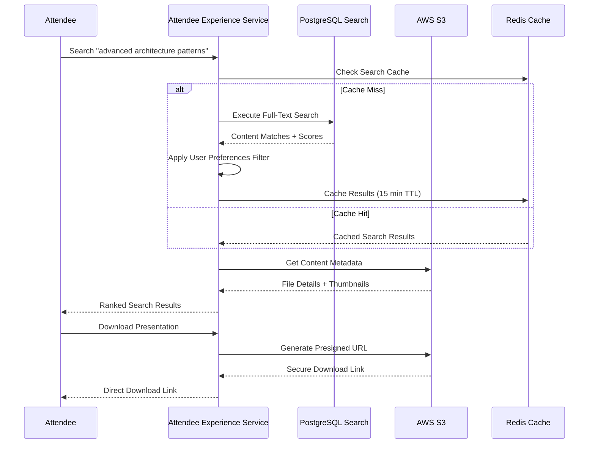

# Attendee Experience API

This document outlines the Attendee Experience Domain API, which handles attendee registration, content discovery, and historical archive search across 20+ years of BATbern content.

## Overview

The Attendee Experience API provides endpoints for:
- Event registration management
- Full-text content discovery and search
- Personal attendee dashboard
- Access to historical event archives

## API Endpoints

### Content Discovery & Search

#### Search Historical Content

```yaml
GET /api/v1/content/search
tags: [Content]
summary: Search historical content
parameters:
  - name: query
    in: query
    required: true
    schema:
      type: string
    description: Search query for full-text content search
  - name: contentType
    in: query
    schema:
      type: string
      enum: [presentation, handout, video, document]
    description: Filter by content type
  - name: eventYear
    in: query
    schema:
      type: integer
    description: Filter by event year
  - name: speakerId
    in: query
    schema:
      type: string
      format: uuid
    description: Filter by speaker
  - name: limit
    in: query
    schema:
      type: integer
      default: 20
      maximum: 100
  - name: offset
    in: query
    schema:
      type: integer
      default: 0
responses:
  '200':
    description: Search results
    content:
      application/json:
        schema:
          type: object
          properties:
            results:
              type: array
              items:
                $ref: '#/components/schemas/ContentSearchResult'
            facets:
              $ref: '#/components/schemas/SearchFacets'
            pagination:
              $ref: 'common#/components/schemas/Pagination'
```

## Core Workflows

### Content Discovery & Search



## Schemas

### Content Search Result

```yaml
ContentSearchResult:
  type: object
  properties:
    id:
      type: string
      format: uuid
    title:
      type: string
    description:
      type: string
    contentType:
      type: string
      enum: [presentation, handout, video, document]
    fileId:
      type: string
      format: uuid
    eventId:
      type: string
      format: uuid
    eventTitle:
      type: string
    eventDate:
      type: string
      format: date-time
    speakerId:
      type: string
      format: uuid
    speakerName:
      type: string
    companyName:
      type: string
    thumbnailUrl:
      type: string
      format: uri
    downloadUrl:
      type: string
      format: uri
      description: Presigned download URL
    relevanceScore:
      type: number
      format: double
      description: Search relevance score (0-1)
    tags:
      type: array
      items:
        type: string
    viewCount:
      type: integer
      description: Number of times content was viewed
    downloadCount:
      type: integer
      description: Number of times content was downloaded
    createdAt:
      type: string
      format: date-time
```

### Search Facets

```yaml
SearchFacets:
  type: object
  description: Aggregated facets for refining search results
  properties:
    contentTypes:
      type: array
      items:
        type: object
        properties:
          type:
            type: string
          count:
            type: integer
    years:
      type: array
      items:
        type: object
        properties:
          year:
            type: integer
          count:
            type: integer
    speakers:
      type: array
      items:
        type: object
        properties:
          speakerId:
            type: string
            format: uuid
          speakerName:
            type: string
          count:
            type: integer
    companies:
      type: array
      items:
        type: object
        properties:
          companyId:
            type: string
            format: uuid
          companyName:
            type: string
          count:
            type: integer
    tags:
      type: array
      items:
        type: object
        properties:
          tag:
            type: string
          count:
            type: integer
```

## Content Discovery Features

### Full-Text Search

The content search engine provides:
- **PostgreSQL Full-Text Search**: Leveraging PostgreSQL's built-in FTS capabilities
- **Relevance Ranking**: Results ranked by relevance score
- **Fuzzy Matching**: Handles typos and similar terms
- **Multi-field Search**: Searches across titles, descriptions, abstracts, and tags
- **Language Support**: English and German content indexing

### Search Faceting

Faceted search allows attendees to:
- **Filter by Content Type**: Presentations, handouts, videos, documents
- **Filter by Year**: Browse historical content by year
- **Filter by Speaker**: Find content from specific speakers
- **Filter by Company**: Discover content from partner companies
- **Filter by Tags**: Browse by topic tags and categories

### Historical Archive

20+ years of BATbern content accessible through:
- **Year Browser**: Browse events by year
- **Timeline View**: Chronological view of all events
- **Speaker Archive**: Complete history of speaker presentations
- **Topic Evolution**: Track how topics evolved over time
- **Legacy Format Support**: Access to older presentation formats

### Caching Strategy

Content search employs multi-level caching:
- **Search Results**: 15-minute Redis cache for query results
- **Content Metadata**: 1-hour cache for file metadata
- **CDN Caching**: CloudFront edge caching for static content
- **Browser Caching**: Client-side caching with ETags

### Performance Optimization

Search performance optimized through:
- **Database Indexing**: GIN indexes on full-text search columns
- **Materialized Views**: Pre-aggregated facet counts
- **Query Optimization**: Prepared statements and connection pooling
- **Pagination**: Cursor-based pagination for large result sets
- **Asynchronous Loading**: Lazy loading of thumbnails and metadata
