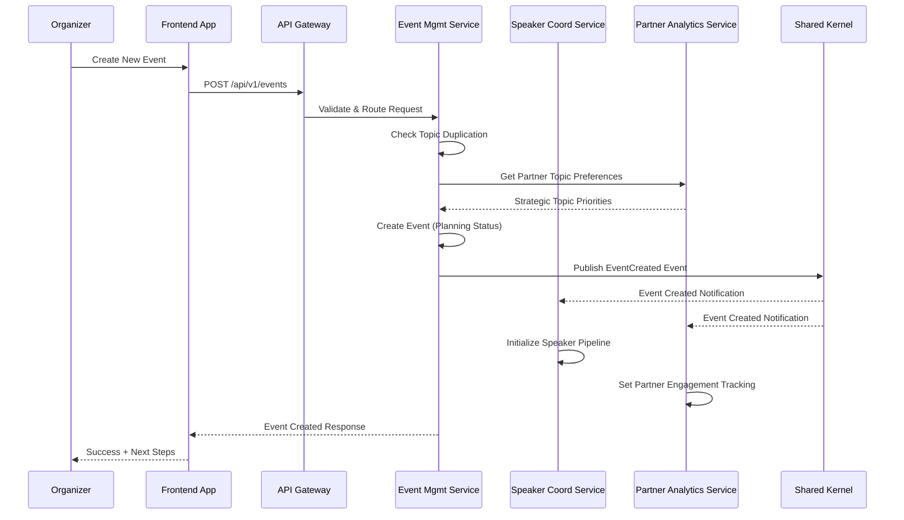
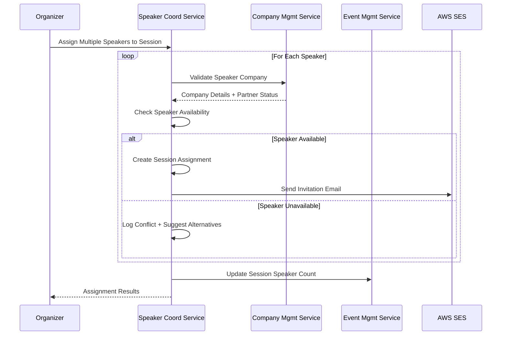
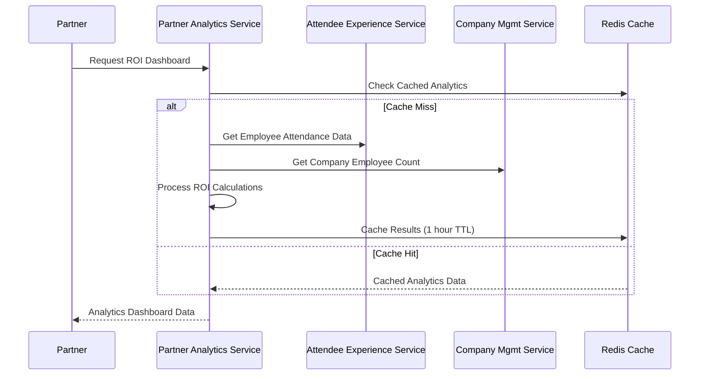
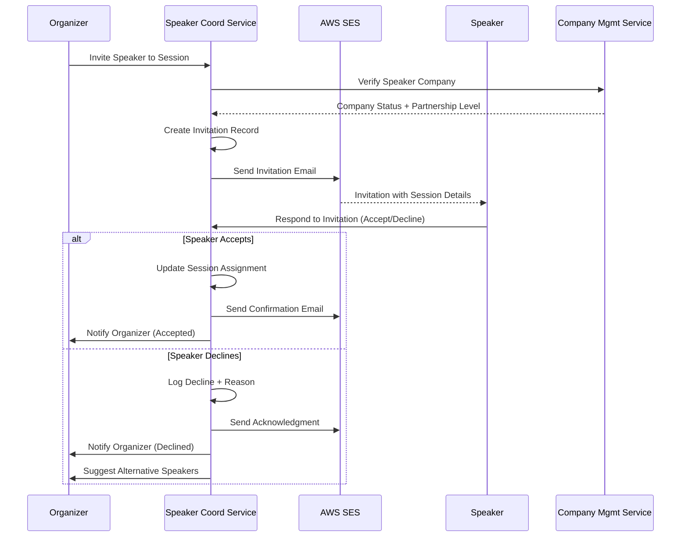
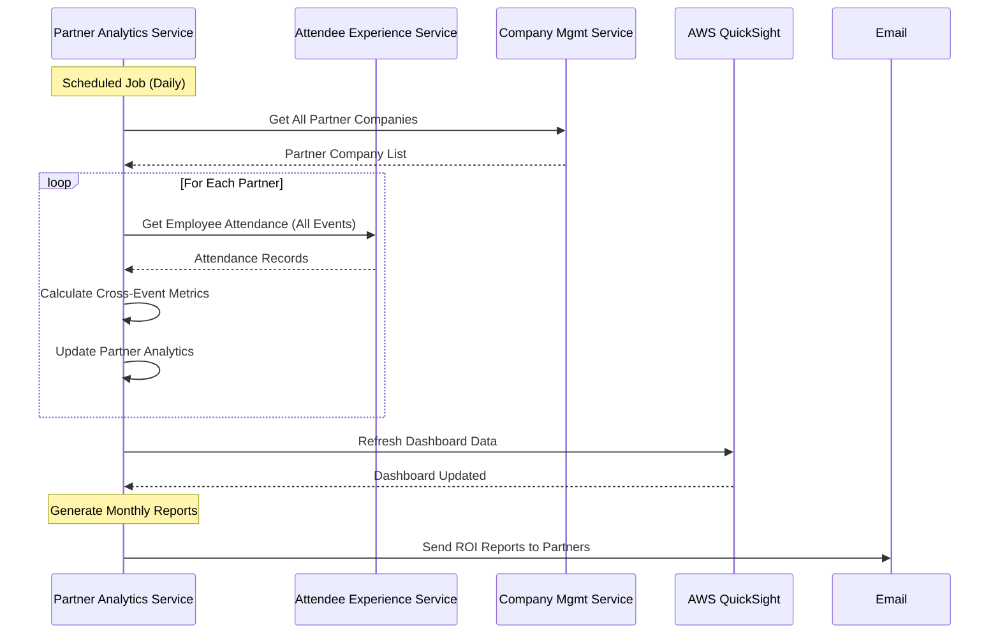

# API Design

This document outlines the comprehensive API design for the BATbern Event Management Platform, including REST endpoints, external API integrations, and core workflow patterns.

## REST API Specification

```yaml
openapi: 3.0.0
info:
  title: BATbern Event Management Platform API
  version: 1.0.0
  description: Comprehensive API for the BATbern Event Management Platform supporting organizers, speakers, partners, and attendees
servers:
  - url: https://api.berner-architekten-treffen.ch
    description: Production API
  - url: https://api-staging.berner-architekten-treffen.ch
    description: Staging API
  - url: https://api-dev.berner-architekten-treffen.ch
    description: Development API

security:
  - BearerAuth: []

paths:
  # Event Management Domain
  /api/v1/events:
    get:
      tags: [Events]
      summary: List all events
      parameters:
        - name: status
          in: query
          schema:
            $ref: '#/components/schemas/EventStatus'
        - name: year
          in: query
          schema:
            type: integer
        - name: limit
          in: query
          schema:
            type: integer
            default: 20
        - name: offset
          in: query
          schema:
            type: integer
            default: 0
      responses:
        '200':
          description: List of events
          content:
            application/json:
              schema:
                type: object
                properties:
                  events:
                    type: array
                    items:
                      $ref: '#/components/schemas/Event'
                  pagination:
                    $ref: '#/components/schemas/Pagination'
    post:
      tags: [Events]
      summary: Create new event
      security:
        - BearerAuth: [organizer]
      requestBody:
        required: true
        content:
          application/json:
            schema:
              $ref: '#/components/schemas/CreateEventRequest'
      responses:
        '201':
          description: Event created
          content:
            application/json:
              schema:
                $ref: '#/components/schemas/Event'

  # Speaker Domain
  /api/v1/speakers:
    get:
      tags: [Speakers]
      summary: List speakers
      parameters:
        - name: companyId
          in: query
          schema:
            type: string
            format: uuid
        - name: expertiseArea
          in: query
          schema:
            type: string
        - name: availability
          in: query
          schema:
            $ref: '#/components/schemas/SpeakerAvailability'
      responses:
        '200':
          description: List of speakers
          content:
            application/json:
              schema:
                type: array
                items:
                  $ref: '#/components/schemas/Speaker'

  # Company Management
  /api/v1/companies:
    get:
      tags: [Companies]
      summary: Search companies
      parameters:
        - name: query
          in: query
          schema:
            type: string
        - name: isPartner
          in: query
          schema:
            type: boolean
      responses:
        '200':
          description: List of companies
          content:
            application/json:
              schema:
                type: array
                items:
                  $ref: '#/components/schemas/Company'
    post:
      tags: [Companies]
      summary: Create new company
      security:
        - BearerAuth: [organizer, speaker]
      requestBody:
        required: true
        content:
          multipart/form-data:
            schema:
              type: object
              properties:
                name:
                  type: string
                website:
                  type: string
                industry:
                  type: string
                logo:
                  type: string
                  format: binary
              required:
                - name
                - industry
      responses:
        '201':
          description: Company created
          content:
            application/json:
              schema:
                $ref: '#/components/schemas/Company'

  # Partner Analytics Domain
  /api/v1/partners/{partnerId}/analytics:
    get:
      tags: [Partners]
      summary: Get partner analytics
      security:
        - BearerAuth: [organizer, partner]
      parameters:
        - name: partnerId
          in: path
          required: true
          schema:
            type: string
            format: uuid
        - name: timeRange
          in: query
          schema:
            type: string
            enum: [last_quarter, last_year, all_time]
            default: last_year
      responses:
        '200':
          description: Partner analytics data
          content:
            application/json:
              schema:
                $ref: '#/components/schemas/PartnerAnalytics'

  # Content Search
  /api/v1/content/search:
    get:
      tags: [Content]
      summary: Search historical content
      parameters:
        - name: query
          in: query
          required: true
          schema:
            type: string
        - name: contentType
          in: query
          schema:
            type: string
            enum: [presentation, handout, video, document]
        - name: eventYear
          in: query
          schema:
            type: integer
        - name: speakerId
          in: query
          schema:
            type: string
            format: uuid
      responses:
        '200':
          description: Search results
          content:
            application/json:
              schema:
                type: object
                properties:
                  results:
                    type: array
                    items:
                      $ref: '#/components/schemas/ContentSearchResult'
                  facets:
                    $ref: '#/components/schemas/SearchFacets'

components:
  securitySchemes:
    BearerAuth:
      type: http
      scheme: bearer
      bearerFormat: JWT

  schemas:
    Event:
      type: object
      properties:
        id:
          type: string
          format: uuid
        eventNumber:
          type: integer
        title:
          type: string
        description:
          type: string
        eventDate:
          type: string
          format: date-time
        status:
          $ref: '#/components/schemas/EventStatus'
        venue:
          $ref: '#/components/schemas/Venue'
        sessions:
          type: array
          items:
            $ref: '#/components/schemas/Session'

    EventStatus:
      type: string
      enum:
        - planning
        - topic_defined
        - speakers_invited
        - agenda_draft
        - published
        - registration_open
        - registration_closed
        - in_progress
        - completed
        - archived

    Speaker:
      type: object
      properties:
        id:
          type: string
          format: uuid
        email:
          type: string
          format: email
        firstName:
          type: string
        lastName:
          type: string
        companyId:
          type: string
          format: uuid
        position:
          type: string
        profile:
          $ref: '#/components/schemas/SpeakerProfile'
        availability:
          $ref: '#/components/schemas/SpeakerAvailability'

    SpeakerAvailability:
      type: string
      enum:
        - available
        - busy
        - unavailable
        - invited
        - confirmed
        - declined

    Company:
      type: object
      properties:
        id:
          type: string
          format: uuid
        name:
          type: string
        displayName:
          type: string
        isPartner:
          type: boolean
        website:
          type: string
          format: uri
        industry:
          type: string
        logo:
          $ref: '#/components/schemas/CompanyLogo'

    PartnerAnalytics:
      type: object
      properties:
        totalEmployeeAttendance:
          type: integer
        averageAttendancePerEvent:
          type: number
        contentEngagementScore:
          type: number
        brandExposureMetrics:
          type: object
        roiCalculations:
          type: object
```

## External APIs

### AWS Cognito API

- **Purpose:** Multi-role user authentication and authorization management
- **Documentation:** https://docs.aws.amazon.com/cognito/latest/developerguide/
- **Base URL(s):** https://cognito-idp.eu-central-1.amazonaws.com/
- **Authentication:** AWS IAM roles and policies
- **Rate Limits:** 10,000 requests per second per user pool

**Key Endpoints Used:**
- `POST /oauth2/token` - JWT token generation and refresh
- `POST /admin/createUser` - Programmatic user creation for organizers
- `GET /oauth2/userInfo` - User profile and role information

**Integration Notes:** Custom attributes store BATbern-specific roles (organizer, speaker, partner, attendee). Lambda triggers handle user registration workflows and role assignment validation.

### AWS SES API

- **Purpose:** Transactional email delivery for notifications, invitations, and newsletter distribution
- **Documentation:** https://docs.aws.amazon.com/ses/latest/dg/
- **Base URL(s):** https://email.eu-central-1.amazonaws.com/
- **Authentication:** AWS IAM service roles
- **Rate Limits:** 14 emails per second (adjustable based on reputation)

**Key Endpoints Used:**
- `POST /v2/email/outbound-emails` - Send transactional emails
- `POST /v2/email/bulk-emails` - Newsletter distribution
- `POST /v2/email/templates` - Email template management

**Integration Notes:** Templates stored for speaker invitations, event notifications, and partner reports. Bounce and complaint handling integrated with user management.

### AWS S3 API

- **Purpose:** File storage for logos, presentations, handouts, and historical content
- **Documentation:** https://docs.aws.amazon.com/s3/latest/API/
- **Base URL(s):** https://s3.eu-central-1.amazonaws.com/
- **Authentication:** AWS IAM service roles with bucket policies
- **Rate Limits:** 3,500 PUT/POST requests per second per prefix

**Key Endpoints Used:**
- `PUT /bucket/{key}` - File upload with metadata
- `GET /bucket/{key}` - File retrieval with access control
- `POST /bucket?delete` - Batch file deletion for content management

**Integration Notes:** Presigned URLs for direct browser uploads. Lifecycle policies for archival content. CloudFront integration for global CDN distribution.

## Core Workflows

### Event Creation with Intelligent Automation



### Multi-Speaker Session Assignment



### Partner ROI Analytics Generation



### Content Discovery & Search


### Speaker Invitation & Confirmation Workflow



### Cross-Event Partner Participation Tracking



## API Design Principles

### Authentication & Authorization
- **JWT Bearer Tokens:** AWS Cognito-issued tokens with custom claims
- **Role-Based Access Control:** Fine-grained permissions per user type
- **Rate Limiting:** Per-user and per-endpoint rate limits
- **API Key Management:** Service-to-service authentication

### Data Consistency
- **Eventual Consistency:** Cross-service data synchronization via events
- **Optimistic Locking:** Concurrent update conflict resolution
- **Idempotency:** Safe retry mechanisms for critical operations
- **Data Validation:** Schema validation at API gateway level

### Performance Optimization
- **Response Caching:** Redis caching for frequently accessed data
- **Pagination:** Consistent pagination patterns across all list endpoints
- **Field Selection:** GraphQL-style field selection for large objects
- **Bulk Operations:** Batch endpoints for high-volume operations

### Error Handling
- **Standard HTTP Status Codes:** Consistent error response patterns
- **Detailed Error Messages:** Structured error objects with context
- **Correlation IDs:** Request tracing across service boundaries
- **Circuit Breakers:** Fault tolerance for external service calls