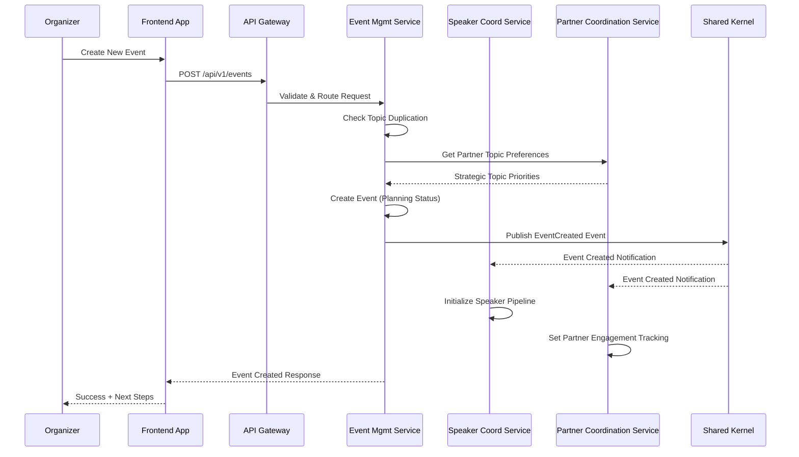
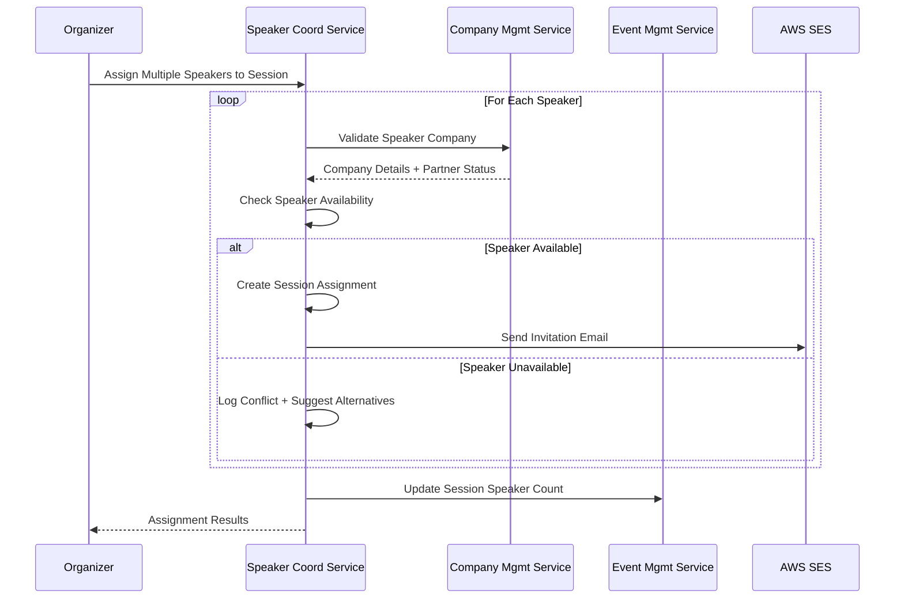
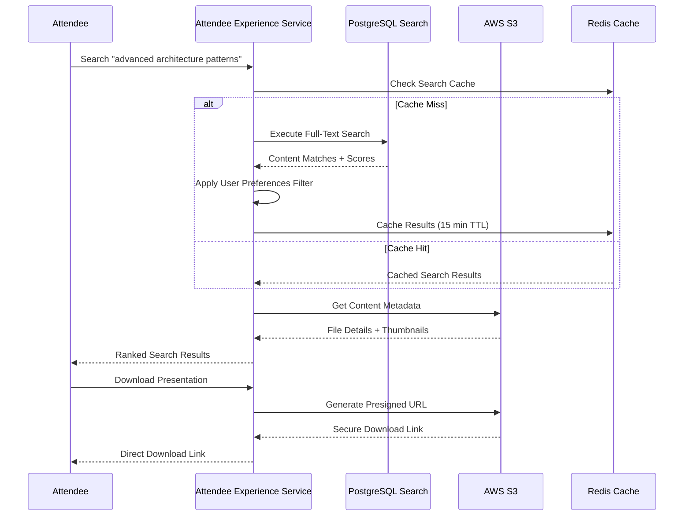
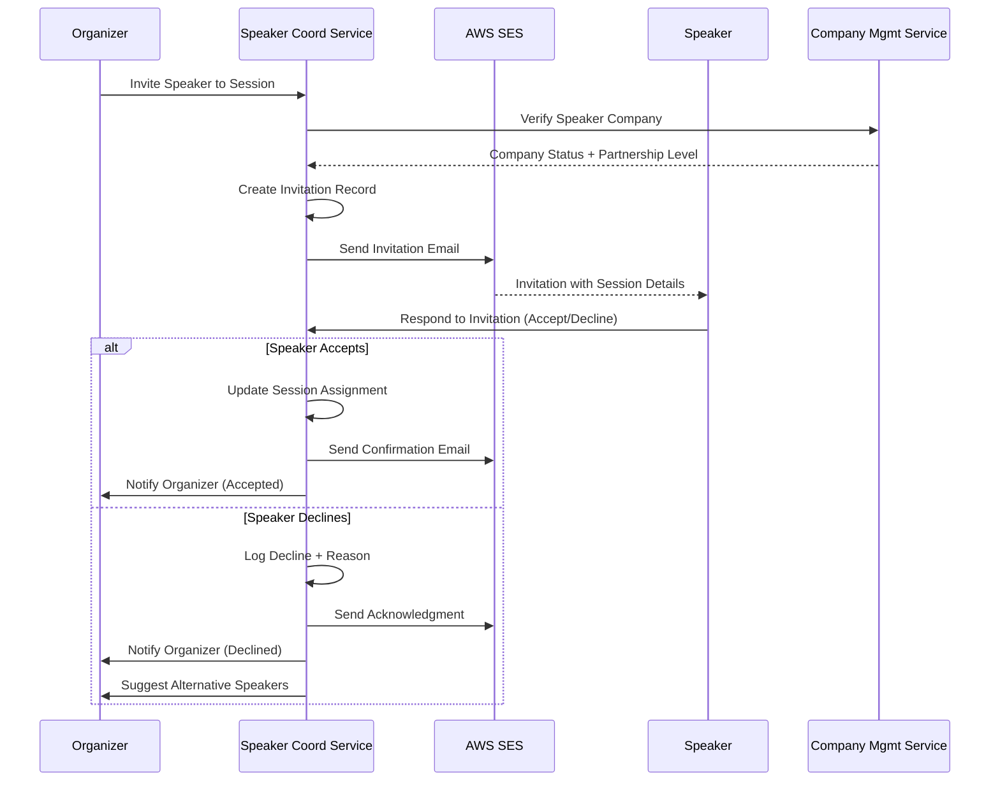

# API Design

This document outlines the comprehensive API design for the BATbern Event Management Platform, including REST endpoints, external API integrations, and core workflow patterns.

## REST API Specification

```yaml
openapi: 3.0.0
info:
  title: BATbern Event Management Platform API
  version: 1.0.0
  description: Comprehensive API for the BATbern Event Management Platform supporting organizers, speakers, partners, and attendees
servers:
  - url: https://api.batbern.ch
    description: Production API
  - url: https://api-staging.batbern.ch
    description: Staging API
  - url: https://api-dev.batbern.ch
    description: Development API

security:
  - BearerAuth: []

paths:
  # Event Management Domain
  /api/v1/events:
    get:
      tags: [Events]
      summary: List all events
      parameters:
        - name: status
          in: query
          schema:
            $ref: '#/components/schemas/EventStatus'
        - name: year
          in: query
          schema:
            type: integer
        - name: limit
          in: query
          schema:
            type: integer
            default: 20
        - name: offset
          in: query
          schema:
            type: integer
            default: 0
      responses:
        '200':
          description: List of events
          content:
            application/json:
              schema:
                type: object
                properties:
                  events:
                    type: array
                    items:
                      $ref: '#/components/schemas/Event'
                  pagination:
                    $ref: '#/components/schemas/Pagination'
    post:
      tags: [Events]
      summary: Create new event
      security:
        - BearerAuth: [organizer]
      requestBody:
        required: true
        content:
          application/json:
            schema:
              $ref: '#/components/schemas/CreateEventRequest'
      responses:
        '201':
          description: Event created
          content:
            application/json:
              schema:
                $ref: '#/components/schemas/Event'

  # Speaker Domain
  /api/v1/speakers:
    get:
      tags: [Speakers]
      summary: List speakers
      parameters:
        - name: companyId
          in: query
          schema:
            type: string
            format: uuid
        - name: expertiseArea
          in: query
          schema:
            type: string
        - name: availability
          in: query
          schema:
            $ref: '#/components/schemas/SpeakerAvailability'
      responses:
        '200':
          description: List of speakers
          content:
            application/json:
              schema:
                type: array
                items:
                  $ref: '#/components/schemas/Speaker'

  # Enhanced Event Workflow Management
  /api/v1/events/{eventId}/workflow:
    get:
      tags: [Event Workflow]
      summary: Get event workflow state
      parameters:
        - name: eventId
          in: path
          required: true
          schema:
            type: string
            format: uuid
      responses:
        '200':
          description: Event workflow state
          content:
            application/json:
              schema:
                $ref: '#/components/schemas/EventWorkflow'
    put:
      tags: [Event Workflow]
      summary: Update event workflow state
      security:
        - BearerAuth: [organizer]
      parameters:
        - name: eventId
          in: path
          required: true
          schema:
            type: string
            format: uuid
      requestBody:
        required: true
        content:
          application/json:
            schema:
              $ref: '#/components/schemas/UpdateWorkflowRequest'
      responses:
        '200':
          description: Workflow updated
          content:
            application/json:
              schema:
                $ref: '#/components/schemas/EventWorkflow'

  # Slot Management
  /api/v1/events/{eventId}/slots:
    get:
      tags: [Slot Management]
      summary: List event slots
      parameters:
        - name: eventId
          in: path
          required: true
          schema:
            type: string
            format: uuid
        - name: slotType
          in: query
          schema:
            $ref: '#/components/schemas/SlotType'
        - name: assigned
          in: query
          schema:
            type: boolean
      responses:
        '200':
          description: List of event slots
          content:
            application/json:
              schema:
                type: array
                items:
                  $ref: '#/components/schemas/EventSlot'
    post:
      tags: [Slot Management]
      summary: Create slot configuration
      security:
        - BearerAuth: [organizer]
      parameters:
        - name: eventId
          in: path
          required: true
          schema:
            type: string
            format: uuid
      requestBody:
        required: true
        content:
          application/json:
            schema:
              $ref: '#/components/schemas/CreateSlotConfigRequest'
      responses:
        '201':
          description: Slots created
          content:
            application/json:
              schema:
                type: array
                items:
                  $ref: '#/components/schemas/EventSlot'

  /api/v1/events/{eventId}/slots/{slotId}/assign:
    post:
      tags: [Slot Management]
      summary: Assign speaker to slot
      security:
        - BearerAuth: [organizer]
      parameters:
        - name: eventId
          in: path
          required: true
          schema:
            type: string
            format: uuid
        - name: slotId
          in: path
          required: true
          schema:
            type: string
            format: uuid
      requestBody:
        required: true
        content:
          application/json:
            schema:
              $ref: '#/components/schemas/AssignSlotRequest'
      responses:
        '200':
          description: Speaker assigned to slot
          content:
            application/json:
              schema:
                $ref: '#/components/schemas/SlotAssignment'
    delete:
      tags: [Slot Management]
      summary: Unassign speaker from slot
      security:
        - BearerAuth: [organizer]
      parameters:
        - name: eventId
          in: path
          required: true
          schema:
            type: string
            format: uuid
        - name: slotId
          in: path
          required: true
          schema:
            type: string
            format: uuid
      responses:
        '204':
          description: Speaker unassigned from slot

  # Notification Management
  /api/v1/notifications/templates:
    get:
      tags: [Notifications]
      summary: List email templates
      security:
        - BearerAuth: [organizer]
      parameters:
        - name: templateType
          in: query
          schema:
            $ref: '#/components/schemas/TemplateType'
        - name: language
          in: query
          schema:
            type: string
            enum: [en, de]
      responses:
        '200':
          description: List of email templates
          content:
            application/json:
              schema:
                type: array
                items:
                  $ref: '#/components/schemas/EmailTemplate'
    post:
      tags: [Notifications]
      summary: Create new email template
      security:
        - BearerAuth: [organizer]
      requestBody:
        required: true
        content:
          application/json:
            schema:
              $ref: '#/components/schemas/CreateTemplateRequest'
      responses:
        '201':
          description: Template created
          content:
            application/json:
              schema:
                $ref: '#/components/schemas/EmailTemplate'

  /api/v1/notifications/preferences:
    get:
      tags: [Notifications]
      summary: Get user notification preferences
      responses:
        '200':
          description: User preferences
          content:
            application/json:
              schema:
                $ref: '#/components/schemas/NotificationPreferences'
    put:
      tags: [Notifications]
      summary: Update notification preferences
      requestBody:
        required: true
        content:
          application/json:
            schema:
              $ref: '#/components/schemas/UpdatePreferencesRequest'
      responses:
        '200':
          description: Preferences updated

  /api/v1/notifications/escalation-rules:
    get:
      tags: [Notifications]
      summary: List escalation rules
      security:
        - BearerAuth: [organizer]
      responses:
        '200':
          description: List of escalation rules
          content:
            application/json:
              schema:
                type: array
                items:
                  $ref: '#/components/schemas/EscalationRule'
    post:
      tags: [Notifications]
      summary: Create escalation rule
      security:
        - BearerAuth: [organizer]
      requestBody:
        required: true
        content:
          application/json:
            schema:
              $ref: '#/components/schemas/CreateEscalationRuleRequest'
      responses:
        '201':
          description: Escalation rule created

  # Speaker Preferences & Requirements
  /api/v1/speakers/{speakerId}/preferences:
    get:
      tags: [Speaker Preferences]
      summary: Get speaker slot preferences
      parameters:
        - name: speakerId
          in: path
          required: true
          schema:
            type: string
            format: uuid
        - name: eventId
          in: query
          schema:
            type: string
            format: uuid
      responses:
        '200':
          description: Speaker preferences
          content:
            application/json:
              schema:
                $ref: '#/components/schemas/SpeakerSlotPreferences'
    post:
      tags: [Speaker Preferences]
      summary: Submit speaker preferences
      security:
        - BearerAuth: [speaker]
      parameters:
        - name: speakerId
          in: path
          required: true
          schema:
            type: string
            format: uuid
      requestBody:
        required: true
        content:
          application/json:
            schema:
              $ref: '#/components/schemas/SubmitPreferencesRequest'
      responses:
        '201':
          description: Preferences submitted
          content:
            application/json:
              schema:
                $ref: '#/components/schemas/SpeakerSlotPreferences'
    put:
      tags: [Speaker Preferences]
      summary: Update speaker preferences
      security:
        - BearerAuth: [speaker]
      parameters:
        - name: speakerId
          in: path
          required: true
          schema:
            type: string
            format: uuid
      requestBody:
        required: true
        content:
          application/json:
            schema:
              $ref: '#/components/schemas/UpdatePreferencesRequest'
      responses:
        '200':
          description: Preferences updated
          content:
            application/json:
              schema:
                $ref: '#/components/schemas/SpeakerSlotPreferences'

  # Quality Review Workflow
  /api/v1/sessions/{sessionId}/quality-review:
    get:
      tags: [Quality Review]
      summary: Get content quality review status
      parameters:
        - name: sessionId
          in: path
          required: true
          schema:
            type: string
            format: uuid
      responses:
        '200':
          description: Quality review status
          content:
            application/json:
              schema:
                $ref: '#/components/schemas/ContentQualityReview'
    post:
      tags: [Quality Review]
      summary: Submit content for review
      security:
        - BearerAuth: [speaker]
      parameters:
        - name: sessionId
          in: path
          required: true
          schema:
            type: string
            format: uuid
      requestBody:
        required: true
        content:
          application/json:
            schema:
              $ref: '#/components/schemas/SubmitContentRequest'
      responses:
        '201':
          description: Content submitted for review
          content:
            application/json:
              schema:
                $ref: '#/components/schemas/ContentQualityReview'
    put:
      tags: [Quality Review]
      summary: Update review status (moderator)
      security:
        - BearerAuth: [moderator]
      parameters:
        - name: sessionId
          in: path
          required: true
          schema:
            type: string
            format: uuid
      requestBody:
        required: true
        content:
          application/json:
            schema:
              $ref: '#/components/schemas/UpdateReviewRequest'
      responses:
        '200':
          description: Review updated
          content:
            application/json:
              schema:
                $ref: '#/components/schemas/ContentQualityReview'

  /api/v1/moderators/{moderatorId}/reviews:
    get:
      tags: [Quality Review]
      summary: List pending reviews for moderator
      security:
        - BearerAuth: [moderator]
      parameters:
        - name: moderatorId
          in: path
          required: true
          schema:
            type: string
            format: uuid
        - name: status
          in: query
          schema:
            $ref: '#/components/schemas/QualityReviewStatus'
        - name: eventId
          in: query
          schema:
            type: string
            format: uuid
      responses:
        '200':
          description: List of reviews
          content:
            application/json:
              schema:
                type: array
                items:
                  $ref: '#/components/schemas/ContentQualityReview'

  # Overflow Management & Waitlist
  /api/v1/events/{eventId}/overflow:
    get:
      tags: [Overflow Management]
      summary: List overflow speakers
      security:
        - BearerAuth: [organizer]
      parameters:
        - name: eventId
          in: path
          required: true
          schema:
            type: string
            format: uuid
      responses:
        '200':
          description: Overflow speakers
          content:
            application/json:
              schema:
                $ref: '#/components/schemas/OverflowManagement'
    post:
      tags: [Overflow Management]
      summary: Vote on speaker selection
      security:
        - BearerAuth: [organizer]
      parameters:
        - name: eventId
          in: path
          required: true
          schema:
            type: string
            format: uuid
      requestBody:
        required: true
        content:
          application/json:
            schema:
              $ref: '#/components/schemas/SpeakerVoteRequest'
      responses:
        '201':
          description: Vote recorded
          content:
            application/json:
              schema:
                $ref: '#/components/schemas/SpeakerSelectionVote'

  /api/v1/events/{eventId}/overflow/{speakerId}/promote:
    post:
      tags: [Overflow Management]
      summary: Promote overflow speaker to active (on dropout)
      security:
        - BearerAuth: [organizer]
      parameters:
        - name: eventId
          in: path
          required: true
          schema:
            type: string
            format: uuid
        - name: speakerId
          in: path
          required: true
          schema:
            type: string
            format: uuid
      requestBody:
        required: true
        content:
          application/json:
            schema:
              type: object
              properties:
                slotId:
                  type: string
                  format: uuid
                  description: Slot to assign the promoted speaker
                reason:
                  type: string
                  description: Reason for promotion (e.g., "Speaker dropout")
              required:
                - slotId
      responses:
        '200':
          description: Overflow speaker promoted successfully
          content:
            application/json:
              schema:
                $ref: '#/components/schemas/OverflowSpeaker'

  # Company Management
  /api/v1/companies:
    get:
      tags: [Companies]
      summary: Search companies
      parameters:
        - name: query
          in: query
          schema:
            type: string
        - name: isPartner
          in: query
          schema:
            type: boolean
      responses:
        '200':
          description: List of companies
          content:
            application/json:
              schema:
                type: array
                items:
                  $ref: '#/components/schemas/Company'
    post:
      tags: [Companies]
      summary: Create new company
      security:
        - BearerAuth: [organizer, speaker]
      requestBody:
        required: true
        content:
          multipart/form-data:
            schema:
              type: object
              properties:
                name:
                  type: string
                website:
                  type: string
                industry:
                  type: string
                logo:
                  type: string
                  format: binary
              required:
                - name
                - industry
      responses:
        '201':
          description: Company created
          content:
            application/json:
              schema:
                $ref: '#/components/schemas/Company'

  # User Role Management
  /api/v1/users/{userId}/roles:
    get:
      tags: [Role Management]
      summary: Get user role history
      security:
        - BearerAuth: [organizer]
      parameters:
        - name: userId
          in: path
          required: true
          schema:
            type: string
            format: uuid
      responses:
        '200':
          description: User role history
          content:
            application/json:
              schema:
                type: object
                properties:
                  userId:
                    type: string
                    format: uuid
                  currentRoles:
                    type: array
                    items:
                      $ref: '#/components/schemas/UserRole'
                  roleHistory:
                    type: array
                    items:
                      $ref: '#/components/schemas/RoleChange'

    post:
      tags: [Role Management]
      summary: Promote user to role
      security:
        - BearerAuth: [organizer]
      parameters:
        - name: userId
          in: path
          required: true
          schema:
            type: string
            format: uuid
      requestBody:
        required: true
        content:
          application/json:
            schema:
              type: object
              properties:
                role:
                  $ref: '#/components/schemas/UserRole'
                reason:
                  type: string
                  maxLength: 500
              required:
                - role
      responses:
        '201':
          description: Role promoted successfully
          content:
            application/json:
              schema:
                $ref: '#/components/schemas/RoleChange'
        '400':
          description: Invalid role or user ineligible
        '403':
          description: Insufficient permissions

  /api/v1/users/{userId}/roles/{role}:
    delete:
      tags: [Role Management]
      summary: Demote user from role
      security:
        - BearerAuth: [organizer]
      parameters:
        - name: userId
          in: path
          required: true
          schema:
            type: string
            format: uuid
        - name: role
          in: path
          required: true
          schema:
            $ref: '#/components/schemas/UserRole'
      requestBody:
        required: true
        content:
          application/json:
            schema:
              type: object
              properties:
                reason:
                  type: string
                  maxLength: 500
              required:
                - reason
      responses:
        '200':
          description: Role demoted (immediate for Speaker)
          content:
            application/json:
              schema:
                $ref: '#/components/schemas/RoleChange'
        '202':
          description: Demotion request created (requires approval for Organizer)
          content:
            application/json:
              schema:
                $ref: '#/components/schemas/RoleChangeRequest'
        '400':
          description: Cannot demote (minimum organizer rule violation)
        '403':
          description: Insufficient permissions

  /api/v1/users/{userId}/role-changes/{changeId}/approve:
    post:
      tags: [Role Management]
      summary: Approve organizer demotion request
      security:
        - BearerAuth: [organizer]
      parameters:
        - name: userId
          in: path
          required: true
          schema:
            type: string
            format: uuid
        - name: changeId
          in: path
          required: true
          schema:
            type: string
            format: uuid
      requestBody:
        required: true
        content:
          application/json:
            schema:
              type: object
              properties:
                approved:
                  type: boolean
                comments:
                  type: string
                  maxLength: 1000
              required:
                - approved
      responses:
        '200':
          description: Approval processed
          content:
            application/json:
              schema:
                $ref: '#/components/schemas/RoleChange'
        '403':
          description: Not authorized to approve this request
        '404':
          description: Role change request not found

  # Content Search
  /api/v1/content/search:
    get:
      tags: [Content]
      summary: Search historical content
      parameters:
        - name: query
          in: query
          required: true
          schema:
            type: string
        - name: contentType
          in: query
          schema:
            type: string
            enum: [presentation, handout, video, document]
        - name: eventYear
          in: query
          schema:
            type: integer
        - name: speakerId
          in: query
          schema:
            type: string
            format: uuid
      responses:
        '200':
          description: Search results
          content:
            application/json:
              schema:
                type: object
                properties:
                  results:
                    type: array
                    items:
                      $ref: '#/components/schemas/ContentSearchResult'
                  facets:
                    $ref: '#/components/schemas/SearchFacets'

  # File Storage & Content Management
  /api/v1/files/presigned-upload-url:
    post:
      tags: [Files]
      summary: Generate presigned URL for file upload
      description: Generate a time-limited presigned URL for direct browser-to-S3 upload
      security:
        - BearerAuth: []
      requestBody:
        required: true
        content:
          application/json:
            schema:
              type: object
              required:
                - filename
                - contentType
                - fileSizeBytes
                - mimeType
              properties:
                filename:
                  type: string
                  example: "presentation.pdf"
                  maxLength: 255
                contentType:
                  type: string
                  enum: [presentation, logo, speaker_photo, speaker_cv, event_photo, archive_material]
                  example: "presentation"
                fileSizeBytes:
                  type: integer
                  format: int64
                  minimum: 1
                  maximum: 104857600  # 100 MB
                  example: 15728640
                mimeType:
                  type: string
                  example: "application/pdf"
      responses:
        '200':
          description: Presigned upload URL generated successfully
          content:
            application/json:
              schema:
                type: object
                properties:
                  uploadUrl:
                    type: string
                    format: uri
                    description: Presigned S3 upload URL (valid for 15 minutes)
                    example: "https://batbern-prod-presentations.s3.eu-central-1.amazonaws.com/..."
                  fileId:
                    type: string
                    format: uuid
                    description: Unique file identifier for tracking
                    example: "f47ac10b-58cc-4372-a567-0e02b2c3d479"
                  expiresIn:
                    type: integer
                    description: URL expiration time in seconds
                    example: 900
                  requiredHeaders:
                    type: object
                    additionalProperties:
                      type: string
                    description: HTTP headers required for upload
                    example:
                      Content-Type: "application/pdf"
        '400':
          description: Invalid request (file too large, invalid content type, etc.)
          content:
            application/json:
              schema:
                $ref: '#/components/schemas/ErrorResponse'
        '403':
          description: Storage quota exceeded
          content:
            application/json:
              schema:
                $ref: '#/components/schemas/ErrorResponse'
        '401':
          description: Unauthorized

  /api/v1/files/{fileId}/confirm:
    post:
      tags: [Files]
      summary: Confirm file upload completion
      description: Verify upload success and activate file in system
      security:
        - BearerAuth: []
      parameters:
        - name: fileId
          in: path
          required: true
          schema:
            type: string
            format: uuid
      requestBody:
        required: true
        content:
          application/json:
            schema:
              type: object
              required:
                - checksum
              properties:
                checksum:
                  type: string
                  description: SHA-256 checksum or S3 ETag for verification
                  example: "5d41402abc4b2a76b9719d911017c592"
      responses:
        '200':
          description: Upload confirmed successfully
          content:
            application/json:
              schema:
                type: object
                properties:
                  fileId:
                    type: string
                    format: uuid
                    example: "f47ac10b-58cc-4372-a567-0e02b2c3d479"
                  status:
                    type: string
                    enum: [completed]
                    example: "completed"
                  cdnUrl:
                    type: string
                    format: uri
                    description: CloudFront CDN URL for file access
                    example: "https://cdn.batbern.ch/presentations/2024/evt-123/presentation-a7b3.pdf"
                  fileSizeBytes:
                    type: integer
                    format: int64
                    example: 15728640
                  uploadedAt:
                    type: string
                    format: date-time
                    example: "2024-03-15T10:30:00Z"
        '400':
          description: Checksum mismatch or invalid file ID
          content:
            application/json:
              schema:
                $ref: '#/components/schemas/ErrorResponse'
        '404':
          description: File not found
          content:
            application/json:
              schema:
                $ref: '#/components/schemas/ErrorResponse'
        '401':
          description: Unauthorized

  /api/v1/files/{fileId}/download-url:
    get:
      tags: [Files]
      summary: Generate presigned download URL
      description: Generate time-limited presigned URL for secure file download
      security:
        - BearerAuth: []
      parameters:
        - name: fileId
          in: path
          required: true
          schema:
            type: string
            format: uuid
      responses:
        '200':
          description: Download URL generated successfully
          content:
            application/json:
              schema:
                type: object
                properties:
                  downloadUrl:
                    type: string
                    format: uri
                    description: Presigned download URL (valid for 15 minutes)
                    example: "https://batbern-prod-presentations.s3.amazonaws.com/..."
                  filename:
                    type: string
                    description: Original filename
                    example: "presentation.pdf"
                  fileSizeBytes:
                    type: integer
                    format: int64
                    example: 15728640
                  mimeType:
                    type: string
                    example: "application/pdf"
                  expiresIn:
                    type: integer
                    description: URL expiration time in seconds
                    example: 900
        '404':
          description: File not found or not yet completed
          content:
            application/json:
              schema:
                $ref: '#/components/schemas/ErrorResponse'
        '401':
          description: Unauthorized

  /api/v1/files/{fileId}:
    delete:
      tags: [Files]
      summary: Delete uploaded file
      description: Soft delete file and update storage quota
      security:
        - BearerAuth: []
      parameters:
        - name: fileId
          in: path
          required: true
          schema:
            type: string
            format: uuid
      responses:
        '204':
          description: File deleted successfully
        '403':
          description: Not authorized to delete this file
          content:
            application/json:
              schema:
                $ref: '#/components/schemas/ErrorResponse'
        '404':
          description: File not found
          content:
            application/json:
              schema:
                $ref: '#/components/schemas/ErrorResponse'
        '401':
          description: Unauthorized

  /api/v1/files/{fileId}/metadata:
    get:
      tags: [Files]
      summary: Get file metadata
      description: Retrieve file metadata including upload status and CDN URL
      security:
        - BearerAuth: []
      parameters:
        - name: fileId
          in: path
          required: true
          schema:
            type: string
            format: uuid
      responses:
        '200':
          description: File metadata retrieved successfully
          content:
            application/json:
              schema:
                $ref: '#/components/schemas/ContentMetadata'
        '404':
          description: File not found
          content:
            application/json:
              schema:
                $ref: '#/components/schemas/ErrorResponse'
        '401':
          description: Unauthorized

  /api/v1/users/{userId}/storage-quota:
    get:
      tags: [Files, Users]
      summary: Get storage quota information
      description: Retrieve current storage usage and quota limits for user
      security:
        - BearerAuth: []
      parameters:
        - name: userId
          in: path
          required: true
          schema:
            type: string
            format: uuid
      responses:
        '200':
          description: Storage quota information
          content:
            application/json:
              schema:
                type: object
                properties:
                  quotaLimitBytes:
                    type: integer
                    format: int64
                    description: Total quota limit (-1 for unlimited)
                    example: 209715200  # 200 MB
                  currentUsageBytes:
                    type: integer
                    format: int64
                    description: Current storage usage
                    example: 157286400  # 150 MB
                  fileCount:
                    type: integer
                    description: Number of files uploaded
                    example: 12
                  percentageUsed:
                    type: number
                    format: double
                    description: Percentage of quota used
                    example: 75.0
                  warningThresholdPercentage:
                    type: number
                    format: double
                    description: Warning threshold percentage
                    example: 80.0
                  availableBytes:
                    type: integer
                    format: int64
                    description: Available storage space
                    example: 52428800  # 50 MB
        '404':
          description: User not found
          content:
            application/json:
              schema:
                $ref: '#/components/schemas/ErrorResponse'
        '401':
          description: Unauthorized

  /api/v1/users/{userId}/files:
    get:
      tags: [Files, Users]
      summary: List user's uploaded files
      description: Retrieve paginated list of files uploaded by user
      security:
        - BearerAuth: []
      parameters:
        - name: userId
          in: path
          required: true
          schema:
            type: string
            format: uuid
        - name: contentType
          in: query
          schema:
            type: string
            enum: [presentation, logo, speaker_photo, speaker_cv, event_photo, archive_material]
        - name: status
          in: query
          schema:
            type: string
            enum: [pending, uploading, completed, failed, deleted]
        - name: limit
          in: query
          schema:
            type: integer
            default: 20
            maximum: 100
        - name: offset
          in: query
          schema:
            type: integer
            default: 0
      responses:
        '200':
          description: List of user's files
          content:
            application/json:
              schema:
                type: object
                properties:
                  files:
                    type: array
                    items:
                      $ref: '#/components/schemas/ContentMetadata'
                  pagination:
                    $ref: '#/components/schemas/Pagination'
                  totalSizeBytes:
                    type: integer
                    format: int64
                    description: Total size of all files
                    example: 157286400
        '401':
          description: Unauthorized

components:
  securitySchemes:
    BearerAuth:
      type: http
      scheme: bearer
      bearerFormat: JWT

  schemas:
    Event:
      type: object
      properties:
        id:
          type: string
          format: uuid
        eventNumber:
          type: integer
        title:
          type: string
        description:
          type: string
        eventDate:
          type: string
          format: date-time
        status:
          $ref: '#/components/schemas/EventStatus'
        venue:
          $ref: '#/components/schemas/Venue'
        sessions:
          type: array
          items:
            $ref: '#/components/schemas/Session'

    EventStatus:
      type: string
      enum:
        - planning
        - topic_defined
        - speakers_invited
        - agenda_draft
        - published
        - registration_open
        - registration_closed
        - in_progress
        - completed
        - archived

    Speaker:
      type: object
      properties:
        id:
          type: string
          format: uuid
        email:
          type: string
          format: email
        firstName:
          type: string
        lastName:
          type: string
        companyId:
          type: string
          format: uuid
        position:
          type: string
        profile:
          $ref: '#/components/schemas/SpeakerProfile'
        availability:
          $ref: '#/components/schemas/SpeakerAvailability'

    SpeakerAvailability:
      type: string
      enum:
        - available
        - busy
        - unavailable
        - invited
        - confirmed
        - declined

    Company:
      type: object
      properties:
        id:
          type: string
          format: uuid
        name:
          type: string
        displayName:
          type: string
        isPartner:
          type: boolean
        website:
          type: string
          format: uri
        industry:
          type: string
        logo:
          $ref: '#/components/schemas/CompanyLogo'

    PartnerAnalytics:
      type: object
      properties:
        totalEmployeeAttendance:
          type: integer
        averageAttendancePerEvent:
          type: number
        contentEngagementScore:
          type: number
        brandExposureMetrics:
          type: object
        roiCalculations:
          type: object
```

## External APIs

### AWS Cognito API

- **Purpose:** Multi-role user authentication and authorization management
- **Documentation:** https://docs.aws.amazon.com/cognito/latest/developerguide/
- **Base URL(s):** https://cognito-idp.eu-central-1.amazonaws.com/
- **Authentication:** AWS IAM roles and policies
- **Rate Limits:** 10,000 requests per second per user pool

**Key Endpoints Used:**
- `POST /oauth2/token` - JWT token generation and refresh
- `POST /admin/createUser` - Programmatic user creation for organizers
- `GET /oauth2/userInfo` - User profile and role information

**Integration Notes:** Custom attributes store BATbern-specific roles (organizer, speaker, partner, attendee). Lambda triggers handle user registration workflows and role assignment validation.

### AWS SES API

- **Purpose:** Transactional email delivery for notifications, invitations, and newsletter distribution
- **Documentation:** https://docs.aws.amazon.com/ses/latest/dg/
- **Base URL(s):** https://email.eu-central-1.amazonaws.com/
- **Authentication:** AWS IAM service roles
- **Rate Limits:** 14 emails per second (adjustable based on reputation)

**Key Endpoints Used:**
- `POST /v2/email/outbound-emails` - Send transactional emails
- `POST /v2/email/bulk-emails` - Newsletter distribution
- `POST /v2/email/templates` - Email template management

**Integration Notes:** Templates stored for speaker invitations, event notifications, and partner reports. Bounce and complaint handling integrated with user management.

### AWS S3 API

- **Purpose:** File storage for logos, presentations, handouts, and historical content
- **Documentation:** https://docs.aws.amazon.com/s3/latest/API/
- **Base URL(s):** https://s3.eu-central-1.amazonaws.com/
- **Authentication:** AWS IAM service roles with bucket policies
- **Rate Limits:** 3,500 PUT/POST requests per second per prefix

**Key Endpoints Used:**
- `PUT /bucket/{key}` - File upload with metadata
- `GET /bucket/{key}` - File retrieval with access control
- `POST /bucket?delete` - Batch file deletion for content management

**Integration Notes:** Presigned URLs for direct browser uploads. Lifecycle policies for archival content. CloudFront integration for global CDN distribution.

## Core Workflows

### Event Creation with Intelligent Automation



### Multi-Speaker Session Assignment



### Content Discovery & Search



### Speaker Invitation & Confirmation Workflow



## API Schemas

### Role Management Schemas

```yaml
UserRole:
  type: string
  enum:
    - ORGANIZER
    - SPEAKER
    - PARTNER
    - ATTENDEE

RoleChange:
  type: object
  properties:
    id:
      type: string
      format: uuid
    userId:
      type: string
      format: uuid
    fromRole:
      $ref: '#/components/schemas/UserRole'
    toRole:
      $ref: '#/components/schemas/UserRole'
    changedBy:
      type: string
      format: uuid
    reason:
      type: string
    timestamp:
      type: string
      format: date-time
    status:
      type: string
      enum: [COMPLETED, PENDING_APPROVAL, REJECTED]

RoleChangeRequest:
  type: object
  properties:
    id:
      type: string
      format: uuid
    userId:
      type: string
      format: uuid
    requestedRole:
      $ref: '#/components/schemas/UserRole'
    currentRole:
      $ref: '#/components/schemas/UserRole'
    requestedBy:
      type: string
      format: uuid
    reason:
      type: string
    status:
      type: string
      enum: [PENDING, APPROVED, REJECTED]
    createdAt:
      type: string
      format: date-time
    requiresApprovalFrom:
      type: string
      format: uuid
      description: User ID who must approve (for organizer demotions)
```

## API Design Principles

### Authentication & Authorization
- **JWT Bearer Tokens:** AWS Cognito-issued tokens with custom claims
- **Role-Based Access Control:** Fine-grained permissions per user type
- **Rate Limiting:** Per-user and per-endpoint rate limits
- **API Key Management:** Service-to-service authentication

### Data Consistency
- **Eventual Consistency:** Cross-service data synchronization via events
- **Optimistic Locking:** Concurrent update conflict resolution
- **Idempotency:** Safe retry mechanisms for critical operations
- **Data Validation:** Schema validation at API gateway level

### Performance Optimization
- **Response Caching:** Redis caching for frequently accessed data
- **Pagination:** Consistent pagination patterns across all list endpoints
- **Field Selection:** GraphQL-style field selection for large objects
- **Bulk Operations:** Batch endpoints for high-volume operations

### Error Handling
- **Standard HTTP Status Codes:** Consistent error response patterns
- **Detailed Error Messages:** Structured error objects with context
- **Correlation IDs:** Request tracing across service boundaries
- **Circuit Breakers:** Fault tolerance for external service calls