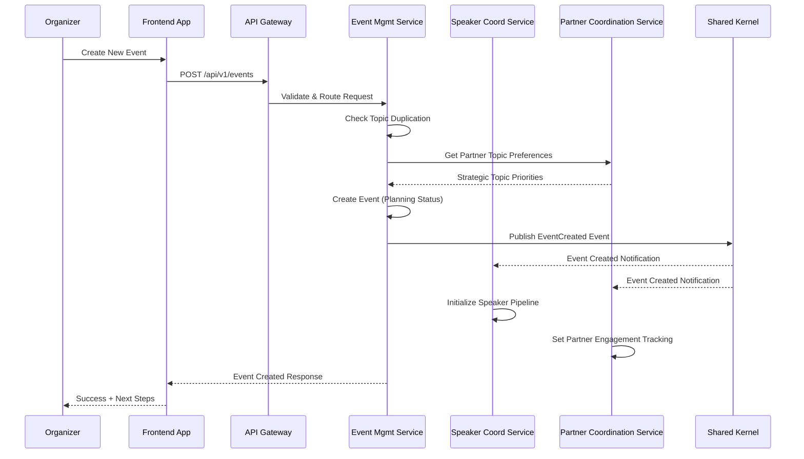
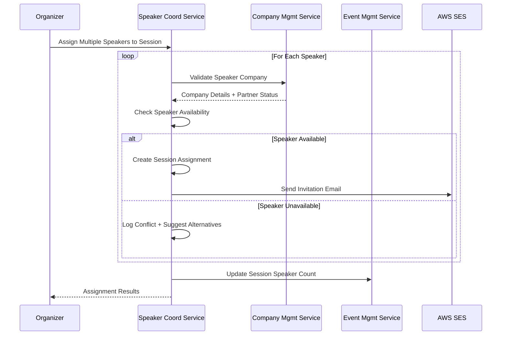

# Event Management API

This document outlines the Event Management Domain API, which handles event lifecycle management, organizer workflows, and the comprehensive 16-step workflow automation including slot management, quality control, overflow handling, and real-time collaboration.

## Overview

The Event Management API provides endpoints for:
- Event CRUD operations and status management
- 16-step workflow state management
- Slot configuration and assignment management
- Event timeline and milestone tracking
- Topic backlog management with ML-powered similarity and staleness detection
- Organizer role management
- Role promotion and demotion workflows

## API Endpoints

### Event Operations

#### List All Events

```yaml
GET /api/v1/events
tags: [Events]
summary: List all events
parameters:
  - name: status
    in: query
    schema:
      $ref: '#/components/schemas/EventStatus'
  - name: year
    in: query
    schema:
      type: integer
  - name: limit
    in: query
    schema:
      type: integer
      default: 20
  - name: offset
    in: query
    schema:
      type: integer
      default: 0
responses:
  '200':
    description: List of events
    content:
      application/json:
        schema:
          type: object
          properties:
            events:
              type: array
              items:
                $ref: '#/components/schemas/Event'
            pagination:
              $ref: 'common#/components/schemas/Pagination'
```

#### Create New Event

```yaml
POST /api/v1/events
tags: [Events]
summary: Create new event
security:
  - BearerAuth: [organizer]
requestBody:
  required: true
  content:
    application/json:
      schema:
        $ref: '#/components/schemas/CreateEventRequest'
responses:
  '201':
    description: Event created
    content:
      application/json:
        schema:
          $ref: '#/components/schemas/Event'
```

### Event Workflow Management

#### Get Event Workflow State

```yaml
GET /api/v1/events/{eventId}/workflow
tags: [Event Workflow]
summary: Get event workflow state
parameters:
  - name: eventId
    in: path
    required: true
    schema:
      type: string
      format: uuid
responses:
  '200':
    description: Event workflow state
    content:
      application/json:
        schema:
          $ref: '#/components/schemas/EventWorkflow'
```

#### Update Event Workflow State

```yaml
PUT /api/v1/events/{eventId}/workflow
tags: [Event Workflow]
summary: Update event workflow state
security:
  - BearerAuth: [organizer]
parameters:
  - name: eventId
    in: path
    required: true
    schema:
      type: string
      format: uuid
requestBody:
  required: true
  content:
    application/json:
      schema:
        $ref: '#/components/schemas/UpdateWorkflowRequest'
responses:
  '200':
    description: Workflow updated
    content:
      application/json:
        schema:
          $ref: '#/components/schemas/EventWorkflow'
```

### Slot Management

#### List Event Slots

```yaml
GET /api/v1/events/{eventId}/slots
tags: [Slot Management]
summary: List event slots
parameters:
  - name: eventId
    in: path
    required: true
    schema:
      type: string
      format: uuid
  - name: slotType
    in: query
    schema:
      $ref: '#/components/schemas/SlotType'
  - name: assigned
    in: query
    schema:
      type: boolean
responses:
  '200':
    description: List of event slots
    content:
      application/json:
        schema:
          type: array
          items:
            $ref: '#/components/schemas/EventSlot'
```

#### Create Slot Configuration

```yaml
POST /api/v1/events/{eventId}/slots
tags: [Slot Management]
summary: Create slot configuration
security:
  - BearerAuth: [organizer]
parameters:
  - name: eventId
    in: path
    required: true
    schema:
      type: string
      format: uuid
requestBody:
  required: true
  content:
    application/json:
      schema:
        $ref: '#/components/schemas/CreateSlotConfigRequest'
responses:
  '201':
    description: Slots created
    content:
      application/json:
        schema:
          type: array
          items:
            $ref: '#/components/schemas/EventSlot'
```

#### Assign Speaker to Slot

```yaml
POST /api/v1/events/{eventId}/slots/{slotId}/assign
tags: [Slot Management]
summary: Assign speaker to slot
security:
  - BearerAuth: [organizer]
parameters:
  - name: eventId
    in: path
    required: true
    schema:
      type: string
      format: uuid
  - name: slotId
    in: path
    required: true
    schema:
      type: string
      format: uuid
requestBody:
  required: true
  content:
    application/json:
      schema:
        $ref: '#/components/schemas/AssignSlotRequest'
responses:
  '200':
    description: Speaker assigned to slot
    content:
      application/json:
        schema:
          $ref: '#/components/schemas/SlotAssignment'
```

#### Unassign Speaker from Slot

```yaml
DELETE /api/v1/events/{eventId}/slots/{slotId}/assign
tags: [Slot Management]
summary: Unassign speaker from slot
security:
  - BearerAuth: [organizer]
parameters:
  - name: eventId
    in: path
    required: true
    schema:
      type: string
      format: uuid
  - name: slotId
    in: path
    required: true
    schema:
      type: string
      format: uuid
responses:
  '204':
    description: Speaker unassigned from slot
```

### Overflow Management & Waitlist

#### List Overflow Speakers

```yaml
GET /api/v1/events/{eventId}/overflow
tags: [Overflow Management]
summary: List overflow speakers
security:
  - BearerAuth: [organizer]
parameters:
  - name: eventId
    in: path
    required: true
    schema:
      type: string
      format: uuid
responses:
  '200':
    description: Overflow speakers
    content:
      application/json:
        schema:
          $ref: '#/components/schemas/OverflowManagement'
```

#### Vote on Speaker Selection

```yaml
POST /api/v1/events/{eventId}/overflow
tags: [Overflow Management]
summary: Vote on speaker selection
security:
  - BearerAuth: [organizer]
parameters:
  - name: eventId
    in: path
    required: true
    schema:
      type: string
      format: uuid
requestBody:
  required: true
  content:
    application/json:
      schema:
        $ref: '#/components/schemas/SpeakerVoteRequest'
responses:
  '201':
    description: Vote recorded
    content:
      application/json:
        schema:
          $ref: '#/components/schemas/SpeakerSelectionVote'
```

#### Promote Overflow Speaker

```yaml
POST /api/v1/events/{eventId}/overflow/{speakerId}/promote
tags: [Overflow Management]
summary: Promote overflow speaker to active (on dropout)
security:
  - BearerAuth: [organizer]
parameters:
  - name: eventId
    in: path
    required: true
    schema:
      type: string
      format: uuid
  - name: speakerId
    in: path
    required: true
    schema:
      type: string
      format: uuid
requestBody:
  required: true
  content:
    application/json:
      schema:
        type: object
        properties:
          slotId:
            type: string
            format: uuid
            description: Slot to assign the promoted speaker
          reason:
            type: string
            description: Reason for promotion (e.g., "Speaker dropout")
        required:
          - slotId
responses:
  '200':
    description: Overflow speaker promoted successfully
    content:
      application/json:
        schema:
          $ref: '#/components/schemas/OverflowSpeaker'
```

### Topic Backlog Management

#### List Topic Backlog

```yaml
GET /api/v1/topics/backlog
tags: [Topic Management]
summary: List topic backlog with heat map and staleness data
security:
  - BearerAuth: [organizer]
parameters:
  - name: sortBy
    in: query
    schema:
      type: string
      enum: [staleness, usage_count, last_used, similarity]
  - name: limit
    in: query
    schema:
      type: integer
      default: 50
  - name: offset
    in: query
    schema:
      type: integer
      default: 0
responses:
  '200':
    description: Topic backlog with analytics
    content:
      application/json:
        schema:
          type: object
          properties:
            topics:
              type: array
              items:
                $ref: '#/components/schemas/TopicBacklogItem'
            pagination:
              $ref: 'common#/components/schemas/Pagination'
```

#### Add Topic to Backlog

```yaml
POST /api/v1/topics/backlog
tags: [Topic Management]
summary: Add new topic to backlog
security:
  - BearerAuth: [organizer, partner]
requestBody:
  required: true
  content:
    application/json:
      schema:
        $ref: '#/components/schemas/CreateTopicBacklogRequest'
responses:
  '201':
    description: Topic added to backlog
    content:
      application/json:
        schema:
          $ref: '#/components/schemas/TopicBacklogItem'
  '409':
    description: Similar topic already exists (similarity score > 0.8)
    content:
      application/json:
        schema:
          type: object
          properties:
            error:
              type: string
            similarTopics:
              type: array
              items:
                $ref: '#/components/schemas/SimilarTopicMatch'
```

#### Get Topic Similarity Analysis

```yaml
GET /api/v1/topics/backlog/{topicId}/similarity
tags: [Topic Management]
summary: Get ML-powered similarity analysis for topic
security:
  - BearerAuth: [organizer]
parameters:
  - name: topicId
    in: path
    required: true
    schema:
      type: string
      format: uuid
  - name: threshold
    in: query
    schema:
      type: number
      format: double
      default: 0.7
      description: Minimum similarity score (0-1)
responses:
  '200':
    description: Similar topics found
    content:
      application/json:
        schema:
          type: object
          properties:
            topicId:
              type: string
              format: uuid
            similarTopics:
              type: array
              items:
                $ref: '#/components/schemas/SimilarTopicMatch'
```

#### Get Topic Staleness Metrics

```yaml
GET /api/v1/topics/backlog/{topicId}/staleness
tags: [Topic Management]
summary: Get staleness and recommended wait period for topic
security:
  - BearerAuth: [organizer]
parameters:
  - name: topicId
    in: path
    required: true
    schema:
      type: string
      format: uuid
responses:
  '200':
    description: Topic staleness metrics
    content:
      application/json:
        schema:
          $ref: '#/components/schemas/TopicStalenessMetrics'
```

### User Role Management

#### Get User Role History

```yaml
GET /api/v1/users/{userId}/roles
tags: [Role Management]
summary: Get user role history
security:
  - BearerAuth: [organizer]
parameters:
  - name: userId
    in: path
    required: true
    schema:
      type: string
      format: uuid
responses:
  '200':
    description: User role history
    content:
      application/json:
        schema:
          type: object
          properties:
            userId:
              type: string
              format: uuid
            currentRoles:
              type: array
              items:
                $ref: '#/components/schemas/UserRole'
            roleHistory:
              type: array
              items:
                $ref: '#/components/schemas/RoleChange'
```

#### Promote User to Role

```yaml
POST /api/v1/users/{userId}/roles
tags: [Role Management]
summary: Promote user to role
security:
  - BearerAuth: [organizer]
parameters:
  - name: userId
    in: path
    required: true
    schema:
      type: string
      format: uuid
requestBody:
  required: true
  content:
    application/json:
      schema:
        type: object
        properties:
          role:
            $ref: '#/components/schemas/UserRole'
          reason:
            type: string
            maxLength: 500
        required:
          - role
responses:
  '201':
    description: Role promoted successfully
    content:
      application/json:
        schema:
          $ref: '#/components/schemas/RoleChange'
  '400':
    description: Invalid role or user ineligible
  '403':
    description: Insufficient permissions
```

#### Demote User from Role

```yaml
DELETE /api/v1/users/{userId}/roles/{role}
tags: [Role Management]
summary: Demote user from role
security:
  - BearerAuth: [organizer]
parameters:
  - name: userId
    in: path
    required: true
    schema:
      type: string
      format: uuid
  - name: role
    in: path
    required: true
    schema:
      $ref: '#/components/schemas/UserRole'
requestBody:
  required: true
  content:
    application/json:
      schema:
        type: object
        properties:
          reason:
            type: string
            maxLength: 500
        required:
          - reason
responses:
  '200':
    description: Role demoted (immediate for Speaker)
    content:
      application/json:
        schema:
          $ref: '#/components/schemas/RoleChange'
  '202':
    description: Demotion request created (requires approval for Organizer)
    content:
      application/json:
        schema:
          $ref: '#/components/schemas/RoleChangeRequest'
  '400':
    description: Cannot demote (minimum organizer rule violation)
  '403':
    description: Insufficient permissions
```

#### Approve Organizer Demotion Request

```yaml
POST /api/v1/users/{userId}/role-changes/{changeId}/approve
tags: [Role Management]
summary: Approve organizer demotion request
security:
  - BearerAuth: [organizer]
parameters:
  - name: userId
    in: path
    required: true
    schema:
      type: string
      format: uuid
  - name: changeId
    in: path
    required: true
    schema:
      type: string
      format: uuid
requestBody:
  required: true
  content:
    application/json:
      schema:
        type: object
        properties:
          approved:
            type: boolean
          comments:
            type: string
            maxLength: 1000
        required:
          - approved
responses:
  '200':
    description: Approval processed
    content:
      application/json:
        schema:
          $ref: '#/components/schemas/RoleChange'
  '403':
    description: Not authorized to approve this request
  '404':
    description: Role change request not found
```

## Core Workflows

### Event Creation with Intelligent Automation



### Multi-Speaker Session Assignment



## Schemas

### Event

```yaml
Event:
  type: object
  properties:
    id:
      type: string
      format: uuid
    eventNumber:
      type: integer
    title:
      type: string
    description:
      type: string
    eventDate:
      type: string
      format: date-time
    status:
      $ref: '#/components/schemas/EventStatus'
    venue:
      $ref: 'common#/components/schemas/Venue'
    sessions:
      type: array
      items:
        $ref: 'common#/components/schemas/Session'
```

### Event Status

```yaml
EventStatus:
  type: string
  enum:
    - planning
    - topic_defined
    - speakers_invited
    - agenda_draft
    - published
    - registration_open
    - registration_closed
    - in_progress
    - completed
    - archived
```

### Event Workflow

```yaml
EventWorkflow:
  type: object
  properties:
    eventId:
      type: string
      format: uuid
    currentState:
      $ref: '#/components/schemas/EventWorkflowState'
    stateHistory:
      type: array
      items:
        $ref: '#/components/schemas/WorkflowStateChange'
    milestones:
      type: array
      items:
        $ref: '#/components/schemas/WorkflowMilestone'

EventWorkflowState:
  type: string
  enum:
    - topic_selection
    - topic_approval
    - speaker_identification
    - speaker_outreach
    - preference_collection
    - slot_creation
    - quality_review
    - slot_assignment
    - overflow_voting
    - agenda_finalization
    - content_submission
    - final_review
    - publication
    - registration_open
    - event_execution
    - post_event_archive
```

### Event Slot

```yaml
EventSlot:
  type: object
  properties:
    id:
      type: string
      format: uuid
    eventId:
      type: string
      format: uuid
    slotType:
      $ref: '#/components/schemas/SlotType'
    startTime:
      type: string
      format: date-time
    endTime:
      type: string
      format: date-time
    assignedSpeakerId:
      type: string
      format: uuid
    assignedAt:
      type: string
      format: date-time
    capacity:
      type: integer
    track:
      type: string

SlotType:
  type: string
  enum:
    - keynote
    - session
    - panel
    - workshop
    - networking
```

### Slot Assignment

```yaml
SlotAssignment:
  type: object
  properties:
    slotId:
      type: string
      format: uuid
    speakerId:
      type: string
      format: uuid
    sessionId:
      type: string
      format: uuid
    assignedBy:
      type: string
      format: uuid
    assignedAt:
      type: string
      format: date-time
    matchScore:
      type: number
      format: double
      description: Algorithm-calculated match score (0-1)
```

### Overflow Management

```yaml
OverflowManagement:
  type: object
  properties:
    eventId:
      type: string
      format: uuid
    overflowSpeakers:
      type: array
      items:
        $ref: '#/components/schemas/OverflowSpeaker'
    votingComplete:
      type: boolean
    votingDeadline:
      type: string
      format: date-time

OverflowSpeaker:
  type: object
  properties:
    speakerId:
      type: string
      format: uuid
    sessionId:
      type: string
      format: uuid
    addedAt:
      type: string
      format: date-time
    votes:
      type: integer
      description: Number of approve votes
    selected:
      type: boolean
      description: Whether speaker was selected after voting
    priority:
      type: integer
      description: Priority ranking based on votes

SpeakerVoteRequest:
  type: object
  properties:
    speakerId:
      type: string
      format: uuid
    vote:
      type: string
      enum: [approve, reject]
    reason:
      type: string
      maxLength: 500
  required:
    - speakerId
    - vote

SpeakerSelectionVote:
  type: object
  properties:
    id:
      type: string
      format: uuid
    organizerId:
      type: string
      format: uuid
    speakerId:
      type: string
      format: uuid
    vote:
      type: string
      enum: [approve, reject]
    reason:
      type: string
    votedAt:
      type: string
      format: date-time
```

### Role Management

```yaml
UserRole:
  type: string
  enum:
    - ORGANIZER
    - SPEAKER
    - PARTNER
    - ATTENDEE

RoleChange:
  type: object
  properties:
    id:
      type: string
      format: uuid
    userId:
      type: string
      format: uuid
    fromRole:
      $ref: '#/components/schemas/UserRole'
    toRole:
      $ref: '#/components/schemas/UserRole'
    changedBy:
      type: string
      format: uuid
    reason:
      type: string
    timestamp:
      type: string
      format: date-time
    status:
      type: string
      enum: [COMPLETED, PENDING_APPROVAL, REJECTED]

RoleChangeRequest:
  type: object
  properties:
    id:
      type: string
      format: uuid
    userId:
      type: string
      format: uuid
    requestedRole:
      $ref: '#/components/schemas/UserRole'
    currentRole:
      $ref: '#/components/schemas/UserRole'
    requestedBy:
      type: string
      format: uuid
    reason:
      type: string
    status:
      type: string
      enum: [PENDING, APPROVED, REJECTED]
    createdAt:
      type: string
      format: date-time
    requiresApprovalFrom:
      type: string
      format: uuid
      description: User ID who must approve (for organizer demotions)
```

### Topic Backlog Schemas

```yaml
TopicBacklogItem:
  type: object
  properties:
    id:
      type: string
      format: uuid
    title:
      type: string
      maxLength: 200
    description:
      type: string
      maxLength: 1000
    suggestedBy:
      type: string
      format: uuid
      description: User ID who suggested the topic
    suggestedByRole:
      type: string
      enum: [ORGANIZER, PARTNER]
    createdAt:
      type: string
      format: date-time
    usageCount:
      type: integer
      description: Number of times topic has been used
    lastUsedAt:
      type: string
      format: date-time
      description: When topic was last used for an event
    stalenessScore:
      type: number
      format: double
      description: Staleness score (0-1, higher = staler)
    recommendedWaitMonths:
      type: integer
      description: Recommended months to wait before reuse
    heatMapData:
      type: array
      items:
        type: object
        properties:
          year:
            type: integer
          usage:
            type: integer
      description: Historical usage frequency by year
    partnerVotes:
      type: integer
      description: Number of partner votes for this topic
    tags:
      type: array
      items:
        type: string

CreateTopicBacklogRequest:
  type: object
  required:
    - title
    - description
  properties:
    title:
      type: string
      maxLength: 200
    description:
      type: string
      maxLength: 1000
    tags:
      type: array
      items:
        type: string
    checkSimilarity:
      type: boolean
      default: true
      description: Whether to check for similar topics

SimilarTopicMatch:
  type: object
  properties:
    topicId:
      type: string
      format: uuid
    title:
      type: string
    similarityScore:
      type: number
      format: double
      description: ML-computed similarity score (0-1)
    similarityType:
      type: string
      enum: [SEMANTIC, LEXICAL, HYBRID]
      description: Type of similarity detection used
    lastUsedAt:
      type: string
      format: date-time
    recommendedAction:
      type: string
      enum: [AVOID, MERGE, USE_WITH_CAUTION, PROCEED]

TopicStalenessMetrics:
  type: object
  properties:
    topicId:
      type: string
      format: uuid
    stalenessScore:
      type: number
      format: double
      description: Overall staleness score (0-1)
    lastUsedAt:
      type: string
      format: date-time
    daysSinceLastUse:
      type: integer
    recommendedWaitMonths:
      type: integer
      description: Recommended months to wait before reuse
    historicalPattern:
      type: object
      properties:
        averageReuseInterval:
          type: integer
          description: Average months between reuses
        usageFrequency:
          type: string
          enum: [RARE, OCCASIONAL, FREQUENT, OVERUSED]
        trendDirection:
          type: string
          enum: [DECLINING, STABLE, RISING]
    partnerInfluence:
      type: object
      properties:
        partnerRequestCount:
          type: integer
        recentPartnerVotes:
          type: integer
        influenceWeight:
          type: number
          format: double
          description: Partner influence on recommended wait (0-1)
    recommendation:
      type: string
      enum: [TOO_SOON, ACCEPTABLE, IDEAL, OVERDUE]
```

### Create Event Request

```yaml
CreateEventRequest:
  type: object
  required:
    - title
    - eventDate
    - venue
  properties:
    title:
      type: string
      maxLength: 200
    description:
      type: string
      maxLength: 2000
    eventDate:
      type: string
      format: date-time
    venue:
      $ref: 'common#/components/schemas/Venue'
    capacity:
      type: integer
      minimum: 1
```

### Create Slot Configuration Request

```yaml
CreateSlotConfigRequest:
  type: object
  required:
    - slots
  properties:
    slots:
      type: array
      items:
        type: object
        properties:
          slotType:
            $ref: '#/components/schemas/SlotType'
          startTime:
            type: string
            format: date-time
          endTime:
            type: string
            format: date-time
          capacity:
            type: integer
          track:
            type: string
```

### Assign Slot Request

```yaml
AssignSlotRequest:
  type: object
  required:
    - speakerId
  properties:
    speakerId:
      type: string
      format: uuid
    sessionId:
      type: string
      format: uuid
    notes:
      type: string
      maxLength: 500
```
