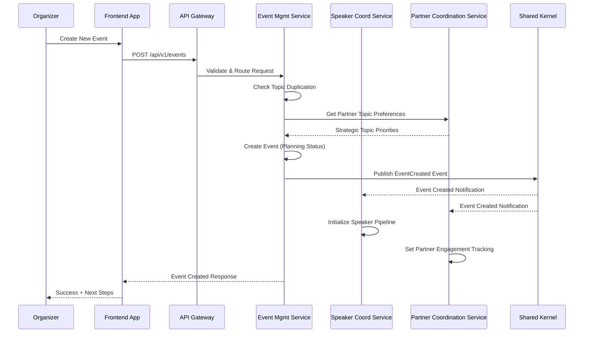
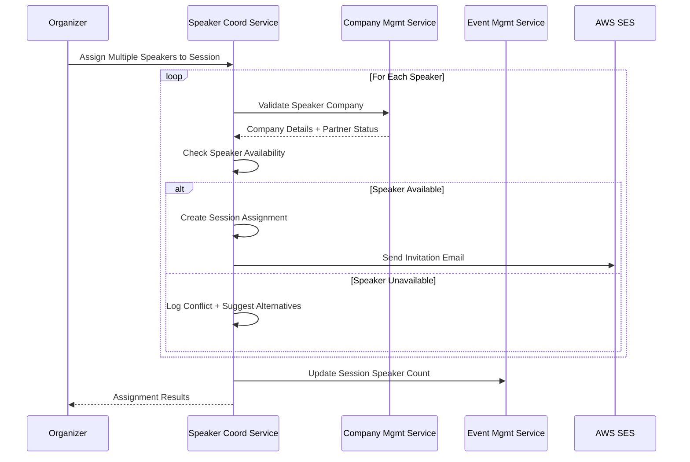

# Event Management API

**Last Updated**: 2025-11-08
**ADR References**:
- [ADR-003: Meaningful Identifiers in Public APIs](./ADR-003-meaningful-identifiers-public-apis.md)
- [ADR-007: Unified User Profile](./ADR-007-unified-user-profile.md)

This document outlines the Event Management Domain API, which handles event lifecycle management, organizer workflows, and the comprehensive 9-state workflow automation including slot management, quality control, overflow handling, and real-time collaboration (see 06a-workflow-state-machines.md).

## Identifier Strategy

**Per ADR-003**, this API uses meaningful identifiers in all public endpoints:

- **Events**: `eventCode` (e.g., `BATbern56`) instead of UUID
- **Users/Organizers**: `username` (e.g., `john.doe`) instead of UUID
- **Sessions**: `sessionSlug` (e.g., `blockchain-security-101`) instead of UUID
- **Internal IDs**: Slots and internal references may still use UUIDs for referential integrity

**Database Layer**: UUIDs remain as primary keys internally. Meaningful IDs are unique alternate keys with indexes.

**See**: `docs/api/events-api.openapi.yml` for authoritative OpenAPI specification.

## Overview

The Event Management API provides endpoints for:
- Event CRUD operations and status management
- 9-state workflow state management
- Slot configuration and assignment management
- Event timeline and milestone tracking
- Topic backlog management with ML-powered similarity and staleness detection
- Organizer role management
- Role promotion and demotion workflows
- **Event registration (public access)** - Anonymous and authenticated registration with email-based account linking

## API Endpoints

### Event Operations

#### List All Events

```yaml
GET /api/v1/events
tags: [Events]
summary: List all events
parameters:
  - name: workflowState
    in: query
    schema:
      $ref: '#/components/schemas/EventWorkflowState'
  - name: year
    in: query
    schema:
      type: integer
  - name: limit
    in: query
    schema:
      type: integer
      default: 20
  - name: offset
    in: query
    schema:
      type: integer
      default: 0
responses:
  '200':
    description: List of events
    content:
      application/json:
        schema:
          type: object
          properties:
            events:
              type: array
              items:
                $ref: '#/components/schemas/Event'
            pagination:
              $ref: 'common#/components/schemas/Pagination'
```

#### Create New Event

```yaml
POST /api/v1/events
tags: [Events]
summary: Create new event
security:
  - BearerAuth: [organizer]
requestBody:
  required: true
  content:
    application/json:
      schema:
        $ref: '#/components/schemas/CreateEventRequest'
responses:
  '201':
    description: Event created
    content:
      application/json:
        schema:
          $ref: '#/components/schemas/Event'
```

### Event Workflow Management

#### Get Event Workflow State

```yaml
GET /api/v1/events/{eventCode}/workflow
tags: [Event Workflow]
summary: Get event workflow state
parameters:
  - name: eventCode
    in: path
    required: true
    schema:
      type: string

      description: Meaningful identifier (see ADR-003)
responses:
  '200':
    description: Event workflow state
    content:
      application/json:
        schema:
          $ref: '#/components/schemas/EventWorkflow'
```

#### Update Event Workflow State

```yaml
PUT /api/v1/events/{eventCode}/workflow
tags: [Event Workflow]
summary: Update event workflow state
security:
  - BearerAuth: [organizer]
parameters:
  - name: eventCode
    in: path
    required: true
    schema:
      type: string

      description: Meaningful identifier (see ADR-003)
requestBody:
  required: true
  content:
    application/json:
      schema:
        $ref: '#/components/schemas/UpdateWorkflowRequest'
responses:
  '200':
    description: Workflow updated
    content:
      application/json:
        schema:
          $ref: '#/components/schemas/EventWorkflow'
```

### Event Registration Operations

**ADR-007 Reference**: Unified User Profile
**Story**: 4.1.5a Architecture Consolidation

Event registrations support both anonymous (public) and authenticated users. Anonymous users can register without creating a Cognito account. User profiles are created/found via User Management Service API.

#### Create Event Registration (Public Access)

```yaml
POST /api/v1/events/{eventCode}/registrations
tags: [Event Registration]
summary: Register for an event (public access, no authentication required)
description: |
  Allows anonymous public users to register for events without creating an account.
  Creates/finds user_profile via User Management Service (ADR-004, ADR-007).
  Registration is for the WHOLE EVENT, not individual sessions.
security: []  # Public endpoint - no authentication required
parameters:
  - name: eventCode
    in: path
    required: true
    schema:
      type: string
    description: Event code (e.g., "BATbern142")
requestBody:
  required: true
  content:
    application/json:
      schema:
        $ref: '#/components/schemas/CreateRegistrationRequest'
      examples:
        anonymous_user:
          summary: Anonymous registration (no account)
          value:
            firstName: "John"
            lastName: "Doe"
            email: "john.doe@example.com"
            company: "GoogleZH"
            role: "Software Architect"
responses:
  '201':
    description: Registration created successfully
    content:
      application/json:
        schema:
          $ref: '#/components/schemas/Registration'
  '400':
    description: Validation error
  '404':
    description: Event not found
  '409':
    description: Already registered
```

#### Get Registration (Public Access)

```yaml
GET /api/v1/events/{eventCode}/registrations/{registrationCode}
tags: [Event Registration]
summary: Get registration details (public access via confirmation code)
description: |
  Anyone with the registration code can view the registration.
  Confirmation code acts as a secret for anonymous access.
security: []  # Public endpoint - secured by confirmation code
parameters:
  - name: eventCode
    in: path
    required: true
    schema:
      type: string
  - name: registrationCode
    in: path
    required: true
    schema:
      type: string
    description: Registration confirmation code (e.g., "BATbern142-reg-abc123")
responses:
  '200':
    description: Registration details
    content:
      application/json:
        schema:
          $ref: '#/components/schemas/Registration'
  '404':
    description: Registration not found
```

#### List Event Registrations (Authenticated)

```yaml
GET /api/v1/events/{eventCode}/registrations
tags: [Event Registration]
summary: List all registrations for an event
security:
  - BearerAuth: [organizer]
parameters:
  - name: eventCode
    in: path
    required: true
    schema:
      type: string
  - name: status
    in: query
    schema:
      type: string
      enum: [registered, waitlisted, confirmed, cancelled, attended]
responses:
  '200':
    description: List of registrations
    content:
      application/json:
        schema:
          type: array
          items:
            $ref: '#/components/schemas/Registration'
```

#### Update Registration Status

```yaml
PATCH /api/v1/events/{eventCode}/registrations/{registrationCode}
tags: [Event Registration]
summary: Update registration status
security:
  - BearerAuth: [organizer]
parameters:
  - name: eventCode
    in: path
    required: true
    schema:
      type: string
  - name: registrationCode
    in: path
    required: true
    schema:
      type: string
requestBody:
  required: true
  content:
    application/json:
      schema:
        type: object
        properties:
          status:
            type: string
            enum: [registered, waitlisted, confirmed, cancelled, attended]
responses:
  '200':
    description: Registration updated
    content:
      application/json:
        schema:
          $ref: '#/components/schemas/Registration'
```

#### Delete Registration

```yaml
DELETE /api/v1/events/{eventCode}/registrations/{registrationCode}
tags: [Event Registration]
summary: Cancel/delete registration
description: Can be called by owner (public with confirmation code) or organizer (authenticated)
parameters:
  - name: eventCode
    in: path
    required: true
    schema:
      type: string
  - name: registrationCode
    in: path
    required: true
    schema:
      type: string
responses:
  '204':
    description: Registration deleted
  '404':
    description: Registration not found
```

### Slot Management

#### List Event Slots

```yaml
GET /api/v1/events/{eventCode}/slots
tags: [Slot Management]
summary: List event slots
parameters:
  - name: eventCode
    in: path
    required: true
    schema:
      type: string

      description: Meaningful identifier (see ADR-003)
  - name: slotType
    in: query
    schema:
      $ref: '#/components/schemas/SlotType'
  - name: assigned
    in: query
    schema:
      type: boolean
responses:
  '200':
    description: List of event slots
    content:
      application/json:
        schema:
          type: array
          items:
            $ref: '#/components/schemas/EventSlot'
```

#### Create Slot Configuration

```yaml
POST /api/v1/events/{eventCode}/slots
tags: [Slot Management]
summary: Create slot configuration
security:
  - BearerAuth: [organizer]
parameters:
  - name: eventCode
    in: path
    required: true
    schema:
      type: string

      description: Meaningful identifier (see ADR-003)
requestBody:
  required: true
  content:
    application/json:
      schema:
        $ref: '#/components/schemas/CreateSlotConfigRequest'
responses:
  '201':
    description: Slots created
    content:
      application/json:
        schema:
          type: array
          items:
            $ref: '#/components/schemas/EventSlot'
```

#### Assign Speaker to Slot

```yaml
POST /api/v1/events/{eventCode}/slots/{slotId}/assign
tags: [Slot Management]
summary: Assign speaker to slot
security:
  - BearerAuth: [organizer]
parameters:
  - name: eventCode
    in: path
    required: true
    schema:
      type: string

      description: Meaningful identifier (see ADR-003)
  - name: slotId
    in: path
    required: true
    schema:
      type: string

      description: Meaningful identifier (see ADR-003)
requestBody:
  required: true
  content:
    application/json:
      schema:
        $ref: '#/components/schemas/AssignSlotRequest'
responses:
  '200':
    description: Speaker assigned to slot
    content:
      application/json:
        schema:
          $ref: '#/components/schemas/SlotAssignment'
```

#### Unassign Speaker from Slot

```yaml
DELETE /api/v1/events/{eventCode}/slots/{slotId}/assign
tags: [Slot Management]
summary: Unassign speaker from slot
security:
  - BearerAuth: [organizer]
parameters:
  - name: eventCode
    in: path
    required: true
    schema:
      type: string

      description: Meaningful identifier (see ADR-003)
  - name: slotId
    in: path
    required: true
    schema:
      type: string

      description: Meaningful identifier (see ADR-003)
responses:
  '204':
    description: Speaker unassigned from slot
```

### Overflow Management & Waitlist

#### List Overflow Speakers

```yaml
GET /api/v1/events/{eventCode}/overflow
tags: [Overflow Management]
summary: List overflow speakers
security:
  - BearerAuth: [organizer]
parameters:
  - name: eventCode
    in: path
    required: true
    schema:
      type: string

      description: Meaningful identifier (see ADR-003)
responses:
  '200':
    description: Overflow speakers
    content:
      application/json:
        schema:
          $ref: '#/components/schemas/OverflowManagement'
```

#### Vote on Speaker Selection

```yaml
POST /api/v1/events/{eventCode}/overflow
tags: [Overflow Management]
summary: Vote on speaker selection
security:
  - BearerAuth: [organizer]
parameters:
  - name: eventCode
    in: path
    required: true
    schema:
      type: string

      description: Meaningful identifier (see ADR-003)
requestBody:
  required: true
  content:
    application/json:
      schema:
        $ref: '#/components/schemas/SpeakerVoteRequest'
responses:
  '201':
    description: Vote recorded
    content:
      application/json:
        schema:
          $ref: '#/components/schemas/SpeakerSelectionVote'
```

#### Promote Overflow Speaker

```yaml
POST /api/v1/events/{eventCode}/overflow/{speakerUsername}/promote
tags: [Overflow Management]
summary: Promote overflow speaker to active (on dropout)
security:
  - BearerAuth: [organizer]
parameters:
  - name: eventCode
    in: path
    required: true
    schema:
      type: string

      description: Meaningful identifier (see ADR-003)
  - name: speakerUsername
    in: path
    required: true
    schema:
      type: string

      description: Meaningful identifier (see ADR-003)
requestBody:
  required: true
  content:
    application/json:
      schema:
        type: object
        properties:
          slotId:
            type: string

            description: Meaningful identifier (see ADR-003)
            description: Slot to assign the promoted speaker
          reason:
            type: string
            description: Reason for promotion (e.g., "Speaker dropout")
        required:
          - slotId
responses:
  '200':
    description: Overflow speaker promoted successfully
    content:
      application/json:
        schema:
          $ref: '#/components/schemas/OverflowSpeaker'
```

### Topic Backlog Management

#### List Topic Backlog

```yaml
GET /api/v1/topics/backlog
tags: [Topic Management]
summary: List topic backlog with heat map and staleness data
security:
  - BearerAuth: [organizer]
parameters:
  - name: sortBy
    in: query
    schema:
      type: string
      enum: [staleness, usage_count, last_used, similarity]
  - name: limit
    in: query
    schema:
      type: integer
      default: 50
  - name: offset
    in: query
    schema:
      type: integer
      default: 0
responses:
  '200':
    description: Topic backlog with analytics
    content:
      application/json:
        schema:
          type: object
          properties:
            topics:
              type: array
              items:
                $ref: '#/components/schemas/TopicBacklogItem'
            pagination:
              $ref: 'common#/components/schemas/Pagination'
```

#### Add Topic to Backlog

```yaml
POST /api/v1/topics/backlog
tags: [Topic Management]
summary: Add new topic to backlog
security:
  - BearerAuth: [organizer, partner]
requestBody:
  required: true
  content:
    application/json:
      schema:
        $ref: '#/components/schemas/CreateTopicBacklogRequest'
responses:
  '201':
    description: Topic added to backlog
    content:
      application/json:
        schema:
          $ref: '#/components/schemas/TopicBacklogItem'
  '409':
    description: Similar topic already exists (similarity score > 0.8)
    content:
      application/json:
        schema:
          type: object
          properties:
            error:
              type: string
            similarTopics:
              type: array
              items:
                $ref: '#/components/schemas/SimilarTopicMatch'
```

#### Get Topic Similarity Analysis

```yaml
GET /api/v1/topics/backlog/{topicId}/similarity
tags: [Topic Management]
summary: Get ML-powered similarity analysis for topic
security:
  - BearerAuth: [organizer]
parameters:
  - name: topicId
    in: path
    required: true
    schema:
      type: string

      description: Meaningful identifier (see ADR-003)
  - name: threshold
    in: query
    schema:
      type: number
      format: double
      default: 0.7
      description: Minimum similarity score (0-1)
responses:
  '200':
    description: Similar topics found
    content:
      application/json:
        schema:
          type: object
          properties:
            topicId:
              type: string

              description: Meaningful identifier (see ADR-003)
            similarTopics:
              type: array
              items:
                $ref: '#/components/schemas/SimilarTopicMatch'
```

#### Get Topic Staleness Metrics

```yaml
GET /api/v1/topics/backlog/{topicId}/staleness
tags: [Topic Management]
summary: Get staleness and recommended wait period for topic
security:
  - BearerAuth: [organizer]
parameters:
  - name: topicId
    in: path
    required: true
    schema:
      type: string

      description: Meaningful identifier (see ADR-003)
responses:
  '200':
    description: Topic staleness metrics
    content:
      application/json:
        schema:
          $ref: '#/components/schemas/TopicStalenessMetrics'
```

### User Role Management

#### Get User Role History

```yaml
GET /api/v1/users/{username}/roles
tags: [Role Management]
summary: Get user role history
security:
  - BearerAuth: [organizer]
parameters:
  - name: username
    in: path
    required: true
    schema:
      type: string

      description: Meaningful identifier (see ADR-003)
responses:
  '200':
    description: User role history
    content:
      application/json:
        schema:
          type: object
          properties:
            username:
              type: string

              description: Meaningful identifier (see ADR-003)
            currentRoles:
              type: array
              items:
                $ref: '#/components/schemas/UserRole'
            roleHistory:
              type: array
              items:
                $ref: '#/components/schemas/RoleChange'
```

#### Promote User to Role

```yaml
POST /api/v1/users/{username}/roles
tags: [Role Management]
summary: Promote user to role
security:
  - BearerAuth: [organizer]
parameters:
  - name: username
    in: path
    required: true
    schema:
      type: string

      description: Meaningful identifier (see ADR-003)
requestBody:
  required: true
  content:
    application/json:
      schema:
        type: object
        properties:
          role:
            $ref: '#/components/schemas/UserRole'
          reason:
            type: string
            maxLength: 500
        required:
          - role
responses:
  '201':
    description: Role promoted successfully
    content:
      application/json:
        schema:
          $ref: '#/components/schemas/RoleChange'
  '400':
    description: Invalid role or user ineligible
  '403':
    description: Insufficient permissions
```

#### Demote User from Role

```yaml
DELETE /api/v1/users/{username}/roles/{role}
tags: [Role Management]
summary: Demote user from role
security:
  - BearerAuth: [organizer]
parameters:
  - name: username
    in: path
    required: true
    schema:
      type: string

      description: Meaningful identifier (see ADR-003)
  - name: role
    in: path
    required: true
    schema:
      $ref: '#/components/schemas/UserRole'
requestBody:
  required: true
  content:
    application/json:
      schema:
        type: object
        properties:
          reason:
            type: string
            maxLength: 500
        required:
          - reason
responses:
  '200':
    description: Role demoted (immediate for Speaker)
    content:
      application/json:
        schema:
          $ref: '#/components/schemas/RoleChange'
  '202':
    description: Demotion request created (requires approval for Organizer)
    content:
      application/json:
        schema:
          $ref: '#/components/schemas/RoleChangeRequest'
  '400':
    description: Cannot demote (minimum organizer rule violation)
  '403':
    description: Insufficient permissions
```

#### Approve Organizer Demotion Request

```yaml
POST /api/v1/users/{username}/role-changes/{changeId}/approve
tags: [Role Management]
summary: Approve organizer demotion request
security:
  - BearerAuth: [organizer]
parameters:
  - name: username
    in: path
    required: true
    schema:
      type: string

      description: Meaningful identifier (see ADR-003)
  - name: changeId
    in: path
    required: true
    schema:
      type: string

      description: Meaningful identifier (see ADR-003)
requestBody:
  required: true
  content:
    application/json:
      schema:
        type: object
        properties:
          approved:
            type: boolean
          comments:
            type: string
            maxLength: 1000
        required:
          - approved
responses:
  '200':
    description: Approval processed
    content:
      application/json:
        schema:
          $ref: '#/components/schemas/RoleChange'
  '403':
    description: Not authorized to approve this request
  '404':
    description: Role change request not found
```

### Event Registration (Public Access)

**ADR Reference**: [ADR-007: Unified User Profile](./ADR-007-unified-user-profile.md)

Event registration endpoints support **both anonymous and authenticated registration**. Anonymous users can register with just email and personal details (no account required). When they later create a Cognito account with the same email, their past registrations are automatically linked via the unified user_profiles table.

**Key Features**:
- ✅ Public access (no authentication required)
- ✅ Confirmation code as access token (`BAT-YYYY-NNNNNN`)
- ✅ Automatic email-based account linking
- ✅ Event-level registration (not session-level)
- ✅ QR code generation for event check-in

#### Create Event Registration

```yaml
POST /api/v1/events/{eventCode}/registrations
tags: [Registrations, Public]
summary: Register for event (anonymous or authenticated)
description: |
  Public endpoint allowing anyone to register for an event without authentication.

  **Anonymous Registration**:
  - No authentication required (public access)
  - Email serves as identifier
  - Confirmation code generated automatically (BAT-YYYY-NNNNNN format)
  - Confirmation email sent with QR code
  - Can view registration via confirmation code

  **Authenticated Registration**:
  - If user is authenticated (Bearer token provided), attendee_id is set automatically
  - Links to user's account immediately
  - Can view in authenticated dashboard

  **Account Linking** (Automatic):
  - When anonymous user creates Cognito account with same email
  - All past registrations with that email are automatically claimed
  - Registrations become visible in user's authenticated dashboard
  - See ADR-007 for details

security: []  # Public endpoint - no authentication required

parameters:
  - name: eventCode
    in: path
    required: true
    schema:
      type: string
    description: Event code (meaningful identifier per ADR-003)
    example: BAT-025

requestBody:
  required: true
  content:
    application/json:
      schema:
        type: object
        required:
          - email
          - firstName
          - lastName
          - company
          - role
          - termsAccepted
        properties:
          email:
            type: string
            format: email
            description: Email address (serves as identifier for anonymous registrations)
            example: john.doe@example.com
          firstName:
            type: string
            minLength: 1
            maxLength: 100
            example: John
          lastName:
            type: string
            minLength: 1
            maxLength: 100
            example: Doe
          company:
            type: string
            minLength: 1
            maxLength: 200
            example: Acme Corporation
          role:
            type: string
            minLength: 1
            maxLength: 100
            description: Job title or role
            example: Software Architect
          termsAccepted:
            type: boolean
            description: User must accept terms and conditions
            example: true
          communicationPreferences:
            type: object
            description: Optional communication preferences
            properties:
              newsletterSubscribed:
                type: boolean
                default: false
                description: Subscribe to BATbern newsletter
              eventReminders:
                type: boolean
                default: true
                description: Receive event reminder emails
          specialRequests:
            type: string
            maxLength: 1000
            description: Dietary preferences, accessibility needs, etc.
            example: Vegetarian meal preference

responses:
  '201':
    description: Registration created successfully
    headers:
      Location:
        description: URL to view registration
        schema:
          type: string
          example: /api/v1/events/BAT-025/registrations/BAT-2025-000123
    content:
      application/json:
        schema:
          type: object
          properties:
            id:
              type: string
              format: uuid
              description: Internal registration ID
            confirmationCode:
              type: string
              pattern: ^BAT-\d{4}-\d{6}$
              description: Confirmation code (acts as access token)
              example: BAT-2025-000123
            eventCode:
              type: string
              example: BAT-025
            status:
              type: string
              enum: [registered, confirmed, waitlisted]
              default: confirmed
              description: Registration status
            registrationDate:
              type: string
              format: date-time
              example: '2025-11-08T14:30:00Z'
            firstName:
              type: string
              example: John
            lastName:
              type: string
              example: Doe
            email:
              type: string
              format: email
              example: john.doe@example.com

  '400':
    description: Invalid request (validation errors)
    content:
      application/json:
        schema:
          $ref: 'common#/components/schemas/ErrorResponse'
        examples:
          validationError:
            summary: Validation error
            value:
              error: Validation failed
              message: Email format is invalid
              code: VALIDATION_ERROR
              field: email
          duplicateEmail:
            summary: Duplicate registration
            value:
              error: Already registered
              message: This email is already registered for this event
              code: DUPLICATE_REGISTRATION
          termsNotAccepted:
            summary: Terms not accepted
            value:
              error: Terms required
              message: You must accept the terms and conditions
              code: TERMS_NOT_ACCEPTED

  '404':
    description: Event not found or not open for registration
    content:
      application/json:
        schema:
          $ref: 'common#/components/schemas/ErrorResponse'
        example:
          error: Event not found
          message: Event BAT-025 not found or not accepting registrations
          code: EVENT_NOT_FOUND

  '429':
    description: Rate limit exceeded (public endpoint protection)
    content:
      application/json:
        schema:
          $ref: 'common#/components/schemas/ErrorResponse'
        example:
          error: Too many requests
          message: Rate limit exceeded. Please try again later.
          code: RATE_LIMIT_EXCEEDED
```

#### Get Registration by Confirmation Code

```yaml
GET /api/v1/events/{eventCode}/registrations/{confirmationCode}
tags: [Registrations, Public]
summary: Retrieve registration details by confirmation code
description: |
  Public endpoint for viewing registration details.

  **Access Control**:
  - Confirmation code acts as secret token
  - Anyone with the confirmation code can view the registration
  - No authentication required
  - Cannot list all registrations (only direct lookup by code)

security: []  # Public endpoint - confirmation code is the "secret"

parameters:
  - name: eventCode
    in: path
    required: true
    schema:
      type: string
    description: Event code (meaningful identifier)
    example: BAT-025
  - name: confirmationCode
    in: path
    required: true
    schema:
      type: string
      pattern: ^BAT-\d{4}-\d{6}$
    description: Confirmation code received during registration
    example: BAT-2025-000123

responses:
  '200':
    description: Registration found
    content:
      application/json:
        schema:
          type: object
          properties:
            id:
              type: string
              format: uuid
            confirmationCode:
              type: string
              example: BAT-2025-000123
            eventCode:
              type: string
              example: BAT-025
            eventTitle:
              type: string
              example: 'BATbern 2025 - Architecture Conference'
            eventDate:
              type: string
              format: date-time
              example: '2025-06-15T09:00:00Z'
            eventLocation:
              type: string
              example: 'Bern, Switzerland'
            status:
              type: string
              enum: [registered, confirmed, cancelled, attended]
              example: confirmed
            firstName:
              type: string
              example: John
            lastName:
              type: string
              example: Doe
            email:
              type: string
              format: email
              example: john.doe@example.com
            company:
              type: string
              example: Acme Corporation
            registrationDate:
              type: string
              format: date-time
              example: '2025-11-08T14:30:00Z'
            specialRequests:
              type: string
              example: Vegetarian meal preference
            qrCodeUrl:
              type: string
              description: URL to QR code image for event check-in
              example: /api/v1/events/BAT-025/registrations/BAT-2025-000123/qr

  '404':
    description: Registration not found (invalid confirmation code)
    content:
      application/json:
        schema:
          $ref: 'common#/components/schemas/ErrorResponse'
        example:
          error: Not found
          message: Registration with confirmation code BAT-2025-000123 not found
          code: REGISTRATION_NOT_FOUND
```

#### Generate QR Code for Registration

```yaml
GET /api/v1/events/{eventCode}/registrations/{confirmationCode}/qr
tags: [Registrations, Public]
summary: Generate QR code for registration
description: |
  Public endpoint returning QR code image for registration.

  **QR Code Content**:
  - Encodes confirmation code for quick check-in at event
  - Format: JSON with confirmationCode and eventCode
  - Example: `{"confirmationCode":"BAT-2025-000123","eventCode":"BAT-025"}`

  **Image Format**:
  - PNG format
  - Configurable size (default 300x300 pixels)
  - Black QR code on white background
  - High error correction level (L)

security: []  # Public endpoint

parameters:
  - name: eventCode
    in: path
    required: true
    schema:
      type: string
    example: BAT-025
  - name: confirmationCode
    in: path
    required: true
    schema:
      type: string
      pattern: ^BAT-\d{4}-\d{6}$
    example: BAT-2025-000123
  - name: size
    in: query
    schema:
      type: integer
      default: 300
      minimum: 100
      maximum: 1000
    description: QR code size in pixels (width and height)
    example: 300

responses:
  '200':
    description: QR code image
    content:
      image/png:
        schema:
          type: string
          format: binary

  '404':
    description: Registration not found
    content:
      application/json:
        schema:
          $ref: 'common#/components/schemas/ErrorResponse'
```

#### Cancel Registration

```yaml
DELETE /api/v1/events/{eventCode}/registrations/{confirmationCode}
tags: [Registrations, Public]
summary: Cancel event registration
description: |
  Public endpoint for canceling registration.

  **Cancellation Policy**:
  - Free events: Can cancel anytime before event
  - Paid events: Refund policy applies (to be implemented)
  - Cannot cancel after event has started
  - Sends cancellation confirmation email

security: []  # Public endpoint - confirmation code required

parameters:
  - name: eventCode
    in: path
    required: true
    schema:
      type: string
    example: BAT-025
  - name: confirmationCode
    in: path
    required: true
    schema:
      type: string
      pattern: ^BAT-\d{4}-\d{6}$
    example: BAT-2025-000123
requestBody:
  required: true
  content:
    application/json:
      schema:
        type: object
        properties:
          reason:
            type: string
            maxLength: 500
            description: Optional cancellation reason
            example: Schedule conflict

responses:
  '200':
    description: Registration cancelled successfully
    content:
      application/json:
        schema:
          type: object
          properties:
            confirmationCode:
              type: string
              example: BAT-2025-000123
            status:
              type: string
              enum: [cancelled]
              example: cancelled
            cancelledAt:
              type: string
              format: date-time
              example: '2025-11-09T10:00:00Z'
            message:
              type: string
              example: Your registration has been cancelled. A confirmation email has been sent.

  '400':
    description: Cannot cancel (event already started or other business rule violation)
    content:
      application/json:
        schema:
          $ref: 'common#/components/schemas/ErrorResponse'
        example:
          error: Cannot cancel
          message: Cannot cancel registration after event has started
          code: CANCELLATION_NOT_ALLOWED

  '404':
    description: Registration not found
```

## Core Workflows

### Event Creation with Intelligent Automation


```mermaid
sequenceDiagram
    participant O as Organizer
    participant FE as Frontend App
    participant GW as API Gateway
    participant EM as Event Mgmt Service
    participant SC as Speaker Coord Service
    participant PC as Partner Coordination Service
    participant SK as Shared Kernel

    O->>FE: Create New Event
    FE->>GW: POST /api/v1/events
    GW->>EM: Validate & Route Request

    EM->>EM: Check Topic Duplication
    EM->>PC: Get Partner Topic Preferences
    PC-->>EM: Strategic Topic Priorities

    EM->>EM: Create Event (Planning Status)
    EM->>SK: Publish EventCreated Event

    SK-->>SC: Event Created Notification
    SK-->>PC: Event Created Notification

    SC->>SC: Initialize Speaker Pipeline
    PC->>PC: Set Partner Engagement Tracking

    EM-->>FE: Event Created Response
    FE-->>O: Success + Next Steps
```

### Multi-Speaker Session Assignment


```mermaid
sequenceDiagram
    participant O as Organizer
    participant SC as Speaker Coord Service
    participant CM as Company Mgmt Service
    participant EM as Event Mgmt Service
    participant Email as AWS SES

    O->>SC: Assign Multiple Speakers to Session

    loop For Each Speaker
        SC->>CM: Validate Speaker Company
        CM-->>SC: Company Details + Partner Status
        SC->>SC: Check Speaker Availability

        alt Speaker Available
            SC->>SC: Create Session Assignment
            SC->>Email: Send Invitation Email
        else Speaker Unavailable
            SC->>SC: Log Conflict + Suggest Alternatives
        end
    end

    SC->>EM: Update Session Speaker Count
    SC-->>O: Assignment Results
```

## Schemas

### Event

```yaml
Event:
  type: object
  properties:
    id:
      type: string

      description: Meaningful identifier (see ADR-003)
    eventNumber:
      type: integer
    title:
      type: string
    description:
      type: string
    eventDate:
      type: string
      format: date-time
    workflowState:
      $ref: '#/components/schemas/EventWorkflowState'
    venue:
      $ref: 'common#/components/schemas/Venue'
    sessions:
      type: array
      items:
        $ref: 'common#/components/schemas/Session'
```

### Event Workflow

```yaml
EventWorkflow:
  type: object
  properties:
    eventCode:
      type: string

      description: Meaningful identifier (see ADR-003)
    currentState:
      $ref: '#/components/schemas/EventWorkflowState'
    stateHistory:
      type: array
      items:
        $ref: '#/components/schemas/WorkflowStateChange'
    milestones:
      type: array
      items:
        $ref: '#/components/schemas/WorkflowMilestone'

EventWorkflowState:
  type: string
  description: 9-state event workflow (Story 5.1a - see 06a-workflow-state-machines.md)
  enum:
    - CREATED
    - TOPIC_SELECTION
    - SPEAKER_BRAINSTORMING
    - SPEAKER_OUTREACH
    - SPEAKER_CONFIRMATION
    - CONTENT_COLLECTION
    - QUALITY_REVIEW
    - THRESHOLD_CHECK
    - OVERFLOW_MANAGEMENT
    - SLOT_ASSIGNMENT
    - AGENDA_PUBLISHED
    - AGENDA_FINALIZED
    - NEWSLETTER_SENT
    - EVENT_READY
    - PARTNER_MEETING_COMPLETE
    - ARCHIVED
```

### Event Slot

```yaml
EventSlot:
  type: object
  properties:
    id:
      type: string

      description: Meaningful identifier (see ADR-003)
    eventCode:
      type: string

      description: Meaningful identifier (see ADR-003)
    slotType:
      $ref: '#/components/schemas/SlotType'
    startTime:
      type: string
      format: date-time
    endTime:
      type: string
      format: date-time
    assignedSpeakerUsername:
      type: string

      description: Meaningful identifier (see ADR-003)
    assignedAt:
      type: string
      format: date-time
    capacity:
      type: integer
    track:
      type: string

SlotType:
  type: string
  enum:
    - keynote
    - session
    - panel
    - workshop
    - networking
```

### Slot Assignment

```yaml
SlotAssignment:
  type: object
  properties:
    slotId:
      type: string

      description: Meaningful identifier (see ADR-003)
    speakerUsername:
      type: string

      description: Meaningful identifier (see ADR-003)
    sessionId:
      type: string

      description: Meaningful identifier (see ADR-003)
    assignedBy:
      type: string

      description: Meaningful identifier (see ADR-003)
    assignedAt:
      type: string
      format: date-time
    matchScore:
      type: number
      format: double
      description: Algorithm-calculated match score (0-1)
```

### Overflow Management

```yaml
OverflowManagement:
  type: object
  properties:
    eventCode:
      type: string

      description: Meaningful identifier (see ADR-003)
    overflowSpeakers:
      type: array
      items:
        $ref: '#/components/schemas/OverflowSpeaker'
    votingComplete:
      type: boolean
    votingDeadline:
      type: string
      format: date-time

OverflowSpeaker:
  type: object
  properties:
    speakerUsername:
      type: string

      description: Meaningful identifier (see ADR-003)
    sessionId:
      type: string

      description: Meaningful identifier (see ADR-003)
    addedAt:
      type: string
      format: date-time
    votes:
      type: integer
      description: Number of approve votes
    selected:
      type: boolean
      description: Whether speaker was selected after voting
    priority:
      type: integer
      description: Priority ranking based on votes

SpeakerVoteRequest:
  type: object
  properties:
    speakerUsername:
      type: string

      description: Meaningful identifier (see ADR-003)
    vote:
      type: string
      enum: [approve, reject]
    reason:
      type: string
      maxLength: 500
  required:
    - speakerId
    - vote

SpeakerSelectionVote:
  type: object
  properties:
    id:
      type: string

      description: Meaningful identifier (see ADR-003)
    organizerUsername:
      type: string

      description: Meaningful identifier (see ADR-003)
    speakerUsername:
      type: string

      description: Meaningful identifier (see ADR-003)
    vote:
      type: string
      enum: [approve, reject]
    reason:
      type: string
    votedAt:
      type: string
      format: date-time
```

### Role Management

```yaml
UserRole:
  type: string
  enum:
    - ORGANIZER
    - SPEAKER
    - PARTNER
    - ATTENDEE

RoleChange:
  type: object
  properties:
    id:
      type: string

      description: Meaningful identifier (see ADR-003)
    username:
      type: string

      description: Meaningful identifier (see ADR-003)
    fromRole:
      $ref: '#/components/schemas/UserRole'
    toRole:
      $ref: '#/components/schemas/UserRole'
    changedByUsername:
      type: string

      description: Meaningful identifier (see ADR-003)
    reason:
      type: string
    timestamp:
      type: string
      format: date-time
    status:
      type: string
      enum: [COMPLETED, PENDING_APPROVAL, REJECTED]

RoleChangeRequest:
  type: object
  properties:
    id:
      type: string

      description: Meaningful identifier (see ADR-003)
    username:
      type: string

      description: Meaningful identifier (see ADR-003)
    requestedRole:
      $ref: '#/components/schemas/UserRole'
    currentRole:
      $ref: '#/components/schemas/UserRole'
    requestedByUsername:
      type: string

      description: Meaningful identifier (see ADR-003)
    reason:
      type: string
    status:
      type: string
      enum: [PENDING, APPROVED, REJECTED]
    createdAt:
      type: string
      format: date-time
    requiresApprovalFromUsername:
      type: string

      description: Meaningful identifier (see ADR-003)
      description: User ID who must approve (for organizer demotions)
```

### Topic Backlog Schemas

```yaml
TopicBacklogItem:
  type: object
  properties:
    id:
      type: string

      description: Meaningful identifier (see ADR-003)
    title:
      type: string
      maxLength: 200
    description:
      type: string
      maxLength: 1000
    suggestedByUsername:
      type: string

      description: Meaningful identifier (see ADR-003)
      description: User ID who suggested the topic
    suggestedByRole:
      type: string
      enum: [ORGANIZER, PARTNER]
    createdAt:
      type: string
      format: date-time
    usageCount:
      type: integer
      description: Number of times topic has been used
    lastUsedAt:
      type: string
      format: date-time
      description: When topic was last used for an event
    stalenessScore:
      type: number
      format: double
      description: Staleness score (0-1, higher = staler)
    recommendedWaitMonths:
      type: integer
      description: Recommended months to wait before reuse
    heatMapData:
      type: array
      items:
        type: object
        properties:
          year:
            type: integer
          usage:
            type: integer
      description: Historical usage frequency by year
    partnerVotes:
      type: integer
      description: Number of partner votes for this topic
    tags:
      type: array
      items:
        type: string

CreateTopicBacklogRequest:
  type: object
  required:
    - title
    - description
  properties:
    title:
      type: string
      maxLength: 200
    description:
      type: string
      maxLength: 1000
    tags:
      type: array
      items:
        type: string
    checkSimilarity:
      type: boolean
      default: true
      description: Whether to check for similar topics

SimilarTopicMatch:
  type: object
  properties:
    topicId:
      type: string

      description: Meaningful identifier (see ADR-003)
    title:
      type: string
    similarityScore:
      type: number
      format: double
      description: ML-computed similarity score (0-1)
    similarityType:
      type: string
      enum: [SEMANTIC, LEXICAL, HYBRID]
      description: Type of similarity detection used
    lastUsedAt:
      type: string
      format: date-time
    recommendedAction:
      type: string
      enum: [AVOID, MERGE, USE_WITH_CAUTION, PROCEED]

TopicStalenessMetrics:
  type: object
  properties:
    topicId:
      type: string

      description: Meaningful identifier (see ADR-003)
    stalenessScore:
      type: number
      format: double
      description: Overall staleness score (0-1)
    lastUsedAt:
      type: string
      format: date-time
    daysSinceLastUse:
      type: integer
    recommendedWaitMonths:
      type: integer
      description: Recommended months to wait before reuse
    historicalPattern:
      type: object
      properties:
        averageReuseInterval:
          type: integer
          description: Average months between reuses
        usageFrequency:
          type: string
          enum: [RARE, OCCASIONAL, FREQUENT, OVERUSED]
        trendDirection:
          type: string
          enum: [DECLINING, STABLE, RISING]
    partnerInfluence:
      type: object
      properties:
        partnerRequestCount:
          type: integer
        recentPartnerVotes:
          type: integer
        influenceWeight:
          type: number
          format: double
          description: Partner influence on recommended wait (0-1)
    recommendation:
      type: string
      enum: [TOO_SOON, ACCEPTABLE, IDEAL, OVERDUE]
```

### Create Event Request

```yaml
CreateEventRequest:
  type: object
  required:
    - title
    - eventDate
    - venue
  properties:
    title:
      type: string
      maxLength: 200
    description:
      type: string
      maxLength: 2000
    eventDate:
      type: string
      format: date-time
    venue:
      $ref: 'common#/components/schemas/Venue'
    capacity:
      type: integer
      minimum: 1
```

### Create Slot Configuration Request

```yaml
CreateSlotConfigRequest:
  type: object
  required:
    - slots
  properties:
    slots:
      type: array
      items:
        type: object
        properties:
          slotType:
            $ref: '#/components/schemas/SlotType'
          startTime:
            type: string
            format: date-time
          endTime:
            type: string
            format: date-time
          capacity:
            type: integer
          track:
            type: string
```

### Assign Slot Request

```yaml
AssignSlotRequest:
  type: object
  required:
    - speakerId
  properties:
    speakerUsername:
      type: string

      description: Meaningful identifier (see ADR-003)
    sessionId:
      type: string

      description: Meaningful identifier (see ADR-003)
    notes:
      type: string
      maxLength: 500

### Create Registration Request

```yaml
CreateRegistrationRequest:
  type: object
  description: |
    Request to register for an event (ADR-007: unified user profile).
    Creates/finds user_profile via User Management Service.
    Registration is for the WHOLE EVENT, not individual sessions.
  required:
    - firstName
    - lastName
    - email
  properties:
    firstName:
      type: string
      minLength: 1
      maxLength: 100
      example: "John"
    lastName:
      type: string
      minLength: 1
      maxLength: 100
      example: "Doe"
    email:
      type: string
      format: email
      example: "john.doe@example.com"
    company:
      type: string
      maxLength: 255
      example: "GoogleZH"
      description: Company name or affiliation
    role:
      type: string
      maxLength: 100
      example: "Software Architect"
      description: Job title or role
```

### Registration

```yaml
Registration:
  type: object
  description: |
    Event registration (ADR-004, ADR-007).
    References user via attendee_username (cross-service).
    User details fetched from User Management Service API.
  properties:
    registrationCode:
      type: string
      example: "BATbern142-reg-abc123"
      description: Unique registration confirmation code
    eventCode:
      type: string
      example: "BATbern142"
      description: Event code (ADR-003)
    attendeeUsername:
      type: string
      example: "john.doe"
      description: Reference to user_profiles.username (cross-service)
    attendeeEmail:
      type: string
      format: email
      example: "john.doe@example.com"
      description: Enriched from User Management Service API
    attendeeName:
      type: string
      example: "John Doe"
      description: Enriched from User Management Service API
    company:
      type: string
      example: "GoogleZH"
      description: Enriched from User Management Service API
    status:
      type: string
      enum: [registered, waitlisted, confirmed, cancelled, attended]
      example: "confirmed"
    registrationDate:
      type: string
      format: date-time
      example: "2025-11-08T10:30:00Z"
    qrCode:
      type: string
      description: Base64-encoded QR code image (data URI)
      example: "data:image/png;base64,iVBORw0KGg..."
```
```
