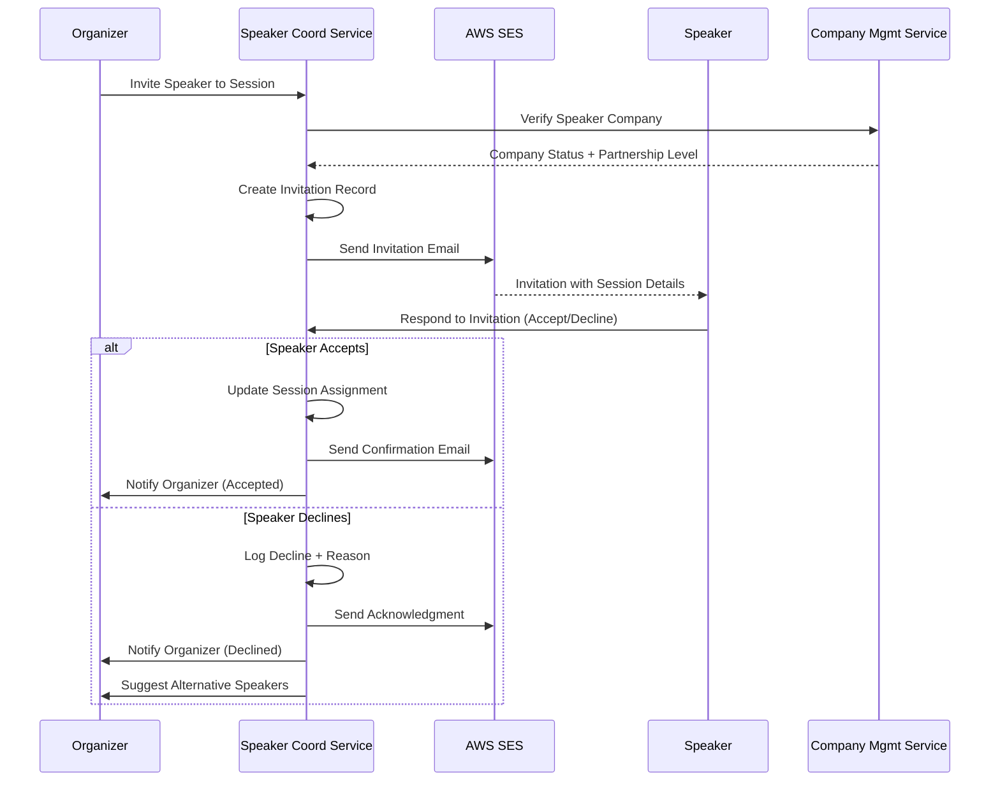

# Speaker Coordination API

This document outlines the Speaker Coordination Domain API, which handles speaker management with complex workflow states, slot preferences collection, material collection with quality control, and seamless coordination between organizers and speakers including waitlist management.

## Overview

The Speaker Coordination API provides endpoints for:
- Enhanced speaker profile and expertise management
- Slot preferences and technical requirements collection
- Content quality review workflow
- Speaker invitation workflow with enhanced context
- Speaker-session assignment with workflow states
- Presentation material upload with quality validation

## API Endpoints

### Speaker Management

#### List Speakers

```yaml
GET /api/v1/speakers
tags: [Speakers]
summary: List speakers
parameters:
  - name: companyId
    in: query
    schema:
      type: string
      format: uuid
  - name: expertiseArea
    in: query
    schema:
      type: string
  - name: availability
    in: query
    schema:
      $ref: '#/components/schemas/SpeakerAvailability'
responses:
  '200':
    description: List of speakers
    content:
      application/json:
        schema:
          type: array
          items:
            $ref: '#/components/schemas/Speaker'
```

### Speaker Preferences & Requirements

#### Get Speaker Slot Preferences

```yaml
GET /api/v1/speakers/{speakerId}/preferences
tags: [Speaker Preferences]
summary: Get speaker slot preferences
parameters:
  - name: speakerId
    in: path
    required: true
    schema:
      type: string
      format: uuid
  - name: eventId
    in: query
    schema:
      type: string
      format: uuid
responses:
  '200':
    description: Speaker preferences
    content:
      application/json:
        schema:
          $ref: '#/components/schemas/SpeakerSlotPreferences'
```

#### Submit Speaker Preferences

```yaml
POST /api/v1/speakers/{speakerId}/preferences
tags: [Speaker Preferences]
summary: Submit speaker preferences
security:
  - BearerAuth: [speaker]
parameters:
  - name: speakerId
    in: path
    required: true
    schema:
      type: string
      format: uuid
requestBody:
  required: true
  content:
    application/json:
      schema:
        $ref: '#/components/schemas/SubmitPreferencesRequest'
responses:
  '201':
    description: Preferences submitted
    content:
      application/json:
        schema:
          $ref: '#/components/schemas/SpeakerSlotPreferences'
```

#### Update Speaker Preferences

```yaml
PUT /api/v1/speakers/{speakerId}/preferences
tags: [Speaker Preferences]
summary: Update speaker preferences
security:
  - BearerAuth: [speaker]
parameters:
  - name: speakerId
    in: path
    required: true
    schema:
      type: string
      format: uuid
requestBody:
  required: true
  content:
    application/json:
      schema:
        $ref: '#/components/schemas/UpdatePreferencesRequest'
responses:
  '200':
    description: Preferences updated
    content:
      application/json:
        schema:
          $ref: '#/components/schemas/SpeakerSlotPreferences'
```

### Quality Review Workflow

#### Get Content Quality Review Status

```yaml
GET /api/v1/sessions/{sessionId}/quality-review
tags: [Quality Review]
summary: Get content quality review status
parameters:
  - name: sessionId
    in: path
    required: true
    schema:
      type: string
      format: uuid
responses:
  '200':
    description: Quality review status
    content:
      application/json:
        schema:
          $ref: '#/components/schemas/ContentQualityReview'
```

#### Submit Content for Review

```yaml
POST /api/v1/sessions/{sessionId}/quality-review
tags: [Quality Review]
summary: Submit content for review
security:
  - BearerAuth: [speaker]
parameters:
  - name: sessionId
    in: path
    required: true
    schema:
      type: string
      format: uuid
requestBody:
  required: true
  content:
    application/json:
      schema:
        $ref: '#/components/schemas/SubmitContentRequest'
responses:
  '201':
    description: Content submitted for review
    content:
      application/json:
        schema:
          $ref: '#/components/schemas/ContentQualityReview'
```

#### Update Review Status (Moderator)

```yaml
PUT /api/v1/sessions/{sessionId}/quality-review
tags: [Quality Review]
summary: Update review status (moderator)
security:
  - BearerAuth: [moderator]
parameters:
  - name: sessionId
    in: path
    required: true
    schema:
      type: string
      format: uuid
requestBody:
  required: true
  content:
    application/json:
      schema:
        $ref: '#/components/schemas/UpdateReviewRequest'
responses:
  '200':
    description: Review updated
    content:
      application/json:
        schema:
          $ref: '#/components/schemas/ContentQualityReview'
```

#### List Pending Reviews for Moderator

```yaml
GET /api/v1/moderators/{moderatorId}/reviews
tags: [Quality Review]
summary: List pending reviews for moderator
security:
  - BearerAuth: [moderator]
parameters:
  - name: moderatorId
    in: path
    required: true
    schema:
      type: string
      format: uuid
  - name: status
    in: query
    schema:
      $ref: '#/components/schemas/QualityReviewStatus'
  - name: eventId
    in: query
    schema:
      type: string
      format: uuid
responses:
  '200':
    description: List of reviews
    content:
      application/json:
        schema:
          type: array
          items:
            $ref: '#/components/schemas/ContentQualityReview'
```

## Core Workflows

### Speaker Invitation & Confirmation Workflow



## Schemas

### Speaker

```yaml
Speaker:
  type: object
  properties:
    id:
      type: string
      format: uuid
    email:
      type: string
      format: email
    firstName:
      type: string
    lastName:
      type: string
    companyId:
      type: string
      format: uuid
    position:
      type: string
    profile:
      $ref: 'common#/components/schemas/SpeakerProfile'
    availability:
      $ref: '#/components/schemas/SpeakerAvailability'
```

### Speaker Availability

```yaml
SpeakerAvailability:
  type: string
  enum:
    - available
    - busy
    - unavailable
    - invited
    - confirmed
    - declined
```

### Speaker Workflow State

```yaml
SpeakerWorkflowState:
  type: string
  enum:
    - open
    - contacted
    - ready
    - declined
    - accepted
    - slot_assigned
    - quality_reviewed
    - final_agenda
  description: |
    - open: Initial state, speaker identified but not yet contacted
    - contacted: Invitation sent to speaker
    - ready: Speaker confirmed availability and interest
    - declined: Speaker declined invitation
    - accepted: Speaker accepted invitation and confirmed participation
    - slot_assigned: Speaker assigned to specific time slot
    - quality_reviewed: Speaker's content passed quality review
    - final_agenda: Speaker finalized in published agenda
```

### Speaker Slot Preferences

```yaml
SpeakerSlotPreferences:
  type: object
  properties:
    speakerId:
      type: string
      format: uuid
    eventId:
      type: string
      format: uuid
    preferredTimeSlots:
      type: array
      items:
        type: object
        properties:
          startTime:
            type: string
            format: date-time
          endTime:
            type: string
            format: date-time
          preference:
            type: string
            enum: [preferred, acceptable, unavailable]
    technicalRequirements:
      type: object
      properties:
        requiresProjector:
          type: boolean
        requiresMicrophone:
          type: boolean
        requiresInternetConnection:
          type: boolean
        additionalNotes:
          type: string
          maxLength: 500
    accessibilityNeeds:
      type: object
      properties:
        wheelchairAccessible:
          type: boolean
        signLanguageInterpreter:
          type: boolean
        otherNeeds:
          type: string
          maxLength: 500
    dietaryRestrictions:
      type: string
      maxLength: 200
    submittedAt:
      type: string
      format: date-time
```

### Content Quality Review

```yaml
ContentQualityReview:
  type: object
  properties:
    id:
      type: string
      format: uuid
    sessionId:
      type: string
      format: uuid
    speakerId:
      type: string
      format: uuid
    status:
      $ref: '#/components/schemas/QualityReviewStatus'
    abstractReview:
      $ref: '#/components/schemas/AbstractReview'
    materialReview:
      $ref: '#/components/schemas/MaterialReview'
    submittedAt:
      type: string
      format: date-time
    reviewedAt:
      type: string
      format: date-time
    reviewerId:
      type: string
      format: uuid
    feedback:
      type: string
      maxLength: 2000
    revisionRequested:
      type: boolean
    revisionDeadline:
      type: string
      format: date-time

QualityReviewStatus:
  type: string
  enum:
    - pending
    - under_review
    - approved
    - requires_changes
    - rejected

AbstractReview:
  type: object
  properties:
    content:
      type: string
      maxLength: 1000
    characterCount:
      type: integer
    hasLessonsLearned:
      type: boolean
      description: Whether abstract includes lessons learned section
    hasProductPromotion:
      type: boolean
      description: Whether abstract appears to be product promotion
    meetsStandards:
      type: boolean
      description: Whether abstract meets BATbern quality standards

MaterialReview:
  type: object
  properties:
    presentationFileId:
      type: string
      format: uuid
    handoutsFileId:
      type: string
      format: uuid
    videoUrl:
      type: string
      format: uri
    documentLinks:
      type: array
      items:
        type: string
        format: uri
    completeness:
      type: string
      enum: [complete, partial, missing]
```

### Submit Preferences Request

```yaml
SubmitPreferencesRequest:
  type: object
  required:
    - eventId
    - preferredTimeSlots
  properties:
    eventId:
      type: string
      format: uuid
    preferredTimeSlots:
      type: array
      items:
        type: object
        properties:
          startTime:
            type: string
            format: date-time
          endTime:
            type: string
            format: date-time
          preference:
            type: string
            enum: [preferred, acceptable, unavailable]
    technicalRequirements:
      type: object
      properties:
        requiresProjector:
          type: boolean
        requiresMicrophone:
          type: boolean
        requiresInternetConnection:
          type: boolean
        additionalNotes:
          type: string
          maxLength: 500
    accessibilityNeeds:
      type: object
      properties:
        wheelchairAccessible:
          type: boolean
        signLanguageInterpreter:
          type: boolean
        otherNeeds:
          type: string
          maxLength: 500
    dietaryRestrictions:
      type: string
      maxLength: 200
```

### Submit Content Request

```yaml
SubmitContentRequest:
  type: object
  required:
    - abstract
  properties:
    abstract:
      type: string
      maxLength: 1000
      description: Session abstract with lessons learned (max 1000 characters)
    presentationFileId:
      type: string
      format: uuid
      description: File ID of uploaded presentation
    handoutsFileId:
      type: string
      format: uuid
      description: File ID of uploaded handouts
    videoUrl:
      type: string
      format: uri
      description: Optional video URL
    documentLinks:
      type: array
      items:
        type: string
        format: uri
      description: Additional document links
```

### Update Review Request

```yaml
UpdateReviewRequest:
  type: object
  required:
    - status
  properties:
    status:
      $ref: '#/components/schemas/QualityReviewStatus'
    feedback:
      type: string
      maxLength: 2000
      description: Moderator feedback to speaker
    abstractApproved:
      type: boolean
    materialsApproved:
      type: boolean
    revisionsRequired:
      type: array
      items:
        type: string
      description: List of required revisions
```

### Update Preferences Request

```yaml
UpdatePreferencesRequest:
  type: object
  properties:
    preferredTimeSlots:
      type: array
      items:
        type: object
        properties:
          startTime:
            type: string
            format: date-time
          endTime:
            type: string
            format: date-time
          preference:
            type: string
            enum: [preferred, acceptable, unavailable]
    technicalRequirements:
      type: object
      properties:
        requiresProjector:
          type: boolean
        requiresMicrophone:
          type: boolean
        requiresInternetConnection:
          type: boolean
        additionalNotes:
          type: string
          maxLength: 500
    accessibilityNeeds:
      type: object
      properties:
        wheelchairAccessible:
          type: boolean
        signLanguageInterpreter:
          type: boolean
        otherNeeds:
          type: string
          maxLength: 500
    dietaryRestrictions:
      type: string
      maxLength: 200
```

## Speaker Workflow States

The Speaker Coordination API manages an 8-state progression for speaker management:

1. **Open** → Speaker identified but not yet contacted
2. **Contacted** → Invitation sent to speaker
3. **Ready** → Speaker confirmed availability and interest
4. **Declined/Accepted** → Speaker responded to invitation
5. **Slot Assigned** → Speaker assigned to specific time slot
6. **Quality Reviewed** → Speaker's content passed quality review
7. **Final Agenda** → Speaker finalized in published agenda

### State Transition Rules

- **Open → Contacted**: When organizer sends invitation
- **Contacted → Ready**: When speaker confirms interest
- **Contacted → Declined**: When speaker declines invitation
- **Ready → Accepted**: When speaker formally accepts participation
- **Accepted → Slot Assigned**: When organizer assigns speaker to slot
- **Slot Assigned → Quality Reviewed**: When speaker submits content and passes review
- **Quality Reviewed → Final Agenda**: When event workflow reaches publication state

### Overflow Handling

When accepted speakers exceed available slots:
- Speakers remain in **Ready** state
- Marked as overflow speakers
- Subject to organizer voting
- Automatically promoted on speaker dropouts
