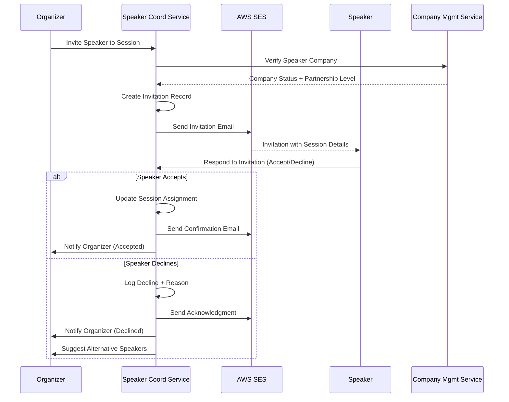

# Speaker Coordination API

**Last Updated**: 2026-05-15
**ADR References**:
- [ADR-003: Meaningful Identifiers in Public APIs](./ADR-003-meaningful-identifiers-public-apis.md)
- [ADR-004: Factor User Fields from Domain Entities](./ADR-004-factor-user-fields-from-domain-entities.md)
- [ADR-009: Unified Speaker Workflow](./ADR-009-unified-speaker-workflow.md)

**Important** (per ADR-009 + ADR-004): A "speaker" is a **User with the SPEAKER role** — there is no separate `Speaker` entity, no `speakers` table, no `SpeakerRepository`. API responses combine `user_profiles` data + `speaker_pool` (per-event) data via HTTP enrichment (`UserApiClient`) — never via JPQL joins across services. Authentication for every speaker-portal endpoint is **standard AWS Cognito Bearer** with `hasRole('SPEAKER')` — no `?token=` query auth, no magic-link login, no parallel JWT stack.

This document describes the Speaker Coordination Domain API: per-event speaker pool management, content submission (organizer-on-behalf and speaker-self), quality review, and the 8-state workflow transitions defined in ADR-009.

## Overview

The Speaker Coordination API provides endpoints for:
- Per-event speaker pool management (`speaker_pool` rows, one per `{event, candidate}` pair)
- The unified 8-state speaker workflow per ADR-009 (IDENTIFIED → CONTACTED → READY → INVITED → ACCEPTED → CONTENT_SUBMITTED → QUALITY_REVIEWED; DECLINED from any non-terminal state)
- Organizer-initiated `CONTACTED → READY` promotion (provisions User + Cognito + SPEAKER role)
- Slot preferences and technical requirements collection
- Content quality review workflow (organizer moderator)
- Presentation material upload with quality validation (shared `ContentSubmissionService` used by organizer-on-behalf and speaker-self endpoints)

## API Endpoints

### Speaker Management

#### List Speakers

```yaml
GET /api/v1/speakers
tags: [Speakers]
summary: List speakers (users with SPEAKER role)
description: |
  Per ADR-009 §0.3, the legacy `Speaker` and `SpeakerAvailability` schemas are deleted.
  This endpoint is redesigned to return User+SPEAKER role projections, filterable by
  company. Legacy filters (`expertiseArea`, `availability`) referenced fields on the
  removed Speaker entity and are not available. The exact response shape is finalised
  by Epic 11 stories 11.C.1 / 11.C.2 — until then, treat this signature as provisional.
parameters:
  - name: companyName
    in: query
    schema:
      type: string

      description: Meaningful identifier (see ADR-003)
responses:
  '200':
    description: List of users with the SPEAKER role
    content:
      application/json:
        schema:
          type: array
          items:
            type: object
            properties:
              username:
                type: string
                description: Meaningful identifier (see ADR-003)
              email:
                type: string
                format: email
              firstName:
                type: string
              lastName:
                type: string
              companyName:
                type: string
              bio:
                type: string
                description: Short CV (per ADR-004 / ADR-009)
              profilePictureUrl:
                type: string
                description: Portrait (per ADR-004 / ADR-009)
```

### Speaker Preferences & Requirements

#### Get Speaker Slot Preferences

```yaml
GET /api/v1/speakers/{username}/preferences
tags: [Speaker Preferences]
summary: Get speaker slot preferences
parameters:
  - name: username
    in: path
    required: true
    schema:
      type: string

      description: Meaningful identifier (see ADR-003)
  - name: eventCode
    in: query
    schema:
      type: string

      description: Meaningful identifier (see ADR-003)
responses:
  '200':
    description: Speaker preferences
    content:
      application/json:
        schema:
          $ref: '#/components/schemas/SpeakerSlotPreferences'
```

#### Submit Speaker Preferences

```yaml
POST /api/v1/speakers/{username}/preferences
tags: [Speaker Preferences]
summary: Submit speaker preferences
security:
  - BearerAuth: [speaker]
parameters:
  - name: username
    in: path
    required: true
    schema:
      type: string

      description: Meaningful identifier (see ADR-003)
requestBody:
  required: true
  content:
    application/json:
      schema:
        $ref: '#/components/schemas/SubmitPreferencesRequest'
responses:
  '201':
    description: Preferences submitted
    content:
      application/json:
        schema:
          $ref: '#/components/schemas/SpeakerSlotPreferences'
```

#### Update Speaker Preferences

```yaml
PUT /api/v1/speakers/{username}/preferences
tags: [Speaker Preferences]
summary: Update speaker preferences
security:
  - BearerAuth: [speaker]
parameters:
  - name: username
    in: path
    required: true
    schema:
      type: string

      description: Meaningful identifier (see ADR-003)
requestBody:
  required: true
  content:
    application/json:
      schema:
        $ref: '#/components/schemas/UpdatePreferencesRequest'
responses:
  '200':
    description: Preferences updated
    content:
      application/json:
        schema:
          $ref: '#/components/schemas/SpeakerSlotPreferences'
```

### Speaker Workflow Transitions (per ADR-009)

#### Promote Speaker (CONTACTED → READY)

```yaml
POST /api/v1/events/{eventCode}/speakers/{speakerId}/promote
tags: [Speaker Workflow]
summary: |
  Promote a brainstormed candidate from CONTACTED to READY. This is the
  provisioning gate per ADR-009 §0.2 — it triggers User lookup-or-create,
  Cognito AdminCreateUser (FORCE_CHANGE_PASSWORD), SPEAKER role grant in
  role_assignments, and persisting username on speaker_pool.
security:
  - BearerAuth: [organizer]
parameters:
  - name: eventCode
    in: path
    required: true
    schema:
      type: string
    description: Meaningful identifier (e.g., BATbern57)
  - name: speakerId
    in: path
    required: true
    schema:
      type: string
      format: uuid
    description: speaker_pool.id
requestBody:
  required: true
  content:
    application/json:
      schema:
        type: object
        required: [email]
        properties:
          email:
            type: string
            format: email
            description: |
              REQUIRED. The real speaker's email. Used as the Cognito username
              and the recipient of the invitation email.
          firstName:
            type: string
          lastName:
            type: string
responses:
  '200':
    description: |
      Speaker promoted. speaker_pool.status is now READY. A PRIMARY_SPEAKER
      session_users row exists with the canonical username (post Story 11.E.9 /
      V103 — speaker_pool.username column was dropped, identity lives on
      session_users). Cognito user exists with FORCE_CHANGE_PASSWORD. SPEAKER
      role granted. Idempotent — re-calling for an already-promoted speaker
      returns 200 with no side effects.
    content:
      application/json:
        schema:
          $ref: '#/components/schemas/SpeakerPool'
  '400':
    description: |
      Bad request. Returned when the email field is missing or blank. The
      CONTACTED → READY transition requires an email per ADR-009 §0.2.
  '404':
    description: speaker_pool row not found for the given speakerId
  '409':
    description: |
      Conflict — the speaker is already in a state at or past READY (READY,
      INVITED, ACCEPTED, CONTENT_SUBMITTED, QUALITY_REVIEWED). To re-attempt
      provisioning for a DECLINED candidate, create a new speaker_pool row.
```

#### Update Speaker Status

```yaml
PUT /api/v1/events/{eventCode}/speakers/{speakerId}/status
tags: [Speaker Workflow]
summary: |
  Transition speaker_pool.status. Routes through SpeakerWorkflowService.transition()
  which is the sole writer of speaker_pool.status (ADR-009 §Decision 1). The
  target value must be one of the 8 allowed states; the (current, target) pair
  must be in the allow-list.
security:
  - BearerAuth: [organizer]
parameters:
  - name: eventCode
    in: path
    required: true
    schema:
      type: string
  - name: speakerId
    in: path
    required: true
    schema:
      type: string
      format: uuid
requestBody:
  required: true
  content:
    application/json:
      schema:
        type: object
        required: [targetStatus]
        properties:
          targetStatus:
            $ref: '#/components/schemas/SpeakerWorkflowState'
            description: |
              MUST be one of: CONTACTED, INVITED, ACCEPTED,
              CONTENT_SUBMITTED, QUALITY_REVIEWED, DECLINED.
              IDENTIFIED is the initial state — speakers are never transitioned
              back to IDENTIFIED, so it is not a valid `targetStatus`.
              READY is NOT accepted here — use POST /promote instead.
          reason:
            type: string
            description: Free text — recorded in status_history. Required for transitions to DECLINED from INVITED or later.
responses:
  '200':
    description: Transition applied. New status and audit row written.
    content:
      application/json:
        schema:
          $ref: '#/components/schemas/SpeakerPool'
  '400':
    description: |
      Bad request. Returned for any of:
      - `targetStatus` is one of the removed values (SLOT_ASSIGNED, CONFIRMED,
        OVERFLOW, WITHDREW, TENTATIVE) — these states no longer exist per
        ADR-009.
      - `targetStatus` is READY — use POST /promote instead (READY requires the
        provisioning side-effect hook).
      - `(currentStatus, targetStatus)` is not in the allow-list.
      - `targetStatus` is INVITED but the slot-capacity gate
        (accepted + invited >= max_slots) is violated.
      - `reason` is missing for a DECLINED transition from INVITED or later.
  '404':
    description: speaker_pool row not found
  '409':
    description: Concurrent transition — the current status changed between read and write.
```

> **Removed endpoints (per ADR-009 §3):**
> - `POST /api/v1/auth/speaker-magic-login` — magic-link auth deleted.
> - `POST /api/v1/speaker-portal/validate-token` — opaque-token validation deleted.
> - Any `?token=` or `?jwt=` query auth on speaker-portal routes — replaced by Cognito Bearer.

### Quality Review Workflow

#### Get Content Quality Review Status

```yaml
GET /api/v1/sessions/{sessionId}/quality-review
tags: [Quality Review]
summary: Get content quality review status
parameters:
  - name: sessionId
    in: path
    required: true
    schema:
      type: string

      description: Meaningful identifier (see ADR-003)
responses:
  '200':
    description: Quality review status
    content:
      application/json:
        schema:
          $ref: '#/components/schemas/ContentQualityReview'
```

#### Submit Content for Review

```yaml
POST /api/v1/sessions/{sessionId}/quality-review
tags: [Quality Review]
summary: Submit content for review
security:
  - BearerAuth: [speaker]
parameters:
  - name: sessionId
    in: path
    required: true
    schema:
      type: string

      description: Meaningful identifier (see ADR-003)
requestBody:
  required: true
  content:
    application/json:
      schema:
        $ref: '#/components/schemas/SubmitContentRequest'
responses:
  '201':
    description: Content submitted for review
    content:
      application/json:
        schema:
          $ref: '#/components/schemas/ContentQualityReview'
```

#### Update Review Status (Moderator)

```yaml
PUT /api/v1/sessions/{sessionId}/quality-review
tags: [Quality Review]
summary: Update review status (moderator)
security:
  - BearerAuth: [moderator]
parameters:
  - name: sessionId
    in: path
    required: true
    schema:
      type: string

      description: Meaningful identifier (see ADR-003)
requestBody:
  required: true
  content:
    application/json:
      schema:
        $ref: '#/components/schemas/UpdateReviewRequest'
responses:
  '200':
    description: Review updated
    content:
      application/json:
        schema:
          $ref: '#/components/schemas/ContentQualityReview'
```

#### List Pending Reviews for Moderator

```yaml
GET /api/v1/moderators/{moderatorId}/reviews
tags: [Quality Review]
summary: List pending reviews for moderator
security:
  - BearerAuth: [moderator]
parameters:
  - name: moderatorId
    in: path
    required: true
    schema:
      type: string

      description: Meaningful identifier (see ADR-003)
  - name: status
    in: query
    schema:
      $ref: '#/components/schemas/QualityReviewStatus'
  - name: eventCode
    in: query
    schema:
      type: string

      description: Meaningful identifier (see ADR-003)
responses:
  '200':
    description: List of reviews
    content:
      application/json:
        schema:
          type: array
          items:
            $ref: '#/components/schemas/ContentQualityReview'
```

## Core Workflows

### Speaker Invitation & Confirmation Workflow


```mermaid
sequenceDiagram
    participant O as Organizer
    participant SC as Speaker Coord Service
    participant Email as AWS SES
    participant S as Speaker
    participant CM as Company Mgmt Service

    O->>SC: Invite Speaker to Session
    SC->>CM: Verify Speaker Company
    CM-->>SC: Company Status + Partnership Level

    SC->>SC: Create Invitation Record
    SC->>Email: Send Invitation Email
    Email-->>S: Invitation with Session Details

    S->>SC: Respond to Invitation (Accept/Decline)

    alt Speaker Accepts
        SC->>SC: Update Session Assignment
        SC->>Email: Send Confirmation Email
        SC->>O: Notify Organizer (Accepted)
    else Speaker Declines
        SC->>SC: Log Decline + Reason
        SC->>Email: Send Acknowledgment
        SC->>O: Notify Organizer (Declined)
        SC->>O: Suggest Alternative Speakers
    end
```

## Schemas

### SpeakerPool

**ADR-009 + ADR-004 Note**: There is no `Speaker` entity. The per-event speaker record is a `speaker_pool` row that references User via `username` (meaningful ID per ADR-003). API responses combine `speaker_pool` data with User profile data via **HTTP enrichment** (`UserApiClient.getUserByUsername(...)`) — never via JPQL joins across services.

```yaml
SpeakerPool:
  type: object
  description: |
    A speaker_pool row represents the participation of a candidate User in
    a specific event's speaker workflow. One row per {event, candidate} pair.
    Combines user_profiles data (via HTTP enrichment) with per-event state.
  properties:
    id:
      type: string
      format: uuid
      description: speaker_pool primary key
    eventCode:
      type: string
      description: Meaningful identifier for the event (ADR-003)
      example: BATbern57

    # Cross-service reference to User (NULL before CONTACTED → READY provisioning)
    username:
      type: string
      nullable: true
      description: |
        Cross-service reference to users.username (ADR-003). NULL while
        speaker_pool.status is IDENTIFIED or CONTACTED (before the
        CONTACTED → READY provisioning gate). Populated from that point on.
      example: john.doe

    # User-profile fields enriched via HTTP (only populated when username != null)
    email:
      type: string
      format: email
      description: From user_profiles (HTTP enrichment via UserApiClient)
    firstName:
      type: string
      description: From user_profiles (HTTP enrichment)
    lastName:
      type: string
      description: From user_profiles (HTTP enrichment)
    bio:
      type: string
      description: From user_profiles.bio (short CV, per ADR-004)
    profilePictureUrl:
      type: string
      format: uri
      description: From user_profiles.profile_picture_url (speaker portrait, per ADR-004)
    companyName:
      type: string
      description: From user_profiles.company_id (company name, ADR-003)

    # Per-event workflow state
    status:
      $ref: '#/components/schemas/SpeakerWorkflowState'
    sessionId:
      type: string
      format: uuid
      nullable: true
      description: FK to sessions table (same service). Determines is_slot_assigned.

    # Derived (read-time) flags — NOT persisted columns
    isSlotAssigned:
      type: boolean
      readOnly: true
      description: |
        Derived predicate (per ADR-009 §0.1): session.start_time IS NOT NULL.
        Computed at read time from the linked session.
    isPublishable:
      type: boolean
      readOnly: true
      description: |
        Derived predicate (per ADR-009 §0.1): status = QUALITY_REVIEWED AND
        isSlotAssigned. The gate for the AGENDA_PUBLISHED event-workflow transition.

    createdAt:
      type: string
      format: date-time
    updatedAt:
      type: string
      format: date-time
```

> **Removed fields (per ADR-009 §0.3):** `availability`, `expertiseAreas`, `speakingTopics`, `linkedInUrl`, `twitterHandle`, `certifications`, `languages`, `speakingHistory`, `communicationPreferences`. These previously lived on a separate `speakers` table that is deleted. They are not migrated to `user_profiles` and not retained anywhere — the platform does not use them in any production flow.

### Speaker Workflow State

```yaml
SpeakerWorkflowState:
  type: string
  enum:
    - IDENTIFIED
    - CONTACTED
    - READY
    - INVITED
    - ACCEPTED
    - CONTENT_SUBMITTED
    - QUALITY_REVIEWED
    - DECLINED
  description: |
    The 8-state speaker workflow per ADR-009 §0.1. **All eight values are valid as a
    read/response state** (the `status` field returned by GET endpoints). When used as a
    write `targetStatus` on `PUT /status`, the valid subset is narrower: IDENTIFIED is
    the initial state and not a transition target, and READY uses the `POST /promote`
    endpoint (which carries the provisioning side-effect hook). See the `PUT /status`
    endpoint description for the exact write-allow-list and the slot-capacity gate that
    applies at `READY → INVITED`.

    - IDENTIFIED:        Name on the brainstorm list. No User, no email sent.
    - CONTACTED:         Organizer is reaching out — still brainstorming. No User, no email sent.
                          OutreachHistory rows log conversations.
    - READY:             Real speaker chosen. User + Cognito user provisioned via the
                          CONTACTED → READY provisioning hook. username populated.
                          (Use POST /promote, not PUT /status, to reach this state.)
    - INVITED:           Invitation email sent. Slot-capacity gate enforced at READY → INVITED.
    - ACCEPTED:          Speaker committed via portal (or organizer-on-behalf).
    - CONTENT_SUBMITTED: Title + abstract submitted (with optional bio/portrait/presentation).
    - QUALITY_REVIEWED:  Moderator approved content. Terminal happy state. Combined
                          with is_slot_assigned → is_publishable.
    - DECLINED:          Terminal "not happening" state. Reachable from every
                          non-terminal state. Reason recorded in status_history.

    REMOVED states (per ADR-009 §0.7) — these values are rejected with HTTP 400:
    - SLOT_ASSIGNED: replaced by derived isSlotAssigned predicate.
    - CONFIRMED:     replaced by derived isPublishable predicate.
    - OVERFLOW:      replaced by slot-capacity gate at READY → INVITED.
    - WITHDREW:      collapsed into DECLINED with a reason.
    - TENTATIVE:     removed; speakers respond ACCEPT or DECLINE only.
```

### Speaker Slot Preferences

```yaml
SpeakerSlotPreferences:
  type: object
  properties:
    username:
      type: string

      description: Meaningful identifier (see ADR-003)
    eventCode:
      type: string

      description: Meaningful identifier (see ADR-003)
    preferredTimeSlots:
      type: array
      items:
        type: object
        properties:
          startTime:
            type: string
            format: date-time
          endTime:
            type: string
            format: date-time
          preference:
            type: string
            enum: [preferred, acceptable, unavailable]
    technicalRequirements:
      type: object
      properties:
        requiresProjector:
          type: boolean
        requiresMicrophone:
          type: boolean
        requiresInternetConnection:
          type: boolean
        additionalNotes:
          type: string
          maxLength: 500
    accessibilityNeeds:
      type: object
      properties:
        wheelchairAccessible:
          type: boolean
        signLanguageInterpreter:
          type: boolean
        otherNeeds:
          type: string
          maxLength: 500
    dietaryRestrictions:
      type: string
      maxLength: 200
    submittedAt:
      type: string
      format: date-time
```

### Content Quality Review

```yaml
ContentQualityReview:
  type: object
  properties:
    id:
      type: string

      description: Meaningful identifier (see ADR-003)
    sessionId:
      type: string

      description: Meaningful identifier (see ADR-003)
    username:
      type: string

      description: Meaningful identifier (see ADR-003)
    status:
      $ref: '#/components/schemas/QualityReviewStatus'
    abstractReview:
      $ref: '#/components/schemas/AbstractReview'
    materialReview:
      $ref: '#/components/schemas/MaterialReview'
    submittedAt:
      type: string
      format: date-time
    reviewedAt:
      type: string
      format: date-time
    reviewerId:
      type: string

      description: Meaningful identifier (see ADR-003)
    feedback:
      type: string
      maxLength: 2000
    revisionRequested:
      type: boolean
    revisionDeadline:
      type: string
      format: date-time

QualityReviewStatus:
  type: string
  enum:
    - pending
    - under_review
    - approved
    - requires_changes
    - rejected

AbstractReview:
  type: object
  properties:
    content:
      type: string
      maxLength: 1000
    characterCount:
      type: integer
    hasLessonsLearned:
      type: boolean
      description: Whether abstract includes lessons learned section
    hasProductPromotion:
      type: boolean
      description: Whether abstract appears to be product promotion
    meetsStandards:
      type: boolean
      description: Whether abstract meets BATbern quality standards

MaterialReview:
  type: object
  properties:
    presentationFileId:
      type: string

      description: Meaningful identifier (see ADR-003)
    handoutsFileId:
      type: string

      description: Meaningful identifier (see ADR-003)
    videoUrl:
      type: string
      format: uri
    documentLinks:
      type: array
      items:
        type: string
        format: uri
    completeness:
      type: string
      enum: [complete, partial, missing]
```

### Submit Preferences Request

```yaml
SubmitPreferencesRequest:
  type: object
  required:
    - eventId
    - preferredTimeSlots
  properties:
    eventCode:
      type: string

      description: Meaningful identifier (see ADR-003)
    preferredTimeSlots:
      type: array
      items:
        type: object
        properties:
          startTime:
            type: string
            format: date-time
          endTime:
            type: string
            format: date-time
          preference:
            type: string
            enum: [preferred, acceptable, unavailable]
    technicalRequirements:
      type: object
      properties:
        requiresProjector:
          type: boolean
        requiresMicrophone:
          type: boolean
        requiresInternetConnection:
          type: boolean
        additionalNotes:
          type: string
          maxLength: 500
    accessibilityNeeds:
      type: object
      properties:
        wheelchairAccessible:
          type: boolean
        signLanguageInterpreter:
          type: boolean
        otherNeeds:
          type: string
          maxLength: 500
    dietaryRestrictions:
      type: string
      maxLength: 200
```

### Submit Content Request

```yaml
SubmitContentRequest:
  type: object
  required:
    - abstract
  properties:
    abstract:
      type: string
      maxLength: 1000
      description: Session abstract with lessons learned (max 1000 characters)
    presentationFileId:
      type: string

      description: Meaningful identifier (see ADR-003)
      description: File ID of uploaded presentation
    handoutsFileId:
      type: string

      description: Meaningful identifier (see ADR-003)
      description: File ID of uploaded handouts
    videoUrl:
      type: string
      format: uri
      description: Optional video URL
    documentLinks:
      type: array
      items:
        type: string
        format: uri
      description: Additional document links
```

### Update Review Request

```yaml
UpdateReviewRequest:
  type: object
  required:
    - status
  properties:
    status:
      $ref: '#/components/schemas/QualityReviewStatus'
    feedback:
      type: string
      maxLength: 2000
      description: Moderator feedback to speaker
    abstractApproved:
      type: boolean
    materialsApproved:
      type: boolean
    revisionsRequired:
      type: array
      items:
        type: string
      description: List of required revisions
```

### Update Preferences Request

```yaml
UpdatePreferencesRequest:
  type: object
  properties:
    preferredTimeSlots:
      type: array
      items:
        type: object
        properties:
          startTime:
            type: string
            format: date-time
          endTime:
            type: string
            format: date-time
          preference:
            type: string
            enum: [preferred, acceptable, unavailable]
    technicalRequirements:
      type: object
      properties:
        requiresProjector:
          type: boolean
        requiresMicrophone:
          type: boolean
        requiresInternetConnection:
          type: boolean
        additionalNotes:
          type: string
          maxLength: 500
    accessibilityNeeds:
      type: object
      properties:
        wheelchairAccessible:
          type: boolean
        signLanguageInterpreter:
          type: boolean
        otherNeeds:
          type: string
          maxLength: 500
    dietaryRestrictions:
      type: string
      maxLength: 200
```

## Speaker Workflow States

The Speaker Coordination API manages the unified 8-state speaker workflow per **ADR-009**:

1. **IDENTIFIED** → Name on the brainstorm list. No User row, no email sent yet.
2. **CONTACTED** → Organizer is reaching out (still brainstorming). `OutreachHistory` rows track conversations. No User row, no email sent yet.
3. **READY** → Real speaker chosen. The `CONTACTED → READY` transition provisions a User + Cognito user (`FORCE_CHANGE_PASSWORD`) and grants the SPEAKER role. Use `POST /api/v1/events/{eventCode}/speakers/{speakerId}/promote` — not `PUT /status` — to reach this state.
4. **INVITED** → Formal invitation email sent (login URL + temporary password). Slot-capacity gate enforced.
5. **ACCEPTED** → Speaker committed (via speaker portal or organizer-on-behalf).
6. **CONTENT_SUBMITTED** → Title + abstract submitted (optionally with bio/portrait/presentation).
7. **QUALITY_REVIEWED** → Moderator approved content. Terminal happy state.
8. **DECLINED** → Terminal "not happening" state. Reachable from every non-terminal state. Reason recorded in `status_history`.

### State Transition Rules (allow-list)

| From | Allowed targets |
|---|---|
| IDENTIFIED | CONTACTED, DECLINED |
| CONTACTED | READY (via `POST /promote`), DECLINED |
| READY | INVITED (slot-capacity gate), DECLINED |
| INVITED | ACCEPTED, DECLINED |
| ACCEPTED | CONTENT_SUBMITTED, DECLINED |
| CONTENT_SUBMITTED | QUALITY_REVIEWED, DECLINED |
| QUALITY_REVIEWED | DECLINED |
| DECLINED | (terminal — no transitions out) |

**Critical preconditions:**
- **`CONTACTED → READY`** REQUIRES an email payload. This is the provisioning gate (ADR-009 §0.2) — the transition creates the Cognito user and grants the SPEAKER role. Use `POST /api/v1/events/{eventCode}/speakers/{speakerId}/promote`, not `PUT /status` with `targetStatus=READY` (the latter returns 400).
- **`READY → INVITED`** is blocked when `(count(ACCEPTED) + count(INVITED)) >= max_slots` for the event. Organizers cannot oversubscribe.
- **Post-acceptance `DECLINED`** (from INVITED, ACCEPTED, CONTENT_SUBMITTED, or QUALITY_REVIEWED) REQUIRES a `reason` field. The audit trail (previous state + reason) replaces what a separate `WITHDREW` state used to encode.

### Capacity Handling (replaces legacy "Overflow Handling")

Capacity is enforced at invitation time. There is **no overflow state, no parking lane, no voting flow**. The slot-capacity gate at `READY → INVITED` blocks further invitations once `(accepted + invited) >= max_slots`. If an invited speaker declines, the next speaker in `READY` becomes eligible for `INVITED`. If too many speakers accept (e.g., capacity is reduced after invitations went out), the organizer manually moves the excess to `DECLINED` with a clear reason.

Per ADR-009 §0.7, `OverflowManagementService`, the `speaker_selection_votes` table, and all overflow voting UI have been removed.
