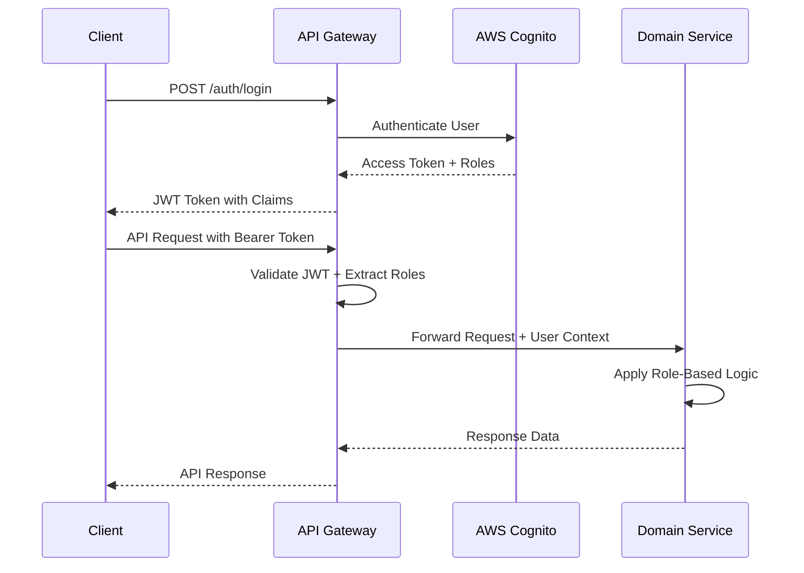
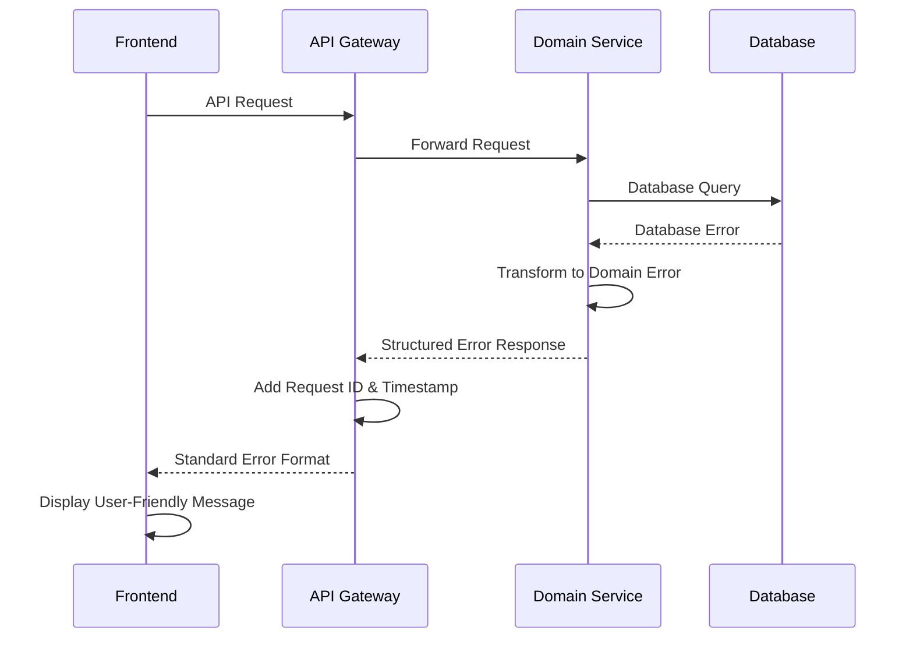
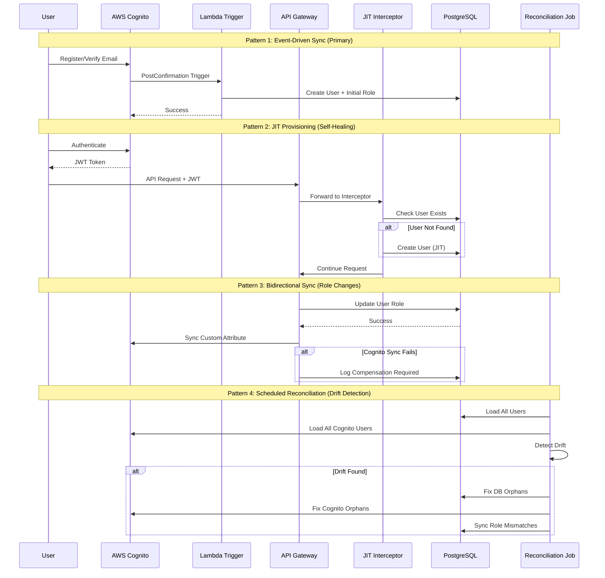

# Backend Architecture

This document outlines the comprehensive backend architecture for the BATbern Event Management Platform, including service patterns, authentication, authorization, and error handling strategies.

## Service Architecture Pattern

```
services/{domain-service}/
├── src/main/java/ch/batbern/{domain}/
│   ├── controller/                     # REST API controllers
│   ├── service/                        # Business logic layer
│   ├── repository/                     # Data access layer
│   ├── domain/                         # Domain models and entities
│   ├── dto/                           # Data transfer objects
│   ├── exception/                     # Custom exceptions
│   └── security/                      # Security components
├── src/main/resources/
│   ├── application.yml                # Configuration
│   └── db/migration/                  # Flyway migrations
└── build.gradle                      # Build configuration
```

## Authentication and Authorization

### JWT Authentication Flow



### Role-Based Security Configuration

```java
@Configuration
@EnableWebSecurity
@EnableMethodSecurity(prePostEnabled = true)
public class SecurityConfiguration {

    @Bean
    public SecurityFilterChain filterChain(HttpSecurity http) throws Exception {
        return http
            .csrf(csrf -> csrf.disable())
            .sessionManagement(session -> session.sessionCreationPolicy(SessionCreationPolicy.STATELESS))
            .authorizeHttpRequests(auth -> auth
                .requestMatchers("/actuator/health", "/actuator/info").permitAll()
                .requestMatchers("/api/v1/events").hasAnyRole("ORGANIZER", "ATTENDEE", "SPEAKER", "PARTNER")
                .requestMatchers(HttpMethod.POST, "/api/v1/events").hasRole("ORGANIZER")
                .requestMatchers("/api/v1/speakers/**").hasAnyRole("ORGANIZER", "SPEAKER")
                .requestMatchers("/api/v1/partners/**").hasAnyRole("ORGANIZER", "PARTNER")
                .requestMatchers("/api/v1/companies").hasAnyRole("ORGANIZER", "SPEAKER", "PARTNER")
                .anyRequest().authenticated()
            )
            .oauth2ResourceServer(oauth2 -> oauth2
                .jwt(jwt -> jwt
                    .jwtAuthenticationConverter(jwtAuthenticationConverter())
                    .jwtDecoder(jwtDecoder())
                )
            )
            .build();
    }

    @Bean
    public JwtAuthenticationConverter jwtAuthenticationConverter() {
        JwtGrantedAuthoritiesConverter authoritiesConverter = new JwtGrantedAuthoritiesConverter();
        authoritiesConverter.setAuthorityPrefix("ROLE_");
        authoritiesConverter.setAuthoritiesClaimName("cognito:groups");

        JwtAuthenticationConverter authenticationConverter = new JwtAuthenticationConverter();
        authenticationConverter.setJwtGrantedAuthoritiesConverter(authoritiesConverter);
        return authenticationConverter;
    }
}
```

### User Context Management

```java
@Component
public class SecurityContextHelper {

    public UserContext getCurrentUser() {
        Authentication authentication = SecurityContextHolder.getContext().getAuthentication();

        if (authentication instanceof JwtAuthenticationToken) {
            JwtAuthenticationToken jwtToken = (JwtAuthenticationToken) authentication;
            Map<String, Object> claims = jwtToken.getToken().getClaims();

            return UserContext.builder()
                .userId(claims.get("sub").toString())
                .email(claims.get("email").toString())
                .roles(extractRoles(jwtToken.getAuthorities()))
                .organizationId(claims.get("custom:organization_id"))
                .build();
        }

        throw new SecurityException("No valid authentication context found");
    }

    public boolean hasRole(String role) {
        return getCurrentUser().getRoles().contains(role);
    }

    public boolean isOrganizer() {
        return hasRole("ORGANIZER");
    }

    public boolean canAccessCompany(String companyId) {
        UserContext user = getCurrentUser();
        return user.isOrganizer() || user.getOrganizationId().equals(companyId);
    }
}
```

## Error Handling Strategy

### Error Flow



### Error Response Format

```typescript
interface ApiError {
  error: {
    code: string;
    message: string;
    details?: Record<string, any>;
    timestamp: string;
    requestId: string;
    path: string;
    severity: string;
  };
}
```

### Comprehensive Exception Hierarchy

```java
// Base domain exception
public abstract class BATbernException extends RuntimeException {
    private final String errorCode;
    private final Map<String, Object> details;
    private final Severity severity;

    public BATbernException(String errorCode, String message, Map<String, Object> details, Severity severity) {
        super(message);
        this.errorCode = errorCode;
        this.details = details != null ? details : new HashMap<>();
        this.severity = severity;
    }

    public enum Severity {
        LOW, MEDIUM, HIGH, CRITICAL
    }
}

// Domain-specific exceptions
@ResponseStatus(HttpStatus.NOT_FOUND)
public class EventNotFoundException extends BATbernException {
    public EventNotFoundException(String eventId) {
        super("EVENT_NOT_FOUND",
              "Event with ID " + eventId + " not found",
              Map.of("eventId", eventId),
              Severity.MEDIUM);
    }
}

@ResponseStatus(HttpStatus.BAD_REQUEST)
public class InvalidEventStateException extends BATbernException {
    public InvalidEventStateException(String eventId, String currentState, String attemptedTransition) {
        super("INVALID_EVENT_STATE_TRANSITION",
              String.format("Cannot transition event %s from %s to %s", eventId, currentState, attemptedTransition),
              Map.of("eventId", eventId, "currentState", currentState, "attemptedTransition", attemptedTransition),
              Severity.HIGH);
    }
}

@ResponseStatus(HttpStatus.CONFLICT)
public class SpeakerAlreadyInvitedException extends BATbernException {
    public SpeakerAlreadyInvitedException(String speakerId, String eventId) {
        super("SPEAKER_ALREADY_INVITED",
              "Speaker is already invited to this event",
              Map.of("speakerId", speakerId, "eventId", eventId),
              Severity.LOW);
    }
}

@ResponseStatus(HttpStatus.UNPROCESSABLE_ENTITY)
public class BusinessValidationException extends BATbernException {
    public BusinessValidationException(String field, String violatedRule, Object value) {
        super("BUSINESS_VALIDATION_FAILED",
              String.format("Business rule validation failed for field '%s': %s", field, violatedRule),
              Map.of("field", field, "rule", violatedRule, "value", value),
              Severity.MEDIUM);
    }
}

@ResponseStatus(HttpStatus.TOO_MANY_REQUESTS)
public class RateLimitExceededException extends BATbernException {
    public RateLimitExceededException(String endpoint, int limit, int windowSeconds) {
        super("RATE_LIMIT_EXCEEDED",
              String.format("Rate limit exceeded for endpoint %s: %d requests per %d seconds", endpoint, limit, windowSeconds),
              Map.of("endpoint", endpoint, "limit", limit, "windowSeconds", windowSeconds),
              Severity.MEDIUM);
    }
}
```

### Global Exception Handler

```java
@ControllerAdvice
@Slf4j
public class GlobalExceptionHandler {

    private final ErrorMessageResolver messageResolver;
    private final MetricRegistry metricRegistry;

    @ExceptionHandler(BATbernException.class)
    public ResponseEntity<ErrorResponse> handleBATbernException(BATbernException ex, HttpServletRequest request) {
        String requestId = RequestContext.getCurrentRequestId();

        // Log with appropriate level based on severity
        logException(ex, requestId, request);

        // Increment error metrics
        metricRegistry.counter("errors.domain", "code", ex.getErrorCode()).increment();

        // Build localized error response
        ErrorResponse error = ErrorResponse.builder()
                .code(ex.getErrorCode())
                .message(messageResolver.resolve(ex.getErrorCode(), request.getLocale()))
                .details(sanitizeDetails(ex.getDetails()))
                .timestamp(Instant.now())
                .requestId(requestId)
                .path(request.getRequestURI())
                .severity(ex.getSeverity().name())
                .build();

        return ResponseEntity.status(getHttpStatus(ex)).body(error);
    }

    @ExceptionHandler(MethodArgumentNotValidException.class)
    public ResponseEntity<ErrorResponse> handleValidationException(MethodArgumentNotValidException ex, HttpServletRequest request) {
        String requestId = RequestContext.getCurrentRequestId();

        Map<String, Object> validationErrors = new HashMap<>();
        ex.getBindingResult().getFieldErrors().forEach(error -> {
            validationErrors.put(error.getField(), error.getDefaultMessage());
        });

        ErrorResponse error = ErrorResponse.builder()
                .code("VALIDATION_FAILED")
                .message("Request validation failed")
                .details(Map.of("fieldErrors", validationErrors))
                .timestamp(Instant.now())
                .requestId(requestId)
                .path(request.getRequestURI())
                .severity("MEDIUM")
                .build();

        log.warn("Validation error for request {}: {}", requestId, validationErrors);
        metricRegistry.counter("errors.validation").increment();

        return ResponseEntity.badRequest().body(error);
    }

    @ExceptionHandler(DataIntegrityViolationException.class)
    public ResponseEntity<ErrorResponse> handleDataIntegrityViolation(DataIntegrityViolationException ex, HttpServletRequest request) {
        String requestId = RequestContext.getCurrentRequestId();

        // Parse constraint violation to provide meaningful error
        String errorCode = "DATA_INTEGRITY_VIOLATION";
        String message = "A data integrity constraint was violated";

        if (ex.getCause() instanceof ConstraintViolationException) {
            ConstraintViolationException cve = (ConstraintViolationException) ex.getCause();
            String constraintName = cve.getConstraintName();

            if (constraintName != null) {
                if (constraintName.contains("email_unique")) {
                    errorCode = "EMAIL_ALREADY_EXISTS";
                    message = "An account with this email address already exists";
                } else if (constraintName.contains("company_name_unique")) {
                    errorCode = "COMPANY_NAME_EXISTS";
                    message = "A company with this name already exists";
                }
            }
        }

        ErrorResponse error = ErrorResponse.builder()
                .code(errorCode)
                .message(message)
                .timestamp(Instant.now())
                .requestId(requestId)
                .path(request.getRequestURI())
                .severity("MEDIUM")
                .build();

        log.error("Data integrity violation for request {}: {}", requestId, ex.getMessage());
        metricRegistry.counter("errors.database.integrity").increment();

        return ResponseEntity.status(HttpStatus.CONFLICT).body(error);
    }

    @ExceptionHandler(Exception.class)
    public ResponseEntity<ErrorResponse> handleGenericException(Exception ex, HttpServletRequest request) {
        String requestId = RequestContext.getCurrentRequestId();

        ErrorResponse error = ErrorResponse.builder()
                .code("INTERNAL_SERVER_ERROR")
                .message("An unexpected error occurred. Please try again later.")
                .timestamp(Instant.now())
                .requestId(requestId)
                .path(request.getRequestURI())
                .severity("CRITICAL")
                .build();

        log.error("Unexpected error for request {}: ", requestId, ex);
        metricRegistry.counter("errors.unexpected").increment();

        // Send alert for unexpected errors
        alertService.sendCriticalAlert("Unexpected error", ex, requestId);

        return ResponseEntity.status(HttpStatus.INTERNAL_SERVER_ERROR).body(error);
    }

    private void logException(BATbernException ex, String requestId, HttpServletRequest request) {
        switch (ex.getSeverity()) {
            case LOW:
                log.info("Domain exception [{}] for request {}: {}", ex.getErrorCode(), requestId, ex.getMessage());
                break;
            case MEDIUM:
                log.warn("Domain exception [{}] for request {}: {}", ex.getErrorCode(), requestId, ex.getMessage());
                break;
            case HIGH:
            case CRITICAL:
                log.error("Domain exception [{}] for request {}: {}", ex.getErrorCode(), requestId, ex.getMessage(), ex);
                break;
        }
    }

    private Map<String, Object> sanitizeDetails(Map<String, Object> details) {
        // Remove sensitive information from error details
        Map<String, Object> sanitized = new HashMap<>(details);
        sanitized.remove("password");
        sanitized.remove("token");
        sanitized.remove("secret");
        return sanitized;
    }
}
```

### Circuit Breaker Pattern Implementation

```java
@Component
@Slf4j
public class CircuitBreakerService {

    private final Map<String, CircuitBreaker> circuitBreakers = new ConcurrentHashMap<>();
    private final MetricRegistry metricRegistry;

    @Value("${circuit-breaker.failure-threshold:5}")
    private int failureThreshold;

    @Value("${circuit-breaker.timeout:60000}")
    private long timeoutMs;

    public <T> T executeWithCircuitBreaker(String serviceName, Supplier<T> operation, Supplier<T> fallback) {
        CircuitBreaker circuitBreaker = getOrCreateCircuitBreaker(serviceName);

        try {
            return circuitBreaker.executeSupplier(operation);
        } catch (CallNotPermittedException ex) {
            log.warn("Circuit breaker {} is OPEN, executing fallback", serviceName);
            metricRegistry.counter("circuit-breaker.fallback", "service", serviceName).increment();
            return fallback.get();
        }
    }

    private CircuitBreaker getOrCreateCircuitBreaker(String serviceName) {
        return circuitBreakers.computeIfAbsent(serviceName, name -> {
            CircuitBreakerConfig config = CircuitBreakerConfig.custom()
                    .failureRateThreshold(50)
                    .waitDurationInOpenState(Duration.ofMillis(timeoutMs))
                    .slidingWindowSize(10)
                    .minimumNumberOfCalls(5)
                    .build();

            CircuitBreaker circuitBreaker = CircuitBreaker.of(name, config);

            // Register metrics
            circuitBreaker.getEventPublisher()
                    .onStateTransition(event -> {
                        log.info("Circuit breaker {} transitioned from {} to {}",
                                name, event.getStateTransition().getFromState(), event.getStateTransition().getToState());
                        metricRegistry.counter("circuit-breaker.state-transition",
                                "service", name,
                                "from", event.getStateTransition().getFromState().name(),
                                "to", event.getStateTransition().getToState().name()).increment();
                    });

            return circuitBreaker;
        });
    }
}

// Usage in service classes
@Service
@Slf4j
public class ExternalEmailService {

    private final CircuitBreakerService circuitBreakerService;
    private final EmailClient emailClient;

    public void sendEmail(EmailRequest request) {
        circuitBreakerService.executeWithCircuitBreaker(
            "email-service",
            () -> {
                emailClient.send(request);
                return null;
            },
            () -> {
                // Fallback: Queue email for later retry
                emailQueueService.enqueue(request);
                log.warn("Email service unavailable, queued email for later delivery: {}", request.getSubject());
                return null;
            }
        );
    }
}
```

### Retry Mechanism with Exponential Backoff

```java
@Component
public class RetryService {

    @Retryable(
        value = {TransientException.class, TemporaryUnavailableException.class},
        maxAttempts = 3,
        backoff = @Backoff(delay = 1000, multiplier = 2, maxDelay = 10000)
    )
    public void executeWithRetry(Runnable operation) {
        operation.run();
    }

    @Recover
    public void recover(Exception ex) {
        log.error("Failed after all retry attempts: {}", ex.getMessage());
        // Send to dead letter queue or alert
    }
}
```

### Request Correlation and Context

```java
@Component
@Slf4j
public class RequestCorrelationFilter implements Filter {
    private static final String CORRELATION_ID_HEADER = "X-Correlation-ID";

    @Override
    public void doFilter(ServletRequest request, ServletResponse response, FilterChain chain)
            throws IOException, ServletException {

        HttpServletRequest httpRequest = (HttpServletRequest) request;
        HttpServletResponse httpResponse = (HttpServletResponse) response;

        String correlationId = httpRequest.getHeader(CORRELATION_ID_HEADER);
        if (correlationId == null) {
            correlationId = UUID.randomUUID().toString();
        }

        // Set in MDC for logging
        MDC.put("correlationId", correlationId);
        MDC.put("requestURI", httpRequest.getRequestURI());
        MDC.put("method", httpRequest.getMethod());

        // Set in response header
        httpResponse.setHeader(CORRELATION_ID_HEADER, correlationId);

        // Store in thread-local context
        RequestContext.setCorrelationId(correlationId);

        try {
            chain.doFilter(request, response);
        } finally {
            MDC.clear();
            RequestContext.clear();
        }
    }
}

public class RequestContext {
    private static final ThreadLocal<String> correlationId = new ThreadLocal<>();
    private static final ThreadLocal<UserContext> userContext = new ThreadLocal<>();

    public static String getCurrentRequestId() {
        return correlationId.get();
    }

    public static void setCorrelationId(String id) {
        correlationId.set(id);
    }

    public static UserContext getCurrentUser() {
        return userContext.get();
    }

    public static void setCurrentUser(UserContext user) {
        userContext.set(user);
    }

    public static void clear() {
        correlationId.remove();
        userContext.remove();
    }
}
```

## Service Communication Patterns

### Domain Events

```java
@Component
@Slf4j
public class DomainEventPublisher {

    private final ApplicationEventPublisher eventPublisher;
    private final EventBridge eventBridge;

    public void publishEvent(DomainEvent event) {
        // Publish locally for same-service subscribers
        eventPublisher.publishEvent(event);

        // Publish to EventBridge for cross-service communication
        try {
            eventBridge.publishEvent(event);
            log.debug("Published domain event: {} with ID: {}", event.getEventType(), event.getId());
        } catch (Exception ex) {
            log.error("Failed to publish domain event to EventBridge: {}", event.getId(), ex);
            // Store for retry
            failedEventStore.store(event);
        }
    }
}

// Event listeners
@EventListener
@Async
public void handleSpeakerInvited(SpeakerInvitedEvent event) {
    log.info("Processing speaker invitation for speaker {} to event {}",
             event.getSpeakerId(), event.getEventId());

    // Send invitation email
    emailService.sendSpeakerInvitation(event);

    // Update analytics
    partnerAnalyticsService.updateSpeakerMetrics(event);
}
```

### Data Validation and Business Rules

```java
@Component
public class EventBusinessRules {

    public void validateEventCreation(CreateEventRequest request) {
        // Business rule: Event date must be at least 30 days in the future
        if (request.getEventDate().isBefore(LocalDateTime.now().plusDays(30))) {
            throw new BusinessValidationException(
                "eventDate",
                "Event date must be at least 30 days in the future",
                request.getEventDate()
            );
        }

        // Business rule: Only one event per quarter
        if (eventRepository.existsByQuarter(getQuarter(request.getEventDate()))) {
            throw new BusinessValidationException(
                "eventDate",
                "Only one event is allowed per quarter",
                getQuarter(request.getEventDate())
            );
        }
    }

    public void validateSpeakerInvitation(String speakerId, String eventId) {
        // Business rule: Speaker cannot be invited to multiple sessions in same time slot
        List<Session> conflictingSessions = sessionRepository.findConflictingSessions(speakerId, eventId);
        if (!conflictingSessions.isEmpty()) {
            throw new BusinessValidationException(
                "speakerId",
                "Speaker has conflicting sessions",
                Map.of("conflictingSessions", conflictingSessions.stream()
                      .map(Session::getId).collect(Collectors.toList()))
            );
        }
    }
}
```

## Enhanced Workflow Services & State Management

### Event Workflow State Machine

```java
@Component
@Slf4j
public class EventWorkflowStateMachine {

    private final EventRepository eventRepository;
    private final WorkflowTransitionValidator transitionValidator;
    private final DomainEventPublisher eventPublisher;

    public Event transitionToState(String eventId, EventWorkflowState targetState, String organizerId) {
        Event event = eventRepository.findById(eventId)
            .orElseThrow(() -> new EntityNotFoundException("Event not found: " + eventId));

        EventWorkflowState currentState = event.getWorkflowState();

        // Validate transition is allowed
        transitionValidator.validateTransition(currentState, targetState, event);

        // Apply state-specific business logic
        switch (targetState) {
            case SPEAKER_OUTREACH:
                validateMinimumSpeakersIdentified(event);
                break;
            case QUALITY_REVIEW:
                validateAllContentSubmitted(event);
                break;
            case SLOT_ASSIGNMENT:
                validateMinimumThresholdMet(event);
                break;
            case AGENDA_FINALIZATION:
                validateAllSlotsAssigned(event);
                break;
            case PUBLISHED:
                validateQualityReviewComplete(event);
                break;
        }

        // Update state
        event.setWorkflowState(targetState);
        event.setLastUpdatedBy(organizerId);
        event.setUpdatedAt(Instant.now());

        Event savedEvent = eventRepository.save(event);

        // Publish state transition event
        eventPublisher.publishEvent(new EventWorkflowTransitionEvent(
            eventId, currentState, targetState, organizerId, Instant.now()
        ));

        log.info("Event {} transitioned from {} to {} by organizer {}",
                 eventId, currentState, targetState, organizerId);

        return savedEvent;
    }

    private void validateMinimumSpeakersIdentified(Event event) {
        int requiredSpeakers = event.getSlotConfiguration().getMinSlots();
        long identifiedSpeakers = event.getSessions().stream()
            .flatMap(session -> session.getSpeakers().stream())
            .filter(speaker -> speaker.getWorkflowState() != SpeakerWorkflowState.OPEN)
            .count();

        if (identifiedSpeakers < requiredSpeakers) {
            throw new WorkflowValidationException(
                "Insufficient speakers identified",
                Map.of("required", requiredSpeakers, "identified", identifiedSpeakers)
            );
        }
    }

    private void validateAllContentSubmitted(Event event) {
        List<String> missingSessions = event.getSessions().stream()
            .filter(session -> session.getSpeakers().stream()
                .anyMatch(speaker -> speaker.getWorkflowState() == SpeakerWorkflowState.ACCEPTED))
            .filter(session -> session.getMaterials() == null || session.getMaterials().isEmpty())
            .map(Session::getId)
            .collect(Collectors.toList());

        if (!missingSessions.isEmpty()) {
            throw new WorkflowValidationException(
                "Content missing for sessions",
                Map.of("missingSessions", missingSessions)
            );
        }
    }
}
```

### Speaker Workflow Management

```java
@Service
@Slf4j
public class SpeakerWorkflowService {

    private final SessionRepository sessionRepository;
    private final SpeakerRepository speakerRepository;
    private final WorkflowNotificationService notificationService;
    private final DomainEventPublisher eventPublisher;

    public void updateSpeakerWorkflowState(String sessionId, String speakerId,
                                         SpeakerWorkflowState newState, String updatedBy) {
        Session session = sessionRepository.findById(sessionId)
            .orElseThrow(() -> new EntityNotFoundException("Session not found: " + sessionId));

        SessionSpeaker speaker = session.getSpeakers().stream()
            .filter(s -> s.getSpeakerId().equals(speakerId))
            .findFirst()
            .orElseThrow(() -> new EntityNotFoundException("Speaker not found in session"));

        SpeakerWorkflowState previousState = speaker.getWorkflowState();

        // Apply state-specific logic
        switch (newState) {
            case CONTACTED:
                speaker.setContactedAt(Instant.now());
                notificationService.sendSpeakerInvitation(speaker, session);
                break;
            case ACCEPTED:
                speaker.setConfirmedAt(Instant.now());
                checkForOverflow(session.getEventId());
                break;
            case DECLINED:
                speaker.setDeclinedAt(Instant.now());
                handleSpeakerDecline(session, speaker);
                break;
            case SLOT_ASSIGNED:
                validateSlotAssignment(speaker);
                break;
        }

        speaker.setWorkflowState(newState);
        sessionRepository.save(session);

        // Publish workflow state change event
        eventPublisher.publishEvent(new SpeakerWorkflowStateChangeEvent(
            speakerId, sessionId, session.getEventId(), previousState, newState, updatedBy
        ));

        log.info("Speaker {} in session {} moved from {} to {}",
                 speakerId, sessionId, previousState, newState);
    }

    private void checkForOverflow(String eventId) {
        Event event = eventRepository.findById(eventId)
            .orElseThrow(() -> new EntityNotFoundException("Event not found"));

        int maxSlots = event.getSlotConfiguration().getMaxSlots();
        long acceptedSpeakers = event.getSessions().stream()
            .flatMap(session -> session.getSpeakers().stream())
            .filter(speaker -> speaker.getWorkflowState() == SpeakerWorkflowState.ACCEPTED)
            .count();

        if (acceptedSpeakers > maxSlots) {
            eventPublisher.publishEvent(new SpeakerOverflowDetectedEvent(
                eventId, acceptedSpeakers, maxSlots
            ));
        }
    }
}
```

### Slot Assignment Algorithm Service

```java
@Service
@Slf4j
public class SlotAssignmentService {

    private final EventSlotRepository slotRepository;
    private final SpeakerPreferencesRepository preferencesRepository;
    private final SlotAssignmentAlgorithm assignmentAlgorithm;

    @Transactional
    public List<SlotAssignment> assignSpeakersToSlots(String eventId, boolean useAutomaticAssignment) {
        Event event = eventRepository.findById(eventId)
            .orElseThrow(() -> new EntityNotFoundException("Event not found"));

        List<EventSlot> availableSlots = slotRepository.findByEventIdAndAssignedSpeakerIdIsNull(eventId);
        List<SessionSpeaker> unassignedSpeakers = getUnassignedAcceptedSpeakers(event);
        List<SpeakerSlotPreferences> preferences = preferencesRepository.findByEventId(eventId);

        SlotAssignmentContext context = SlotAssignmentContext.builder()
            .event(event)
            .availableSlots(availableSlots)
            .unassignedSpeakers(unassignedSpeakers)
            .speakerPreferences(preferences)
            .useAutomaticAssignment(useAutomaticAssignment)
            .build();

        List<SlotAssignment> assignments = assignmentAlgorithm.calculateOptimalAssignments(context);

        // Apply assignments
        for (SlotAssignment assignment : assignments) {
            EventSlot slot = slotRepository.findById(assignment.getSlotId())
                .orElseThrow(() -> new EntityNotFoundException("Slot not found"));

            slot.setAssignedSpeakerId(assignment.getSpeakerId());
            slot.setAssignedAt(Instant.now());
            slotRepository.save(slot);

            // Update speaker workflow state
            speakerWorkflowService.updateSpeakerWorkflowState(
                assignment.getSessionId(),
                assignment.getSpeakerId(),
                SpeakerWorkflowState.SLOT_ASSIGNED,
                assignment.getAssignedBy()
            );
        }

        log.info("Assigned {} speakers to slots for event {}", assignments.size(), eventId);
        return assignments;
    }

    private List<SessionSpeaker> getUnassignedAcceptedSpeakers(Event event) {
        return event.getSessions().stream()
            .flatMap(session -> session.getSpeakers().stream())
            .filter(speaker -> speaker.getWorkflowState() == SpeakerWorkflowState.ACCEPTED)
            .filter(speaker -> speaker.getSlotAssignment() == null)
            .collect(Collectors.toList());
    }
}
```

### Quality Review Workflow Engine

```java
@Service
@Slf4j
public class QualityReviewService {

    private final ContentQualityReviewRepository reviewRepository;
    private final ContentValidationService contentValidator;
    private final NotificationService notificationService;

    @Transactional
    public ContentQualityReview submitContentForReview(String sessionId, String speakerId,
                                                     SubmitContentRequest request) {
        // Validate content meets basic requirements
        ContentValidationResult validation = contentValidator.validateContent(request);

        if (!validation.isValid()) {
            throw new ContentValidationException("Content validation failed", validation.getErrors());
        }

        ContentQualityReview review = ContentQualityReview.builder()
            .sessionId(sessionId)
            .speakerId(speakerId)
            .abstractReview(AbstractReview.builder()
                .content(request.getAbstract())
                .characterCount(request.getAbstract().length())
                .hasLessonsLearned(contentValidator.hasLessonsLearned(request.getAbstract()))
                .hasProductPromotion(contentValidator.hasProductPromotion(request.getAbstract()))
                .meetsStandards(validation.meetsAbstractStandards())
                .build())
            .materialReview(buildMaterialReview(request))
            .status(QualityReviewStatus.PENDING)
            .submittedAt(Instant.now())
            .build();

        ContentQualityReview savedReview = reviewRepository.save(review);

        // Notify moderator of pending review
        notificationService.notifyModeratorOfPendingReview(savedReview);

        // Update speaker workflow state
        speakerWorkflowService.updateSpeakerWorkflowState(
            sessionId, speakerId, SpeakerWorkflowState.QUALITY_REVIEWED, speakerId
        );

        return savedReview;
    }

    @Transactional
    public ContentQualityReview updateReviewStatus(String reviewId, UpdateReviewRequest request,
                                                  String moderatorId) {
        ContentQualityReview review = reviewRepository.findById(reviewId)
            .orElseThrow(() -> new EntityNotFoundException("Review not found"));

        review.setStatus(request.getStatus());
        review.setReviewedAt(Instant.now());
        review.setReviewerId(moderatorId);
        review.setFeedback(request.getFeedback());

        if (request.getStatus() == QualityReviewStatus.REQUIRES_CHANGES) {
            review.setRevisionRequested(true);
            review.setRevisionDeadline(Instant.now().plus(Duration.ofDays(7)));

            // Notify speaker of required changes
            notificationService.notifySpeakerOfRequiredChanges(review);
        } else if (request.getStatus() == QualityReviewStatus.APPROVED) {
            // Move speaker to final agenda state
            speakerWorkflowService.updateSpeakerWorkflowState(
                review.getSessionId(),
                review.getSpeakerId(),
                SpeakerWorkflowState.FINAL_AGENDA,
                moderatorId
            );
        }

        return reviewRepository.save(review);
    }
}
```

### Overflow Management & Voting System

```java
@Service
@Slf4j
public class OverflowManagementService {

    private final OverflowManagementRepository overflowRepository;
    private final SpeakerSelectionVoteRepository voteRepository;
    private final EventRepository eventRepository;

    @Transactional
    public SpeakerSelectionVote submitSpeakerVote(String eventId, SpeakerVoteRequest request,
                                                 String organizerId) {
        OverflowManagement overflow = overflowRepository.findByEventId(eventId)
            .orElseThrow(() -> new EntityNotFoundException("No overflow situation for event"));

        // Check if organizer already voted for this speaker
        Optional<SpeakerSelectionVote> existingVote = voteRepository
            .findByOrganizerIdAndSpeakerId(organizerId, request.getSpeakerId());

        SpeakerSelectionVote vote;
        if (existingVote.isPresent()) {
            vote = existingVote.get();
            vote.setVote(request.getVote());
            vote.setReason(request.getReason());
            vote.setVotedAt(Instant.now());
        } else {
            vote = SpeakerSelectionVote.builder()
                .organizerId(organizerId)
                .speakerId(request.getSpeakerId())
                .vote(request.getVote())
                .reason(request.getReason())
                .votedAt(Instant.now())
                .build();
        }

        SpeakerSelectionVote savedVote = voteRepository.save(vote);

        // Check if voting is complete
        checkVotingCompletion(overflow);

        return savedVote;
    }

    private void checkVotingCompletion(OverflowManagement overflow) {
        List<String> allOrganizers = getAllEventOrganizers(overflow.getEventId());
        List<String> speakersInOverflow = overflow.getOverflowSpeakers().stream()
            .map(OverflowSpeaker::getSpeakerId)
            .collect(Collectors.toList());

        boolean allVotesReceived = speakersInOverflow.stream()
            .allMatch(speakerId ->
                voteRepository.countBySpea​kerId(speakerId) >= allOrganizers.size());

        if (allVotesReceived && !overflow.isVotingComplete()) {
            overflow.setVotingComplete(true);
            overflowRepository.save(overflow);

            // Calculate final selection
            selectFinalSpeakers(overflow);

            eventPublisher.publishEvent(new OverflowVotingCompleteEvent(
                overflow.getEventId(), overflow.getOverflowSpeakers()
            ));
        }
    }

    private void selectFinalSpeakers(OverflowManagement overflow) {
        Event event = eventRepository.findById(overflow.getEventId())
            .orElseThrow(() -> new EntityNotFoundException("Event not found"));

        int availableSlots = event.getSlotConfiguration().getMaxSlots();

        // Calculate vote scores and select top speakers
        List<OverflowSpeaker> selectedSpeakers = overflow.getOverflowSpeakers().stream()
            .peek(speaker -> {
                int approveVotes = voteRepository.countBySpeakerIdAndVote(
                    speaker.getSpeakerId(), VoteType.APPROVE);
                speaker.setVotes(approveVotes);
            })
            .sorted(Comparator.comparingInt(OverflowSpeaker::getVotes).reversed())
            .limit(availableSlots)
            .collect(Collectors.toList());

        // Mark selected speakers
        selectedSpeakers.forEach(speaker -> {
            speaker.setSelected(true);
            speakerWorkflowService.updateSpeakerWorkflowState(
                speaker.getSessionId(),
                speaker.getSpeakerId(),
                SpeakerWorkflowState.ACCEPTED,
                "SYSTEM"
            );
        });

        // Mark unselected speakers as overflow (remain in READY state)
        overflow.getOverflowSpeakers().stream()
            .filter(speaker -> !speaker.isSelected())
            .forEach(speaker -> {
                overflowManagementService.addToOverflow(
                    overflow.getEventId(),
                    speaker.getSpeakerId(),
                    votingResults.get(speaker.getSpeakerId())
                );
            });

        overflowRepository.save(overflow);
    }
}
```

## Real-time Notification & Escalation System

```java
@Service
@Slf4j
public class WorkflowNotificationService {

    private final EmailService emailService;
    private final WebSocketNotificationService webSocketService;
    private final NotificationPreferencesService preferencesService;

    public void sendWorkflowNotification(WorkflowNotificationEvent event) {
        List<String> recipients = determineRecipients(event);

        for (String userId : recipients) {
            NotificationPreferences prefs = preferencesService.getPreferences(userId);

            if (prefs.isEmailEnabled()) {
                emailService.sendWorkflowNotification(userId, event);
            }

            if (prefs.isRealTimeEnabled()) {
                webSocketService.sendNotification(userId, event);
            }
        }

        // Check for escalation requirements
        checkEscalationNeeded(event);
    }

    private void checkEscalationNeeded(WorkflowNotificationEvent event) {
        if (event.getType() == NotificationType.DEADLINE_WARNING) {
            Duration timeUntilDeadline = Duration.between(Instant.now(), event.getDeadline());

            if (timeUntilDeadline.toDays() <= 3) {
                // Escalate to all organizers
                escalateToOrganizers(event);
            }
        }
    }

    private void escalateToOrganizers(WorkflowNotificationEvent event) {
        List<String> organizers = userService.getOrganizerIds();

        EscalationNotification escalation = EscalationNotification.builder()
            .originalEvent(event)
            .escalatedAt(Instant.now())
            .escalationLevel(EscalationLevel.ORGANIZER_TEAM)
            .urgency(UrgencyLevel.HIGH)
            .build();

        for (String organizerId : organizers) {
            emailService.sendEscalationNotification(organizerId, escalation);
            webSocketService.sendEscalationAlert(organizerId, escalation);
        }
    }
}
```

## Role Management Service

Handles user role promotion, demotion, and approval workflows while enforcing business rules.

### Role Management Service Implementation

```java
@Service
@RequiredArgsConstructor
public class RoleManagementService {

    private final UserRoleRepository userRoleRepository;
    private final RoleChangeRequestRepository roleChangeRequestRepository;
    private final RoleChangeApprovalRepository roleChangeApprovalRepository;
    private final CognitoIdentityProviderClient cognitoClient;
    private final ApplicationEventPublisher eventPublisher;

    @Value("${aws.cognito.user-pool-id}")
    private String cognitoUserPoolId;

    /**
     * Promote user to a higher role
     */
    @Transactional
    public RoleChange promoteUser(UUID userId, UserRole targetRole, UUID promotedBy, String reason) {
        // Validate promotion eligibility
        validatePromotion(userId, targetRole);

        // Create role record
        UserRoleEntity roleEntity = UserRoleEntity.builder()
            .userId(userId)
            .role(targetRole)
            .grantedBy(promotedBy)
            .reason(reason)
            .isActive(true)
            .build();

        userRoleRepository.save(roleEntity);

        // Sync to Cognito
        syncRoleToCognito(userId, targetRole);

        // Publish domain event
        RoleChange roleChange = mapToRoleChange(roleEntity);
        eventPublisher.publishEvent(new UserRolePromotedEvent(roleChange));

        return roleChange;
    }

    /**
     * Demote user from role - immediate for Speaker, requires approval for Organizer
     */
    @Transactional
    public RoleChangeResult demoteUser(UUID userId, UserRole currentRole, UUID demotedBy, String reason) {
        if (currentRole == UserRole.ORGANIZER) {
            // Check minimum organizers rule
            if (!canDemoteOrganizer(userId, null)) {
                throw new BusinessRuleException("Cannot demote: minimum 2 organizers required");
            }

            // Create approval request
            RoleChangeRequest request = RoleChangeRequest.builder()
                .userId(userId)
                .currentRole(currentRole)
                .requestedRole(UserRole.ATTENDEE) // or determine from business logic
                .requestedBy(demotedBy)
                .requiresApprovalFrom(userId) // Self-approval required
                .reason(reason)
                .status(RequestStatus.PENDING)
                .build();

            roleChangeRequestRepository.save(request);

            return RoleChangeResult.pendingApproval(request);
        } else {
            // Immediate demotion for non-organizers
            UserRoleEntity roleEntity = userRoleRepository
                .findActiveRole(userId, currentRole)
                .orElseThrow(() -> new NotFoundException("Active role not found"));

            roleEntity.setIsActive(false);
            roleEntity.setRevokedBy(demotedBy);
            roleEntity.setRevokedAt(Instant.now());

            userRoleRepository.save(roleEntity);

            // Sync to Cognito
            syncRoleToCognito(userId, determineNewRole(userId));

            RoleChange roleChange = mapToRoleChange(roleEntity);
            eventPublisher.publishEvent(new UserRoleDemotedEvent(roleChange));

            return RoleChangeResult.completed(roleChange);
        }
    }

    /**
     * Approve organizer demotion request
     */
    @Transactional
    public RoleChange approveRoleChange(UUID requestId, UUID approverId, boolean approved, String comments) {
        RoleChangeRequest request = roleChangeRequestRepository.findById(requestId)
            .orElseThrow(() -> new NotFoundException("Role change request not found"));

        // Verify approver is authorized
        if (!request.getRequiresApprovalFrom().equals(approverId)) {
            throw new UnauthorizedException("Not authorized to approve this request");
        }

        // Record approval
        RoleChangeApproval approval = RoleChangeApproval.builder()
            .roleChangeRequestId(requestId)
            .approvedBy(approverId)
            .approved(approved)
            .comments(comments)
            .build();

        roleChangeApprovalRepository.save(approval);

        if (approved) {
            // Execute the demotion
            UserRoleEntity roleEntity = userRoleRepository
                .findActiveRole(request.getUserId(), request.getCurrentRole())
                .orElseThrow(() -> new NotFoundException("Active role not found"));

            roleEntity.setIsActive(false);
            roleEntity.setRevokedBy(request.getRequestedBy());
            roleEntity.setRevokedAt(Instant.now());

            userRoleRepository.save(roleEntity);

            // Update request status
            request.setStatus(RequestStatus.APPROVED);
            roleChangeRequestRepository.save(request);

            // Sync to Cognito
            syncRoleToCognito(request.getUserId(), request.getRequestedRole());

            RoleChange roleChange = mapToRoleChange(roleEntity);
            eventPublisher.publishEvent(new UserRoleDemotedEvent(roleChange));

            return roleChange;
        } else {
            request.setStatus(RequestStatus.REJECTED);
            roleChangeRequestRepository.save(request);
            throw new BusinessRuleException("Role change request rejected");
        }
    }

    /**
     * Check if organizer can be demoted (minimum 2 organizers rule)
     */
    public boolean canDemoteOrganizer(UUID userId, UUID eventId) {
        long activeOrganizerCount = userRoleRepository.countActiveOrganizers(eventId);
        return activeOrganizerCount > 2;
    }

    /**
     * Sync role to Cognito custom attributes
     */
    private void syncRoleToCognito(UUID userId, UserRole newRole) {
        AdminUpdateUserAttributesRequest request = AdminUpdateUserAttributesRequest.builder()
            .userPoolId(cognitoUserPoolId)
            .username(userId.toString())
            .userAttributes(
                AttributeType.builder()
                    .name("custom:batbern_role")
                    .value(newRole.name())
                    .build()
            )
            .build();

        cognitoClient.adminUpdateUserAttributes(request);
    }

    private UserRole determineNewRole(UUID userId) {
        return userRoleRepository.findActiveRoles(userId)
            .stream()
            .findFirst()
            .map(UserRoleEntity::getRole)
            .orElse(UserRole.ATTENDEE);
    }

    private void validatePromotion(UUID userId, UserRole targetRole) {
        // Add validation logic
        if (userRoleRepository.hasActiveRole(userId, targetRole)) {
            throw new BusinessRuleException("User already has this role");
        }
    }

    private RoleChange mapToRoleChange(UserRoleEntity entity) {
        return RoleChange.builder()
            .id(entity.getId())
            .userId(entity.getUserId())
            .toRole(entity.getRole())
            .changedBy(entity.getGrantedBy())
            .reason(entity.getReason())
            .timestamp(entity.getGrantedAt())
            .status(entity.getIsActive() ? ChangeStatus.COMPLETED : ChangeStatus.REJECTED)
            .build();
    }
}
```

## User Lifecycle and Sync Patterns

### Problem Statement

The BATbern platform maintains user data in two distinct systems:

1. **AWS Cognito User Pool** - Authentication, credentials, email verification, MFA
2. **PostgreSQL Database** - Role history, business relationships, audit trails, event participation

**Challenges:**
- **Data Consistency** - Changes in one system must reflect in the other
- **Partial Failures** - Network issues, API throttling, database deadlocks
- **Out-of-Band Changes** - Admin console modifications, manual database updates
- **Bootstrap Problem** - Creating initial organizer users for new environments
- **Eventual Consistency** - Accepting temporary drift with automatic reconciliation

### Sync Architecture Overview

BATbern implements a **hybrid multi-pattern approach** for user lifecycle management:



**Design Principles:**
- **Cognito as Auth Source of Truth** - Credentials, verification status, MFA settings
- **Database as Business Source of Truth** - Role history, relationships, audit trails
- **Eventual Consistency** - Accept temporary drift with monitoring and auto-fix
- **Self-Healing** - Multiple fallback mechanisms prevent permanent inconsistency
- **Comprehensive Monitoring** - Track sync lag, failures, and drift

### Pattern 1: Cognito Lambda Triggers (Event-Driven Sync)

**How It Works:**
AWS Cognito fires Lambda functions on user lifecycle events, providing real-time synchronization to the database.

#### PostConfirmation Trigger - Create DB User

```typescript
// infrastructure/lib/lambda/triggers/post-confirmation.ts
import { PostConfirmationTriggerHandler } from 'aws-lambda';
import { Client } from 'pg';

const dbClient = new Client({
  host: process.env.DB_HOST,
  database: process.env.DB_NAME,
  user: process.env.DB_USER,
  password: process.env.DB_PASSWORD,
  ssl: { rejectUnauthorized: true }
});

export const handler: PostConfirmationTriggerHandler = async (event) => {
  console.log('PostConfirmation trigger invoked', { username: event.userName });

  const { userPoolId, userName, request } = event;
  const email = request.userAttributes.email;
  const cognitoRole = request.userAttributes['custom:batbern_role'] || 'ATTENDEE';

  try {
    await dbClient.connect();

    // Create user record (idempotent with ON CONFLICT)
    const userResult = await dbClient.query(
      `INSERT INTO users (cognito_id, email, created_at, updated_at)
       VALUES ($1, $2, NOW(), NOW())
       ON CONFLICT (cognito_id) DO UPDATE SET
         email = EXCLUDED.email,
         updated_at = NOW()
       RETURNING id`,
      [userName, email]
    );

    const userId = userResult.rows[0].id;

    // Create initial role (self-granted on registration)
    await dbClient.query(
      `INSERT INTO user_roles (user_id, role, granted_by, granted_at, is_active, reason)
       VALUES ($1, $2, $1, NOW(), true, 'Initial registration')
       ON CONFLICT (user_id, role) WHERE is_active = true DO NOTHING`,
      [userId, cognitoRole]
    );

    console.log('User synced successfully', { userId, email, role: cognitoRole });

  } catch (error) {
    console.error('Failed to sync user to database', {
      error: error.message,
      stack: error.stack,
      userName,
      email
    });

    // Don't block Cognito confirmation - JIT will handle it
    // Just log the error for monitoring
  } finally {
    await dbClient.end();
  }

  return event; // Must return event to Cognito
};
```

#### PreTokenGeneration Trigger - Enrich JWT with DB Roles

```typescript
// infrastructure/lib/lambda/triggers/pre-token-generation.ts
import { PreTokenGenerationTriggerHandler } from 'aws-lambda';
import { Client } from 'pg';

export const handler: PreTokenGenerationTriggerHandler = async (event) => {
  const { userName } = event;

  const dbClient = new Client({ /* connection config */ });

  try {
    await dbClient.connect();

    // Fetch active roles from database
    const result = await dbClient.query(
      `SELECT ur.role, ur.event_id
       FROM user_roles ur
       JOIN users u ON u.id = ur.user_id
       WHERE u.cognito_id = $1 AND ur.is_active = true`,
      [userName]
    );

    const roles = result.rows.map(r => r.role);
    const eventRoles = result.rows
      .filter(r => r.event_id)
      .map(r => ({ eventId: r.event_id, role: r.role }));

    // Add custom claims to JWT
    event.response.claimsOverrideDetails = {
      claimsToAddOrOverride: {
        'custom:batbern_roles': JSON.stringify(roles),
        'custom:batbern_event_roles': JSON.stringify(eventRoles),
        'custom:roles_synced_at': new Date().toISOString()
      }
    };

    console.log('Token enriched with DB roles', { userName, roles });

  } catch (error) {
    console.error('Failed to enrich token', { error: error.message, userName });

    // Fallback to Cognito custom attribute
    // Don't block authentication
  } finally {
    await dbClient.end();
  }

  return event;
};
```

#### PreAuthentication Trigger - Validate User Active

```typescript
// infrastructure/lib/lambda/triggers/pre-authentication.ts
import { PreAuthenticationTriggerHandler } from 'aws-lambda';
import { Client } from 'pg';

export const handler: PreAuthenticationTriggerHandler = async (event) => {
  const { userName } = event;

  const dbClient = new Client({ /* connection config */ });

  try {
    await dbClient.connect();

    // Check if user is active in database
    const result = await dbClient.query(
      `SELECT is_active, deactivated_reason
       FROM users
       WHERE cognito_id = $1`,
      [userName]
    );

    if (result.rows.length === 0) {
      // User not in DB yet - allow login (JIT will create)
      console.log('User not in DB, allowing login for JIT provisioning', { userName });
      return event;
    }

    const user = result.rows[0];

    if (!user.is_active) {
      console.warn('Blocking login for deactivated user', {
        userName,
        reason: user.deactivated_reason
      });

      throw new Error(`Account deactivated: ${user.deactivated_reason || 'Contact support'}`);
    }

  } catch (error) {
    console.error('PreAuthentication check failed', {
      error: error.message,
      userName
    });

    // Re-throw to block authentication
    throw error;

  } finally {
    await dbClient.end();
  }

  return event;
};
```

#### CDK Configuration for Triggers

```typescript
// infrastructure/lib/stacks/auth-stack.ts
import * as cognito from 'aws-cdk-lib/aws-cognito';
import * as lambda from 'aws-cdk-lib/aws-lambda';
import * as lambdaNodejs from 'aws-cdk-lib/aws-lambda-nodejs';

export class AuthStack extends cdk.Stack {
  constructor(scope: Construct, id: string, props: StackProps) {
    super(scope, id, props);

    // Database connection secret
    const dbSecret = secretsmanager.Secret.fromSecretNameV2(
      this,
      'DBSecret',
      'batbern/database/credentials'
    );

    // PostConfirmation Lambda
    const postConfirmationFn = new lambdaNodejs.NodejsFunction(
      this,
      'PostConfirmationTrigger',
      {
        entry: 'lib/lambda/triggers/post-confirmation.ts',
        handler: 'handler',
        runtime: lambda.Runtime.NODEJS_18_X,
        timeout: cdk.Duration.seconds(10),
        environment: {
          DB_HOST: dbSecret.secretValueFromJson('host').unsafeUnwrap(),
          DB_NAME: dbSecret.secretValueFromJson('dbname').unsafeUnwrap(),
          DB_USER: dbSecret.secretValueFromJson('username').unsafeUnwrap(),
          DB_PASSWORD: dbSecret.secretValueFromJson('password').unsafeUnwrap(),
        },
        vpc: props.vpc,
        vpcSubnets: { subnetType: ec2.SubnetType.PRIVATE_WITH_EGRESS },
      }
    );

    // PreTokenGeneration Lambda
    const preTokenFn = new lambdaNodejs.NodejsFunction(
      this,
      'PreTokenGenerationTrigger',
      {
        entry: 'lib/lambda/triggers/pre-token-generation.ts',
        handler: 'handler',
        runtime: lambda.Runtime.NODEJS_18_X,
        timeout: cdk.Duration.seconds(5),
        environment: { /* same as above */ },
        vpc: props.vpc,
        vpcSubnets: { subnetType: ec2.SubnetType.PRIVATE_WITH_EGRESS },
      }
    );

    // PreAuthentication Lambda
    const preAuthFn = new lambdaNodejs.NodejsFunction(
      this,
      'PreAuthenticationTrigger',
      {
        entry: 'lib/lambda/triggers/pre-authentication.ts',
        handler: 'handler',
        runtime: lambda.Runtime.NODEJS_18_X,
        timeout: cdk.Duration.seconds(5),
        environment: { /* same as above */ },
        vpc: props.vpc,
        vpcSubnets: { subnetType: ec2.SubnetType.PRIVATE_WITH_EGRESS },
      }
    );

    // Grant database access
    dbSecret.grantRead(postConfirmationFn);
    dbSecret.grantRead(preTokenFn);
    dbSecret.grantRead(preAuthFn);

    // Create User Pool with triggers
    const userPool = new cognito.UserPool(this, 'BATbernUserPool', {
      userPoolName: `batbern-${props.environment}-users`,
      selfSignUpEnabled: true,
      signInAliases: { email: true },
      autoVerify: { email: true },
      passwordPolicy: {
        minLength: 8,
        requireLowercase: true,
        requireUppercase: true,
        requireDigits: true,
        requireSymbols: true,
      },
      customAttributes: {
        batbern_role: new cognito.StringAttribute({ minLen: 1, maxLen: 50 }),
      },
      lambdaTriggers: {
        postConfirmation: postConfirmationFn,
        preTokenGeneration: preTokenFn,
        preAuthentication: preAuthFn,
      },
    });

    // CloudWatch Alarms for trigger failures
    postConfirmationFn.metricErrors().createAlarm(this, 'PostConfirmationErrors', {
      threshold: 5,
      evaluationPeriods: 1,
      alarmDescription: 'PostConfirmation trigger failing',
    });
  }
}
```

### Pattern 2: Just-In-Time (JIT) Provisioning (Self-Healing)

**How It Works:**
A Spring Boot interceptor checks for user existence on every authenticated request. If the user is missing from the database (trigger failed, manual Cognito creation), it creates the user automatically.

#### JIT Provisioning Interceptor

```java
package ch.batbern.shared.interceptor;

import ch.batbern.shared.domain.User;
import ch.batbern.shared.domain.UserRole;
import ch.batbern.shared.domain.UserRoleEntity;
import ch.batbern.shared.repository.UserRepository;
import ch.batbern.shared.repository.UserRoleRepository;
import ch.batbern.shared.security.SecurityContextHelper;
import ch.batbern.shared.security.UserContext;
import lombok.RequiredArgsConstructor;
import lombok.extern.slf4j.Slf4j;
import org.springframework.stereotype.Component;
import org.springframework.transaction.annotation.Transactional;
import org.springframework.web.servlet.HandlerInterceptor;

import jakarta.servlet.http.HttpServletRequest;
import jakarta.servlet.http.HttpServletResponse;
import java.time.Instant;
import java.util.Optional;
import java.util.UUID;

@Component
@Slf4j
@RequiredArgsConstructor
public class JITUserProvisioningInterceptor implements HandlerInterceptor {

    private final UserRepository userRepository;
    private final UserRoleRepository userRoleRepository;
    private final SecurityContextHelper securityHelper;

    @Override
    @Transactional
    public boolean preHandle(
        HttpServletRequest request,
        HttpServletResponse response,
        Object handler
    ) {
        // Skip for health checks and public endpoints
        if (request.getRequestURI().startsWith("/actuator")) {
            return true;
        }

        try {
            UserContext cognitoUser = securityHelper.getCurrentUser();
            String cognitoId = cognitoUser.getUserId();

            // Check if user exists in database
            Optional<User> dbUser = userRepository.findByCognitoId(cognitoId);

            if (dbUser.isEmpty()) {
                log.info("User {} not found in database, performing JIT provisioning", cognitoId);

                // Create user record
                User newUser = User.builder()
                    .cognitoId(cognitoId)
                    .email(cognitoUser.getEmail())
                    .isActive(true)
                    .createdAt(Instant.now())
                    .updatedAt(Instant.now())
                    .build();

                User savedUser = userRepository.save(newUser);

                // Determine initial role from Cognito JWT claims
                String initialRole = cognitoUser.getRoles().stream()
                    .findFirst()
                    .orElse("ATTENDEE");

                // Create initial role
                UserRoleEntity role = UserRoleEntity.builder()
                    .userId(savedUser.getId())
                    .role(UserRole.valueOf(initialRole))
                    .grantedBy(savedUser.getId()) // Self-granted on JIT
                    .grantedAt(Instant.now())
                    .isActive(true)
                    .reason("Just-in-time provisioning from Cognito")
                    .build();

                userRoleRepository.save(role);

                log.info("JIT provisioning completed successfully for user {}",
                    cognitoId,
                    savedUser.getId(),
                    initialRole);

                // Emit domain event for observability
                publishUserCreatedEvent(savedUser, initialRole);
            }

        } catch (Exception e) {
            log.error("JIT provisioning failed", e);
            // Don't block the request - allow it to proceed
            // Service layer will handle missing user appropriately
        }

        return true;
    }

    private void publishUserCreatedEvent(User user, String role) {
        // Publish to EventBridge for cross-service notification
        // Implementation omitted for brevity
    }
}
```

#### Web MVC Configuration

```java
package ch.batbern.shared.config;

import ch.batbern.shared.interceptor.JITUserProvisioningInterceptor;
import lombok.RequiredArgsConstructor;
import org.springframework.context.annotation.Configuration;
import org.springframework.web.servlet.config.annotation.InterceptorRegistry;
import org.springframework.web.servlet.config.annotation.WebMvcConfigurer;

@Configuration
@RequiredArgsConstructor
public class WebMvcConfiguration implements WebMvcConfigurer {

    private final JITUserProvisioningInterceptor jitProvisioningInterceptor;

    @Override
    public void addInterceptors(InterceptorRegistry registry) {
        registry.addInterceptor(jitProvisioningInterceptor)
            .addPathPatterns("/api/**")
            .excludePathPatterns(
                "/api/v1/auth/**",  // Exclude auth endpoints
                "/actuator/**"       // Exclude health checks
            );
    }
}
```

### Pattern 3: Saga-Based Bidirectional Sync (Role Changes)

**How It Works:**
When roles change in the database, sync to Cognito using a saga pattern with compensation logic for failures.

#### Enhanced Role Sync with Saga Pattern

```java
package ch.batbern.shared.service;

import com.amazonaws.services.cognitoidentityprovider.AWSCognitoIdentityProvider;
import com.amazonaws.services.cognitoidentityprovider.model.*;
import io.github.resilience4j.retry.Retry;
import io.github.resilience4j.retry.RetryConfig;
import lombok.RequiredArgsConstructor;
import lombok.extern.slf4j.Slf4j;
import org.springframework.beans.factory.annotation.Value;
import org.springframework.stereotype.Service;
import org.springframework.transaction.annotation.Transactional;

import java.time.Duration;
import java.time.Instant;
import java.util.UUID;

@Service
@Slf4j
@RequiredArgsConstructor
public class UserSyncSagaService {

    private final UserRoleRepository userRoleRepository;
    private final UserSyncCompensationLogRepository compensationLogRepository;
    private final AWSCognitoIdentityProvider cognitoClient;

    @Value("${aws.cognito.user-pool-id}")
    private String userPoolId;

    // Retry configuration with exponential backoff
    private final RetryConfig retryConfig = RetryConfig.custom()
        .maxAttempts(3)
        .waitDuration(Duration.ofSeconds(2))
        .retryExceptions(TooManyRequestsException.class, InternalErrorException.class)
        .build();

    @Transactional
    public void syncRoleChangeToCognito(UUID userId, UserRole newRole, String cognitoId) {
        UserSyncCompensationLog compensationLog = null;

        try {
            // Step 1: Record intent (for compensation if needed)
            compensationLog = UserSyncCompensationLog.builder()
                .userId(userId)
                .cognitoId(cognitoId)
                .operation("ROLE_SYNC")
                .targetRole(newRole)
                .status("PENDING")
                .attemptedAt(Instant.now())
                .build();

            compensationLogRepository.save(compensationLog);

            // Step 2: Sync to Cognito with retry
            Retry retry = Retry.of("cognito-sync", retryConfig);
            retry.executeRunnable(() -> updateCognitoUserAttribute(cognitoId, newRole));

            // Step 3: Mark compensation as completed
            compensationLog.setStatus("COMPLETED");
            compensationLog.setCompletedAt(Instant.now());
            compensationLogRepository.save(compensationLog);

            log.info("Role sync to Cognito completed successfully",
                userId, newRole, cognitoId);

        } catch (Exception e) {
            log.error("Failed to sync role to Cognito, compensation required",
                e, userId, newRole, cognitoId);

            if (compensationLog != null) {
                compensationLog.setStatus("FAILED");
                compensationLog.setErrorMessage(e.getMessage());
                compensationLog.setCompensationRequired(true);
                compensationLogRepository.save(compensationLog);
            }

            // Emit alert for manual intervention or automatic retry
            emitSyncFailureAlert(userId, cognitoId, newRole, e);

            // Don't throw - allow DB transaction to commit
            // Reconciliation job will fix the drift
        }
    }

    private void updateCognitoUserAttribute(String cognitoId, UserRole role) {
        AdminUpdateUserAttributesRequest request = AdminUpdateUserAttributesRequest.builder()
            .userPoolId(userPoolId)
            .username(cognitoId)
            .userAttributes(
                AttributeType.builder()
                    .name("custom:batbern_role")
                    .value(role.name())
                    .build()
            )
            .build();

        cognitoClient.adminUpdateUserAttributes(request);
    }

    private void emitSyncFailureAlert(UUID userId, String cognitoId, UserRole role, Exception error) {
        // Publish to SNS or CloudWatch for alerting
        log.error("ALERT: Cognito sync failed for user {}", userId, error);
    }
}
```

#### Compensation Log Schema

```sql
CREATE TABLE user_sync_compensation_log (
    id UUID PRIMARY KEY DEFAULT gen_random_uuid(),
    user_id UUID NOT NULL REFERENCES users(id),
    cognito_id VARCHAR(255) NOT NULL,
    operation VARCHAR(50) NOT NULL,
    target_role VARCHAR(50),
    status VARCHAR(20) NOT NULL,
    attempted_at TIMESTAMP NOT NULL DEFAULT CURRENT_TIMESTAMP,
    completed_at TIMESTAMP,
    error_message TEXT,
    compensation_required BOOLEAN DEFAULT false,
    compensation_executed_at TIMESTAMP,
    retry_count INTEGER DEFAULT 0
);

CREATE INDEX idx_compensation_status ON user_sync_compensation_log(status, compensation_required);
CREATE INDEX idx_compensation_user ON user_sync_compensation_log(user_id);
```

### Pattern 4: Scheduled Reconciliation (Drift Detection & Auto-Fix)

**How It Works:**
A scheduled job runs daily to detect and automatically fix drift between Cognito and the database.

#### Reconciliation Service

```java
package ch.batbern.shared.service;

import com.amazonaws.services.cognitoidentityprovider.AWSCognitoIdentityProvider;
import com.amazonaws.services.cognitoidentityprovider.model.*;
import lombok.RequiredArgsConstructor;
import lombok.extern.slf4j.Slf4j;
import org.springframework.beans.factory.annotation.Value;
import org.springframework.scheduling.annotation.Scheduled;
import org.springframework.stereotype.Service;
import org.springframework.transaction.annotation.Transactional;

import java.time.Instant;
import java.util.*;
import java.util.stream.Collectors;

@Service
@Slf4j
@RequiredArgsConstructor
public class UserReconciliationService {

    private final UserRepository userRepository;
    private final UserRoleRepository userRoleRepository;
    private final AWSCognitoIdentityProvider cognitoClient;
    private final MetricsService metricsService;

    @Value("${aws.cognito.user-pool-id}")
    private String userPoolId;

    @Scheduled(cron = "0 0 2 * * *") // 2 AM daily
    @Transactional
    public void reconcileUsers() {
        log.info("Starting user reconciliation job");

        ReconciliationReport report = ReconciliationReport.builder()
            .startedAt(Instant.now())
            .build();

        try {
            // Step 1: Find DB users not in Cognito (orphaned)
            reconcileOrphanedDbUsers(report);

            // Step 2: Find Cognito users not in DB (missing)
            reconcileMissingDbUsers(report);

            // Step 3: Reconcile role mismatches
            reconcileRoleMismatches(report);

            // Step 4: Retry failed compensations
            retryFailedCompensations(report);

            report.setCompletedAt(Instant.now());
            report.setStatus("COMPLETED");

            log.info("User reconciliation completed successfully", report);

        } catch (Exception e) {
            log.error("User reconciliation failed", e);
            report.setStatus("FAILED");
            report.setErrorMessage(e.getMessage());
        } finally {
            // Publish metrics
            publishReconciliationMetrics(report);

            // Store report for audit
            storeReconciliationReport(report);
        }
    }

    private void reconcileOrphanedDbUsers(ReconciliationReport report) {
        log.info("Checking for orphaned database users");

        List<User> dbUsers = userRepository.findAll();
        int orphanedCount = 0;

        for (User user : dbUsers) {
            try {
                AdminGetUserRequest request = AdminGetUserRequest.builder()
                    .userPoolId(userPoolId)
                    .username(user.getCognitoId())
                    .build();

                cognitoClient.adminGetUser(request);

            } catch (UserNotFoundException e) {
                log.warn("User exists in DB but not in Cognito - marking inactive",
                    user.getId(), user.getCognitoId());

                user.setIsActive(false);
                user.setDeactivatedReason("Cognito user not found during reconciliation");
                user.setUpdatedAt(Instant.now());
                userRepository.save(user);

                orphanedCount++;
            }
        }

        report.setOrphanedDbUsers(orphanedCount);
        log.info("Found and deactivated {} orphaned DB users", orphanedCount);
    }

    private void reconcileMissingDbUsers(ReconciliationReport report) {
        log.info("Checking for Cognito users missing from DB");

        int createdCount = 0;
        String paginationToken = null;

        do {
            ListUsersRequest request = ListUsersRequest.builder()
                .userPoolId(userPoolId)
                .limit(60)
                .paginationToken(paginationToken)
                .build();

            ListUsersResponse response = cognitoClient.listUsers(request);

            for (UserType cognitoUser : response.users()) {
                String cognitoId = cognitoUser.username();
                String email = cognitoUser.attributes().stream()
                    .filter(a -> a.name().equals("email"))
                    .findFirst()
                    .map(AttributeType::value)
                    .orElse(null);

                if (!userRepository.existsByCognitoId(cognitoId)) {
                    log.warn("User exists in Cognito but not DB - creating",
                        cognitoId, email);

                    User newUser = User.builder()
                        .cognitoId(cognitoId)
                        .email(email)
                        .isActive(true)
                        .createdAt(Instant.now())
                        .updatedAt(Instant.now())
                        .build();

                    User savedUser = userRepository.save(newUser);

                    // Create initial role from Cognito attribute
                    String cognitoRole = cognitoUser.attributes().stream()
                        .filter(a -> a.name().equals("custom:batbern_role"))
                        .findFirst()
                        .map(AttributeType::value)
                        .orElse("ATTENDEE");

                    UserRoleEntity role = UserRoleEntity.builder()
                        .userId(savedUser.getId())
                        .role(UserRole.valueOf(cognitoRole))
                        .grantedBy(savedUser.getId())
                        .grantedAt(Instant.now())
                        .isActive(true)
                        .reason("Created during reconciliation from Cognito")
                        .build();

                    userRoleRepository.save(role);

                    createdCount++;
                }
            }

            paginationToken = response.paginationToken();

        } while (paginationToken != null);

        report.setMissingDbUsers(createdCount);
        log.info("Created {} missing DB users from Cognito", createdCount);
    }

    private void reconcileRoleMismatches(ReconciliationReport report) {
        log.info("Checking for role mismatches");

        int mismatchCount = 0;

        List<User> users = userRepository.findAllActive();

        for (User user : users) {
            try {
                // Get role from Cognito
                AdminGetUserRequest request = AdminGetUserRequest.builder()
                    .userPoolId(userPoolId)
                    .username(user.getCognitoId())
                    .build();

                AdminGetUserResponse response = cognitoClient.adminGetUser(request);

                String cognitoRole = response.userAttributes().stream()
                    .filter(a -> a.name().equals("custom:batbern_role"))
                    .findFirst()
                    .map(AttributeType::value)
                    .orElse(null);

                if (cognitoRole == null) {
                    continue; // No role in Cognito, skip
                }

                // Get active role from DB
                Optional<UserRoleEntity> dbRole = userRoleRepository
                    .findActiveGlobalRole(user.getId());

                if (dbRole.isEmpty()) {
                    log.warn("User has Cognito role but no active DB role",
                        user.getId(), cognitoRole);
                    // TODO: Decide which is source of truth
                    continue;
                }

                // Compare roles
                if (!dbRole.get().getRole().name().equals(cognitoRole)) {
                    log.warn("Role mismatch detected",
                        user.getId(),
                        "DB: " + dbRole.get().getRole(),
                        "Cognito: " + cognitoRole);

                    // Strategy: Database is source of truth for roles
                    // Sync DB role to Cognito
                    updateCognitoRole(user.getCognitoId(), dbRole.get().getRole());

                    mismatchCount++;
                }

            } catch (Exception e) {
                log.error("Failed to reconcile role for user", e, user.getId());
            }
        }

        report.setRoleMismatches(mismatchCount);
        log.info("Fixed {} role mismatches", mismatchCount);
    }

    private void retryFailedCompensations(ReconciliationReport report) {
        log.info("Retrying failed compensation operations");

        List<UserSyncCompensationLog> failedOps = compensationLogRepository
            .findByStatusAndCompensationRequired("FAILED", true);

        int retriedCount = 0;
        int successCount = 0;

        for (UserSyncCompensationLog op : failedOps) {
            try {
                if (op.getRetryCount() >= 5) {
                    log.warn("Max retries exceeded for compensation",
                        op.getId(), op.getUserId());
                    continue;
                }

                // Retry the operation
                if ("ROLE_SYNC".equals(op.getOperation())) {
                    updateCognitoRole(op.getCognitoId(), op.getTargetRole());

                    op.setStatus("COMPLETED");
                    op.setCompensationExecutedAt(Instant.now());
                    compensationLogRepository.save(op);

                    successCount++;
                }

                retriedCount++;

            } catch (Exception e) {
                log.error("Retry failed for compensation", e, op.getId());
                op.setRetryCount(op.getRetryCount() + 1);
                compensationLogRepository.save(op);
            }
        }

        report.setCompensationsRetried(retriedCount);
        report.setCompensationsSucceeded(successCount);
        log.info("Retried {} compensations, {} succeeded", retriedCount, successCount);
    }

    private void updateCognitoRole(String cognitoId, UserRole role) {
        AdminUpdateUserAttributesRequest request = AdminUpdateUserAttributesRequest.builder()
            .userPoolId(userPoolId)
            .username(cognitoId)
            .userAttributes(
                AttributeType.builder()
                    .name("custom:batbern_role")
                    .value(role.name())
                    .build()
            )
            .build();

        cognitoClient.adminUpdateUserAttributes(request);
    }

    private void publishReconciliationMetrics(ReconciliationReport report) {
        metricsService.recordMetric("user.reconciliation.orphaned_db_users",
            report.getOrphanedDbUsers());
        metricsService.recordMetric("user.reconciliation.missing_db_users",
            report.getMissingDbUsers());
        metricsService.recordMetric("user.reconciliation.role_mismatches",
            report.getRoleMismatches());
        metricsService.recordMetric("user.reconciliation.duration_ms",
            Duration.between(report.getStartedAt(), report.getCompletedAt()).toMillis());
    }

    private void storeReconciliationReport(ReconciliationReport report) {
        // Store in database or S3 for audit trail
    }
}
```

#### Reconciliation Report Model

```java
@Data
@Builder
public class ReconciliationReport {
    private Instant startedAt;
    private Instant completedAt;
    private String status;
    private String errorMessage;
    private int orphanedDbUsers;
    private int missingDbUsers;
    private int roleMismatches;
    private int compensationsRetried;
    private int compensationsSucceeded;
}
```

### Monitoring and Alerting

#### CloudWatch Metrics

```java
@Service
@RequiredArgsConstructor
public class UserSyncMetricsService {

    private final CloudWatchAsyncClient cloudWatchClient;

    public void recordSyncLatency(String syncType, long latencyMs) {
        PutMetricDataRequest request = PutMetricDataRequest.builder()
            .namespace("BATbern/UserSync")
            .metricData(MetricDatum.builder()
                .metricName("SyncLatency")
                .value((double) latencyMs)
                .unit(StandardUnit.MILLISECONDS)
                .timestamp(Instant.now())
                .dimensions(
                    Dimension.builder()
                        .name("SyncType")
                        .value(syncType)
                        .build()
                )
                .build())
            .build();

        cloudWatchClient.putMetricData(request);
    }

    public void recordSyncFailure(String syncType) {
        PutMetricDataRequest request = PutMetricDataRequest.builder()
            .namespace("BATbern/UserSync")
            .metricData(MetricDatum.builder()
                .metricName("SyncFailures")
                .value(1.0)
                .unit(StandardUnit.COUNT)
                .timestamp(Instant.now())
                .dimensions(
                    Dimension.builder()
                        .name("SyncType")
                        .value(syncType)
                        .build()
                )
                .build())
            .build();

        cloudWatchClient.putMetricData(request);
    }
}
```

#### CloudWatch Alarms

```typescript
// infrastructure/lib/monitoring/user-sync-alarms.ts
import * as cloudwatch from 'aws-cdk-lib/aws-cloudwatch';
import * as sns from 'aws-cdk-lib/aws-sns';
import * as actions from 'aws-cdk-lib/aws-cloudwatch-actions';

export class UserSyncAlarms extends Construct {
  constructor(scope: Construct, id: string) {
    super(scope, id);

    const alarmTopic = new sns.Topic(this, 'UserSyncAlarmTopic', {
      displayName: 'BATbern User Sync Alerts',
    });

    // High sync failure rate alarm
    new cloudwatch.Alarm(this, 'HighSyncFailureRate', {
      metric: new cloudwatch.Metric({
        namespace: 'BATbern/UserSync',
        metricName: 'SyncFailures',
        statistic: 'Sum',
        period: cdk.Duration.minutes(5),
      }),
      threshold: 10,
      evaluationPeriods: 2,
      alarmDescription: 'User sync failures exceed threshold',
      actionsEnabled: true,
    }).addAlarmAction(new actions.SnsAction(alarmTopic));

    // High sync latency alarm
    new cloudwatch.Alarm(this, 'HighSyncLatency', {
      metric: new cloudwatch.Metric({
        namespace: 'BATbern/UserSync',
        metricName: 'SyncLatency',
        statistic: 'Average',
        period: cdk.Duration.minutes(5),
      }),
      threshold: 5000, // 5 seconds
      evaluationPeriods: 2,
      alarmDescription: 'User sync latency is high',
      actionsEnabled: true,
    }).addAlarmAction(new actions.SnsAction(alarmTopic));

    // Reconciliation drift detected
    new cloudwatch.Alarm(this, 'ReconciliationDriftDetected', {
      metric: new cloudwatch.Metric({
        namespace: 'BATbern/UserSync',
        metricName: 'DriftDetected',
        statistic: 'Sum',
        period: cdk.Duration.days(1),
      }),
      threshold: 50,
      evaluationPeriods: 1,
      alarmDescription: 'High number of drifted users detected',
      actionsEnabled: true,
    }).addAlarmAction(new actions.SnsAction(alarmTopic));
  }
}
```

### Source of Truth Strategy

| Data Type | Source of Truth | Sync Direction | Consistency Model |
|-----------|----------------|----------------|-------------------|
| **Email** | Cognito | Cognito → DB | Eventual (PostConfirmation trigger) |
| **Email Verified** | Cognito | Cognito → DB | Eventual (PostConfirmation trigger) |
| **Password** | Cognito | One-way (never synced) | N/A |
| **MFA Settings** | Cognito | Cognito → DB (read-only) | Eventual |
| **User Active Status** | Database | DB → Cognito (PreAuth check) | Strong (blocks login) |
| **Role (Global)** | Database | DB ↔ Cognito | Eventual (saga pattern) |
| **Role (Event-specific)** | Database | DB only | N/A |
| **Role History** | Database | DB only | N/A |
| **Role Approvals** | Database | DB only | N/A |
| **User Relationships** | Database | DB only | N/A |

**Key Principles:**
1. **Cognito** owns authentication credentials and email verification
2. **Database** owns business logic, relationships, and audit trails
3. **Bidirectional sync** for roles (with DB as primary source of truth)
4. **Eventual consistency** accepted with monitoring and auto-reconciliation
5. **Strong consistency** enforced for critical operations (PreAuth check)

This enhanced backend architecture provides comprehensive workflow state management, intelligent slot assignment algorithms, quality review automation, overflow voting systems, real-time notification with escalation capabilities, user role management with approval workflows, and robust user lifecycle synchronization across Cognito and PostgreSQL. The implementation follows domain-driven design principles with clear separation of concerns and robust error handling for the complex 16-step BATbern event workflow.