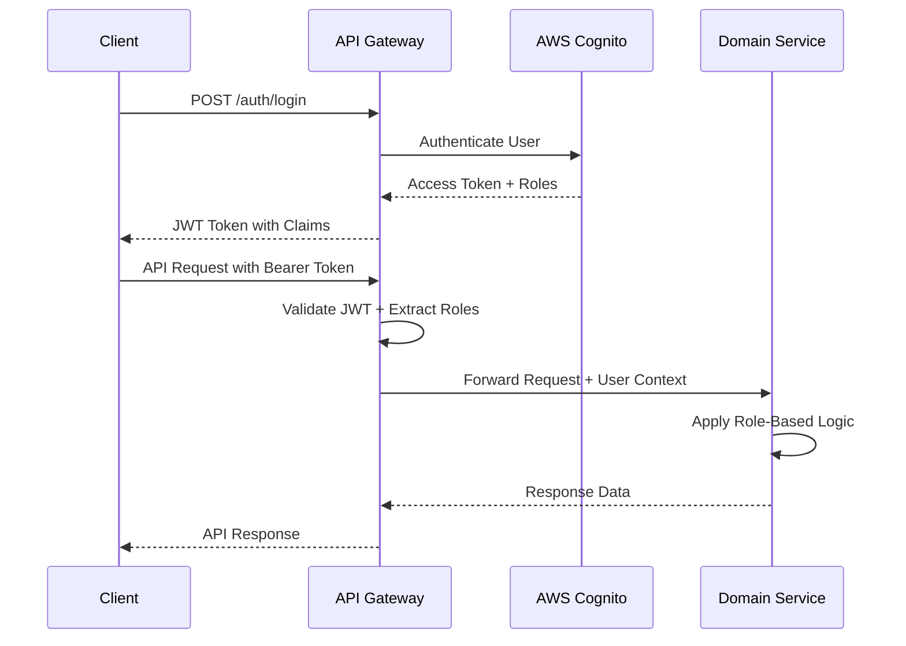
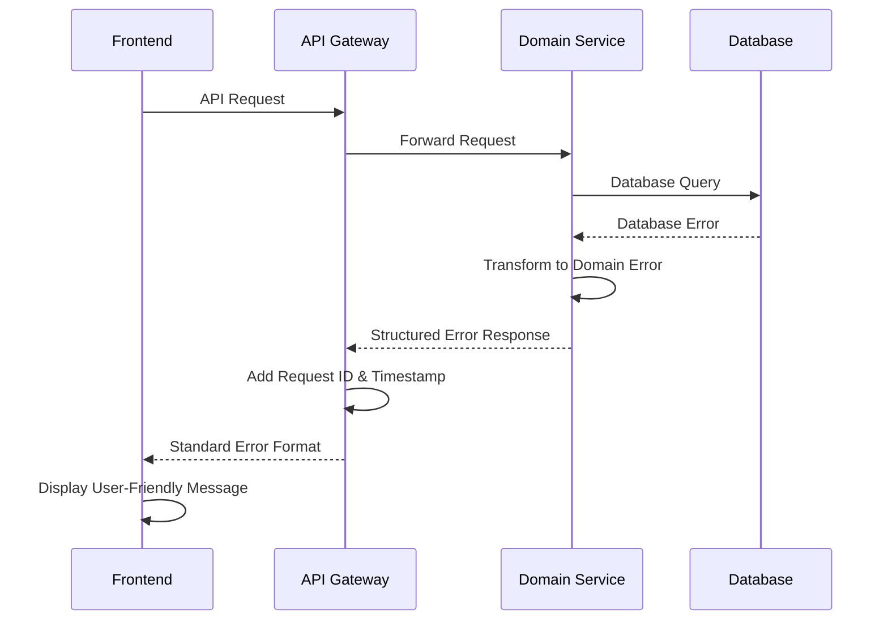

# Backend Architecture

This document outlines the comprehensive backend architecture for the BATbern Event Management Platform, including service patterns, authentication, authorization, and error handling strategies.

## Service Architecture Pattern

```
services/{domain-service}/
├── src/main/java/ch/batbern/{domain}/
│   ├── controller/                     # REST API controllers
│   ├── service/                        # Business logic layer
│   ├── repository/                     # Data access layer
│   ├── domain/                         # Domain models and entities
│   ├── dto/                           # Data transfer objects
│   ├── exception/                     # Custom exceptions
│   └── security/                      # Security components
├── src/main/resources/
│   ├── application.yml                # Configuration
│   └── db/migration/                  # Flyway migrations
└── build.gradle                      # Build configuration
```

## Authentication and Authorization

### JWT Authentication Flow



### Role-Based Security Configuration

```java
@Configuration
@EnableWebSecurity
@EnableMethodSecurity(prePostEnabled = true)
public class SecurityConfiguration {

    @Bean
    public SecurityFilterChain filterChain(HttpSecurity http) throws Exception {
        return http
            .csrf(csrf -> csrf.disable())
            .sessionManagement(session -> session.sessionCreationPolicy(SessionCreationPolicy.STATELESS))
            .authorizeHttpRequests(auth -> auth
                .requestMatchers("/actuator/health", "/actuator/info").permitAll()
                .requestMatchers("/api/v1/events").hasAnyRole("ORGANIZER", "ATTENDEE", "SPEAKER", "PARTNER")
                .requestMatchers(HttpMethod.POST, "/api/v1/events").hasRole("ORGANIZER")
                .requestMatchers("/api/v1/speakers/**").hasAnyRole("ORGANIZER", "SPEAKER")
                .requestMatchers("/api/v1/partners/**").hasAnyRole("ORGANIZER", "PARTNER")
                .requestMatchers("/api/v1/companies").hasAnyRole("ORGANIZER", "SPEAKER", "PARTNER")
                .anyRequest().authenticated()
            )
            .oauth2ResourceServer(oauth2 -> oauth2
                .jwt(jwt -> jwt
                    .jwtAuthenticationConverter(jwtAuthenticationConverter())
                    .jwtDecoder(jwtDecoder())
                )
            )
            .build();
    }

    @Bean
    public JwtAuthenticationConverter jwtAuthenticationConverter() {
        JwtGrantedAuthoritiesConverter authoritiesConverter = new JwtGrantedAuthoritiesConverter();
        authoritiesConverter.setAuthorityPrefix("ROLE_");
        authoritiesConverter.setAuthoritiesClaimName("cognito:groups");

        JwtAuthenticationConverter authenticationConverter = new JwtAuthenticationConverter();
        authenticationConverter.setJwtGrantedAuthoritiesConverter(authoritiesConverter);
        return authenticationConverter;
    }
}
```

### User Context Management

```java
@Component
public class SecurityContextHelper {

    public UserContext getCurrentUser() {
        Authentication authentication = SecurityContextHolder.getContext().getAuthentication();

        if (authentication instanceof JwtAuthenticationToken) {
            JwtAuthenticationToken jwtToken = (JwtAuthenticationToken) authentication;
            Map<String, Object> claims = jwtToken.getToken().getClaims();

            return UserContext.builder()
                .userId(claims.get("sub").toString())
                .email(claims.get("email").toString())
                .roles(extractRoles(jwtToken.getAuthorities()))
                .organizationId(claims.get("custom:organization_id"))
                .build();
        }

        throw new SecurityException("No valid authentication context found");
    }

    public boolean hasRole(String role) {
        return getCurrentUser().getRoles().contains(role);
    }

    public boolean isOrganizer() {
        return hasRole("ORGANIZER");
    }

    public boolean canAccessCompany(String companyId) {
        UserContext user = getCurrentUser();
        return user.isOrganizer() || user.getOrganizationId().equals(companyId);
    }
}
```

## Error Handling Strategy

### Error Flow



### Error Response Format

```typescript
interface ApiError {
  error: {
    code: string;
    message: string;
    details?: Record<string, any>;
    timestamp: string;
    requestId: string;
    path: string;
    severity: string;
  };
}
```

### Comprehensive Exception Hierarchy

```java
// Base domain exception
public abstract class BATbernException extends RuntimeException {
    private final String errorCode;
    private final Map<String, Object> details;
    private final Severity severity;

    public BATbernException(String errorCode, String message, Map<String, Object> details, Severity severity) {
        super(message);
        this.errorCode = errorCode;
        this.details = details != null ? details : new HashMap<>();
        this.severity = severity;
    }

    public enum Severity {
        LOW, MEDIUM, HIGH, CRITICAL
    }
}

// Domain-specific exceptions
@ResponseStatus(HttpStatus.NOT_FOUND)
public class EventNotFoundException extends BATbernException {
    public EventNotFoundException(String eventId) {
        super("EVENT_NOT_FOUND",
              "Event with ID " + eventId + " not found",
              Map.of("eventId", eventId),
              Severity.MEDIUM);
    }
}

@ResponseStatus(HttpStatus.BAD_REQUEST)
public class InvalidEventStateException extends BATbernException {
    public InvalidEventStateException(String eventId, String currentState, String attemptedTransition) {
        super("INVALID_EVENT_STATE_TRANSITION",
              String.format("Cannot transition event %s from %s to %s", eventId, currentState, attemptedTransition),
              Map.of("eventId", eventId, "currentState", currentState, "attemptedTransition", attemptedTransition),
              Severity.HIGH);
    }
}

@ResponseStatus(HttpStatus.CONFLICT)
public class SpeakerAlreadyInvitedException extends BATbernException {
    public SpeakerAlreadyInvitedException(String speakerId, String eventId) {
        super("SPEAKER_ALREADY_INVITED",
              "Speaker is already invited to this event",
              Map.of("speakerId", speakerId, "eventId", eventId),
              Severity.LOW);
    }
}

@ResponseStatus(HttpStatus.UNPROCESSABLE_ENTITY)
public class BusinessValidationException extends BATbernException {
    public BusinessValidationException(String field, String violatedRule, Object value) {
        super("BUSINESS_VALIDATION_FAILED",
              String.format("Business rule validation failed for field '%s': %s", field, violatedRule),
              Map.of("field", field, "rule", violatedRule, "value", value),
              Severity.MEDIUM);
    }
}

@ResponseStatus(HttpStatus.TOO_MANY_REQUESTS)
public class RateLimitExceededException extends BATbernException {
    public RateLimitExceededException(String endpoint, int limit, int windowSeconds) {
        super("RATE_LIMIT_EXCEEDED",
              String.format("Rate limit exceeded for endpoint %s: %d requests per %d seconds", endpoint, limit, windowSeconds),
              Map.of("endpoint", endpoint, "limit", limit, "windowSeconds", windowSeconds),
              Severity.MEDIUM);
    }
}
```

### Global Exception Handler

```java
@ControllerAdvice
@Slf4j
public class GlobalExceptionHandler {

    private final ErrorMessageResolver messageResolver;
    private final MetricRegistry metricRegistry;

    @ExceptionHandler(BATbernException.class)
    public ResponseEntity<ErrorResponse> handleBATbernException(BATbernException ex, HttpServletRequest request) {
        String requestId = RequestContext.getCurrentRequestId();

        // Log with appropriate level based on severity
        logException(ex, requestId, request);

        // Increment error metrics
        metricRegistry.counter("errors.domain", "code", ex.getErrorCode()).increment();

        // Build localized error response
        ErrorResponse error = ErrorResponse.builder()
                .code(ex.getErrorCode())
                .message(messageResolver.resolve(ex.getErrorCode(), request.getLocale()))
                .details(sanitizeDetails(ex.getDetails()))
                .timestamp(Instant.now())
                .requestId(requestId)
                .path(request.getRequestURI())
                .severity(ex.getSeverity().name())
                .build();

        return ResponseEntity.status(getHttpStatus(ex)).body(error);
    }

    @ExceptionHandler(MethodArgumentNotValidException.class)
    public ResponseEntity<ErrorResponse> handleValidationException(MethodArgumentNotValidException ex, HttpServletRequest request) {
        String requestId = RequestContext.getCurrentRequestId();

        Map<String, Object> validationErrors = new HashMap<>();
        ex.getBindingResult().getFieldErrors().forEach(error -> {
            validationErrors.put(error.getField(), error.getDefaultMessage());
        });

        ErrorResponse error = ErrorResponse.builder()
                .code("VALIDATION_FAILED")
                .message("Request validation failed")
                .details(Map.of("fieldErrors", validationErrors))
                .timestamp(Instant.now())
                .requestId(requestId)
                .path(request.getRequestURI())
                .severity("MEDIUM")
                .build();

        log.warn("Validation error for request {}: {}", requestId, validationErrors);
        metricRegistry.counter("errors.validation").increment();

        return ResponseEntity.badRequest().body(error);
    }

    @ExceptionHandler(DataIntegrityViolationException.class)
    public ResponseEntity<ErrorResponse> handleDataIntegrityViolation(DataIntegrityViolationException ex, HttpServletRequest request) {
        String requestId = RequestContext.getCurrentRequestId();

        // Parse constraint violation to provide meaningful error
        String errorCode = "DATA_INTEGRITY_VIOLATION";
        String message = "A data integrity constraint was violated";

        if (ex.getCause() instanceof ConstraintViolationException) {
            ConstraintViolationException cve = (ConstraintViolationException) ex.getCause();
            String constraintName = cve.getConstraintName();

            if (constraintName != null) {
                if (constraintName.contains("email_unique")) {
                    errorCode = "EMAIL_ALREADY_EXISTS";
                    message = "An account with this email address already exists";
                } else if (constraintName.contains("company_name_unique")) {
                    errorCode = "COMPANY_NAME_EXISTS";
                    message = "A company with this name already exists";
                }
            }
        }

        ErrorResponse error = ErrorResponse.builder()
                .code(errorCode)
                .message(message)
                .timestamp(Instant.now())
                .requestId(requestId)
                .path(request.getRequestURI())
                .severity("MEDIUM")
                .build();

        log.error("Data integrity violation for request {}: {}", requestId, ex.getMessage());
        metricRegistry.counter("errors.database.integrity").increment();

        return ResponseEntity.status(HttpStatus.CONFLICT).body(error);
    }

    @ExceptionHandler(Exception.class)
    public ResponseEntity<ErrorResponse> handleGenericException(Exception ex, HttpServletRequest request) {
        String requestId = RequestContext.getCurrentRequestId();

        ErrorResponse error = ErrorResponse.builder()
                .code("INTERNAL_SERVER_ERROR")
                .message("An unexpected error occurred. Please try again later.")
                .timestamp(Instant.now())
                .requestId(requestId)
                .path(request.getRequestURI())
                .severity("CRITICAL")
                .build();

        log.error("Unexpected error for request {}: ", requestId, ex);
        metricRegistry.counter("errors.unexpected").increment();

        // Send alert for unexpected errors
        alertService.sendCriticalAlert("Unexpected error", ex, requestId);

        return ResponseEntity.status(HttpStatus.INTERNAL_SERVER_ERROR).body(error);
    }

    private void logException(BATbernException ex, String requestId, HttpServletRequest request) {
        switch (ex.getSeverity()) {
            case LOW:
                log.info("Domain exception [{}] for request {}: {}", ex.getErrorCode(), requestId, ex.getMessage());
                break;
            case MEDIUM:
                log.warn("Domain exception [{}] for request {}: {}", ex.getErrorCode(), requestId, ex.getMessage());
                break;
            case HIGH:
            case CRITICAL:
                log.error("Domain exception [{}] for request {}: {}", ex.getErrorCode(), requestId, ex.getMessage(), ex);
                break;
        }
    }

    private Map<String, Object> sanitizeDetails(Map<String, Object> details) {
        // Remove sensitive information from error details
        Map<String, Object> sanitized = new HashMap<>(details);
        sanitized.remove("password");
        sanitized.remove("token");
        sanitized.remove("secret");
        return sanitized;
    }
}
```

### Circuit Breaker Pattern Implementation

```java
@Component
@Slf4j
public class CircuitBreakerService {

    private final Map<String, CircuitBreaker> circuitBreakers = new ConcurrentHashMap<>();
    private final MetricRegistry metricRegistry;

    @Value("${circuit-breaker.failure-threshold:5}")
    private int failureThreshold;

    @Value("${circuit-breaker.timeout:60000}")
    private long timeoutMs;

    public <T> T executeWithCircuitBreaker(String serviceName, Supplier<T> operation, Supplier<T> fallback) {
        CircuitBreaker circuitBreaker = getOrCreateCircuitBreaker(serviceName);

        try {
            return circuitBreaker.executeSupplier(operation);
        } catch (CallNotPermittedException ex) {
            log.warn("Circuit breaker {} is OPEN, executing fallback", serviceName);
            metricRegistry.counter("circuit-breaker.fallback", "service", serviceName).increment();
            return fallback.get();
        }
    }

    private CircuitBreaker getOrCreateCircuitBreaker(String serviceName) {
        return circuitBreakers.computeIfAbsent(serviceName, name -> {
            CircuitBreakerConfig config = CircuitBreakerConfig.custom()
                    .failureRateThreshold(50)
                    .waitDurationInOpenState(Duration.ofMillis(timeoutMs))
                    .slidingWindowSize(10)
                    .minimumNumberOfCalls(5)
                    .build();

            CircuitBreaker circuitBreaker = CircuitBreaker.of(name, config);

            // Register metrics
            circuitBreaker.getEventPublisher()
                    .onStateTransition(event -> {
                        log.info("Circuit breaker {} transitioned from {} to {}",
                                name, event.getStateTransition().getFromState(), event.getStateTransition().getToState());
                        metricRegistry.counter("circuit-breaker.state-transition",
                                "service", name,
                                "from", event.getStateTransition().getFromState().name(),
                                "to", event.getStateTransition().getToState().name()).increment();
                    });

            return circuitBreaker;
        });
    }
}

// Usage in service classes
@Service
@Slf4j
public class ExternalEmailService {

    private final CircuitBreakerService circuitBreakerService;
    private final EmailClient emailClient;

    public void sendEmail(EmailRequest request) {
        circuitBreakerService.executeWithCircuitBreaker(
            "email-service",
            () -> {
                emailClient.send(request);
                return null;
            },
            () -> {
                // Fallback: Queue email for later retry
                emailQueueService.enqueue(request);
                log.warn("Email service unavailable, queued email for later delivery: {}", request.getSubject());
                return null;
            }
        );
    }
}
```

### Retry Mechanism with Exponential Backoff

```java
@Component
public class RetryService {

    @Retryable(
        value = {TransientException.class, TemporaryUnavailableException.class},
        maxAttempts = 3,
        backoff = @Backoff(delay = 1000, multiplier = 2, maxDelay = 10000)
    )
    public void executeWithRetry(Runnable operation) {
        operation.run();
    }

    @Recover
    public void recover(Exception ex) {
        log.error("Failed after all retry attempts: {}", ex.getMessage());
        // Send to dead letter queue or alert
    }
}
```

### Request Correlation and Context

```java
@Component
@Slf4j
public class RequestCorrelationFilter implements Filter {
    private static final String CORRELATION_ID_HEADER = "X-Correlation-ID";

    @Override
    public void doFilter(ServletRequest request, ServletResponse response, FilterChain chain)
            throws IOException, ServletException {

        HttpServletRequest httpRequest = (HttpServletRequest) request;
        HttpServletResponse httpResponse = (HttpServletResponse) response;

        String correlationId = httpRequest.getHeader(CORRELATION_ID_HEADER);
        if (correlationId == null) {
            correlationId = UUID.randomUUID().toString();
        }

        // Set in MDC for logging
        MDC.put("correlationId", correlationId);
        MDC.put("requestURI", httpRequest.getRequestURI());
        MDC.put("method", httpRequest.getMethod());

        // Set in response header
        httpResponse.setHeader(CORRELATION_ID_HEADER, correlationId);

        // Store in thread-local context
        RequestContext.setCorrelationId(correlationId);

        try {
            chain.doFilter(request, response);
        } finally {
            MDC.clear();
            RequestContext.clear();
        }
    }
}

public class RequestContext {
    private static final ThreadLocal<String> correlationId = new ThreadLocal<>();
    private static final ThreadLocal<UserContext> userContext = new ThreadLocal<>();

    public static String getCurrentRequestId() {
        return correlationId.get();
    }

    public static void setCorrelationId(String id) {
        correlationId.set(id);
    }

    public static UserContext getCurrentUser() {
        return userContext.get();
    }

    public static void setCurrentUser(UserContext user) {
        userContext.set(user);
    }

    public static void clear() {
        correlationId.remove();
        userContext.remove();
    }
}
```

## Service Communication Patterns

### Domain Events

```java
@Component
@Slf4j
public class DomainEventPublisher {

    private final ApplicationEventPublisher eventPublisher;
    private final EventBridge eventBridge;

    public void publishEvent(DomainEvent event) {
        // Publish locally for same-service subscribers
        eventPublisher.publishEvent(event);

        // Publish to EventBridge for cross-service communication
        try {
            eventBridge.publishEvent(event);
            log.debug("Published domain event: {} with ID: {}", event.getEventType(), event.getId());
        } catch (Exception ex) {
            log.error("Failed to publish domain event to EventBridge: {}", event.getId(), ex);
            // Store for retry
            failedEventStore.store(event);
        }
    }
}

// Event listeners
@EventListener
@Async
public void handleSpeakerInvited(SpeakerInvitedEvent event) {
    log.info("Processing speaker invitation for speaker {} to event {}",
             event.getSpeakerId(), event.getEventId());

    // Send invitation email
    emailService.sendSpeakerInvitation(event);

    // Update analytics
    partnerAnalyticsService.updateSpeakerMetrics(event);
}
```

### Data Validation and Business Rules

```java
@Component
public class EventBusinessRules {

    public void validateEventCreation(CreateEventRequest request) {
        // Business rule: Event date must be at least 30 days in the future
        if (request.getEventDate().isBefore(LocalDateTime.now().plusDays(30))) {
            throw new BusinessValidationException(
                "eventDate",
                "Event date must be at least 30 days in the future",
                request.getEventDate()
            );
        }

        // Business rule: Only one event per quarter
        if (eventRepository.existsByQuarter(getQuarter(request.getEventDate()))) {
            throw new BusinessValidationException(
                "eventDate",
                "Only one event is allowed per quarter",
                getQuarter(request.getEventDate())
            );
        }
    }

    public void validateSpeakerInvitation(String speakerId, String eventId) {
        // Business rule: Speaker cannot be invited to multiple sessions in same time slot
        List<Session> conflictingSessions = sessionRepository.findConflictingSessions(speakerId, eventId);
        if (!conflictingSessions.isEmpty()) {
            throw new BusinessValidationException(
                "speakerId",
                "Speaker has conflicting sessions",
                Map.of("conflictingSessions", conflictingSessions.stream()
                      .map(Session::getId).collect(Collectors.toList()))
            );
        }
    }
}
```

This backend architecture provides a robust foundation for the BATbern platform with comprehensive error handling, security, resilience patterns, and clear service boundaries following Domain-Driven Design principles.