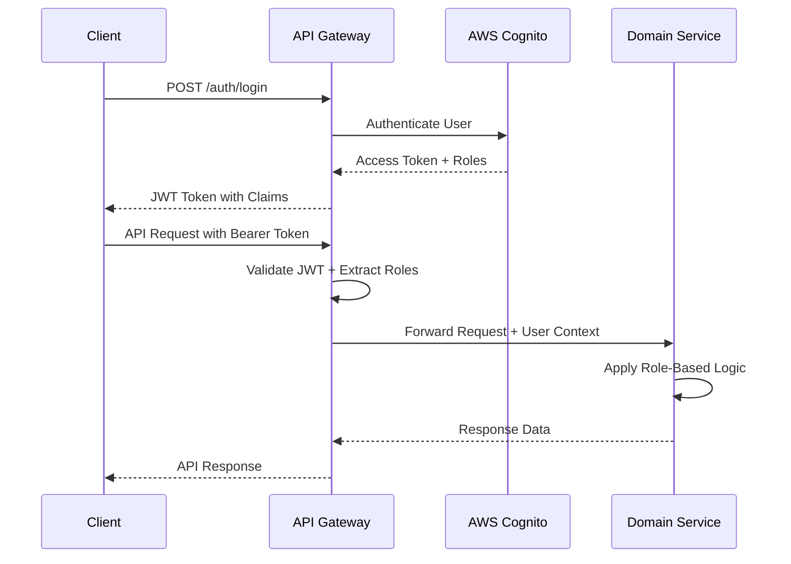
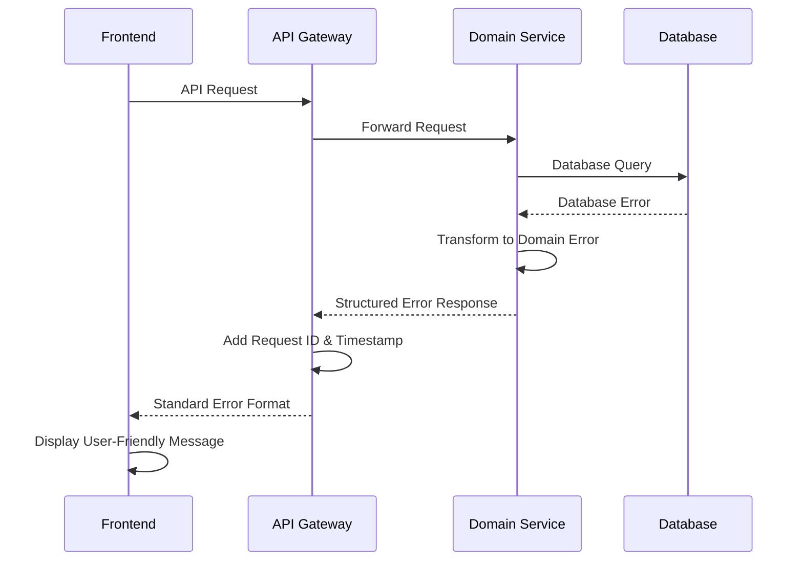

# Backend Architecture

This document outlines the comprehensive backend architecture for the BATbern Event Management Platform, including service patterns, authentication, authorization, and error handling strategies.

## Service Architecture Pattern

```
services/{domain-service}/
├── src/main/java/ch/batbern/{domain}/
│   ├── controller/                     # REST API controllers
│   ├── service/                        # Business logic layer
│   ├── repository/                     # Data access layer
│   ├── domain/                         # Domain models and entities
│   ├── dto/                           # Data transfer objects
│   ├── exception/                     # Custom exceptions
│   └── security/                      # Security components
├── src/main/resources/
│   ├── application.yml                # Configuration
│   └── db/migration/                  # Flyway migrations
└── build.gradle                      # Build configuration
```

## Authentication and Authorization

### JWT Authentication Flow



### Role-Based Security Configuration

```java
@Configuration
@EnableWebSecurity
@EnableMethodSecurity(prePostEnabled = true)
public class SecurityConfiguration {

    @Bean
    public SecurityFilterChain filterChain(HttpSecurity http) throws Exception {
        return http
            .csrf(csrf -> csrf.disable())
            .sessionManagement(session -> session.sessionCreationPolicy(SessionCreationPolicy.STATELESS))
            .authorizeHttpRequests(auth -> auth
                .requestMatchers("/actuator/health", "/actuator/info").permitAll()
                .requestMatchers("/api/v1/events").hasAnyRole("ORGANIZER", "ATTENDEE", "SPEAKER", "PARTNER")
                .requestMatchers(HttpMethod.POST, "/api/v1/events").hasRole("ORGANIZER")
                .requestMatchers("/api/v1/speakers/**").hasAnyRole("ORGANIZER", "SPEAKER")
                .requestMatchers("/api/v1/partners/**").hasAnyRole("ORGANIZER", "PARTNER")
                .requestMatchers("/api/v1/companies").hasAnyRole("ORGANIZER", "SPEAKER", "PARTNER")
                .anyRequest().authenticated()
            )
            .oauth2ResourceServer(oauth2 -> oauth2
                .jwt(jwt -> jwt
                    .jwtAuthenticationConverter(jwtAuthenticationConverter())
                    .jwtDecoder(jwtDecoder())
                )
            )
            .build();
    }

    @Bean
    public JwtAuthenticationConverter jwtAuthenticationConverter() {
        JwtGrantedAuthoritiesConverter authoritiesConverter = new JwtGrantedAuthoritiesConverter();
        authoritiesConverter.setAuthorityPrefix("ROLE_");
        authoritiesConverter.setAuthoritiesClaimName("cognito:groups");

        JwtAuthenticationConverter authenticationConverter = new JwtAuthenticationConverter();
        authenticationConverter.setJwtGrantedAuthoritiesConverter(authoritiesConverter);
        return authenticationConverter;
    }
}
```

### User Context Management

```java
@Component
public class SecurityContextHelper {

    public UserContext getCurrentUser() {
        Authentication authentication = SecurityContextHolder.getContext().getAuthentication();

        if (authentication instanceof JwtAuthenticationToken) {
            JwtAuthenticationToken jwtToken = (JwtAuthenticationToken) authentication;
            Map<String, Object> claims = jwtToken.getToken().getClaims();

            return UserContext.builder()
                .userId(claims.get("sub").toString())
                .email(claims.get("email").toString())
                .roles(extractRoles(jwtToken.getAuthorities()))
                .organizationId(claims.get("custom:organization_id"))
                .build();
        }

        throw new SecurityException("No valid authentication context found");
    }

    public boolean hasRole(String role) {
        return getCurrentUser().getRoles().contains(role);
    }

    public boolean isOrganizer() {
        return hasRole("ORGANIZER");
    }

    public boolean canAccessCompany(String companyId) {
        UserContext user = getCurrentUser();
        return user.isOrganizer() || user.getOrganizationId().equals(companyId);
    }
}
```

## Error Handling Strategy

### Error Flow



### Error Response Format

```typescript
interface ApiError {
  error: {
    code: string;
    message: string;
    details?: Record<string, any>;
    timestamp: string;
    requestId: string;
    path: string;
    severity: string;
  };
}
```

### Comprehensive Exception Hierarchy

```java
// Base domain exception
public abstract class BATbernException extends RuntimeException {
    private final String errorCode;
    private final Map<String, Object> details;
    private final Severity severity;

    public BATbernException(String errorCode, String message, Map<String, Object> details, Severity severity) {
        super(message);
        this.errorCode = errorCode;
        this.details = details != null ? details : new HashMap<>();
        this.severity = severity;
    }

    public enum Severity {
        LOW, MEDIUM, HIGH, CRITICAL
    }
}

// Domain-specific exceptions
@ResponseStatus(HttpStatus.NOT_FOUND)
public class EventNotFoundException extends BATbernException {
    public EventNotFoundException(String eventId) {
        super("EVENT_NOT_FOUND",
              "Event with ID " + eventId + " not found",
              Map.of("eventId", eventId),
              Severity.MEDIUM);
    }
}

@ResponseStatus(HttpStatus.BAD_REQUEST)
public class InvalidEventStateException extends BATbernException {
    public InvalidEventStateException(String eventId, String currentState, String attemptedTransition) {
        super("INVALID_EVENT_STATE_TRANSITION",
              String.format("Cannot transition event %s from %s to %s", eventId, currentState, attemptedTransition),
              Map.of("eventId", eventId, "currentState", currentState, "attemptedTransition", attemptedTransition),
              Severity.HIGH);
    }
}

@ResponseStatus(HttpStatus.CONFLICT)
public class SpeakerAlreadyInvitedException extends BATbernException {
    public SpeakerAlreadyInvitedException(String speakerId, String eventId) {
        super("SPEAKER_ALREADY_INVITED",
              "Speaker is already invited to this event",
              Map.of("speakerId", speakerId, "eventId", eventId),
              Severity.LOW);
    }
}

@ResponseStatus(HttpStatus.UNPROCESSABLE_ENTITY)
public class BusinessValidationException extends BATbernException {
    public BusinessValidationException(String field, String violatedRule, Object value) {
        super("BUSINESS_VALIDATION_FAILED",
              String.format("Business rule validation failed for field '%s': %s", field, violatedRule),
              Map.of("field", field, "rule", violatedRule, "value", value),
              Severity.MEDIUM);
    }
}

@ResponseStatus(HttpStatus.TOO_MANY_REQUESTS)
public class RateLimitExceededException extends BATbernException {
    public RateLimitExceededException(String endpoint, int limit, int windowSeconds) {
        super("RATE_LIMIT_EXCEEDED",
              String.format("Rate limit exceeded for endpoint %s: %d requests per %d seconds", endpoint, limit, windowSeconds),
              Map.of("endpoint", endpoint, "limit", limit, "windowSeconds", windowSeconds),
              Severity.MEDIUM);
    }
}
```

### Global Exception Handler

```java
@ControllerAdvice
@Slf4j
public class GlobalExceptionHandler {

    private final ErrorMessageResolver messageResolver;
    private final MetricRegistry metricRegistry;

    @ExceptionHandler(BATbernException.class)
    public ResponseEntity<ErrorResponse> handleBATbernException(BATbernException ex, HttpServletRequest request) {
        String requestId = RequestContext.getCurrentRequestId();

        // Log with appropriate level based on severity
        logException(ex, requestId, request);

        // Increment error metrics
        metricRegistry.counter("errors.domain", "code", ex.getErrorCode()).increment();

        // Build localized error response
        ErrorResponse error = ErrorResponse.builder()
                .code(ex.getErrorCode())
                .message(messageResolver.resolve(ex.getErrorCode(), request.getLocale()))
                .details(sanitizeDetails(ex.getDetails()))
                .timestamp(Instant.now())
                .requestId(requestId)
                .path(request.getRequestURI())
                .severity(ex.getSeverity().name())
                .build();

        return ResponseEntity.status(getHttpStatus(ex)).body(error);
    }

    @ExceptionHandler(MethodArgumentNotValidException.class)
    public ResponseEntity<ErrorResponse> handleValidationException(MethodArgumentNotValidException ex, HttpServletRequest request) {
        String requestId = RequestContext.getCurrentRequestId();

        Map<String, Object> validationErrors = new HashMap<>();
        ex.getBindingResult().getFieldErrors().forEach(error -> {
            validationErrors.put(error.getField(), error.getDefaultMessage());
        });

        ErrorResponse error = ErrorResponse.builder()
                .code("VALIDATION_FAILED")
                .message("Request validation failed")
                .details(Map.of("fieldErrors", validationErrors))
                .timestamp(Instant.now())
                .requestId(requestId)
                .path(request.getRequestURI())
                .severity("MEDIUM")
                .build();

        log.warn("Validation error for request {}: {}", requestId, validationErrors);
        metricRegistry.counter("errors.validation").increment();

        return ResponseEntity.badRequest().body(error);
    }

    @ExceptionHandler(DataIntegrityViolationException.class)
    public ResponseEntity<ErrorResponse> handleDataIntegrityViolation(DataIntegrityViolationException ex, HttpServletRequest request) {
        String requestId = RequestContext.getCurrentRequestId();

        // Parse constraint violation to provide meaningful error
        String errorCode = "DATA_INTEGRITY_VIOLATION";
        String message = "A data integrity constraint was violated";

        if (ex.getCause() instanceof ConstraintViolationException) {
            ConstraintViolationException cve = (ConstraintViolationException) ex.getCause();
            String constraintName = cve.getConstraintName();

            if (constraintName != null) {
                if (constraintName.contains("email_unique")) {
                    errorCode = "EMAIL_ALREADY_EXISTS";
                    message = "An account with this email address already exists";
                } else if (constraintName.contains("company_name_unique")) {
                    errorCode = "COMPANY_NAME_EXISTS";
                    message = "A company with this name already exists";
                }
            }
        }

        ErrorResponse error = ErrorResponse.builder()
                .code(errorCode)
                .message(message)
                .timestamp(Instant.now())
                .requestId(requestId)
                .path(request.getRequestURI())
                .severity("MEDIUM")
                .build();

        log.error("Data integrity violation for request {}: {}", requestId, ex.getMessage());
        metricRegistry.counter("errors.database.integrity").increment();

        return ResponseEntity.status(HttpStatus.CONFLICT).body(error);
    }

    @ExceptionHandler(Exception.class)
    public ResponseEntity<ErrorResponse> handleGenericException(Exception ex, HttpServletRequest request) {
        String requestId = RequestContext.getCurrentRequestId();

        ErrorResponse error = ErrorResponse.builder()
                .code("INTERNAL_SERVER_ERROR")
                .message("An unexpected error occurred. Please try again later.")
                .timestamp(Instant.now())
                .requestId(requestId)
                .path(request.getRequestURI())
                .severity("CRITICAL")
                .build();

        log.error("Unexpected error for request {}: ", requestId, ex);
        metricRegistry.counter("errors.unexpected").increment();

        // Send alert for unexpected errors
        alertService.sendCriticalAlert("Unexpected error", ex, requestId);

        return ResponseEntity.status(HttpStatus.INTERNAL_SERVER_ERROR).body(error);
    }

    private void logException(BATbernException ex, String requestId, HttpServletRequest request) {
        switch (ex.getSeverity()) {
            case LOW:
                log.info("Domain exception [{}] for request {}: {}", ex.getErrorCode(), requestId, ex.getMessage());
                break;
            case MEDIUM:
                log.warn("Domain exception [{}] for request {}: {}", ex.getErrorCode(), requestId, ex.getMessage());
                break;
            case HIGH:
            case CRITICAL:
                log.error("Domain exception [{}] for request {}: {}", ex.getErrorCode(), requestId, ex.getMessage(), ex);
                break;
        }
    }

    private Map<String, Object> sanitizeDetails(Map<String, Object> details) {
        // Remove sensitive information from error details
        Map<String, Object> sanitized = new HashMap<>(details);
        sanitized.remove("password");
        sanitized.remove("token");
        sanitized.remove("secret");
        return sanitized;
    }
}
```

### Circuit Breaker Pattern Implementation

```java
@Component
@Slf4j
public class CircuitBreakerService {

    private final Map<String, CircuitBreaker> circuitBreakers = new ConcurrentHashMap<>();
    private final MetricRegistry metricRegistry;

    @Value("${circuit-breaker.failure-threshold:5}")
    private int failureThreshold;

    @Value("${circuit-breaker.timeout:60000}")
    private long timeoutMs;

    public <T> T executeWithCircuitBreaker(String serviceName, Supplier<T> operation, Supplier<T> fallback) {
        CircuitBreaker circuitBreaker = getOrCreateCircuitBreaker(serviceName);

        try {
            return circuitBreaker.executeSupplier(operation);
        } catch (CallNotPermittedException ex) {
            log.warn("Circuit breaker {} is OPEN, executing fallback", serviceName);
            metricRegistry.counter("circuit-breaker.fallback", "service", serviceName).increment();
            return fallback.get();
        }
    }

    private CircuitBreaker getOrCreateCircuitBreaker(String serviceName) {
        return circuitBreakers.computeIfAbsent(serviceName, name -> {
            CircuitBreakerConfig config = CircuitBreakerConfig.custom()
                    .failureRateThreshold(50)
                    .waitDurationInOpenState(Duration.ofMillis(timeoutMs))
                    .slidingWindowSize(10)
                    .minimumNumberOfCalls(5)
                    .build();

            CircuitBreaker circuitBreaker = CircuitBreaker.of(name, config);

            // Register metrics
            circuitBreaker.getEventPublisher()
                    .onStateTransition(event -> {
                        log.info("Circuit breaker {} transitioned from {} to {}",
                                name, event.getStateTransition().getFromState(), event.getStateTransition().getToState());
                        metricRegistry.counter("circuit-breaker.state-transition",
                                "service", name,
                                "from", event.getStateTransition().getFromState().name(),
                                "to", event.getStateTransition().getToState().name()).increment();
                    });

            return circuitBreaker;
        });
    }
}

// Usage in service classes
@Service
@Slf4j
public class ExternalEmailService {

    private final CircuitBreakerService circuitBreakerService;
    private final EmailClient emailClient;

    public void sendEmail(EmailRequest request) {
        circuitBreakerService.executeWithCircuitBreaker(
            "email-service",
            () -> {
                emailClient.send(request);
                return null;
            },
            () -> {
                // Fallback: Queue email for later retry
                emailQueueService.enqueue(request);
                log.warn("Email service unavailable, queued email for later delivery: {}", request.getSubject());
                return null;
            }
        );
    }
}
```

### Retry Mechanism with Exponential Backoff

```java
@Component
public class RetryService {

    @Retryable(
        value = {TransientException.class, TemporaryUnavailableException.class},
        maxAttempts = 3,
        backoff = @Backoff(delay = 1000, multiplier = 2, maxDelay = 10000)
    )
    public void executeWithRetry(Runnable operation) {
        operation.run();
    }

    @Recover
    public void recover(Exception ex) {
        log.error("Failed after all retry attempts: {}", ex.getMessage());
        // Send to dead letter queue or alert
    }
}
```

### Request Correlation and Context

```java
@Component
@Slf4j
public class RequestCorrelationFilter implements Filter {
    private static final String CORRELATION_ID_HEADER = "X-Correlation-ID";

    @Override
    public void doFilter(ServletRequest request, ServletResponse response, FilterChain chain)
            throws IOException, ServletException {

        HttpServletRequest httpRequest = (HttpServletRequest) request;
        HttpServletResponse httpResponse = (HttpServletResponse) response;

        String correlationId = httpRequest.getHeader(CORRELATION_ID_HEADER);
        if (correlationId == null) {
            correlationId = UUID.randomUUID().toString();
        }

        // Set in MDC for logging
        MDC.put("correlationId", correlationId);
        MDC.put("requestURI", httpRequest.getRequestURI());
        MDC.put("method", httpRequest.getMethod());

        // Set in response header
        httpResponse.setHeader(CORRELATION_ID_HEADER, correlationId);

        // Store in thread-local context
        RequestContext.setCorrelationId(correlationId);

        try {
            chain.doFilter(request, response);
        } finally {
            MDC.clear();
            RequestContext.clear();
        }
    }
}

public class RequestContext {
    private static final ThreadLocal<String> correlationId = new ThreadLocal<>();
    private static final ThreadLocal<UserContext> userContext = new ThreadLocal<>();

    public static String getCurrentRequestId() {
        return correlationId.get();
    }

    public static void setCorrelationId(String id) {
        correlationId.set(id);
    }

    public static UserContext getCurrentUser() {
        return userContext.get();
    }

    public static void setCurrentUser(UserContext user) {
        userContext.set(user);
    }

    public static void clear() {
        correlationId.remove();
        userContext.remove();
    }
}
```

## Service Communication Patterns

### Domain Events

```java
@Component
@Slf4j
public class DomainEventPublisher {

    private final ApplicationEventPublisher eventPublisher;
    private final EventBridge eventBridge;

    public void publishEvent(DomainEvent event) {
        // Publish locally for same-service subscribers
        eventPublisher.publishEvent(event);

        // Publish to EventBridge for cross-service communication
        try {
            eventBridge.publishEvent(event);
            log.debug("Published domain event: {} with ID: {}", event.getEventType(), event.getId());
        } catch (Exception ex) {
            log.error("Failed to publish domain event to EventBridge: {}", event.getId(), ex);
            // Store for retry
            failedEventStore.store(event);
        }
    }
}

// Event listeners
@EventListener
@Async
public void handleSpeakerInvited(SpeakerInvitedEvent event) {
    log.info("Processing speaker invitation for speaker {} to event {}",
             event.getSpeakerId(), event.getEventId());

    // Send invitation email
    emailService.sendSpeakerInvitation(event);

    // Update analytics
    partnerAnalyticsService.updateSpeakerMetrics(event);
}
```

### Data Validation and Business Rules

```java
@Component
public class EventBusinessRules {

    public void validateEventCreation(CreateEventRequest request) {
        // Business rule: Event date must be at least 30 days in the future
        if (request.getEventDate().isBefore(LocalDateTime.now().plusDays(30))) {
            throw new BusinessValidationException(
                "eventDate",
                "Event date must be at least 30 days in the future",
                request.getEventDate()
            );
        }

        // Business rule: Only one event per quarter
        if (eventRepository.existsByQuarter(getQuarter(request.getEventDate()))) {
            throw new BusinessValidationException(
                "eventDate",
                "Only one event is allowed per quarter",
                getQuarter(request.getEventDate())
            );
        }
    }

    public void validateSpeakerInvitation(String speakerId, String eventId) {
        // Business rule: Speaker cannot be invited to multiple sessions in same time slot
        List<Session> conflictingSessions = sessionRepository.findConflictingSessions(speakerId, eventId);
        if (!conflictingSessions.isEmpty()) {
            throw new BusinessValidationException(
                "speakerId",
                "Speaker has conflicting sessions",
                Map.of("conflictingSessions", conflictingSessions.stream()
                      .map(Session::getId).collect(Collectors.toList()))
            );
        }
    }
}
```

## Enhanced Workflow Services & State Management

### Event Workflow State Machine

```java
@Component
@Slf4j
public class EventWorkflowStateMachine {

    private final EventRepository eventRepository;
    private final WorkflowTransitionValidator transitionValidator;
    private final DomainEventPublisher eventPublisher;

    public Event transitionToState(String eventId, EventWorkflowState targetState, String organizerId) {
        Event event = eventRepository.findById(eventId)
            .orElseThrow(() -> new EntityNotFoundException("Event not found: " + eventId));

        EventWorkflowState currentState = event.getWorkflowState();

        // Validate transition is allowed
        transitionValidator.validateTransition(currentState, targetState, event);

        // Apply state-specific business logic
        switch (targetState) {
            case SPEAKER_OUTREACH:
                validateMinimumSpeakersIdentified(event);
                break;
            case QUALITY_REVIEW:
                validateAllContentSubmitted(event);
                break;
            case SLOT_ASSIGNMENT:
                validateMinimumThresholdMet(event);
                break;
            case AGENDA_FINALIZATION:
                validateAllSlotsAssigned(event);
                break;
            case PUBLISHED:
                validateQualityReviewComplete(event);
                break;
        }

        // Update state
        event.setWorkflowState(targetState);
        event.setLastUpdatedBy(organizerId);
        event.setUpdatedAt(Instant.now());

        Event savedEvent = eventRepository.save(event);

        // Publish state transition event
        eventPublisher.publishEvent(new EventWorkflowTransitionEvent(
            eventId, currentState, targetState, organizerId, Instant.now()
        ));

        log.info("Event {} transitioned from {} to {} by organizer {}",
                 eventId, currentState, targetState, organizerId);

        return savedEvent;
    }

    private void validateMinimumSpeakersIdentified(Event event) {
        int requiredSpeakers = event.getSlotConfiguration().getMinSlots();
        long identifiedSpeakers = event.getSessions().stream()
            .flatMap(session -> session.getSpeakers().stream())
            .filter(speaker -> speaker.getWorkflowState() != SpeakerWorkflowState.OPEN)
            .count();

        if (identifiedSpeakers < requiredSpeakers) {
            throw new WorkflowValidationException(
                "Insufficient speakers identified",
                Map.of("required", requiredSpeakers, "identified", identifiedSpeakers)
            );
        }
    }

    private void validateAllContentSubmitted(Event event) {
        List<String> missingSessions = event.getSessions().stream()
            .filter(session -> session.getSpeakers().stream()
                .anyMatch(speaker -> speaker.getWorkflowState() == SpeakerWorkflowState.ACCEPTED))
            .filter(session -> session.getMaterials() == null || session.getMaterials().isEmpty())
            .map(Session::getId)
            .collect(Collectors.toList());

        if (!missingSessions.isEmpty()) {
            throw new WorkflowValidationException(
                "Content missing for sessions",
                Map.of("missingSessions", missingSessions)
            );
        }
    }
}
```

### Speaker Workflow Management

```java
@Service
@Slf4j
public class SpeakerWorkflowService {

    private final SessionRepository sessionRepository;
    private final SpeakerRepository speakerRepository;
    private final WorkflowNotificationService notificationService;
    private final DomainEventPublisher eventPublisher;

    public void updateSpeakerWorkflowState(String sessionId, String speakerId,
                                         SpeakerWorkflowState newState, String updatedBy) {
        Session session = sessionRepository.findById(sessionId)
            .orElseThrow(() -> new EntityNotFoundException("Session not found: " + sessionId));

        SessionSpeaker speaker = session.getSpeakers().stream()
            .filter(s -> s.getSpeakerId().equals(speakerId))
            .findFirst()
            .orElseThrow(() -> new EntityNotFoundException("Speaker not found in session"));

        SpeakerWorkflowState previousState = speaker.getWorkflowState();

        // Apply state-specific logic
        switch (newState) {
            case CONTACTED:
                speaker.setContactedAt(Instant.now());
                notificationService.sendSpeakerInvitation(speaker, session);
                break;
            case ACCEPTED:
                speaker.setConfirmedAt(Instant.now());
                checkForOverflow(session.getEventId());
                break;
            case DECLINED:
                speaker.setDeclinedAt(Instant.now());
                handleSpeakerDecline(session, speaker);
                break;
            case SLOT_ASSIGNED:
                validateSlotAssignment(speaker);
                break;
            case WAITLIST:
                speaker.setWaitlistedAt(Instant.now());
                addToWaitlist(session.getEventId(), speaker);
                break;
        }

        speaker.setWorkflowState(newState);
        sessionRepository.save(session);

        // Publish workflow state change event
        eventPublisher.publishEvent(new SpeakerWorkflowStateChangeEvent(
            speakerId, sessionId, session.getEventId(), previousState, newState, updatedBy
        ));

        log.info("Speaker {} in session {} moved from {} to {}",
                 speakerId, sessionId, previousState, newState);
    }

    private void checkForOverflow(String eventId) {
        Event event = eventRepository.findById(eventId)
            .orElseThrow(() -> new EntityNotFoundException("Event not found"));

        int maxSlots = event.getSlotConfiguration().getMaxSlots();
        long acceptedSpeakers = event.getSessions().stream()
            .flatMap(session -> session.getSpeakers().stream())
            .filter(speaker -> speaker.getWorkflowState() == SpeakerWorkflowState.ACCEPTED)
            .count();

        if (acceptedSpeakers > maxSlots) {
            eventPublisher.publishEvent(new SpeakerOverflowDetectedEvent(
                eventId, acceptedSpeakers, maxSlots
            ));
        }
    }
}
```

### Slot Assignment Algorithm Service

```java
@Service
@Slf4j
public class SlotAssignmentService {

    private final EventSlotRepository slotRepository;
    private final SpeakerPreferencesRepository preferencesRepository;
    private final SlotAssignmentAlgorithm assignmentAlgorithm;

    @Transactional
    public List<SlotAssignment> assignSpeakersToSlots(String eventId, boolean useAutomaticAssignment) {
        Event event = eventRepository.findById(eventId)
            .orElseThrow(() -> new EntityNotFoundException("Event not found"));

        List<EventSlot> availableSlots = slotRepository.findByEventIdAndAssignedSpeakerIdIsNull(eventId);
        List<SessionSpeaker> unassignedSpeakers = getUnassignedAcceptedSpeakers(event);
        List<SpeakerSlotPreferences> preferences = preferencesRepository.findByEventId(eventId);

        SlotAssignmentContext context = SlotAssignmentContext.builder()
            .event(event)
            .availableSlots(availableSlots)
            .unassignedSpeakers(unassignedSpeakers)
            .speakerPreferences(preferences)
            .useAutomaticAssignment(useAutomaticAssignment)
            .build();

        List<SlotAssignment> assignments = assignmentAlgorithm.calculateOptimalAssignments(context);

        // Apply assignments
        for (SlotAssignment assignment : assignments) {
            EventSlot slot = slotRepository.findById(assignment.getSlotId())
                .orElseThrow(() -> new EntityNotFoundException("Slot not found"));

            slot.setAssignedSpeakerId(assignment.getSpeakerId());
            slot.setAssignedAt(Instant.now());
            slotRepository.save(slot);

            // Update speaker workflow state
            speakerWorkflowService.updateSpeakerWorkflowState(
                assignment.getSessionId(),
                assignment.getSpeakerId(),
                SpeakerWorkflowState.SLOT_ASSIGNED,
                assignment.getAssignedBy()
            );
        }

        log.info("Assigned {} speakers to slots for event {}", assignments.size(), eventId);
        return assignments;
    }

    private List<SessionSpeaker> getUnassignedAcceptedSpeakers(Event event) {
        return event.getSessions().stream()
            .flatMap(session -> session.getSpeakers().stream())
            .filter(speaker -> speaker.getWorkflowState() == SpeakerWorkflowState.ACCEPTED)
            .filter(speaker -> speaker.getSlotAssignment() == null)
            .collect(Collectors.toList());
    }
}
```

### Quality Review Workflow Engine

```java
@Service
@Slf4j
public class QualityReviewService {

    private final ContentQualityReviewRepository reviewRepository;
    private final ContentValidationService contentValidator;
    private final NotificationService notificationService;

    @Transactional
    public ContentQualityReview submitContentForReview(String sessionId, String speakerId,
                                                     SubmitContentRequest request) {
        // Validate content meets basic requirements
        ContentValidationResult validation = contentValidator.validateContent(request);

        if (!validation.isValid()) {
            throw new ContentValidationException("Content validation failed", validation.getErrors());
        }

        ContentQualityReview review = ContentQualityReview.builder()
            .sessionId(sessionId)
            .speakerId(speakerId)
            .abstractReview(AbstractReview.builder()
                .content(request.getAbstract())
                .characterCount(request.getAbstract().length())
                .hasLessonsLearned(contentValidator.hasLessonsLearned(request.getAbstract()))
                .hasProductPromotion(contentValidator.hasProductPromotion(request.getAbstract()))
                .meetsStandards(validation.meetsAbstractStandards())
                .build())
            .materialReview(buildMaterialReview(request))
            .status(QualityReviewStatus.PENDING)
            .submittedAt(Instant.now())
            .build();

        ContentQualityReview savedReview = reviewRepository.save(review);

        // Notify moderator of pending review
        notificationService.notifyModeratorOfPendingReview(savedReview);

        // Update speaker workflow state
        speakerWorkflowService.updateSpeakerWorkflowState(
            sessionId, speakerId, SpeakerWorkflowState.QUALITY_REVIEWED, speakerId
        );

        return savedReview;
    }

    @Transactional
    public ContentQualityReview updateReviewStatus(String reviewId, UpdateReviewRequest request,
                                                  String moderatorId) {
        ContentQualityReview review = reviewRepository.findById(reviewId)
            .orElseThrow(() -> new EntityNotFoundException("Review not found"));

        review.setStatus(request.getStatus());
        review.setReviewedAt(Instant.now());
        review.setReviewerId(moderatorId);
        review.setFeedback(request.getFeedback());

        if (request.getStatus() == QualityReviewStatus.REQUIRES_CHANGES) {
            review.setRevisionRequested(true);
            review.setRevisionDeadline(Instant.now().plus(Duration.ofDays(7)));

            // Notify speaker of required changes
            notificationService.notifySpeakerOfRequiredChanges(review);
        } else if (request.getStatus() == QualityReviewStatus.APPROVED) {
            // Move speaker to final agenda state
            speakerWorkflowService.updateSpeakerWorkflowState(
                review.getSessionId(),
                review.getSpeakerId(),
                SpeakerWorkflowState.FINAL_AGENDA,
                moderatorId
            );
        }

        return reviewRepository.save(review);
    }
}
```

### Overflow Management & Voting System

```java
@Service
@Slf4j
public class OverflowManagementService {

    private final OverflowManagementRepository overflowRepository;
    private final SpeakerSelectionVoteRepository voteRepository;
    private final EventRepository eventRepository;

    @Transactional
    public SpeakerSelectionVote submitSpeakerVote(String eventId, SpeakerVoteRequest request,
                                                 String organizerId) {
        OverflowManagement overflow = overflowRepository.findByEventId(eventId)
            .orElseThrow(() -> new EntityNotFoundException("No overflow situation for event"));

        // Check if organizer already voted for this speaker
        Optional<SpeakerSelectionVote> existingVote = voteRepository
            .findByOrganizerIdAndSpeakerId(organizerId, request.getSpeakerId());

        SpeakerSelectionVote vote;
        if (existingVote.isPresent()) {
            vote = existingVote.get();
            vote.setVote(request.getVote());
            vote.setReason(request.getReason());
            vote.setVotedAt(Instant.now());
        } else {
            vote = SpeakerSelectionVote.builder()
                .organizerId(organizerId)
                .speakerId(request.getSpeakerId())
                .vote(request.getVote())
                .reason(request.getReason())
                .votedAt(Instant.now())
                .build();
        }

        SpeakerSelectionVote savedVote = voteRepository.save(vote);

        // Check if voting is complete
        checkVotingCompletion(overflow);

        return savedVote;
    }

    private void checkVotingCompletion(OverflowManagement overflow) {
        List<String> allOrganizers = getAllEventOrganizers(overflow.getEventId());
        List<String> speakersInOverflow = overflow.getOverflowSpeakers().stream()
            .map(OverflowSpeaker::getSpeakerId)
            .collect(Collectors.toList());

        boolean allVotesReceived = speakersInOverflow.stream()
            .allMatch(speakerId ->
                voteRepository.countBySpea​kerId(speakerId) >= allOrganizers.size());

        if (allVotesReceived && !overflow.isVotingComplete()) {
            overflow.setVotingComplete(true);
            overflowRepository.save(overflow);

            // Calculate final selection
            selectFinalSpeakers(overflow);

            eventPublisher.publishEvent(new OverflowVotingCompleteEvent(
                overflow.getEventId(), overflow.getOverflowSpeakers()
            ));
        }
    }

    private void selectFinalSpeakers(OverflowManagement overflow) {
        Event event = eventRepository.findById(overflow.getEventId())
            .orElseThrow(() -> new EntityNotFoundException("Event not found"));

        int availableSlots = event.getSlotConfiguration().getMaxSlots();

        // Calculate vote scores and select top speakers
        List<OverflowSpeaker> selectedSpeakers = overflow.getOverflowSpeakers().stream()
            .peek(speaker -> {
                int approveVotes = voteRepository.countBySpeakerIdAndVote(
                    speaker.getSpeakerId(), VoteType.APPROVE);
                speaker.setVotes(approveVotes);
            })
            .sorted(Comparator.comparingInt(OverflowSpeaker::getVotes).reversed())
            .limit(availableSlots)
            .collect(Collectors.toList());

        // Mark selected speakers
        selectedSpeakers.forEach(speaker -> {
            speaker.setSelected(true);
            speakerWorkflowService.updateSpeakerWorkflowState(
                speaker.getSessionId(),
                speaker.getSpeakerId(),
                SpeakerWorkflowState.ACCEPTED,
                "SYSTEM"
            );
        });

        // Move unselected speakers to waitlist
        overflow.getOverflowSpeakers().stream()
            .filter(speaker -> !speaker.isSelected())
            .forEach(speaker -> {
                speakerWorkflowService.updateSpeakerWorkflowState(
                    speaker.getSessionId(),
                    speaker.getSpeakerId(),
                    SpeakerWorkflowState.WAITLIST,
                    "SYSTEM"
                );
            });

        overflowRepository.save(overflow);
    }
}
```

## Real-time Notification & Escalation System

```java
@Service
@Slf4j
public class WorkflowNotificationService {

    private final EmailService emailService;
    private final WebSocketNotificationService webSocketService;
    private final NotificationPreferencesService preferencesService;

    public void sendWorkflowNotification(WorkflowNotificationEvent event) {
        List<String> recipients = determineRecipients(event);

        for (String userId : recipients) {
            NotificationPreferences prefs = preferencesService.getPreferences(userId);

            if (prefs.isEmailEnabled()) {
                emailService.sendWorkflowNotification(userId, event);
            }

            if (prefs.isRealTimeEnabled()) {
                webSocketService.sendNotification(userId, event);
            }
        }

        // Check for escalation requirements
        checkEscalationNeeded(event);
    }

    private void checkEscalationNeeded(WorkflowNotificationEvent event) {
        if (event.getType() == NotificationType.DEADLINE_WARNING) {
            Duration timeUntilDeadline = Duration.between(Instant.now(), event.getDeadline());

            if (timeUntilDeadline.toDays() <= 3) {
                // Escalate to all organizers
                escalateToOrganizers(event);
            }
        }
    }

    private void escalateToOrganizers(WorkflowNotificationEvent event) {
        List<String> organizers = userService.getOrganizerIds();

        EscalationNotification escalation = EscalationNotification.builder()
            .originalEvent(event)
            .escalatedAt(Instant.now())
            .escalationLevel(EscalationLevel.ORGANIZER_TEAM)
            .urgency(UrgencyLevel.HIGH)
            .build();

        for (String organizerId : organizers) {
            emailService.sendEscalationNotification(organizerId, escalation);
            webSocketService.sendEscalationAlert(organizerId, escalation);
        }
    }
}
```

This enhanced backend architecture provides comprehensive workflow state management, intelligent slot assignment algorithms, quality review automation, overflow voting systems, and real-time notification with escalation capabilities. The implementation follows domain-driven design principles with clear separation of concerns and robust error handling for the complex 16-step BATbern event workflow.