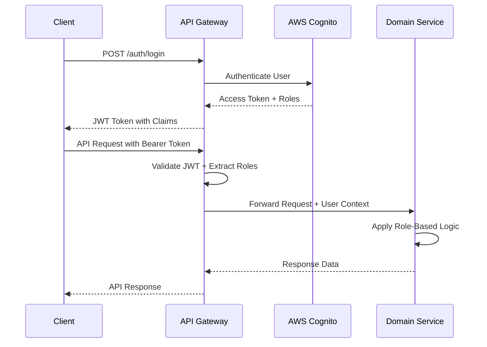
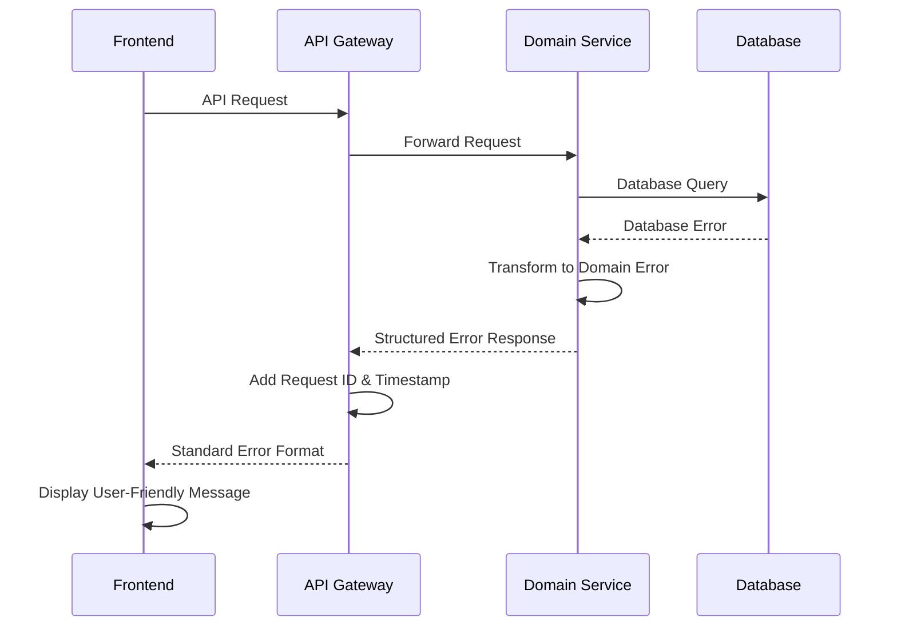

# Backend Architecture

This document outlines the core backend architecture for the BATbern Event Management Platform, including service patterns, authentication, authorization, and error handling strategies.

## Related Documentation

For detailed information on specific subsystems, see:
- **[Workflow State Machines](./06a-workflow-state-machines.md)** - Event workflow, speaker coordination, slot assignment, quality review, and overflow voting
- **[User Lifecycle Sync Patterns](./06b-user-lifecycle-sync.md)** - Cognito-PostgreSQL synchronization, JIT provisioning, and reconciliation
- **[Testing Strategy](./06c-testing-strategy.md)** - Testcontainers PostgreSQL setup, integration and unit testing patterns
- **[Notification System](./06d-notification-system.md)** - Real-time notifications, escalation rules, and multi-channel delivery

---

## Service Architecture Pattern

```
services/{domain-service}/
├── src/main/java/ch/batbern/{domain}/
│   ├── controller/                     # REST API controllers
│   ├── service/                        # Business logic layer
│   ├── repository/                     # Data access layer
│   ├── domain/                         # Domain models and entities
│   ├── dto/                           # Data transfer objects
│   ├── exception/                     # Custom exceptions
│   └── security/                      # Security components
├── src/main/resources/
│   ├── application.yml                # Configuration
│   └── db/migration/                  # Flyway migrations
└── build.gradle                      # Build configuration
```

## Authentication and Authorization

### JWT Authentication Flow



### Role-Based Security Configuration

```java
@Configuration
@EnableWebSecurity
@EnableMethodSecurity(prePostEnabled = true)
public class SecurityConfiguration {

    @Bean
    public SecurityFilterChain filterChain(HttpSecurity http) throws Exception {
        return http
            .csrf(csrf -> csrf.disable())
            .sessionManagement(session -> session.sessionCreationPolicy(SessionCreationPolicy.STATELESS))
            .authorizeHttpRequests(auth -> auth
                .requestMatchers("/actuator/health", "/actuator/info").permitAll()
                .requestMatchers("/api/v1/events").hasAnyRole("ORGANIZER", "ATTENDEE", "SPEAKER", "PARTNER")
                .requestMatchers(HttpMethod.POST, "/api/v1/events").hasRole("ORGANIZER")
                .requestMatchers("/api/v1/speakers/**").hasAnyRole("ORGANIZER", "SPEAKER")
                .requestMatchers("/api/v1/partners/**").hasAnyRole("ORGANIZER", "PARTNER")
                .requestMatchers("/api/v1/companies").hasAnyRole("ORGANIZER", "SPEAKER", "PARTNER")
                .anyRequest().authenticated()
            )
            .oauth2ResourceServer(oauth2 -> oauth2
                .jwt(jwt -> jwt
                    .jwtAuthenticationConverter(jwtAuthenticationConverter())
                    .jwtDecoder(jwtDecoder())
                )
            )
            .build();
    }

    @Bean
    public JwtAuthenticationConverter jwtAuthenticationConverter() {
        JwtGrantedAuthoritiesConverter authoritiesConverter = new JwtGrantedAuthoritiesConverter();
        authoritiesConverter.setAuthorityPrefix("ROLE_");
        authoritiesConverter.setAuthoritiesClaimName("cognito:groups");

        JwtAuthenticationConverter authenticationConverter = new JwtAuthenticationConverter();
        authenticationConverter.setJwtGrantedAuthoritiesConverter(authoritiesConverter);
        return authenticationConverter;
    }
}
```

### User Context Management

```java
@Component
public class SecurityContextHelper {

    public UserContext getCurrentUser() {
        // Implementation details - see source code
    }

    public boolean hasRole(String role) {
        // Implementation details - see source code
    }

    public boolean isOrganizer() {
        // Implementation details - see source code
    }

    public boolean canAccessCompany(String companyId) {
        // Implementation details - see source code
    }
}
```

## Error Handling Strategy

### Error Flow



### Error Response Format

```typescript
interface ApiError {
  error: {
    code: string;
    message: string;
    details?: Record<string, any>;
    timestamp: string;
    requestId: string;
    path: string;
    severity: string;
  };
}
```

### Comprehensive Exception Hierarchy

```java
// Base domain exception
public abstract class BATbernException extends RuntimeException {
    // Implementation details - see source code
}

// Domain-specific exceptions
@ResponseStatus(HttpStatus.NOT_FOUND)
public class EventNotFoundException extends BATbernException {
    // Implementation details - see source code
}

@ResponseStatus(HttpStatus.BAD_REQUEST)
public class InvalidEventStateException extends BATbernException {
    // Implementation details - see source code
}

@ResponseStatus(HttpStatus.CONFLICT)
public class SpeakerAlreadyInvitedException extends BATbernException {
    // Implementation details - see source code
}

@ResponseStatus(HttpStatus.UNPROCESSABLE_ENTITY)
public class BusinessValidationException extends BATbernException {
    // Implementation details - see source code
}

@ResponseStatus(HttpStatus.TOO_MANY_REQUESTS)
public class RateLimitExceededException extends BATbernException {
    // Implementation details - see source code
}
```

### Global Exception Handler

```java
@ControllerAdvice
@Slf4j
public class GlobalExceptionHandler {

    private final ErrorMessageResolver messageResolver;
    private final MetricRegistry metricRegistry;

    @ExceptionHandler(BATbernException.class)
    public ResponseEntity<ErrorResponse> handleBATbernException(BATbernException ex, HttpServletRequest request) {
        // Implementation details - see source code
    }

    @ExceptionHandler(MethodArgumentNotValidException.class)
    public ResponseEntity<ErrorResponse> handleValidationException(MethodArgumentNotValidException ex, HttpServletRequest request) {
        // Implementation details - see source code
    }

    @ExceptionHandler(DataIntegrityViolationException.class)
    public ResponseEntity<ErrorResponse> handleDataIntegrityViolation(DataIntegrityViolationException ex, HttpServletRequest request) {
        // Implementation details - see source code
    }

    @ExceptionHandler(Exception.class)
    public ResponseEntity<ErrorResponse> handleGenericException(Exception ex, HttpServletRequest request) {
        // Implementation details - see source code
    }
}
```

### Circuit Breaker Pattern Implementation

```java
@Component
@Slf4j
public class CircuitBreakerService {

    private final Map<String, CircuitBreaker> circuitBreakers = new ConcurrentHashMap<>();
    private final MetricRegistry metricRegistry;

    @Value("${circuit-breaker.failure-threshold:5}")
    private int failureThreshold;

    @Value("${circuit-breaker.timeout:60000}")
    private long timeoutMs;

    public <T> T executeWithCircuitBreaker(String serviceName, Supplier<T> operation, Supplier<T> fallback) {
        // Implementation details - see source code
    }

    private CircuitBreaker getOrCreateCircuitBreaker(String serviceName) {
        // Implementation details - see source code
    }
}

// Usage in service classes
@Service
@Slf4j
public class ExternalEmailService {

    private final CircuitBreakerService circuitBreakerService;
    private final EmailClient emailClient;

    public void sendEmail(EmailRequest request) {
        // Implementation details - see source code
    }
}
```

### Retry Mechanism with Exponential Backoff

```java
@Component
public class RetryService {

    @Retryable(
        value = {TransientException.class, TemporaryUnavailableException.class},
        maxAttempts = 3,
        backoff = @Backoff(delay = 1000, multiplier = 2, maxDelay = 10000)
    )
    public void executeWithRetry(Runnable operation) {
        // Implementation details - see source code
    }

    @Recover
    public void recover(Exception ex) {
        // Implementation details - see source code
    }
}
```

### Request Correlation and Context

```java
@Component
@Slf4j
public class RequestCorrelationFilter implements Filter {
    private static final String CORRELATION_ID_HEADER = "X-Correlation-ID";

    @Override
    public void doFilter(ServletRequest request, ServletResponse response, FilterChain chain)
            throws IOException, ServletException {
        // Implementation details - see source code
    }
}

public class RequestContext {
    private static final ThreadLocal<String> correlationId = new ThreadLocal<>();
    private static final ThreadLocal<UserContext> userContext = new ThreadLocal<>();

    public static String getCurrentRequestId() {
        // Implementation details - see source code
    }

    public static void setCorrelationId(String id) {
        // Implementation details - see source code
    }

    public static UserContext getCurrentUser() {
        // Implementation details - see source code
    }

    public static void setCurrentUser(UserContext user) {
        // Implementation details - see source code
    }

    public static void clear() {
        // Implementation details - see source code
    }
}
```

## Service Communication Patterns

### Domain Events

```java
@Component
@Slf4j
public class DomainEventPublisher {

    private final ApplicationEventPublisher eventPublisher;
    private final EventBridge eventBridge;

    public void publishEvent(DomainEvent event) {
        // Publish locally for same-service subscribers
        eventPublisher.publishEvent(event);

        // Publish to EventBridge for cross-service communication
        try {
            eventBridge.publishEvent(event);
            log.debug("Published domain event: {} with ID: {}", event.getEventType(), event.getId());
        } catch (Exception ex) {
            log.error("Failed to publish domain event to EventBridge: {}", event.getId(), ex);
            // Store for retry
            failedEventStore.store(event);
        }
    }
}

// Event listeners
@EventListener
@Async
public void handleSpeakerInvited(SpeakerInvitedEvent event) {
    log.info("Processing speaker invitation for speaker {} to event {}",
             event.getSpeakerId(), event.getEventId());

    // Implementation details - see source code
}
```

### Data Validation and Business Rules

```java
@Component
public class EventBusinessRules {

    public void validateEventCreation(CreateEventRequest request) {
        // Business rule: Event date must be at least 30 days in the future
        if (request.getEventDate().isBefore(LocalDateTime.now().plusDays(30))) {
            throw new BusinessValidationException(
                "eventDate",
                "Event date must be at least 30 days in the future",
                request.getEventDate()
            );
        }

        // Business rule: Only one event per quarter
        if (eventRepository.existsByQuarter(getQuarter(request.getEventDate()))) {
            throw new BusinessValidationException(
                "eventDate",
                "Only one event is allowed per quarter",
                getQuarter(request.getEventDate())
            );
        }
    }

    public void validateSpeakerInvitation(String speakerId, String eventId) {
        // Business rule: Speaker cannot be invited to multiple sessions in same time slot
        List<Session> conflictingSessions = sessionRepository.findConflictingSessions(speakerId, eventId);
        if (!conflictingSessions.isEmpty()) {
            throw new BusinessValidationException(
                "speakerId",
                "Speaker has conflicting sessions",
                Map.of("conflictingSessions", conflictingSessions.stream()
                      .map(Session::getId).collect(Collectors.toList()))
            );
        }
    }
}
```

## Workflow State Management

The BATbern platform implements sophisticated state machines to manage the complex 16-step event workflow. These include:

- **Event Workflow State Machine** - Manages event lifecycle from draft to published
- **Speaker Workflow Management** - Tracks speaker states from invitation to final agenda
- **Slot Assignment Algorithm** - Optimally assigns speakers to presentation slots
- **Quality Review Workflow** - Manages content review and approval process
- **Overflow Management & Voting** - Handles speaker overflow situations with voting

**See [Workflow State Machines](./06a-workflow-state-machines.md) for complete implementation details.**

## User Lifecycle and Synchronization

The platform maintains user data across AWS Cognito (authentication) and PostgreSQL (business logic) using a hybrid multi-pattern approach:

1. **Cognito Lambda Triggers** - Event-driven sync on user registration and authentication
2. **JIT Provisioning** - Self-healing user creation on first API request
3. **Saga-Based Bidirectional Sync** - Role changes with compensation logic
4. **Scheduled Reconciliation** - Daily drift detection and auto-fix

**See [User Lifecycle Sync Patterns](./06b-user-lifecycle-sync.md) for complete implementation details.**

## Role Management Service

Handles user role promotion, demotion, and approval workflows while enforcing business rules.

### Role Management Service Implementation

```java
@Service
@RequiredArgsConstructor
public class RoleManagementService {

    private final UserRoleRepository userRoleRepository;
    private final RoleChangeRequestRepository roleChangeRequestRepository;
    private final RoleChangeApprovalRepository roleChangeApprovalRepository;
    private final CognitoIdentityProviderClient cognitoClient;
    private final ApplicationEventPublisher eventPublisher;

    @Value("${aws.cognito.user-pool-id}")
    private String cognitoUserPoolId;

    /**
     * Promote user to a higher role
     */
    @Transactional
    public RoleChange promoteUser(UUID userId, UserRole targetRole, UUID promotedBy, String reason) {
        // Validate promotion eligibility
        validatePromotion(userId, targetRole);

        // Create role record
        UserRoleEntity roleEntity = UserRoleEntity.builder()
            .userId(userId)
            .role(targetRole)
            .grantedBy(promotedBy)
            .reason(reason)
            .isActive(true)
            .build();

        userRoleRepository.save(roleEntity);

        // Sync to Cognito
        syncRoleToCognito(userId, targetRole);

        // Publish domain event
        RoleChange roleChange = mapToRoleChange(roleEntity);
        eventPublisher.publishEvent(new UserRolePromotedEvent(roleChange));

        return roleChange;
    }

    /**
     * Demote user from role - immediate for Speaker, requires approval for Organizer
     */
    @Transactional
    public RoleChangeResult demoteUser(UUID userId, UserRole currentRole, UUID demotedBy, String reason) {
        if (currentRole == UserRole.ORGANIZER) {
            // Check minimum organizers rule
            if (!canDemoteOrganizer(userId, null)) {
                throw new BusinessRuleException("Cannot demote: minimum 2 organizers required");
            }

            // Create approval request
            RoleChangeRequest request = RoleChangeRequest.builder()
                .userId(userId)
                .currentRole(currentRole)
                .requestedRole(UserRole.ATTENDEE)
                .requestedBy(demotedBy)
                .requiresApprovalFrom(userId)
                .reason(reason)
                .status(RequestStatus.PENDING)
                .build();

            roleChangeRequestRepository.save(request);

            return RoleChangeResult.pendingApproval(request);
        } else {
            // Immediate demotion for non-organizers
            UserRoleEntity roleEntity = userRoleRepository
                .findActiveRole(userId, currentRole)
                .orElseThrow(() -> new NotFoundException("Active role not found"));

            roleEntity.setIsActive(false);
            roleEntity.setRevokedBy(demotedBy);
            roleEntity.setRevokedAt(Instant.now());

            userRoleRepository.save(roleEntity);

            // Sync to Cognito
            syncRoleToCognito(userId, determineNewRole(userId));

            RoleChange roleChange = mapToRoleChange(roleEntity);
            eventPublisher.publishEvent(new UserRoleDemotedEvent(roleChange));

            return RoleChangeResult.completed(roleChange);
        }
    }

    /**
     * Approve organizer demotion request
     */
    @Transactional
    public RoleChange approveRoleChange(UUID requestId, UUID approverId, boolean approved, String comments) {
        // Implementation details - see source code
    }

    /**
     * Check if organizer can be demoted (minimum 2 organizers rule)
     */
    public boolean canDemoteOrganizer(UUID userId, UUID eventId) {
        long activeOrganizerCount = userRoleRepository.countActiveOrganizers(eventId);
        return activeOrganizerCount > 2;
    }

    private void syncRoleToCognito(UUID userId, UserRole newRole) {
        // Implementation details - see source code
    }

    private UserRole determineNewRole(UUID userId) {
        // Implementation details - see source code
    }

    private void validatePromotion(UUID userId, UserRole targetRole) {
        // Implementation details - see source code
    }

    private RoleChange mapToRoleChange(UserRoleEntity entity) {
        // Implementation details - see source code
    }
}
```

## Real-time Notifications and Escalation

The platform provides multi-channel notifications (email, WebSocket) with intelligent escalation based on workflow state, user preferences, and deadline proximity.

**Key Features:**
- Real-time WebSocket notifications
- Email notifications with templating
- Automatic escalation for approaching deadlines
- User-configurable notification preferences
- Notification history and audit trail

**See [Notification System](./06d-notification-system.md) for complete implementation details.**

## Testing Strategy

The BATbern backend uses Testcontainers PostgreSQL for all integration tests to ensure production parity. This approach catches PostgreSQL-specific issues (JSONB, functions, constraints) that would be missed with H2.

**Testing Layers:**
- **E2E Tests** - Full user journeys with Playwright
- **Integration Tests** - REST API + PostgreSQL via Testcontainers
- **Unit Tests** - Business logic with mocked dependencies

**See [Testing Strategy](./06c-testing-strategy.md) for complete implementation details and examples.**

---

## Summary

This backend architecture provides:

✅ **Role-based security** with JWT authentication via AWS Cognito
✅ **Comprehensive error handling** with circuit breakers and retry logic
✅ **Sophisticated workflow state machines** for the 16-step event process
✅ **Robust user synchronization** across Cognito and PostgreSQL
✅ **Real-time notifications** with intelligent escalation
✅ **Production-parity testing** with Testcontainers PostgreSQL

The implementation follows domain-driven design principles with clear separation of concerns and robust error handling throughout the system.
