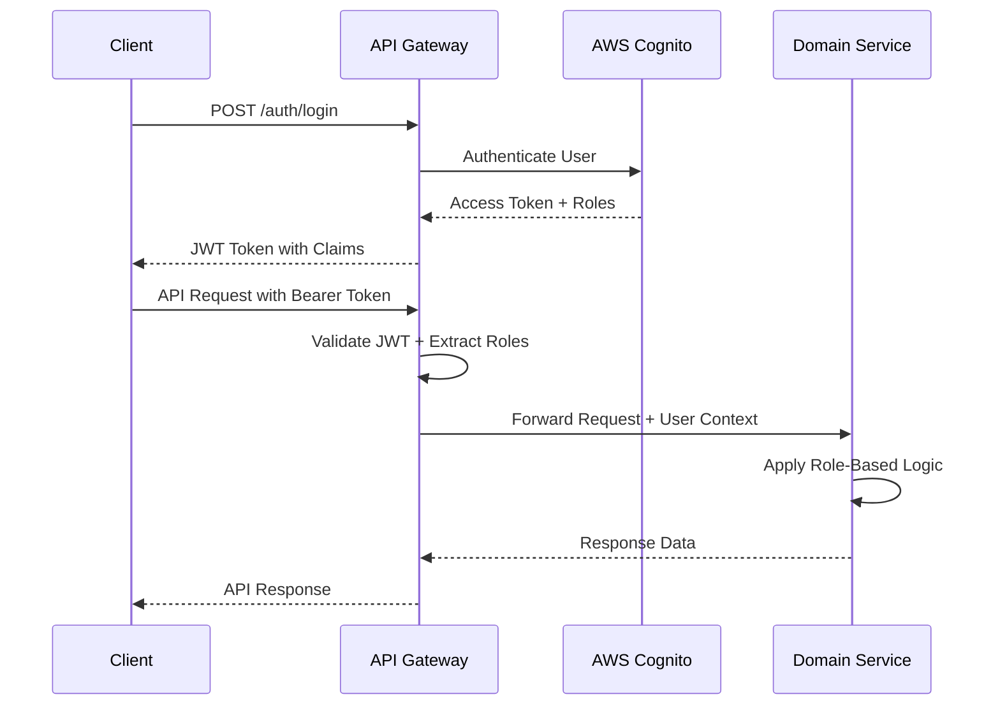
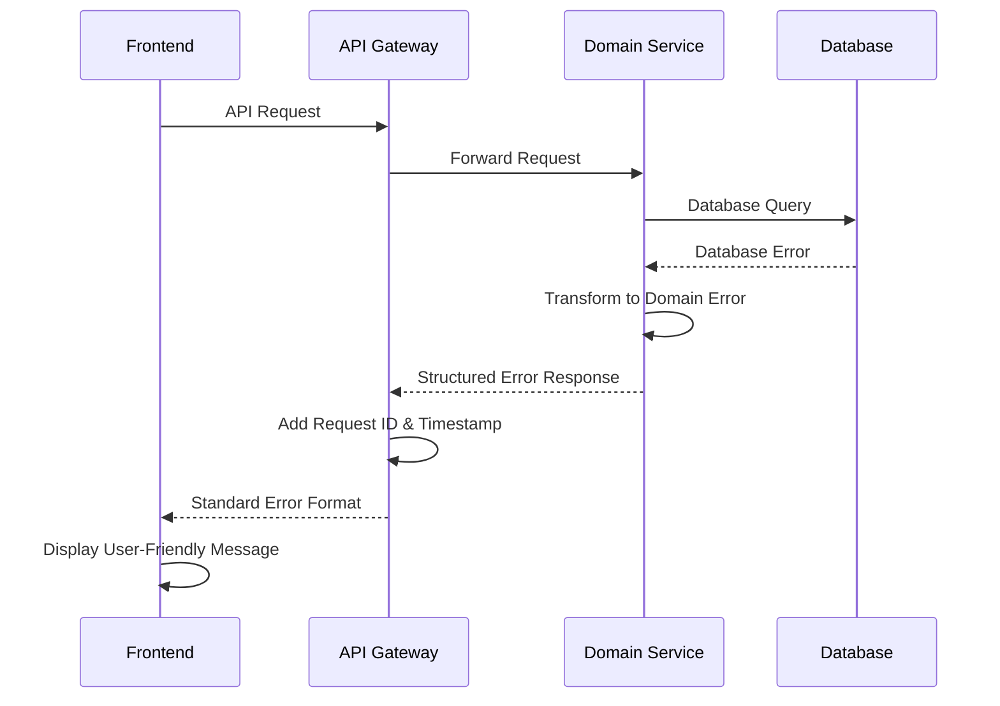

# Backend Architecture

This document outlines the core backend architecture for the BATbern Event Management Platform, including service patterns, authentication, authorization, and error handling strategies.

## Related Documentation

For detailed information on specific subsystems, see:
- **[Workflow State Machines](./06a-workflow-state-machines.md)** - Event workflow, speaker coordination, slot assignment, quality review, and overflow voting
- **[User Lifecycle Sync Patterns](./06b-user-lifecycle-sync.md)** - Unidirectional Cognito → PostgreSQL sync with Lambda triggers
- **[Testing Strategy](./06c-testing-strategy.md)** - Testcontainers PostgreSQL setup, integration and unit testing patterns
- **[Notification System](./06d-notification-system.md)** - Real-time notifications, escalation rules, and multi-channel delivery

---

## Service Architecture Pattern

```
services/{domain-service}/
├── src/main/java/ch/batbern/{domain}/
│   ├── controller/                     # REST API controllers
│   ├── service/                        # Business logic layer
│   ├── repository/                     # Data access layer
│   ├── domain/                         # Domain models and entities
│   ├── dto/                           # Data transfer objects
│   ├── exception/                     # Custom exceptions
│   └── security/                      # Security components
├── src/main/resources/
│   ├── application.yml                # Configuration
│   └── db/migration/                  # Flyway migrations
└── build.gradle                      # Build configuration
```

## Authentication and Authorization

### JWT Authentication Flow


```mermaid
sequenceDiagram
    participant C as Client
    participant GW as API Gateway
    participant Cognito as AWS Cognito
    participant Service as Domain Service

    C->>GW: POST /auth/login
    GW->>Cognito: Authenticate User
    Cognito-->>GW: Access Token + Roles
    GW-->>C: JWT Token with Claims

    C->>GW: API Request with Bearer Token
    GW->>GW: Validate JWT + Extract Roles
    GW->>Service: Forward Request + User Context
    Service->>Service: Apply Role-Based Logic
    Service-->>GW: Response Data
    GW-->>C: API Response
```

### Role-Based Security Configuration

> **Important:** Domain services do **not** validate JWTs themselves. JWT signature verification is performed exclusively by the API Gateway. Domain services trust all requests forwarded by the gateway and do not call `jwtDecoder()` or validate token signatures. Role-based access control at the service level is enforced via method-level annotations (`@PreAuthorize`) where needed, using the user context header injected by the gateway.

#### Public Endpoints (no authentication required)

The following endpoints are accessible without any token at the domain-service level:

| Pattern | Notes |
|---|---|
| `/actuator/health`, `/actuator/info` | Health probes |
| `/swagger-ui/**`, `/v3/api-docs/**` | API documentation |
| `GET /api/v1/events/**` | Event details, including `/current` |
| `GET /api/v1/events/{code}/sessions/**` | Session listings |
| `GET /api/v1/events/{code}/speakers/**` | Speaker listings (read-only) |
| `POST /api/v1/events/{code}/registrations` | Attendee registration creation |
| `POST /api/v1/events/{code}/registrations/confirm` | Registration confirmation |

Role-gated endpoints (e.g. `POST /api/v1/events`, organizer-only mutations) are enforced at the **API Gateway** layer before requests reach domain services.

```java
@Configuration
@EnableWebSecurity
public class SecurityConfiguration {

    @Bean
    public SecurityFilterChain filterChain(HttpSecurity http) throws Exception {
        return http
            .csrf(csrf -> csrf.disable())
            .sessionManagement(session -> session.sessionCreationPolicy(SessionCreationPolicy.STATELESS))
            .authorizeHttpRequests(auth -> auth
                // Health & docs — always public
                .requestMatchers("/actuator/health", "/actuator/info").permitAll()
                .requestMatchers("/swagger-ui/**", "/v3/api-docs/**").permitAll()
                // Public read endpoints — no auth required
                .requestMatchers(HttpMethod.GET, "/api/v1/events/**").permitAll()
                .requestMatchers(HttpMethod.GET, "/api/v1/events/*/sessions/**").permitAll()
                .requestMatchers(HttpMethod.GET, "/api/v1/events/*/speakers/**").permitAll()
                // Public write endpoints — registration flow
                .requestMatchers(HttpMethod.POST, "/api/v1/events/*/registrations").permitAll()
                .requestMatchers(HttpMethod.POST, "/api/v1/events/*/registrations/confirm").permitAll()
                // Everything else: trust the gateway-injected user context
                .anyRequest().permitAll()
            )
            .build();
        // No oauth2ResourceServer / jwtDecoder — JWT validation is the gateway's responsibility
    }

    @Bean
    public JwtAuthenticationConverter jwtAuthenticationConverter() {
        JwtAuthenticationConverter converter = new JwtAuthenticationConverter();
        converter.setJwtGrantedAuthoritiesConverter(this::extractAuthorities);
        return converter;
    }

    private Collection<GrantedAuthority> extractAuthorities(Jwt jwt) {
        // Extract custom:role claim from JWT (populated by PreTokenGeneration Lambda)
        String rolesString = jwt.getClaimAsString("custom:role");

        if (rolesString == null || rolesString.isEmpty()) {
            return Collections.emptyList();
        }

        // Split comma-separated roles and map to Spring Security authorities
        // "ATTENDEE,SPEAKER" → [ROLE_ATTENDEE, ROLE_SPEAKER]
        return Arrays.stream(rolesString.split(","))
            .map(role -> new SimpleGrantedAuthority("ROLE_" + role.trim()))
            .collect(Collectors.toList());
    }
}
```

### User Context Management

```java
@Component
public class SecurityContextHelper {

    public UserContext getCurrentUser() {
        // Implementation details - see source code
    }

    public boolean hasRole(String role) {
        // Implementation details - see source code
    }

    public boolean isOrganizer() {
        // Implementation details - see source code
    }

    public boolean canAccessCompany(String companyId) {
        // Implementation details - see source code
    }
}
```

## Error Handling Strategy

### Error Flow


```mermaid
sequenceDiagram
    participant FE as Frontend
    participant GW as API Gateway
    participant Service as Domain Service
    participant DB as Database

    FE->>GW: API Request
    GW->>Service: Forward Request
    Service->>DB: Database Query
    DB-->>Service: Database Error
    Service->>Service: Transform to Domain Error
    Service-->>GW: Structured Error Response
    GW->>GW: Add Request ID & Timestamp
    GW-->>FE: Standard Error Format
    FE->>FE: Display User-Friendly Message
```

### Error Response Format

```typescript
interface ApiError {
  error: {
    code: string;
    message: string;
    details?: Record<string, any>;
    timestamp: string;
    requestId: string;
    path: string;
    severity: string;
  };
}
```

### Comprehensive Exception Hierarchy

```java
// Base domain exception
public abstract class BATbernException extends RuntimeException {
    // Implementation details - see source code
}

// Domain-specific exceptions
@ResponseStatus(HttpStatus.NOT_FOUND)
public class EventNotFoundException extends BATbernException {
    // Implementation details - see source code
}

@ResponseStatus(HttpStatus.BAD_REQUEST)
public class InvalidEventStateException extends BATbernException {
    // Implementation details - see source code
}

@ResponseStatus(HttpStatus.CONFLICT)
public class SpeakerAlreadyInvitedException extends BATbernException {
    // Implementation details - see source code
}

@ResponseStatus(HttpStatus.UNPROCESSABLE_ENTITY)
public class BusinessValidationException extends BATbernException {
    // Implementation details - see source code
}

@ResponseStatus(HttpStatus.TOO_MANY_REQUESTS)
public class RateLimitExceededException extends BATbernException {
    // Implementation details - see source code
}
```

### Global Exception Handler

```java
@ControllerAdvice
@Slf4j
public class GlobalExceptionHandler {

    private final ErrorMessageResolver messageResolver;
    private final MetricRegistry metricRegistry;

    @ExceptionHandler(BATbernException.class)
    public ResponseEntity<ErrorResponse> handleBATbernException(BATbernException ex, HttpServletRequest request) {
        // Implementation details - see source code
    }

    @ExceptionHandler(MethodArgumentNotValidException.class)
    public ResponseEntity<ErrorResponse> handleValidationException(MethodArgumentNotValidException ex, HttpServletRequest request) {
        // Implementation details - see source code
    }

    @ExceptionHandler(DataIntegrityViolationException.class)
    public ResponseEntity<ErrorResponse> handleDataIntegrityViolation(DataIntegrityViolationException ex, HttpServletRequest request) {
        // Implementation details - see source code
    }

    @ExceptionHandler(Exception.class)
    public ResponseEntity<ErrorResponse> handleGenericException(Exception ex, HttpServletRequest request) {
        // Implementation details - see source code
    }
}
```

### Circuit Breaker Pattern Implementation

The platform uses **Resilience4j** circuit breakers (not a bespoke `CircuitBreakerService`). Configuration is rate-based, not count-based:

```yaml
# application-shared.yml (shared across services)
resilience4j:
  circuitbreaker:
    instances:
      eventBridgePublisher:
        failureRateThreshold: 60          # open after 60% failure rate (not a fixed count)
        waitDurationInOpenState: 10s       # 10 seconds in open state (not 60 000 ms)
        permittedNumberOfCallsInHalfOpenState: 5
        slidingWindowSize: 10
        minimumNumberOfCalls: 5
```

```java
// Usage via Resilience4j annotation
@CircuitBreaker(name = "eventBridgePublisher", fallbackMethod = "storeForRetry")
public void publishEvent(DomainEvent event) {
    // Implementation details - see source code
}

private void storeForRetry(DomainEvent event, Exception ex) {
    // Store event for later retry
    failedEventStore.store(event);
}
```

### Retry Mechanism with Exponential Backoff

```java
@Component
public class RetryService {

    @Retryable(
        value = {TransientException.class, TemporaryUnavailableException.class},
        maxAttempts = 3,
        backoff = @Backoff(delay = 1000, multiplier = 2, maxDelay = 10000)
    )
    public void executeWithRetry(Runnable operation) {
        // Implementation details - see source code
    }

    @Recover
    public void recover(Exception ex) {
        // Implementation details - see source code
    }
}
```

### Request Correlation and Context

```java
@Component
@Slf4j
public class RequestCorrelationFilter implements Filter {
    private static final String CORRELATION_ID_HEADER = "X-Correlation-ID";

    @Override
    public void doFilter(ServletRequest request, ServletResponse response, FilterChain chain)
            throws IOException, ServletException {
        // Implementation details - see source code
    }
}

public class RequestContext {
    private static final ThreadLocal<String> correlationId = new ThreadLocal<>();
    private static final ThreadLocal<UserContext> userContext = new ThreadLocal<>();

    public static String getCurrentRequestId() {
        // Implementation details - see source code
    }

    public static void setCorrelationId(String id) {
        // Implementation details - see source code
    }

    public static UserContext getCurrentUser() {
        // Implementation details - see source code
    }

    public static void setCurrentUser(UserContext user) {
        // Implementation details - see source code
    }

    public static void clear() {
        // Implementation details - see source code
    }
}
```

## Service Communication Patterns

### Domain Events

```java
@Component
@Slf4j
public class DomainEventPublisher {

    private final ApplicationEventPublisher eventPublisher;
    private final EventBridge eventBridge;

    public void publishEvent(DomainEvent event) {
        // Publish locally for same-service subscribers
        eventPublisher.publishEvent(event);

        // Publish to EventBridge for cross-service communication
        try {
            eventBridge.publishEvent(event);
            log.debug("Published domain event: {} with ID: {}", event.getEventType(), event.getId());
        } catch (Exception ex) {
            log.error("Failed to publish domain event to EventBridge: {}", event.getId(), ex);
            // Store for retry
            failedEventStore.store(event);
        }
    }
}

// Event listeners
@EventListener
@Async
public void handleSpeakerInvited(SpeakerInvitedEvent event) {
    log.info("Processing speaker invitation for speaker {} to event {}",
             event.getSpeakerId(), event.getEventId());

    // Implementation details - see source code
}
```

### Data Validation and Business Rules

```java
@Component
public class EventBusinessRules {

    public void validateEventCreation(CreateEventRequest request) {
        // Business rule: Event date must be at least 30 days in the future
        if (request.getEventDate().isBefore(LocalDateTime.now().plusDays(30))) {
            throw new BusinessValidationException(
                "eventDate",
                "Event date must be at least 30 days in the future",
                request.getEventDate()
            );
        }

        // Business rule: Only one event per quarter
        if (eventRepository.existsByQuarter(getQuarter(request.getEventDate()))) {
            throw new BusinessValidationException(
                "eventDate",
                "Only one event is allowed per quarter",
                getQuarter(request.getEventDate())
            );
        }
    }

    public void validateSpeakerInvitation(String speakerId, String eventId) {
        // Business rule: Speaker cannot be invited to multiple sessions in same time slot
        List<Session> conflictingSessions = sessionRepository.findConflictingSessions(speakerId, eventId);
        if (!conflictingSessions.isEmpty()) {
            throw new BusinessValidationException(
                "speakerId",
                "Speaker has conflicting sessions",
                Map.of("conflictingSessions", conflictingSessions.stream()
                      .map(Session::getId).collect(Collectors.toList()))
            );
        }
    }
}
```

#### Conflict Detection Severities

The `ConflictDetectionService` distinguishes between hard errors and soft warnings:

| Conflict Type | Severity | Blocking |
|---|---|---|
| `ROOM_OVERLAP` — two sessions in the same room at overlapping times | `ERROR` | Yes — slot assignment is rejected |
| `SPEAKER_DOUBLE_BOOKED` — same speaker assigned to overlapping sessions | `ERROR` | Yes — slot assignment is rejected |
| `PREFERENCE_MISMATCH` — session scheduled outside speaker's preferred time window | `WARNING` | No — informational only, assignment proceeds |

## Workflow State Management

The BATbern platform implements sophisticated state machines to manage the complex 9-state event workflow. These include:

- **Event Workflow State Machine** - Manages event lifecycle from draft to published
- **Speaker Workflow Management** - Tracks speaker states from invitation to final agenda
- **Slot Assignment Algorithm** - Optimally assigns speakers to presentation slots
- **Quality Review Workflow** - Manages content review and approval process
- **Overflow Management & Voting** - Handles speaker overflow situations with voting

**See [Workflow State Machines](./06a-workflow-state-machines.md) for complete implementation details.**

## User Lifecycle and Synchronization

The platform maintains user data across AWS Cognito (authentication) and PostgreSQL (business logic) using a **database-centric approach** per [ADR-001](./ADR-001-invitation-based-user-registration.md):

1. **PostConfirmation Lambda** - Creates database user on Cognito email verification
2. **PreTokenGeneration Lambda** - Adds `custom:role` JWT claim from database
3. **Spring Security** - Extracts roles from JWT for authorization
4. **Unidirectional Sync** - Cognito → Database only (NO Cognito Groups, NO reverse sync)

**Key Point**: Roles are stored as a `Set<Role>` directly on the `User` entity (not in a separate `role_assignments` table). Roles are synced to the JWT at login time, cached for request duration. Role updates take effect on the next login.

**See [User Lifecycle Sync Patterns](./06b-user-lifecycle-sync.md) for complete implementation details.**

## Role Management Service

Handles user role promotion, demotion, and approval workflows while enforcing business rules.

**Deployed implementation:** The production `RoleService` stores roles as a `Set<Role>` on the `User` entity and injects `UserRepository` only — there is no separate `UserRoleRepository` or `role_assignments` table. Role lookups use `userRepository.findByRolesContaining(Role.ORGANIZER)`.

**Idempotency:** `addRole` and `removeRole` are idempotent. A `UserRoleChangedEvent` is only published when the role set actually changes (i.e. if the role was already present on add, or already absent on remove, no event is published).

> **Note:** The snippet below is a design reference that documents the intended approval-workflow shape. The deployed `RoleService` is simpler; refer to source for the exact implementation.

### Role Management Service Implementation (design reference)

```java
@Service
@RequiredArgsConstructor
public class RoleManagementService {

    private final UserRoleRepository userRoleRepository;
    private final RoleChangeRequestRepository roleChangeRequestRepository;
    private final RoleChangeApprovalRepository roleChangeApprovalRepository;
    private final CognitoIdentityProviderClient cognitoClient;
    private final ApplicationEventPublisher eventPublisher;

    @Value("${aws.cognito.user-pool-id}")
    private String cognitoUserPoolId;

    /**
     * Promote user to a higher role
     * Story 1.16.2: Uses String username instead of UUID
     */
    @Transactional
    public RoleChange promoteUser(String username, UserRole targetRole, String promotedByUsername, String reason) {
        // Validate promotion eligibility
        validatePromotion(username, targetRole);

        // Create role record
        UserRoleEntity roleEntity = UserRoleEntity.builder()
            .username(username)  // Story 1.16.2: Store username, not UUID
            .role(targetRole)
            .grantedBy(promotedByUsername)  // Story 1.16.2: Store username, not UUID
            .reason(reason)
            .isActive(true)
            .build();

        userRoleRepository.save(roleEntity);

        // NO Cognito sync - roles fetched from database on next login via PreTokenGeneration Lambda
        // Per ADR-001: Database is single source of truth for roles

        // Publish domain event
        // Story 1.16.2: Event uses String username as aggregateId
        RoleChange roleChange = mapToRoleChange(roleEntity);
        eventPublisher.publishEvent(new UserRolePromotedEvent(roleChange));

        return roleChange;
    }

    /**
     * Demote user from role - immediate for Speaker, requires approval for Organizer
     * Story 1.16.2: Uses String username instead of UUID
     */
    @Transactional
    public RoleChangeResult demoteUser(String username, UserRole currentRole, String demotedByUsername, String reason) {
        if (currentRole == UserRole.ORGANIZER) {
            // Check minimum organizers rule
            if (!canDemoteOrganizer(username, null)) {
                throw new BusinessRuleException("Cannot demote: minimum 2 organizers required");
            }

            // Create approval request
            RoleChangeRequest request = RoleChangeRequest.builder()
                .username(username)  // Story 1.16.2: Store username, not UUID
                .currentRole(currentRole)
                .requestedRole(UserRole.ATTENDEE)
                .requestedBy(demotedByUsername)  // Story 1.16.2: Store username, not UUID
                .requiresApprovalFrom(username)
                .reason(reason)
                .status(RequestStatus.PENDING)
                .build();

            roleChangeRequestRepository.save(request);

            return RoleChangeResult.pendingApproval(request);
        } else {
            // Immediate demotion for non-organizers
            UserRoleEntity roleEntity = userRoleRepository
                .findActiveRole(username, currentRole)
                .orElseThrow(() -> new NotFoundException("Active role not found"));

            roleEntity.setIsActive(false);
            roleEntity.setRevokedBy(demotedBy);
            roleEntity.setRevokedAt(Instant.now());

            userRoleRepository.save(roleEntity);

            // NO Cognito sync - roles fetched from database on next login
            // Per ADR-001: Database is single source of truth for roles

            RoleChange roleChange = mapToRoleChange(roleEntity);
            eventPublisher.publishEvent(new UserRoleDemotedEvent(roleChange));

            return RoleChangeResult.completed(roleChange);
        }
    }

    /**
     * Approve organizer demotion request
     * Story 1.16.2: Uses String username instead of UUID
     */
    @Transactional
    public RoleChange approveRoleChange(UUID requestId, String approverUsername, boolean approved, String comments) {
        // Implementation details - see source code
    }

    /**
     * Check if organizer can be demoted (minimum 2 organizers rule)
     * Story 1.16.2: Uses String username instead of UUID
     */
    public boolean canDemoteOrganizer(String username, String eventCode) {
        long activeOrganizerCount = userRoleRepository.countActiveOrganizers(eventCode);
        return activeOrganizerCount >= 2;
    }

    // syncRoleToCognito removed - per ADR-001, roles NOT synced to Cognito
    // Roles stored in database only, added to JWT via PreTokenGeneration Lambda

    private UserRole determineNewRole(String username) {
        // Implementation details - see source code
    }

    private void validatePromotion(String username, UserRole targetRole) {
        // Implementation details - see source code
    }

    private RoleChange mapToRoleChange(UserRoleEntity entity) {
        // Implementation details - see source code
    }
}
```

## Real-time Notifications and Escalation

The platform provides multi-channel notifications (email, WebSocket) with intelligent escalation based on workflow state, user preferences, and deadline proximity.

**Key Features:**
- Real-time WebSocket notifications
- Email notifications with templating
- Automatic escalation for approaching deadlines
- User-configurable notification preferences
- Notification history and audit trail

**See [Notification System](./06d-notification-system.md) for complete implementation details.**

## Testing Strategy

The BATbern backend uses Testcontainers PostgreSQL for all integration tests to ensure production parity. This approach catches PostgreSQL-specific issues (JSONB, functions, constraints) that would be missed with H2.

**Testing Layers:**
- **E2E Tests** - Full user journeys with Playwright
- **Integration Tests** - REST API + PostgreSQL via Testcontainers
- **Unit Tests** - Business logic with mocked dependencies

**See [Testing Strategy](./06c-testing-strategy.md) for complete implementation details and examples.**

---

## Summary

This backend architecture provides:

✅ **Role-based security** with JWT authentication via AWS Cognito
✅ **Comprehensive error handling** with circuit breakers and retry logic
✅ **Sophisticated workflow state machines** for the 9-state event process
✅ **Robust user synchronization** across Cognito and PostgreSQL
✅ **Real-time notifications** with intelligent escalation
✅ **Production-parity testing** with Testcontainers PostgreSQL

The implementation follows domain-driven design principles with clear separation of concerns and robust error handling throughout the system.
