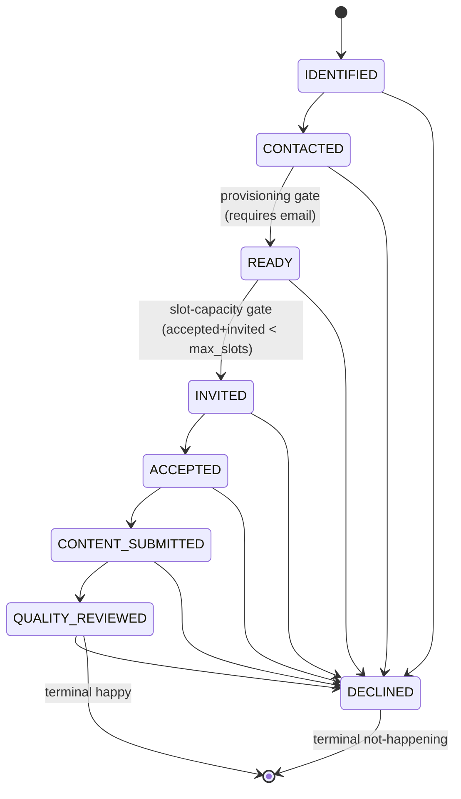

# Workflow State Machines

This document details the workflow state management systems for the BATbern Event Management Platform, including event lifecycle, speaker coordination (unified 8-state machine per ADR-009), task management, slot assignment, and quality review.

## Overview

The BATbern platform implements sophisticated state machines to manage event workflows. **Key architectural insight:** The original "16-step linear workflow" was a misconception. The actual implementation uses:

1. **Event Workflow**: 8-state state machine for high-level event lifecycle
2. **Speaker Workflow**: Per-speaker state machine with parallel progression (quality review and slot assignment can happen in any order)
3. **Task System**: Configurable tasks (newsletters, catering, etc.) separate from workflow states

These state machines ensure proper transition validation, business rule enforcement, and event-driven notifications.

## Workflow Architecture Redesign (2025-12-19)

**Discovery:** During Stories 5.1-5.4 implementation, we discovered that:
- Event progresses through high-level states while speakers progress individually in parallel
- Quality review and slot assignment are independent (can happen in any order per speaker)
- Tasks like newsletters, catering, partner meetings are assignable work items, not workflow states

This led to a complete redesign from 16 stories to 8 stories, with clearer separation of concerns.

## Event Workflow State Machine (8 States)

### State Diagram

```
CREATED → TOPIC_SELECTION → SPEAKER_IDENTIFICATION → SLOT_ASSIGNMENT →
AGENDA_PUBLISHED → EVENT_LIVE → EVENT_COMPLETED → ARCHIVED
```

> **Skip transition:** `CREATED` may transition directly to `SPEAKER_IDENTIFICATION` (skipping `TOPIC_SELECTION`) if a speaker is added to the pool before a topic is formally selected. This is an explicitly allowed path in the transition validator.

> **Historical note:** An `AGENDA_FINALIZED` state was removed during implementation (see inline test comment: "Direct scheduler transition (AGENDA_FINALIZED removed)"). The transition now goes directly from `AGENDA_PUBLISHED` to `EVENT_LIVE`. The 14-day-before-event guard that was attached to `AGENDA_FINALIZED` is no longer part of the workflow.

### State Definitions

| State | Description | Entry Condition | Exit Condition |
|-------|-------------|-----------------|----------------|
| **CREATED** | Event created, no topic selected | Event created | Topic selected |
| **TOPIC_SELECTION** | Topic selected, brainstorming speakers | Topic selected | Minimum speakers in pool |
| **SPEAKER_IDENTIFICATION** | Building speaker pool, outreach in progress | Min speakers in pool | All slots filled (after overflow if needed) |
| **SLOT_ASSIGNMENT** | Speakers assigned to time slots | All slots filled | Agenda published |
| **AGENDA_PUBLISHED** | Agenda public, accepting registrations | Agenda published | Event day (direct scheduler transition) |
| **EVENT_LIVE** | Event currently happening | Event day | Manual trigger after event |
| **EVENT_COMPLETED** | Event finished, post-processing | After event | Auto: daily scheduler 02:00 Bern time, 14 days after event date |
| **ARCHIVED** | Event archived | Auto-archived when event date is **more than** 14 days in the past (exclusive boundary: exactly 14 days does not qualify); or manual trigger | Terminal state |

### Post-Event Window (14-Day Rule)

After an event transitions to **EVENT_COMPLETED**, it enters a 14-day public-visibility window before being auto-archived:

- **During the window (days 0–14 after event date):**
  - `getCurrentEvent()` query: Phase 1 checks for upcoming/live events; Phase 2 falls back to the most recent EVENT_COMPLETED event within the 14-day window.
  - The homepage renders the event with an **archive-style UI**: timetable and speakers visible; no registration form, no logistics/venue block.
  - A 404 is NOT returned — the event is still surfaced to the public.

- **After 14 days:**
  - `processEventsToArchive()` runs at **02:00 Bern time** via a daily ShedLock-guarded scheduler.
  - It transitions all qualifying EVENT_COMPLETED events to ARCHIVED.
  - From this point, `getCurrentEvent()` returns 404 if no future event is active.

**Implementation note:** The scheduler lives in `event-management-service` and is guarded by ShedLock to prevent duplicate execution across ECS tasks. The archive-style homepage UI is determined in the frontend by checking `event.workflowState === 'EVENT_COMPLETED'`.

### Implementation

```java
@Component
@Slf4j
public class EventWorkflowStateMachine {

    private final EventRepository eventRepository;
    private final SpeakerPoolRepository speakerPoolRepository;
    private final WorkflowTransitionValidator transitionValidator;
    private final DomainEventPublisher eventPublisher;
    private final EventTaskService eventTaskService;

    public Event transitionToState(String eventCode, EventWorkflowState targetState, String organizerUsername) {
        Event event = eventRepository.findByEventCode(eventCode)
            .orElseThrow(() -> new EntityNotFoundException("Event not found: " + eventCode));

        EventWorkflowState currentState = event.getWorkflowState();

        // Validate transition is allowed
        transitionValidator.validateTransition(currentState, targetState, event);

        // Apply state-specific business logic
        switch (targetState) {
            case TOPIC_SELECTION:
                // No validation needed - just topic selected
                break;

            case SPEAKER_IDENTIFICATION:
                validateMinimumSpeakersInPool(event);
                break;

            case SLOT_ASSIGNMENT:
                validateAllSlotsHaveSpeakers(event);
                break;

            case AGENDA_PUBLISHED:
                validateAllSpeakersConfirmed(event);
                break;

            case EVENT_LIVE:
                // Auto-triggered on event day
                break;

            case EVENT_COMPLETED:
                validateEventDateInPast(event);
                break;

            case ARCHIVED:
                // Manual archival
                break;
        }

        // Update state
        event.setWorkflowState(targetState);
        event.setUpdatedBy(organizerUsername);
        event.setUpdatedAt(Instant.now());

        Event savedEvent = eventRepository.save(event);

        // Publish state transition event (triggers task auto-creation)
        EventWorkflowTransitionEvent transitionEvent = new EventWorkflowTransitionEvent(
            eventCode, currentState, targetState, organizerUsername, Instant.now(), event
        );
        eventPublisher.publish(transitionEvent);

        log.info("Event {} transitioned from {} to {} by organizer {}",
                 eventCode, currentState, targetState, organizerUsername);

        return savedEvent;
    }

    /**
     * Validates minimum speakers are in speaker_pool (not necessarily accepted yet)
     */
    private void validateMinimumSpeakersInPool(Event event) {
        int requiredSpeakers = event.getSlotConfiguration().getMinSlots();
        long speakersInPool = speakerPoolRepository.countByEventId(event.getId());

        if (speakersInPool < requiredSpeakers) {
            throw new WorkflowValidationException(
                "Insufficient speakers in pool",
                Map.of("required", requiredSpeakers, "inPool", speakersInPool)
            );
        }
    }

    /**
     * Validates all slots have publishable speakers assigned.
     *
     * Per ADR-009: `is_publishable` is a DERIVED predicate, not a stored column —
     * a speaker is publishable when speaker_pool.status = QUALITY_REVIEWED AND
     * session.start_time IS NOT NULL.
     */
    private void validateAllSlotsHaveSpeakers(Event event) {
        int maxSlots = event.getSlotConfiguration().getMaxSlots();
        long publishableSpeakers = speakerPoolRepository
            .countPublishableByEventId(event.getId());  // QUALITY_REVIEWED ∧ session.start_time NOT NULL

        if (publishableSpeakers < maxSlots) {
            throw new WorkflowValidationException(
                "Minimum threshold not met",
                Map.of("maxSlots", maxSlots, "publishable", publishableSpeakers)
            );
        }
    }

    /**
     * Validates every ACCEPTED speaker is publishable.
     *
     * Per ADR-009: there is no CONFIRMED state. `is_publishable` is derived at read
     * time — a speaker is publishable when speaker_pool.status = QUALITY_REVIEWED
     * AND session.start_time IS NOT NULL. This predicate is the gate for the
     * AGENDA_PUBLISHED transition.
     */
    private void validateAllSpeakersConfirmed(Event event) {
        long acceptedSpeakers = speakerPoolRepository
            .countByEventIdAndStatus(event.getId(), "accepted");

        long publishableSpeakers = speakerPoolRepository
            .countPublishableByEventId(event.getId());  // QUALITY_REVIEWED ∧ session.start_time NOT NULL

        if (acceptedSpeakers > publishableSpeakers) {
            throw new WorkflowValidationException(
                "Not all accepted speakers are publishable",
                Map.of("accepted", acceptedSpeakers, "publishable", publishableSpeakers)
            );
        }
    }
}
```

## Speaker Workflow Management (Per Speaker - Parallel)

Per **ADR-009 (Unified Speaker Workflow)**, the speaker workflow is an 8-state machine. Every change to `speaker_pool.status` flows through a single entry point — `SpeakerWorkflowService.transition()` — which enforces the allow-list, runs state-specific preconditions, executes side-effect hooks, persists the new status, writes a status-history row, and publishes a domain event. There is no separate `StatusTransitionValidator`; there are no direct `setStatus` calls in response handlers. The legacy 10-state model (with `CONFIRMED`, `SLOT_ASSIGNED`, `OVERFLOW`, `WITHDREW`, `TENTATIVE`) and the parallel-quality / slot-confirmed auto-confirmation logic are removed.

### State Diagram



`DECLINED` is reachable from every non-terminal state. A speaker who accepts and then drops out transitions to `DECLINED` with a reason recorded in `status_history` — the previous state plus the reason carries exactly the information a separate `WITHDREW` state used to encode.

### State Definitions

| State | Description | `speaker_pool.username` | Cognito user |
|-------|-------------|--------------------------|--------------|
| **IDENTIFIED** | Name on the brainstorm list. May be a candidate, a lead, or a contact the organizer plans to ask. | NULL | none |
| **CONTACTED** | Organizer is reaching out — to the candidate, to partners, to network contacts — to figure out who will actually speak. **Still brainstorming.** All conversations logged via `OutreachHistory`. No User row exists yet; no email is sent at this state. | NULL | none |
| **READY** | The real speaker has been identified. Organizer has a name + email and has committed to inviting this specific person. **User provisioning happens at the transition into this state** (per ADR-009 §0.5). | populated | created (FORCE_CHANGE_PASSWORD), SPEAKER role granted |
| **INVITED** | Formal invitation email sent (login URL + temporary password). Speaker can authenticate via standard Cognito. | populated | exists, SPEAKER role |
| **ACCEPTED** | Speaker committed via the speaker portal (or via organizer-on-behalf). | populated | exists |
| **CONTENT_SUBMITTED** | Title + abstract submitted (with optional bio/portrait/presentation, by speaker or by organizer). | populated | exists |
| **QUALITY_REVIEWED** | Moderator approved content. **Terminal happy state.** Combined with `session.start_time IS NOT NULL`, this makes the speaker `publishable`. | populated | exists |
| **DECLINED** | The single terminal "not happening" state. Reachable from every non-terminal state. Covers leads that didn't pan out (from IDENTIFIED/CONTACTED), refusals to an invitation (from INVITED), and post-acceptance withdrawals (from ACCEPTED/CONTENT_SUBMITTED/QUALITY_REVIEWED). Status-history row records the previous state and reason. | NULL if from IDENTIFIED/CONTACTED, populated otherwise | may exist |

**Removed states** (per ADR-009 §0.7):
- `SLOT_ASSIGNED` — replaced by the derived `is_slot_assigned` flag.
- `CONFIRMED` — replaced by the derived `is_publishable` flag (`QUALITY_REVIEWED ∧ is_slot_assigned`).
- `OVERFLOW` — replaced by the slot-capacity gate at `READY → INVITED`. If too many speakers accept (e.g., because capacity was reduced after invitations went out), the organizer manually moves the excess to `DECLINED` with a clear reason.
- `WITHDREW` — collapsed into `DECLINED` with the reason recorded in `status_history`.
- `TENTATIVE` — removed entirely; speakers respond `ACCEPT` or `DECLINE` only. The side-channel `is_tentative` / `tentative_reason` columns are dropped.

### Derived flags (read-time, no persisted columns)

`is_slot_assigned` and `is_publishable` are predicates computed at read time. They are **not stored on `speaker_pool`**. Per ADR-009 §0.1:

| Predicate | Definition |
|---|---|
| `is_slot_assigned` | `session.start_time IS NOT NULL` (looked up via `speaker_pool.session_id → sessions`) |
| `is_publishable` | `speaker_pool.status = QUALITY_REVIEWED AND is_slot_assigned` |

Use `is_publishable` as the gate for the `AGENDA_PUBLISHED` event-workflow transition (`EventWorkflowStateMachine.validateAllSpeakersConfirmed`, above): every speaker the event depends on must be publishable for the agenda to publish. The repository exposes a `countPublishableByEventId(eventId)` query for this check.

### Critical transition rules

- **`CONTACTED → READY` is the provisioning gate** (ADR-009 §0.2). It REQUIRES `email` to be present in the transition payload, and the side-effect hook performs: User lookup-or-create + Cognito `AdminCreateUser` (silent, `MessageAction=SUPPRESS`, with a throwaway temp password) → `FORCE_CHANGE_PASSWORD` + SPEAKER role grant in `role_assignments` + persisting `username` on `speaker_pool`. Re-running for an already-provisioned user is idempotent and skips the Cognito call. Story 11.E.2 (Resolved Q#1 Variant B): the throwaway temp password is **never returned** to the caller — the speaker's real temp password is issued at READY → INVITED via the sibling `/users/{username}/issue-invitation-credentials` endpoint (see READY → INVITED row below).
- **`READY → INVITED` has the slot-capacity precondition** (ADR-009 §0.2). Blocked when `(count(ACCEPTED) + count(INVITED)) >= max_slots`. If a slot opens up (e.g., an invited speaker declines), the next speaker in `READY` may be invited.
- **No emails before `READY → INVITED`.** The "send formal invitation" UI is disabled until the speaker is in `READY`.
- **`IDENTIFIED → DECLINED` and `CONTACTED → DECLINED` are valid** — a lead can fail to pan out before any User has been provisioned. No Cognito teardown is needed because no Cognito user was ever created.
- **Post-acceptance `DECLINED` carries a reason** — `ACCEPTED → DECLINED`, `CONTENT_SUBMITTED → DECLINED`, and `QUALITY_REVIEWED → DECLINED` record a free-text reason in `status_history` (e.g., "withdrew — schedule conflict"). The audit trail preserves the information a separate `WITHDREW` state used to encode.
- **`DECLINED` is terminal** — no transitions out of `DECLINED` exist. To re-invite a previously declined candidate for the same event, the organizer creates a new `speaker_pool` row.

### Side-effect hooks

State transitions trigger side effects inside `SpeakerWorkflowService.transition()`, never in controllers or in response handlers:

| Transition | Side effects |
|---|---|
| `IDENTIFIED → CONTACTED` | Append `OutreachHistory` row (organizer logs the outreach) |
| `CONTACTED → READY` | (1) User lookup-or-create (`UserApiClient.provisionUserWithRole(..., SPEAKER)`); Cognito `AdminCreateUser` with `MessageAction=SUPPRESS` + `FORCE_CHANGE_PASSWORD` (throwaway temp password — never returned, never logged); SPEAKER role grant in `role_assignments`; persist `username` on `speaker_pool`. (2) **Story 11.E.8**: provision a `Session` row + PRIMARY_SPEAKER `session_users` row (idempotent); set `speaker_pool.session_id`. Placeholder slug `<eventCode>-<username>` (with collision counter); placeholder title is the speaker name — both are overwritten by `ContentSubmissionService.submit()` when real content arrives. |
| `READY → INVITED` | **Precondition**: slot-capacity gate. **Action**: call CUMS `/users/{username}/issue-invitation-credentials` (Story 11.E.2 — uses `AdminGetUser` + conditional `AdminSetUserPassword(Permanent=false)` to issue a fresh temp password OR signal `USE_EXISTING_PASSWORD` for already-confirmed users); send HTML invitation email (login URL + speaker email + temp-password block OR use-existing-password block based on action discriminator). Templates ship `de` + `en` only per CLAUDE.md §Localization. |
| `INVITED → ACCEPTED` | Send confirmation email to speaker; notify organizer. **Story 11.E.8**: also flip the PRIMARY_SPEAKER `session_users.is_confirmed = true` and stamp `confirmed_at` (best-effort — legacy rows that predate the hook log a warning and continue). |
| `ACCEPTED → CONTENT_SUBMITTED` | Notify moderators of pending review. **Story 11.E.8**: `ContentSubmissionService.submit()` writes a new `session_content_history` row keyed by `(session_id, version)` with `submitted_by_username` set to the actor; updates `sessions.title`/`sessions.description` in lockstep. |
| `CONTENT_SUBMITTED → QUALITY_REVIEWED` | Approve action: workflow state transition only; no field write on history rows (approval is recorded by the status-history row + the derived `contentStatus = APPROVED`). Reject action writes `reviewer_feedback`/`reviewed_at`/`reviewed_by` onto the latest history row and leaves the workflow state at `CONTENT_SUBMITTED` — the derived `contentStatus` flips to `REVISION_NEEDED`. Notify speaker on either branch. |
| `QUALITY_REVIEWED → CONTENT_SUBMITTED` | **Story 11.E.8** back-transition: speaker (or organizer-on-behalf) revises content after review. New `session_content_history` row inserted (next version); prior rows keep their `reviewer_feedback`. Derived `contentStatus` returns to `SUBMITTED` until re-reviewed. |
| `(any state) → DECLINED` from `INVITED` or later | Notify organizer; if the slot was held by this speaker, the next speaker in `READY` becomes eligible for `INVITED`. The session row is deleted (cascade-deletes the `session_users` row via FK). |

### Data Model (post Story 11.E.8 consolidation)

- **`speaker_pool.status`**: the 8 values above. CHECK constraint enforces the allow-list. No `is_tentative` / `tentative_reason` / `is_overflow` columns.
- **`speaker_pool.username`**: cross-service reference to `users.username` (ADR-003 meaningful ID). Populated by the `CONTACTED → READY` provisioning hook. NULL before that.
- **`speaker_pool.session_id`**: FK to `sessions(id)` within the same service. Populated by the `CONTACTED → READY` hook (Story 11.E.8) — every speaker that reaches READY has a session. Determines `is_slot_assigned` via the session's `start_time`.
- **`speaker_pool`** — fields that were dropped in Story 11.E.8 (V102) and now derive at read time:
  - `content_status` → derived via `ContentStatusDeriver` from workflow state + latest `session_content_history.reviewer_feedback` (mapping: PENDING / SUBMITTED / REVISION_NEEDED / APPROVED).
  - `content_submitted_at` → derived from latest `session_content_history.submitted_at`.
  - `initial_presentation_title` → legacy working-title field, dropped (sessions.title is canonical).
- **`speaker_status_history`**: append-only audit table — one row per `transition()` invocation. Columns: `speaker_pool_id`, `previous_status`, `new_status`, `changed_by_username`, `change_reason`, `changed_at`.
- **`session_content_history`** (renamed from `speaker_content_submissions` in V99; Story 11.E.8 §2.7 / §2.9): per-talk versioned **audit log of speaker submissions**. Keyed by `(session_id, submission_version)`. Columns: `title`, `content_abstract`, `submitted_by_username` (NOT NULL — the speaker or organizer-on-behalf), `submitted_at`, `reviewer_feedback` (null until rejected), `reviewed_at`, `reviewed_by`. Inserted only by `ContentSubmissionService.submit()`. The latest row mirrors `sessions.title` / `sessions.description` at the moment of submission; subsequent organizer-side edits to `sessions.title` do NOT write history rows (history reflects what the speaker submitted, not all edits). Reviewer feedback on a rejected version stays on that row for the audit trail.
- **`sessions`**: **canonical "now"** for title/description/slug/time/room/capacity per Story 11.E.8 §2.9. Every read surface (public archive, organizer kanban, organizer session-edit modal, speaker portal form) initialises from this row. Updated by `ContentSubmissionService.submit()` (in lockstep with the new history row) and by `SessionController` organizer edits (no history row).
- **`session_users`**: junction between `sessions` and User (`username`). PRIMARY_SPEAKER row created at the `CONTACTED → READY` transition (Story 11.E.8); CO_SPEAKER / MODERATOR / PANELIST rows added explicitly via the organizer's SessionSpeakersTab. `is_confirmed` flipped at `INVITED → ACCEPTED`. There is no `session_speakers` table and no `presentation_title` column (dropped in V102 — `sessions.title` is canonical, per-speaker subtitles are not part of BATbern's model).

### Implementation

```java
@Service
@Slf4j
public class SpeakerWorkflowService {

    private static final Map<SpeakerWorkflowState, Set<SpeakerWorkflowState>> ALLOWED =
        Map.ofEntries(
            Map.entry(IDENTIFIED,        Set.of(CONTACTED, DECLINED)),
            Map.entry(CONTACTED,         Set.of(READY, DECLINED)),
            Map.entry(READY,             Set.of(INVITED, DECLINED)),
            Map.entry(INVITED,           Set.of(ACCEPTED, DECLINED)),
            Map.entry(ACCEPTED,          Set.of(CONTENT_SUBMITTED, DECLINED)),
            Map.entry(CONTENT_SUBMITTED, Set.of(QUALITY_REVIEWED, DECLINED)),
            // Story 11.E.8: speaker revising content after review — back-transition.
            Map.entry(QUALITY_REVIEWED,  Set.of(CONTENT_SUBMITTED, DECLINED))
            // DECLINED is terminal — no transitions out
        );

    private final SpeakerPoolRepository speakerPoolRepository;
    private final StatusHistoryRepository statusHistoryRepository;
    private final UserApiClient userApiClient;
    private final SpeakerProvisioningService provisioningService;
    private final InvitationEmailService invitationEmailService;
    private final DomainEventPublisher eventPublisher;

    /**
     * The SOLE writer of speaker_pool.status. Every state change goes through here.
     */
    @Transactional
    public SpeakerPool transition(
        UUID speakerPoolId,
        SpeakerWorkflowState target,
        SecurityPrincipal actor,
        TransitionPayload payload
    ) {
        SpeakerPool sp = speakerPoolRepository.findById(speakerPoolId)
            .orElseThrow(() -> new EntityNotFoundException("speaker_pool: " + speakerPoolId));
        SpeakerWorkflowState current = sp.getStatus();

        // 1. Allow-list
        if (!ALLOWED.getOrDefault(current, Set.of()).contains(target)) {
            throw new InvalidStateTransitionException(current, target);
        }

        // 2. State-specific preconditions
        switch (target) {
            case READY     -> requireEmail(sp, payload);
            case INVITED   -> enforceSlotCapacity(sp.getEventId());
            default        -> { /* no precondition */ }
        }

        // 3. State-specific side effects
        switch (target) {
            case READY     -> provisioningService.provisionForSpeaker(sp, payload);
            case INVITED   -> invitationEmailService.sendInvitation(sp, payload);
            case ACCEPTED  -> invitationEmailService.sendAcceptanceConfirmation(sp);
            case DECLINED  -> notifyOrganizerIfPostInvitation(sp, current, payload);
            default        -> { /* no side effect */ }
        }

        // 4. Persist + audit + publish event
        sp.setStatus(target);
        speakerPoolRepository.save(sp);
        statusHistoryRepository.save(buildHistoryRow(sp, current, target, actor, payload));
        eventPublisher.publish(new SpeakerWorkflowStateChangeEvent(
            speakerPoolId, sp.getEventId(), current, target, actor.getUsername()
        ));

        return sp;
    }

    private void enforceSlotCapacity(UUID eventId) {
        long accepted = speakerPoolRepository.countByEventIdAndStatus(eventId, ACCEPTED);
        long invited  = speakerPoolRepository.countByEventIdAndStatus(eventId, INVITED);
        int maxSlots  = eventSlotService.getMaxSlots(eventId);
        if (accepted + invited >= maxSlots) {
            throw new SlotCapacityReachedException(eventId, accepted, invited, maxSlots);
        }
    }

    private void requireEmail(SpeakerPool sp, TransitionPayload payload) {
        if (payload.email() == null || payload.email().isBlank()) {
            throw new MissingProvisioningDataException(
                "CONTACTED → READY requires email in transition payload"
            );
        }
    }
}
```

**Callers** of `SpeakerWorkflowService.transition()`:
- `SpeakerStatusController` (organizer kanban PUT `.../status` and POST `.../promote`).
- `SpeakerResponseController` (speaker portal ACCEPT / DECLINE).
- `ContentSubmissionService` (shared by organizer-on-behalf and speaker-self content endpoints — both transition to `CONTENT_SUBMITTED` through this entry point).
- `QualityReviewService` (organizer moderator approves content → `QUALITY_REVIEWED`).

All direct `speaker.setStatus(...)` calls are deleted. `StatusTransitionValidator` is deleted (the allow-list lives inline in `transition()`).

## Task Management System (Story 5.5+)

### Concept

**Tasks are NOT workflow states.** They are assignable work items with due dates that organizers need to complete as part of event planning. Tasks are triggered by workflow state transitions but exist independently.

### Task Types

**Default Task Templates (7):**
1. **Venue Booking**: Triggered at TOPIC_SELECTION, due 90 days before event
2. **Partner Meeting Coordination**: Triggered at TOPIC_SELECTION, due same day as event
3. **Moderator Assignment**: Triggered at TOPIC_SELECTION, due 14 days before event
4. **Newsletter: Topic Announcement**: Triggered at TOPIC_SELECTION, due immediately
5. **Newsletter: Speaker Lineup**: Triggered at AGENDA_PUBLISHED, due 30 days before event
6. **Newsletter: Final Agenda**: Triggered at AGENDA_PUBLISHED, due 14 days before event
7. **Catering**: Triggered at AGENDA_PUBLISHED, due 30 days before event

> **Note:** Template names match exactly what is seeded by the V22 Flyway migration. Default templates are immutable — update and delete operations on them throw an `IllegalStateException` (HTTP 400).

> **Default template immutability:** Attempting to update or delete any default template (those seeded by migration) throws `IllegalStateException("Cannot modify/delete default template")`.

**Custom Tasks:**
Organizers can create custom tasks with:
- Task name (free text)
- Trigger state (any EventWorkflowState)
- Due date (immediate, relative to event, absolute)
- Assigned organizer

### Data Model

**task_templates** table:
- id, name, trigger_state, due_date_type, due_date_offset_days, is_default, created_by_username

**event_tasks** table:
- id, event_id, template_id, task_name, trigger_state, due_date, assigned_organizer_username, status (`pending`/`todo`/`in_progress`/`completed`), notes, completed_date, completed_by_username

**Two-phase task lifecycle:**
- Tasks are created with `status="pending"` at event creation time (covering all future trigger states).
- When an `EventWorkflowTransitionEvent` fires, tasks whose `trigger_state` matches the new state are activated: their status moves from `"pending"` → `"todo"`.
- This ensures tasks are always pre-created (idempotent) and only become actionable when the event reaches the relevant state.

### Auto-Creation on Workflow Transitions

```java
@Service
@Slf4j
public class EventTaskService implements ApplicationListener<EventWorkflowTransitionEvent> {

    private final TaskTemplateRepository templateRepository;
    private final EventTaskRepository eventTaskRepository;

    @Override
    @Transactional
    public void onApplicationEvent(EventWorkflowTransitionEvent event) {
        String triggeredState = event.getNewState().name().toLowerCase();

        // Find all templates that should be triggered by this state transition
        List<TaskTemplate> templates = templateRepository.findByTriggerState(triggeredState);

        for (TaskTemplate template : templates) {
            createTaskFromTemplate(event.getEventId(), template, event.getEvent().getEventDate());
        }

        log.info("Created {} tasks for event {} on transition to {}",
                 templates.size(), event.getEventId(), triggeredState);
    }

    private void createTaskFromTemplate(String eventId, TaskTemplate template, LocalDateTime eventDate) {
        LocalDateTime dueDate = calculateDueDate(template, eventDate);

        EventTask task = EventTask.builder()
            .eventId(UUID.fromString(eventId))
            .templateId(template.getId())
            .taskName(template.getName())
            .triggerState(template.getTriggerState())
            .dueDate(dueDate)
            .assignedOrganizerUsername(template.getDefaultAssignee())
            .status("pending") // Tasks start as "pending"; activated to "todo" when event reaches trigger state
            .build();

        eventTaskRepository.save(task);

        log.info("Created task '{}' for event {} with due date {}",
                 template.getName(), eventId, dueDate);
    }

    private LocalDateTime calculateDueDate(TaskTemplate template, LocalDateTime eventDate) {
        return switch (template.getDueDateType()) {
            case "immediate" -> LocalDateTime.now();
            case "relative_to_event" -> eventDate.plusDays(template.getDueDateOffsetDays());
            case "absolute" -> template.getAbsoluteDueDate();
            default -> throw new IllegalArgumentException("Unknown due date type: " + template.getDueDateType());
        };
    }

    /**
     * Mark task as complete
     */
    @Transactional
    public EventTask completeTask(String taskId, String notes, String completedBy) {
        EventTask task = eventTaskRepository.findById(UUID.fromString(taskId))
            .orElseThrow(() -> new EntityNotFoundException("Task not found: " + taskId));

        task.setStatus("completed");
        task.setNotes(notes);
        task.setCompletedDate(LocalDateTime.now());
        task.setCompletedByUsername(completedBy);

        return eventTaskRepository.save(task);
    }

    /**
     * Delete a task (ORGANIZER only).
     * Default template tasks cannot be deleted — throws IllegalStateException (HTTP 400).
     * Custom tasks are permanently removed.
     */
    @Transactional
    public void deleteTask(UUID taskId, String deletedBy) {
        EventTask task = eventTaskRepository.findById(taskId)
            .orElseThrow(() -> new EntityNotFoundException("Task not found: " + taskId));

        if (task.getTemplateId() != null && taskTemplateRepository.findById(task.getTemplateId())
                .map(TaskTemplate::isDefault).orElse(false)) {
            throw new IllegalStateException("Cannot delete default template task");
        }

        eventTaskRepository.delete(task);
        log.info("Task '{}' deleted by {}", task.getTaskName(), deletedBy);
    }

    /**
     * Get tasks for organizer
     */
    public List<EventTask> getTasksForOrganizer(String username) {
        return eventTaskRepository.findByAssignedOrganizerUsername(username);
    }
}
```

### Task Dashboard

Organizers see tasks grouped by status:
- **TODO**: Not started, sorted by due date (overdue highlighted in red)
- **IN_PROGRESS**: Currently working on
- **COMPLETED**: Finished tasks with completion notes

**Critical tasks filter:** `getCriticalTasksForOrganizer()` returns only tasks that are overdue or due within the next 3 days. This is separate from the status-based grouping above.

**Task reassignment:** `reassignTask(taskId, newOrganizerUsername)` allows changing the assigned organizer on any open task.

**Task deletion:** `DELETE /api/v1/events/{code}/tasks/{taskId}` (ORGANIZER only). Default template tasks cannot be deleted — throws `IllegalStateException` (HTTP 400). Custom tasks are permanently removed. The frontend shows a red delete `IconButton` on Kanban cards with a confirmation dialog.

**Task creation idempotency:** Calling `createTasksForEvent` twice for the same template/event pair does not create duplicate tasks. The creation guard prevents duplicates even if a workflow transition event is replayed.

## Slot Assignment Algorithm Service

```java
@Service
@Slf4j
public class SlotAssignmentService {

    private final EventSlotRepository slotRepository;
    private final SpeakerPreferencesRepository preferencesRepository;
    private final SlotAssignmentAlgorithm assignmentAlgorithm;

    @Transactional
    public List<SlotAssignment> assignSpeakersToSlots(String eventId, boolean useAutomaticAssignment) {
        Event event = eventRepository.findById(eventId)
            .orElseThrow(() -> new EntityNotFoundException("Event not found"));

        List<EventSlot> availableSlots = slotRepository.findByEventIdAndAssignedSpeakerIdIsNull(eventId);
        List<SessionSpeaker> unassignedSpeakers = getUnassignedAcceptedSpeakers(event);
        List<SpeakerSlotPreferences> preferences = preferencesRepository.findByEventId(eventId);

        SlotAssignmentContext context = SlotAssignmentContext.builder()
            .event(event)
            .availableSlots(availableSlots)
            .unassignedSpeakers(unassignedSpeakers)
            .speakerPreferences(preferences)
            .useAutomaticAssignment(useAutomaticAssignment)
            .build();

        List<SlotAssignment> assignments = assignmentAlgorithm.calculateOptimalAssignments(context);

        // Apply assignments
        for (SlotAssignment assignment : assignments) {
            EventSlot slot = slotRepository.findById(assignment.getSlotId())
                .orElseThrow(() -> new EntityNotFoundException("Slot not found"));

            slot.setAssignedSpeakerId(assignment.getSpeakerId());
            slot.setAssignedAt(Instant.now());
            slotRepository.save(slot);

            // Note: No speaker state update needed.
            // Per ADR-009 there is no CONFIRMED state; the derived `is_publishable`
            // predicate (status = QUALITY_REVIEWED AND session.start_time IS NOT NULL)
            // is computed at read time. Assigning a slot here populates session.start_time,
            // which flips `is_publishable` to true for any already-QUALITY_REVIEWED speaker.
        }

        log.info("Assigned {} speakers to slots for event {}", assignments.size(), eventId);
        return assignments;
    }

    private List<SessionSpeaker> getUnassignedAcceptedSpeakers(Event event) {
        return event.getSessions().stream()
            .flatMap(session -> session.getSpeakers().stream())
            .filter(speaker -> speaker.getWorkflowState() == SpeakerWorkflowState.ACCEPTED)
            .filter(speaker -> speaker.getSlotAssignment() == null)
            .collect(Collectors.toList());
    }
}
```

## Quality Review Workflow Engine

```java
@Service
@Slf4j
public class QualityReviewService {

    private final ContentQualityReviewRepository reviewRepository;
    private final ContentValidationService contentValidator;
    private final NotificationService notificationService;

    @Transactional
    public ContentQualityReview submitContentForReview(String sessionId, String speakerId,
                                                     SubmitContentRequest request) {
        // Validate content meets basic requirements
        ContentValidationResult validation = contentValidator.validateContent(request);

        if (!validation.isValid()) {
            throw new ContentValidationException("Content validation failed", validation.getErrors());
        }

        ContentQualityReview review = ContentQualityReview.builder()
            .sessionId(sessionId)
            .speakerId(speakerId)
            .abstractReview(AbstractReview.builder()
                .content(request.getAbstract())
                .characterCount(request.getAbstract().length())
                .hasLessonsLearned(contentValidator.hasLessonsLearned(request.getAbstract()))
                .hasProductPromotion(contentValidator.hasProductPromotion(request.getAbstract()))
                .meetsStandards(validation.meetsAbstractStandards())
                .build())
            .materialReview(buildMaterialReview(request))
            .status(QualityReviewStatus.PENDING)
            .submittedAt(Instant.now())
            .build();

        ContentQualityReview savedReview = reviewRepository.save(review);

        // Notify moderator of pending review
        notificationService.notifyModeratorOfPendingReview(savedReview);

        // Transition speaker to CONTENT_SUBMITTED via the sole writer of speaker_pool.status (ADR-009)
        speakerWorkflowService.transition(
            speakerPoolId, SpeakerWorkflowState.CONTENT_SUBMITTED, actor, TransitionPayload.empty()
        );

        return savedReview;
    }

    @Transactional
    public ContentQualityReview updateReviewStatus(String reviewId, UpdateReviewRequest request,
                                                  SecurityPrincipal moderator) {
        ContentQualityReview review = reviewRepository.findById(reviewId)
            .orElseThrow(() -> new EntityNotFoundException("Review not found"));

        review.setStatus(request.getStatus());
        review.setReviewedAt(Instant.now());
        review.setReviewerId(moderator.getUsername());
        review.setFeedback(request.getFeedback());

        if (request.getStatus() == QualityReviewStatus.REQUIRES_CHANGES) {
            review.setRevisionRequested(true);
            review.setRevisionDeadline(Instant.now().plus(Duration.ofDays(7)));

            // Notify speaker of required changes
            notificationService.notifySpeakerOfRequiredChanges(review);
        } else if (request.getStatus() == QualityReviewStatus.APPROVED) {
            // Moderator approval transitions speaker to QUALITY_REVIEWED (terminal happy state).
            // Per ADR-009: there is no CONFIRMED state; `is_publishable` is derived at read time
            // when session.start_time IS NOT NULL.
            speakerWorkflowService.transition(
                review.getSpeakerPoolId(),
                SpeakerWorkflowState.QUALITY_REVIEWED,
                moderator,
                TransitionPayload.withReason(request.getFeedback())
            );
        }

        return reviewRepository.save(review);
    }
}
```

### Quality Review — Constraints

**Rejection requires non-empty feedback:** Calling `rejectContent(..., null, ...)` or with a blank feedback string throws `IllegalArgumentException("Feedback is required when rejecting content")` (HTTP 400).

**`session_content_history` table** (renamed from `speaker_content_submissions` in V99, Story 11.E.8): Stores versioned content + the review record. Key fields populated on rejection:
- `reviewer_feedback` — the moderator's written feedback (null on approval — approval is recorded by the workflow state transition + the derived `contentStatus = APPROVED`)
- `reviewed_by` — moderator username (null on approval)
- `reviewed_at` — review timestamp (null on approval)
- `submission_version` — version counter, monotonic per `session_id`
- `submitted_by_username` — actor on the submission (speaker on the portal or organizer-on-behalf); NOT NULL

**Derived `contentStatus` mapping** (Story 11.E.8 — `ContentStatusDeriver`): workflow state + latest history row drive a single-string derivation preserved for FE source-compat:
- `PENDING` — no `session_content_history` row exists
- `SUBMITTED` — latest row's `reviewer_feedback IS NULL`
- `REVISION_NEEDED` — latest row's `reviewer_feedback IS NOT NULL` (the version was rejected; speaker is expected to revise and resubmit)
- `APPROVED` — workflow state is `QUALITY_REVIEWED` (dominates `REVISION_NEEDED` — historical feedback on prior versions is informational only once review has progressed)

## Overflow Management & Voting System — Removed (legacy, per ADR-009)

> **REMOVED per ADR-009 (2026-05-15).** The `OVERFLOW` state, the `OverflowManagementService`, the speaker-selection voting flow, and the `speaker_selection_votes` table are removed from the architecture. Capacity is now controlled at invitation time by the **slot-capacity gate** on the `READY → INVITED` transition (see "Critical transition rules" above). Organizers can never invite more speakers than `max_slots`, so an "overflow parking lane" is unnecessary. If too many speakers accept (e.g., because capacity is reduced after invitations went out), the organizer manually moves the excess to `DECLINED` with a clear reason.
>
> The code block below is preserved verbatim as a historical reference to the design that existed before ADR-009; it is **not the target architecture** and is documented here only to make the deletion explicit during the Epic 11 refactor. Do not implement against this design.
>
> _Historical Scope Note (2026-01-24, superseded by ADR-009):_ Overflow Management (Story 5.6) was removed from MVP scope. Manual speaker selection by organizers is sufficient for launch. Democratic voting on overflow speakers is deferred to Phase 2+ backlog.

```java
@Service
@Slf4j
public class OverflowManagementService {

    private final OverflowManagementRepository overflowRepository;
    private final SpeakerSelectionVoteRepository voteRepository;
    private final EventRepository eventRepository;

    @Transactional
    public SpeakerSelectionVote submitSpeakerVote(String eventId, SpeakerVoteRequest request,
                                                 String organizerId) {
        OverflowManagement overflow = overflowRepository.findByEventId(eventId)
            .orElseThrow(() -> new EntityNotFoundException("No overflow situation for event"));

        // Check if organizer already voted for this speaker
        Optional<SpeakerSelectionVote> existingVote = voteRepository
            .findByOrganizerIdAndSpeakerId(organizerId, request.getSpeakerId());

        SpeakerSelectionVote vote;
        if (existingVote.isPresent()) {
            vote = existingVote.get();
            vote.setVote(request.getVote());
            vote.setReason(request.getReason());
            vote.setVotedAt(Instant.now());
        } else {
            vote = SpeakerSelectionVote.builder()
                .organizerId(organizerId)
                .speakerId(request.getSpeakerId())
                .vote(request.getVote())
                .reason(request.getReason())
                .votedAt(Instant.now())
                .build();
        }

        SpeakerSelectionVote savedVote = voteRepository.save(vote);

        // Check if voting is complete
        checkVotingCompletion(overflow);

        return savedVote;
    }

    private void checkVotingCompletion(OverflowManagement overflow) {
        List<String> allOrganizers = getAllEventOrganizers(overflow.getEventId());
        List<String> speakersInOverflow = overflow.getOverflowSpeakers().stream()
            .map(OverflowSpeaker::getSpeakerId)
            .collect(Collectors.toList());

        boolean allVotesReceived = speakersInOverflow.stream()
            .allMatch(speakerId ->
                voteRepository.countBySpeakerId(speakerId) >= allOrganizers.size());

        if (allVotesReceived && !overflow.isVotingComplete()) {
            overflow.setVotingComplete(true);
            overflowRepository.save(overflow);

            // Calculate final selection
            selectFinalSpeakers(overflow);

            eventPublisher.publishEvent(new OverflowVotingCompleteEvent(
                overflow.getEventId(), overflow.getOverflowSpeakers()
            ));
        }
    }

    private void selectFinalSpeakers(OverflowManagement overflow) {
        Event event = eventRepository.findById(overflow.getEventId())
            .orElseThrow(() -> new EntityNotFoundException("Event not found"));

        int availableSlots = event.getSlotConfiguration().getMaxSlots();

        // Calculate vote scores and select top speakers
        List<OverflowSpeaker> selectedSpeakers = overflow.getOverflowSpeakers().stream()
            .peek(speaker -> {
                int approveVotes = voteRepository.countBySpeakerIdAndVote(
                    speaker.getSpeakerId(), VoteType.APPROVE);
                speaker.setVotes(approveVotes);
            })
            .sorted(Comparator.comparingInt(OverflowSpeaker::getVotes).reversed())
            .limit(availableSlots)
            .collect(Collectors.toList());

        // Mark selected speakers
        selectedSpeakers.forEach(speaker -> {
            speaker.setSelected(true);
            speakerWorkflowService.updateSpeakerWorkflowState(
                speaker.getSessionId(),
                speaker.getSpeakerId(),
                SpeakerWorkflowState.ACCEPTED,
                "SYSTEM"
            );
        });

        // Mark unselected speakers as overflow (remain in READY state)
        overflow.getOverflowSpeakers().stream()
            .filter(speaker -> !speaker.isSelected())
            .forEach(speaker -> {
                overflowManagementService.addToOverflow(
                    overflow.getEventId(),
                    speaker.getSpeakerId(),
                    votingResults.get(speaker.getSpeakerId())
                );
            });

        overflowRepository.save(overflow);
    }
}
```

## Archival Cleanup

When an event transitions to `ARCHIVED`, `EventArchivalCleanupService.cleanup(eventId, eventCode)` runs automatically. It performs three steps:

1. **Open task cancellation** — all open tasks for the event are bulk-cancelled. This step is mandatory; failure aborts the cleanup.
2. **Waitlist registration cancellation** — best-effort; failures are logged but do not propagate.
3. **Notification dismissal** — best-effort; failures are logged but do not propagate.

**Idempotency:** The cleanup is idempotent and safe to call multiple times. A second call for an already-archived event produces no side-effects and no exceptions.

## Related Documentation

- [Backend Architecture Overview](./06-backend-architecture.md)
- [User Lifecycle Sync Patterns](./06b-user-lifecycle-sync.md)
- [Notification System](./06d-notification-system.md)
