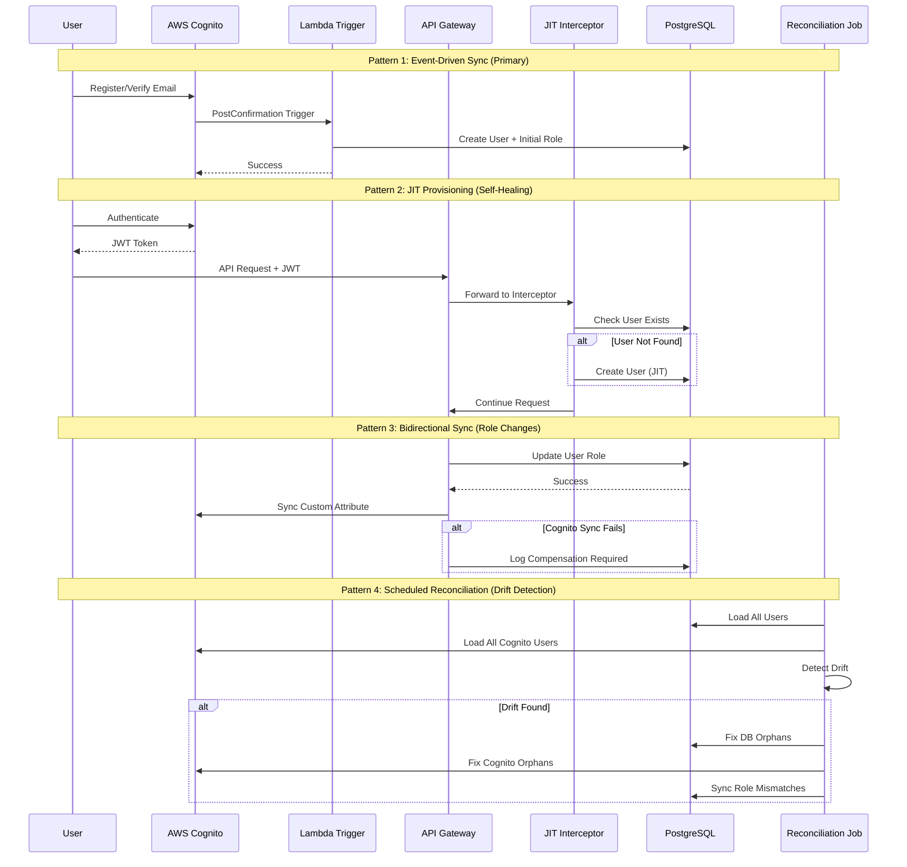

# User Lifecycle and Sync Patterns

This document outlines the comprehensive user lifecycle management and synchronization patterns between AWS Cognito and PostgreSQL for the BATbern Event Management Platform.

## Problem Statement

The BATbern platform maintains user data in two distinct systems:

1. **AWS Cognito User Pool** - Authentication, credentials, email verification, MFA
2. **PostgreSQL Database** - Role history, business relationships, audit trails, event participation

**Challenges:**
- **Data Consistency** - Changes in one system must reflect in the other
- **Partial Failures** - Network issues, API throttling, database deadlocks
- **Out-of-Band Changes** - Admin console modifications, manual database updates
- **Bootstrap Problem** - Creating initial organizer users for new environments
- **Eventual Consistency** - Accepting temporary drift with automatic reconciliation

## Sync Architecture Overview

BATbern implements a **hybrid multi-pattern approach** for user lifecycle management:



**Design Principles:**
- **Cognito as Auth Source of Truth** - Credentials, verification status, MFA settings
- **Database as Business Source of Truth** - Role history, relationships, audit trails
- **Eventual Consistency** - Accept temporary drift with monitoring and auto-fix
- **Self-Healing** - Multiple fallback mechanisms prevent permanent inconsistency
- **Comprehensive Monitoring** - Track sync lag, failures, and drift

## Pattern 1: Cognito Lambda Triggers (Event-Driven Sync)

**How It Works:**
AWS Cognito fires Lambda functions on user lifecycle events, providing real-time synchronization to the database.

### PostConfirmation Trigger - Create DB User

```typescript
// infrastructure/lib/lambda/triggers/post-confirmation.ts
import { PostConfirmationTriggerHandler } from 'aws-lambda';
import { Client } from 'pg';

const dbClient = new Client({
  host: process.env.DB_HOST,
  database: process.env.DB_NAME,
  user: process.env.DB_USER,
  password: process.env.DB_PASSWORD,
  ssl: { rejectUnauthorized: true }
});

export const handler: PostConfirmationTriggerHandler = async (event) => {
  console.log('PostConfirmation trigger invoked', { username: event.userName });

  const { userPoolId, userName, request } = event;
  const email = request.userAttributes.email;
  const cognitoRole = request.userAttributes['custom:batbern_role'] || 'ATTENDEE';

  try {
    await dbClient.connect();

    // Create user record (idempotent with ON CONFLICT)
    const userResult = await dbClient.query(
      `INSERT INTO users (cognito_id, email, created_at, updated_at)
       VALUES ($1, $2, NOW(), NOW())
       ON CONFLICT (cognito_id) DO UPDATE SET
         email = EXCLUDED.email,
         updated_at = NOW()
       RETURNING id`,
      [userName, email]
    );

    const userId = userResult.rows[0].id;

    // Create initial role (self-granted on registration)
    await dbClient.query(
      `INSERT INTO user_roles (user_id, role, granted_by, granted_at, is_active, reason)
       VALUES ($1, $2, $1, NOW(), true, 'Initial registration')
       ON CONFLICT (user_id, role) WHERE is_active = true DO NOTHING`,
      [userId, cognitoRole]
    );

    console.log('User synced successfully', { userId, email, role: cognitoRole });

  } catch (error) {
    console.error('Failed to sync user to database', {
      error: error.message,
      stack: error.stack,
      userName,
      email
    });

    // Don't block Cognito confirmation - JIT will handle it
    // Just log the error for monitoring
  } finally {
    await dbClient.end();
  }

  return event; // Must return event to Cognito
};
```

### PreTokenGeneration Trigger - Enrich JWT with DB Roles

```typescript
// infrastructure/lib/lambda/triggers/pre-token-generation.ts
import { PreTokenGenerationTriggerHandler } from 'aws-lambda';
import { Client } from 'pg';

export const handler: PreTokenGenerationTriggerHandler = async (event) => {
  const { userName } = event;

  const dbClient = new Client({ /* connection config */ });

  try {
    await dbClient.connect();

    // Fetch active roles from database
    const result = await dbClient.query(
      `SELECT ur.role, ur.event_id
       FROM user_roles ur
       JOIN users u ON u.id = ur.user_id
       WHERE u.cognito_id = $1 AND ur.is_active = true`,
      [userName]
    );

    const roles = result.rows.map(r => r.role);
    const eventRoles = result.rows
      .filter(r => r.event_id)
      .map(r => ({ eventId: r.event_id, role: r.role }));

    // Add custom claims to JWT
    event.response.claimsOverrideDetails = {
      claimsToAddOrOverride: {
        'custom:batbern_roles': JSON.stringify(roles),
        'custom:batbern_event_roles': JSON.stringify(eventRoles),
        'custom:roles_synced_at': new Date().toISOString()
      }
    };

    console.log('Token enriched with DB roles', { userName, roles });

  } catch (error) {
    console.error('Failed to enrich token', { error: error.message, userName });

    // Fallback to Cognito custom attribute
    // Don't block authentication
  } finally {
    await dbClient.end();
  }

  return event;
};
```

### PreAuthentication Trigger - Validate User Active

```typescript
// infrastructure/lib/lambda/triggers/pre-authentication.ts
import { PreAuthenticationTriggerHandler } from 'aws-lambda';
import { Client } from 'pg';

export const handler: PreAuthenticationTriggerHandler = async (event) => {
  const { userName } = event;

  const dbClient = new Client({ /* connection config */ });

  try {
    await dbClient.connect();

    // Check if user is active in database
    const result = await dbClient.query(
      `SELECT is_active, deactivated_reason
       FROM users
       WHERE cognito_id = $1`,
      [userName]
    );

    if (result.rows.length === 0) {
      // User not in DB yet - allow login (JIT will create)
      console.log('User not in DB, allowing login for JIT provisioning', { userName });
      return event;
    }

    const user = result.rows[0];

    if (!user.is_active) {
      console.warn('Blocking login for deactivated user', {
        userName,
        reason: user.deactivated_reason
      });

      throw new Error(`Account deactivated: ${user.deactivated_reason || 'Contact support'}`);
    }

  } catch (error) {
    console.error('PreAuthentication check failed', {
      error: error.message,
      userName
    });

    // Re-throw to block authentication
    throw error;

  } finally {
    await dbClient.end();
  }

  return event;
};
```

### CDK Configuration for Triggers

```typescript
// infrastructure/lib/stacks/auth-stack.ts
import * as cognito from 'aws-cdk-lib/aws-cognito';
import * as lambda from 'aws-cdk-lib/aws-lambda';
import * as lambdaNodejs from 'aws-cdk-lib/aws-lambda-nodejs';

export class AuthStack extends cdk.Stack {
  constructor(scope: Construct, id: string, props: StackProps) {
    super(scope, id, props);

    // Database connection secret
    const dbSecret = secretsmanager.Secret.fromSecretNameV2(
      this,
      'DBSecret',
      'batbern/database/credentials'
    );

    // PostConfirmation Lambda
    const postConfirmationFn = new lambdaNodejs.NodejsFunction(
      this,
      'PostConfirmationTrigger',
      {
        entry: 'lib/lambda/triggers/post-confirmation.ts',
        handler: 'handler',
        runtime: lambda.Runtime.NODEJS_18_X,
        timeout: cdk.Duration.seconds(10),
        environment: {
          DB_HOST: dbSecret.secretValueFromJson('host').unsafeUnwrap(),
          DB_NAME: dbSecret.secretValueFromJson('dbname').unsafeUnwrap(),
          DB_USER: dbSecret.secretValueFromJson('username').unsafeUnwrap(),
          DB_PASSWORD: dbSecret.secretValueFromJson('password').unsafeUnwrap(),
        },
        vpc: props.vpc,
        vpcSubnets: { subnetType: ec2.SubnetType.PRIVATE_WITH_EGRESS },
      }
    );

    // PreTokenGeneration Lambda
    const preTokenFn = new lambdaNodejs.NodejsFunction(
      this,
      'PreTokenGenerationTrigger',
      {
        entry: 'lib/lambda/triggers/pre-token-generation.ts',
        handler: 'handler',
        runtime: lambda.Runtime.NODEJS_18_X,
        timeout: cdk.Duration.seconds(5),
        environment: { /* same as above */ },
        vpc: props.vpc,
        vpcSubnets: { subnetType: ec2.SubnetType.PRIVATE_WITH_EGRESS },
      }
    );

    // PreAuthentication Lambda
    const preAuthFn = new lambdaNodejs.NodejsFunction(
      this,
      'PreAuthenticationTrigger',
      {
        entry: 'lib/lambda/triggers/pre-authentication.ts',
        handler: 'handler',
        runtime: lambda.Runtime.NODEJS_18_X,
        timeout: cdk.Duration.seconds(5),
        environment: { /* same as above */ },
        vpc: props.vpc,
        vpcSubnets: { subnetType: ec2.SubnetType.PRIVATE_WITH_EGRESS },
      }
    );

    // Grant database access
    dbSecret.grantRead(postConfirmationFn);
    dbSecret.grantRead(preTokenFn);
    dbSecret.grantRead(preAuthFn);

    // Create User Pool with triggers
    const userPool = new cognito.UserPool(this, 'BATbernUserPool', {
      userPoolName: `batbern-${props.environment}-users`,
      selfSignUpEnabled: true,
      signInAliases: { email: true },
      autoVerify: { email: true },
      passwordPolicy: {
        minLength: 8,
        requireLowercase: true,
        requireUppercase: true,
        requireDigits: true,
        requireSymbols: true,
      },
      customAttributes: {
        batbern_role: new cognito.StringAttribute({ minLen: 1, maxLen: 50 }),
      },
      lambdaTriggers: {
        postConfirmation: postConfirmationFn,
        preTokenGeneration: preTokenFn,
        preAuthentication: preAuthFn,
      },
    });

    // CloudWatch Alarms for trigger failures
    postConfirmationFn.metricErrors().createAlarm(this, 'PostConfirmationErrors', {
      threshold: 5,
      evaluationPeriods: 1,
      alarmDescription: 'PostConfirmation trigger failing',
    });
  }
}
```

## Pattern 2: Just-In-Time (JIT) Provisioning (Self-Healing)

**How It Works:**
A Spring Boot interceptor checks for user existence on every authenticated request. If the user is missing from the database (trigger failed, manual Cognito creation), it creates the user automatically.

### JIT Provisioning Interceptor

```java
package ch.batbern.shared.interceptor;

import ch.batbern.shared.domain.User;
import ch.batbern.shared.domain.UserRole;
import ch.batbern.shared.domain.UserRoleEntity;
import ch.batbern.shared.repository.UserRepository;
import ch.batbern.shared.repository.UserRoleRepository;
import ch.batbern.shared.security.SecurityContextHelper;
import ch.batbern.shared.security.UserContext;
import lombok.RequiredArgsConstructor;
import lombok.extern.slf4j.Slf4j;
import org.springframework.stereotype.Component;
import org.springframework.transaction.annotation.Transactional;
import org.springframework.web.servlet.HandlerInterceptor;

import jakarta.servlet.http.HttpServletRequest;
import jakarta.servlet.http.HttpServletResponse;
import java.time.Instant;
import java.util.Optional;
import java.util.UUID;

@Component
@Slf4j
@RequiredArgsConstructor
public class JITUserProvisioningInterceptor implements HandlerInterceptor {

    private final UserRepository userRepository;
    private final UserRoleRepository userRoleRepository;
    private final SecurityContextHelper securityHelper;

    @Override
    @Transactional
    public boolean preHandle(
        HttpServletRequest request,
        HttpServletResponse response,
        Object handler
    ) {
        // Skip for health checks and public endpoints
        if (request.getRequestURI().startsWith("/actuator")) {
            return true;
        }

        try {
            UserContext cognitoUser = securityHelper.getCurrentUser();
            String cognitoId = cognitoUser.getUserId();

            // Check if user exists in database
            Optional<User> dbUser = userRepository.findByCognitoId(cognitoId);

            if (dbUser.isEmpty()) {
                log.info("User {} not found in database, performing JIT provisioning", cognitoId);

                // Create user record
                User newUser = User.builder()
                    .cognitoId(cognitoId)
                    .email(cognitoUser.getEmail())
                    .isActive(true)
                    .createdAt(Instant.now())
                    .updatedAt(Instant.now())
                    .build();

                User savedUser = userRepository.save(newUser);

                // Determine initial role from Cognito JWT claims
                String initialRole = cognitoUser.getRoles().stream()
                    .findFirst()
                    .orElse("ATTENDEE");

                // Create initial role
                UserRoleEntity role = UserRoleEntity.builder()
                    .userId(savedUser.getId())
                    .role(UserRole.valueOf(initialRole))
                    .grantedBy(savedUser.getId()) // Self-granted on JIT
                    .grantedAt(Instant.now())
                    .isActive(true)
                    .reason("Just-in-time provisioning from Cognito")
                    .build();

                userRoleRepository.save(role);

                log.info("JIT provisioning completed successfully for user {}",
                    cognitoId,
                    savedUser.getId(),
                    initialRole);

                // Emit domain event for observability
                publishUserCreatedEvent(savedUser, initialRole);
            }

        } catch (Exception e) {
            log.error("JIT provisioning failed", e);
            // Don't block the request - allow it to proceed
            // Service layer will handle missing user appropriately
        }

        return true;
    }

    private void publishUserCreatedEvent(User user, String role) {
        // Publish to EventBridge for cross-service notification
        // Implementation omitted for brevity
    }
}
```

### Web MVC Configuration

```java
package ch.batbern.shared.config;

import ch.batbern.shared.interceptor.JITUserProvisioningInterceptor;
import lombok.RequiredArgsConstructor;
import org.springframework.context.annotation.Configuration;
import org.springframework.web.servlet.config.annotation.InterceptorRegistry;
import org.springframework.web.servlet.config.annotation.WebMvcConfigurer;

@Configuration
@RequiredArgsConstructor
public class WebMvcConfiguration implements WebMvcConfigurer {

    private final JITUserProvisioningInterceptor jitProvisioningInterceptor;

    @Override
    public void addInterceptors(InterceptorRegistry registry) {
        registry.addInterceptor(jitProvisioningInterceptor)
            .addPathPatterns("/api/**")
            .excludePathPatterns(
                "/api/v1/auth/**",  // Exclude auth endpoints
                "/actuator/**"       // Exclude health checks
            );
    }
}
```

## Pattern 3: Saga-Based Bidirectional Sync (Role Changes)

**How It Works:**
When roles change in the database, sync to Cognito using a saga pattern with compensation logic for failures.

### Enhanced Role Sync with Saga Pattern

```java
package ch.batbern.shared.service;

import com.amazonaws.services.cognitoidentityprovider.AWSCognitoIdentityProvider;
import com.amazonaws.services.cognitoidentityprovider.model.*;
import io.github.resilience4j.retry.Retry;
import io.github.resilience4j.retry.RetryConfig;
import lombok.RequiredArgsConstructor;
import lombok.extern.slf4j.Slf4j;
import org.springframework.beans.factory.annotation.Value;
import org.springframework.stereotype.Service;
import org.springframework.transaction.annotation.Transactional;

import java.time.Duration;
import java.time.Instant;
import java.util.UUID;

@Service
@Slf4j
@RequiredArgsConstructor
public class UserSyncSagaService {

    private final UserRoleRepository userRoleRepository;
    private final UserSyncCompensationLogRepository compensationLogRepository;
    private final AWSCognitoIdentityProvider cognitoClient;

    @Value("${aws.cognito.user-pool-id}")
    private String userPoolId;

    // Retry configuration with exponential backoff
    private final RetryConfig retryConfig = RetryConfig.custom()
        .maxAttempts(3)
        .waitDuration(Duration.ofSeconds(2))
        .retryExceptions(TooManyRequestsException.class, InternalErrorException.class)
        .build();

    @Transactional
    public void syncRoleChangeToCognito(UUID userId, UserRole newRole, String cognitoId) {
        UserSyncCompensationLog compensationLog = null;

        try {
            // Step 1: Record intent (for compensation if needed)
            compensationLog = UserSyncCompensationLog.builder()
                .userId(userId)
                .cognitoId(cognitoId)
                .operation("ROLE_SYNC")
                .targetRole(newRole)
                .status("PENDING")
                .attemptedAt(Instant.now())
                .build();

            compensationLogRepository.save(compensationLog);

            // Step 2: Sync to Cognito with retry
            Retry retry = Retry.of("cognito-sync", retryConfig);
            retry.executeRunnable(() -> updateCognitoUserAttribute(cognitoId, newRole));

            // Step 3: Mark compensation as completed
            compensationLog.setStatus("COMPLETED");
            compensationLog.setCompletedAt(Instant.now());
            compensationLogRepository.save(compensationLog);

            log.info("Role sync to Cognito completed successfully",
                userId, newRole, cognitoId);

        } catch (Exception e) {
            log.error("Failed to sync role to Cognito, compensation required",
                e, userId, newRole, cognitoId);

            if (compensationLog != null) {
                compensationLog.setStatus("FAILED");
                compensationLog.setErrorMessage(e.getMessage());
                compensationLog.setCompensationRequired(true);
                compensationLogRepository.save(compensationLog);
            }

            // Emit alert for manual intervention or automatic retry
            emitSyncFailureAlert(userId, cognitoId, newRole, e);

            // Don't throw - allow DB transaction to commit
            // Reconciliation job will fix the drift
        }
    }

    private void updateCognitoUserAttribute(String cognitoId, UserRole role) {
        AdminUpdateUserAttributesRequest request = AdminUpdateUserAttributesRequest.builder()
            .userPoolId(userPoolId)
            .username(cognitoId)
            .userAttributes(
                AttributeType.builder()
                    .name("custom:batbern_role")
                    .value(role.name())
                    .build()
            )
            .build();

        cognitoClient.adminUpdateUserAttributes(request);
    }

    private void emitSyncFailureAlert(UUID userId, String cognitoId, UserRole role, Exception error) {
        // Publish to SNS or CloudWatch for alerting
        log.error("ALERT: Cognito sync failed for user {}", userId, error);
    }
}
```

### Compensation Log Schema

```sql
CREATE TABLE user_sync_compensation_log (
    id UUID PRIMARY KEY DEFAULT gen_random_uuid(),
    user_id UUID NOT NULL REFERENCES users(id),
    cognito_id VARCHAR(255) NOT NULL,
    operation VARCHAR(50) NOT NULL,
    target_role VARCHAR(50),
    status VARCHAR(20) NOT NULL,
    attempted_at TIMESTAMP NOT NULL DEFAULT CURRENT_TIMESTAMP,
    completed_at TIMESTAMP,
    error_message TEXT,
    compensation_required BOOLEAN DEFAULT false,
    compensation_executed_at TIMESTAMP,
    retry_count INTEGER DEFAULT 0
);

CREATE INDEX idx_compensation_status ON user_sync_compensation_log(status, compensation_required);
CREATE INDEX idx_compensation_user ON user_sync_compensation_log(user_id);
```

## Pattern 4: Scheduled Reconciliation (Drift Detection & Auto-Fix)

**How It Works:**
A scheduled job runs daily to detect and automatically fix drift between Cognito and the database.

### Reconciliation Service

```java
package ch.batbern.shared.service;

import com.amazonaws.services.cognitoidentityprovider.AWSCognitoIdentityProvider;
import com.amazonaws.services.cognitoidentityprovider.model.*;
import lombok.RequiredArgsConstructor;
import lombok.extern.slf4j.Slf4j;
import org.springframework.beans.factory.annotation.Value;
import org.springframework.scheduling.annotation.Scheduled;
import org.springframework.stereotype.Service;
import org.springframework.transaction.annotation.Transactional;

import java.time.Instant;
import java.util.*;
import java.util.stream.Collectors;

@Service
@Slf4j
@RequiredArgsConstructor
public class UserReconciliationService {

    private final UserRepository userRepository;
    private final UserRoleRepository userRoleRepository;
    private final AWSCognitoIdentityProvider cognitoClient;
    private final MetricsService metricsService;

    @Value("${aws.cognito.user-pool-id}")
    private String userPoolId;

    @Scheduled(cron = "0 0 2 * * *") // 2 AM daily
    @Transactional
    public void reconcileUsers() {
        log.info("Starting user reconciliation job");

        ReconciliationReport report = ReconciliationReport.builder()
            .startedAt(Instant.now())
            .build();

        try {
            // Step 1: Find DB users not in Cognito (orphaned)
            reconcileOrphanedDbUsers(report);

            // Step 2: Find Cognito users not in DB (missing)
            reconcileMissingDbUsers(report);

            // Step 3: Reconcile role mismatches
            reconcileRoleMismatches(report);

            // Step 4: Retry failed compensations
            retryFailedCompensations(report);

            report.setCompletedAt(Instant.now());
            report.setStatus("COMPLETED");

            log.info("User reconciliation completed successfully", report);

        } catch (Exception e) {
            log.error("User reconciliation failed", e);
            report.setStatus("FAILED");
            report.setErrorMessage(e.getMessage());
        } finally {
            // Publish metrics
            publishReconciliationMetrics(report);

            // Store report for audit
            storeReconciliationReport(report);
        }
    }

    private void reconcileOrphanedDbUsers(ReconciliationReport report) {
        log.info("Checking for orphaned database users");

        List<User> dbUsers = userRepository.findAll();
        int orphanedCount = 0;

        for (User user : dbUsers) {
            try {
                AdminGetUserRequest request = AdminGetUserRequest.builder()
                    .userPoolId(userPoolId)
                    .username(user.getCognitoId())
                    .build();

                cognitoClient.adminGetUser(request);

            } catch (UserNotFoundException e) {
                log.warn("User exists in DB but not in Cognito - marking inactive",
                    user.getId(), user.getCognitoId());

                user.setIsActive(false);
                user.setDeactivatedReason("Cognito user not found during reconciliation");
                user.setUpdatedAt(Instant.now());
                userRepository.save(user);

                orphanedCount++;
            }
        }

        report.setOrphanedDbUsers(orphanedCount);
        log.info("Found and deactivated {} orphaned DB users", orphanedCount);
    }

    private void reconcileMissingDbUsers(ReconciliationReport report) {
        log.info("Checking for Cognito users missing from DB");

        int createdCount = 0;
        String paginationToken = null;

        do {
            ListUsersRequest request = ListUsersRequest.builder()
                .userPoolId(userPoolId)
                .limit(60)
                .paginationToken(paginationToken)
                .build();

            ListUsersResponse response = cognitoClient.listUsers(request);

            for (UserType cognitoUser : response.users()) {
                String cognitoId = cognitoUser.username();
                String email = cognitoUser.attributes().stream()
                    .filter(a -> a.name().equals("email"))
                    .findFirst()
                    .map(AttributeType::value)
                    .orElse(null);

                if (!userRepository.existsByCognitoId(cognitoId)) {
                    log.warn("User exists in Cognito but not DB - creating",
                        cognitoId, email);

                    User newUser = User.builder()
                        .cognitoId(cognitoId)
                        .email(email)
                        .isActive(true)
                        .createdAt(Instant.now())
                        .updatedAt(Instant.now())
                        .build();

                    User savedUser = userRepository.save(newUser);

                    // Create initial role from Cognito attribute
                    String cognitoRole = cognitoUser.attributes().stream()
                        .filter(a -> a.name().equals("custom:batbern_role"))
                        .findFirst()
                        .map(AttributeType::value)
                        .orElse("ATTENDEE");

                    UserRoleEntity role = UserRoleEntity.builder()
                        .userId(savedUser.getId())
                        .role(UserRole.valueOf(cognitoRole))
                        .grantedBy(savedUser.getId())
                        .grantedAt(Instant.now())
                        .isActive(true)
                        .reason("Created during reconciliation from Cognito")
                        .build();

                    userRoleRepository.save(role);

                    createdCount++;
                }
            }

            paginationToken = response.paginationToken();

        } while (paginationToken != null);

        report.setMissingDbUsers(createdCount);
        log.info("Created {} missing DB users from Cognito", createdCount);
    }

    private void reconcileRoleMismatches(ReconciliationReport report) {
        log.info("Checking for role mismatches");

        int mismatchCount = 0;

        List<User> users = userRepository.findAllActive();

        for (User user : users) {
            try {
                // Get role from Cognito
                AdminGetUserRequest request = AdminGetUserRequest.builder()
                    .userPoolId(userPoolId)
                    .username(user.getCognitoId())
                    .build();

                AdminGetUserResponse response = cognitoClient.adminGetUser(request);

                String cognitoRole = response.userAttributes().stream()
                    .filter(a -> a.name().equals("custom:batbern_role"))
                    .findFirst()
                    .map(AttributeType::value)
                    .orElse(null);

                if (cognitoRole == null) {
                    continue; // No role in Cognito, skip
                }

                // Get active role from DB
                Optional<UserRoleEntity> dbRole = userRoleRepository
                    .findActiveGlobalRole(user.getId());

                if (dbRole.isEmpty()) {
                    log.warn("User has Cognito role but no active DB role",
                        user.getId(), cognitoRole);
                    // TODO: Decide which is source of truth
                    continue;
                }

                // Compare roles
                if (!dbRole.get().getRole().name().equals(cognitoRole)) {
                    log.warn("Role mismatch detected",
                        user.getId(),
                        "DB: " + dbRole.get().getRole(),
                        "Cognito: " + cognitoRole);

                    // Strategy: Database is source of truth for roles
                    // Sync DB role to Cognito
                    updateCognitoRole(user.getCognitoId(), dbRole.get().getRole());

                    mismatchCount++;
                }

            } catch (Exception e) {
                log.error("Failed to reconcile role for user", e, user.getId());
            }
        }

        report.setRoleMismatches(mismatchCount);
        log.info("Fixed {} role mismatches", mismatchCount);
    }

    private void retryFailedCompensations(ReconciliationReport report) {
        log.info("Retrying failed compensation operations");

        List<UserSyncCompensationLog> failedOps = compensationLogRepository
            .findByStatusAndCompensationRequired("FAILED", true);

        int retriedCount = 0;
        int successCount = 0;

        for (UserSyncCompensationLog op : failedOps) {
            try {
                if (op.getRetryCount() >= 5) {
                    log.warn("Max retries exceeded for compensation",
                        op.getId(), op.getUserId());
                    continue;
                }

                // Retry the operation
                if ("ROLE_SYNC".equals(op.getOperation())) {
                    updateCognitoRole(op.getCognitoId(), op.getTargetRole());

                    op.setStatus("COMPLETED");
                    op.setCompensationExecutedAt(Instant.now());
                    compensationLogRepository.save(op);

                    successCount++;
                }

                retriedCount++;

            } catch (Exception e) {
                log.error("Retry failed for compensation", e, op.getId());
                op.setRetryCount(op.getRetryCount() + 1);
                compensationLogRepository.save(op);
            }
        }

        report.setCompensationsRetried(retriedCount);
        report.setCompensationsSucceeded(successCount);
        log.info("Retried {} compensations, {} succeeded", retriedCount, successCount);
    }

    private void updateCognitoRole(String cognitoId, UserRole role) {
        AdminUpdateUserAttributesRequest request = AdminUpdateUserAttributesRequest.builder()
            .userPoolId(userPoolId)
            .username(cognitoId)
            .userAttributes(
                AttributeType.builder()
                    .name("custom:batbern_role")
                    .value(role.name())
                    .build()
            )
            .build();

        cognitoClient.adminUpdateUserAttributes(request);
    }

    private void publishReconciliationMetrics(ReconciliationReport report) {
        metricsService.recordMetric("user.reconciliation.orphaned_db_users",
            report.getOrphanedDbUsers());
        metricsService.recordMetric("user.reconciliation.missing_db_users",
            report.getMissingDbUsers());
        metricsService.recordMetric("user.reconciliation.role_mismatches",
            report.getRoleMismatches());
        metricsService.recordMetric("user.reconciliation.duration_ms",
            Duration.between(report.getStartedAt(), report.getCompletedAt()).toMillis());
    }

    private void storeReconciliationReport(ReconciliationReport report) {
        // Store in database or S3 for audit trail
    }
}
```

### Reconciliation Report Model

```java
@Data
@Builder
public class ReconciliationReport {
    private Instant startedAt;
    private Instant completedAt;
    private String status;
    private String errorMessage;
    private int orphanedDbUsers;
    private int missingDbUsers;
    private int roleMismatches;
    private int compensationsRetried;
    private int compensationsSucceeded;
}
```

## Monitoring and Alerting

### CloudWatch Metrics

```java
@Service
@RequiredArgsConstructor
public class UserSyncMetricsService {

    private final CloudWatchAsyncClient cloudWatchClient;

    public void recordSyncLatency(String syncType, long latencyMs) {
        PutMetricDataRequest request = PutMetricDataRequest.builder()
            .namespace("BATbern/UserSync")
            .metricData(MetricDatum.builder()
                .metricName("SyncLatency")
                .value((double) latencyMs)
                .unit(StandardUnit.MILLISECONDS)
                .timestamp(Instant.now())
                .dimensions(
                    Dimension.builder()
                        .name("SyncType")
                        .value(syncType)
                        .build()
                )
                .build())
            .build();

        cloudWatchClient.putMetricData(request);
    }

    public void recordSyncFailure(String syncType) {
        PutMetricDataRequest request = PutMetricDataRequest.builder()
            .namespace("BATbern/UserSync")
            .metricData(MetricDatum.builder()
                .metricName("SyncFailures")
                .value(1.0)
                .unit(StandardUnit.COUNT)
                .timestamp(Instant.now())
                .dimensions(
                    Dimension.builder()
                        .name("SyncType")
                        .value(syncType)
                        .build()
                )
                .build())
            .build();

        cloudWatchClient.putMetricData(request);
    }
}
```

### CloudWatch Alarms

```typescript
// infrastructure/lib/monitoring/user-sync-alarms.ts
import * as cloudwatch from 'aws-cdk-lib/aws-cloudwatch';
import * as sns from 'aws-cdk-lib/aws-sns';
import * as actions from 'aws-cdk-lib/aws-cloudwatch-actions';

export class UserSyncAlarms extends Construct {
  constructor(scope: Construct, id: string) {
    super(scope, id);

    const alarmTopic = new sns.Topic(this, 'UserSyncAlarmTopic', {
      displayName: 'BATbern User Sync Alerts',
    });

    // High sync failure rate alarm
    new cloudwatch.Alarm(this, 'HighSyncFailureRate', {
      metric: new cloudwatch.Metric({
        namespace: 'BATbern/UserSync',
        metricName: 'SyncFailures',
        statistic: 'Sum',
        period: cdk.Duration.minutes(5),
      }),
      threshold: 10,
      evaluationPeriods: 2,
      alarmDescription: 'User sync failures exceed threshold',
      actionsEnabled: true,
    }).addAlarmAction(new actions.SnsAction(alarmTopic));

    // High sync latency alarm
    new cloudwatch.Alarm(this, 'HighSyncLatency', {
      metric: new cloudwatch.Metric({
        namespace: 'BATbern/UserSync',
        metricName: 'SyncLatency',
        statistic: 'Average',
        period: cdk.Duration.minutes(5),
      }),
      threshold: 5000, // 5 seconds
      evaluationPeriods: 2,
      alarmDescription: 'User sync latency is high',
      actionsEnabled: true,
    }).addAlarmAction(new actions.SnsAction(alarmTopic));

    // Reconciliation drift detected
    new cloudwatch.Alarm(this, 'ReconciliationDriftDetected', {
      metric: new cloudwatch.Metric({
        namespace: 'BATbern/UserSync',
        metricName: 'DriftDetected',
        statistic: 'Sum',
        period: cdk.Duration.days(1),
      }),
      threshold: 50,
      evaluationPeriods: 1,
      alarmDescription: 'High number of drifted users detected',
      actionsEnabled: true,
    }).addAlarmAction(new actions.SnsAction(alarmTopic));
  }
}
```

## Source of Truth Strategy

| Data Type | Source of Truth | Sync Direction | Consistency Model |
|-----------|----------------|----------------|-------------------|
| **Email** | Cognito | Cognito → DB | Eventual (PostConfirmation trigger) |
| **Email Verified** | Cognito | Cognito → DB | Eventual (PostConfirmation trigger) |
| **Password** | Cognito | One-way (never synced) | N/A |
| **MFA Settings** | Cognito | Cognito → DB (read-only) | Eventual |
| **User Active Status** | Database | DB → Cognito (PreAuth check) | Strong (blocks login) |
| **Role (Global)** | Database | DB ↔ Cognito | Eventual (saga pattern) |
| **Role (Event-specific)** | Database | DB only | N/A |
| **Role History** | Database | DB only | N/A |
| **Role Approvals** | Database | DB only | N/A |
| **User Relationships** | Database | DB only | N/A |

**Key Principles:**
1. **Cognito** owns authentication credentials and email verification
2. **Database** owns business logic, relationships, and audit trails
3. **Bidirectional sync** for roles (with DB as primary source of truth)
4. **Eventual consistency** accepted with monitoring and auto-reconciliation
5. **Strong consistency** enforced for critical operations (PreAuth check)

## Related Documentation

- [Backend Architecture Overview](./06-backend-architecture.md)
- [Role Management Service](./06-backend-architecture.md#role-management-service)
- [Testing Strategy](./06c-testing-strategy.md)
