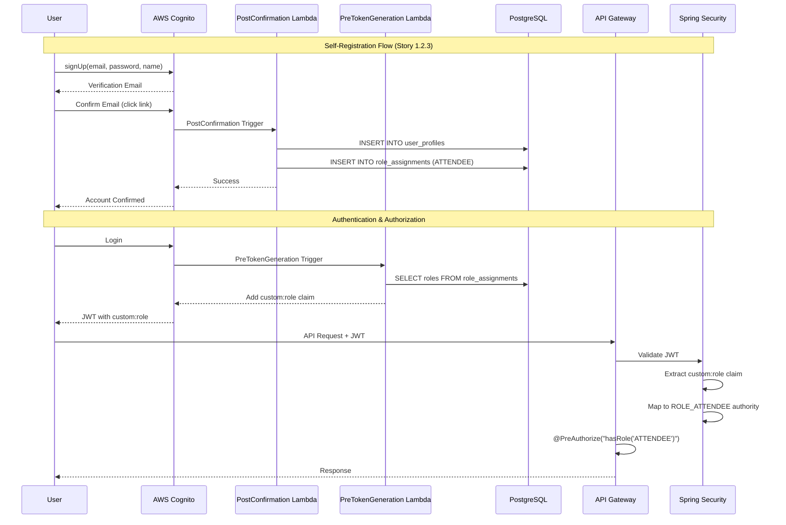

# User Lifecycle and Sync Patterns

This document outlines the user lifecycle management and synchronization patterns between AWS Cognito and PostgreSQL for the BATbern Event Management Platform.

## Architecture Decision

Per **[ADR-001: Invitation-Based User Registration Architecture](./ADR-001-invitation-based-user-registration.md)**, BATbern implements a **database-centric** user management architecture with the following principles:

- **Database as Single Source of Truth**: All user data and roles stored in PostgreSQL
- **Cognito for Authentication Only**: JWT generation and validation only
- **NO Cognito Groups**: Roles managed exclusively via `role_assignments` table
- **Unidirectional Sync**: Cognito → Database (via Lambda triggers and reconciliation job; no reverse DB→Cognito writes)

## Problem Statement

The BATbern platform maintains user data in two distinct systems:

1. **AWS Cognito User Pool** - Authentication, credentials, email verification, MFA
2. **PostgreSQL Database** - User profiles, roles, business relationships, audit trails, event participation

**Key Requirements:**
- **Self-Registration**: Users can register directly via Cognito (Story 1.2.3)
- **Automatic Database Creation**: Database user created automatically on Cognito signup
- **Role-Based Authorization**: JWT contains roles from database for API authorization
- **Single Source of Truth**: Database is authoritative for all user data and roles

## Sync Architecture Overview

BATbern implements a **simplified unidirectional sync** from Cognito to Database:


```mermaid
sequenceDiagram
    participant U as User
    participant C as AWS Cognito
    participant PC as PostConfirmation Lambda
    participant PT as PreTokenGeneration Lambda
    participant DB as PostgreSQL
    participant API as API Gateway
    participant SS as Spring Security

    Note over U,SS: Self-Registration Flow (Story 1.2.3)
    U->>C: signUp(email, password, name)
    C-->>U: Verification Email
    U->>C: Confirm Email (click link)
    C->>PC: PostConfirmation Trigger
    PC->>DB: INSERT INTO user_profiles
    PC->>DB: INSERT INTO role_assignments (ATTENDEE)
    PC-->>C: Success
    C-->>U: Account Confirmed

    Note over U,SS: Authentication & Authorization
    U->>C: Login
    C->>PT: PreTokenGeneration Trigger
    PT->>DB: SELECT roles FROM role_assignments
    PT-->>C: Add custom:role claim
    C-->>U: JWT with custom:role

    U->>API: API Request + JWT
    API->>SS: Validate JWT
    SS->>SS: Extract custom:role claim
    SS->>SS: Map to ROLE_ATTENDEE authority
    API->>API: @PreAuthorize("hasRole('ATTENDEE')")
    API-->>U: Response
```

**Design Principles:**
- **Cognito as Auth Source of Truth** - Credentials, verification status, MFA settings
- **Database as Business Source of Truth** - User profiles, roles, relationships, audit trails
- **Unidirectional Sync** - Cognito → Database (no DB→Cognito writes; a reconciliation job reads Cognito to deactivate orphaned DB users)
- **No Drift** - Reconciliation job detects and resolves divergence
- **Simplified Operations** - No compensation logs

## Pattern 1: PostConfirmation Lambda - User Creation

**Purpose**: Automatically create database user record when user completes email verification in Cognito.

**Trigger**: AWS Cognito `PostConfirmation` event

**Implementation**:

```typescript
// infrastructure/lib/lambda/triggers/post-confirmation.ts
import { PostConfirmationTriggerHandler } from 'aws-lambda';
import { getDbClient } from './common/database';

export const handler: PostConfirmationTriggerHandler = async (event) => {
  console.log('PostConfirmation trigger invoked', {
    cognitoUserId: event.request.userAttributes.sub,
    email: event.request.userAttributes.email
  });

  const { sub: cognitoUserId, email, given_name, family_name } = event.request.userAttributes;
  const language = event.request.userAttributes['custom:language'] || 'de';

  const client = await getDbClient();

  try {
    // Generate username from name (e.g., john.doe)
    const username = generateUsername(given_name, family_name);

    // 1. Create user_profiles record
    await client.query(
      `INSERT INTO user_profiles (
        cognito_user_id, email, first_name, last_name, username, pref_language
      )
      VALUES ($1, $2, $3, $4, $5, $6)
      ON CONFLICT (cognito_user_id) DO NOTHING`,
      [cognitoUserId, email, given_name, family_name, username, language]
    );

    // 2. Get user ID
    const userResult = await client.query(
      `SELECT id FROM user_profiles WHERE cognito_user_id = $1`,
      [cognitoUserId]
    );

    if (userResult.rows.length === 0) {
      // User already existed (ON CONFLICT triggered)
      console.log('User already exists in database', { cognitoUserId });
      return event;
    }

    const userId = userResult.rows[0].id;

    // 3. Assign default ATTENDEE role (FR22)
    await client.query(
      `INSERT INTO role_assignments (user_id, role, granted_by)
      VALUES ($1, 'ATTENDEE', NULL)
      ON CONFLICT (user_id, role) DO NOTHING`,
      [userId]
    );

    console.log('User created successfully', {
      userId,
      email,
      role: 'ATTENDEE'
    });

  } catch (error) {
    console.error('Failed to create database user', {
      error: error.message,
      stack: error.stack,
      cognitoUserId,
      email
    });

    // Don't throw - allow Cognito confirmation to succeed
    // User can still authenticate, and we can fix DB later
  } finally {
    client.release();
  }

  return event; // Must return event to Cognito
};

function generateUsername(firstName: string, lastName: string): string {
  // Convert to lowercase, remove special chars
  const first = firstName.toLowerCase().replace(/[^a-z]/g, '');
  const last = lastName.toLowerCase().replace(/[^a-z]/g, '');
  return `${first}.${last}`;
  // Note: Duplicate username handling via suffix (e.g., john.doe.2)
  // is done in the service layer when username conflicts occur
}
```

**Key Characteristics**:
- **Idempotent**: `ON CONFLICT DO NOTHING` prevents duplicate creation
- **Non-Blocking**: Errors logged but don't fail Cognito confirmation
- **Performance**: Completes within 1 second (p95 latency requirement)
- **Default Role**: Always assigns ATTENDEE role per FR22

**Database Tables Modified**:
- `user_profiles`: Creates user record with Cognito ID
- `role_assignments`: Creates default ATTENDEE role assignment

## Pattern 2: PreTokenGeneration Lambda - JWT Role Enrichment

**Purpose**: Add user roles from database to JWT token as custom claims for API authorization.

**Trigger**: AWS Cognito `PreTokenGeneration` event (on every login/token refresh)

**Implementation**:

```typescript
// infrastructure/lib/lambda/triggers/pre-token-generation.ts
import { PreTokenGenerationTriggerHandler } from 'aws-lambda';
import { getDbClient } from './common/database';

export const handler: PreTokenGenerationTriggerHandler = async (event) => {
  console.log('PreTokenGeneration trigger invoked', {
    cognitoUserId: event.request.userAttributes.sub
  });

  const cognitoUserId = event.request.userAttributes.sub;
  const client = await getDbClient();

  try {
    // Fetch user roles, username, and companyId from database
    const result = await client.query(
      `SELECT DISTINCT r.role, u.username, u.company_id
       FROM role_assignments r
       JOIN user_profiles u ON r.user_id = u.id
       WHERE u.cognito_user_id = $1
       ORDER BY r.role`,
      [cognitoUserId]
    );

    const roles = result.rows.map(row => row.role);
    const username = result.rows[0]?.username ?? null;
    const companyId = result.rows[0]?.company_id ?? null;

    // Add roles, username, and companyId to JWT as custom claims (ADR-001)
    const claimsToAdd: Record<string, string> = {
      'custom:role': roles.join(',') // e.g., "ATTENDEE,SPEAKER"
    };
    if (username) claimsToAdd['custom:username'] = username;   // DB username (e.g. "john.doe")
    if (companyId) claimsToAdd['custom:companyId'] = companyId;

    event.response = {
      claimsOverrideDetails: {
        claimsToAddOrOverride: claimsToAdd
      }
    };

    console.log('Claims added to JWT', { cognitoUserId, roles, username, companyId });

  } catch (error) {
    console.error('Failed to fetch roles from database', {
      error: error.message,
      stack: error.stack,
      cognitoUserId
    });

    // Graceful degradation: Return empty roles instead of failing authentication
    event.response = {
      claimsOverrideDetails: {
        claimsToAddOrOverride: {
          'custom:role': '',
          // custom:username and custom:companyId omitted on error
        }
      }
    };

    console.warn('Returning empty roles due to database error', { cognitoUserId });
  } finally {
    client.release();
  }

  return event;
};
```

**Key Characteristics**:
- **Performance**: Completes within 500ms (p95 latency requirement)
- **Graceful Degradation**: Returns empty roles on database errors (allows login)
- **JWT Claim Format**: `custom:role` (comma-separated), `custom:username` (DB username), `custom:companyId` (optional)
- **NO Cognito Groups**: Roles stored exclusively in database

**JWT Token Example**:

```json
{
  "sub": "a1b2c3d4-5678-90ab-cdef-EXAMPLE11111",
  "cognito:username": "john.doe@example.com",
  "email": "john.doe@example.com",
  "custom:role": "ATTENDEE,SPEAKER",
  "custom:username": "john.doe",
  "custom:companyId": "COMP-0001",
  "custom:language": "de",
  "iss": "https://cognito-idp.eu-central-1.amazonaws.com/eu-central-1_XXXXXXXXX",
  "exp": 1698765432,
  "iat": 1698761832
}
```

**JWT Claim Notes**:
- `custom:username` — DB-assigned username (e.g., `"john.doe"`); set by PreTokenGeneration from `user_profiles.username` (ADR-001). Application falls back to `sub` when absent.
- `custom:companyId` — optional; present only when user is linked to a company.
- `custom:role` — comma-separated role list (e.g., `"ORGANIZER,SPEAKER"`); whitespace around values is trimmed by Spring Security.

## Pattern 3: Spring Security - Role Extraction from JWT

**Purpose**: Extract roles from JWT `custom:role` claim and map to Spring Security authorities.

**Implementation**:

```java
// api-gateway/src/main/java/ch/batbern/gateway/config/SecurityConfig.java
package ch.batbern.gateway.config;

import org.springframework.context.annotation.Bean;
import org.springframework.context.annotation.Configuration;
import org.springframework.security.config.annotation.method.configuration.EnableMethodSecurity;
import org.springframework.security.config.annotation.web.builders.HttpSecurity;
import org.springframework.security.config.annotation.web.configuration.EnableWebSecurity;
import org.springframework.security.core.GrantedAuthority;
import org.springframework.security.core.authority.SimpleGrantedAuthority;
import org.springframework.security.oauth2.jwt.Jwt;
import org.springframework.security.oauth2.server.resource.authentication.JwtAuthenticationConverter;
import org.springframework.security.web.SecurityFilterChain;

import java.util.Arrays;
import java.util.Collection;
import java.util.Collections;
import java.util.stream.Collectors;

@Configuration
@EnableWebSecurity
@EnableMethodSecurity(prePostEnabled = true)
public class SecurityConfig {

    @Bean
    public SecurityFilterChain securityFilterChain(HttpSecurity http) throws Exception {
        http
            .authorizeHttpRequests(authorize -> authorize
                .requestMatchers("/api/v1/auth/register", "/api/v1/auth/login").permitAll()
                .requestMatchers("/api/v1/companies/search").permitAll()  // Story 4.1.5: public for registration autocomplete
                .requestMatchers("/api/v1/admin/**").hasRole("ORGANIZER")
                .anyRequest().authenticated()
            )
            .oauth2ResourceServer(oauth2 -> oauth2
                .jwt(jwt -> jwt
                    .jwtAuthenticationConverter(jwtAuthenticationConverter())
                )
            );

        return http.build();
    }

    @Bean
    public JwtAuthenticationConverter jwtAuthenticationConverter() {
        JwtAuthenticationConverter converter = new JwtAuthenticationConverter();
        converter.setJwtGrantedAuthoritiesConverter(this::extractAuthorities);
        return converter;
    }

    private Collection<GrantedAuthority> extractAuthorities(Jwt jwt) {
        // Extract custom:role claim from JWT
        String rolesString = jwt.getClaimAsString("custom:role");

        if (rolesString == null || rolesString.isEmpty()) {
            return Collections.emptyList();
        }

        // Split comma-separated roles and map to Spring Security authorities
        // "ATTENDEE,SPEAKER" → [ROLE_ATTENDEE, ROLE_SPEAKER]
        return Arrays.stream(rolesString.split(","))
            .map(role -> new SimpleGrantedAuthority("ROLE_" + role.trim()))
            .collect(Collectors.toList());
    }
}
```

**Usage in Controllers**:

```java
// Example controller with role-based authorization
@RestController
@RequestMapping("/api/v1/events")
public class EventController {

    // Only ORGANIZER can create events
    @PostMapping
    @PreAuthorize("hasRole('ORGANIZER')")
    public ResponseEntity<EventDTO> createEvent(@RequestBody EventDTO event) {
        // ...
    }

    // ATTENDEE can view events
    @GetMapping
    @PreAuthorize("hasAnyRole('ATTENDEE', 'SPEAKER', 'PARTNER', 'ORGANIZER')")
    public ResponseEntity<List<EventDTO>> listEvents() {
        // ...
    }

    // SPEAKER can update their own proposals
    @PutMapping("/{eventCode}/proposals/{proposalSlug}")
    @PreAuthorize("hasRole('SPEAKER')")
    public ResponseEntity<ProposalDTO> updateProposal(
        @PathVariable String eventCode,
        @PathVariable String proposalSlug,
        @RequestBody ProposalDTO proposal
    ) {
        // Additional check: proposal.speakerId == currentUser.id
        // ...
    }
}
```

**Key Characteristics**:
- **Standard Spring Security**: Uses `@PreAuthorize` annotations
- **Role Mapping**: JWT claim "ATTENDEE" → Authority "ROLE_ATTENDEE"
- **Empty Roles Handling**: Returns empty list if claim missing (user has no access)
- **NO Database Queries**: Roles cached in JWT for request duration

## What We DON'T Do

### ❌ No Cognito Groups
**Reason**: Roles stored exclusively in database `role_assignments` table. Cognito Groups are not used.

**Alternative**: JWT `custom:role` claim populated from database.

### ❌ No Reverse Sync (Database → Cognito)
**Reason**: Cognito is for authentication only. User data changes (roles, profiles) stay in database.

**Clarification**: The reconciliation job reads Cognito state to deactivate orphaned DB users — this is still Cognito→DB direction. There is no path that writes business data from the DB back to Cognito.

**Alternative**: Roles updated in database only. Next login fetches updated roles via PreTokenGeneration.

### ✅ JIT (Just-In-Time) Provisioning Interceptor — Safety Net

**Pattern 1b**: `JITUserProvisioningInterceptor` runs on every authenticated API request. If a valid JWT is present but no DB user record is found (`findByCognitoUserId()` returns empty), the interceptor provisions a new DB user from the JWT claims.

**Role assignment**: Roles are extracted from the JWT `GrantedAuthority` list. If the JWT carries no roles, the user defaults to `ATTENDEE`. Multi-role JWTs produce multi-role DB entries.

**Link on first login**: Pre-invited users (created via Admin API with `cognito_user_id = NULL`) are linked to their Cognito ID on first login when the interceptor detects an existing record with the same email but no Cognito ID.

**Error handling**: JIT provisioning errors are non-blocking — the request continues even if DB user creation fails.

**Event publishing**: Successful JIT provisioning publishes a domain event with `source = "JIT_PROVISIONING"`.

**Relationship to PostConfirmation**: PostConfirmation Lambda is the **primary** user creation path (self-registration). The JIT interceptor is the **safety net** — it handles edge cases such as PostConfirmation failures or invitation-based users logging in for the first time.

### ✅ Reconciliation Job — `UserReconciliationService`

`UserReconciliationService` provides `reconcileUsers()` and `checkSyncStatus()` to detect and resolve divergence between the DB and Cognito.

**Orphan detection**: Iterates all active DB users with a non-null `cognito_user_id`, calls `adminGetUser` on each, and deactivates any whose Cognito account no longer exists — setting `is_active = false` and `deactivation_reason = "Cognito user deleted"`.

**Missing user detection**: Identifies users present in Cognito but absent from the DB (typically PostConfirmation failures) and creates the missing DB records.

**Skip rule**: Users with `cognito_user_id = NULL` (pre-invited users not yet linked) are **excluded** from the orphan check — `adminGetUser` is never called for them.

**Sync direction**: Cognito remains the authoritative source. The reconciliation job reads Cognito state and mutates the DB only — there is no reverse sync (DB→Cognito).

**Metrics**: Progress and results (`orphanedUsers`, `missingUsers`, duration, errors) are published via `UserSyncMetricsService`.

### ❌ No Compensation Logs
**Reason**: No bidirectional sync means no partial failure scenarios requiring compensation.

**Alternative**: None needed.

### ❌ No PreAuthentication Trigger
**Reason**: No need to block inactive users at auth time. API Gateway handles authorization.

**Alternative**: Application logic checks `is_active` flag in database.

## Database Schema

### user_profiles Table

```sql
-- From Story 1.14-2: services/company-user-management-service/src/main/resources/db/migration/V4__create_user_profiles_table.sql
CREATE TABLE user_profiles (
    id UUID PRIMARY KEY DEFAULT gen_random_uuid(),
    username VARCHAR(100) NOT NULL UNIQUE,
    cognito_user_id VARCHAR(255) UNIQUE,  -- NULL for pre-invited users; linked on first login via JIT interceptor
    email VARCHAR(255) NOT NULL UNIQUE,
    first_name VARCHAR(100) NOT NULL,
    last_name VARCHAR(100) NOT NULL,
    bio TEXT,
    company_id VARCHAR(12),
    profile_picture_url VARCHAR(2048),
    profile_picture_s3_key VARCHAR(500),

    -- Preferences (embedded)
    pref_theme VARCHAR(10) DEFAULT 'auto',
    pref_language VARCHAR(2) DEFAULT 'de',
    pref_email_notifications BOOLEAN DEFAULT TRUE,
    pref_in_app_notifications BOOLEAN DEFAULT TRUE,
    pref_push_notifications BOOLEAN DEFAULT FALSE,
    pref_notification_frequency VARCHAR(20) DEFAULT 'instant',

    -- Settings (embedded)
    settings_profile_visibility VARCHAR(20) DEFAULT 'public',
    settings_timezone VARCHAR(50) DEFAULT 'Europe/Zurich',
    settings_two_factor_enabled BOOLEAN DEFAULT FALSE,
    settings_show_email BOOLEAN DEFAULT FALSE,
    settings_show_company BOOLEAN DEFAULT TRUE,

    -- Status
    is_active BOOLEAN NOT NULL DEFAULT TRUE,
    deactivation_reason VARCHAR(255),  -- e.g. "Cognito user deleted" (set by reconciliation job)
    created_at TIMESTAMP WITH TIME ZONE NOT NULL DEFAULT CURRENT_TIMESTAMP,
    updated_at TIMESTAMP WITH TIME ZONE NOT NULL DEFAULT CURRENT_TIMESTAMP,
    last_login_at TIMESTAMP WITH TIME ZONE
);
```

### role_assignments Table

```sql
-- From Story 1.14-2: services/company-user-management-service/src/main/resources/db/migration/V5__create_role_assignments_table.sql
CREATE TABLE role_assignments (
    user_id UUID NOT NULL REFERENCES user_profiles(id) ON DELETE CASCADE,
    role VARCHAR(50) NOT NULL CHECK (role IN ('ORGANIZER', 'SPEAKER', 'PARTNER', 'ATTENDEE')),
    granted_at TIMESTAMP WITH TIME ZONE NOT NULL DEFAULT CURRENT_TIMESTAMP,
    granted_by UUID REFERENCES user_profiles(id),
    PRIMARY KEY (user_id, role)
);
```

### activity_history Table

```sql
-- Created by Flyway migrations
CREATE TABLE activity_history (
    id UUID PRIMARY KEY DEFAULT gen_random_uuid(),
    user_id UUID NOT NULL REFERENCES user_profiles(id) ON DELETE CASCADE,
    activity_type VARCHAR(100) NOT NULL,
    details JSONB,
    created_at TIMESTAMP WITH TIME ZONE NOT NULL DEFAULT CURRENT_TIMESTAMP
);
```

**Key Points**:
- `cognito_user_id` is nullable — pre-invited users (created via Admin API) have it set to `NULL` until first login; the JIT interceptor links the Cognito ID then
- Users with `cognito_user_id = NULL` are skipped during the reconciliation orphan check
- `role_assignments` supports multiple roles per user
- `granted_by` is `NULL` for system-assigned roles (e.g., ATTENDEE on registration)
- `deactivation_reason` is set by the reconciliation job (e.g., `"Cognito user deleted"`) when a DB user's Cognito account no longer exists

## Business Rules

### Minimum 2 Organizers

The platform enforces a hard constraint that **at least 2 organizers must exist at all times**. `RoleService` throws `MinimumOrganizersException` (message: `"minimum of 2 organizers"`) when either:
- `removeRole()` would remove the last organizer, or
- `setRoles()` would result in fewer than 2 organizers.

This constraint is enforced at the service layer during both single-role removal and full role replacement operations.

## Monitoring and Observability

### CloudWatch Metrics

**Namespace**: `BATbern/UserSync`

**Metrics**:
- `PostConfirmationLatency` - Time to create database user (target: <1s p95)
- `PostConfirmationFailures` - Count of database creation failures
- `PreTokenGenerationLatency` - Time to fetch roles (target: <500ms p95)
- `PreTokenGenerationFailures` - Count of role fetch failures
- `EmptyRolesReturned` - Count of users with no roles in database

**CloudWatch Alarms**:
- `HighUserCreationFailureRate` - Triggers when failures exceed 5 per 5-minute window
- `HighLambdaLatency` - Triggers when latency exceeds 2 seconds (average over 5 minutes)

### CloudWatch Logs

**Log Groups**:
- `/aws/lambda/cognito-post-confirmation` - User creation logs
- `/aws/lambda/cognito-pre-token-generation` - Role fetch logs

**Structured Logging Example**:

```typescript
console.log(JSON.stringify({
  level: 'INFO',
  timestamp: new Date().toISOString(),
  event: 'UserCreated',
  cognitoUserId: sub,
  email: email,
  role: 'ATTENDEE',
  latencyMs: Date.now() - startTime
}));
```

## Error Handling

### PostConfirmation Lambda Errors

**Strategy**: Non-blocking - log errors but allow Cognito confirmation to succeed.

**Rationale**:
- User experience: Don't fail registration due to temporary database issues
- Self-healing: User can still authenticate, database can be fixed later
- Monitoring: Alarms notify team of database creation failures

**Example**:
```typescript
try {
  await createDatabaseUser(cognitoUserId, email, name);
} catch (error) {
  console.error('Database creation failed', { error, cognitoUserId });
  // Don't throw - allow Cognito to continue
}
return event; // Success to Cognito
```

### PreTokenGeneration Lambda Errors

**Strategy**: Graceful degradation - return empty roles instead of failing authentication.

**Rationale**:
- User experience: Allow login even if database is temporarily unavailable
- Partial access: User can access public endpoints, blocked from role-required endpoints
- Monitoring: Alarms notify team of role fetch failures

**Example**:
```typescript
try {
  const roles = await fetchRolesFromDatabase(cognitoUserId);
  event.response.claimsOverrideDetails.claimsToAddOrOverride['custom:role'] = roles.join(',');
} catch (error) {
  console.error('Role fetch failed', { error, cognitoUserId });
  event.response.claimsOverrideDetails.claimsToAddOrOverride['custom:role'] = '';
  // Return empty roles - user can login but has no access
}
```

## Performance Considerations

### Lambda Cold Starts

**Mitigation**:
- Database connection pooling via persistent connections across invocations
- Provisioned concurrency for PostConfirmation and PreTokenGeneration Lambdas
- Lambda timeout: 10s for PostConfirmation, 5s for PreTokenGeneration

### Database Connection Pooling

```typescript
// infrastructure/lib/lambda/triggers/common/database.ts
import { Pool, PoolClient } from 'pg';

let pool: Pool | null = null;

export async function getDbClient(): Promise<PoolClient> {
  if (!pool) {
    pool = new Pool({
      host: process.env.DB_HOST,
      database: process.env.DB_NAME,
      user: process.env.DB_USER,
      password: process.env.DB_PASSWORD,
      port: 5432,
      ssl: { rejectUnauthorized: true },
      max: 2, // Low max for Lambda (one concurrent execution per container)
      idleTimeoutMillis: 30000,
      connectionTimeoutMillis: 5000,
    });
  }

  return pool.connect();
}
```

**Key Points**:
- Pool persists across Lambda invocations (warm starts)
- Max 2 connections per Lambda container (low concurrency)
- Connection timeout: 5 seconds to fail fast

### Query Optimization

**PostConfirmation**:
- Two queries: INSERT user + INSERT role (within 1 second target)
- `ON CONFLICT DO NOTHING` prevents duplicate errors

**PreTokenGeneration**:
- Single query with JOIN (within 500ms target)
- `DISTINCT` to deduplicate roles (in case of data issues)
- Index on `user_profiles.cognito_user_id` for fast lookups

## Future Enhancements

### Admin Invitation Flow (Future Story)

Per ADR-001, a future invitation-based flow will allow admins to create users via API before they register in Cognito:

1. **Admin creates user via POST /api/v1/users**:
   - Creates `user_profiles` record with `cognito_user_id = NULL`
   - Sends invitation email with token

2. **User registers in Cognito with invitation token**:
   - Frontend validates token, allows registration
   - User completes Cognito signup

3. **JIT interceptor links Cognito ID to existing user**:
   - On first authenticated request, interceptor detects email match with `cognito_user_id = NULL`
   - Updates `cognito_user_id` field to link accounts

**Note**: `cognito_user_id` is already nullable in the current schema — invitation-based flow is supported.

### EventBridge Integration (Optional)

Publish user lifecycle events for cross-service notification:

```typescript
// Optional: Publish UserCreated event from PostConfirmation
await eventBridgeClient.send(new PutEventsCommand({
  Entries: [{
    Source: 'ch.batbern.user-sync',
    DetailType: 'UserCreated',
    Detail: JSON.stringify({
      userId: userId,
      cognitoUserId: cognitoUserId,
      email: email,
      role: 'ATTENDEE',
      createdAt: new Date().toISOString()
    })
  }]
}));
```

**Use Cases**:
- Cache invalidation in microservices
- Welcome email sending
- Analytics tracking

## Related Documentation

- **[ADR-001: Invitation-Based User Registration Architecture](./ADR-001-invitation-based-user-registration.md)** - Architectural decision for database-centric approach
- **[Story 1.14-2: User Management Service Foundation](../stories/1.14-2.user-management-service-foundation.md)** - Database schema implementation
- **[Story 1.2.5: User Sync Implementation](../stories/1.2.5-user-sync-reconciliation-implementation.md)** - Lambda trigger implementation
- **[Story 1.2.3: Account Creation Flow](../stories/1.2.3-implement-account-creation-flow.md)** - Self-registration UI
- **[Backend Architecture](./06-backend-architecture.md)** - Overall backend patterns
- **[API Design](./04-api-design.md)** - REST API conventions and authorization patterns
