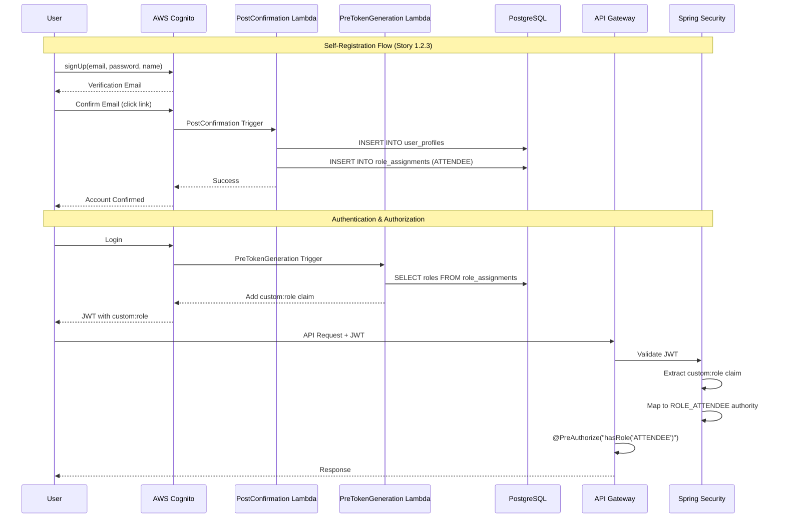
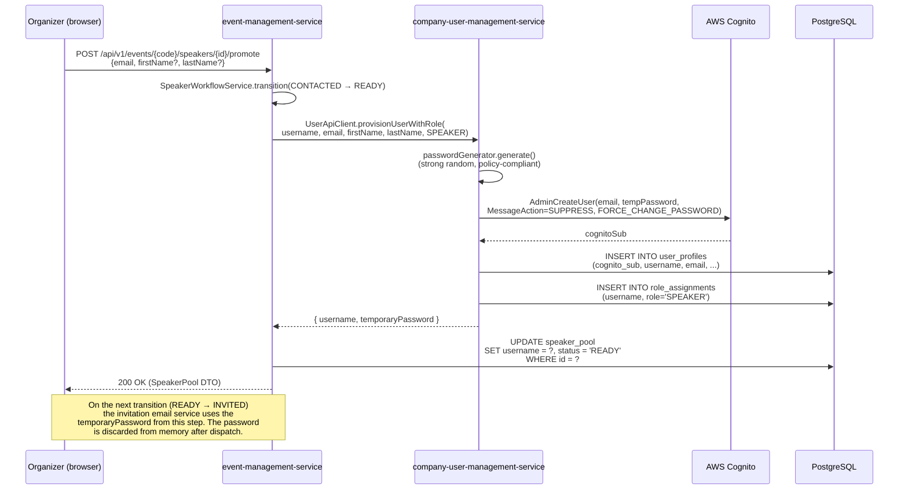

# User Lifecycle and Sync Patterns

This document outlines the user lifecycle management and synchronization patterns between AWS Cognito and PostgreSQL for the BATbern Event Management Platform.

## Architecture Decision

Per **[ADR-001: Invitation-Based User Registration Architecture](./ADR-001-invitation-based-user-registration.md)**, BATbern implements a **database-centric** user management architecture with the following principles:

- **Database as Single Source of Truth**: All user data and roles stored in PostgreSQL
- **Cognito for Authentication Only**: JWT generation and validation only
- **NO Cognito Groups**: Roles managed exclusively via `role_assignments` table
- **Unidirectional Sync**: Cognito → Database (via Lambda triggers and reconciliation job; no reverse DB→Cognito writes)

## Problem Statement

The BATbern platform maintains user data in two distinct systems:

1. **AWS Cognito User Pool** - Authentication, credentials, email verification, MFA
2. **PostgreSQL Database** - User profiles, roles, business relationships, audit trails, event participation

**Key Requirements:**
- **Self-Registration**: Users can register directly via Cognito (Story 1.2.3)
- **Automatic Database Creation**: Database user created automatically on Cognito signup
- **Role-Based Authorization**: JWT contains roles from database for API authorization
- **Single Source of Truth**: Database is authoritative for all user data and roles

## Sync Architecture Overview

BATbern implements a **simplified unidirectional sync** from Cognito to Database:


```mermaid
sequenceDiagram
    participant U as User
    participant C as AWS Cognito
    participant PC as PostConfirmation Lambda
    participant PT as PreTokenGeneration Lambda
    participant DB as PostgreSQL
    participant API as API Gateway
    participant SS as Spring Security

    Note over U,SS: Self-Registration Flow (Story 1.2.3)
    U->>C: signUp(email, password, name)
    C-->>U: Verification Email
    U->>C: Confirm Email (click link)
    C->>PC: PostConfirmation Trigger
    PC->>DB: INSERT INTO user_profiles
    PC->>DB: INSERT INTO role_assignments (ATTENDEE)
    PC-->>C: Success
    C-->>U: Account Confirmed

    Note over U,SS: Authentication & Authorization
    U->>C: Login
    C->>PT: PreTokenGeneration Trigger
    PT->>DB: SELECT roles FROM role_assignments
    PT-->>C: Add custom:role claim
    C-->>U: JWT with custom:role

    U->>API: API Request + JWT
    API->>SS: Validate JWT
    SS->>SS: Extract custom:role claim
    SS->>SS: Map to ROLE_ATTENDEE authority
    API->>API: @PreAuthorize("hasRole('ATTENDEE')")
    API-->>U: Response
```

**Design Principles:**
- **Cognito as Auth Source of Truth** - Credentials, verification status, MFA settings
- **Database as Business Source of Truth** - User profiles, roles, relationships, audit trails
- **Unidirectional Sync** - Cognito → Database (no DB→Cognito writes; a reconciliation job reads Cognito to deactivate orphaned DB users)
- **No Drift** - Reconciliation job detects and resolves divergence
- **Simplified Operations** - No compensation logs

## Pattern 1: PostConfirmation Lambda - User Creation

**Purpose**: Automatically create database user record when user completes email verification in Cognito.

**Trigger**: AWS Cognito `PostConfirmation` event

**Implementation**:

```typescript
// infrastructure/lib/lambda/triggers/post-confirmation.ts
import { PostConfirmationTriggerHandler } from 'aws-lambda';
import { getDbClient } from './common/database';

export const handler: PostConfirmationTriggerHandler = async (event) => {
  console.log('PostConfirmation trigger invoked', {
    cognitoUserId: event.request.userAttributes.sub,
    email: event.request.userAttributes.email
  });

  const { sub: cognitoUserId, email, given_name, family_name } = event.request.userAttributes;
  const language = event.request.userAttributes['custom:language'] || 'de';

  const client = await getDbClient();

  try {
    // Generate username from name (e.g., john.doe)
    const username = generateUsername(given_name, family_name);

    // 1. Create user_profiles record
    await client.query(
      `INSERT INTO user_profiles (
        cognito_user_id, email, first_name, last_name, username, pref_language
      )
      VALUES ($1, $2, $3, $4, $5, $6)
      ON CONFLICT (cognito_user_id) DO NOTHING`,
      [cognitoUserId, email, given_name, family_name, username, language]
    );

    // 2. Get user ID
    const userResult = await client.query(
      `SELECT id FROM user_profiles WHERE cognito_user_id = $1`,
      [cognitoUserId]
    );

    if (userResult.rows.length === 0) {
      // User already existed (ON CONFLICT triggered)
      console.log('User already exists in database', { cognitoUserId });
      return event;
    }

    const userId = userResult.rows[0].id;

    // 3. Assign default ATTENDEE role (FR22)
    await client.query(
      `INSERT INTO role_assignments (user_id, role, granted_by)
      VALUES ($1, 'ATTENDEE', NULL)
      ON CONFLICT (user_id, role) DO NOTHING`,
      [userId]
    );

    console.log('User created successfully', {
      userId,
      email,
      role: 'ATTENDEE'
    });

  } catch (error) {
    console.error('Failed to create database user', {
      error: error.message,
      stack: error.stack,
      cognitoUserId,
      email
    });

    // Don't throw - allow Cognito confirmation to succeed
    // User can still authenticate, and we can fix DB later
  } finally {
    client.release();
  }

  return event; // Must return event to Cognito
};

function generateUsername(firstName: string, lastName: string): string {
  // Convert to lowercase, remove special chars
  const first = firstName.toLowerCase().replace(/[^a-z]/g, '');
  const last = lastName.toLowerCase().replace(/[^a-z]/g, '');
  return `${first}.${last}`;
  // Note: Duplicate username handling via suffix (e.g., john.doe.2)
  // is done in the service layer when username conflicts occur
}
```

**Key Characteristics**:
- **Idempotent**: `ON CONFLICT DO NOTHING` prevents duplicate creation
- **Non-Blocking**: Errors logged but don't fail Cognito confirmation
- **Performance**: Completes within 1 second (p95 latency requirement)
- **Default Role**: Always assigns ATTENDEE role per FR22

**Database Tables Modified**:
- `user_profiles`: Creates user record with Cognito ID
- `role_assignments`: Creates default ATTENDEE role assignment

## Pattern N: Speaker Provisioning at CONTACTED → READY (per ADR-009)

**Purpose**: Provision a Cognito user, grant the SPEAKER role, and persist a `user_profiles` row at the `CONTACTED → READY` speaker-workflow transition (per ADR-009 §0.5). This is the **organizer-initiated** speaker onboarding flow — distinct from Pattern 1 (which is the self-registration / PostConfirmation flow for attendees).

**Trigger**: `SpeakerWorkflowService.transition()` invoked with `targetState = READY` (typically via the organizer kanban's `POST /api/v1/events/{eventCode}/speakers/{speakerId}/promote` endpoint).

**Preconditions**:
- The transition payload MUST contain a non-blank `email`. `transition()` rejects the call with `MissingProvisioningDataException` otherwise.
- The current `speaker_pool.status` MUST be `CONTACTED`. The allow-list rejects any other origin.

**Sequence**:


```mermaid
sequenceDiagram
    participant Org as Organizer (browser)
    participant EMS as event-management-service
    participant CUMS as company-user-management-service
    participant Cognito as AWS Cognito
    participant DB as PostgreSQL

    Org->>EMS: POST /api/v1/events/{code}/speakers/{id}/promote<br/>{email, firstName?, lastName?}
    EMS->>EMS: SpeakerWorkflowService.transition(CONTACTED → READY)
    EMS->>CUMS: UserApiClient.provisionUserWithRole(<br/>username, email, firstName, lastName, SPEAKER)
    CUMS->>CUMS: passwordGenerator.generate()<br/>(strong random, policy-compliant)
    CUMS->>Cognito: AdminCreateUser(email, tempPassword,<br/>MessageAction=SUPPRESS, FORCE_CHANGE_PASSWORD)
    Cognito-->>CUMS: cognitoSub
    CUMS->>DB: INSERT INTO user_profiles<br/>(cognito_sub, username, email, ...)
    CUMS->>DB: INSERT INTO role_assignments<br/>(username, role='SPEAKER')
    CUMS-->>EMS: { username, temporaryPassword }
    EMS->>DB: UPDATE speaker_pool<br/>SET username = ?, status = 'READY'<br/>WHERE id = ?
    EMS-->>Org: 200 OK (SpeakerPool DTO)

    Note over EMS,Org: On the next transition (READY → INVITED)<br/>the invitation email service uses the<br/>temporaryPassword from this step. The password<br/>is discarded from memory after dispatch.
```

**Steps performed by `UserApiClient.provisionUserWithRole(...)` in `company-user-management-service`** (in order):

1. **Generate a strong random temporary password** that satisfies the configured Cognito password policy (min length, character classes). The password lives only in memory for the duration of this call + the subsequent invitation-email dispatch.
2. **`cognito-idp:AdminCreateUser`** with:
   - `MessageAction=SUPPRESS` (we send our own invitation email — Cognito's default invitation email is disabled).
   - `TemporaryPassword=<generated>`.
   - User created in status `FORCE_CHANGE_PASSWORD` — first login forces the speaker to set a new password.
3. **Grant SPEAKER role** by inserting a row into `role_assignments` (database — NOT Cognito groups; see "No Cognito Groups" note at the top of this document and Pattern 2 below). The PreTokenGeneration Lambda will pick this up on the speaker's first login and add `SPEAKER` to the `custom:role` JWT claim.
4. **`INSERT INTO user_profiles`** with the Cognito sub and other profile fields. Idempotent on existing user (the previous PostConfirmation Lambda or a prior speaker promotion may have already created the row — in that case we update `firstName`/`lastName` only if they are NULL and skip if already populated).
5. **Return `{ username, temporaryPassword }`** to the caller. The caller (the `CONTACTED → READY` hook) passes the temp password to the invitation-email service on the subsequent `READY → INVITED` transition.

**Idempotency contract**: re-calling `provisionUserWithRole` for an already-provisioned user is a **no-op** and returns `{ username, temporaryPassword: null }`. Callers detect "do not re-send a credential email" by checking for the `null` temporary password. This is the safety net for repeated `POST /promote` clicks and for retries after partial failures.

**Failure modes**:
- **Cognito throttling / 5xx**: the transition is aborted (`@Transactional` rollback). `speaker_pool.status` remains `CONTACTED`. The organizer sees an error and can retry — the next attempt is idempotent.
- **`role_assignments` insert conflict**: detected by the unique constraint on `(username, role)`. Treated as a no-op (idempotency).
- **`user_profiles` insert conflict**: detected by the unique constraint on `email` or `cognito_sub`. Treated as a no-op (idempotency) — the existing row's `cognito_sub` must match the Cognito user just created/looked-up.

**The temporary password is never persisted**:
- Not in `user_profiles`.
- Not in `role_assignments`.
- Not in any log line.
- Not in any audit trail row (only "promoted by X at T" is recorded — not the credential).
- The `provisionUserWithRole` HTTP response is the only place it appears, and only for the lifetime of the `READY → INVITED` invitation-email dispatch (same request lifecycle).

**Database tables modified**:
- `user_profiles`: Inserts a new user row (idempotent).
- `role_assignments`: Inserts `(username, 'SPEAKER')` (idempotent).
- `speaker_pool` (in event-management-service): Sets `username` and `status = 'READY'`.

**Pattern relationship**:
- **Pattern 1 (PostConfirmation Lambda)** remains the standard path for self-registered attendees (FR22, Story 1.2.3). When such an attendee is later promoted to SPEAKER via Pattern N, the User row already exists — `provisionUserWithRole` updates `role_assignments` only and returns `{ username, temporaryPassword: null }` (the existing Cognito password remains valid; no re-credentialing).
- **Pattern 2 (PreTokenGeneration Lambda)** is unchanged: it reads `role_assignments` at login time and adds the roles list to the `custom:role` JWT claim.
- **Pattern 3 (Spring Security role extraction)** is unchanged: it reads `custom:role` from the JWT and maps to Spring `GrantedAuthority`.

## Pattern 2: PreTokenGeneration Lambda - JWT Role Enrichment

**Purpose**: Add user roles from database to JWT token as custom claims for API authorization.

**Trigger**: AWS Cognito `PreTokenGeneration` event (on every login/token refresh)

**Implementation**:

```typescript
// infrastructure/lib/lambda/triggers/pre-token-generation.ts
import { PreTokenGenerationTriggerHandler } from 'aws-lambda';
import { getDbClient } from './common/database';

export const handler: PreTokenGenerationTriggerHandler = async (event) => {
  console.log('PreTokenGeneration trigger invoked', {
    cognitoUserId: event.request.userAttributes.sub
  });

  const cognitoUserId = event.request.userAttributes.sub;
  const client = await getDbClient();

  try {
    // Fetch user roles, username, and companyId from database
    const result = await client.query(
      `SELECT DISTINCT r.role, u.username, u.company_id
       FROM role_assignments r
       JOIN user_profiles u ON r.user_id = u.id
       WHERE u.cognito_user_id = $1
       ORDER BY r.role`,
      [cognitoUserId]
    );

    const roles = result.rows.map(row => row.role);
    const username = result.rows[0]?.username ?? null;
    const companyId = result.rows[0]?.company_id ?? null;

    // Add roles, username, and companyId to JWT as custom claims (ADR-001)
    const claimsToAdd: Record<string, string> = {
      'custom:role': roles.join(',') // e.g., "ATTENDEE,SPEAKER"
    };
    if (username) claimsToAdd['custom:username'] = username;   // DB username (e.g. "john.doe")
    if (companyId) claimsToAdd['custom:companyId'] = companyId;

    event.response = {
      claimsOverrideDetails: {
        claimsToAddOrOverride: claimsToAdd
      }
    };

    console.log('Claims added to JWT', { cognitoUserId, roles, username, companyId });

  } catch (error) {
    console.error('Failed to fetch roles from database', {
      error: error.message,
      stack: error.stack,
      cognitoUserId
    });

    // Graceful degradation: Return empty roles instead of failing authentication
    event.response = {
      claimsOverrideDetails: {
        claimsToAddOrOverride: {
          'custom:role': '',
          // custom:username and custom:companyId omitted on error
        }
      }
    };

    console.warn('Returning empty roles due to database error', { cognitoUserId });
  } finally {
    client.release();
  }

  return event;
};
```

**Key Characteristics**:
- **Performance**: Completes within 500ms (p95 latency requirement)
- **Graceful Degradation**: Returns empty roles on database errors (allows login)
- **JWT Claim Format**: `custom:role` (comma-separated), `custom:username` (DB username), `custom:companyId` (optional)
- **NO Cognito Groups**: Roles stored exclusively in database

**JWT Token Example**:

```json
{
  "sub": "a1b2c3d4-5678-90ab-cdef-EXAMPLE11111",
  "cognito:username": "john.doe@example.com",
  "email": "john.doe@example.com",
  "custom:role": "ATTENDEE,SPEAKER",
  "custom:username": "john.doe",
  "custom:companyId": "COMP-0001",
  "custom:language": "de",
  "iss": "https://cognito-idp.eu-central-1.amazonaws.com/eu-central-1_XXXXXXXXX",
  "exp": 1698765432,
  "iat": 1698761832
}
```

**JWT Claim Notes**:
- `custom:username` — DB-assigned username (e.g., `"john.doe"`); set by PreTokenGeneration from `user_profiles.username` (ADR-001). Application falls back to `sub` when absent.
- `custom:companyId` — optional; present only when user is linked to a company.
- `custom:role` — comma-separated role list (e.g., `"ORGANIZER,SPEAKER"`); whitespace around values is trimmed by Spring Security.

> **⚠️ Drift correction (ADR-010, 2026-05-31):** the illustrative code and token example above
> show a `custom:companyId` claim, but the **deployed `pre-token-generation.ts` injects only
> `custom:username` and `custom:role`** — `companyId` in today's token comes from the *stored*
> Cognito attribute flowing into the ID token, not from this Lambda. Per **ADR-010 / ADR-003 /
> ADR-004**, `companyId` is being **removed from the token entirely** and resolved on demand via
> the user-api keyed on `username`. The target token carries only `sub`, `email`, `custom:role`,
> `custom:username`. (`custom:language` in the example is likewise illustrative — it is not a
> defined pool attribute.) See §"Cognito Custom-Attribute Inventory & Deprecation Status" below
> and `ADR-010-federated-identity-via-cognito.md` (D6).

## Pattern 3: Spring Security - Role Extraction from JWT

**Purpose**: Extract roles from JWT `custom:role` claim and map to Spring Security authorities.

**Implementation**:

```java
// api-gateway/src/main/java/ch/batbern/gateway/config/SecurityConfig.java
package ch.batbern.gateway.config;

import org.springframework.context.annotation.Bean;
import org.springframework.context.annotation.Configuration;
import org.springframework.security.config.annotation.method.configuration.EnableMethodSecurity;
import org.springframework.security.config.annotation.web.builders.HttpSecurity;
import org.springframework.security.config.annotation.web.configuration.EnableWebSecurity;
import org.springframework.security.core.GrantedAuthority;
import org.springframework.security.core.authority.SimpleGrantedAuthority;
import org.springframework.security.oauth2.jwt.Jwt;
import org.springframework.security.oauth2.server.resource.authentication.JwtAuthenticationConverter;
import org.springframework.security.web.SecurityFilterChain;

import java.util.Arrays;
import java.util.Collection;
import java.util.Collections;
import java.util.stream.Collectors;

@Configuration
@EnableWebSecurity
@EnableMethodSecurity(prePostEnabled = true)
public class SecurityConfig {

    @Bean
    public SecurityFilterChain securityFilterChain(HttpSecurity http) throws Exception {
        http
            .authorizeHttpRequests(authorize -> authorize
                .requestMatchers("/api/v1/auth/register", "/api/v1/auth/login").permitAll()
                .requestMatchers("/api/v1/companies/search").permitAll()  // Story 4.1.5: public for registration autocomplete
                .requestMatchers("/api/v1/admin/**").hasRole("ORGANIZER")
                .anyRequest().authenticated()
            )
            .oauth2ResourceServer(oauth2 -> oauth2
                .jwt(jwt -> jwt
                    .jwtAuthenticationConverter(jwtAuthenticationConverter())
                )
            );

        return http.build();
    }

    @Bean
    public JwtAuthenticationConverter jwtAuthenticationConverter() {
        JwtAuthenticationConverter converter = new JwtAuthenticationConverter();
        converter.setJwtGrantedAuthoritiesConverter(this::extractAuthorities);
        return converter;
    }

    private Collection<GrantedAuthority> extractAuthorities(Jwt jwt) {
        // Extract custom:role claim from JWT
        String rolesString = jwt.getClaimAsString("custom:role");

        if (rolesString == null || rolesString.isEmpty()) {
            return Collections.emptyList();
        }

        // Split comma-separated roles and map to Spring Security authorities
        // "ATTENDEE,SPEAKER" → [ROLE_ATTENDEE, ROLE_SPEAKER]
        return Arrays.stream(rolesString.split(","))
            .map(role -> new SimpleGrantedAuthority("ROLE_" + role.trim()))
            .collect(Collectors.toList());
    }
}
```

**Usage in Controllers**:

```java
// Example controller with role-based authorization
@RestController
@RequestMapping("/api/v1/events")
public class EventController {

    // Only ORGANIZER can create events
    @PostMapping
    @PreAuthorize("hasRole('ORGANIZER')")
    public ResponseEntity<EventDTO> createEvent(@RequestBody EventDTO event) {
        // ...
    }

    // ATTENDEE can view events
    @GetMapping
    @PreAuthorize("hasAnyRole('ATTENDEE', 'SPEAKER', 'PARTNER', 'ORGANIZER')")
    public ResponseEntity<List<EventDTO>> listEvents() {
        // ...
    }

    // SPEAKER can update their own proposals
    @PutMapping("/{eventCode}/proposals/{proposalSlug}")
    @PreAuthorize("hasRole('SPEAKER')")
    public ResponseEntity<ProposalDTO> updateProposal(
        @PathVariable String eventCode,
        @PathVariable String proposalSlug,
        @RequestBody ProposalDTO proposal
    ) {
        // Additional check: proposal.speakerId == currentUser.id
        // ...
    }
}
```

**Key Characteristics**:
- **Standard Spring Security**: Uses `@PreAuthorize` annotations
- **Role Mapping**: JWT claim "ATTENDEE" → Authority "ROLE_ATTENDEE"
- **Empty Roles Handling**: Falls back to the database lookup in Pattern 3b — only returns
  empty authorities if the DB also has no roles for the user.
- **NO Database Queries on the hot path**: in staging the JWT always carries `custom:role`,
  so the converter never touches the DB. The fallback below activates only when the JWT
  arrives without roles (local-dev case, or graceful degradation if PreTokenGen Lambda fails).

## Pattern 3b: Database Fallback for Empty JWT Roles (local-dev path, Epic 11.E.7)

**Purpose**: Resolve roles from the local PostgreSQL database when the JWT's `custom:role`
claim is empty. This is purely a local-dev correctness fix — in staging the JWT always
carries roles (Pattern 2 always succeeds), so this fallback never fires there. The path
doubles as graceful-degradation insurance in production if PreTokenGeneration ever fails.

**Why it exists**: in local development the frontend points at staging Cognito (`localhost:8100
→ AWS Cognito`), but CUMS writes `user_profiles` / `role_assignments` rows into the local
PostgreSQL (`localhost:5432/batbern_development`). The local DB is supposed to be a one-way
mirror synced FROM staging, but local provisioning (e.g. `adminCreateUserSilently` during
speaker invitation in Pattern N) creates Cognito users in staging while the matching DB rows
land only locally. The PreTokenGeneration Lambda then queries the staging DB, finds nothing,
and returns a JWT without `custom:role`. Without this fallback, every locally-promoted
speaker lands on a blank dashboard because the frontend falls back to `attendee` and the
backend's `@PreAuthorize("hasRole('SPEAKER')")` checks reject every speaker-portal call.

**Backend implementation** (`shared-kernel/.../security/JwtRolesConverter.java`,
wired into each service's `SecurityConfig.jwtAuthenticationConverter()` bean):

```java
// 1. Try the JWT claim first (staging path — always populated by PreTokenGen Lambda)
String rolesString = jwt.getClaimAsString("custom:role");
if (rolesString == null || rolesString.isEmpty()) {
    rolesString = jwt.getClaimAsString("role"); // Watch JWT variant
}

if (rolesString != null && !rolesString.isEmpty()) {
    return toAuthorities(rolesString.split(","));
}

// 2. JWT carries no roles — look the user up directly by sub == cognito_user_id
//    against the local DB. Dormant in staging because branch 1 always succeeds there.
try {
    List<String> roles = jdbcTemplate.queryForList(
        "SELECT ra.role FROM user_profiles u "
      + "JOIN role_assignments ra ON ra.user_id = u.id "
      + "WHERE u.cognito_user_id = ?",
        String.class,
        jwt.getSubject());
    return toAuthorities(roles);
} catch (Exception e) {
    // Preserve pre-fallback behaviour: empty authorities on any DB error
    return Collections.emptyList();
}
```

**Frontend implementation** (`web-frontend/src/contexts/AuthContext.tsx`):
after `authService.signIn` (and `initializeAuth`, and `confirmNewPassword`) return a
`UserContext`, if `user.roles.length === 0` the provider calls
`GET /users/me?include=roles` and merges `availableRoles` / `currentRole` into the
context before dropping `isLoading: false`. This fixes UI gating — Dashboard redirect,
`ProtectedRoute.canAccess`, RoleSelector — for local-dev users whose JWT lacks roles.
On any failure the user is left as-is (Dashboard's defensive fallback handles the
still-empty case).

**Where this kicks in**:

| Environment | JWT `custom:role` | Fallback fires? | Why |
|---|---|---|---|
| Staging (web)  | `"ORGANIZER,SPEAKER"` (or similar)            | No  | Pattern 2 Lambda populates the claim from the staging DB. |
| Staging (web) — PreTokenGen Lambda outage | empty | Yes | Graceful degradation: services + frontend look up the user in the staging DB directly. |
| Local dev — user provisioned via Pattern 1 (PostConfirmation, self-registration) | `"ATTENDEE"` | No | Cognito user + DB row both exist in staging; PreTokenGen finds the row. |
| Local dev — speaker invited via Pattern N (organizer kanban) | empty | Yes | Cognito user is in staging, but `user_profiles` row is local only; PreTokenGen finds nothing in the staging DB. |

**Caching and performance**: the converter does one indexed-lookup query
(`user_profiles.cognito_user_id` is a primary-key style index) only when the
JWT roles claim is empty. In staging this path is dormant — zero queries on
the hot path. In local dev there is no caching at the converter level (each
request validates the JWT independently), so the lookup runs once per
authenticated request. This is acceptable for development; if hot in
production (which would indicate the Lambda is failing) we would add a small
Caffeine cache keyed by `sub` with TTL = JWT exp − now.

**What this does NOT replace**: this is a fallback for the role-extraction
step only. The PreTokenGen Lambda (Pattern 2) remains the canonical role-population
mechanism. The fallback is invisible in staging by design — anyone debugging
"why don't my roles work" should still start with Pattern 2 and the Lambda
CloudWatch logs.

### Pattern 3b twin: username fallback (Story 11.E.9, 2026-05-21)

Same root cause as the role-extraction fallback above, applied to the `custom:username`
claim. The PreTokenGen Lambda (Pattern 2) writes `custom:username` from
`user_profiles.username` — for locally-provisioned speakers (Pattern N), the Lambda
runs against the staging DB, finds no `user_profiles` row, and either omits the claim
or returns an empty string. The pre-fix `getCurrentUsername()` check was
`if (username == null)` only, so empty string passed through and downstream queries
like `sessionUserRepository.findByUsername("")` matched nothing — locally-promoted
speakers saw an empty dashboard.

**Backend implementation** (`services/event-management-service/.../security/
SecurityContextHelper.java`):

```java
String username = jwt.getClaim("custom:username");
if (username != null && !username.isBlank()) {
    return username;            // staging path — claim is populated
}
// Local-dev fallback: resolve by cognito_user_id (mirrors JwtRolesConverter)
String resolved = jdbcTemplate.queryForObject(
        "SELECT username FROM user_profiles WHERE cognito_user_id = ?",
        String.class,
        jwt.getSubject());
return resolved != null ? resolved : jwt.getSubject();  // final fallback: UUID
```

**Symptom this fixes**: `GET /api/v1/speaker-portal/dashboard` returns
`{ speakerName: "", upcomingEvents: [], pastEvents: [] }` for a locally-provisioned
speaker whose `session_users` and `user_profiles` rows exist correctly. The log
line `Dashboard request: username= ip=...` is the diagnostic giveaway —
`SecurityContextHelper` emitted an empty username.

**Where this kicks in**: identical to the role twin above — dormant in staging
(JWT always carries a non-empty `custom:username`), fires only for the local-dev
"speaker invited via Pattern N" case. The fallback is scoped to event-management-service
today; if other services start reading `custom:username` in code paths that touch
speaker identity, they need the same twin (the shared-kernel home would be a clean
follow-up if reuse appears).

## Cognito Custom-Attribute Inventory & Deprecation Status

This pool defines four custom attributes (`cognito-stack.ts:175-197`). Per ADR-001 the
**database is the single source of truth** and Cognito is for **authentication only** — so the
token should carry *identity* (`sub`, `email`) and *authorization* (`custom:role`,
`custom:username`) and **nothing else**. The other attributes are legacy/bootstrap residue.

### Key distinction: stored attribute ≠ JWT claim
A custom *attribute* persisted on the Cognito user record is **not** the same as a *claim* in
the issued token. The PreTokenGeneration Lambda computes `custom:role` / `custom:username`
fresh from the DB on every token via `claimsToAddOrOverride` — it does **not** read the stored
attributes, and a claim does **not** require a matching schema attribute. So the role/username
in your JWT are DB projections, regardless of what is stored on the user.

### Inventory

| Attribute | Purpose | Source of truth | Written at signup | Read at runtime | Status / target |
|---|---|---|:--:|:--:|---|
| `custom:username` | cross-service identifier (ADR-003) | DB → **projected claim** | no | yes (injected claim) | ✅ Keep — earns its place in the token |
| `custom:role` | authorization | DB → **projected claim** | no | yes (injected claim) | ✅ Claim kept; **stored attribute dropped from the client `readAttributes`** (Story 12.1, `cognito-stack.ts`) so it no longer flows into tokens; stored value sentineled to `"UNUSED"` |
| `custom:preferences` | firstName/lastName/language/theme/notifications | DB (`user_profiles.*`) — **done** (Story 12.1) | yes (signup **seed**) | FE runtime: from `/users/me` (`AuthContext.hydrateUserFromDb`), not the token. Backend: JIT + reconciliation read it from the JWT on the **create path only** to seed firstName/lastName/**language** (Story 12.3) | ✅ Demoted to signup/provisioning seed; FE runtime reads moved to `/users/me`; backend reads it once, on first-request create, to mirror `post-confirmation.ts` |
| `custom:companyId` | user→company relation | DB FK → company-api (ADR-003/004) | **no** — signup write removed (Story 12.1) | **no** — gateway/FE/CUMS extraction all removed (Story 12.1) | ✅ **Removed from token entirely** (no longer written or read anywhere) |

### Resolved decision — `custom:companyId` does not belong in the token
Company membership is **pure business data**, not identity or authorization. The only
company-scoped authorization path (`PartnerAnalyticsController` →
`@partnerSecurityService.isCurrentUserCompany(#companyName)`) **already resolves the company
server-side via the user-api** (`PartnerSecurityService` calls
`userServiceClient.getUserByUsername(username)` and compares `companyName`) — it never reads the
`custom:companyId` claim. The claim is therefore redundant token bloat, and is additionally
mis-modeled (validated as a UUID in `preSignUp`, while the real reference everywhere else is the
12-char meaningful `companyName` per ADR-003).

**Target:** any service needing a user's company calls the user-api keyed on `username` (15-min
Caffeine enrichment cache, ADR-004). `custom:companyId` is **not** emitted as a claim and **not**
projected by PreTokenGeneration. The frontend reads company from `/users/me`, not the token.
> Note: `custom:role` is a claim because Spring Security builds authorities from it; `companyId`
> participates in no authorization-from-token decision, so it must **not** be projected as a claim.

### Permanence constraint — cleanup means "stop using", not "delete"
AWS Cognito provides **no API to delete a custom attribute** once added to a pool — the schema
entries are permanent unless the entire pool is rebuilt (a full user migration). So the cleanup is
"stop using", done as follows (all landed in Story 12.1):
- **`custom:role`** — `'role'` **dropped** from the client `readAttributes` (`cognito-stack.ts`)
  so the stored value no longer appears in tokens. The stored value is sentineled to `"UNUSED"`
  (fits `maxLen:20`) as documentation-in-the-data for anyone inspecting the Cognito console: a
  one-time paginated `AdminUpdateUserAttributes` backfill
  (`scripts/staging/backfill-cognito-role-unused.ts`) **plus** writing `"UNUSED"` on every new
  user — self-registered via `post-confirmation.ts` (best-effort, non-blocking) and
  admin-provisioned via CUMS `adminCreateUserSilently`. The DB-projected `custom:role`
  authorization claim (PreTokenGeneration) is unchanged.
- **`custom:companyId`** — runtime reads removed everywhere (gateway `UserContextExtractor`,
  CUMS `SecurityContextHelper.getCompanyId()`, FE `extractUserContextFromToken`) and the signup
  write removed (`authService.ts`), so the attribute is fully out of the token path. It remains a
  permanent (now-unused) schema entry.
- **`custom:preferences`** — runtime reads moved to `/users/me` (FE hydration + gateway/Spring
  no longer depend on the token claim); it remains as the signup seed (`post-confirmation.ts`
  reads it to populate `user_profiles`).

### Minimal target footprint
Standard `email` (sign-in) + `sub` (immutable key → `user_profiles.cognito_user_id`) for identity;
`custom:role` + `custom:username` as DB-projected claims for authorization/lookup. No other custom
attribute in the token. Everything else is resolved from the DB via the user-api per ADR-004.

> Drift fixed alongside this entry: the Pattern 2 example in this document previously showed
> PreTokenGeneration injecting a `custom:companyId` claim from the DB. The deployed
> `pre-token-generation.ts` does not (and per the decision above, should not) — companyId in the
> current token comes from the stored attribute flowing into the ID token, which is exactly what
> this cleanup removes.

**Related:** [ADR-001](./ADR-001-invitation-based-user-registration.md) (Cognito-for-auth-only),
[ADR-003](./ADR-003-meaningful-identifiers-public-apis.md) (meaningful IDs),
[ADR-004](./ADR-004-factor-user-fields-from-domain-entities.md) (factor user fields, enrich via user-api).

## What We DON'T Do

### ❌ No Cognito Groups
**Reason**: Roles stored exclusively in database `role_assignments` table. Cognito Groups are not used.

**Alternative**: JWT `custom:role` claim populated from database.

### ❌ No Reverse Sync (Database → Cognito)
**Reason**: Cognito is for authentication only. User data changes (roles, profiles) stay in database.

**Clarification**: The reconciliation job reads Cognito state to deactivate orphaned DB users — this is still Cognito→DB direction. There is no path that writes business data from the DB back to Cognito.

**Alternative**: Roles updated in database only. Next login fetches updated roles via PreTokenGeneration.

### ✅ JIT (Just-In-Time) Provisioning Interceptor — Canonical, provider-agnostic reconcile path

**Pattern 1b** _(Story 12.3, SSO PR 1 — Part B)_: `JITUserProvisioningInterceptor` runs on every authenticated `/api/**` request and is the **single, provider-agnostic create path** for any first-request identity — **native OR federated**. If a valid JWT is present but no DB user record is found (`findByCognitoUserId()` returns empty), the interceptor reconciles the DB from the JWT, reading exactly what `post-confirmation.ts` reads so federated and native users converge on identical rows.

**What it captures on create** (mirrors `post-confirmation.ts`):
- **firstName / lastName** — from standard `given_name`/`family_name`, falling back to the `custom:preferences` JSON (the signup form packs names there per ADR-001). Username is derived as `firstname.lastname`.
- **language** — from the `language` field of `custom:preferences`, normalized to a supported 2-char code (primary subtag, lowercased — `fr-CH → fr`; unsupported/over-length tags like `gsw-BE` fall back to the embeddable default `"de"`, since `pref_language` is `VARCHAR(2)`). When absent/malformed, the row also falls back to `"de"` (`UserPreferences`). _This closed the `custom:preferences` language divergence vs. PostConfirmation **on the create path** (Story 12.3); before it, a Swiss-French / EN signup reaching JIT silently lost its chosen language. Residual: the email-**link** branch (existing-anonymous-by-email) does not re-capture language, where `post-confirmation.ts` `COALESCE`s it — accepted as low-value (linked rows already carry a language); see Story 12.3 Dev Agent Record._
- **roles** — from the JWT `GrantedAuthority` list; no roles → defaults to `ATTENDEE`. Multi-role JWTs produce multi-role DB entries.

**Link on first request**: Pre-invited / historical-participant users (created with `cognito_user_id = NULL`) are **linked** to their Cognito `sub` on first request when the interceptor detects an existing record with the same email but no Cognito ID — no duplicate row, existing username/roles preserved, **no** `UserCreatedEvent`.

**Error handling**: JIT provisioning is **fail-open / non-blocking** — the request continues even if DB user creation fails (consistent with every other provisioning path).

**Event publishing**: A successful *create* publishes a domain event with `source = "JIT_PROVISIONING"` (the *link* path publishes none).

**Relationship to PostConfirmation**: PostConfirmation Lambda is the **native fast-path** (it runs synchronously at self-registration confirmation). It is **not** superior to JIT — it is simply earlier for native sign-ups. Federated (Google, ADR-010) sign-ins **never** fire PostConfirmation (Cognito fires only Pre-Sign-up / Pre-Token-Generation / Post-Authentication for external IdPs), so a brand-new federated user's row is created by this interceptor on their first authenticated request. Because JIT now captures exactly what PostConfirmation captures, **Story 12.8 (Phase 3 federated provisioning) is verify-only** — it confirms a real Google identity provisions correctly through this path and builds nothing new.

**Pattern 1c** _(Story 12.12)_: **one-time federated avatar import.** `FederatedAvatarImportInterceptor` — a sibling of the JIT interceptor, registered immediately **after** it on the same `/api/**` patterns (so on the very first federated request the JIT-created row already exists) — watches every authenticated request for an ID-token `picture` claim (mapped by the Cognito Google IdP `attributeMapping`; requires `picture` in the app client's read **and** write attributes per the 12.8-F1b rule, or Cognito silently drops it).

- **Trigger**: `picture` claim present AND `profile_picture_url IS NULL` AND `picture_import_attempted_at IS NULL`. Native sign-ins carry no claim → immediate exit, zero DB cost.
- **One attempt ever**: `user_profiles.picture_import_attempted_at` (CUMS V18) is set synchronously **before** the fetch is dispatched — success or failure, the import never re-runs. This prevents clobbering user uploads, re-import-after-delete loops, and repeated fetches of broken Google URLs. The timestamp is never reset.
- **Fetch-once-and-own**: the photo is fetched server-side (dedicated `avatarImportExecutor`, never on the request thread), validated and stored through the existing `ProfilePictureService` (content-type + 5 MB validation, `profile-pictures/{year}/{username}/` key convention) and served from `cdn.batbern.ch` — `googleusercontent.com` URLs are never hotlinked (they rotate/expire).
- **SSRF guard**: only `https` URLs on `googleusercontent.com` (or a subdomain) are ever fetched; the sized variant suffix (`=s96-c`) is upgraded to `=s512-c` before fetching.
- **Error handling**: same fail-open contract as JIT — any failure is logged and swallowed; a broken avatar fetch never fails the user's API request.

### ✅ Reconciliation Job — `UserReconciliationService`

`UserReconciliationService` provides `reconcileUsers()` and `checkSyncStatus()` to detect and resolve divergence between the DB and Cognito.

**Orphan detection**: Iterates all active DB users with a non-null `cognito_user_id`, calls `adminGetUser` on each, and deactivates any whose Cognito account no longer exists — setting `is_active = false` and `deactivation_reason = "Cognito user deleted"`.

**Missing user detection**: Identifies users present in Cognito but absent from the DB (typically PostConfirmation failures) and creates the missing DB records.

**Skip rule**: Users with `cognito_user_id = NULL` (pre-invited users not yet linked) are **excluded** from the orphan check — `adminGetUser` is never called for them.

**Sync direction**: Cognito remains the authoritative source. The reconciliation job reads Cognito state and mutates the DB only — there is no reverse sync (DB→Cognito).

**Metrics**: Progress and results (`orphanedUsers`, `missingUsers`, duration, errors) are published via `UserSyncMetricsService`.

### ✅ Unconfirmed Sign-up Resend Job — `CognitoConfirmationResendJob`

`CognitoConfirmationResendJob` (company-user-management-service) runs daily and re-sends the Cognito
sign-up confirmation code to accounts still in `UNCONFIRMED` status. It exists because Cognito's
sign-up confirmation code is fixed at **24 hours** and is **not configurable** (only our own
registration-confirmation token — in event-management-service — has a configurable window). An
attendee whose first code expired before they clicked hits a recovery dead-end: re-registering
reports "email already exists" and password-reset reports "user not registered". The nightly job
hands them a fresh, valid code automatically (re-triggering the `CustomEmailSender_SignUp` Lambda)
instead of requiring manual admin remediation.

**Eligibility**: `UserStatus == UNCONFIRMED` **and** signup age within `[after-hours, after-hours +
window-hours)` (defaults 48h / 48h). The bounded window is a **stateless** anti-spam guard —
UNCONFIRMED users have no `user_profiles` row to record a resend count (PostConfirmation only creates
one on confirmation), so the age window limits each account to a few nudges across daily runs, then
leaves it alone.

**Resend call**: `ResendConfirmationCode` keyed by the email alias (the SPA app client has no secret,
so no `SecretHash` is required). Requires the `cognito-idp:ResendConfirmationCode` +
`cognito-idp:ListUsers` IAM actions on the user-pool ARN (granted to the CUMS task role). Configurable
via `cognito.resend.*` (`enabled`, `cron`, `after-hours`, `window-hours`). Confirmed accounts and
accounts outside the window are skipped.

### ❌ No Compensation Logs
**Reason**: No bidirectional sync means no partial failure scenarios requiring compensation.

**Alternative**: None needed.

### ⚠️ PreAuthentication Trigger — CORRECTED (was wrongly listed here as "not done")
**This entry previously claimed "No PreAuthentication Trigger — application logic checks
`is_active`." Both halves were false** (corrected 2026-05-31, traced for ADR-010):
- A **PreAuthentication Lambda DOES exist and is wired**
  (`infrastructure/lib/lambda/triggers/pre-authentication.ts`) — it is in fact the **only** place
  `is_active` is enforced today (blocks login when `is_active = false`).
- The claimed app-layer check **does not exist**: the API Gateway `SecurityConfig` does JWT/role
  work only, and `JITUserProvisioningInterceptor` merely *sets* `isActive(true)` on create — no
  request-time gate reads `is_active`.

**Two gaps this leaves:** (a) PreAuthentication **never fires for federated logins**, so once SSO
ships a deactivated user could sign in via Google unchecked; (b) it only blocks at *login*, so a
24h-valid token keeps working after deactivation.

**Target (ADR-010) — DONE for Part A (Story 12.2, 2026-06-02):** the request-time **`is_active`
gate at the API Gateway** is now the **canonical** enforcement. `AccountActiveFilter`
(`api-gateway/.../security/AccountActiveFilter.java`) runs after Spring Security authentication,
resolves the caller's `active` flag from CUMS (`GET /api/v1/users/{username}` via
`GatewayUserStatusClient`), Caffeine-caches it (`expireAfterWrite ≈ 60s`, key = `custom:username`
→ `sub` fallback), and returns `403 ACCOUNT_DEACTIVATED` (never 401 — avoids the SPA refresh loop)
for a deactivated account. It is **fail-open** (CUMS error or 404 → allow + WARN +
`gateway.active_gate.cums_error` metric) and **provider-agnostic**, so it covers federated (Google)
logins and the post-issuance window — closing both gaps (deactivation effective within ~60s instead
of ≤24h). Kill-switch `security.active-gate.enabled` (ships `false`/dark; flip to `true` after a
prod test-deactivation). The **`PreAuthentication` trigger is now redundant** and is slated for
retirement in the cleanup track, **after** the gateway gate is confirmed live in prod (it is left
in place for now as defence-in-depth). Active eviction (EventBridge `UserDeactivated` → evict cache
key) is a documented FUTURE option, not built. See `ADR-010-federated-identity-via-cognito.md` (D5)
and `docs/plans/sso-oidc-federation.md` (PR 1 — Part A).

## Pattern F: Federated sign-in + account linking (Story 12.6, SSO Phase 2)

**Purpose**: let an existing native (email/password) user sign in with Google for the
first time **without** losing their identity — the Google login is merged into the
existing Cognito user so `user_profiles.cognito_user_id` (the `sub`) is unchanged and
their roles / profile / company / history stay intact (ADR-010 D3, D7). Implemented in
the **PreSignUp** trigger (`infrastructure/lib/lambda/triggers/pre-signup.ts`), wired as
a VPC + DB-secret `NodejsFunction` in `CognitoUserSyncTriggers` (it replaced the former
inline `lambda.Code.fromInline` PreSignUp in `cognito-stack.ts`, which had no DB access).

**Federated trigger set (the shaping gotcha).** For an external IdP (Google) Cognito fires
**PreSignUp + PreTokenGeneration + PostAuthentication** — it does **NOT** fire
**PostConfirmation** or **PreAuthentication**. Consequences: native DB-row creation
(PostConfirmation, Pattern 1) is bypassed → a brand-new Google user's row is created lazily
by the **canonical JIT interceptor (Pattern 1b, Story 12.3)** on first API call (this trigger
creates **no** DB row); and the `is_active` gate (PreAuthentication) is bypassed → handled by
the **API-Gateway `is_active` gate (Story 12.2)**, not here.

**`triggerSource` branch** (the trigger does two unrelated jobs):
- **Native** (`PreSignUp_SignUp`, `PreSignUp_AdminCreateUser`, and any unrecognised source as
  a safe default): reproduces the legacy inline company-UUID validation **verbatim** — if
  `custom:companyId` is present and not a UUID, throw `'Invalid company ID format. Must be a
  valid UUID.'`; otherwise return. **No DB call, no auto-verify** (native confirmation still
  flows through CustomEmailSender). This path is regression-critical and short-circuits before
  any DB/SDK call, so a DB hiccup can never break password registration.
- **Federated** (`PreSignUp_ExternalProvider`):
  1. **Missing-email guard** — no/empty `email` → log + return, no link, auto-confirm left
     unset (email-keyed linking is impossible without an email; Apple private-relay is out of
     scope — ADR-010 D2 / plan §5 Phase 6).
  2. Set `autoConfirmUser = true` + `autoVerifyEmail = true` (the IdP already proved the email).
  3. Look up `user_profiles WHERE LOWER(email) = LOWER($1)` (case-insensitive — registration
     normalizes email to lowercase and the IdP returns a lowercased email, but a non-normalized
     legacy/admin row must still link rather than orphan a new `sub`; consistent with the
     `LOWER(email)` matching used elsewhere in the codebase). Three outcomes:
     - **Row with a non-null `cognito_user_id`** → call **`AdminLinkProviderForUser`**:
       `DestinationUser = { ProviderName: 'Cognito', ProviderAttributeValue: <native cognito_user_id> }`,
       `SourceUser = { ProviderName: 'Google', ProviderAttributeName: 'Cognito_Subject',
       ProviderAttributeValue: <Google sub from event.userName> }`. The destination `sub` is
       preserved → no `AliasExistsException`, no orphaned roles.
     - **Row with a NULL `cognito_user_id`** (anonymous event registrant — ADR-005) → **no link**
       (there is no Cognito destination user, and the new federated `sub` is unknown pre-confirmation
       so the trigger cannot stamp it either). Logged + metered `FederatedAnonymousPendingJit`;
       canonical JIT (Pattern 1b: `findByEmail` → `setCognitoUserId`) **adopts** the row on the
       federated user's first authenticated API call, preserving the anonymous registration's history.
     - **No row** → no link; the brand-new Google user is provisioned later by JIT (Pattern 1b).
  4. **Never throws** on the federated path — a thrown error 503s the sign-in; lookup/link
     failures are logged + metered (`PreSignUpFailure`) and the event is returned. Because the
     auto-confirm flags are set (step 2) *before* the link attempt, a failed link is fail-open
     (the user is confirmed as an unlinked identity) — surfaced by a CloudWatch alarm on
     `PreSignUpFailure` (`UserSyncAlarms`) so the rare orphan is actionable rather than silent.

**IAM**: the trigger's role is granted `cognito-idp:AdminLinkProviderForUser` +
`cognito-idp:ListUsers` on a wildcard userpool resource (scoping to the pool ARN would create a
CFN circular dependency — the pool already depends on the Lambda via `addTrigger`; same
documented pattern as the `AdminUpdateUserAttributes` grant on PostConfirmation). Metrics:
`FederatedUserLinked` / `FederatedNewUser` / `FederatedAnonymousPendingJit` / `FederatedNoEmail`
/ `PreSignUpFailure` (`BATbern/UserSync`; `PreSignUpFailure` has a CloudWatch alarm). The preSignUp UUID-validation note in the Custom-Attribute Inventory
above (`custom:companyId` now dormant for self-registration) still holds — the check is
preserved verbatim because admin-created users may still pass `custom:companyId`. See
`ADR-010-federated-identity-via-cognito.md` (D3, D7) and `docs/plans/sso-oidc-federation.md`
(§5 Phase 2, §3).

## Database Schema

### user_profiles Table

```sql
-- From Story 1.14-2: services/company-user-management-service/src/main/resources/db/migration/V4__create_user_profiles_table.sql
CREATE TABLE user_profiles (
    id UUID PRIMARY KEY DEFAULT gen_random_uuid(),
    username VARCHAR(100) NOT NULL UNIQUE,
    cognito_user_id VARCHAR(255) UNIQUE,  -- NULL for pre-invited users; linked on first login via JIT interceptor
    email VARCHAR(255) NOT NULL UNIQUE,
    first_name VARCHAR(100) NOT NULL,
    last_name VARCHAR(100) NOT NULL,
    bio TEXT,
    company_id VARCHAR(12),
    profile_picture_url VARCHAR(2048),
    profile_picture_s3_key VARCHAR(500),

    -- Preferences (embedded)
    pref_theme VARCHAR(10) DEFAULT 'auto',
    pref_language VARCHAR(2) DEFAULT 'de',
    pref_email_notifications BOOLEAN DEFAULT TRUE,
    pref_in_app_notifications BOOLEAN DEFAULT TRUE,
    pref_push_notifications BOOLEAN DEFAULT FALSE,
    pref_notification_frequency VARCHAR(20) DEFAULT 'instant',

    -- Settings (embedded)
    settings_profile_visibility VARCHAR(20) DEFAULT 'public',
    settings_timezone VARCHAR(50) DEFAULT 'Europe/Zurich',
    settings_two_factor_enabled BOOLEAN DEFAULT FALSE,
    settings_show_email BOOLEAN DEFAULT FALSE,
    settings_show_company BOOLEAN DEFAULT TRUE,

    -- Status
    is_active BOOLEAN NOT NULL DEFAULT TRUE,
    deactivation_reason VARCHAR(255),  -- e.g. "Cognito user deleted" (set by reconciliation job)
    created_at TIMESTAMP WITH TIME ZONE NOT NULL DEFAULT CURRENT_TIMESTAMP,
    updated_at TIMESTAMP WITH TIME ZONE NOT NULL DEFAULT CURRENT_TIMESTAMP,
    last_login_at TIMESTAMP WITH TIME ZONE
);
```

### role_assignments Table

```sql
-- From Story 1.14-2: services/company-user-management-service/src/main/resources/db/migration/V5__create_role_assignments_table.sql
CREATE TABLE role_assignments (
    user_id UUID NOT NULL REFERENCES user_profiles(id) ON DELETE CASCADE,
    role VARCHAR(50) NOT NULL CHECK (role IN ('ORGANIZER', 'SPEAKER', 'PARTNER', 'ATTENDEE')),
    granted_at TIMESTAMP WITH TIME ZONE NOT NULL DEFAULT CURRENT_TIMESTAMP,
    granted_by UUID REFERENCES user_profiles(id),
    PRIMARY KEY (user_id, role)
);
```

### activity_history Table

```sql
-- Created by Flyway migrations
CREATE TABLE activity_history (
    id UUID PRIMARY KEY DEFAULT gen_random_uuid(),
    user_id UUID NOT NULL REFERENCES user_profiles(id) ON DELETE CASCADE,
    activity_type VARCHAR(100) NOT NULL,
    details JSONB,
    created_at TIMESTAMP WITH TIME ZONE NOT NULL DEFAULT CURRENT_TIMESTAMP
);
```

**Key Points**:
- `cognito_user_id` is nullable — pre-invited users (created via Admin API) have it set to `NULL` until first login; the JIT interceptor links the Cognito ID then
- Users with `cognito_user_id = NULL` are skipped during the reconciliation orphan check
- `role_assignments` supports multiple roles per user
- `granted_by` is `NULL` for system-assigned roles (e.g., ATTENDEE on registration)
- `deactivation_reason` is set by the reconciliation job (e.g., `"Cognito user deleted"`) when a DB user's Cognito account no longer exists

## Business Rules

### Minimum 2 Organizers

The platform enforces a hard constraint that **at least 2 organizers must exist at all times**. `RoleService` throws `MinimumOrganizersException` (message: `"minimum of 2 organizers"`) when either:
- `removeRole()` would remove the last organizer, or
- `setRoles()` would result in fewer than 2 organizers.

This constraint is enforced at the service layer during both single-role removal and full role replacement operations.

## Monitoring and Observability

### CloudWatch Metrics

**Namespace**: `BATbern/UserSync`

**Metrics**:
- `PostConfirmationLatency` - Time to create database user (target: <1s p95)
- `PostConfirmationFailures` - Count of database creation failures
- `PreTokenGenerationLatency` - Time to fetch roles (target: <500ms p95)
- `PreTokenGenerationFailures` - Count of role fetch failures
- `EmptyRolesReturned` - Count of users with no roles in database

**CloudWatch Alarms**:
- `HighUserCreationFailureRate` - Triggers when failures exceed 5 per 5-minute window
- `HighLambdaLatency` - Triggers when latency exceeds 2 seconds (average over 5 minutes)

### CloudWatch Logs

**Log Groups**:
- `/aws/lambda/cognito-post-confirmation` - User creation logs
- `/aws/lambda/cognito-pre-token-generation` - Role fetch logs

**Structured Logging Example**:

```typescript
console.log(JSON.stringify({
  level: 'INFO',
  timestamp: new Date().toISOString(),
  event: 'UserCreated',
  cognitoUserId: sub,
  email: email,
  role: 'ATTENDEE',
  latencyMs: Date.now() - startTime
}));
```

## Error Handling

### PostConfirmation Lambda Errors

**Strategy**: Non-blocking - log errors but allow Cognito confirmation to succeed.

**Rationale**:
- User experience: Don't fail registration due to temporary database issues
- Self-healing: User can still authenticate, database can be fixed later
- Monitoring: Alarms notify team of database creation failures

**Example**:
```typescript
try {
  await createDatabaseUser(cognitoUserId, email, name);
} catch (error) {
  console.error('Database creation failed', { error, cognitoUserId });
  // Don't throw - allow Cognito to continue
}
return event; // Success to Cognito
```

### PreTokenGeneration Lambda Errors

**Strategy**: Graceful degradation - return empty roles instead of failing authentication.

**Rationale**:
- User experience: Allow login even if database is temporarily unavailable
- Partial access: User can access public endpoints, blocked from role-required endpoints
- Monitoring: Alarms notify team of role fetch failures

**Example**:
```typescript
try {
  const roles = await fetchRolesFromDatabase(cognitoUserId);
  event.response.claimsOverrideDetails.claimsToAddOrOverride['custom:role'] = roles.join(',');
} catch (error) {
  console.error('Role fetch failed', { error, cognitoUserId });
  event.response.claimsOverrideDetails.claimsToAddOrOverride['custom:role'] = '';
  // Return empty roles - user can login but has no access
}
```

## Performance Considerations

### Lambda Cold Starts

**Mitigation**:
- Database connection pooling via persistent connections across invocations
- Provisioned concurrency for PostConfirmation and PreTokenGeneration Lambdas
- Lambda timeout: 10s for PostConfirmation, 5s for PreTokenGeneration

### Database Connection Pooling

```typescript
// infrastructure/lib/lambda/triggers/common/database.ts
import { Pool, PoolClient } from 'pg';

let pool: Pool | null = null;

export async function getDbClient(): Promise<PoolClient> {
  if (!pool) {
    pool = new Pool({
      host: process.env.DB_HOST,
      database: process.env.DB_NAME,
      user: process.env.DB_USER,
      password: process.env.DB_PASSWORD,
      port: 5432,
      ssl: { rejectUnauthorized: true },
      max: 2, // Low max for Lambda (one concurrent execution per container)
      idleTimeoutMillis: 30000,
      connectionTimeoutMillis: 5000,
    });
  }

  return pool.connect();
}
```

**Key Points**:
- Pool persists across Lambda invocations (warm starts)
- Max 2 connections per Lambda container (low concurrency)
- Connection timeout: 5 seconds to fail fast

### Query Optimization

**PostConfirmation**:
- Two queries: INSERT user + INSERT role (within 1 second target)
- `ON CONFLICT DO NOTHING` prevents duplicate errors

**PreTokenGeneration**:
- Single query with JOIN (within 500ms target)
- `DISTINCT` to deduplicate roles (in case of data issues)
- Index on `user_profiles.cognito_user_id` for fast lookups

## Future Enhancements

### Admin Invitation Flow (Future Story)

Per ADR-001, a future invitation-based flow will allow admins to create users via API before they register in Cognito:

1. **Admin creates user via POST /api/v1/users**:
   - Creates `user_profiles` record with `cognito_user_id = NULL`
   - Sends invitation email with token

2. **User registers in Cognito with invitation token**:
   - Frontend validates token, allows registration
   - User completes Cognito signup

3. **JIT interceptor links Cognito ID to existing user**:
   - On first authenticated request, interceptor detects email match with `cognito_user_id = NULL`
   - Updates `cognito_user_id` field to link accounts

**Note**: `cognito_user_id` is already nullable in the current schema — invitation-based flow is supported.

### EventBridge Integration (Optional)

Publish user lifecycle events for cross-service notification:

```typescript
// Optional: Publish UserCreated event from PostConfirmation
await eventBridgeClient.send(new PutEventsCommand({
  Entries: [{
    Source: 'ch.batbern.user-sync',
    DetailType: 'UserCreated',
    Detail: JSON.stringify({
      userId: userId,
      cognitoUserId: cognitoUserId,
      email: email,
      role: 'ATTENDEE',
      createdAt: new Date().toISOString()
    })
  }]
}));
```

**Use Cases**:
- Cache invalidation in microservices
- Welcome email sending
- Analytics tracking

## Related Documentation

- **[ADR-001: Invitation-Based User Registration Architecture](./ADR-001-invitation-based-user-registration.md)** - Architectural decision for database-centric approach
- **[Story 1.14-2: User Management Service Foundation](../stories/1.14-2.user-management-service-foundation.md)** - Database schema implementation
- **[Story 1.2.5: User Sync Implementation](../stories/1.2.5-user-sync-reconciliation-implementation.md)** - Lambda trigger implementation
- **[Story 1.2.3: Account Creation Flow](../stories/1.2.3-implement-account-creation-flow.md)** - Self-registration UI
- **[Backend Architecture](./06-backend-architecture.md)** - Overall backend patterns
- **[API Design](./04-api-design.md)** - REST API conventions and authorization patterns
