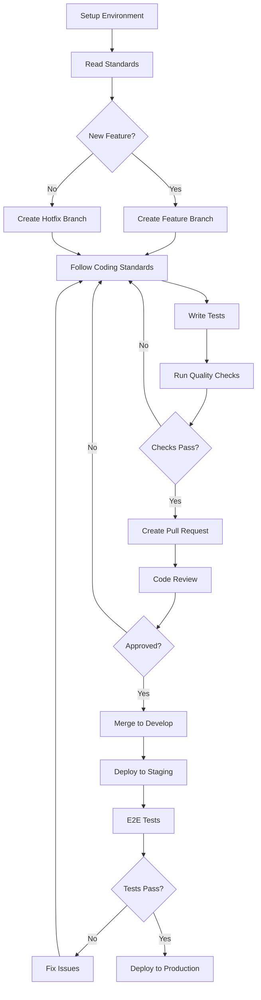

# Development Standards

This document consolidates development standards and workflow guidelines for the BATbern Event Management Platform. For detailed specifications, see the individual documents below.

## Core Standards Documents

The development standards are organized into three core documents:

### [📋 Coding Standards](./coding-standards.md)
Comprehensive coding standards, naming conventions, and quality guidelines:
- Critical fullstack rules and conventions
- Git workflow and commit message formats
- Code review checklist and testing standards
- Documentation requirements and performance targets

### [🛠️ Technology Stack](./tech-stack.md)
Complete technology stack specifications with versions and rationale:
- Frontend, backend, and infrastructure technology choices
- Development tools and testing frameworks
- Browser support and IDE recommendations
- Technology decision rationale and alternatives

### [📁 Source Tree Structure](./source-tree.md)
Project organization and directory structure guidelines:
- Multi-repository DDD-based structure
- Service and frontend directory layouts
- Shared kernel and infrastructure organization
- File naming conventions and integration points

## Development Workflow

### Local Development Setup

#### Prerequisites
```bash
java --version          # Java 21 LTS
node --version         # Node.js 20+
docker --version       # Docker Desktop
aws --version          # AWS CLI v2
cdk --version          # AWS CDK v2.110+
gradle --version       # Gradle 8.5+
```

#### Initial Setup
```bash
# Clone and setup shared kernel
cd shared-kernel
./gradlew publishToMavenLocal

# Setup infrastructure
cd infrastructure
npm install && npm run build

# Setup frontend
cd web-frontend
npm install && npm run build

# Setup each domain service
for service in event-management speaker-coordination partner-analytics attendee-experience company-management; do
  cd services/$service && ./gradlew build && cd ../..
done

# Start local environment
docker-compose up -d
```

#### Development Commands
```bash
# Start all services
npm run dev:all

# Start individual services
npm run dev:frontend
npm run dev:event-management
# etc.

# Run tests
npm run test:all
npm run test:frontend
npm run test:backend
npm run test:integration
npm run test:e2e
```

### Environment Configuration

#### Frontend Environment Variables
```bash
VITE_API_BASE_URL=http://localhost:8080
VITE_COGNITO_USER_POOL_ID=eu-central-1_dev_pool
VITE_COGNITO_CLIENT_ID=dev_client_id
VITE_PWA_ENABLED=true
VITE_FEATURE_AI_RECOMMENDATIONS=true
```

#### Backend Environment Variables
```bash
DB_HOST=localhost
DB_PORT=5432
DB_NAME=batbern_dev
REDIS_HOST=localhost
AWS_REGION=eu-central-1
JWT_SECRET=dev-secret-key
COGNITO_USER_POOL_ID=eu-central-1_dev_pool
```

## Quick Reference Links

### For New Developers
1. **Start Here**: [Technology Stack](./tech-stack.md) - Understand the technology choices
2. **Setup**: Follow the Local Development Setup above
3. **Coding**: Review [Coding Standards](./coding-standards.md) for conventions
4. **Structure**: See [Source Tree Structure](./source-tree.md) for project organization

### For Code Reviews
- [Coding Standards - Code Review Checklist](./coding-standards.md#code-review-checklist)
- [Coding Standards - Testing Standards](./coding-standards.md#testing-standards)
- [Coding Standards - Performance Standards](./coding-standards.md#performance-standards)

### For Architecture Decisions
- [Technology Stack - Technology Decision Rationale](./tech-stack.md#technology-decision-rationale)
- [Source Tree Structure - Integration Points](./source-tree.md#integration-points)
- [Source Tree Structure - Key Directory Conventions](./source-tree.md#key-directory-conventions)

## Development Process Overview



This comprehensive development standards framework ensures consistency, quality, and maintainability across the entire BATbern platform development lifecycle. Each team member should familiarize themselves with all three core documents to maintain the high standards expected for this enterprise-grade event management platform.