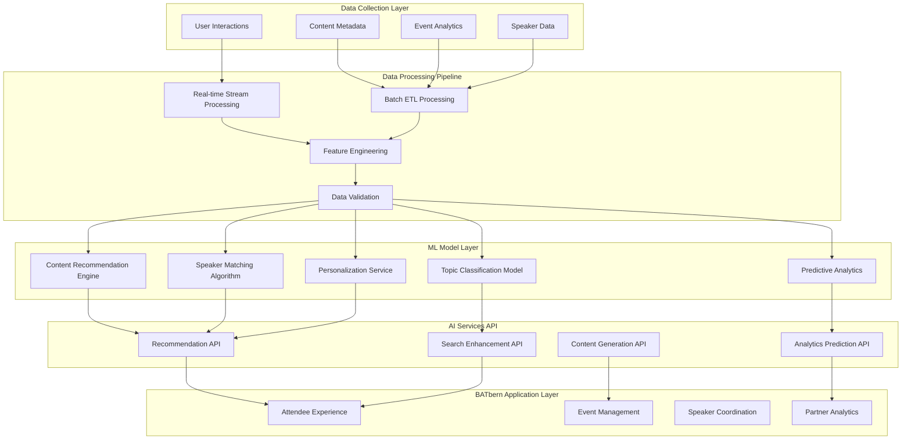

# AI/ML Architecture for Future Enhancement Phases

This section outlines the comprehensive AI/ML architecture designed to enhance the BATbern platform with intelligent features across all user domains.

## AI/ML Strategic Overview

### Phase Implementation Strategy

**Phase 1: Foundation (Months 1-3)**
- Data collection infrastructure
- Basic recommendation engine
- Content similarity matching

**Phase 2: Intelligence (Months 4-8)**
- Advanced personalization
- Predictive analytics
- Automated content categorization

**Phase 3: Automation (Months 9-12)**
- Workflow optimization
- Intelligent speaker matching
- Automated content generation

## AI/ML Technology Stack

### Core ML Platform

```yaml
# AI/ML Infrastructure Components
ML Platform:
  Training Infrastructure:
    - AWS SageMaker: Model training and experimentation
    - Jupyter Notebooks: Research and development environment
    - MLflow: Experiment tracking and model versioning
    - Apache Airflow: ML pipeline orchestration

  Model Serving:
    - AWS Lambda: Real-time inference for lightweight models
    - Amazon ECS: Containerized model serving for complex models
    - API Gateway: Unified ML API endpoints
    - Model caching: Redis for frequently accessed predictions

  Data Platform:
    - Amazon S3: Data lake for training data and model artifacts
    - Amazon Redshift: Data warehouse for analytics
    - AWS Glue: ETL and data catalog
    - Amazon Kinesis: Real-time data streaming

  ML Development:
    - PyTorch/TensorFlow: Deep learning frameworks
    - scikit-learn: Traditional ML algorithms
    - Hugging Face Transformers: NLP models
    - spaCy: Text processing and NER
    - FAISS: Vector similarity search
```

### AI/ML Service Architecture



## Domain-Specific AI/ML Features

### Attendee Experience Intelligence

**Content Recommendation Engine:**

```python
# Advanced recommendation system architecture
from dataclasses import dataclass
from typing import List, Dict, Any
import numpy as np
from sklearn.feature_extraction.text import TfidfVectorizer
from sklearn.metrics.pairwise import cosine_similarity

@dataclass
class ContentRecommendationRequest:
    user_id: str
    current_session_id: str
    user_preferences: Dict[str, Any]
    content_history: List[str]
    context: Dict[str, Any]  # Current event, role, etc.

@dataclass
class RecommendationResult:
    content_id: str
    score: float
    reason: str
    confidence: float

class HybridRecommendationEngine:
    """
    Multi-strategy recommendation engine combining:
    - Collaborative filtering
    - Content-based filtering
    - Knowledge-based recommendations
    - Context-aware filtering
    """

    def __init__(self):
        self.collaborative_model = CollaborativeFilteringModel()
        self.content_model = ContentBasedModel()
        self.knowledge_model = KnowledgeBasedModel()
        self.context_model = ContextAwareModel()

    async def get_recommendations(
        self,
        request: ContentRecommendationRequest,
        max_results: int = 10
    ) -> List[RecommendationResult]:

        # Get recommendations from each strategy
        collaborative_recs = await self.collaborative_model.recommend(request)
        content_recs = await self.content_model.recommend(request)
        knowledge_recs = await self.knowledge_model.recommend(request)
        context_recs = await self.context_model.recommend(request)

        # Hybrid scoring with dynamic weights
        weights = self._calculate_strategy_weights(request)

        # Combine and rank recommendations
        combined_scores = self._combine_recommendations(
            collaborative_recs, content_recs, knowledge_recs, context_recs,
            weights
        )

        # Apply business rules and diversity
        final_recommendations = self._apply_business_rules(
            combined_scores, request, max_results
        )

        return final_recommendations

    def _calculate_strategy_weights(self, request: ContentRecommendationRequest) -> Dict[str, float]:
        """Dynamic weight calculation based on user context and data availability"""

        # New users get more knowledge-based recommendations
        if len(request.content_history) < 5:
            return {
                'collaborative': 0.1,
                'content': 0.3,
                'knowledge': 0.4,
                'context': 0.2
            }

        # Experienced users get more collaborative filtering
        elif len(request.content_history) > 50:
            return {
                'collaborative': 0.4,
                'content': 0.2,
                'knowledge': 0.2,
                'context': 0.2
            }

        # Balanced approach for regular users
        else:
            return {
                'collaborative': 0.3,
                'content': 0.3,
                'knowledge': 0.2,
                'context': 0.2
            }

class IntelligentSearchEngine:
    """
    AI-powered search with semantic understanding and query expansion
    """

    def __init__(self):
        self.semantic_model = SentenceTransformerModel('all-MiniLM-L6-v2')
        self.query_expander = QueryExpansionModel()
        self.ranking_model = LearningToRankModel()

    async def search(
        self,
        query: str,
        user_context: Dict[str, Any],
        filters: Dict[str, Any] = None
    ) -> List[SearchResult]:

        # Expand query with synonyms and related terms
        expanded_query = await self.query_expander.expand(query, user_context)

        # Semantic search using embeddings
        semantic_results = await self._semantic_search(expanded_query)

        # Traditional keyword search
        keyword_results = await self._keyword_search(query, filters)

        # Combine and re-rank results
        combined_results = await self._combine_search_results(
            semantic_results, keyword_results, user_context
        )

        # Personalize ranking based on user preferences
        personalized_results = await self.ranking_model.rerank(
            combined_results, user_context
        )

        return personalized_results

    async def _semantic_search(self, query: str) -> List[SearchResult]:
        """Vector similarity search using pre-computed content embeddings"""

        # Generate query embedding
        query_embedding = self.semantic_model.encode([query])

        # Search against content embeddings in vector database
        similar_content = await self.vector_db.similarity_search(
            query_embedding, top_k=50
        )

        return similar_content
```

**Personalization Service:**

```python
class PersonalizationService:
    """
    Real-time personalization for content discovery and user experience
    """

    def __init__(self):
        self.user_profile_model = UserProfileModel()
        self.content_analyzer = ContentAnalyzer()
        self.engagement_predictor = EngagementPredictor()

    async def personalize_content_feed(
        self,
        user_id: str,
        available_content: List[Content]
    ) -> List[PersonalizedContent]:

        # Get comprehensive user profile
        user_profile = await self.user_profile_model.get_profile(user_id)

        # Analyze content characteristics
        content_features = await self.content_analyzer.extract_features(available_content)

        # Predict engagement probability for each content item
        engagement_predictions = await self.engagement_predictor.predict(
            user_profile, content_features
        )

        # Apply personalization rules
        personalized_content = []
        for content, prediction in zip(available_content, engagement_predictions):
            personalized_item = PersonalizedContent(
                content=content,
                relevance_score=prediction.relevance,
                engagement_probability=prediction.engagement,
                explanation=self._generate_explanation(user_profile, content, prediction)
            )
            personalized_content.append(personalized_item)

        # Sort by combined score and apply diversity
        return self._apply_diversity_ranking(personalized_content)

    def _generate_explanation(
        self,
        user_profile: UserProfile,
        content: Content,
        prediction: EngagementPrediction
    ) -> str:
        """Generate human-readable explanation for recommendation"""

        reasons = []

        if prediction.topic_match > 0.8:
            reasons.append(f"Matches your interest in {content.primary_topic}")

        if prediction.speaker_preference > 0.7:
            reasons.append(f"By {content.speaker_name}, a speaker you've engaged with before")

        if prediction.complexity_match > 0.6:
            reasons.append("Appropriate complexity level for your experience")

        if prediction.recency_boost > 0.5:
            reasons.append("Recent content in your areas of interest")

        return " • ".join(reasons) if reasons else "Recommended based on your overall preferences"
```

### Event Management Intelligence

**Intelligent Speaker Matching:**

```python
class IntelligentSpeakerMatching:
    """
    AI-powered speaker matching and event optimization
    """

    def __init__(self):
        self.speaker_analyzer = SpeakerAnalyzer()
        self.topic_matcher = TopicMatcher()
        self.scheduling_optimizer = SchedulingOptimizer()
        self.success_predictor = SpeakerSuccessPredictor()

    async def suggest_speakers(
        self,
        event_requirements: EventRequirements
    ) -> List[SpeakerSuggestion]:

        # Analyze event requirements and extract key criteria
        criteria = await self._extract_speaker_criteria(event_requirements)

        # Get candidate speakers from database
        candidate_speakers = await self._get_candidate_speakers(criteria)

        # Score each speaker against requirements
        speaker_scores = []
        for speaker in candidate_speakers:
            score = await self._score_speaker_match(speaker, criteria)
            speaker_scores.append((speaker, score))

        # Rank speakers by combined score
        ranked_speakers = sorted(speaker_scores, key=lambda x: x[1].total_score, reverse=True)

        # Generate suggestions with explanations
        suggestions = []
        for speaker, score in ranked_speakers[:20]:  # Top 20 candidates
            suggestion = SpeakerSuggestion(
                speaker=speaker,
                match_score=score.total_score,
                expertise_match=score.expertise_score,
                availability_probability=score.availability_score,
                success_prediction=score.success_score,
                explanation=self._generate_speaker_explanation(speaker, score, criteria)
            )
            suggestions.append(suggestion)

        return suggestions

    async def _score_speaker_match(
        self,
        speaker: Speaker,
        criteria: SpeakerCriteria
    ) -> SpeakerMatchScore:

        # Expertise matching
        expertise_score = await self.topic_matcher.calculate_expertise_match(
            speaker.expertise_areas, criteria.required_topics
        )

        # Historical performance
        historical_score = await self._calculate_historical_performance(
            speaker, criteria.event_type
        )

        # Availability prediction
        availability_score = await self._predict_availability(
            speaker, criteria.event_date, criteria.location
        )

        # Audience engagement prediction
        engagement_score = await self.success_predictor.predict_engagement(
            speaker, criteria.audience_profile
        )

        # Combine scores with weights
        total_score = (
            expertise_score * 0.4 +
            historical_score * 0.2 +
            availability_score * 0.2 +
            engagement_score * 0.2
        )

        return SpeakerMatchScore(
            total_score=total_score,
            expertise_score=expertise_score,
            historical_score=historical_score,
            availability_score=availability_score,
            success_score=engagement_score
        )

class EventOptimizationEngine:
    """
    Predictive analytics for event planning and optimization
    """

    def __init__(self):
        self.attendance_predictor = AttendancePredictionModel()
        self.engagement_optimizer = EngagementOptimizer()
        self.resource_optimizer = ResourceOptimizer()

    async def optimize_event_planning(
        self,
        event_plan: EventPlan
    ) -> OptimizationRecommendations:

        # Predict attendance based on historical data and current trends
        attendance_prediction = await self.attendance_predictor.predict(event_plan)

        # Optimize session scheduling for maximum engagement
        schedule_optimization = await self.engagement_optimizer.optimize_schedule(
            event_plan.sessions, attendance_prediction
        )

        # Optimize resource allocation
        resource_optimization = await self.resource_optimizer.optimize_resources(
            event_plan, attendance_prediction
        )

        # Generate comprehensive recommendations
        recommendations = OptimizationRecommendations(
            attendance_forecast=attendance_prediction,
            schedule_changes=schedule_optimization.recommended_changes,
            resource_adjustments=resource_optimization.adjustments,
            risk_factors=self._identify_risk_factors(event_plan, attendance_prediction),
            success_probability=self._calculate_success_probability(event_plan)
        )

        return recommendations
```

### Partner Analytics Intelligence

**Advanced ROI Analytics:**

```python
class AdvancedPartnerAnalytics:
    """
    AI-powered partner analytics with predictive insights
    """

    def __init__(self):
        self.roi_predictor = ROIPredictionModel()
        self.engagement_analyzer = EngagementAnalyzer()
        self.trend_detector = TrendDetector()
        self.forecasting_model = ForecastingModel()

    async def generate_partner_insights(
        self,
        partner_id: str,
        analysis_period: AnalysisPeriod
    ) -> PartnerInsights:

        # Gather partner engagement data
        engagement_data = await self._collect_engagement_data(partner_id, analysis_period)

        # Analyze ROI trends and patterns
        roi_analysis = await self.roi_predictor.analyze_roi_trends(engagement_data)

        # Detect emerging trends in partner's employee interests
        interest_trends = await self.trend_detector.detect_interest_trends(engagement_data)

        # Predict future engagement patterns
        engagement_forecast = await self.forecasting_model.forecast_engagement(
            engagement_data, forecast_period="6_months"
        )

        # Generate strategic recommendations
        strategic_recommendations = await self._generate_strategic_recommendations(
            roi_analysis, interest_trends, engagement_forecast
        )

        insights = PartnerInsights(
            roi_analysis=roi_analysis,
            engagement_trends=interest_trends,
            future_forecast=engagement_forecast,
            strategic_recommendations=strategic_recommendations,
            competitive_benchmarks=await self._generate_competitive_benchmarks(partner_id),
            optimization_opportunities=await self._identify_optimization_opportunities(engagement_data)
        )

        return insights

    async def _generate_strategic_recommendations(
        self,
        roi_analysis: ROIAnalysis,
        trends: InterestTrends,
        forecast: EngagementForecast
    ) -> List[StrategicRecommendation]:

        recommendations = []

        # Topic investment recommendations
        if trends.emerging_topics:
            for topic in trends.emerging_topics:
                recommendation = StrategicRecommendation(
                    type="topic_investment",
                    priority="high",
                    title=f"Invest in {topic.name} content",
                    description=f"Growing interest detected (+{topic.growth_rate}% over 6 months)",
                    expected_impact=f"Potential {topic.predicted_roi_increase}% ROI increase",
                    implementation_timeline="3-6 months"
                )
                recommendations.append(recommendation)

        # Engagement optimization recommendations
        if forecast.declining_engagement_areas:
            for area in forecast.declining_engagement_areas:
                recommendation = StrategicRecommendation(
                    type="engagement_optimization",
                    priority="medium",
                    title=f"Revitalize {area.name} engagement",
                    description=f"Predicted {area.decline_rate}% decrease in engagement",
                    expected_impact="Maintain current engagement levels",
                    implementation_timeline="1-3 months"
                )
                recommendations.append(recommendation)

        return recommendations

class PredictiveTopicAnalyzer:
    """
    AI-powered topic trend analysis and prediction
    """

    def __init__(self):
        self.trend_model = TopicTrendModel()
        self.sentiment_analyzer = SentimentAnalyzer()
        self.external_trend_monitor = ExternalTrendMonitor()

    async def analyze_topic_trends(
        self,
        historical_data: HistoricalTopicData,
        external_sources: List[str] = None
    ) -> TopicTrendAnalysis:

        # Analyze internal topic engagement trends
        internal_trends = await self.trend_model.analyze_internal_trends(historical_data)

        # Monitor external industry trends
        external_trends = await self.external_trend_monitor.analyze_external_trends(
            external_sources or ["tech_news", "conference_topics", "job_markets"]
        )

        # Predict emerging topics
        emerging_topics = await self._predict_emerging_topics(internal_trends, external_trends)

        # Analyze topic sentiment and satisfaction
        topic_sentiment = await self.sentiment_analyzer.analyze_topic_sentiment(
            historical_data.feedback_data
        )

        analysis = TopicTrendAnalysis(
            trending_topics=internal_trends.trending,
            declining_topics=internal_trends.declining,
            emerging_topics=emerging_topics,
            external_influences=external_trends,
            sentiment_analysis=topic_sentiment,
            recommendations=await self._generate_topic_recommendations(
                internal_trends, external_trends, emerging_topics
            )
        )

        return analysis
```

## ML Model Deployment and Management

### Model Lifecycle Management

```yaml
# MLOps Pipeline Configuration
model_deployment:
  staging_pipeline:
    triggers:
      - model_accuracy_threshold: 0.85
      - training_data_freshness: 7_days
      - performance_regression: false

    validation_steps:
      - unit_tests: pytest tests/ml/
      - integration_tests: pytest tests/integration/ml/
      - model_validation: validate_model_metrics.py
      - a_b_testing: configure_model_ab_test.py

    deployment:
      - container_build: docker build -t ml-service:${VERSION}
      - staging_deploy: kubectl apply -f k8s/staging/
      - canary_release: 5% traffic for 24 hours
      - full_release: gradual rollout over 7 days

  production_pipeline:
    approval_gates:
      - data_science_review: required
      - performance_validation: automated
      - security_scan: automated
      - stakeholder_approval: manual

    monitoring:
      - model_drift_detection: hourly
      - performance_degradation: real-time
      - prediction_latency: < 100ms p95
      - prediction_accuracy: > 0.85 ongoing
```

### Real-time Model Serving

```python
class MLModelService:
    """
    Scalable ML model serving with caching and monitoring
    """

    def __init__(self):
        self.model_registry = ModelRegistry()
        self.cache = RedisCache()
        self.monitoring = ModelMonitoring()

    async def predict(
        self,
        model_name: str,
        input_data: Dict[str, Any],
        cache_ttl: int = 300
    ) -> PredictionResult:

        # Check cache first
        cache_key = self._generate_cache_key(model_name, input_data)
        cached_result = await self.cache.get(cache_key)

        if cached_result:
            self.monitoring.record_cache_hit(model_name)
            return cached_result

        # Load model (with lazy loading and model versioning)
        model = await self.model_registry.get_model(model_name)

        # Preprocess input data
        processed_input = await self._preprocess_input(input_data, model.preprocessor)

        # Make prediction
        prediction_start = time.time()
        prediction = await model.predict(processed_input)
        prediction_time = time.time() - prediction_start

        # Postprocess results
        result = await self._postprocess_prediction(prediction, model.postprocessor)

        # Cache result
        await self.cache.set(cache_key, result, ttl=cache_ttl)

        # Record metrics
        self.monitoring.record_prediction(
            model_name=model_name,
            prediction_time=prediction_time,
            input_size=len(str(input_data)),
            cache_miss=True
        )

        return result

    async def batch_predict(
        self,
        model_name: str,
        batch_data: List[Dict[str, Any]]
    ) -> List[PredictionResult]:

        # Optimize batch processing
        model = await self.model_registry.get_model(model_name)

        # Process in optimal batch sizes
        batch_size = model.optimal_batch_size
        results = []

        for i in range(0, len(batch_data), batch_size):
            batch = batch_data[i:i + batch_size]
            batch_predictions = await model.batch_predict(batch)
            results.extend(batch_predictions)

        return results
```

## Data Privacy and AI Ethics

### Privacy-Preserving ML

```python
class PrivacyPreservingMLService:
    """
    Privacy-preserving machine learning with differential privacy
    """

    def __init__(self):
        self.privacy_budget = PrivacyBudgetManager()
        self.anonymizer = DataAnonymizer()
        self.federated_learning = FederatedLearningCoordinator()

    async def train_private_model(
        self,
        training_data: TrainingData,
        privacy_params: PrivacyParameters
    ) -> PrivateModel:

        # Apply differential privacy during training
        dp_trainer = DifferentialPrivacyTrainer(
            epsilon=privacy_params.epsilon,
            delta=privacy_params.delta,
            max_grad_norm=privacy_params.max_grad_norm
        )

        # Train model with privacy guarantees
        private_model = await dp_trainer.train(training_data)

        # Validate privacy guarantees
        privacy_validation = await self._validate_privacy_guarantees(
            private_model, privacy_params
        )

        return private_model

    async def anonymize_user_data(
        self,
        user_data: UserData,
        anonymization_level: str = "k_anonymity"
    ) -> AnonymizedData:

        if anonymization_level == "k_anonymity":
            return await self.anonymizer.k_anonymize(user_data, k=5)
        elif anonymization_level == "l_diversity":
            return await self.anonymizer.l_diversify(user_data, l=3)
        elif anonymization_level == "differential_privacy":
            return await self.anonymizer.differential_privacy_anonymize(user_data)

        raise ValueError(f"Unknown anonymization level: {anonymization_level}")
```

## Performance and Scalability

### ML Infrastructure Scaling

```yaml
# Kubernetes ML Service Configuration
apiVersion: apps/v1
kind: Deployment
metadata:
  name: ml-recommendation-service
spec:
  replicas: 3
  selector:
    matchLabels:
      app: ml-recommendation-service
  template:
    metadata:
      labels:
        app: ml-recommendation-service
    spec:
      containers:
      - name: ml-service
        image: batbern/ml-recommendation:v1.2.0
        resources:
          requests:
            memory: "2Gi"
            cpu: "1000m"
            nvidia.com/gpu: "1"
          limits:
            memory: "4Gi"
            cpu: "2000m"
            nvidia.com/gpu: "1"
        env:
        - name: MODEL_CACHE_SIZE
          value: "1000"
        - name: BATCH_SIZE
          value: "32"
        - name: REDIS_URL
          valueFrom:
            secretKeyRef:
              name: ml-service-config
              key: redis-url
        livenessProbe:
          httpGet:
            path: /health
            port: 8080
          initialDelaySeconds: 30
          periodSeconds: 10
        readinessProbe:
          httpGet:
            path: /ready
            port: 8080
          initialDelaySeconds: 5
          periodSeconds: 5
---
apiVersion: v1
kind: Service
metadata:
  name: ml-recommendation-service
spec:
  selector:
    app: ml-recommendation-service
  ports:
  - port: 80
    targetPort: 8080
  type: LoadBalancer
---
apiVersion: autoscaling/v2
kind: HorizontalPodAutoscaler
metadata:
  name: ml-recommendation-hpa
spec:
  scaleTargetRef:
    apiVersion: apps/v1
    kind: Deployment
    name: ml-recommendation-service
  minReplicas: 2
  maxReplicas: 10
  metrics:
  - type: Resource
    resource:
      name: cpu
      target:
        type: Utilization
        averageUtilization: 70
  - type: Resource
    resource:
      name: memory
      target:
        type: Utilization
        averageUtilization: 80
  - type: Pods
    pods:
      metric:
        name: ml_requests_per_second
      target:
        type: AverageValue
        averageValue: "50"
```

This comprehensive AI/ML architecture provides the foundation for intelligent features across all domains of the BATbern platform, with emphasis on scalability, privacy, and user experience enhancement.
