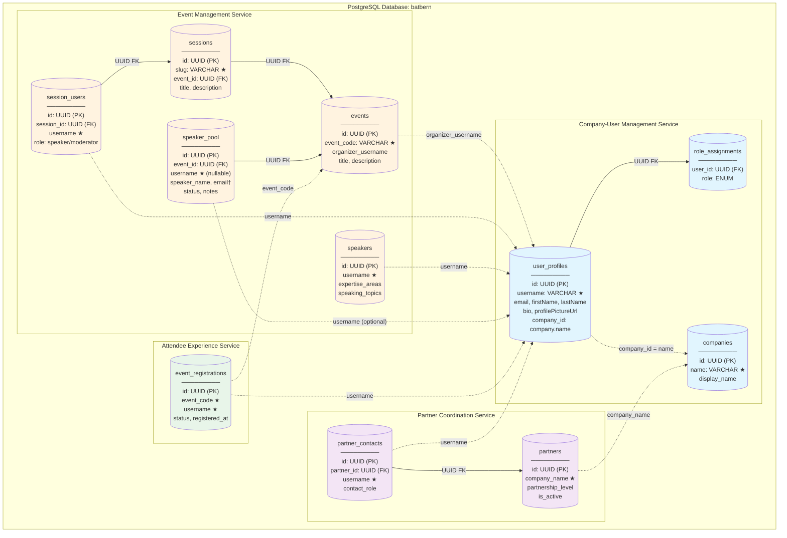
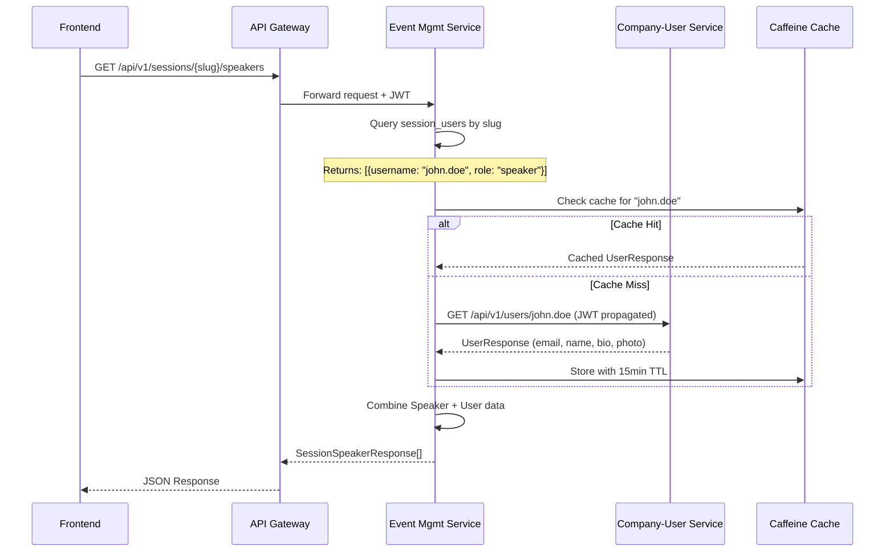
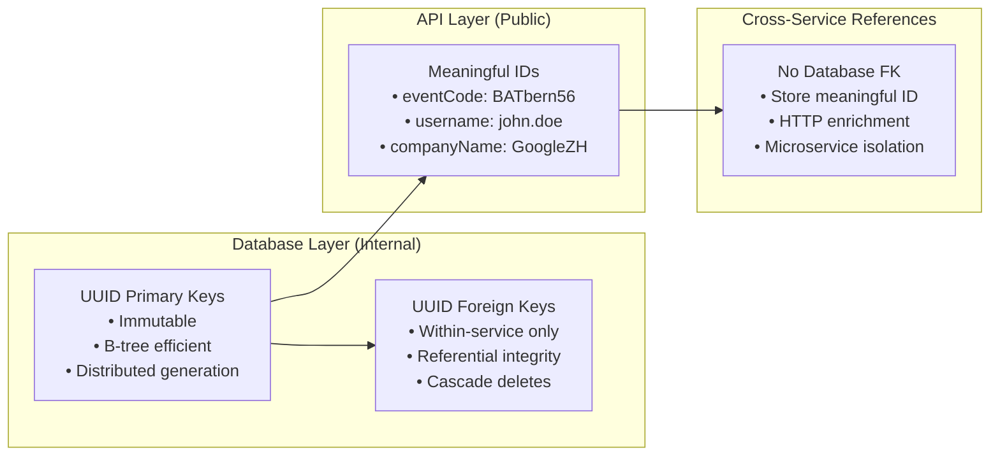

# BATbern Data Architecture - Logical Diagram

## Overview

This diagram shows the logical data architecture following ADR-003 (Meaningful Identifiers) and ADR-004 (User Data Centralization).

**Key Principles:**
- **Single PostgreSQL database** (`batbern`) with shared `public` schema
- **Cross-service references** use meaningful IDs (username, eventCode, companyName) - NOT UUIDs
- **Within-service references** use UUID foreign keys
- **No database foreign keys** across service boundaries
- **HTTP-based enrichment** for cross-service data access

---

## Service Ownership Diagram



**Legend:**
- ★ = Meaningful ID (exposed in API)
- † = ADR-004 exemption (SpeakerPool brainstorming entity)
- Solid arrows = UUID Foreign Keys (within service)
- Dashed arrows = Meaningful ID references (cross-service, no DB FK)

---

## Cross-Service Communication Pattern



---

## Identifier Strategy



---

## Entity Relationship Summary

| Service | Entity | PK | Meaningful ID | Cross-Service Refs |
|---------|--------|----|--------------|--------------------|
| Company-User | Company | UUID | `name` | - |
| Company-User | User | UUID | `username` | `company_id` → Company.name |
| Event Mgmt | Event | UUID | `event_code` | `organizer_username` → User |
| Event Mgmt | Session | UUID | `slug` | - |
| Event Mgmt | SessionUser | UUID | - | `username` → User |
| Event Mgmt | Speaker | UUID | - | `username` → User |
| Event Mgmt | SpeakerPool | UUID | - | `username` → User (optional†) |
| Partner Coord | Partner | UUID | - | `company_name` → Company |
| Partner Coord | PartnerContact | UUID | - | `username` → User |
| Attendee Exp | Registration | UUID | - | `event_code` → Event, `username` → User |

† SpeakerPool has ADR-004 exemption for brainstorming phase (tracks potential speakers without accounts)

---

## ADR Compliance Summary

### ADR-003: Meaningful Identifiers
- ✅ All public APIs use meaningful IDs (eventCode, username, companyName)
- ✅ Cross-service references store meaningful IDs, not UUIDs
- ✅ No database foreign keys across service boundaries
- ✅ HTTP-based enrichment for cross-service data

### ADR-004: User Data Centralization
- ✅ User profile fields (email, name, bio, photo) only in User Service
- ✅ Domain entities reference User by username
- ✅ 15-minute Caffeine cache for HTTP enrichment
- ⚠️ SpeakerPool exemption documented (brainstorming entity)

---

## Service Boundary Rules

```
┌─────────────────────────────────────────────────────────────┐
│  RULE: Reference Decision Tree                               │
├─────────────────────────────────────────────────────────────┤
│                                                              │
│  Is the referenced entity in THIS service's database?        │
│  │                                                           │
│  ├─ YES → Use UUID Foreign Key ✅                            │
│  │        Example: session_id UUID REFERENCES sessions(id)   │
│  │                                                           │
│  └─ NO  → Use Meaningful ID (String) ✅                      │
│           Example: username VARCHAR(100)                     │
│           NO database FK constraint                          │
│           Enrich via HTTP call                               │
│                                                              │
└─────────────────────────────────────────────────────────────┘
```
