# AWS Icons Test

This is a test document to verify AWS icon integration in Mermaid diagrams.

## Test Diagram with AWS Icons

```mermaid
architecture-beta
    service cloudfront(logos:aws)[CloudFront CDN]
    service apigateway(logos:aws-lambda)[API Gateway]
    service ecs(logos:aws-ec2)[ECS Fargate]
    service rds(logos:aws-aurora)[RDS PostgreSQL]
    service s3(logos:aws-s3)[S3 Storage]

    cloudfront:R --> L:apigateway
    apigateway:R --> L:ecs
    ecs:R --> L:rds
    ecs:R --> L:s3
```

## Notes

- If icons appear, the integration is working!
- If you see boxes instead, check browser console for errors
- This uses the `logos` icon pack which has limited AWS services

## Next Steps

After confirming this works, we can:
1. Switch to full AWS icon pack with `aws:` prefix
2. Update all architecture diagrams to use icons
3. Remove this test file
