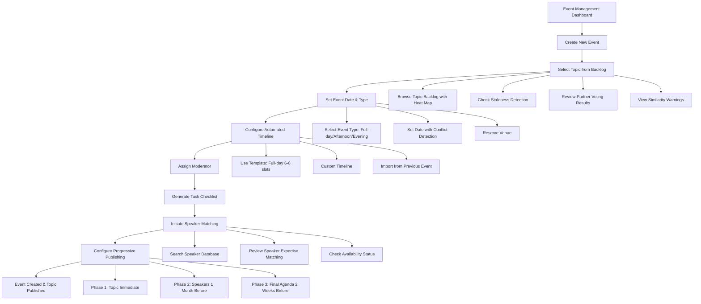
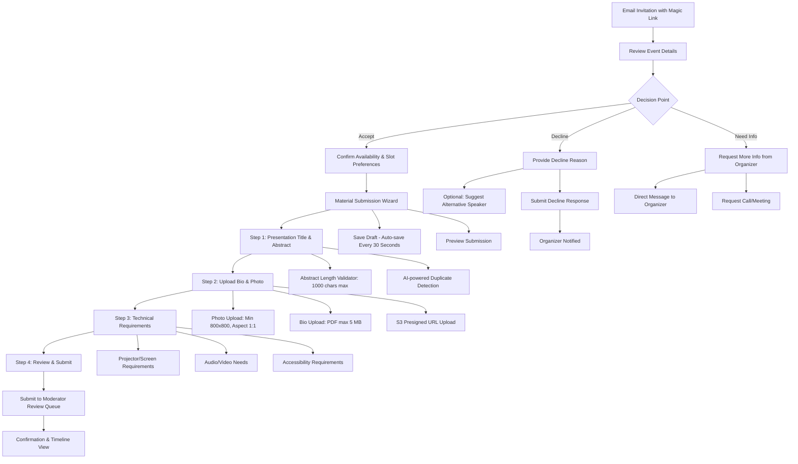
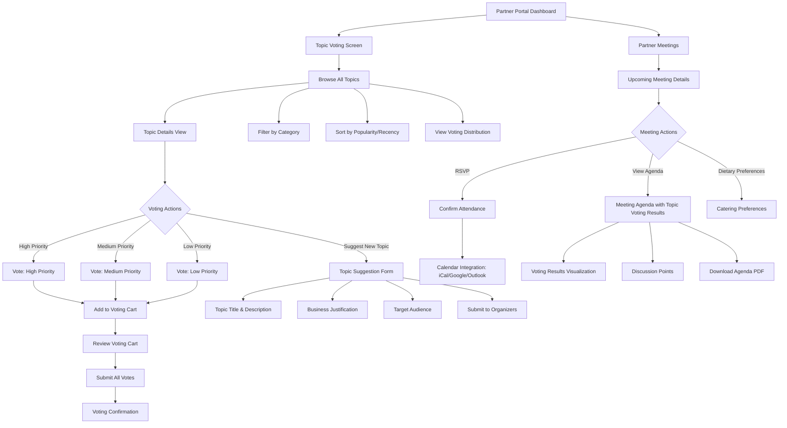
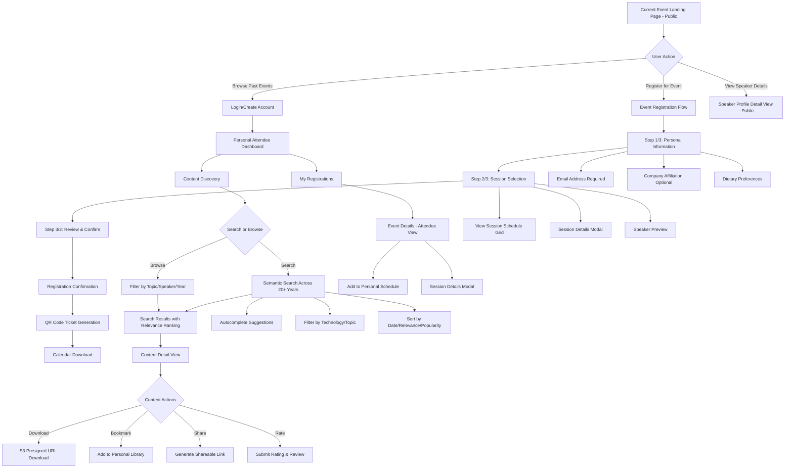

# BATbern Event Management Platform - UI/UX Specification

## Introduction

This document defines the user experience goals, information architecture, user flows, and visual design specifications for **BATbern Event Management Platform**'s user interface. It serves as the foundation for visual design and frontend development, ensuring a cohesive and user-centered experience.

Based on the comprehensive PRD v4 and Epic structure, this UI/UX specification addresses the unique challenge of designing for four distinct stakeholder groups using a React-based frontend architecture:
- **Event Organizers**: Need workflow efficiency, task management, and intelligent automation
- **Speakers**: Need simple submission and communication tools with self-service capabilities
- **Partners/Sponsors**: Need topic voting and strategic meeting coordination
- **Attendees**: Need content discovery, event information, and registration functionality

**Key Focus Areas:**
- Role-based interfaces with seamless role switching
- Progressive disclosure for complex 16-step event workflows
- Email & notification infrastructure with multi-channel delivery
- Content management with AWS S3/CloudFront integration
- User role management with promotion/demotion workflows
- Company management and Swiss UID integration

## 1. Overall UX Goals & Principles

### 1.1 Target User Personas

**Event Organizer (Primary Power User)**
- Technical professionals (Swiss IT community members) managing complex 16-step event workflows
- Need efficiency, task visibility, intelligent automation, and cross-role collaboration
- High frequency users requiring advanced features, keyboard shortcuts, and bulk operations
- Typical scenario: Managing 2-4 events annually with teams of 3-5 organizers

**Speaker/Presenter (Expert Contributors)**
- Busy IT professionals with limited time for submission processes
- Need clear expectations, simple workflows, self-service capabilities, and deadline visibility
- Occasional users (1-3 times per year) who must complete critical tasks accurately
- Typical scenario: Responding to invitation, submitting materials within tight deadlines

**Partner/Sponsor (Business Stakeholders)**
- Corporate decision-makers needing strategic input and meeting coordination
- Need topic voting interface, meeting scheduling, and future analytics capabilities
- Periodic users (quarterly voting, bi-annual meetings) focused on strategic influence
- Typical scenario: Voting on topics, attending partner meetings, reviewing strategic alignment

**Attendee/Community Member (End Consumers)**
- Swiss IT professionals seeking relevant content, networking, and learning
- Need content discovery, event information, registration, and historical archive access
- Varied usage patterns from first-time attendees to 10+ year veterans
- Typical scenario: Discovering upcoming events, registering, accessing past presentations

### 1.2 Usability Goals

- **Organizer Efficiency**: Reduce event planning time by 60% through intelligent workflow automation and task sequencing (16-step workflow → automated checkpoints)
- **Speaker Simplicity**: New speakers complete invitation response and material submission in under 10 minutes with progressive saving and clear progress indicators
- **Partner Clarity**: Topic voting interface allows batch voting on 10+ topics in under 5 minutes with clear impact visualization
- **Content Discovery**: Attendees find relevant historical content within 30 seconds using semantic search across 20+ years of archives
- **Role Transition**: Users with multiple roles switch contexts in <2 clicks with preserved state and clear visual role indicators
- **Mobile Experience**: Critical speaker tasks (invitation response, material upload) and attendee actions (registration, content viewing) fully functional on mobile devices
- **Notification Clarity**: Multi-channel notification system delivers actionable alerts without overwhelming users (intelligent batching, priority-based delivery)
- **Company Management**: Organizers can create/edit company profiles with Swiss UID verification in under 3 minutes

### 1.3 Design Principles

1. **Role-Centric Design** - Each user sees only what's relevant to their current role and goals. Navigation, dashboards, and actions adapt to user permissions and context. Clear visual differentiation between role-specific portals.

2. **Progressive Disclosure** - Complex workflows (16-step event creation, material submission) broken into manageable steps with clear progress indicators. Advanced features hidden until needed, revealed through contextual triggers.

3. **Contextual Intelligence** - System provides smart defaults, recommendations, and automation based on user behavior, historical patterns, and role expertise. Predictive task suggestions reduce cognitive load.

4. **Immediate Value** - Every screen provides clear value proposition and next actions. No empty states without guidance. First-time users see contextual onboarding; returning users see personalized dashboards.

5. **Swiss Professional Precision** - Clean, reliable, professional aesthetic aligned with Swiss business culture. Minimal decorative elements; focus on clarity, data accuracy, and trust-building. Innovation in functionality, not visual experimentation.

6. **Notification-First Mindset** - Proactive communication keeps stakeholders aligned across complex multi-role workflows. Intelligent escalation prevents bottlenecks; cross-role visibility enables collaboration.

7. **Content-as-Asset** - Treat historical presentations and event materials as valuable, searchable, discoverable assets. Metadata-rich, properly categorized, with lifecycle management (S3 storage tiers, CDN delivery).

## 2. Information Architecture (IA)

### 2.1 Site Map / Screen Inventory

The BATbern platform architecture is organized into role-based portals with shared global components. The following diagram shows the complete screen hierarchy:

```mermaid
graph TD
    A[🌐 Public: Current Event Landing Page] --> B[Authentication Layer]
    B --> C[Role Selection Dashboard]

    C --> D[🎯 Organizer Portal]
    C --> E[🎤 Speaker Portal]
    C --> F[💼 Partner Portal]
    C --> G[👤 Attendee Portal]

    %% Global Shared Components
    C --> H[🌐 Global Components]
    H --> H1[User Profile]
    H --> H2[Notification Center]
    H --> H3[Main Navigation]

    %% Organizer Portal
    D --> D1[Event Management Dashboard]
    D1 --> D1A[Event Detail/Edit]
    D1 --> D1B[Workflow Visualization]
    D1 --> D1C[Topic Backlog Management]
    D1 --> D1D[Historical Archive]

    D --> D2[Speaker Coordination]
    D2 --> D2A[Speaker Matching Interface]
    D2 --> D2B[Invitation Management]
    D2 --> D2C[Moderator Review Queue]
    D2 --> D2D[Company Management]

    D --> D3[Content & Publishing]
    D3 --> D3A[Basic Publishing Engine]
    D3 --> D3B[Event Settings]
    D3 --> D3C[Content Library/Repository]

    D --> D4[Logistics]
    D4 --> D4A[Logistics Coordination]
    D4 --> D4B[Venue Management]

    %% Speaker Portal
    E --> E1[Speaker Dashboard]
    E1 --> E1A[Invitation Response]
    E1 --> E1B[Material Submission Wizard]
    E1 --> E1C[Event Timeline]
    E1 --> E1D[Speaker Profile Management]
    E1 --> E1E[Presentation Upload]

    %% Partner Portal
    F --> F1[Partner Dashboard]
    F1 --> F1A[Topic Voting]
    F1 --> F1B[All Topics Browser]
    F1 --> F1C[Partner Meetings]
    F1 --> F1D[Partner Settings]
    F1 --> F1E[Partner Directory]

    %% Attendee Portal
    G --> G1[Personal Attendee Dashboard]
    G1 --> G1A[Event Details - Attendee View]
    G1 --> G1B[Content Discovery]
    G1 --> G1C[Event Registration Flow]
    G1 --> G1D[User Settings]

    %% Public Entry Points
    A --> A1[Event Registration Flow]
    A --> A2[Session Details Modal]
    A --> A3[Speaker Profile Detail View]
```



**Wireframe Coverage Summary:**

✅ **Complete Coverage (47 wireframes exist)**
- Authentication Layer: Login, Account Creation, Forgot Password, Email Verification
- Organizer Portal: Event Management Dashboard, Topic Backlog, Speaker Matching, Company Management, Moderator Review
- Speaker Portal: Invitation Response, Material Submission, Event Timeline, Profile Management
- Partner Portal: Topic Voting, All Topics Browser, Partner Meetings, Partner Settings, Partner Directory
- Attendee Portal: Personal Dashboard, Event Details, Content Discovery, User Settings
- Global Components: Main Navigation, User Profile, Notification Center

📦 **Backlog/Post-MVP (FR13, FR16 removed from MVP)**
- Partner Analytics Dashboard (FR4)
- Employee Analytics (FR4)
- AI-powered Content Recommendations (FR13)

❌ **Missing/To Be Created**
- System Settings/Configuration (LOW priority - admin features)
- Agenda Proposal Screen (MEDIUM priority - partner meetings)
- Content Viewer Page (HIGH priority - will be created in Epic 5)
- Filter Modals (MEDIUM priority - reusable component)

### 2.2 Navigation Structure

**Primary Navigation:**

Role-based primary navigation with clear visual indication of current role. Main navigation bar adapts based on authenticated user role:

- **Organizer Navigation**: Events | Speakers | Partners | Content | Analytics | Settings
- **Speaker Navigation**: My Events | Submissions | Profile | Community | Help
- **Partner Navigation**: Topic Voting | Meetings | Settings | Help
- **Attendee Navigation**: Events | Content Library | My Dashboard | Settings

**Quick Role Switcher**: Persistent dropdown in header for users with multiple roles (e.g., "Viewing as: Organizer ▼" with options to switch to Speaker/Attendee roles)

**Global Components**: Search, Notification bell icon, User avatar/menu accessible from all screens

**Secondary Navigation:**

Contextual sub-navigation within each portal appears as:
- **Tabs** for related content areas (e.g., Event Settings: Registration | Publishing | Notifications | Integrations)
- **Sidebars** for hierarchical navigation (e.g., Topic Backlog: Active | Archived | Partner Suggested)
- **Action Panels** for frequently used quick actions (e.g., Create Event, Send Invitation, Export Data)

**Breadcrumb Strategy:**

**Format**: Portal > Section > Subsection > Current Page

**Examples**:
- `Organizer > Events > Topic Backlog > "AI & Machine Learning in Finance"`
- `Speaker > Submissions > Event "BATbern Spring 2025" > Material Upload`
- `Partner > Meetings > "Autumn 2024 Strategic Planning" > Agenda`
- `Attendee > Content Library > "Cloud Architecture" > Presentation Detail`

**Interactive Features**:
- All breadcrumb segments are clickable for quick navigation
- Context preservation when drilling down through related workflows
- Smart breadcrumbs show workflow progress in multi-step processes (e.g., "Material Submission: Step 2 of 4")

**Mobile Navigation Adaptation**:
- Hamburger menu for primary navigation on mobile devices
- Bottom navigation bar for quick access to 4 most-used features per role
- Swipe gestures for navigating between related screens
- Collapsible breadcrumbs showing only current page + back button

## 3. User Flows

### 3.1 Flow 1: Event Creation & Publishing (Organizer)

**User Goal**: Create a new BATbern event with automated workflow management and publish progressive content

**Entry Points**:
- Organizer Dashboard → "Create New Event" button
- Post-event completion → "Plan Next Event" suggestion
- Annual planning session → "Bulk Event Creation" workflow

**Success Criteria**: Event created with topic assigned, automated timeline generated, speaker invitations sent, and progressive publishing configured

#### Flow Diagram



#### Edge Cases & Error Handling:

- **Date Conflicts**: System detects Swiss holidays, conflicting BATbern events, venue unavailability → suggests alternative dates with reason codes
- **Topic Duplication**: ML-powered similarity scoring alerts if similar topic used within staleness threshold → shows previous events, allows override with justification
- **Moderator Assignment**: Must select one organizer as event moderator → validates minimum 2 organizers remain for approval workflows
- **Speaker Search Empty Results**: No matching speakers found → offers to create new speaker profile, import from external source, or broaden search criteria
- **Venue Booking Issues**: Integration with venue calendar shows conflicts → automatic waitlist, alternative venue suggestions, notification to venue coordinator
- **Progressive Publishing Validation**: Cannot publish speakers before content quality review → validation checkpoint with moderator queue status

**Notes**: This flow automates Steps 1-4 of the 16-step workflow. Aligns with **Story 2.2** (Topic Backlog), **Story 1.16** (Event Management), **Story 2.3** (Basic Publishing).

**Wireframe References**:
- [story-1.16-event-management-dashboard.md](../wireframes/story-1.16-event-management-dashboard.md)
- [story-2.2-topic-backlog-management.md](../wireframes/story-2.2-topic-backlog-management.md)
- [story-2.3-basic-publishing-engine.md](../wireframes/story-2.3-basic-publishing-engine.md)
- [story-1.16-event-settings.md](../wireframes/story-1.16-event-settings.md)

---

### 3.2 Flow 2: Speaker Invitation & Material Submission (Speaker)

**User Goal**: Respond to speaking invitation, submit required materials efficiently, and track submission status

**Entry Points**:
- Email invitation link → Direct to invitation response page (magic link authentication)
- Speaker Portal → "My Invitations" dashboard
- Notification Center → "New Invitation" alert

**Success Criteria**: Clear accept/decline response provided, all materials submitted (abstract, bio, photo, presentation), moderator review initiated, organizer notified

#### Flow Diagram



#### Edge Cases & Error Handling:

- **Late Response**: Automated reminder emails (7 days, 3 days, 1 day before deadline) → escalating urgency indicators → organizer manual intervention notification
- **Incomplete Materials**: Progressive saving preserves partial submissions → deadline countdown warnings → organizer can request extension on speaker's behalf
- **File Upload Issues**: Multiple format support (JPG/PNG for photos, PDF for bio, PDF/PPTX for presentations) → size validation with clear error messages → backup email submission option → AWS S3 multipart upload retry logic
- **Change of Mind**: Allow response modification before moderator review → notification to organizer with change log → version history tracking
- **Abstract Too Long**: Real-time character counter with visual warnings (green <800, yellow 800-1000, red >1000) → cannot submit if exceeds limit → suggestions to condense
- **Photo Dimension Issues**: Client-side image dimension validation → crop/resize tool embedded → fallback to manual upload with dimension requirements shown
- **Quota Exceeded**: Speaker storage quota (200 MB) exceeded → clear quota usage indicator → request quota increase workflow → organizer approval required

**Notes**: This flow covers Steps 5-7 of the 16-step workflow (speaker response, content collection, quality review). Self-service portal eliminates back-and-forth emails. Aligns with **Story 3.2** (Invitation Response), **Story 3.3** (Material Submission).

**Wireframe References**:
- [story-3.2-invitation-response.md](../wireframes/story-3.2-invitation-response.md)
- [story-3.3-material-submission-wizard.md](../wireframes/story-3.3-material-submission-wizard.md)
- [story-3.3-presentation-upload.md](../wireframes/story-3.3-presentation-upload.md)
- [story-4.1-moderator-review-queue.md](../wireframes/story-4.1-moderator-review-queue.md)

---

### 3.3 Flow 3: Partner Topic Voting & Meeting Coordination (Partner)

**User Goal**: Vote on strategic topics for upcoming events and coordinate seasonal partner meetings

**Entry Points**:
- Partner Portal Dashboard → "Topic Voting Open" banner
- Quarterly email notification → "Cast Your Votes" CTA
- Partner Meeting invitation → "Review Topics Before Meeting"

**Success Criteria**: Votes cast on prioritized topics, voting results visible, meeting RSVP confirmed, pre-meeting agenda reviewed

#### Flow Diagram



#### Edge Cases & Error Handling:

- **Voting Deadline Passed**: Clear deadline countdown timer → late vote submissions flagged as "advisory only" → organizers can optionally include late votes with note
- **No Topics Appeal to Partner**: "Suggest New Topic" always available → form with business justification field → organizers review and add to backlog → partner notified of acceptance/rejection
- **Meeting RSVP After Capacity**: Meetings have capacity limits (catering/venue) → waitlist functionality → automatic promotion if cancellations → organizer override option
- **Dietary Restrictions**: Free-text field for special dietary needs → organizer review → catering coordinator notification → confirmation email with accommodations
- **Calendar Integration Failure**: Multiple format exports (iCal, Google Calendar, Outlook) → manual add to calendar instructions → event details copyable
- **Voting Cart Abandoned**: Auto-save voting cart → reminder notification if cart has items but not submitted → resume from where left off

**Notes**: This flow is core MVP functionality from **Epic 6** (Partner Coordination). FR4 (Partner Analytics) removed from MVP but meeting coordination and topic voting remain. Aligns with **Story 6.1** (Topic Voting), **Story 6.2** (Partner Meetings).

**Wireframe References**:
- [story-6.4-topic-voting.md](../wireframes/story-6.4-topic-voting.md)
- [story-6.1-all-topics-browser.md](../wireframes/story-6.1-all-topics-browser.md)
- [story-6.2-partner-meetings.md](../wireframes/story-6.2-partner-meetings.md)
- [story-2.2-topic-detail-screen.md](../wireframes/story-2.2-topic-detail-screen.md)

---

### 3.4 Flow 4: Content Discovery & Event Registration (Attendee)

**User Goal**: Discover relevant BATbern content, register for upcoming events, and access historical presentations

**Entry Points**:
- Public homepage → Current Event Landing Page (unauthenticated)
- Google search results → Specific presentation/topic (SEO-optimized)
- Newsletter email → "Browse Archive" or "Register Now" CTA
- Colleague recommendation → Shared content link

**Success Criteria**: Relevant content found within 30 seconds, event registration completed, confirmation email received, calendar event added, historical presentations bookmarked

#### Flow Diagram



#### Edge Cases & Error Handling:

- **No Search Results Found**: Alternative search suggestions based on typo detection → "Browse by Category" fallback → "Request Content" form for organizers → related topics shown
- **Registration Capacity Full**: Clear capacity indicators on event landing page → waitlist registration with position number → automatic promotion notification when slots open → organizer override for VIPs
- **Content Access Issues**: Unauthenticated users see limited preview (first 3 slides) → "Login to View Full Presentation" CTA → guest access for public events
- **Download Failures**: AWS S3 presigned URL with 15-minute expiration → retry mechanism → alternative download formats (PDF if PPTX unavailable) → email fallback "Request Download Link"
- **Calendar Integration Issues**: Multiple format exports (iCal, Google, Outlook, Apple) → manual add instructions with copyable details → timezone detection and conversion
- **Email Confirmation Not Received**: "Didn't receive confirmation?" link → resend email option → check spam folder reminder → display confirmation on screen immediately
- **Session Selection Conflicts**: Visual conflict detection if selecting overlapping sessions → warnings with time conflict details → allow override with note
- **Mobile Offline Access**: Progressive Web App caches current event details → bookmarked content available offline → sync when online → storage quota indicator

**Notes**: This flow covers **Epic 5** (Attendee Experience) and public registration from **Epic 2**. Removed AI-powered recommendations (FR13) but kept semantic search. Aligns with **Story 2.4** (Current Event Landing), **Story 5.1** (Content Discovery), **Story 5.2** (Personal Dashboard).

**Wireframe References**:
- [story-2.4-current-event-landing.md](../wireframes/story-2.4-current-event-landing.md)
- [story-2.4-event-registration.md](../wireframes/story-2.4-event-registration.md)
- [story-2.4-registration-confirmation.md](../wireframes/story-2.4-registration-confirmation.md)
- [story-5.1-content-discovery.md](../wireframes/story-5.1-content-discovery.md)
- [story-5.2-personal-dashboard.md](../wireframes/story-5.2-personal-dashboard.md)
- [story-5.2-event-details-attendee-view.md](../wireframes/story-5.2-event-details-attendee-view.md)

## 4. Wireframes & Mockups

### 4.1 Primary Design Files

**Wireframe Documentation**: All wireframes are documented in Markdown format in `/docs/wireframes/` directory. Each wireframe includes detailed component specifications, interaction patterns, and technical notes.

**Visual Design Tools**: Future high-fidelity mockups will be created in Figma workspace (to be established in Epic 1). Current wireframes provide comprehensive structural specifications for React component development.

**Wireframe Inventory**: 47 wireframes documented across all user roles and workflows. See [Comprehensive Sitemap](../wireframes/sitemap.md) for complete hierarchy and status tracking.

### 4.2 Wireframe Coverage by Epic

#### Epic 1: Foundation & Core Infrastructure (13 wireframes)
- ✅ [story-1.2-login-screen.md](../wireframes/story-1.2-login-screen.md) - Authentication
- ✅ [story-1.2-account-creation.md](../wireframes/story-1.2-account-creation.md) - User registration
- ✅ [story-1.2-forgot-password.md](../wireframes/story-1.2-forgot-password.md) - Password reset
- ✅ [story-1.2-email-verification.md](../wireframes/story-1.2-email-verification.md) - Email confirmation
- ✅ [story-1.14-company-management-screen.md](../wireframes/story-1.14-company-management-screen.md) - Company CRUD with Swiss UID
- ✅ [story-1.16-event-management-dashboard.md](../wireframes/story-1.16-event-management-dashboard.md) - Organizer dashboard
- ✅ [story-1.16-event-detail-edit.md](../wireframes/story-1.16-event-detail-edit.md) - Event editing
- ✅ [story-1.16-event-settings.md](../wireframes/story-1.16-event-settings.md) - Event configuration
- ✅ [story-1.16-workflow-visualization.md](../wireframes/story-1.16-workflow-visualization.md) - 16-step workflow tracker
- ✅ [story-1.17-main-navigation.md](../wireframes/story-1.17-main-navigation.md) - Global navigation
- ✅ [story-1.18-historical-archive.md](../wireframes/story-1.18-historical-archive.md) - Content archive
- ✅ [story-1.20-user-profile.md](../wireframes/story-1.20-user-profile.md) - User profile management
- ✅ [story-1.20-notification-center.md](../wireframes/story-1.20-notification-center.md) - Notification hub

#### Epic 2: Event Creation & Publishing (8 wireframes)
- ✅ [story-2.2-topic-backlog-management.md](../wireframes/story-2.2-topic-backlog-management.md) - Topic backlog with heat map
- ✅ [story-2.2-topic-detail-screen.md](../wireframes/story-2.2-topic-detail-screen.md) - Topic details with ML insights
- ✅ [story-2.3-basic-publishing-engine.md](../wireframes/story-2.3-basic-publishing-engine.md) - Publishing controls
- ✅ [story-2.4-current-event-landing.md](../wireframes/story-2.4-current-event-landing.md) - Public homepage (FR6)
- ✅ [story-2.4-event-registration.md](../wireframes/story-2.4-event-registration.md) - Multi-step registration
- ✅ [story-2.4-registration-confirmation.md](../wireframes/story-2.4-registration-confirmation.md) - Confirmation page
- ✅ [story-2.4-session-details-modal.md](../wireframes/story-2.4-session-details-modal.md) - Session modal

#### Epic 3: Speaker Management (9 wireframes)
- ✅ [story-3.1-speaker-matching-interface.md](../wireframes/story-3.1-speaker-matching-interface.md) - Speaker search & matching
- ✅ [story-3.1-invitation-management.md](../wireframes/story-3.1-invitation-management.md) - Invitation tracking
- ✅ [story-3.2-invitation-response.md](../wireframes/story-3.2-invitation-response.md) - Speaker response
- ✅ [story-3.3-material-submission-wizard.md](../wireframes/story-3.3-material-submission-wizard.md) - Material submission
- ✅ [story-3.3-presentation-upload.md](../wireframes/story-3.3-presentation-upload.md) - File upload with S3
- ✅ [story-3.3-content-library-repository.md](../wireframes/story-3.3-content-library-repository.md) - Content repository
- ✅ [story-3.5-event-timeline.md](../wireframes/story-3.5-event-timeline.md) - Speaker timeline view
- ✅ [story-7.1-speaker-profile-management.md](../wireframes/story-7.1-speaker-profile-management.md) - Profile editing
- ✅ [story-7.1-speaker-profile-detail-view.md](../wireframes/story-7.1-speaker-profile-detail-view.md) - Profile viewing

#### Epic 4: Event Finalization & Quality (2 wireframes)
- ✅ [story-4.1-moderator-review-queue.md](../wireframes/story-4.1-moderator-review-queue.md) - Quality review workflow
- ✅ [story-4.4-logistics-coordination.md](../wireframes/story-4.4-logistics-coordination.md) - Logistics management

#### Epic 5: Attendee Experience (4 wireframes)
- ✅ [story-5.1-content-discovery.md](../wireframes/story-5.1-content-discovery.md) - Content search & browse
- ✅ [story-5.2-personal-dashboard.md](../wireframes/story-5.2-personal-dashboard.md) - Attendee dashboard
- ✅ [story-5.2-event-details-attendee-view.md](../wireframes/story-5.2-event-details-attendee-view.md) - Event detail view
- ✅ [story-5.2-user-settings.md](../wireframes/story-5.2-user-settings.md) - User preferences

#### Epic 6: Partner Coordination (8 wireframes)
- ✅ [story-6.1-all-topics-browser.md](../wireframes/story-6.1-all-topics-browser.md) - Topic browsing for voting
- ✅ [story-6.1-employee-analytics.md](../wireframes/story-6.1-employee-analytics.md) - Employee analytics (📦 Backlog: FR4)
- ✅ [story-6.1-partner-analytics-dashboard.md](../wireframes/story-6.1-partner-analytics-dashboard.md) - Analytics dashboard (📦 Backlog: FR4)
- ✅ [story-6.2-partner-meetings.md](../wireframes/story-6.2-partner-meetings.md) - Meeting coordination
- ✅ [story-6.3-partner-directory.md](../wireframes/story-6.3-partner-directory.md) - Partner listing
- ✅ [story-6.3-partner-detail.md](../wireframes/story-6.3-partner-detail.md) - Partner profile view
- ✅ [story-6.3-partner-settings.md](../wireframes/story-6.3-partner-settings.md) - Partner preferences
- ✅ [story-6.4-topic-voting.md](../wireframes/story-6.4-topic-voting.md) - Topic voting interface

### 4.3 Key Screen Layouts

#### 4.3.1 Current Event Landing Page (Public Homepage - FR6)

**Purpose**: Primary entry point for all users, prominently featuring the upcoming BATbern event with complete logistics and registration. **Updated with modern dark theme design (October 2025)**.

**Visual Design**: Modern dark theme (zinc-950 background) with blue-400 accent colors, ultra-light typography, and generous whitespace for contemporary Swiss tech aesthetic

**Key Elements**:
- **Fixed Navigation**: Sticky header with blur backdrop (zinc-950/80), BATbern logo (blue-400 + zinc-400), desktop nav + mobile hamburger menu
- **Live Event Indicator**: Pulsing blue dot animation + "Next Event" badge above title
- **Hero Section**: Ultra-light typography (text-5xl md:text-7xl font-light) with event title, subtitle in muted zinc-500
- **Logistics Grid**: Icon-based two-column layout on desktop, stacked on mobile
  - Calendar icon + date (Donnerstag, 14. November 2025)
  - Clock icon + time (18:00 - 21:00)
  - MapPin icon + location (Impact Hub Bern, Spitalgasse 28)
  - Users icon + registration count (47 / 60 registered) with `aria-live="polite"` for dynamic updates
- **Event Description**: Text-lg zinc-300 with generous line-height for readability
- **Topics Display**: Pill-shaped badges (bg-zinc-900 border-zinc-800) with topic keywords
- **Primary CTA**: Large button (bg-blue-400 text-zinc-950) with arrow icon and group hover animation
- **Program Timeline**: Vertical timeline with monospace time stamps (text-blue-400 font-mono), session titles, and descriptions
- **Asymmetric Photo Gallery** (NEW): Modern masonry-style grid with hover effects, placeholder gradients, and icon indicators
- **About Section**: Community description with icon-based feature list (Praxis-orientiert, Networking, Tech-agnostisch)
- **Past Events Grid**: Card-based showcase (3-column desktop, 1-column mobile) with hover border animations
- **Newsletter Signup**: Inline form with email input + subscribe button, zinc-900 background
- **Footer**: Copyright, email link, impressum link with hover states

**Responsive Behavior**:
- **Mobile** (< 768px): Hamburger menu, stacked sections, full-width CTA, 4-column photo grid
- **Tablet** (768-1023px): Collapsible menu, 2-column logistics, 8-column photo grid
- **Desktop** (1024px+): Full navigation, 2-column hero layout, 12-column asymmetric photo grid

**Accessibility Features**:
- WCAG 2.1 AA compliant contrast ratios (all text 4.5:1+, most 7:1+ AAA)
- Focus indicators on all interactive elements (ring-2 ring-blue-400)
- Semantic HTML5 landmarks (nav, main, sections with aria-labelledby, footer with role="contentinfo")
- ARIA labels for icons, buttons, and dynamic content
- Keyboard navigation with visible focus states
- Screen reader optimization (aria-hidden for decorative icons, aria-live for dynamic counts)

**Interaction Notes**:
- Smooth scroll navigation with anchor links (#event, #about, #past, #join)
- Mobile menu slides down with backdrop blur
- Photo gallery items keyboard focusable with tabIndex={0}
- Registration button opens event registration flow (story-2.4-event-registration.md)
- All links have hover and focus states with blue-400 accent

**Technical Implementation**:
- React component with Tailwind CSS
- Lucide React icons (Calendar, Users, MapPin, Clock, ArrowRight, Code, Cpu, Database)
- CDN-served images via CloudFront (WebP with JPEG fallback)
- API integration: `GET /api/v1/events?filter={"status":"published"}&include=venue,speakers,sessions,topics,agenda`
- Real-time registration count updates (polling every 5 minutes)
- Progressive Web App ready with offline support

**Design File References**:
- [story-2.4-current-event-landing.md](../wireframes/story-2.4-current-event-landing.md) - Original wireframe specification
- [batbern-newdesign-accessible.html](../wireframes/batbern-newdesign-accessible.html) - Modern dark theme implementation with full accessibility
- [newdesign-integration-analysis.md](../wireframes/newdesign-integration-analysis.md) - Comprehensive analysis and migration guide

---

#### 4.3.2 Event Management Dashboard (Organizer Power User Hub)

**Purpose**: Intelligent command center for managing the 16-step event planning workflow with automation and cross-role visibility

**Key Elements**:
- **Active Events Pipeline**: Kanban-style board showing events by workflow stage (Planning, Speaker Coordination, Content Review, Publishing, Live, Completed)
- **Smart Actions Panel**: Context-aware quick actions (Create Event, Send Invitations, Review Submissions, Publish Content)
- **Workflow Status Widgets**: Real-time progress indicators for active events with bottleneck alerts
- **Notification Feed**: Cross-role activity stream (speaker acceptances, partner votes, moderator reviews)
- **Topic Backlog Preview**: Quick access to topic heat map with staleness warnings
- **Speaker Pipeline Summary**: Current invitation status across all events (pending: 12, accepted: 8, declined: 2)
- **Publishing Calendar**: Timeline view of scheduled publishing phases

**Interaction Notes**: Drag-and-drop event cards between stages, click widgets to drill into details, notification feed filters by role/priority, quick actions show contextual options based on event status

**Design File Reference**: [story-1.16-event-management-dashboard.md](../wireframes/story-1.16-event-management-dashboard.md)

---

#### 4.3.3 Material Submission Wizard (Speaker Self-Service)

**Purpose**: Streamlined multi-step interface for speakers to submit all required materials with validation and progress tracking

**Key Elements**:
- **Progress Indicator**: Step tracker showing "Step 2 of 4: Upload Bio & Photo"
- **Auto-Save Indicator**: "Last saved 30 seconds ago" with manual save button
- **Upload Zones**: Drag-and-drop file upload with format/size validation
  - Abstract: Text area with 1000-character counter (green <800, yellow 800-1000, red >1000)
  - Photo: Image upload with dimension validator (min 800x800, aspect 1:1)
  - Bio: PDF upload with 5 MB limit and page count validator
  - Presentation: PDF/PPTX upload with 100 MB limit and virus scanning
- **Technical Requirements Form**: Checkboxes for projector, audio, accessibility needs
- **Preview Panel**: Live preview of how submission appears to attendees
- **Navigation**: "Save & Continue Later" vs. "Submit for Review" buttons

**Interaction Notes**: Progressive disclosure (show step 2 only after step 1 complete), inline validation with immediate feedback, file upload shows progress bars with retry on failure, S3 presigned URL upload with chunked multipart for large files

**Design File Reference**: [story-3.3-material-submission-wizard.md](../wireframes/story-3.3-material-submission-wizard.md), [story-3.3-presentation-upload.md](../wireframes/story-3.3-presentation-upload.md)

---

#### 4.3.4 Topic Voting Interface (Partner Strategic Input)

**Purpose**: Enable partners to vote on topic priorities and suggest new topics with visualization of voting distribution

**Key Elements**:
- **Voting Cart**: Sidebar showing selected topics with priority levels (High: 5, Medium: 3, Low: 1)
- **Topic Browse Grid**: Card-based layout with topic title, description preview, previous usage count
- **Topic Detail Modal**: Expanded view showing full description, usage history, partner feedback
- **Voting Distribution Chart**: Visual representation of current voting results (if voting period allows visibility)
- **Filter Controls**: Category filter (Cloud, Security, AI/ML, DevOps, etc.), staleness filter, partner interest filter
- **Suggest New Topic Button**: Opens form for partner-originated topic suggestions
- **Deadline Countdown**: "Voting closes in 5 days" with prominent timer

**Interaction Notes**: Click topic card to expand details, drag-and-drop to voting cart, adjust priority with dropdown, submit all votes in batch, voting cart persists across sessions (auto-save), confirmation modal shows all votes before submission

**Design File Reference**: [story-6.4-topic-voting.md](../wireframes/story-6.4-topic-voting.md), [story-6.1-all-topics-browser.md](../wireframes/story-6.1-all-topics-browser.md)

---

#### 4.3.5 Content Discovery Engine (Attendee Learning Hub)

**Purpose**: Semantic search and browsing interface for 20+ years of BATbern presentation archives

**Key Elements**:
- **Search Bar**: Prominent search with autocomplete suggestions based on topics, speakers, technologies
- **Filter Panel**: Multi-select filters (Year, Topic, Speaker, Technology, Event Type, Content Format)
- **Results Grid**: Card layout with presentation thumbnail, title, speaker, date, rating, download count
- **Sort Controls**: Relevance, Date (newest/oldest), Popularity, Rating
- **Quick Actions**: Download, Bookmark, Share, Rate icons on hover
- **Personal Library Section**: "My Bookmarks" quick access with folder organization
- **Recent Searches**: "You recently searched for: 'Kubernetes Security'" with quick re-run
- **Related Content**: "Similar presentations" recommendation sidebar

**Interaction Notes**: Infinite scroll with lazy loading, filter panel collapses on mobile, search uses semantic matching (not just keyword), bookmark syncs across devices, download generates S3 presigned URL with 15-minute expiration, share creates public link with tracking

**Design File Reference**: [story-5.1-content-discovery.md](../wireframes/story-5.1-content-discovery.md), [story-1.18-historical-archive.md](../wireframes/story-1.18-historical-archive.md)

---

#### 4.3.6 Moderator Review Queue (Quality Control Workflow)

**Purpose**: Efficient content review interface for moderators to validate speaker submissions before slot assignment

**Key Elements**:
- **Review Queue List**: Pending submissions with priority indicators (deadline urgency, event importance)
- **Side-by-Side Review**: Left panel shows submitted content, right panel shows quality checklist
- **Abstract Validator**: Character count, plagiarism detection results, technical accuracy assessment
- **Compliance Checklist**: Automated checks (photo dimensions, bio page count, file formats) with red/green status
- **Feedback Form**: Public feedback to speaker (revision requests) + private moderator notes
- **Action Buttons**: "Approve", "Request Revision", "Reject" with bulk actions for similar issues
- **Review History**: Past reviews by this moderator with approval rate statistics
- **Claim/Assign**: Prevent duplicate reviews by claiming submissions

**Interaction Notes**: Keyboard shortcuts for quick review (A=approve, R=request revision, X=reject), split-screen resizable, comment templates for common revision requests, email preview before sending feedback to speaker, tag other moderators for second opinions

**Design File Reference**: [story-4.1-moderator-review-queue.md](../wireframes/story-4.1-moderator-review-queue.md)

---

#### 4.3.7 Company Management Screen (Organizer Company CRUD)

**Purpose**: Comprehensive company profile management with Swiss UID verification and S3 logo upload

**Key Elements**:
- **Company Information Form**: Name, Swiss UID (auto-verification), industry, headquarters, website
- **Logo Upload Zone**: Drag-and-drop with format validation (PNG, JPG, SVG), size limit (5 MB), dimension requirements (500x500 to 2000x2000)
- **Partner Status Toggle**: Partner tier selection (Premium ⭐, Gold 🥇, Silver 🥈, Bronze 🥉) with tier benefits tooltip
- **Swiss UID Verification**: Real-time API call to Swiss business registry with validation badge
- **Associated Employees**: List of speakers/employees linked to company with "Add Employee" button
- **Activity Timeline**: Company engagement history (events attended, speakers provided, partner votes)
- **Statistics Panel**: Total events, speakers contributed, employee attendance trends

**Interaction Notes**: Swiss UID auto-populates company name/address from registry, logo upload shows CDN URL preview, partner tier change triggers notification, employee association uses autocomplete search, activity timeline filters by type/date

**Design File Reference**: [story-1.14-company-management-screen.md](../wireframes/story-1.14-company-management-screen.md)

---

#### 4.3.8 Notification Center (Multi-Role Alert Hub)

**Purpose**: Centralized notification system with role-based filtering, priority indicators, and multi-channel delivery status

**Key Elements**:
- **Notification List**: Chronological feed with role-based icons (🎯 Organizer, 🎤 Speaker, 💼 Partner, 👤 Attendee)
- **Priority Indicators**: Critical (red), Important (yellow), Info (blue) with urgency badges
- **Filter Controls**: By role, by priority, by read/unread, by type (invitation, deadline, approval, system)
- **Delivery Status**: Indicator showing "Email sent", "In-app only", "Push notification sent"
- **Action Buttons**: Contextual CTAs ("Respond to Invitation", "Review Submission", "Cast Vote")
- **Batch Actions**: "Mark all as read", "Archive all", "Delete selected"
- **Notification Settings**: Link to preferences (frequency, channels, quiet hours)
- **Escalation Indicator**: Shows if notification was escalated due to deadline proximity

**Interaction Notes**: Real-time updates via WebSocket, notification count badge in header, click notification navigates to related screen with context, swipe actions on mobile (archive, delete, mark read), notification grouping for related events

**Design File Reference**: [story-1.20-notification-center.md](../wireframes/story-1.20-notification-center.md)

---

### 4.4 Wireframes NOT Needed for Current PRD

Based on PRD v4 scope changes, the following wireframes are **no longer required for MVP** but may be implemented post-MVP:

📦 **Backlog - FR4 (Partner Analytics) Removed from MVP:**
- Partner Analytics Dashboard with ROI metrics (wireframe exists but not MVP)
- Employee Analytics with attendance tracking (wireframe exists but not MVP)
- Custom Report Builder for partner presentations (wireframe exists but not MVP)

📦 **Backlog - FR13/FR16 (AI Features) Removed from MVP:**
- AI-powered content recommendations for attendees
- Machine learning-based speaker suggestion engine
- Intelligent learning pathway curation
- AI-driven topic performance predictions

❌ **Never Created - Low Priority Admin Features:**
- System Settings/Configuration screen (admin-only, not needed for MVP organizer workflows)
- Global platform configuration (handled via AWS infrastructure)
- Feature flags management UI (developer/DevOps tool, not user-facing)

❌ **Never Created - Future Enhancements:**
- Content Viewer Page (HIGH priority - will be created in Epic 5, Story 5.3)
- Agenda Proposal Screen for partner meetings (MEDIUM priority - may add in Epic 6)
- Filter Modals (MEDIUM priority - reusable component across multiple screens)
- Attendee List Modal (LOW priority - networking feature, post-MVP)

**Total Wireframe Count**: 47 existing wireframes cover all MVP functionality across Epics 1-6. Additional 4-5 wireframes will be created during Epic 5 development for content viewing and filtering.

## 5. Component Library / Design System

### 5.1 Design System Approach

**Foundation**: Material-UI (MUI) v5+ as React component foundation with custom BATbern components for event-specific functionality. Ensures consistency with Swiss design principles and professional conference branding while accelerating development.

**Strategy**:
- **80% MUI Standard Components**: Leverage MUI's Button, TextField, Card, AppBar, Drawer, Modal, Table, Chip for common UI patterns
- **20% Custom BATbern Components**: Build domain-specific components for event workflows, speaker management, topic voting, content discovery
- **Theme Customization**: Override MUI default theme with BATbern color palette, typography, and spacing scale
- **Atomic Design Structure**: Organize components as Atoms (Button, Input) → Molecules (SearchBar, SpeakerCard) → Organisms (EventDashboard, ContentGrid) → Templates (OrganizerLayout, SpeakerLayout)

**Benefits**:
- Rapid prototyping with battle-tested MUI components
- Accessibility (WCAG 2.1 AA) built-in with MUI
- Consistent React patterns and TypeScript support
- Reduced development time for standard UI patterns

### 5.2 Core Components

#### 5.2.1 Event Timeline Component

**Purpose**: Visual representation of event planning progress through 16-step workflow with deadline tracking and automated task sequencing

**Variants**:
- **Horizontal Timeline** (Dashboard view) - Linear progress bar with milestone markers
- **Vertical Timeline** (Detail view) - Stacked timeline with expandable task details
- **Compact Timeline** (Mobile view) - Condensed vertical with icons only
- **Kanban Board** (Organizer power user) - Drag-and-drop stage management

**States**:
- `planning` - Blue, clock icon, "In Progress"
- `active` - Green, checkmark icon, "On Track"
- `completed` - Gray, archive icon, "Completed"
- `overdue` - Red, warning icon, "Action Required"
- `on-hold` - Yellow, pause icon, "Waiting"

**Usage Guidelines**:
- Use horizontal timeline for dashboard overview of multiple events
- Use vertical timeline for single event detail with task drill-down
- Color coding must be consistent across all timeline instances
- Deadline proximity triggers automatic state changes (green → yellow at 7 days, yellow → red at 2 days)
- Include tooltips showing specific deadline dates on hover

**React Implementation Notes**:
- Built with MUI Stepper component as foundation
- Custom connector styles for workflow steps
- Integration with Zustand for state management
- Real-time updates via React Query polling

---

#### 5.2.2 Speaker Card Component

**Purpose**: Standardized speaker information display across organizer matching, attendee browsing, and public event pages

**Variants**:
- **Full Card** (Detail view) - Photo, bio excerpt, expertise tags, company, contact button, past presentations
- **Summary Card** (List view) - Photo, name, title, company, 1-2 expertise tags
- **Minimal Card** (Selection view) - Photo, name, checkbox for bulk actions
- **Featured Card** (Event landing) - Large photo, name, title, session topic, time slot

**States**:
- `invited` - Border: blue dashed, badge: "Invitation Sent"
- `confirmed` - Border: green solid, badge: "Confirmed"
- `declined` - Border: red solid, badge: "Declined", reduced opacity
- `pending` - Border: yellow dashed, badge: "Awaiting Response"
- `featured` - Border: purple solid, badge: "Featured Speaker", elevated shadow

**Usage Guidelines**:
- Always include speaker photo (fallback to initials avatar if no photo)
- Bio excerpt limited to 150 characters with "Read More" expansion
- Expertise tags max 3 visible, "+2 more" if additional
- Link entire card to full speaker profile except when in selection mode
- Company logo appears if speaker's company is partner

**React Implementation Notes**:
- Built with MUI Card component
- Avatar component with fallback to initials
- Chip components for expertise tags
- Lazy loading for speaker photos via CDN
- Reusable across Organizer, Speaker, Attendee portals with role-based visibility

---

#### 5.2.3 Topic Voting Widget Component

**Purpose**: Interactive voting interface for partners to prioritize topics with real-time vote distribution visualization

**Variants**:
- **Voting Card** (Browse mode) - Topic title, description preview, vote buttons (High/Medium/Low)
- **Voting Cart Item** (Cart view) - Topic title, selected priority, remove button
- **Vote Distribution Chart** (Results mode) - Bar chart or pie chart showing voting breakdown
- **Compact Voting Row** (Mobile) - Topic title, priority dropdown, quick vote button

**States**:
- `not-voted` - Gray border, vote buttons enabled
- `voted-high` - Red border, "High Priority" badge, edit vote option
- `voted-medium` - Yellow border, "Medium Priority" badge, edit vote option
- `voted-low` - Green border, "Low Priority" badge, edit vote option
- `submitted` - Blue border, "Vote Submitted" badge, read-only
- `voting-closed` - Gray background, disabled, "Voting Closed" badge

**Usage Guidelines**:
- Vote buttons must have clear visual hierarchy (High=red, Medium=yellow, Low=green)
- Display vote count or percentage if voting visibility is enabled
- Allow vote editing before final submission
- Voting cart shows total vote count and priority distribution
- Confirmation modal required before submitting all votes

**React Implementation Notes**:
- Built with MUI Card + ButtonGroup
- Chart visualization with Recharts library
- Vote state managed in Zustand store
- Optimistic UI updates with rollback on error
- Batch submission API call for all votes

---

#### 5.2.4 Multi-Role Navigation Component

**Purpose**: Role-based navigation with seamless role switching and clear visual indication of current role

**Variants**:
- **Organizer Nav** - Events | Speakers | Partners | Content | Analytics | Settings
- **Speaker Nav** - My Events | Submissions | Profile | Community | Help
- **Partner Nav** - Topic Voting | Meetings | Settings | Help
- **Attendee Nav** - Events | Content Library | My Dashboard | Settings
- **Mobile Nav** - Hamburger menu with collapsible sections

**States**:
- `active-role` - Current role highlighted with accent color underline
- `available-roles` - Dropdown showing all user roles with quick switcher
- `role-switching` - Loading spinner during role context change
- `authenticated` - Full navigation visible
- `guest` - Limited navigation (Events, Content Library, Login)

**Usage Guidelines**:
- Role switcher always visible in header (dropdown: "Viewing as: Organizer ▼")
- Role icon indicators (🎯 Organizer, 🎤 Speaker, 💼 Partner, 👤 Attendee)
- Active navigation item highlighted with MUI's primary color
- Role switching preserves navigation history within new role context
- Mobile navigation uses bottom tab bar for 4 most-used features per role

**React Implementation Notes**:
- Built with MUI AppBar + Drawer + BottomNavigation
- React Router for navigation state management
- Role context stored in React Context API
- Smooth transitions using Framer Motion
- Persistent navigation state in localStorage

---

#### 5.2.5 Content Upload Component (S3 Integration)

**Purpose**: Secure file upload to AWS S3 with presigned URLs, progress tracking, validation, and virus scanning

**Variants**:
- **Drag-and-Drop Zone** (Primary) - Large drop area with file browser fallback
- **Inline Upload** (Form integration) - Compact file input with upload button
- **Multi-File Upload** (Batch mode) - Queue showing multiple files with individual progress
- **Image Upload with Preview** (Photos/logos) - Thumbnail preview with crop/resize tools

**States**:
- `idle` - Empty drop zone with upload instructions
- `dragging` - Blue border highlight, "Drop files here" message
- `uploading` - Progress bar with percentage, cancel button
- `validating` - Spinner with "Validating file..." message
- `virus-scanning` - Yellow border, "Scanning for viruses..." message
- `success` - Green checkmark, "Upload complete", CDN URL display
- `error` - Red X, error message (size exceeded, format invalid, virus detected)

**Usage Guidelines**:
- Display allowed formats and size limits above upload zone
- Real-time validation before upload starts (client-side)
- Multipart upload for files >10 MB with progress tracking
- Virus scanning status shown during upload
- CDN URL copyable after successful upload
- Storage quota indicator showing remaining space

**React Implementation Notes**:
- Built with react-dropzone library
- AWS SDK v3 for S3 presigned URL generation
- Chunked multipart upload for large files
- Integration with backend for virus scanning status
- Optimistic UI with rollback on scan failure
- Storage quota fetched from user role context

---

#### 5.2.6 Notification Toast Component

**Purpose**: Non-intrusive notification system for success messages, warnings, and errors with action buttons

**Variants**:
- **Success Toast** (Green) - Checkmark icon, success message, auto-dismiss in 3s
- **Error Toast** (Red) - X icon, error message, manual dismiss required
- **Warning Toast** (Yellow) - Warning icon, caution message, auto-dismiss in 5s
- **Info Toast** (Blue) - Info icon, informational message, auto-dismiss in 4s
- **Action Toast** (Purple) - Custom icon, message, action button (e.g., "Undo", "View")

**States**:
- `entering` - Slide in from top-right with fade
- `visible` - Fully visible with countdown bar for auto-dismiss
- `exiting` - Slide out to top-right with fade
- `dismissed` - Removed from DOM

**Usage Guidelines**:
- Stack multiple toasts vertically with max 3 visible
- Auto-dismiss timers pause on hover
- Action toasts require manual dismiss or action click
- Critical errors don't auto-dismiss
- Use consistent icons across all toast types
- Keep messages under 100 characters

**React Implementation Notes**:
- Built with notistack library (MUI-compatible)
- Custom toast variants matching brand colors
- Toast queue management with priority levels
- Integration with global error boundary
- Accessible with ARIA live regions

---

#### 5.2.7 Notification Center Panel Component

**Purpose**: Comprehensive notification hub with role-based filtering, priority indicators, and multi-channel delivery status

**Variants**:
- **Dropdown Panel** (Header integration) - Compact list with recent 10 notifications
- **Full Page View** (Notification Center screen) - Paginated list with filters and search
- **Mobile Drawer** (Mobile view) - Bottom sheet with swipe actions

**States**:
- `unread` - Bold text, blue dot indicator
- `read` - Normal text, no indicator
- `dismissed` - Grayed out, reduced opacity
- `escalated` - Red badge, "Urgent" label, top of list
- `loading` - Skeleton loading animation
- `empty` - "No notifications" with friendly illustration

**Usage Guidelines**:
- Badge count on notification bell icon in header
- Group notifications by date (Today, Yesterday, This Week)
- Real-time updates via WebSocket connection
- Swipe actions on mobile (archive, delete, mark read)
- Contextual action buttons per notification type
- Filter by role, priority, read/unread status

**React Implementation Notes**:
- Built with MUI Drawer + List + ListItem
- Real-time updates via WebSocket (Socket.io)
- Infinite scroll with React Query pagination
- Swipe actions with react-swipeable-views
- Notification state in Zustand store
- Badge count derived from unread filter

---

#### 5.2.8 Search with Autocomplete Component

**Purpose**: Intelligent search across content, speakers, topics, events with semantic matching and autocomplete suggestions

**Variants**:
- **Global Search** (Header) - Compact search bar with category tabs (All, Events, Speakers, Content)
- **Content Discovery Search** (Full page) - Large search with advanced filters panel
- **Speaker Search** (Organizer tool) - Expertise-based search with matching algorithm

**States**:
- `idle` - Empty search bar with placeholder text
- `typing` - Autocomplete dropdown showing suggestions
- `searching` - Loading spinner in search input
- `results` - Results displayed with count ("42 results for 'Kubernetes'")
- `no-results` - "No results found" with search suggestions
- `error` - Error message with retry button

**Usage Guidelines**:
- Autocomplete triggers after 3 characters typed
- Debounce search requests (300ms delay)
- Show recent searches if search bar clicked when empty
- Highlight matched terms in autocomplete suggestions
- Category filters (All, Events, Speakers, Topics, Content)
- Semantic search shows relevant results even without exact keyword match

**React Implementation Notes**:
- Built with MUI Autocomplete component
- Debounced search with lodash debounce
- Backend integration with Elasticsearch/Algolia
- Recent searches stored in localStorage
- Highlighted search terms with custom renderer
- Keyboard navigation support (arrow keys, Enter, Escape)

---

#### 5.2.9 Asymmetric Photo Gallery Component (NEW)

**Purpose**: Modern masonry-style photo gallery with asymmetric grid layout and hover effects for showcasing event photos

**Variants**:
- **Masonry Grid** (Default) - 12-column grid with variable row spans (7×2, 5×1, 3×1, 2×1, 5×2)
- **Placeholder Mode** (Initial state) - Gradient placeholders with icon indicators
- **Loaded Mode** (With images) - Full event photos with hover overlay effects
- **Mobile Compact** (Mobile view) - 4-column simplified grid, auto-rows

**States**:
- `loading` - Skeleton loading animation with shimmer effect
- `placeholder` - Gradient boxes (zinc-800 to zinc-900) with iconography
- `loaded` - Real event photos with blue-400/10 hover overlay
- `error` - Error state with retry option and fallback placeholder

**Layout Structure** (12-column grid on desktop):
```
┌────────────────┬─────────┐
│                │         │
│   Large 7×2    │ Med 5×1 │  Row 1-2
│                │         │
├────┬─────┬─────┴───┬─────┤
│3×1 │ 2×1 │  Wide   │     │  Row 3
│    │     │   7×1   │     │
├────┴─────┴─────────┤ 5×2 │  Row 4
│                    │     │
│   (cycle repeats)  │     │
└────────────────────┴─────┘
```

**Mobile Layout** (4-column grid):
- All items scale proportionally
- Auto-row height (200px)
- Maintains aspect ratios
- 2×2 minimum for featured images

**Usage Guidelines**:
- Use for event photo showcases (past events, venue photos, community highlights)
- Minimum 6 photos for balanced asymmetric layout
- Maximum 12 photos per gallery (implement pagination for more)
- Images should be high quality (min 1200px width for desktop)
- Maintain 16:9 or 4:3 aspect ratios for best results
- Add descriptive alt text for each photo
- Hover effects: Blue overlay (blue-400/10 opacity) + subtle scale
- Click to open lightbox/modal for full-size view

**Accessibility**:
- Each image has descriptive `aria-label` (e.g., "Main Event Space with attendees networking")
- Keyboard navigable with `tabIndex={0}` on each gallery item
- Focus indicators visible (ring-2 ring-blue-400)
- Semantic `role="list"` for gallery container
- Each image card has `role="listitem"`
- Icons decorative with `aria-hidden="true"`

**Interaction Patterns**:
- **Hover** (Desktop): Blue overlay fades in (300ms), icon color shifts zinc-600 → zinc-500
- **Focus** (Keyboard): Focus ring appears with blue-400 accent
- **Click**: Opens lightbox modal with full-size image and navigation
- **Mobile**: Tap to view full-size, swipe for next/previous

**React Implementation Notes**:
- Built with Tailwind CSS Grid (`grid grid-cols-4 md:grid-cols-12`)
- Responsive breakpoints: 4 cols (mobile) → 12 cols (desktop)
- `auto-rows-[200px]` for consistent row height
- CSS Grid `col-span-*` and `row-span-*` for asymmetric layout
- Lazy loading with Intersection Observer API
- CDN images served via CloudFront
- WebP format with JPEG fallback
- Image optimization: max 1920px width, 80% quality
- Lightbox component: react-image-lightbox or photoswipe
- Placeholder gradient: `bg-gradient-to-br from-zinc-800 to-zinc-900`

**Performance Considerations**:
- Lazy load images below fold (only load first 3 initially)
- Use `loading="lazy"` attribute on img tags
- Implement blur-up placeholder technique (LQIP)
- Preload featured image (largest, top-left)
- Maximum 12 images per page (pagination for more)
- Total gallery bundle size: ~50KB (component + styles)

**Design File Reference**:
- [story-2.4-current-event-landing.md](../wireframes/story-2.4-current-event-landing.md) - Integrated into public landing page
- [batbern-newdesign-accessible.html](../wireframes/batbern-newdesign-accessible.html) - Live implementation with accessibility features

---

### 5.3 Notification-Specific Components

#### 5.3.1 Email Template Preview Component

**Purpose**: Live preview of email templates with variable substitution and multi-language support

**Key Features**:
- Side-by-side HTML/text preview
- Variable substitution with sample data
- Mobile/desktop view toggle
- Send test email functionality

**React Implementation**: Built with iframe for HTML preview, Monaco editor for template editing

---

#### 5.3.2 Notification Preference Panel Component

**Purpose**: Granular notification controls allowing users to opt in/out of specific types across channels

**Key Features**:
- Matrix UI (notification types × channels)
- Checkboxes for email, in-app, push, SMS
- Frequency management (instant, daily digest, weekly)
- Quiet hours time picker
- "Mute all" emergency toggle

**React Implementation**: Built with MUI Checkbox + TimePicker, preference state in user profile context

---

### 5.4 Component Development Timeline by Epic

**Epic 1 (Weeks 1-12)**: Authentication forms, navigation, user profile, basic cards, buttons
**Epic 2 (Weeks 13-20)**: Event timeline, topic cards, publishing controls, registration forms
**Epic 3 (Weeks 21-30)**: Speaker cards, upload component (S3), invitation widgets, material submission forms
**Epic 4 (Weeks 31-38)**: Moderator review panels, quality checklist, approval workflow components
**Epic 5 (Weeks 39-46)**: Search/autocomplete, content grid, filter panels, bookmark widgets, PWA shell
**Epic 6 (Weeks 47-56)**: Voting widgets, topic browser, meeting scheduler, partner analytics charts (backlog)
**Epic 7 (Weeks 57-62)**: Advanced workflow components, multi-year planning, performance optimizations

## 6. Branding & Style Guide

### 6.1 Visual Identity

**Brand Guidelines**: Leverage existing BATbern brand identity with modern digital adaptation for professional Swiss IT community. BATbern represents "Bern Application Technology" - a 20+ year community institution emphasizing precision, reliability, and technical excellence.

**Design Philosophy**:
- **Swiss Precision**: Clean, grid-based layouts with mathematical spacing
- **Professional Trust**: Reliable, consistent, data-driven aesthetic without excessive decoration
- **Technical Authority**: Credible presentation of complex event workflows and technical content
- **Accessible Clarity**: WCAG 2.1 AA compliant color contrasts and typography

**Existing Brand Assets**: BATbern logo, color scheme (primary blues/grays), typography preferences (to be refined in Figma during Epic 1)

### 6.2 Color Palette

#### 6.2.1 Light Theme (Authenticated Portals)

| Color Type | Hex Code | RGB | Usage | Accessibility Notes |
|------------|----------|-----|-------|---------------------|
| Primary | `#2C5F7C` | rgb(44, 95, 124) | Navigation, primary CTAs, links, organizer role indicator | AA contrast on white |
| Primary Dark | `#1A3A4D` | rgb(26, 58, 77) | Hover states, active navigation, headers | AAA contrast on white |
| Secondary | `#4A90B8` | rgb(74, 144, 184) | Secondary actions, highlights, speaker role indicator | AA contrast on white |
| Accent | `#E67E22` | rgb(230, 126, 34) | Partner role indicator, important highlights, notification badges | AA contrast on white |
| Success | `#27AE60` | rgb(39, 174, 96) | Confirmations, approved states, positive feedback | AA contrast on white |
| Warning | `#F39C12` | rgb(243, 156, 18) | Cautions, pending states, deadline warnings | AA contrast on black text |
| Error | `#E74C3C` | rgb(231, 76, 60) | Errors, critical alerts, rejected states | AA contrast on white |
| Info | `#3498DB` | rgb(52, 152, 219) | Informational messages, attendee role indicator | AA contrast on white |
| Neutral 900 | `#34495E` | rgb(52, 73, 94) | Primary text, headings | AAA contrast on white |
| Neutral 700 | `#7F8C8D` | rgb(127, 140, 141) | Secondary text, labels | AA contrast on white |
| Neutral 500 | `#95A5A6` | rgb(149, 165, 166) | Placeholder text, disabled states | AA contrast on dark bg |
| Neutral 300 | `#BDC3C7` | rgb(189, 195, 199) | Borders, dividers | N/A (decorative) |
| Neutral 100 | `#ECF0F1` | rgb(236, 240, 241) | Background, cards, hover states | N/A (background) |
| White | `#FFFFFF` | rgb(255, 255, 255) | Primary background, card surfaces | N/A (background) |
| Black | `#000000` | rgb(0, 0, 0) | Maximum contrast text (rare use) | AAA contrast on white |

#### 6.2.2 Dark Theme (Public Landing Page)

**Implementation**: Modern dark theme for public-facing pages (Current Event Landing Page, Registration Flow) with excellent contrast ratios

| Color Type | Tailwind Class | Hex Code | RGB | Contrast Ratio | Usage | Accessibility |
|------------|----------------|----------|-----|----------------|-------|---------------|
| Background Primary | `bg-zinc-950` | `#09090B` | rgb(9, 9, 11) | - | Main background, page canvas | N/A (background) |
| Background Secondary | `bg-zinc-900` | `#18181B` | rgb(24, 24, 27) | - | Cards, modal backgrounds, elevated surfaces | N/A (background) |
| Background Secondary Alt | `bg-zinc-900/30` | rgba(24, 24, 27, 0.3) | rgb(24, 24, 27) @ 30% | - | Section backgrounds, subtle dividers | N/A (background) |
| Background Tertiary | `bg-zinc-800` | `#27272A` | rgb(39, 39, 42) | - | Hover states, active elements, borders | N/A (background) |
| Text Primary | `text-zinc-100` | `#F4F4F5` | rgb(244, 244, 245) | **15.8:1** on zinc-950 | Body text, headings, primary content | ✅ **AAA** |
| Text Secondary | `text-zinc-300` | `#D4D4D8` | rgb(212, 212, 216) | **12.2:1** on zinc-950 | Descriptions, secondary content | ✅ **AAA** |
| Text Tertiary | `text-zinc-400` | `#A1A1AA` | rgb(161, 161, 170) | **8.5:1** on zinc-950 | Labels, metadata, captions | ✅ **AAA** |
| Text Muted | `text-zinc-500` | `#71717A` | rgb(113, 113, 122) | **5.9:1** on zinc-950 | Timestamps, hints, subdued content | ✅ **AA** |
| Text Subtle | `text-zinc-600` | `#52525B` | rgb(82, 82, 91) | **4.5:1** on zinc-950 | Placeholder icons, decorative text | ✅ **AA** (minimum) |
| Accent Primary | `text-blue-400` | `#60A5FA` | rgb(96, 165, 250) | **7.8:1** on zinc-950 | Links, CTAs, highlights, active states | ✅ **AA+** |
| Accent Hover | `text-blue-300` | `#93C5FD` | rgb(147, 197, 253) | **10.2:1** on zinc-950 | Link hover states, emphasis | ✅ **AAA** |
| Button Primary BG | `bg-blue-400` | `#60A5FA` | rgb(96, 165, 250) | - | Primary action buttons | N/A (background) |
| Button Primary Text | `text-zinc-950` | `#09090B` | rgb(9, 9, 11) | **7.8:1** on blue-400 | Text on primary buttons | ✅ **AA+** |
| Button Hover BG | `bg-blue-300` | `#93C5FD` | rgb(147, 197, 253) | - | Button hover state | N/A (background) |
| Border | `border-zinc-800` | `#27272A` | rgb(39, 39, 42) | - | Component borders, dividers | N/A (decorative) |

**Dark Theme Usage Guidelines**:
- Use dark theme exclusively for public landing page and registration flow
- Maintains BATbern's professional Swiss aesthetic while feeling contemporary
- All authenticated portals (Organizer, Speaker, Partner, Attendee) use light theme
- Dark theme optimized for first-time visitors and public event discovery
- Excellent contrast ratios ensure readability in all lighting conditions

**Role-Based Color Coding**:
- 🎯 **Organizer**: Primary Blue (#2C5F7C)
- 🎤 **Speaker**: Secondary Blue (#4A90B8)
- 💼 **Partner**: Accent Orange (#E67E22)
- 👤 **Attendee**: Info Blue (#3498DB)

**Semantic Color Usage**:
- **Event Status**: Planning (Blue), Active (Green), Completed (Gray), Overdue (Red)
- **Priority Levels**: High (Red), Medium (Yellow), Low (Green)
- **Workflow States**: Not Started (Gray), In Progress (Blue), Review (Yellow), Approved (Green), Rejected (Red)

### 6.3 Typography

#### 6.3.1 Font Families

- **Primary**: **Inter** (Modern, readable, Swiss-inspired sans-serif with excellent multilingual support)
  - **Rationale**: Designed for UI legibility, extensive weight range (100-900), excellent on screens
  - **Usage**: All UI text, headings, body copy, navigation
  - **Fallback**: `-apple-system, BlinkMacSystemFont, "Segoe UI", Roboto, sans-serif`

- **Secondary**: **Roboto** (Material-UI default for React component consistency)
  - **Rationale**: MUI components use Roboto by default, ensures visual consistency
  - **Usage**: MUI component internal text when Inter override not applied
  - **Fallback**: `"Helvetica Neue", Arial, sans-serif`

- **Monospace**: **JetBrains Mono** (Code examples, technical content, API documentation)
  - **Rationale**: Designed by developers for developers, excellent ligature support
  - **Usage**: Code snippets, JSON examples, technical IDs, system messages
  - **Fallback**: `"Courier New", Courier, monospace`

#### 6.3.2 Type Scale

| Element | Size | Weight | Line Height | Letter Spacing | Usage |
|---------|------|--------|-------------|----------------|-------|
| H1 | 2.5rem (40px) | 700 (Bold) | 1.2 (48px) | -0.5px | Page titles, hero headings |
| H2 | 2rem (32px) | 600 (SemiBold) | 1.3 (42px) | -0.25px | Section headings, dashboard titles |
| H3 | 1.5rem (24px) | 600 (SemiBold) | 1.4 (34px) | 0px | Subsection headings, card titles |
| H4 | 1.25rem (20px) | 600 (SemiBold) | 1.4 (28px) | 0.25px | Component headings, form labels |
| H5 | 1rem (16px) | 600 (SemiBold) | 1.5 (24px) | 0px | Micro headings, list headers |
| Body Large | 1.125rem (18px) | 400 (Regular) | 1.6 (29px) | 0px | Large body text, intro paragraphs |
| Body | 1rem (16px) | 400 (Regular) | 1.6 (26px) | 0px | Default body text, descriptions |
| Body Small | 0.875rem (14px) | 400 (Regular) | 1.5 (21px) | 0px | Secondary information, helper text |
| Caption | 0.75rem (12px) | 400 (Regular) | 1.4 (17px) | 0.5px | Timestamps, metadata, footnotes |
| Button Large | 1rem (16px) | 500 (Medium) | 1.5 (24px) | 0.5px | Primary CTAs, large buttons |
| Button | 0.875rem (14px) | 500 (Medium) | 1.5 (21px) | 0.5px | Standard buttons, form actions |
| Label | 0.875rem (14px) | 600 (SemiBold) | 1.4 (20px) | 0.25px | Form labels, input labels |
| Overline | 0.75rem (12px) | 600 (SemiBold) | 1.5 (18px) | 1px | Section labels, categories (uppercase) |

**Responsive Typography**:
- **Mobile** (320-767px): Scale headings down 20% (H1: 2rem, H2: 1.6rem, H3: 1.25rem)
- **Tablet** (768-1023px): Scale headings down 10% (H1: 2.25rem, H2: 1.8rem, H3: 1.375rem)
- **Desktop** (1024px+): Full scale as defined above

### 6.4 Iconography

**Icon Library**: **Material Icons** (Google Material Design) for consistency with Material-UI React components

**Icon Style**:
- **Outlined** style for actions and navigation (lighter, modern aesthetic)
- **Filled** style for active states and status indicators (stronger visual presence)

**Icon Sizes**:
- **Small**: 16px (inline with text, compact UI)
- **Standard**: 24px (default for buttons, navigation)
- **Large**: 32px (feature highlights, empty states)
- **Hero**: 48px+ (landing page features, success confirmations)

**Icon Usage Guidelines**:
- Always pair icons with text labels for critical actions (accessibility)
- Use consistent icons for common actions across the platform:
  - Create/Add: `add_circle_outline`
  - Edit: `edit_outlined`
  - Delete: `delete_outline`
  - Download: `download`
  - Share: `share`
  - Settings: `settings`
  - Notifications: `notifications_outlined`
  - Search: `search`
  - Calendar: `event`
  - User: `person_outline`
  - Upload: `cloud_upload`
- Role-specific icons:
  - 🎯 Organizer: `admin_panel_settings`
  - 🎤 Speaker: `mic`
  - 💼 Partner: `business_center`
  - 👤 Attendee: `person`

**Custom BATbern Icons**:
- BATbern logo mark (SVG, scalable)
- Event type icons (full-day, afternoon, evening)
- Topic category icons (Cloud, Security, AI/ML, DevOps)
- Workflow step icons (16-step process visualization)

### 6.5 Spacing & Layout

**Grid System**: 12-column responsive grid with MUI Grid component

**Breakpoints**:
- **xs** (extra-small): 0px - 599px
- **sm** (small): 600px - 899px
- **md** (medium): 900px - 1199px
- **lg** (large): 1200px - 1535px
- **xl** (extra-large): 1536px+

**Base Spacing Unit**: 8px (MUI default, mathematically scalable)

**Spacing Scale**:
- **0**: 0px (no spacing)
- **1**: 4px (0.5 × base) - Minimal spacing, tight layouts
- **2**: 8px (1 × base) - Compact spacing, icon-text gaps
- **3**: 16px (2 × base) - Default spacing, form fields, card padding
- **4**: 24px (3 × base) - Section spacing, component margins
- **5**: 32px (4 × base) - Large spacing, section separators
- **6**: 48px (6 × base) - Extra large spacing, hero sections
- **7**: 64px (8 × base) - Maximum spacing, page-level separators
- **8**: 96px (12 × base) - Hero section padding (rare use)

**Container Max Widths**:
- **sm**: 600px (mobile-first content)
- **md**: 900px (tablet content)
- **lg**: 1200px (desktop content, default)
- **xl**: 1536px (wide desktop, data tables)

**Component-Specific Spacing**:
- **Card padding**: 24px (spacing 4)
- **Form field margin**: 16px (spacing 3)
- **Section margin**: 48px (spacing 6)
- **Page padding**: 24px mobile, 48px desktop

### 6.6 Elevation & Shadows

**MUI Elevation Scale** (0-24, using Material Design shadow system):

**Commonly Used Elevations**:
- **0**: No shadow (flat surfaces, backgrounds)
- **1**: Subtle shadow (cards, default elevation)
- **2**: Card hover state
- **4**: App bar, navigation drawer
- **8**: Dropdowns, popovers, modals
- **16**: Dialogs, full-screen overlays
- **24**: Maximum elevation (rare use, critical modals)

**Shadow Usage Guidelines**:
- Use subtle shadows (elevation 1-2) for most UI elements
- Reserve high elevations (8+) for floating UI (modals, dropdowns)
- Avoid excessive elevation changes (jarring visual effect)
- Disabled state removes shadow (elevation 0)

### 6.7 Border Radius

**Border Radius Scale**:
- **0**: 0px (sharp corners, technical aesthetic)
- **1**: 4px (default for most components)
- **2**: 8px (cards, buttons, form inputs)
- **3**: 12px (larger cards, modals)
- **4**: 16px (feature cards, hero sections)
- **pill**: 9999px (pill-shaped buttons, badges)

**Component-Specific Radius**:
- **Buttons**: 8px (border-radius 2)
- **Cards**: 8px (border-radius 2)
- **Form Inputs**: 4px (border-radius 1)
- **Modals**: 12px (border-radius 3)
- **Badges**: pill (fully rounded)
- **Chips**: pill (fully rounded)

## 7. Accessibility Requirements

### 7.1 Compliance Target

**Standard**: WCAG 2.1 Level AA compliance for Swiss public sector compatibility and inclusive design principles

**Certification Goal**: Achieve WCAG 2.1 AA certification by end of Epic 5 (Attendee Experience), with AAA compliance for critical user paths (registration, content access, speaker submission)

### 7.2 Key Requirements

**Visual Requirements**:
- **Color Contrast Ratios**:
  - Normal text (< 18pt): Minimum 4.5:1 contrast ratio
  - Large text (≥ 18pt or ≥ 14pt bold): Minimum 3:1 contrast ratio
  - Interactive elements: Minimum 3:1 contrast for borders/focus indicators
  - All color combinations in palette tested and documented in Section 6.2

- **Focus Indicators**:
  - 2px solid outline with high contrast (#2C5F7C on light backgrounds, #FFFFFF on dark backgrounds)
  - Visible focus state on all interactive elements (buttons, links, form inputs, checkboxes)
  - Skip links for keyboard navigation ("Skip to main content")
  - No focus traps in modals/dropdowns

- **Text Sizing**:
  - Scalable text up to 200% without horizontal scrolling or content loss
  - Relative units (rem, em) instead of fixed pixels for all typography
  - Minimum base font size: 16px (1rem)
  - Responsive typography scales appropriately across breakpoints

**Interaction Requirements**:
- **Keyboard Navigation**:
  - All functionality available via keyboard (no mouse-only actions)
  - Logical tab order following visual layout
  - Keyboard shortcuts documented with visual hints (e.g., "Press / to search")
  - Modal dialogs trap focus with Escape key to close
  - Dropdown menus navigable with arrow keys

- **Screen Reader Support**:
  - Semantic HTML5 elements (nav, main, article, aside, header, footer)
  - ARIA labels for all icons without text ("aria-label='Delete event'")
  - ARIA live regions for dynamic content updates (notifications, search results)
  - Form inputs with explicit label associations (for/id pairs)
  - Table headers with proper scope attributes
  - Image alt text describing content, not just file names

- **Touch Targets**:
  - Minimum 44×44px touch target size (WCAG 2.5.5)
  - Adequate spacing between interactive elements (8px minimum)
  - Large touch targets for primary CTAs (48×48px recommended)

**Content Requirements**:
- **Alternative Text**:
  - Descriptive alt text for all informational images
  - Empty alt="" for decorative images
  - Complex charts/graphs include text alternatives or data tables

- **Heading Structure**:
  - Logical heading hierarchy (H1 → H2 → H3, no skipped levels)
  - One H1 per page describing main content
  - Headings reflect content structure, not just visual styling

- **Form Labels**:
  - Clear, descriptive labels for all form inputs
  - Error messages associated with inputs via aria-describedby
  - Required fields marked with asterisk and aria-required="true"
  - Fieldset/legend for grouped form controls

### 7.3 Testing Strategy

**Automated Testing**:
- **axe-core** integration in CI/CD pipeline (fails build on violations)
- **Lighthouse** accessibility audits on every pull request
- **pa11y** for automated regression testing across all major screens

**Manual Testing**:
- **Keyboard navigation testing**: All user flows completed keyboard-only (Epic completion criteria)
- **Screen reader validation**: Test with NVDA (Windows), JAWS (Windows), VoiceOver (macOS/iOS)
- **Mobile accessibility**: TalkBack (Android), VoiceOver (iOS) testing for mobile flows
- **Color blindness simulation**: Test with deuteranopia, protanopia, tritanopia filters

**User Testing**:
- **Accessibility audit**: Third-party audit in Epic 5 before attendee launch
- **User testing with disabilities**: Recruit users with visual, motor, cognitive disabilities for usability testing
- **Assistive technology compatibility**: Test with common screen readers, magnifiers, voice control software

## 8. Responsiveness Strategy

### 8.1 Breakpoints

| Breakpoint | Min Width | Max Width | Target Devices | Design Focus |
|------------|-----------|-----------|----------------|--------------|
| Mobile | 320px | 767px | Smartphones (iPhone SE to iPhone 14 Pro Max, Android) | Single column, touch-first, simplified navigation |
| Tablet | 768px | 1023px | iPads, Android tablets, small laptops | Two-column layouts, collapsible sidebars, touch+mouse hybrid |
| Desktop | 1024px | 1439px | Laptops, standard monitors (1366×768, 1920×1080) | Multi-column layouts, hover states, full navigation |
| Wide | 1440px | - | Large monitors, ultrawide displays (2560×1440, 3440×1440) | Maximum content width (1536px), generous whitespace |

### 8.2 Adaptation Patterns

**Layout Changes**:
- **Mobile** (320-767px):
  - Single column layout for all content
  - Stacked cards and forms
  - Collapsible sections with accordion pattern
  - Full-width modals (slide-up from bottom)

- **Tablet** (768-1023px):
  - Two-column layout for dashboards
  - Sidebar navigation collapsible with toggle button
  - Grid displays (2-column for cards)
  - Modals centered with max-width 600px

- **Desktop** (1024px+):
  - Multi-column layouts (3-4 columns for content grids)
  - Persistent sidebar navigation
  - Hover states for interactive elements
  - Modals centered with max-width 900px

**Navigation Changes**:
- **Mobile**:
  - Hamburger menu (top-left) for primary navigation
  - Bottom tab bar for role-specific quick actions (4 items)
  - Search icon in header (expands to full-width input on tap)
  - Swipe gestures for drawer navigation

- **Tablet**:
  - Collapsible sidebar with toggle button
  - Top navigation bar with abbreviated labels
  - Search bar visible in header (medium width)

- **Desktop**:
  - Full persistent sidebar navigation (left side)
  - Top navigation bar with full labels and icons
  - Search bar prominent in header (large width)
  - Breadcrumbs visible below header

**Content Priority**:
- **Mobile-First Hierarchy**:
  - Critical actions above the fold (Register, Submit, Vote)
  - Progressive disclosure for secondary content
  - "Show More" expansion for long lists
  - Infinite scroll for content grids

- **Desktop Enhancement**:
  - More content visible without scrolling
  - Side panels for contextual information
  - Inline editing and bulk actions
  - Preview panes for detail views

**Interaction Changes**:
- **Mobile (Touch)**:  - Large touch targets (44×44px minimum)
  - Swipe gestures (swipe to delete, pull to refresh)
  - Bottom sheets for actions (easier thumb reach)
  - No hover states (use tap for all interactions)

- **Desktop (Mouse+Keyboard)**:
  - Hover states for preview and additional info
  - Context menus (right-click)
  - Keyboard shortcuts for power users
  - Drag-and-drop for reordering

**Component Responsiveness**:
- **Event Timeline**: Horizontal on desktop, vertical on mobile
- **Speaker Cards**: 4-column grid (desktop) → 2-column (tablet) → 1-column (mobile)
- **Data Tables**: Full table (desktop) → horizontal scroll (tablet) → card list (mobile)
- **Forms**: Side-by-side fields (desktop) → stacked fields (mobile)

## 9. Animation & Micro-interactions

### 9.1 Motion Principles

**Purposeful Animation**: Animation enhances usability, provides feedback, and guides attention. Never purely decorative.

**Motion Guidelines**:
- **Smooth transitions** between states (loading → loaded, collapsed → expanded)
- **Loading indicators** for async operations (spinner, skeleton screens, progress bars)
- **Subtle feedback** for user actions (button press, form submission, toggle switch)
- **Reduced motion support**: Honor `prefers-reduced-motion` media query for accessibility

**Performance Targets**:
- Maintain 60fps for all animations
- Use CSS transforms (translate, scale, rotate) instead of position changes
- Avoid animating layout-triggering properties (width, height, margin)
- Use `will-change` sparingly for complex animations

### 9.2 Key Animations

**Page Transitions**:
- **Duration**: 300ms
- **Easing**: cubic-bezier(0.4, 0, 0.2, 1) (Material Design standard ease)
- **Effect**: Fade + slide (20px vertical translation)
- **Usage**: Route changes, modal open/close

**Loading States**:
- **Skeleton Screens**:
  - Duration: 1.5s infinite pulse
  - Easing: ease-in-out
  - Effect: Gray placeholder with shimmer gradient sweep
  - Usage: Content loading (event cards, speaker lists)

- **Spinner**:
  - Duration: 1s infinite rotation
  - Easing: linear
  - Effect: Circular progress indicator (Material-UI CircularProgress)
  - Usage: Button loading states, form submissions

**Form Validation**:
- **Error Shake**:
  - Duration: 400ms
  - Easing: ease-in-out
  - Effect: Horizontal shake (±10px)
  - Usage: Invalid form submission, incorrect password

- **Success Checkmark**:
  - Duration: 600ms
  - Easing: cubic-bezier(0.68, -0.55, 0.265, 1.55) (bounce)
  - Effect: Checkmark scale from 0 to 1 with slight overshoot
  - Usage: Form submission success, task completion

**Data Updates**:
- **Chart Transitions**:
  - Duration: 800ms
  - Easing: ease-out
  - Effect: Bars/lines animate from previous to new values
  - Usage: Analytics dashboards, voting results

- **Number Counting**:
  - Duration: 1000ms
  - Easing: ease-out
  - Effect: Number increments from old to new value
  - Usage: Statistics panels, notification counts

**Interactive Feedback**:
- **Button Press**:
  - Duration: 100ms
  - Effect: Scale(0.98) on click, ripple effect (MUI default)

- **Card Hover**:
  - Duration: 200ms
  - Effect: Elevation increase (1 → 2), subtle scale(1.02)

- **Toggle Switch**:
  - Duration: 250ms
  - Effect: Smooth slide transition with color change

- **Toast Notifications**:
  - Duration: 300ms (enter), 200ms (exit)
  - Effect: Slide in from top-right with fade

**Micro-interactions**:
- **File Upload Progress**: Linear progress bar with percentage counter
- **Like/Bookmark Animation**: Heart/bookmark icon fills with color on click
- **Dropdown Expand**: Accordion expand with content fade-in
- **Search Autocomplete**: Dropdown slides down with stagger effect for list items

## 10. Performance Considerations

### 10.1 Performance Goals

**Page Load Targets**:
- **First Contentful Paint (FCP)**: < 1.5 seconds on 3G networks
- **Largest Contentful Paint (LCP)**: < 2.5 seconds on 3G networks
- **Time to Interactive (TTI)**: < 3 seconds on 3G networks
- **Cumulative Layout Shift (CLS)**: < 0.1 (minimal layout shifts)

**Interaction Response Targets**:
- **UI Response Time**: < 100ms for all user interactions (button clicks, form inputs)
- **Search Results**: < 500ms for autocomplete suggestions
- **Form Validation**: < 50ms for client-side validation feedback
- **Route Changes**: < 300ms for navigation transitions

**Animation Performance**:
- **Target FPS**: 60fps for all animations and scrolling
- **Dropped Frames**: < 5% frame drops during complex animations
- **GPU Acceleration**: Use CSS transforms for hardware acceleration

### 10.2 Design Strategies for Performance

**Progressive Image Loading**:
- Low-quality image placeholders (LQIP) with blur-up effect
- Lazy loading for images below fold (Intersection Observer API)
- Responsive images with `srcset` for different device sizes
- WebP format with JPEG/PNG fallbacks

**Optimized Assets**:
- **Icon Fonts**: Material Icons web font with subset loading (only used icons)
- **SVG Optimization**: SVGO compression for custom icons and logos
- **Font Loading**: Font-display: swap for web fonts to prevent FOIT (Flash of Invisible Text)
- **Image Compression**: Optimized speaker photos and company logos (max 200KB per image)

**React-Specific Optimizations**:
- **Code Splitting**:
  - Route-based code splitting with React.lazy and Suspense
  - Separate bundles for Organizer, Speaker, Partner, Attendee portals
  - Lazy load heavy components (charts, image editors, PDF viewers)

- **Component Optimization**:
  - React.memo for pure components (SpeakerCard, TopicCard, EventCard)
  - useMemo for expensive calculations (search filtering, data transformations)
  - useCallback for event handlers passed to child components
  - Virtual scrolling for long lists (react-window or react-virtualized)

- **State Management**:
  - Context API for global state (user, theme, notifications)
  - Local state for component-specific data (form inputs, UI toggles)
  - React Query for server state caching (reduces API calls)
  - Zustand for complex state with minimal re-renders

**Bundle Optimization**:
- **Tree Shaking**: ES module imports to eliminate dead code
- **Dynamic Imports**: Load role-specific code on demand
- **Vendor Splitting**: Separate vendor bundle for React, MUI, third-party libraries
- **Compression**: Gzip/Brotli compression for all static assets

**Content Delivery**:
- **CDN Usage**: CloudFront for static assets (images, presentations, logos)
- **Cache Strategy**:
  - Long cache TTL (7 days) for static assets with versioned filenames
  - Short cache TTL (5 minutes) for API responses
  - Service worker caching for PWA offline support

- **Prefetching**:
  - DNS prefetch for external domains
  - Preconnect to API and CDN origins
  - Prefetch next likely route (e.g., speaker detail from speaker list)

**Monitoring & Measurement**:
- **Real User Monitoring (RUM)**: Track actual user performance metrics
- **Lighthouse CI**: Automated performance audits in CI/CD pipeline
- **Web Vitals**: Monitor Core Web Vitals (LCP, FID, CLS) in production
- **Performance Budgets**: Fail builds if bundle size exceeds limits (main bundle < 200KB gzipped)

## 11. Next Steps

### 11.1 Immediate Actions

1. **Create Figma Workspace** - Establish design file structure with component library templates, color swatches, typography styles (Epic 1, Week 1-2)

2. **Design High-Fidelity Mockups** - Convert wireframes to visual designs for:
   - Current Event Landing Page (Public homepage, FR6)
   - Event Management Dashboard (Organizer power user hub)
   - Material Submission Wizard (Speaker self-service)
   - Topic Voting Interface (Partner strategic input)

3. **Prototype Critical Flows** - Create interactive prototypes in Figma for:
   - Organizer: Event creation → speaker invitation → publishing
   - Speaker: Invitation response → material submission
   - Partner: Topic voting → meeting RSVP
   - Attendee: Event registration → content discovery

4. **Validate Design Direction** - Stakeholder review sessions:
   - **Week 2-3**: Organizer feedback on dashboard and workflow automation
   - **Week 3-4**: Speaker feedback on submission wizard and invitation flow
   - **Week 4-5**: Partner feedback on voting interface and meeting coordination
   - **Week 5-6**: Attendee feedback on event landing page and content discovery

5. **Establish Component Library in Figma** - Create reusable components:
   - Atoms: Buttons, inputs, icons, badges
   - Molecules: Speaker cards, topic cards, search bar, notification toast
   - Organisms: Event timeline, content grid, navigation bar, notification center
   - Templates: Organizer layout, speaker layout, partner layout, attendee layout

6. **Create Interactive Prototypes** - Build clickable prototypes for:
   - Cross-role collaboration (organizer → speaker invitation → speaker response)
   - Mobile PWA experience (attendee event registration on smartphone)
   - Notification escalation workflow (deadline warnings → reminders → escalation)

7. **Document Design Tokens** - Export design system as design tokens (JSON):
   - Colors, typography, spacing, shadows, border radius
   - Enable synchronization with React component library (Style Dictionary)

8. **Conduct Accessibility Audit** - Early accessibility validation:
   - Color contrast checker for all palette combinations
   - Keyboard navigation testing on prototypes
   - Screen reader compatibility testing (VoiceOver, NVDA)

### 11.2 Design Handoff Checklist

- ✅ **All user flows documented** (4 critical flows with edge cases and error handling)
- ✅ **Component inventory complete** (8 core components with variants, states, implementation notes)
- ✅ **Wireframe coverage validated** (47 existing wireframes mapped to Epic structure, 4-5 to be created in Epic 5)
- ✅ **Accessibility requirements defined** (WCAG 2.1 AA compliance with testing strategy)
- ✅ **Responsive strategy clear** (4 breakpoints with adaptation patterns for layout, navigation, content, interaction)
- ✅ **Brand guidelines incorporated** (Color palette, typography, iconography, spacing aligned with Swiss professional culture)
- ✅ **Performance goals established** (FCP < 1.5s, LCP < 2.5s, TTI < 3s with optimization strategies)
- ✅ **Animation principles defined** (7 key animation types with duration, easing, usage)
- ✅ **Information architecture complete** (Site map, navigation structure, breadcrumb strategy with Mermaid diagrams)
- ✅ **Epic-aligned development timeline** (Component rollout by Epic 1-7 with wireframe-to-Epic mapping)

### 11.3 Collaboration & Handoff

**Design → Development Handoff** (Epic 1, Week 2-3):
- Schedule design review meetings with frontend development team
- Walkthrough of component library, design system, and key user flows
- Provide Figma access with developer permissions (inspect mode)
- Export design tokens to JSON for React implementation
- Document component props, states, and interaction behaviors

**Ongoing Design Support** (Throughout Epic 1-7):
- Embedded designer in sprint planning and reviews
- Weekly design critique sessions for component refinements
- Accessibility testing and validation at Epic completion
- Visual QA of implemented components vs. designs
- Iteration based on user feedback and usability testing

**Documentation Maintenance**:
- Update this front-end spec as design evolves
- Maintain Storybook with live component examples
- Document design decisions in Figma (component descriptions, rationale)
- Version control for design files (Figma version history)

## 12. Change Log

| Date | Version | Description | Author |
|------|---------|-------------|--------|
| 2025-10-04 | 2.0 | Complete UI/UX specification aligned with PRD v4, Epic structure, 47 wireframes, email/notification infrastructure (EIR1-3), company management (FR22), content storage (Section 4.2), removed FR13/FR16 (AI features), comprehensive component library with S3 integration, Swiss professional branding | Sally (UX Expert) |
