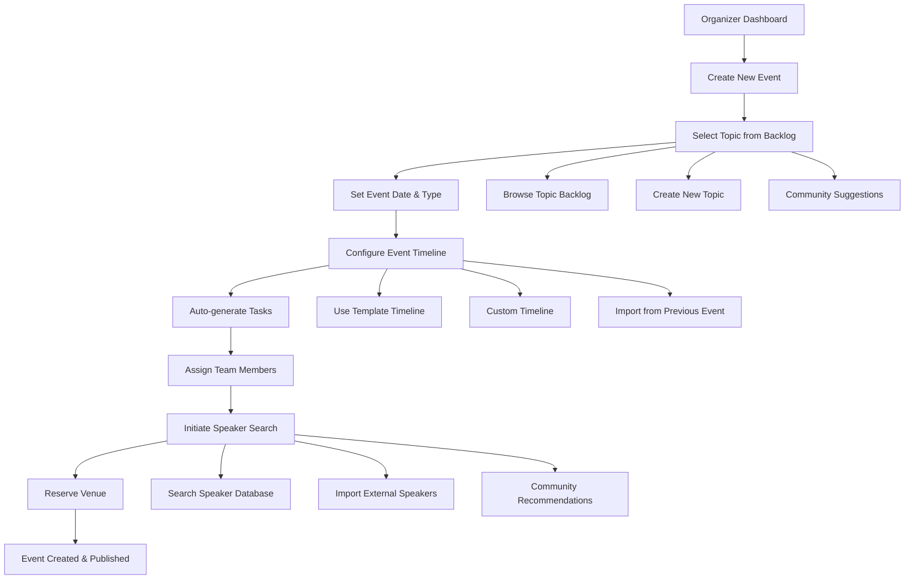
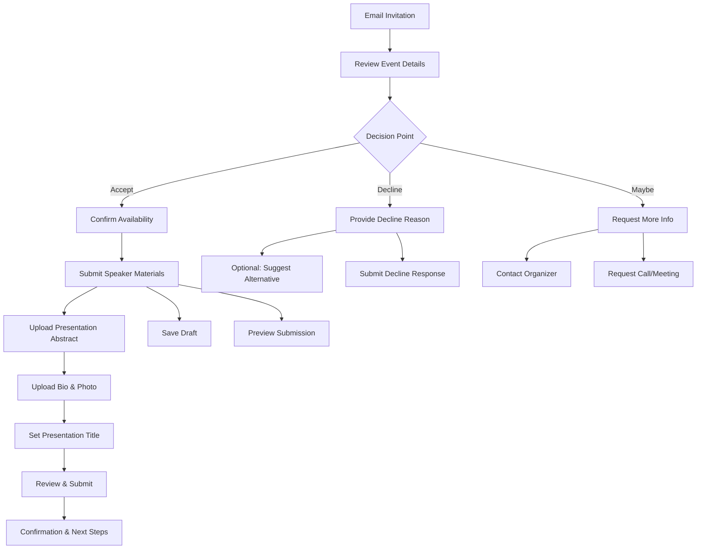
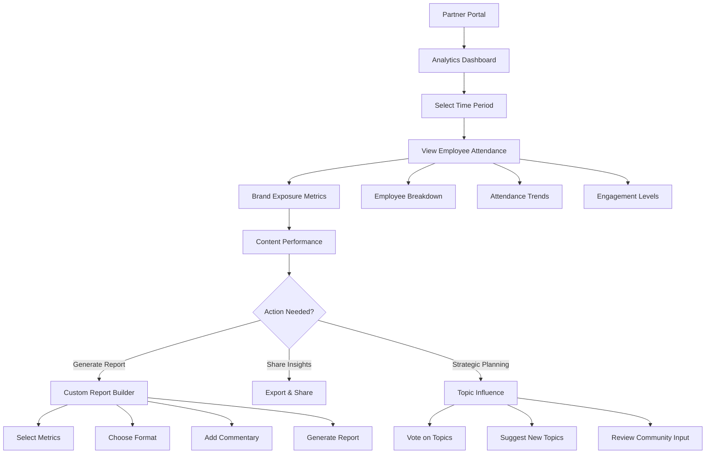
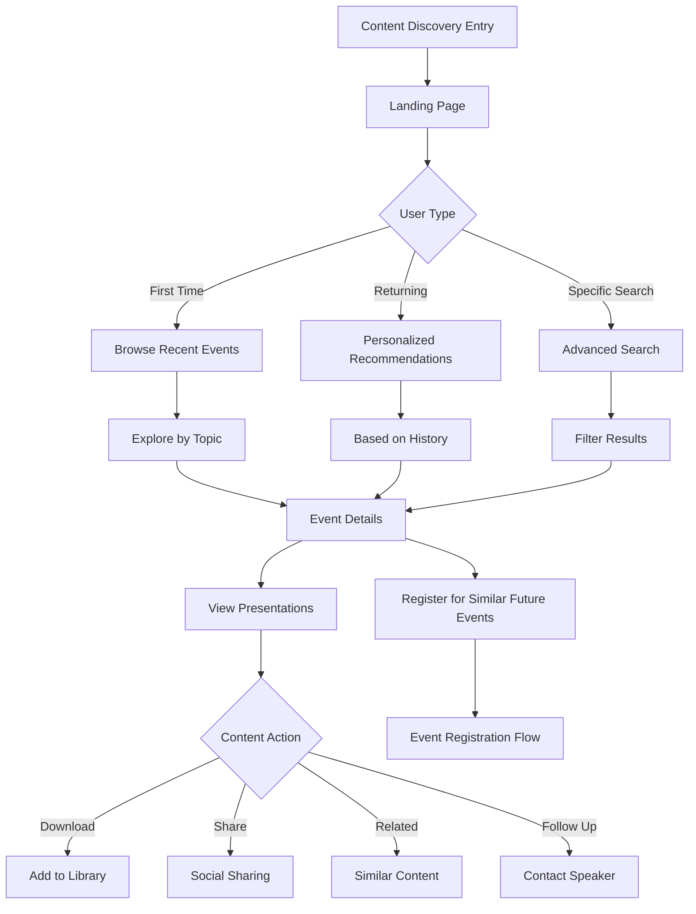

# BATbern Event Management Platform - UI/UX Specification

## Introduction

This document defines the user experience goals, information architecture, user flows, and visual design specifications for BATbern Event Management Platform's user interface. It serves as the foundation for visual design and frontend development, ensuring a cohesive and user-centered experience.

Based on the comprehensive brainstorming session and enhanced PRD, this UI/UX specification addresses the unique challenge of designing for four distinct stakeholder groups using a React-based frontend architecture:
- **Event Organizers**: Need workflow efficiency and task management
- **Speakers**: Need simple submission and communication tools
- **Partners/Sponsors**: Need analytics visibility and strategic input
- **Attendees**: Need content discovery and event information

## Overall UX Goals & Principles

### Target User Personas

**Event Organizer (Primary Power User)**
- Technical professionals managing complex 16-step event workflows
- Need efficiency, task visibility, and deadline management
- High frequency users requiring advanced features and shortcuts

**Speaker/Presenter (Expert Contributors)**
- Busy IT professionals with limited time for submission processes
- Need clear expectations, simple workflows, and self-service capabilities
- Occasional users who must complete critical tasks accurately

**Partner/Sponsor (Business Stakeholders)**
- Decision-makers needing ROI justification and strategic input
- Need clear analytics, trend visualization, and influence capabilities
- Periodic users focused on business value and reporting

**Attendee/Community Member (End Consumers)**
- Swiss IT professionals seeking relevant content and networking
- Need content discovery, event information, and historical access
- Varied usage patterns from newcomers to veteran attendees

### Usability Goals

- **Organizer Efficiency**: Reduce event planning time by 60% through workflow automation
- **Speaker Simplicity**: New speakers complete submission process in under 10 minutes
- **Partner Clarity**: Analytics dashboards provide instant ROI understanding
- **Content Discovery**: Attendees find relevant historical content within 30 seconds
- **Role Transition**: Users can seamlessly switch between different role contexts
- **Mobile Experience**: All critical tasks completable on mobile devices

### Design Principles

1. **Role-Centric Design** - Each user sees only what's relevant to their current role and goals
2. **Progressive Disclosure** - Complex workflows broken into manageable steps with clear progress
3. **Contextual Intelligence** - System provides smart defaults and recommendations based on user behavior
4. **Immediate Value** - Every screen provides clear value and next actions for the user
5. **Innovation-Ready Precision** - Clean, reliable, and professional aesthetic that embraces modern event management concepts while maintaining Swiss business culture standards

### Change Log

| Date | Version | Description | Author |
|------|---------|-------------|--------|
| 2024-12-19 | 1.0 | Initial UI/UX specification | Sally |
| 2024-12-19 | 1.1 | Enhanced specification aligned with updated PRD requirements | Sally |
| 2024-12-28 | 1.2 | Aligned with React framework, 16-step workflow, epic structure, and enhanced features | Sally |

## Information Architecture (IA)

### Site Map / Screen Inventory

```mermaid
graph TD
    A[Landing Page] --> B[Authentication]
    B --> C[Role Selection Dashboard]

    C --> D[Organizer Portal]
    C --> E[Speaker Portal]
    C --> F[Partner Portal]
    C --> G[Attendee Portal]

    D --> D1[Event Management]
    D --> D2[Speaker Coordination]
    D --> D3[Partner Relations]
    D --> D4[Analytics Dashboard]

    D1 --> D1A[Intelligent Event Creation]
    D1 --> D1B[Smart Topic Backlog]
    D1 --> D1C[Automated Timeline Management]
    D1 --> D1D[Multi-year Strategic Planning]
    D1 --> D1E[Progressive Publishing Engine]

    D2 --> D2A[Intelligent Speaker Matching]
    D2 --> D2B[Advanced Status Workflow]
    D2 --> D2C[Automated Content Collection]
    D2 --> D2D[Real-time Collaboration Hub]
    D2 --> D2E[Cross-role Notification Center]

    E --> E1[My Events]
    E --> E2[Submission Portal]
    E --> E3[Profile Management]
    E --> E4[Community]

    E2 --> E2A[Respond to Invitation]
    E2 --> E2B[Submit Materials]
    E2 --> E2C[View Agenda]
    E2 --> E2D[Communication Hub]

    F --> F1[ROI Dashboard]
    F --> F2[Strategic Input]
    F --> F3[Event Analytics]
    F --> F4[Brand Exposure]

    F2 --> F2A[Topic Voting]
    F2 --> F2B[Topic Suggestions]
    F2 --> F2C[Strategic Planning]

    G --> G1[Event Discovery]
    G --> G2[Content Library]
    G --> G3[Community Features]
    G --> G4[Personal Dashboard]

    G1 --> G1A[Upcoming Events]
    G1 --> G1B[Registration]
    G1 --> G1C[Event Details]

    G2 --> G2A[AI-Powered Search]
    G2 --> G2B[Personalized Recommendations]
    G2 --> G2C[Historical Archive]
    G2 --> G2D[Download Center]
    G2 --> G2E[Mobile PWA Experience]
    G2 --> G2F[Offline Content Access]
```

### Navigation Structure

**Primary Navigation**:
- Role-based main navigation with clear visual indication of current role
- Quick role switcher for users with multiple roles
- Global search accessible from any screen
- Notification center with role-specific alerts

**Secondary Navigation**:
- Contextual sub-navigation within each portal
- Breadcrumb trail showing current location within workflows
- Quick actions sidebar for frequently used features
- Progressive navigation for multi-step processes

**Breadcrumb Strategy**:
- Portal > Section > Subsection > Current Page
- Interactive breadcrumbs allowing users to jump to any previous level
- Context preservation when switching between related workflows
- Smart breadcrumbs that show progress in multi-step processes

## User Flows

### Flow 1: Event Creation & Timeline Management (Organizer)

**User Goal**: Create a new BATbern event and set up automated workflow management

**Entry Points**:
- Organizer Dashboard → "Create New Event"
- Post-event completion → "Plan Next Event"
- Annual planning session → "Bulk Event Creation"

**Success Criteria**: Event created with automated timeline, speaker search initiated, venue reserved

#### Flow Diagram

#### Edge Cases & Error Handling:
- **Date Conflicts**: System warns of conflicting events/holidays, suggests alternatives
- **Topic Duplication**: Alerts if similar topic used recently, shows previous events
- **Speaker Unavailability**: Automated fallback to alternative speaker suggestions
- **Venue Booking Issues**: Integration with venue calendar, automatic waitlist management
- **Team Member Unavailability**: Task reassignment with notification workflows

**Notes**: This flow automates the first 4 steps of the current 16-step manual process, setting foundation for remaining workflow automation.

### Flow 2: Speaker Invitation & Response (Speaker)

**User Goal**: Respond to speaking invitation and submit required materials efficiently

**Entry Points**:
- Email invitation link → Direct to response page
- Speaker portal → "My Invitations"
- BATbern website → Speaker login → Active invitations

**Success Criteria**: Clear response provided, materials submitted if accepted, organizer notified

#### Flow Diagram

#### Edge Cases & Error Handling:
- **Late Response**: Automatic reminders with escalating urgency, deadline extensions
- **Incomplete Materials**: Progressive saving, deadline reminders, material templates
- **File Upload Issues**: Multiple format support, size validation, backup upload methods
- **Change of Mind**: Allow response modification with organizer notification
- **Technical Issues**: Offline mode, email fallback, phone number collection

**Notes**: Self-service portal eliminates back-and-forth emails and provides organizers real-time status updates.

### Flow 3: Partner Analytics & ROI Review (Partner)

**User Goal**: Access sponsorship ROI data and demonstrate value to internal stakeholders

**Entry Points**:
- Partner portal dashboard → "ROI Analytics"
- Quarterly email report → "View Full Analytics"
- Partner meeting preparation → "Generate Report"

**Success Criteria**: ROI data accessed, custom report generated, internal justification supported

#### Flow Diagram

#### Edge Cases & Error Handling:
- **Insufficient Data**: Show available data ranges, explain data collection improvements
- **Report Generation Failure**: Backup formats, manual export options, tech support contact
- **Data Privacy**: Aggregate-only views, no individual employee tracking, GDPR compliance
- **Comparison Needs**: Industry benchmarks, peer company anonymized comparisons
- **Historical Gaps**: Clear indication of data availability periods

**Notes**: This flow transforms partner meetings from "show and tell" to data-driven strategic discussions.

### Flow 4: Content Discovery & Learning (Attendee)

**User Goal**: Discover relevant historical BATbern content and register for upcoming events

**Entry Points**:
- BATbern website homepage → "Explore Content"
- Google search results → Specific presentation/topic
- Colleague recommendation → Shared content link
- Newsletter → "Browse Archive"

**Success Criteria**: Relevant content found quickly, downloaded/bookmarked, event registration completed

#### Flow Diagram

#### Edge Cases & Error Handling:
- **No Results Found**: Alternative search suggestions, browse by category, contact support
- **Content Access Issues**: Login prompts, guest access limitations, technical troubleshooting
- **Mobile Experience**: Responsive design, download for offline, mobile-optimized viewing
- **Registration Full**: Waitlist management, alternative event suggestions, notification preferences
- **Technical Difficulties**: Progressive web app offline capability, email content links

**Notes**: This flow transforms the static archive into an intelligent learning platform that drives community engagement.

## Wireframes & Mockups

**Primary Design Files**: *[To be created in Figma workspace - link will be updated once design files are established]*

### Key Screen Layouts

#### Organizer Dashboard (Primary Landing)
**Purpose**: Intelligent command center for automated 16-step event planning workflow

**Key Elements**:
- **Intelligent Events Pipeline**: AI-powered timeline showing automated workflow states with real-time progress
- **Smart Actions Panel**: Context-aware quick actions with intelligent suggestions and automation triggers
- **Cross-role Collaboration Hub**: Real-time visibility into speaker, partner, and team activities with notification center
- **Advanced Analytics Overview**: Predictive insights, workflow efficiency metrics, automated bottleneck detection
- **Multi-year Strategic Planning**: Long-term venue booking, partner meeting coordination, budget tracking dashboard
- **Progressive Publishing Status**: Content validation pipeline with automated publishing triggers

**Enhanced Intelligent Features (FR17-FR21)**:
- **Smart Topic Backlog Management (FR18)**:
  - Visual backlog with usage history heatmap
  - Partner influence indicators and voting results
  - Duplicate detection with similarity scoring
  - Topic performance analytics from past events
  - AI-suggested topics based on industry trends

- **Intelligent Speaker Matching (FR17)**:
  - Speaker database with expertise matching
  - Automated workflow state tracker (open → contacted → ready → declined/accepted → slot-assigned → final agenda → informed → waitlist)
  - Slot preference collection interface
  - Technical requirements matrix
  - Overflow management with voting mechanism
  - Real-time collaboration feed for organizer team

- **Progressive Publishing Engine (FR19)**:
  - Content readiness dashboard with validation checkpoints
  - Quality control indicators (moderator review status, abstract length, lessons learned)
  - Phased publishing timeline visualization
  - Automatic content standards enforcement
  - Publishing preview with rollback capabilities

- **Intelligent Notification System (FR20)**:
  - Role-based alert configuration
  - Cross-stakeholder visibility matrix
  - Automated escalation workflows
  - Deadline management with smart reminders
  - Task coordination hub with priority indicators

- **Long-term Planning Capabilities (FR21)**:
  - Multi-year venue booking calendar
  - Seasonal partner meeting scheduler
  - Strategic budget planning interface
  - Automated scheduling conflict detection
  - Historical planning data analysis

**Interaction Notes**: AI-assisted task automation, real-time collaboration indicators, intelligent workflow suggestions, cross-role visibility toggles, drag-and-drop planning interfaces
**Design File Reference**: *[Figma: Enhanced-Organizer-Dashboard-v2]*

#### Speaker Submission Portal (Self-Service Hub)
**Purpose**: Streamlined interface for speaker material submission and event participation

**Key Elements**:
- **Invitation Response Center**: Clear accept/decline options with event context and expectations
- **Material Upload Wizard**: Progressive form with drag-and-drop files, real-time validation, save drafts
- **Event Participation Timeline**: Visual representation of submission deadlines, event schedule, post-event activities
- **Communication Channel**: Direct messaging with organizers, FAQ section, support contact
- **Profile Management**: Speaker bio, photo, expertise tags, presentation history

**Interaction Notes**: Progressive saving prevents data loss, mobile-optimized upload, preview capabilities
**Design File Reference**: *[Figma: Speaker-Portal-v1]*

#### Partner Analytics Dashboard (ROI Visualization)
**Purpose**: Comprehensive analytics interface for sponsorship ROI and strategic planning

**Key Elements**:
- **ROI Metrics Overview**: Employee attendance, brand exposure, content engagement in visual dashboard format
- **Trend Analysis Charts**: Historical participation data, topic performance, community growth metrics
- **Custom Report Builder**: Drag-and-drop report creation with export options for internal presentations
- **Strategic Input Panel**: Topic voting interface, suggestion submission, community feedback review
- **Brand Exposure Tracker**: Logo placement tracking, newsletter mentions, website analytics integration

**Interaction Notes**: Interactive charts with drill-down capability, export in multiple formats, real-time data updates
**Design File Reference**: *[Figma: Partner-Analytics-v1]*

#### Prominent Current Event Landing Page (FR6 Compliance)
**Purpose**: Primary attendee entry point featuring upcoming BATbern event with complete logistics and registration

**Key Elements**:
- **Hero Section with Current Event Prominence**: Large, visually striking presentation of upcoming event
- **Complete Logistics Display**: Date, location, time, and highlighted free attendance messaging
- **Speaker Lineup Showcase**: Featured speakers with photos, topics, and company affiliations
- **Detailed Agenda Timeline**: Full event schedule with session descriptions and timing
- **Integrated Registration Functionality**: Email capture with instant confirmation and clear CTAs
- **Secondary Navigation to Archive**: Clear but secondary path to historical content discovery

**Interaction Notes**: Mobile-responsive design, smooth scrolling navigation, registration form with validation, speaker card interactions
**Design File Reference**: *[Figma: Current-Event-Landing-v1]*

#### Enhanced Content Discovery Engine (Attendee Experience)
**Purpose**: AI-powered content discovery with PWA capabilities for 20+ years of BATbern archives

**Key Elements**:
- **AI-Powered Search Interface**: Intelligent search with autocomplete, semantic matching, filters by topic/speaker/year/technology
- **Personalized Intelligence Engine**: ML-driven recommendations based on interests, attendance history, company affiliation
- **Progressive Web App Features**: Offline content access, mobile-optimized experience, event check-in capabilities
- **Visual Content Browser**: Card-based layout with presentation previews, speaker photos, dynamic topic tags
- **Advanced Learning Pathways**: AI-curated content sequences, skill development tracking, technology evolution analysis
- **Enhanced Community Features**: Content ratings, social sharing, curated learning pathways, expert annotations
- **Mobile-First Design**: Touch-optimized controls, gesture support, responsive grid layouts

**Interaction Notes**: Infinite scroll with virtual loading, advanced filtering with AI suggestions, offline bookmark system, swipe gestures for mobile
**Design File Reference**: *[Figma: Enhanced-Content-Discovery-v1]*

#### Mobile PWA Experience (Cross-Platform)
**Purpose**: Native-like mobile experience with offline capabilities for all user roles

**Key Elements**:
- **Progressive Web App Shell**: Fast loading, offline functionality, push notifications
- **Role-Adaptive Mobile Interface**: Context-aware navigation based on user role and current tasks
- **Offline Content Management**: Downloaded presentations, cached event data, sync when online
- **Mobile Event Check-in**: QR code scanning, proximity-based check-in, attendance tracking
- **Touch-Optimized Workflows**: Speaker submission via mobile, partner analytics on tablets, organizer task management
- **Cross-Device Synchronization**: Seamless experience transition between mobile and desktop

**Interaction Notes**: Native-like animations, haptic feedback, gesture navigation, adaptive UI based on device capabilities
**Design File Reference**: *[Figma: Mobile-PWA-Experience-v1]*

#### Moderator Review Interface (Quality Control Hub)
**Purpose**: Content quality review and validation interface for event moderators (Step 7 of 16-step workflow)

**Key Elements**:
- **Review Queue Dashboard**:
  - Pending reviews with priority indicators
  - Time-to-deadline countdown for each submission
  - Bulk review actions for efficiency
  - Filter by event, speaker status, or content type

- **Content Validation Workspace**:
  - Side-by-side view: submitted content vs. requirements checklist
  - Abstract length validator (1000 character limit with counter)
  - Lessons learned requirement checker
  - Technical accuracy assessment tools
  - Plagiarism detection integration

- **Quality Standards Enforcement**:
  - Automated compliance checking with visual indicators
  - Red/yellow/green status for each requirement
  - Comment system for feedback to speakers
  - Revision request workflow with tracking
  - Template suggestions for common issues

- **Collaboration Features**:
  - Tag other moderators for second opinions
  - Discussion thread for complex reviews
  - Historical review patterns and decisions
  - Knowledge base of past rejections/approvals

- **Approval Workflow**:
  - One-click approve with auto-notifications
  - Request revision with specific requirements
  - Reject with detailed reasoning
  - Conditional approval with requirements
  - Escalation path to senior organizers

- **Analytics & Reporting**:
  - Review velocity metrics
  - Common rejection reasons analysis
  - Speaker compliance trends
  - Time-to-approval statistics
  - Quality improvement tracking

**Interaction Notes**: Keyboard shortcuts for quick review actions, batch processing capabilities, mobile-responsive for review on-the-go, integration with speaker communication system
**Design File Reference**: *[Figma: Moderator-Review-Interface-v1]*

## Component Library / Design System

### Design System Approach
**Material-UI (MUI) + Custom BAT Components**: Leverage Material-UI as React foundation with custom components for event-specific functionality, ensuring consistency with Swiss design principles and professional conference branding.

### Core Components

#### Event Timeline Component
**Purpose**: Visual representation of event planning progress and deadlines
**Variants**: Horizontal (dashboard view), Vertical (detail view), Compact (mobile view)
**States**: Planning, Active, Completed, Overdue, On-hold
**Usage Guidelines**: Use for any time-based workflow visualization, maintain consistent color coding across all timeline instances

#### Speaker Card Component
**Purpose**: Standardized speaker information display across all contexts
**Variants**: Full (detailed view), Summary (list view), Minimal (selection view)
**States**: Invited, Confirmed, Declined, Pending, Featured
**Usage Guidelines**: Always include photo, bio excerpt, and expertise tags; link to full speaker profile

#### Analytics Widget Component
**Purpose**: Modular analytics display for dashboard customization
**Variants**: Chart, Metric, Trend, Comparison, Export-ready
**States**: Loading, Data-available, No-data, Error, Refreshing
**Usage Guidelines**: Consistent color scheme for data visualization, interactive tooltips for context

#### Multi-Role Navigation Component
**Purpose**: Role-based navigation with seamless role switching
**Variants**: Organizer, Speaker, Partner, Attendee, Admin
**States**: Active-role, Available-roles, Role-switching, Authenticated, Guest
**Usage Guidelines**: Clear visual indication of current role, quick role switcher accessible from any page, leverages React Router for navigation state management

#### Intelligent Workflow Status Component
**Purpose**: Visual representation of automated workflow states with AI-powered insights
**Variants**: Speaker-pipeline, Event-timeline, Publishing-flow, Approval-chain
**States**: Automated, Manual-intervention, Blocked, Completed, AI-optimized
**Usage Guidelines**: Real-time status updates, cross-role visibility controls, predictive progress indicators

#### Smart Notification Center Component
**Purpose**: Context-aware notification system with role-based filtering
**Variants**: Real-time, Digest, Critical, Cross-role-visibility
**States**: Unread, Read, Dismissed, Escalated, Automated-response
**Usage Guidelines**: Intelligent filtering, batch actions, mobile-optimized display

#### PWA Shell Component
**Purpose**: Progressive web app infrastructure with offline capabilities
**Variants**: Online, Offline, Syncing, Cache-available
**States**: Connected, Disconnected, Background-sync, Update-available
**Usage Guidelines**: Seamless offline experience, intelligent content caching, cross-device synchronization

## Branding & Style Guide

### Visual Identity
**Brand Guidelines**: Leverage existing BAT branding with modern digital adaptation for professional Swiss IT community

### Color Palette
| Color Type | Hex Code | Usage |
|------------|----------|-------|
| Primary | #2C5F7C | Navigation, CTAs, key actions |
| Secondary | #4A90B8 | Secondary actions, highlights |
| Accent | #E67E22 | Success states, notifications |
| Success | #27AE60 | Confirmations, positive feedback |
| Warning | #F39C12 | Cautions, pending states |
| Error | #E74C3C | Errors, critical alerts |
| Neutral | #34495E, #7F8C8D, #BDC3C7 | Text, borders, backgrounds |

### Typography

#### Font Families
- **Primary**: Inter (modern, readable, Swiss-inspired sans-serif)
- **Secondary**: Roboto (Material-UI consistency for React components)
- **Monospace**: JetBrains Mono (code examples, technical content)

#### Type Scale
| Element | Size | Weight | Line Height |
|---------|------|--------|-------------|
| H1 | 2.5rem | 700 | 1.2 |
| H2 | 2rem | 600 | 1.3 |
| H3 | 1.5rem | 600 | 1.4 |
| Body | 1rem | 400 | 1.6 |
| Small | 0.875rem | 400 | 1.5 |

### Iconography
**Icon Library**: Material-UI Icons with custom BAT-specific icons for event management
**Usage Guidelines**: Consistent 24px standard size, outlined style for actions, filled style for states

### Spacing & Layout
**Grid System**: 12-column responsive grid with 24px base spacing unit
**Spacing Scale**: 4px, 8px, 16px, 24px, 32px, 48px, 64px (based on 8px system)

## Accessibility Requirements

### Compliance Target
**Standard**: WCAG 2.1 AA compliance for Swiss public sector compatibility

### Key Requirements
**Visual**:
- Color contrast ratios: 4.5:1 for normal text, 3:1 for large text
- Focus indicators: 2px solid outline with high contrast
- Text sizing: Scalable up to 200% without horizontal scrolling

**Interaction**:
- Keyboard navigation: All interactive elements accessible via keyboard
- Screen reader support: Semantic HTML, ARIA labels, live regions for dynamic content
- Touch targets: Minimum 44px touch targets on mobile devices

**Content**:
- Alternative text: Descriptive alt text for all images, diagrams, and charts
- Heading structure: Logical hierarchy with no skipped levels
- Form labels: Clear, descriptive labels for all form inputs

### Testing Strategy
Automated accessibility testing with axe-core, manual keyboard navigation testing, screen reader validation with NVDA/JAWS, mobile accessibility testing with TalkBack/VoiceOver

## Responsiveness Strategy

### Breakpoints
| Breakpoint | Min Width | Max Width | Target Devices |
|------------|-----------|-----------|----------------|
| Mobile | 320px | 767px | Smartphones, small tablets |
| Tablet | 768px | 1023px | iPads, Android tablets |
| Desktop | 1024px | 1439px | Laptops, standard monitors |
| Wide | 1440px | - | Large monitors, ultrawide displays |

### Adaptation Patterns
**Layout Changes**: Single column mobile, two-column tablet, multi-column desktop with collapsible sidebars
**Navigation Changes**: Hamburger menu mobile, full navigation desktop, role switcher adapts to available space
**Content Priority**: Critical actions always visible, progressive disclosure for secondary features
**Interaction Changes**: Touch-optimized mobile controls, hover states for desktop, gesture support for tablets

## Animation & Micro-interactions

### Motion Principles
Purposeful animation that enhances usability: smooth transitions between states, loading indicators for async operations, subtle feedback for user actions, reduced motion support for accessibility preferences

### Key Animations
- **Page Transitions**: 300ms ease-out slide transitions (Duration: 300ms, Easing: cubic-bezier(0.4, 0, 0.2, 1))
- **Loading States**: Skeleton screens with pulse animation (Duration: 1.5s, Easing: ease-in-out)
- **Form Validation**: Error shake animation for invalid inputs (Duration: 400ms, Easing: ease-in-out)
- **Success Feedback**: Checkmark appearance with scale animation (Duration: 600ms, Easing: cubic-bezier(0.68, -0.55, 0.265, 1.55))
- **Data Updates**: Smooth chart transitions and number counting (Duration: 800ms, Easing: ease-out)

## Performance Considerations

### Performance Goals
- **Page Load**: First meaningful paint under 2 seconds on 3G networks
- **Interaction Response**: UI response within 100ms for all user interactions
- **Animation FPS**: Maintain 60fps for all animations and transitions

### Design Strategies
Progressive image loading with low-quality placeholders, lazy loading for content below fold, optimized icon fonts and SVGs, efficient React rendering optimization with React.memo and useMemo, service worker implementation for offline capability

### React-Specific Performance Considerations
- **Component Optimization**: Use React.memo for pure components, useMemo for expensive calculations, useCallback for event handlers
- **Code Splitting**: Implement route-based code splitting with React.lazy and Suspense for role-specific portals
- **State Management**: Context API for global state, local state for component-specific data, consider Redux Toolkit for complex state scenarios
- **Virtual Scrolling**: Implement virtual scrolling for large data sets (event archives, speaker lists)
- **Bundle Optimization**: Tree shaking with ES modules, dynamic imports for role-specific functionality

## Epic-Aligned Component Development Timeline

### Component Rollout by Epic

Aligned with the 7-epic development strategy from the PRD, UI components will be developed progressively:

#### Epic 1: Foundation & Core Infrastructure (Weeks 1-12)
**UI Components to Deliver**:
- Authentication screens (login, role selection, password reset)
- Basic navigation framework with role switching
- Initial dashboard shells for all four roles
- Data migration status interface
- Basic event listing/browsing components

#### Epic 2: Basic Event Creation & Publishing (Weeks 13-20)
**UI Components to Deliver**:
- Event creation wizard with 16-step workflow visualization
- Topic selection interface with backlog management
- Event timeline configuration screens
- Basic publishing interface
- Current event landing page (FR6 compliant)

#### Epic 3: Core Speaker Management (Weeks 21-30)
**UI Components to Deliver**:
- Speaker invitation interface
- Speaker response portal
- Material submission wizard
- Speaker status tracking dashboard
- Communication hub between organizers and speakers

#### Epic 4: Event Finalization & Quality (Weeks 31-38)
**UI Components to Deliver**:
- Moderator review interface for content quality control
- Agenda finalization tools
- Waitlist management interface
- Automated notification center
- Quality checkpoint dashboards

#### Epic 5: Attendee Experience (Weeks 39-46)
**UI Components to Deliver**:
- AI-powered content discovery interface
- Personalized recommendation engine UI
- Progressive Web App (PWA) shell
- Mobile event check-in interface
- Community features (ratings, sharing, bookmarks)

#### Epic 6: Partner & Analytics Platform (Weeks 47-56)
**UI Components to Deliver**:
- Comprehensive analytics dashboard
- ROI visualization components
- Topic voting interface
- Strategic planning tools
- Custom report builder

#### Epic 7: Enhanced Features (Weeks 57-62)
**UI Components to Deliver**:
- Advanced workflow automation interfaces
- Multi-year planning dashboards
- Enhanced cross-role collaboration tools
- Performance optimization refinements
- Final UI polish and consistency updates

## Next Steps

### Immediate Actions
1. **Create Figma workspace** and establish design file structure with enhanced components
2. **Design high-fidelity mockups** for enhanced organizer dashboard and attendee PWA experience
3. **Prototype intelligent workflow automation** interfaces and AI-powered features
4. **Validate enhanced design direction** with stakeholder representatives focusing on new capabilities
5. **Establish component library** in Figma including new intelligent workflow and PWA components
6. **Create interactive prototypes** for cross-role collaboration and mobile PWA experience

### Enhanced Design Handoff Checklist
✅ All user flows documented including enhanced organizer capabilities
✅ Component inventory complete with intelligent workflow components
✅ PWA specifications and offline capabilities defined
✅ Cross-role collaboration interfaces specified
✅ AI-powered features and automation documented
✅ Mobile-first responsive strategy enhanced
✅ Accessibility requirements defined
✅ Brand guidelines incorporated
✅ Performance goals established including PWA metrics