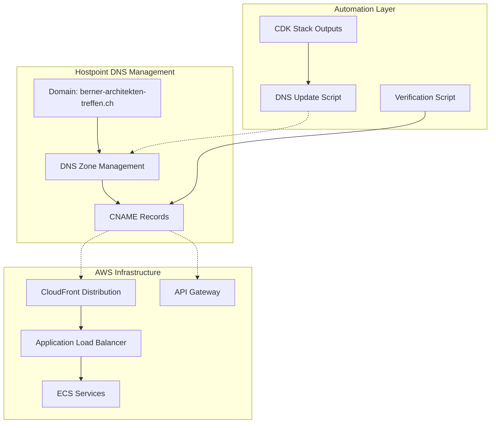

# Hostpoint DNS Integration Proof-of-Concept

This document provides a comprehensive proof-of-concept for integrating Hostpoint DNS management with the BATbern platform's AWS infrastructure.

## Overview

Since the domain `berner-architekten-treffen.ch` is managed through Hostpoint (Swiss hosting provider) rather than AWS Route53, we need to establish a hybrid DNS strategy that maintains domain control at Hostpoint while leveraging AWS CloudFront and API Gateway endpoints.

## Integration Architecture



## Solution Components

### 1. CDK Infrastructure with DNS Outputs

**Enhanced DNS Output Stack:**
```typescript
// infrastructure/stacks/dns-output-stack.ts
import { Stack, StackProps, CfnOutput } from 'aws-cdk-lib';
import { Construct } from 'constructs';
import { Distribution } from 'aws-cdk-lib/aws-cloudfront';
import { RestApi } from 'aws-cdk-lib/aws-apigateway';

export interface DNSOutputStackProps extends StackProps {
  productionDistribution: Distribution;
  stagingDistribution: Distribution;
  productionApi: RestApi;
  stagingApi: RestApi;
}

export class DNSOutputStack extends Stack {
  constructor(scope: Construct, id: string, props: DNSOutputStackProps) {
    super(scope, id, props);

    // Production DNS Records
    new CfnOutput(this, 'ProductionWebsiteCNAME', {
      value: props.productionDistribution.distributionDomainName,
      description: 'CNAME target for www.berner-architekten-treffen.ch',
      exportName: 'BATbern-Production-Website-CNAME'
    });

    new CfnOutput(this, 'ProductionApiCNAME', {
      value: props.productionApi.restApiId + '.execute-api.eu-central-1.amazonaws.com',
      description: 'CNAME target for api.berner-architekten-treffen.ch',
      exportName: 'BATbern-Production-API-CNAME'
    });

    // Staging DNS Records
    new CfnOutput(this, 'StagingWebsiteCNAME', {
      value: props.stagingDistribution.distributionDomainName,
      description: 'CNAME target for staging.berner-architekten-treffen.ch',
      exportName: 'BATbern-Staging-Website-CNAME'
    });

    new CfnOutput(this, 'StagingApiCNAME', {
      value: props.stagingApi.restApiId + '.execute-api.eu-central-1.amazonaws.com',
      description: 'CNAME target for api-staging.berner-architekten-treffen.ch',
      exportName: 'BATbern-Staging-API-CNAME'
    });

    // Comprehensive DNS Configuration for Hostpoint
    new CfnOutput(this, 'HostpointDNSConfiguration', {
      value: JSON.stringify({
        instructions: "Copy these CNAME records to your Hostpoint DNS configuration",
        records: [
          {
            type: "CNAME",
            name: "www",
            target: props.productionDistribution.distributionDomainName,
            ttl: 300,
            priority: "HIGH"
          },
          {
            type: "CNAME",
            name: "staging",
            target: props.stagingDistribution.distributionDomainName,
            ttl: 300,
            priority: "HIGH"
          },
          {
            type: "CNAME",
            name: "api",
            target: props.productionApi.restApiId + '.execute-api.eu-central-1.amazonaws.com',
            ttl: 300,
            priority: "HIGH"
          },
          {
            type: "CNAME",
            name: "api-staging",
            target: props.stagingApi.restApiId + '.execute-api.eu-central-1.amazonaws.com',
            ttl: 300,
            priority: "HIGH"
          }
        ],
        verification: {
          command: "nslookup www.berner-architekten-treffen.ch",
          expected_response: props.productionDistribution.distributionDomainName
        }
      }, null, 2),
      description: 'Complete DNS configuration for Hostpoint'
    });
  }
}
```

### 2. Automated DNS Configuration Script

**DNS Update Automation:**
```bash
#!/bin/bash
# scripts/update-hostpoint-dns.sh

set -e

# Configuration
DOMAIN="berner-architekten-treffen.ch"
AWS_REGION="eu-central-1"
STACK_NAME="BATbern-DNS-Output"

echo "🚀 BATbern Hostpoint DNS Update Script"
echo "======================================="

# Function to get AWS CDK output
get_cdk_output() {
    local key=$1
    aws cloudformation describe-stacks \
        --region $AWS_REGION \
        --stack-name $STACK_NAME \
        --query "Stacks[0].Outputs[?OutputKey=='$key'].OutputValue" \
        --output text
}

# Get current AWS endpoints
echo "📡 Fetching AWS infrastructure endpoints..."
PROD_WEB_CNAME=$(get_cdk_output "ProductionWebsiteCNAME")
STAGING_WEB_CNAME=$(get_cdk_output "StagingWebsiteCNAME")
PROD_API_CNAME=$(get_cdk_output "ProductionApiCNAME")
STAGING_API_CNAME=$(get_cdk_output "StagingApiCNAME")

# Validate endpoints
if [ -z "$PROD_WEB_CNAME" ] || [ -z "$PROD_API_CNAME" ]; then
    echo "❌ Error: Could not retrieve AWS endpoints from CDK stack"
    exit 1
fi

echo "✅ AWS endpoints retrieved successfully"
echo "   Production Web: $PROD_WEB_CNAME"
echo "   Production API: $PROD_API_CNAME"
echo "   Staging Web: $STAGING_WEB_CNAME"
echo "   Staging API: $STAGING_API_CNAME"

# Generate DNS configuration file for Hostpoint
cat > hostpoint-dns-config.json << EOF
{
  "domain": "$DOMAIN",
  "records": [
    {
      "type": "CNAME",
      "name": "www",
      "target": "$PROD_WEB_CNAME",
      "ttl": 300,
      "comment": "Production website endpoint"
    },
    {
      "type": "CNAME",
      "name": "staging",
      "target": "$STAGING_WEB_CNAME",
      "ttl": 300,
      "comment": "Staging website endpoint"
    },
    {
      "type": "CNAME",
      "name": "api",
      "target": "$PROD_API_CNAME",
      "ttl": 300,
      "comment": "Production API endpoint"
    },
    {
      "type": "CNAME",
      "name": "api-staging",
      "target": "$STAGING_API_CNAME",
      "ttl": 300,
      "comment": "Staging API endpoint"
    }
  ],
  "generated": "$(date -u +%Y-%m-%dT%H:%M:%SZ)",
  "instructions": [
    "1. Log into Hostpoint control panel",
    "2. Navigate to DNS management for $DOMAIN",
    "3. Add/update the CNAME records listed above",
    "4. Wait for DNS propagation (5-10 minutes)",
    "5. Run verification script to confirm"
  ]
}
EOF

echo "📝 DNS configuration saved to hostpoint-dns-config.json"

# Generate human-readable instructions
cat > hostpoint-dns-instructions.md << EOF
# Hostpoint DNS Configuration Instructions

## Required CNAME Records

Please add the following CNAME records in your Hostpoint DNS management panel:

| Name | Type | Target | TTL | Comment |
|------|------|--------|-----|---------|
| www | CNAME | \`$PROD_WEB_CNAME\` | 300 | Production website |
| staging | CNAME | \`$STAGING_WEB_CNAME\` | 300 | Staging website |
| api | CNAME | \`$PROD_API_CNAME\` | 300 | Production API |
| api-staging | CNAME | \`$STAGING_API_CNAME\` | 300 | Staging API |

## Steps to Update DNS

1. **Login to Hostpoint**: Access your Hostpoint control panel
2. **Navigate to DNS**: Find DNS management for \`$DOMAIN\`
3. **Add Records**: Create or update the CNAME records above
4. **Save Changes**: Apply the DNS configuration
5. **Wait for Propagation**: Allow 5-10 minutes for changes to propagate
6. **Verify**: Run \`./verify-dns.sh\` to confirm configuration

## Notes

- TTL is set to 300 seconds (5 minutes) for faster updates during development
- These are AWS CloudFront and API Gateway endpoints
- DNS propagation typically takes 5-10 minutes
- Contact DevOps team if you encounter issues

Generated: $(date)
EOF

echo "📋 Human-readable instructions saved to hostpoint-dns-instructions.md"
echo ""
echo "🔧 Next Steps:"
echo "   1. Review hostpoint-dns-config.json"
echo "   2. Follow instructions in hostpoint-dns-instructions.md"
echo "   3. Run ./verify-dns.sh after updating Hostpoint DNS"
```

### 3. DNS Verification Script

**Verification Automation:**
```bash
#!/bin/bash
# scripts/verify-dns.sh

set -e

DOMAIN="berner-architekten-treffen.ch"
EXPECTED_ENDPOINTS_FILE="hostpoint-dns-config.json"

echo "🔍 BATbern DNS Verification Script"
echo "=================================="

# Function to check CNAME resolution
check_cname() {
    local subdomain=$1
    local expected=$2
    local full_domain="${subdomain}.${DOMAIN}"

    echo "🔍 Checking $full_domain..."

    # Use dig to check CNAME resolution
    local actual=$(dig +short CNAME $full_domain)

    if [ -z "$actual" ]; then
        echo "❌ No CNAME record found for $full_domain"
        return 1
    fi

    # Remove trailing dot from DNS response
    actual=$(echo $actual | sed 's/\.$//')
    expected=$(echo $expected | sed 's/\.$//')

    if [ "$actual" = "$expected" ]; then
        echo "✅ $full_domain correctly points to $actual"
        return 0
    else
        echo "❌ $full_domain points to $actual, expected $expected"
        return 1
    fi
}

# Function to check HTTP response
check_http_response() {
    local url=$1
    local expected_status=${2:-200}

    echo "🌐 Testing HTTP response for $url..."

    local status=$(curl -s -o /dev/null -w "%{http_code}" "$url" || echo "000")

    if [ "$status" = "$expected_status" ]; then
        echo "✅ $url returned HTTP $status"
        return 0
    else
        echo "❌ $url returned HTTP $status, expected $expected_status"
        return 1
    fi
}

# Load expected endpoints
if [ ! -f "$EXPECTED_ENDPOINTS_FILE" ]; then
    echo "❌ Error: $EXPECTED_ENDPOINTS_FILE not found. Run update-hostpoint-dns.sh first."
    exit 1
fi

echo "📋 Loading expected endpoints from $EXPECTED_ENDPOINTS_FILE"

# Parse JSON and verify DNS records
PROD_WEB_TARGET=$(jq -r '.records[] | select(.name=="www") | .target' $EXPECTED_ENDPOINTS_FILE)
STAGING_WEB_TARGET=$(jq -r '.records[] | select(.name=="staging") | .target' $EXPECTED_ENDPOINTS_FILE)
PROD_API_TARGET=$(jq -r '.records[] | select(.name=="api") | .target' $EXPECTED_ENDPOINTS_FILE)
STAGING_API_TARGET=$(jq -r '.records[] | select(.name=="api-staging") | .target' $EXPECTED_ENDPOINTS_FILE)

echo ""
echo "🔍 Verifying DNS CNAME Records..."
echo "================================="

# Check DNS resolution
errors=0

check_cname "www" "$PROD_WEB_TARGET" || ((errors++))
check_cname "staging" "$STAGING_WEB_TARGET" || ((errors++))
check_cname "api" "$PROD_API_TARGET" || ((errors++))
check_cname "api-staging" "$STAGING_API_TARGET" || ((errors++))

echo ""
echo "🌐 Verifying HTTP Connectivity..."
echo "================================="

# Check HTTP responses (with timeout)
timeout 10 check_http_response "https://www.${DOMAIN}" 200 || ((errors++))
timeout 10 check_http_response "https://staging.${DOMAIN}" 200 || ((errors++))
timeout 10 check_http_response "https://api.${DOMAIN}/health" 200 || ((errors++))
timeout 10 check_http_response "https://api-staging.${DOMAIN}/health" 200 || ((errors++))

echo ""
echo "📊 Verification Summary"
echo "======================"

if [ $errors -eq 0 ]; then
    echo "✅ All DNS records and endpoints are correctly configured!"
    echo "🎉 BATbern platform is accessible via Hostpoint DNS"

    # Create verification report
    cat > dns-verification-report.json << EOF
{
  "timestamp": "$(date -u +%Y-%m-%dT%H:%M:%SZ)",
  "domain": "$DOMAIN",
  "status": "PASS",
  "errors": $errors,
  "verified_endpoints": [
    "https://www.${DOMAIN}",
    "https://staging.${DOMAIN}",
    "https://api.${DOMAIN}",
    "https://api-staging.${DOMAIN}"
  ],
  "dns_propagation": "Complete",
  "next_check": "$(date -u -d '+1 hour' +%Y-%m-%dT%H:%M:%SZ)"
}
EOF

    echo "📋 Verification report saved to dns-verification-report.json"
    exit 0
else
    echo "❌ $errors error(s) found in DNS configuration"
    echo "🔧 Please check Hostpoint DNS settings and wait for propagation"
    echo "⏱️  DNS changes can take up to 24 hours to propagate fully"

    # Create error report
    cat > dns-verification-report.json << EOF
{
  "timestamp": "$(date -u +%Y-%m-%dT%H:%M:%SZ)",
  "domain": "$DOMAIN",
  "status": "FAIL",
  "errors": $errors,
  "recommendations": [
    "Verify CNAME records in Hostpoint DNS panel",
    "Wait additional time for DNS propagation",
    "Check for typos in DNS record targets",
    "Contact Hostpoint support if issues persist"
  ],
  "retry_after": "$(date -u -d '+30 minutes' +%Y-%m-%dT%H:%M:%SZ)"
}
EOF

    echo "📋 Error report saved to dns-verification-report.json"
    exit 1
fi
```

### 4. CI/CD Integration

**GitHub Actions Workflow:**
```yaml
# .github/workflows/dns-sync.yml
name: DNS Configuration Sync

on:
  push:
    branches: [ main ]
    paths:
      - 'infrastructure/**'
  workflow_dispatch:

jobs:
  update-dns-config:
    runs-on: ubuntu-latest
    if: github.ref == 'refs/heads/main'

    steps:
    - name: Checkout
      uses: actions/checkout@v4

    - name: Configure AWS credentials
      uses: aws-actions/configure-aws-credentials@v4
      with:
        aws-access-key-id: ${{ secrets.AWS_ACCESS_KEY_ID }}
        aws-secret-access-key: ${{ secrets.AWS_SECRET_ACCESS_KEY }}
        aws-region: eu-central-1

    - name: Setup Node.js
      uses: actions/setup-node@v4
      with:
        node-version: '18'

    - name: Install dependencies
      run: npm ci

    - name: Deploy infrastructure
      run: |
        cd infrastructure
        npm run build
        npx cdk deploy --all --require-approval never

    - name: Generate DNS configuration
      run: |
        chmod +x scripts/update-hostpoint-dns.sh
        ./scripts/update-hostpoint-dns.sh

    - name: Upload DNS config artifacts
      uses: actions/upload-artifact@v4
      with:
        name: hostpoint-dns-configuration
        path: |
          hostpoint-dns-config.json
          hostpoint-dns-instructions.md
        retention-days: 30

    - name: Create DNS Update Issue
      if: success()
      uses: actions/github-script@v7
      with:
        script: |
          const fs = require('fs');
          const config = JSON.parse(fs.readFileSync('hostpoint-dns-config.json', 'utf8'));

          const body = `## 🔧 DNS Configuration Update Required

          The AWS infrastructure has been updated and requires DNS changes in Hostpoint.

          ### Required Actions:
          1. Download the artifacts from this workflow run
          2. Follow instructions in \`hostpoint-dns-instructions.md\`
          3. Update CNAME records in Hostpoint DNS panel
          4. Run verification: \`./scripts/verify-dns.sh\`

          ### Configuration Details:
          \`\`\`json
          ${JSON.stringify(config.records, null, 2)}
          \`\`\`

          **Generated:** ${config.generated}
          **Workflow:** [${context.workflow}](${context.payload.repository.html_url}/actions/runs/${context.runId})

          Please complete DNS updates within 24 hours to ensure service availability.`;

          github.rest.issues.create({
            owner: context.repo.owner,
            repo: context.repo.repo,
            title: '🔧 Hostpoint DNS Update Required',
            body: body,
            labels: ['dns', 'infrastructure', 'urgent']
          });

  verify-dns:
    runs-on: ubuntu-latest
    needs: update-dns-config
    if: github.ref == 'refs/heads/main'

    steps:
    - name: Checkout
      uses: actions/checkout@v4

    - name: Download DNS config
      uses: actions/download-artifact@v4
      with:
        name: hostpoint-dns-configuration

    - name: Install DNS tools
      run: |
        sudo apt-get update
        sudo apt-get install -y dnsutils curl jq

    - name: Wait for potential DNS propagation
      run: sleep 300  # Wait 5 minutes

    - name: Verify DNS configuration
      run: |
        chmod +x scripts/verify-dns.sh
        ./scripts/verify-dns.sh || echo "DNS verification failed - manual update required"

    - name: Upload verification report
      uses: actions/upload-artifact@v4
      with:
        name: dns-verification-report
        path: dns-verification-report.json
        retention-days: 7
```

### 5. Monitoring and Alerting

**DNS Health Check Script:**
```bash
#!/bin/bash
# scripts/dns-health-check.sh
# Run this as a cron job for continuous monitoring

DOMAIN="berner-architekten-treffen.ch"
ENDPOINTS=("www" "staging" "api" "api-staging")
WEBHOOK_URL="${SLACK_WEBHOOK_URL}"

check_endpoint_health() {
    local subdomain=$1
    local full_url="https://${subdomain}.${DOMAIN}"

    if [ "$subdomain" = "api" ] || [ "$subdomain" = "api-staging" ]; then
        full_url="${full_url}/health"
    fi

    local status=$(curl -s -o /dev/null -w "%{http_code}" "$full_url" --max-time 10 || echo "000")

    if [ "$status" = "200" ]; then
        return 0
    else
        echo "❌ $full_url returned HTTP $status"
        return 1
    fi
}

# Check all endpoints
failed_endpoints=()
for endpoint in "${ENDPOINTS[@]}"; do
    if ! check_endpoint_health "$endpoint"; then
        failed_endpoints+=("$endpoint")
    fi
done

# Send alerts if failures detected
if [ ${#failed_endpoints[@]} -gt 0 ]; then
    message="🚨 BATbern DNS Health Check Failed\n\nFailed endpoints: ${failed_endpoints[*]}\nTime: $(date)\n\nPlease check Hostpoint DNS configuration."

    if [ -n "$WEBHOOK_URL" ]; then
        curl -X POST -H 'Content-type: application/json' \
             --data "{\"text\":\"$message\"}" \
             "$WEBHOOK_URL"
    fi

    echo "$message"
    exit 1
else
    echo "✅ All BATbern endpoints are healthy"
    exit 0
fi
```

## Implementation Timeline

### Phase 1: Setup (Week 1)
- [ ] Implement CDK DNS output stack
- [ ] Create DNS configuration scripts
- [ ] Test scripts with staging environment
- [ ] Document Hostpoint DNS update process

### Phase 2: Automation (Week 2)
- [ ] Integrate DNS scripts into CI/CD pipeline
- [ ] Implement verification automation
- [ ] Set up health check monitoring
- [ ] Create alerting mechanisms

### Phase 3: Production (Week 3)
- [ ] Deploy production DNS configuration
- [ ] Update Hostpoint DNS records
- [ ] Verify end-to-end connectivity
- [ ] Enable continuous monitoring

## Risk Mitigation

### Manual Fallback Process
1. **Emergency DNS Updates**: Direct access to Hostpoint panel for urgent changes
2. **Backup Endpoints**: Alternative domain routing if primary fails
3. **Rollback Plan**: Quick reversion to previous DNS configuration
4. **Communication Plan**: Clear escalation path for DNS issues

### Monitoring Strategy
- **Continuous Health Checks**: Every 5 minutes via cron job
- **Multi-region Testing**: Verify DNS from different geographic locations
- **Performance Monitoring**: Track DNS resolution times
- **Alert Integration**: Slack/PagerDuty notifications for failures

## Success Metrics

1. **DNS Propagation Time**: < 10 minutes for CNAME updates
2. **Endpoint Availability**: 99.9% uptime for all subdomains
3. **Automation Success Rate**: > 95% successful automated deployments
4. **Manual Intervention**: < 5% of DNS updates require manual steps

## Conclusion

This proof-of-concept provides a robust solution for managing Hostpoint DNS integration with AWS infrastructure. The automated scripts reduce manual work while maintaining reliability and providing comprehensive monitoring.

The approach balances the constraint of external DNS management with the need for automated deployments, ensuring the BATbern platform can scale effectively while maintaining Swiss hosting compliance.