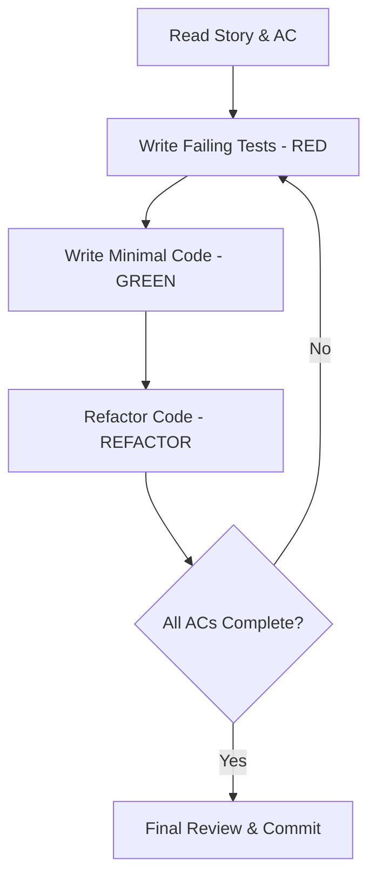

# Test-Driven Development Workflow

## Overview

This document defines the **mandatory** Test-Driven Development (TDD) workflow for the BATbern Event Management Platform. All new features, bug fixes, and refactoring must follow this workflow.

**Core Principle**: Write tests first, then write code to make tests pass.

## The TDD Cycle: Red-Green-Refactor



### 1. RED Phase - Write Failing Tests

**Goal**: Define expected behavior through tests before any implementation.

```typescript
// ❌ This test MUST fail initially
test('should create full-day event with 6-8 slots', () => {
  const result = createEventType({ type: 'FULL_DAY', minSlots: 6 });
  expect(result.slots).toBeGreaterThanOrEqual(6);
  expect(result.slots).toBeLessThanOrEqual(8);
});
```

### 2. GREEN Phase - Make Tests Pass

**Goal**: Write the minimum code necessary to make tests pass.

```typescript
// ✅ Minimal implementation to pass test
function createEventType(config: EventTypeConfig) {
  return {
    type: config.type,
    slots: config.minSlots // Simplest solution that works
  };
}
```

### 3. REFACTOR Phase - Improve Code Quality

**Goal**: Optimize and clean up while keeping tests green.

```typescript
// ♻️ Refactored for better design
class EventType {
  constructor(private config: EventTypeConfig) {
    this.validateSlotConfiguration();
  }

  private validateSlotConfiguration() {
    if (this.config.minSlots < 3 || this.config.maxSlots > 8) {
      throw new InvalidEventTypeError();
    }
  }
}
```

## Story Implementation Workflow

### Step 1: Analyze Story and Acceptance Criteria

Before writing any code:
1. Read the complete story
2. Review all acceptance criteria
3. Identify test scenarios for each AC
4. Plan test file structure

### Step 2: Write E2E Test (if applicable)

Start with the highest-level test that describes the user journey:

```typescript
// e2e/workflows/event-creation/event-creation.spec.ts
test('organizer creates and publishes event', async ({ page }) => {
  // Arrange
  await loginAsOrganizer(page);

  // Act
  await page.goto('/events/new');
  await page.selectOption('[data-testid="event-type"]', 'FULL_DAY');
  await page.fill('[data-testid="event-title"]', 'BATbern 2024');
  await page.click('[data-testid="save-event"]');

  // Assert
  await expect(page).toHaveURL(/\/events\/\d+/);
  await expect(page.locator('[data-testid="event-status"]')).toHaveText('Draft');
});
```

### Step 3: Write Integration Tests

Test API endpoints and service interactions:

```java
// src/test/integration/controller/EventControllerIntegrationTest.java
@Test
void should_createEvent_when_validRequestProvided() {
    // Given
    CreateEventRequest request = CreateEventRequest.builder()
        .title("BATbern 2024")
        .type(EventType.FULL_DAY)
        .date(LocalDate.of(2024, 6, 15))
        .build();

    // When
    ResponseEntity<EventResponse> response = restTemplate.postForEntity(
        "/api/events", request, EventResponse.class
    );

    // Then
    assertThat(response.getStatusCode()).isEqualTo(HttpStatus.CREATED);
    assertThat(response.getBody().getId()).isNotNull();
    assertThat(response.getBody().getStatus()).isEqualTo("DRAFT");
}
```

### Step 4: Write Unit Tests

Test individual components and business logic:

```typescript
// frontend/src/components/EventTypeSelector/EventTypeSelector.test.tsx
describe('EventTypeSelector', () => {
  it('should display all three event type options', () => {
    const { getByRole } = render(<EventTypeSelector />);

    expect(getByRole('option', { name: 'Full Day (6-8 slots)' })).toBeInTheDocument();
    expect(getByRole('option', { name: 'Afternoon (6-8 slots)' })).toBeInTheDocument();
    expect(getByRole('option', { name: 'Evening (3-4 slots)' })).toBeInTheDocument();
  });

  it('should call onChange with selected event type', () => {
    const onChange = jest.fn();
    const { getByRole } = render(<EventTypeSelector onChange={onChange} />);

    fireEvent.change(getByRole('combobox'), { target: { value: 'FULL_DAY' } });

    expect(onChange).toHaveBeenCalledWith('FULL_DAY');
  });
});
```

```java
// src/test/unit/service/EventServiceTest.java
@Test
void should_validateEventType_when_creatingEvent() {
    // Given
    Event event = Event.builder()
        .type(EventType.FULL_DAY)
        .minSlots(6)
        .maxSlots(8)
        .build();

    // When
    ValidationResult result = eventService.validateEvent(event);

    // Then
    assertThat(result.isValid()).isTrue();
    assertThat(result.getErrors()).isEmpty();
}

@Test
void should_throwException_when_invalidSlotCount() {
    // Given
    Event event = Event.builder()
        .type(EventType.EVENING)
        .minSlots(10) // Invalid for evening event
        .build();

    // When/Then
    assertThrows(InvalidEventConfigurationException.class,
        () -> eventService.validateEvent(event)
    );
}
```

### Step 5: Implement Code to Pass Tests

Write the minimum code necessary:

```typescript
// frontend/src/components/EventTypeSelector/EventTypeSelector.tsx
export const EventTypeSelector: React.FC<Props> = ({ onChange }) => {
  const eventTypes = [
    { value: 'FULL_DAY', label: 'Full Day (6-8 slots)' },
    { value: 'AFTERNOON', label: 'Afternoon (6-8 slots)' },
    { value: 'EVENING', label: 'Evening (3-4 slots)' }
  ];

  return (
    <select onChange={(e) => onChange(e.target.value)} data-testid="event-type">
      {eventTypes.map(type => (
        <option key={type.value} value={type.value}>
          {type.label}
        </option>
      ))}
    </select>
  );
};
```

### Step 6: Refactor and Optimize

Improve code quality while keeping tests green:

```typescript
// Refactored with better types and error handling
interface EventTypeConfig {
  value: EventType;
  label: string;
  minSlots: number;
  maxSlots: number;
  timeRange: string;
}

const EVENT_TYPE_CONFIGS: EventTypeConfig[] = [
  {
    value: EventType.FULL_DAY,
    label: 'Full Day',
    minSlots: 6,
    maxSlots: 8,
    timeRange: '9:00-17:00'
  },
  // ...
];

export const EventTypeSelector: React.FC<Props> = ({ onChange, value, disabled }) => {
  const handleChange = useCallback((e: ChangeEvent<HTMLSelectElement>) => {
    const config = EVENT_TYPE_CONFIGS.find(c => c.value === e.target.value);
    if (config) {
      onChange(config);
    }
  }, [onChange]);

  // ... rest of implementation
};
```

## Test Organization

### Frontend Structure
```
frontend/
├── src/
│   ├── components/
│   │   └── EventCard/
│   │       ├── EventCard.tsx           # Implementation (written second)
│   │       ├── EventCard.test.tsx      # Tests (written first)
│   │       └── EventCard.stories.tsx   # Storybook stories
│   ├── hooks/
│   │   └── useEventData/
│   │       ├── useEventData.ts         # Implementation
│   │       └── useEventData.test.ts    # Tests
│   └── services/
│       └── eventService/
│           ├── eventService.ts         # Implementation
│           └── eventService.test.ts    # Tests
└── e2e/
    └── workflows/
        └── event-creation.spec.ts      # E2E tests
```

### Backend Structure
```
event-management-service/
└── src/
    ├── main/
    │   └── java/
    │       └── com/batbern/events/
    │           ├── controller/         # REST controllers
    │           ├── service/            # Business logic
    │           └── domain/             # Domain entities
    └── test/
        ├── unit/
        │   ├── controller/             # Controller unit tests
        │   ├── service/                # Service unit tests
        │   └── domain/                 # Domain logic tests
        ├── integration/
        │   ├── api/                    # API integration tests
        │   └── repository/             # Database tests
        └── e2e/
            └── workflows/               # End-to-end tests
```

## Commit Strategy

Follow this commit pattern for TDD:

### 1. Test Commit (RED)
```bash
git add src/test/
git commit -m "test(event-management): add tests for event type configuration

- Test full-day event creation with 6-8 slots
- Test afternoon event creation with 6-8 slots
- Test evening event creation with 3-4 slots
- Test validation for invalid slot counts"
```

### 2. Implementation Commit (GREEN)
```bash
git add src/main/
git commit -m "feat(event-management): implement event type configuration

- Add EventType enum with three event formats
- Implement slot validation based on event type
- Create EventTypeSelector component
- Add API endpoint for event type management"
```

### 3. Refactoring Commit (REFACTOR)
```bash
git add .
git commit -m "refactor(event-management): optimize event type validation

- Extract validation logic to separate class
- Add caching for event type configurations
- Improve error messages for better UX"
```

## Coverage Requirements

### Minimum Coverage Targets

| Type | Target | Enforcement |
|------|--------|-------------|
| Unit Tests | 90% | Blocks PR merge |
| Integration Tests | 80% | Blocks PR merge |
| Overall Coverage | 85% | Blocks deployment |
| Business Logic | 95% | Blocks PR merge |
| Controllers | 85% | Warning only |
| Utilities | 70% | Warning only |

### Coverage Calculation

```bash
# Frontend coverage
npm run test:coverage

# Backend coverage
./gradlew test jacocoTestReport

# Combined report
npm run coverage:report
```

## Common TDD Patterns

### 1. Given-When-Then Pattern
```java
@Test
void should_performAction_when_conditionMet() {
    // Given - Setup test data
    TestData input = TestDataBuilder.valid().build();

    // When - Execute action
    Result result = service.performAction(input);

    // Then - Verify outcome
    assertThat(result).isNotNull();
    assertThat(result.getStatus()).isEqualTo(Status.SUCCESS);
}
```

### 2. Arrange-Act-Assert (AAA) Pattern
```typescript
test('should calculate total when items added', () => {
  // Arrange
  const cart = new ShoppingCart();
  const item1 = { id: '1', price: 10 };
  const item2 = { id: '2', price: 20 };

  // Act
  cart.addItem(item1);
  cart.addItem(item2);

  // Assert
  expect(cart.getTotal()).toBe(30);
});
```

### 3. Test Data Builders
```java
// Use builders for complex test data
Event testEvent = EventTestDataBuilder.aFullDayEvent()
    .withTitle("BATbern 2024")
    .withDate(LocalDate.of(2024, 6, 15))
    .withSlots(7)
    .build();
```

### 4. Custom Assertions
```java
// Domain-specific assertions
assertThat(event)
    .hasValidSlotConfiguration()
    .hasStatus(EventStatus.DRAFT)
    .canBePublished();
```

## Troubleshooting TDD Issues

### Issue: Tests are too brittle
**Solution**: Test behavior, not implementation details

```typescript
// ❌ Bad: Testing implementation
expect(component.state.isLoading).toBe(true);

// ✅ Good: Testing behavior
expect(screen.getByTestId('loading-spinner')).toBeInTheDocument();
```

### Issue: Tests take too long
**Solution**: Use test doubles and parallelize

```java
// Use mocks for external dependencies
@Mock
private EmailService emailService;

// Run tests in parallel
@Execution(ExecutionMode.CONCURRENT)
class FastTestSuite {}
```

### Issue: Hard to test legacy code
**Solution**: Wrap in testable interface

```typescript
// Create seam for testing
interface LegacySystemAdapter {
  fetchData(): Promise<Data>;
}

class TestableWrapper implements LegacySystemAdapter {
  async fetchData() {
    return legacySystem.getData(); // Wrap legacy call
  }
}
```

## TDD Checklist

Before marking a story as complete:

- [ ] All acceptance criteria have corresponding tests
- [ ] Tests were written before implementation
- [ ] All tests are passing
- [ ] Coverage meets minimum requirements
- [ ] Tests follow naming conventions
- [ ] Test data builders are used for complex objects
- [ ] No test uses production data or credentials
- [ ] Tests run in isolation (no order dependencies)
- [ ] CI/CD pipeline is green
- [ ] Code has been refactored for clarity

## Resources

- [JUnit 5 Documentation](https://junit.org/junit5/docs/current/user-guide/)
- [Vitest Documentation](https://vitest.dev/)
- [React Testing Library](https://testing-library.com/docs/react-testing-library/intro/)
- [Testcontainers](https://www.testcontainers.org/)
- [TDD by Example - Kent Beck](https://www.amazon.com/Test-Driven-Development-Kent-Beck/dp/0321146530)

## Training Materials

1. **Video Tutorials** (available in team wiki)
   - TDD Basics for BATbern (30 min)
   - Frontend TDD with React (45 min)
   - Backend TDD with Spring Boot (45 min)
   - E2E Testing with Playwright (30 min)

2. **Example Implementations**
   - Story 1.3: TDD Testing Infrastructure
   - Story 2.1: Event Type Definition (full TDD workflow)
   - Story 3.1: Speaker Invitation System (complex workflow)

3. **Pair Programming Sessions**
   - Weekly TDD mob programming (Fridays 14:00)
   - TDD office hours (Tuesdays 10:00)

Remember: **No code without tests. No tests without purpose.**