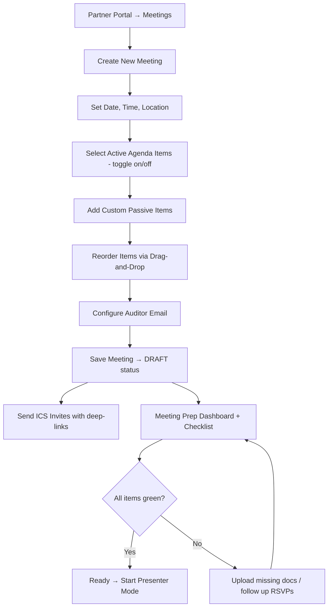
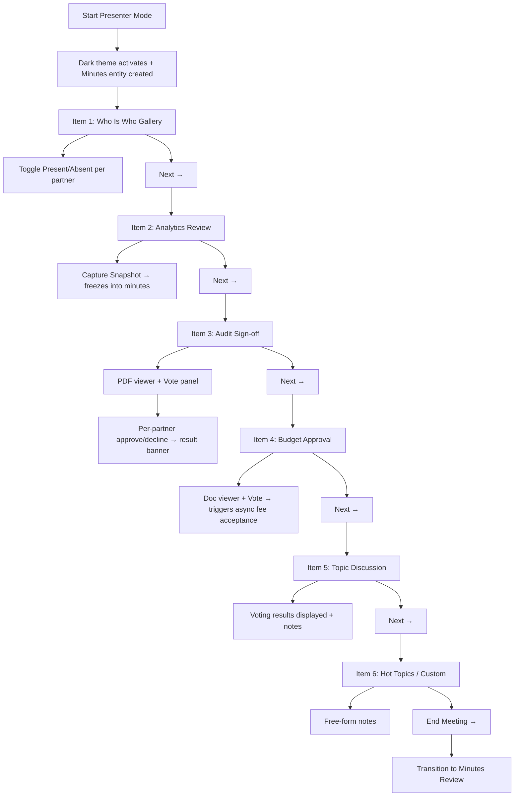
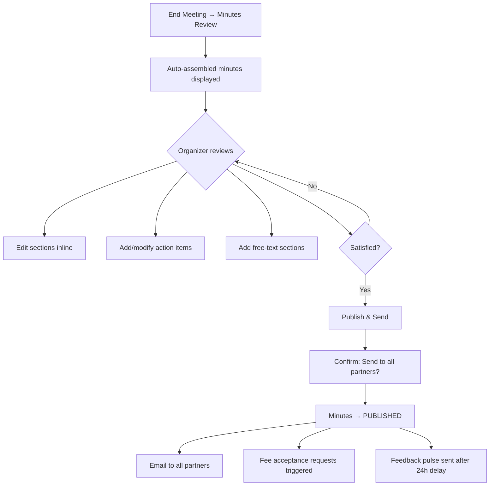
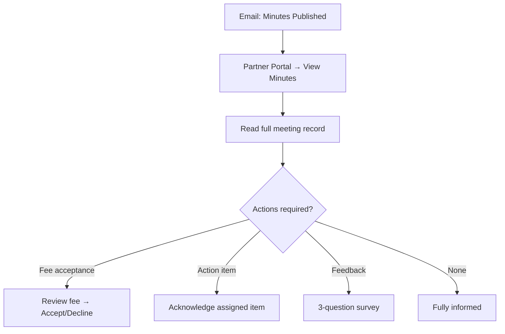
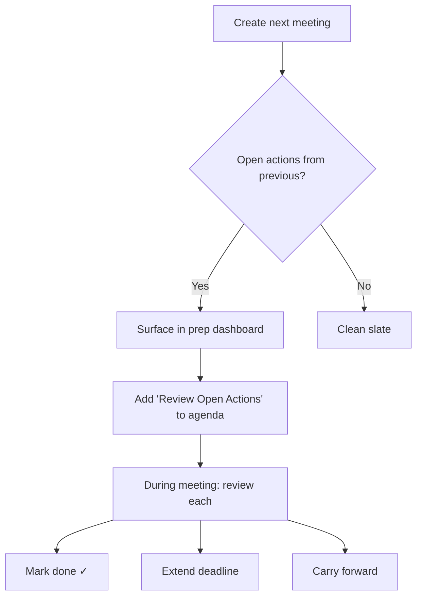

# UX Design Specification — BATbern Active Partner Meeting Agenda

**Author:** Nissim
**Date:** 2026-04-04

---

## Executive Summary

### Project Vision

Transform BATbern's bi-annual partner meetings from manual, verbal processes into an interactive, system-driven experience. Six static agenda items become live features with pre-meeting preparation, real-time meeting execution via a projector-driven presenter mode, and post-meeting async workflows. The system captures meeting minutes as a natural byproduct of use — no one "takes notes," the meeting documents itself.

### Target Users

**Primary: Organizer (Meeting Driver)**
- Runs the meeting from their laptop, projected for all partners to see
- Needs a streamlined controller interface: advance agenda items, trigger votes, upload documents, take notes
- Tech-savvy, but uses this only twice a year — interface must be self-explanatory
- Success = running the meeting without ever leaving the system

**Secondary: Present Partner (In-Room Participant)**
- Views the projected screen — no personal device interaction during the meeting
- Participates verbally; organizer captures their input (votes, attendance)
- Needs to see clear, readable content on the projector (large text, high contrast)

**Secondary: Absent Partner (Async Participant)**
- Receives meeting minutes and participates in post-meeting workflows via the partner portal
- Needs complete context: what was presented, what was decided, what requires their action
- Interacts via desktop or mobile for fee acceptance, feedback pulse

**Tertiary: New Partner (First-Year Onboarding)**
- First exposure to the BATbern partner meeting system
- Needs to understand the community and process quickly — onboarding tour, context package
- Visible "New" badge in the Who Is Who gallery signals veterans to be welcoming

**Tertiary: Stand-In (Non-System Delegate)**
- Attends on behalf of a partner company without a system account
- Organizer records their presence and proxies their votes with clear attribution
- No login required — represented via free-text name in the system

### Key Design Challenges

1. **Projector-First Design** — The primary consumption mode during the meeting is a projector. This means large typography, high contrast, minimal clutter, and no interactions that require individual partner devices. The organizer's laptop is the sole input device.

2. **Bi-Annual Usage = Zero Learning Curve** — Partners see this system twice a year. The organizer uses it twice a year. Every screen must be immediately understandable without training or memory of last time. Strong visual affordances, obvious next actions, no hidden features.

3. **Minutes as Byproduct** — Every organizer action (toggling attendance, uploading a document, triggering a vote, typing a note) must silently contribute to auto-assembling meeting minutes. The UX challenge: make this invisible during the meeting, reviewable after.

4. **Async Continuity** — Post-meeting workflows (fee acceptance, feedback, action item review) must feel like a natural extension of the meeting, not a disconnected system. Absent partners need enough context to participate meaningfully.

5. **Stand-In Governance** — Proxy voting and delegation must have clear attribution chains without adding complexity. The organizer is the sole operator — stand-in representation must be quick and unambiguous.

### Design Opportunities

1. **"The Meeting Runs Itself"** — A well-designed presenter mode where the organizer walks through the agenda and the system captures everything creates an experience that feels magical. No note-taker, no separate spreadsheet, no "can someone email the PDF" — it just works.

2. **Reusable Interaction Vocabulary** — Four components (vote, document viewer, note-taker, attendance gallery) recur across all agenda items. Consistent patterns mean partners instantly recognize "oh, this is a vote" regardless of whether it's audit sign-off or budget approval.

3. **Institutional Memory** — Year-over-year meeting archives with analytics snapshots, decision records, and action item history build a governance asset. "What did we decide about fees in 2024?" becomes a 10-second lookup.

4. **Projector-Optimized Dark Mode** — The existing BATbern dark theme (zinc-950 + blue-400) is perfect for projector readability. This becomes a distinctive visual identity for partner meetings — professional, high-contrast, unmistakably "meeting mode."

## Core User Experience

### Defining Experience

The core experience is the **Presenter/Controller Mode** — the organizer walks through the meeting agenda item by item, with each item presenting its specific interaction (gallery, vote, document viewer, notes) in a single continuous flow. The system silently builds the meeting minutes behind the scenes as a natural byproduct of use.

**Core Interaction Loop:**
1. Organizer advances to the next agenda item (one click)
2. The item's specific interaction renders in the main area (vote, gallery, document, etc.)
3. Organizer performs the item's action (toggle attendance, trigger vote, upload document, take notes)
4. System captures the interaction's output into the minutes automatically
5. Organizer advances to the next item

**What Must Be Effortless:**
- Advancing to the next agenda item — one click
- Casting a vote on behalf of a partner — one click per partner
- Toggling partner presence in the Who Is Who gallery — one click
- Adding a note to the current agenda item — always-visible text input
- Minutes assembling themselves — zero clicks, it just happens

**What Happens Automatically:**
- Attendance list populates the minutes when the organizer marks who's present
- Vote results get recorded in the minutes when voting closes
- Uploaded documents get attached to the minutes
- Analytics snapshots get captured when the analytics item is presented
- Action items from previous meetings surface when creating the next meeting

### Platform Strategy

- **Web only** — runs in the browser on the organizer's laptop, projected to room
- **Mouse/keyboard primary** — organizer operates from their desk
- **No offline needed** — meetings happen in venues with connectivity
- **Projector-optimized** — dark theme, large type, high contrast, minimal UI chrome
- **Single input device** — the organizer's laptop is the sole control surface; partners participate verbally

### Effortless Interactions

| Interaction | Current State | Target State |
|-------------|---------------|--------------|
| Meeting notes | Someone manually takes notes, emails them later | Minutes auto-assemble from agenda interactions |
| Audit sign-off | Verbal "all agreed?" with no record | One-click approve/decline per partner, result logged |
| Fee approval | Verbal agreement, manual follow-up | Live vote + async portal acceptance for absent partners |
| Attendance tracking | Manual roll call or informal | Who Is Who gallery with one-click presence toggle |
| Document sharing | PDFs emailed before/after meeting | Upload to agenda item, embedded viewer, permanently attached |
| Action items | Live in someone's head or a spreadsheet | Created in-context, assigned to owners, carried forward to next meeting |

### Critical Success Moments

1. **"It just captured everything"** — After the meeting, organizer clicks "Review Minutes" and sees a complete, well-structured document they barely need to edit
2. **"That was smooth"** — Moving from greeting → analytics → audit → budget → topics feels like walking through a presentation, not operating software
3. **"Everyone got the minutes"** — One click to publish, all partners (present + absent) receive the complete record with attachments
4. **"Nothing fell through the cracks"** — Opening next meeting's prep and seeing carried-forward action items from last time
5. **"The absent partner is fully informed"** — Minutes + async fee vote + feedback pulse means no one is ever out of the loop

### Experience Principles

| # | Principle | What It Means in Practice |
|---|-----------|---------------------------|
| 1 | **One Flow, One Screen** | The organizer never leaves the presenter mode during the meeting. Every agenda item renders in the same main area. Navigation is linear: back/next. |
| 2 | **Capture by Using** | Minutes build themselves from the organizer's natural actions. No "save to minutes" button — toggling attendance IS recording attendance. Voting IS recording the vote. |
| 3 | **Projector-Readable Always** | Every screen must be legible from 5 meters on a projector. Large type (min 24px body), high contrast (dark theme), generous whitespace, no dense tables. |
| 4 | **Twice-a-Year Obvious** | No feature should require remembering how it worked last time. Labels > icons. Explicit buttons > gestures. Guided flow > open dashboard. |
| 5 | **The Meeting Extends Beyond the Room** | Absent partners, async fee votes, feedback pulses, and published minutes ensure the meeting's value isn't limited to the 90 minutes in the room. |

## Desired Emotional Response

### Primary Emotional Goals

| User | Primary Emotion | Supporting Emotion |
|------|----------------|-------------------|
| **Organizer (prep)** | Confident and in control | Calm, methodical — like a pilot running a pre-flight checklist |
| **Organizer (live)** | Flow state efficiency | Pride in the tool, feeling like a conductor |
| **Present Partner** | Trust | Professional respect — "this organization runs things properly" |
| **Absent Partner** | Included, not excluded | Respected — their input still matters even without physical presence |
| **New Partner** | Belonging | Welcomed — "I'm part of this community now" |

### Emotional Journey Mapping

**Before the meeting (Organizer):**
Confidence and readiness. The prep checklist shows green checkmarks: audit PDF uploaded, budget doc ready, RSVP at 10/12, topic voting closed. "I'm ready. The system has my back."

**Starting the meeting (Presenter Mode activates):**
A subtle shift — like stepping onto a stage. The dark theme fills the screen. The agenda sidebar appears. The Who Is Who gallery loads. Pride: "This is professional. This is BATbern." Partners see something polished, not a spreadsheet.

**During the meeting (flowing through items):**
Each item transition feels effortless and rhythmic. Click next, new interaction appears, handle it, click next. The organizer is a conductor, not a data entry clerk. Dominant emotion: flow.

**After a vote:**
8/8 partners approve the audit report. Result appears instantly: "Financial Report 2025 — Approved (8/8)." Satisfaction and accomplishment. A decision made, recorded, and historized in 10 seconds.

**After the meeting (reviewing minutes):**
Organizer clicks "Review Minutes" and sees a complete document — attendees, snapshots, PDFs, votes, notes, action items. Genuine delight: "This actually wrote itself."

**Absent partner (receiving minutes):**
Complete meeting record arrives. They can participate in async fee acceptance. Inclusion: their input matters even though they weren't there.

**New partner (first meeting):**
Their company appears in the Who Is Who gallery with a "New" badge. Veterans welcome them. Belonging.

### Emotion-to-Design Implications

| Desired Emotion | UX Design Approach |
|---|---|
| **Confidence** (organizer prep) | Meeting prep checklist with clear green/yellow/red status indicators. Nothing ambiguous. |
| **Pride** (presenter mode) | Dark theme, polished transitions, professional typography. The projected screen looks like it belongs at a Swiss tech conference. |
| **Flow** (during meeting) | Linear navigation, consistent layout, no modal interruptions, no page loads between items. |
| **Trust** (partners watching) | Clean, readable projector display. Vote tallies shown transparently. Document viewer works instantly. |
| **Delight** (auto-minutes) | The "Review Minutes" screen reveals a complete, formatted, ready document — a subtle moment of satisfaction. |
| **Inclusion** (absent partner) | Same information, same context, same ability to act — just async. |
| **Belonging** (new partner) | Subtle "New" badge, partner profile cards showing company + role + photo. |

### Emotions to Avoid

| Avoid | Prevention Strategy |
|---|---|
| **Anxiety** ("did it save?") | Auto-save with visible indicators. Minutes build progressively — never a big-bang at the end. |
| **Confusion** ("what do I click?") | Large, labeled buttons. Linear flow. No hidden menus. Twice-a-year obvious. |
| **Embarrassment** (projector shows something wrong) | Preview mode before meeting. Prep checklist catches missing uploads. |
| **Frustration** (technical failure mid-meeting) | Graceful degradation. If document viewer fails, show download link. If vote fails, allow manual note. |
| **Exclusion** (absent partner) | Full minutes + async workflows ensure absent = delayed, never absent = excluded. |

### Emotional Design Principles

1. **Confidence Through Visibility** — Always show system state clearly. Auto-save indicators, progress markers, checklist statuses. The organizer should never wonder "is it working?"
2. **Delight Through Automation** — The magic moment is when the system produces something the user didn't explicitly create. Auto-assembled minutes are the primary delight vector.
3. **Trust Through Consistency** — Every vote looks the same. Every document viewer works the same. Predictability builds trust, especially at bi-annual frequency.
4. **Inclusion Through Completeness** — Every artifact from the meeting (minutes, votes, documents, action items) is available to absent partners. No information is locked behind physical presence.

## UX Pattern Analysis & Inspiration

### Inspiring Products Analysis

#### OneNote — Meeting Minutes
- **Freeform note-taking with structure**: Sections and pages give organization without rigid templates. Notes feel effortless.
- **Invisible auto-save**: You never think about saving. It just happens.
- **Sections as agenda items**: Each section tab maps naturally to a meeting topic.
- **Rich content embedding**: Images, files, tables — all inline. The document becomes a living artifact.

#### Miro — PI Planning Days (SAFe)
- **Facilitator mode**: One person drives what everyone sees — exactly our presenter mode concept.
- **Built-in dot voting**: Simple, visual, instant results. Universally understood.
- **Facilitation tools**: Timers, spotlight, "bring everyone to me" — tools for the session driver.
- **Spatial journey**: Move from board to board, like moving from agenda item to agenda item.

#### Microsoft PowerPoint — Presenter Mode
- **Presenter view vs. audience view**: Presenter sees notes + next slide + timer. Audience sees clean content.
- **Click-to-advance linear flow**: Everyone knows how it works. Zero learning curve.
- **Smooth slide transitions**: Visual continuity between slides. No jarring state changes.
- **"What's next" preview**: Upcoming slide reduces presenter anxiety.

#### Mentimeter — Live Audience Interaction
- **Projector-first design**: Every screen designed to look great projected. Large fonts, high contrast.
- **Animated result reveals**: Vote results build up visually — creates anticipation and delight.
- **Results are the content**: The vote visualization IS the presentation.
- **Zero friction**: No account needed to participate.

### Transferable UX Patterns

| Pattern | Source | How We Apply It |
|---------|--------|-----------------|
| **Sections as agenda items** | OneNote | Agenda sidebar with tabs/items, click to navigate |
| **Invisible auto-save** | OneNote | All organizer actions auto-save. Subtle indicator only. |
| **Facilitator controls the view** | Miro | Organizer's presenter mode drives what the projector shows |
| **Built-in voting with visual results** | Miro + Mentimeter | Approve/decline per partner with instant visual tally |
| **Presenter view vs. audience view** | PowerPoint | Organizer laptop shows controls + notes; projector shows clean content |
| **Click-to-advance linear flow** | PowerPoint | Next/back buttons advance through agenda items like slides |
| **"What's next" preview** | PowerPoint | Sidebar shows upcoming agenda item title |
| **Projector-optimized display** | Mentimeter | Large fonts, high contrast, results as visual heroes |
| **Animated result reveal** | Mentimeter | Subtle animation when vote results appear — moment of delight |
| **Rich inline content** | OneNote | Notes, documents, vote results, attendance — all in one flowing view |

### Anti-Patterns to Avoid

| Anti-Pattern | Source | Why We Avoid It |
|---|---|---|
| **Freeform canvas without structure** | OneNote/Miro | Our minutes need predictable structure for auto-assembly |
| **General-purpose complexity** | Miro | Purpose-built simplicity beats flexible power tools for bi-annual use |
| **Individual device requirement** | Mentimeter | Partners don't use devices during the meeting — organizer is sole operator |
| **Passive content only** | PowerPoint | Each "slide" must support interaction (votes, galleries, document viewers) |
| **Empty states without guidance** | PowerPoint | If an agenda item has no content, show clear "Upload document" or "No items" state |
| **Dense data tables on projector** | Excel/Miro | Projector-readable means max 8-12 items visible, large text, no scrolling |

### Design Inspiration Strategy

**Adopt directly:**
- PowerPoint's presenter vs. audience dual-view model (organizer laptop vs. projector)
- PowerPoint's click-to-advance linear flow for agenda navigation
- OneNote's invisible auto-save pattern
- Mentimeter's projector-optimized result display with large, high-contrast visuals

**Adapt for our context:**
- Miro's facilitator mode → simplified to linear agenda progression (no infinite canvas)
- Mentimeter's audience voting → organizer-proxied voting (one person clicks for all)
- OneNote's freeform sections → structured agenda items with specific interaction types per item
- Miro's dot voting → simple approve/decline with clear visual tally

**Avoid entirely:**
- Multi-device interaction patterns (partners don't use devices during meetings)
- General-purpose tool complexity (purpose-built for bi-annual partner meetings)
- Dense data visualizations on projector (keep it large, simple, readable at 5 meters)
- Free-form canvas layouts (structured, predictable auto-assembly for minutes)

## Design System Foundation

### Design System Choice

**Extend the existing BATbern design system** — no new framework needed.

- **MUI (Material-UI) v5+** as React component foundation (80% standard components)
- **Tailwind CSS** for the dark-themed presenter mode (reusing public landing page dark theme)
- **Custom BATbern components** (20%) for domain-specific meeting features
- **Atomic Design Structure**: Atoms → Molecules → Organisms → Templates

### Rationale for Selection

The BATbern design system (documented in `docs/front-end-spec.md`) already provides the complete foundation:
- Full color palette with both light (portals) and dark (public pages) themes
- Typography system (Inter primary, JetBrains Mono for monospace)
- 8px spacing grid, 12-column responsive layout
- 9+ defined component specifications
- WCAG 2.1 AA accessibility compliance

The partner meeting presenter mode uses the **dark theme variant** for projector optimization — this theme already exists and simply needs a projector-scale typography extension.

### Implementation Approach

**Presenter Mode = Dark Theme (Tailwind)**
- Uses zinc-950 + blue-400 dark theme for projector readability
- Visually distinct from regular portal usage — partners see "meeting mode"
- Aligns with the "pride" emotional goal ��� polished and professional

**New Reusable Components:**

| Component | MUI Base | Purpose |
|-----------|----------|---------|
| **Agenda Sidebar** | Stepper (vertical) | Active/completed/upcoming states, click to navigate |
| **Vote Panel** | ButtonGroup + Card | Approve/decline per partner, result tally, animated reveal |
| **Document Viewer** | Card + embedded PDF | Upload zone, inline viewer, dark-themed chrome |
| **Note Panel** | TextField (multiline) | Always-visible, auto-save, attaches to current agenda item |
| **Partner Gallery** | Grid + Avatar | Company logo, partner name, photo, presence/new badges |
| **Meeting Prep Checklist** | List + Chip | Green/yellow/red status per item, linked to agenda readiness |
| **Action Item Card** | Card + Chip | Title, owner, deadline, status badge, carry-forward indicator |
| **Minutes Preview** | Paper + Typography | Auto-assembled document, section per agenda item, editable |

**Projector Typography Scale:**

| Element | Standard (Portal) | Projector (Presenter Mode) |
|---------|-------------------|---------------------------|
| H1 | 40px | 56px |
| H2 | 32px | 44px |
| H3 | 24px | 32px |
| Body | 16px | 24px |
| Caption | 12px | 18px |

**Partner Role Colors in Dark Theme:**
- Text: `text-orange-400` (#FB923C) on zinc-950 for AA contrast
- Badge backgrounds: `bg-orange-400/10` with `text-orange-400`
- Vote approved: `text-green-400` (#4ADE80), declined: `text-red-400` (#F87171)

### Customization Strategy

- **New theme variant**: `presenterTheme` — dark, large typography, projector-optimized
- **New component category**: `meeting/` folder alongside existing component folders
- **Layout template**: `PresenterLayout` separate from `OrganizerLayout`
- **Shared patterns**: Vote and Document Viewer components reusable for future non-meeting features
- All new components built as Organisms in the atomic design hierarchy, reusing existing MUI atoms

## Defining Experience

### The Core Interaction

**"Walk through the agenda, and the meeting documents itself."**

The defining experience is the Presenter Mode flow — the organizer advances through agenda items while the system silently captures everything into auto-assembling meeting minutes. Each agenda item is like a PowerPoint slide, but interactive: votes, galleries, document viewers, and notes.

### User Mental Model

**Current approach:**
- PowerPoint with agenda points, someone taking notes in Word/OneNote
- PDFs opened in separate apps, verbal "all in favor?" with handwritten notes
- Post-meeting: compile notes, attach PDFs, email to everyone
- Action items in an email, hoping people remember

**Mental model we build on:** The organizer already thinks of a meeting as "a sequence of agenda items we walk through." They're used to PowerPoint's linear slide model. Our innovation: **the meeting IS a presentation, but each slide does something.**

**Where confusion could happen:**
- "Where did my notes go?" → Notes visibly attached to current item
- "Did the vote save?" → Instant visual confirmation
- "How do I go back?" → Back button works non-destructively

### Success Criteria

| Criteria | Measurable Target |
|----------|------------------|
| **Meeting execution** | Full 6-item agenda completed in presenter mode without leaving the system |
| **Minutes completeness** | Auto-assembled minutes contain 90%+ of meeting content with minimal editing |
| **Zero training** | New organizer can run a meeting after 2-minute orientation or cold with prep checklist |
| **Vote recording** | Every vote captured with partner-level attribution in under 30 seconds |
| **Post-meeting distribution** | Minutes published and sent to all partners within 5 minutes of meeting end |
| **Action item persistence** | 100% of action items carry forward to next meeting |

### Novel UX Patterns

| Aspect | Pattern Type | Implementation |
|--------|-------------|----------------|
| **Linear agenda flow** | Established (PowerPoint) | Click-to-advance through items |
| **Auto-assembling minutes** | **Novel** | System captures outputs of each interaction silently |
| **Proxied voting** | Novel | Organizer clicks on behalf of partners (like a teller in parliament) |
| **Embedded document viewer** | Established | PDF viewer inline in the agenda item |
| **Presence gallery** | Established (video call grids) | Who Is Who with presence badges |
| **Action item carry-forward** | Novel | System surfaces open items from previous meetings automatically |

**Key innovations:**
1. **Minutes as byproduct** — every organizer action contributes to a document they never explicitly create
2. **Proxied group voting** — organizer casts votes for each partner in turn, fitting the single-device constraint

### Experience Mechanics

#### 1. Initiation — Starting the Meeting

```
Organizer: Partner Portal → Meetings → [Meeting Name] → "Start Presenter Mode"
→ Screen transitions to dark theme
→ Agenda sidebar appears on the left
→ First item (Greeting / Who Is Who) loads in main area
→ System creates PartnerMeetingMinutes entity in DRAFT status
```

#### 2. Interaction — Agenda Item Types

| Agenda Item | Main Area Content | Organizer Controls |
|-------------|-------------------|-------------------|
| **Greeting / Who Is Who** | Partner gallery grid (logo, name, photo, badges) | Click partner → toggle Present/Absent |
| **Analytics Review** | Analytics dashboard embed | "Capture Snapshot" → freezes current data into minutes |
| **Audit Sign-off** | PDF viewer with uploaded audit report | "Start Vote" → per-partner approve/decline |
| **Budget Approval** | PDF/spreadsheet viewer with budget doc | "Start Vote" → per-partner approve/decline |
| **Topic Discussion** | Topic voting results + blob game results | Note panel for discussion points |
| **Hot Topics** | Free-form note area | Note panel only (unstructured) |
| **Custom Items** | Title + description + note panel | Note panel for discussion |

**Always visible on every item:**
- Note panel (bottom or right) — organizer types notes at any time
- Agenda sidebar (left) — all items listed, current highlighted, click to jump
- "Next Item" button (prominent, bottom-right) — advances the flow
- Auto-save indicator (subtle, top-right) — "Saved ✓"

#### 3. Feedback — Knowing It's Working

| Action | Immediate Feedback |
|--------|-------------------|
| Toggle partner present | Green "Present" badge, checkmark animation |
| Toggle partner absent | Badge goes gray, subtle fade |
| Upload document | Progress bar → "Uploaded ✓" with thumbnail |
| Start vote | Vote panel expands with partner list + approve/decline buttons |
| Cast vote for a partner | Button fills with color (green/red), partner row marked |
| Complete vote | Result banner: "Approved — 8/8" with subtle animation |
| Type a note | Auto-save indicator pulses briefly |
| Advance to next item | Smooth slide transition, sidebar updates position |

#### 4. Completion — Ending the Meeting

```
After last item → "Next" button changes to "End Meeting"
→ Click "End Meeting"
→ Transition to Minutes Review screen
→ Auto-assembled minutes: attendance, snapshots, documents, votes, notes, action items
→ Organizer reviews and edits if needed
→ Clicks "Publish & Send"
→ All partners (present + absent) receive email with minutes link/PDF
→ Meeting status → COMPLETED
```

## Visual Design Foundation

### Color System — Presenter Mode

**Base:** BATbern dark theme (zinc-950 + blue-400) from public landing page.

| Purpose | Token | Value | Contrast on zinc-950 |
|---------|-------|-------|---------------------|
| Background | `bg-zinc-950` | #09090B | — |
| Surface (cards) | `bg-zinc-900` | #18181B | — |
| Surface hover | `bg-zinc-800` | #27272A | — |
| Primary text | `text-zinc-100` | #F4F4F5 | 15.8:1 AAA |
| Secondary text | `text-zinc-300` | #D4D4D8 | 12.2:1 AAA |
| Muted text | `text-zinc-500` | #71717A | 5.9:1 AA |
| Accent (links, CTAs) | `text-blue-400` | #60A5FA | 7.8:1 AA+ |
| Border | `border-zinc-800` | #27272A | — |

**Meeting-Specific Semantic Colors:**

| Purpose | Token | Value | Usage |
|---------|-------|-------|-------|
| Partner accent | `text-orange-400` | #FB923C | Partner names, role badges |
| Present / Approved | `text-green-400` | #4ADE80 | Present badge, approved vote |
| Absent / Declined | `text-red-400` | #F87171 | Absent badge, declined vote |
| Pending | `text-yellow-400` | #FACC15 | Pending vote, incomplete items |
| Active item | `bg-blue-400/10` | blue-400 @ 10% | Current agenda item in sidebar |
| Completed item | `text-zinc-500` | #71717A | Completed agenda items in sidebar |
| New partner badge | `bg-purple-400/10 text-purple-400` | #C084FC | "New" badge for first-year partners |

**Vote Result Visualization:**
- Approved: `bg-green-400/10` + `text-green-400` + checkmark icon
- Declined: `bg-red-400/10` + `text-red-400` + X icon
- Result banner: `bg-zinc-900` card with large result text (44px) centered

### Typography System — Presenter Mode

Font: **Inter** (same as platform) at projector scale (~1.5x standard):

| Element | Size | Weight | Usage |
|---------|------|--------|-------|
| Meeting Title | 56px | 700 Bold | Top of screen |
| Agenda Item Title | 44px | 600 SemiBold | Current item heading |
| Section Label | 32px | 600 SemiBold | Subsections (e.g., "Vote Results") |
| Body / Partner Name | 24px | 400 Regular | Gallery names, notes, descriptions |
| Button Label | 24px | 500 Medium | "Next Item", "Start Vote", "Approve" |
| Badge Text | 18px | 600 SemiBold | "Present", "New", "Approved" |
| Metadata | 18px | 400 Regular | Timestamps, auto-save, vote counts |
| Sidebar Item | 20px | 400/600 | Agenda titles (600 for active) |

Minimum readable text on projector at 5m: 18px. Font rendering: `font-smoothing: antialiased`.

### Spacing & Layout Foundation

**Three-Zone Layout:**

```
┌──────────────────────────────────────────────────────────────┐
│  Meeting Title                              Auto-save ✓      │  Header (64px)
├────────────┬─────────────────────────────────────────────────┤
│            │                                                 │
│  AGENDA    │            MAIN CONTENT AREA                    │
│  SIDEBAR   │    (Gallery / Vote / Document / Notes)           │
│  280px     │                                                 │
│            │                                                 │
│  1. ✓ Greet│─────────────────────────────────────────────────│
│  2. → Analy│         NOTE PANEL (always visible)             │
│  3.  Audit │    ┌─────────────────────────────────────┐      │
│  4.  Budget│    │ Type notes here...            Saved ✓│      │
│  5.  Topics│    └─────────────────────────────────────┘      │
│  6.  Other │                                                 │
├────────────┴─────────────────────────────────────────────────┤
│  ← Previous Item                              Next Item →    │  Footer (64px)
└──────────────────────────────────────────────────────────────┘
```

| Zone | Width | Height | Padding |
|------|-------|--------|---------|
| Header | Full width | 64px fixed | 24px horizontal |
| Sidebar | 280px fixed | Viewport - header - footer | 16px, 12px between items |
| Main Content | Remaining | 70% available | 32px |
| Note Panel | Same as main | 30% available (min 200px) | 24px |
| Footer | Full width | 64px fixed | 24px horizontal |

**Spacing Scale (1.5x standard):** 12px (compact) · 24px (standard) · 36px (comfortable) · 48px (spacious)

**Grid:** Single-column main content — no multi-column layouts on projector.

### Accessibility Considerations

**Projector-Specific:**
- All text WCAG AAA (7:1+) on dark backgrounds
- No color-only information: badges use color + text label + icon
- Vote results: color + icon + text (never color alone)

**Keyboard Navigation (Organizer Laptop):**
- `→` / `Space`: Advance to next agenda item
- `←`: Previous item
- `1-9`: Jump to item by number
- `N`: Focus note panel
- `V`: Start vote
- `Escape`: Exit presenter mode (with confirmation)

**ARIA:**
- `aria-live="polite"` on vote results and auto-save indicators
- Sidebar: `role="navigation"` + `aria-current="step"` on active item
- Gallery: `role="list"` with presence state in `aria-label`

## Design Direction Decision

### Design Directions Explored

Six design directions created as interactive HTML mockups (`docs/ux-design-directions.html`):

| Direction | Layout | Screens Shown |
|-----------|--------|---------------|
| A: Classic Sidebar | Sidebar + main area + bottom note panel | Who Is Who gallery |
| B: Top Progress Bar | Progress bar + full-width content | Who Is Who gallery |
| C: Split Vote | Left document + right vote panel | Audit sign-off |
| D: Minimal Zen | Centered content, dot navigation | Who Is Who gallery |
| E: Document Viewer | Full document + side panel | Audit with vote panel |
| F: Minutes Preview | Document-style review | Auto-assembled minutes |

### Chosen Direction

**Composite: A + E (modified) + F**

- **Direction A** as the primary presenter mode layout for all agenda items
- **Direction E** for document-heavy items (audit, budget) — modified: note panel always at bottom (consistent with A), vote panel on the right
- **Direction F** as the post-meeting minutes review and publish screen

### Design Rationale

1. **Consistency wins** — Direction A's sidebar + content + bottom notes creates a predictable layout. The note panel never moves.
2. **Document items need the vote panel** — Direction E's right-side vote panel is the natural place for per-partner approve/decline when viewing a document. Notes stay at the bottom.
3. **Minutes are the payoff** — Direction F delivers the "it captured everything" delight moment. Clean, document-like, publishable.
4. **Projector clarity** — All directions use dark theme with large typography, avoiding dense layouts.

### Composite Layout Specification

**Standard Agenda Items** (greeting, analytics, topics, hot topics):
```
┌────────────┬─────────────────────────────────────┐
│  SIDEBAR   │        MAIN CONTENT AREA             │
│  (280px)   │  (gallery / analytics / discussion)  │
│            ├─────────────────────────────────────┤
│            │    NOTE PANEL (bottom, 180px)        │
├────────────┴─────────────────────────────────────┤
│  ← Previous                        Next Item →   │
└──────────────────────────────────────────────────┘
```

**Document + Vote Items** (audit sign-off, budget approval):
```
┌────────────┬──────────────────────┬──────────────┐
│  SIDEBAR   │  DOCUMENT VIEWER     │  VOTE PANEL  │
│  (280px)   │  (PDF embedded)      │  (320px)     │
│            ├──────────────────────┴──────────────┤
│            │    NOTE PANEL (bottom, 180px)        │
├────────────┴─────────────────────────────────────┤
│  ← Previous                        Next Item →   │
└──────────────────────────────────────────────────┘
```

**Post-Meeting Minutes Review** (Direction F):
```
┌──────────────────────────────────────────────────┐
│  Meeting Minutes — Review & Publish    [Draft]    │
├──────────────────────────────────────────────────┤
│  ┌─────────────────────────────────────────────┐ │
│  │  Partner Meeting — Spring 2026               │ │
│  │  1. Attendance (auto-populated)              │ │
│  │  2. Analytics Review (snapshot attached)     │ │
│  │  3. Audit Sign-off (PDF + vote result)       │ │
│  │  4. Budget Approval (doc + vote + fee note)  │ │
│  │  5. Topics Discussion (notes)                │ │
│  │  6. Action Items (with owners + deadlines)   │ │
│  └─────────────────────────────────────────────┘ │
├──────────────────────────────────────────────────┤
│  [← Back to Edit]       [Publish & Send to All]  │
└──────────────────────────────────────────────────┘
```

## User Journey Flows

### Journey 1: Create & Prepare Meeting (Organizer, Pre-Meeting)

**Entry:** Partner Portal → Meetings → "Create New Meeting"
**Success:** All checklist items green, organizer confident and ready to present



**Edge cases:**
- Audit PDF not uploaded → yellow warning, blocks "Start" until uploaded or item removed
- Zero RSVPs → warning but doesn't block
- Previous meeting has open action items → surfaced in prep dashboard automatically

### Journey 2: Run Meeting in Presenter Mode (Organizer, Live)

**Entry:** "Start Presenter Mode" on meeting prep screen
**Success:** All items walked through, votes captured, notes taken, minutes auto-assembled



**At every step:** Sidebar shows progress, note panel at bottom, auto-save indicator
**Edge cases:**
- Skip an item → marked as skipped in minutes
- Stand-in → organizer records in notes, proxies their votes
- Go back → non-destructive, data preserved
- Add action item → button available on every item

### Journey 3: Review & Publish Minutes (Organizer, Post-Meeting)

**Entry:** Automatic transition from end of presenter mode
**Success:** Minutes published, all partners notified, async workflows triggered



**Edge cases:**
- Save draft and publish later → "Save Draft" button available
- PDF too large for email → email contains portal link

### Journey 4: Absent Partner — Catch Up & Act (Async)

**Entry:** Email notification with link to published minutes
**Success:** Absent partner fully informed and able to participate in post-meeting decisions



**Edge cases:**
- No action on fee → reminders at 7d, 14d, then organizer notified
- Partner declines fee → organizer notified with comment

### Journey 5: Next Meeting — Action Item Carry-Forward (Lifecycle)

**Entry:** Organizer creates next partner meeting
**Success:** No action item ever lost between meetings



**Edge cases:**
- Items carried 2+ meetings → flagged with urgency indicator
- Owner no longer a partner → organizer reassigns

### Journey Patterns

| Pattern | Used In | Implementation |
|---------|---------|----------------|
| **Linear progression** | All journeys | Sidebar/progress with back/next, no branching during live meeting |
| **Capture by using** | Journey 2 | Every interaction auto-contributes to minutes entity |
| **Checklist gating** | Journey 1 | Prep checklist shows readiness, soft-blocks start if critical items missing |
| **Async extension** | Journey 4 | Post-meeting workflows extend value to non-attendees |
| **Carry-forward** | Journey 5 | System surfaces open items from previous meetings automatically |
| **Confirm before publish** | Journey 3 | Review screen + confirmation dialog before distributing |

### Flow Optimization Principles

1. **Minimize clicks during live meeting** — Every agenda item interaction is 1-2 clicks max. No modals, no multi-step forms during presenter mode.
2. **Auto-populate everything possible** — Attendance, vote results, snapshots all flow into minutes automatically. Organizer only adds free-text notes.
3. **Never lose data** — Auto-save at every step. Draft minutes persist. Action items carry forward.
4. **Async = same context, different timeline** — Absent partners see the same minutes, documents, and vote results. Their actions feed back into the same system.
5. **Progressive readiness** — Prep checklist turns red → yellow → green. "Start Presenter Mode" enables when minimum readiness is met.

## Component Strategy

### Design System Components (Available from BATbern MUI + Tailwind)

| Component | Used For |
|---|---|
| MUI Button, ButtonGroup | Navigation, vote buttons, actions |
| MUI TextField / TextArea | Note panel, action item forms |
| MUI Card | Partner cards, action item cards |
| MUI Avatar | Partner initials/photos |
| MUI Chip | Badges (Present, Absent, New) |
| MUI Stepper | Agenda sidebar foundation |
| MUI List / ListItem | Vote rows, action item lists |
| MUI Dialog | Confirmation modals |
| MUI AppBar | Header bar |
| Content Upload Component | Document upload (S3 presigned URL) |
| Notification Toast | Auto-save confirmations, error alerts |

### Custom Components

#### 1. AgendaSidebar
**Purpose:** Persistent navigation showing all agenda items with progress during presenter mode
**Anatomy:** Vertical list — number circle, item title, status icon per item
**States:** `upcoming` (gray) | `active` (blue highlight, bold) | `completed` (green checkmark) | `skipped` (gray, strikethrough)
**Interactions:** Click any item to jump (non-destructive). Current item auto-scrolls.
**Size:** 280px fixed width. **Accessibility:** `role="navigation"`, `aria-current="step"`

#### 2. VotePanel
**Purpose:** Organizer casts approve/decline votes on behalf of each present partner
**Anatomy:** Header (vote title) → partner rows (avatar + name + approve/decline buttons) → result tally
**States:** `idle` | `voting` | `complete`
**Interactions:** Click approve (green) or decline (red) per partner. Change before completing. "Complete Vote" locks results.
**Result animation:** Banner slides in: "Approved — 5/5" (300ms fade + scale)
**Accessibility:** `role="group"`, each button `aria-label="Approve for [name]"`

#### 3. DocumentViewer
**Purpose:** Display uploaded PDF/spreadsheet inline within an agenda item
**Anatomy:** Document title + metadata, embedded PDF viewer, toolbar (zoom, pages, download)
**States:** `empty` ("No document uploaded") | `loading` | `loaded` | `error`
**Size:** Fills available width minus vote panel. Dark chrome (zinc-900).
**Accessibility:** `aria-label="Document viewer: [title]"`, keyboard zoom

#### 4. NotePanel
**Purpose:** Always-visible text area for discussion notes, attached to current agenda item
**Anatomy:** Label ("Notes — [item name]"), multiline textarea, auto-save indicator
**States:** `empty` | `typing` | `saved`
**Position:** Always bottom, 180px height, consistent across all item types
**Interactions:** Auto-saves every 2s of inactivity. Keyboard shortcut `N` to focus.

#### 5. PartnerGallery
**Purpose:** Grid of partner companies with presence toggle for Who Is Who
**Anatomy:** Auto-fill grid (min 200px), each card: avatar, name, company, badge
**States per card:** `present` (green border) | `absent` (dimmed) | `stand-in` ("Represented by [name]")
**Interactions:** Click to toggle. "Add Stand-in" on absent partner → free-text name input.
**Accessibility:** `role="list"`, cards as `role="listitem"` with status in `aria-label`

#### 6. MeetingPrepChecklist
**Purpose:** Dashboard showing meeting readiness with actionable status items
**Anatomy:** List items with icon, label, status chip (green/yellow/red), action link
**Dynamic items based on enabled agenda:** audit PDF, budget doc, RSVP count, topic voting, open actions, ICS sent
**Overall indicator:** "4 of 6 items ready"

#### 7. ActionItemCard
**Purpose:** Capture and display action items with ownership and lifecycle
**Anatomy:** Title, owner dropdown, deadline picker, status badge, source link
**States:** `open` | `in-progress` | `completed` | `carried-forward`
**Carry-forward:** Shows "Carried from [meeting name]" with link

#### 8. MinutesDocument
**Purpose:** Auto-assembled meeting record, reviewable and editable before publishing
**Anatomy:** Header (title, date, location), sections per agenda item, attendance tags, vote results, action items
**States:** `draft` (editable) | `published` (read-only)
**Actions:** "Publish & Send", "Save Draft", "Back to Edit"

#### 9. VoteResultBanner
**Purpose:** Projector-friendly vote outcome display with animation
**Anatomy:** Large result text (44px), colored background (green/red at 10% opacity)
**Animation:** Fade-in + scale 95%→100% over 300ms
**Size:** Full content width, 120px height

#### 10. AgendaBuilder
**Purpose:** Configure active agenda items and their order for a meeting
**Anatomy:** Toggle switches per item type, reorderable list with drag handles, "Add Custom Item" button
**Validation:** Minimum 1 active item. Warning if no greeting item.

#### 11. FeeAcceptanceWidget
**Purpose:** Partner-facing accept/decline for new fee after meeting decision
**Anatomy:** Fee amount, change from previous, accept/decline buttons, optional comment
**Used in:** Absent partner portal (Journey 4)

#### 12. FeedbackPulse
**Purpose:** Post-meeting 3-question survey
**Anatomy:** "Was the meeting productive?" (1-5), "Topics we should discuss?", "Suggestions?"
**Sent:** 24h after minutes published

### Component Implementation Roadmap

**Layer 1 — Foundation (create & prep meeting):**
- AgendaBuilder, AgendaSidebar, NotePanel, PartnerGallery, MeetingPrepChecklist

**Layer 2 — Core Interactions (full meeting flow):**
- DocumentViewer, VotePanel, VoteResultBanner, ActionItemCard

**Layer 3 — Post-Meeting (minutes & distribution):**
- MinutesDocument, FeeAcceptanceWidget, FeedbackPulse

## UX Consistency Patterns

### Button Hierarchy

**Presenter Mode (Projector):**

| Level | Style | Size | Usage |
|-------|-------|------|-------|
| Primary | `bg-blue-400 text-zinc-950` | 48px h, 24px text | "Next Item →", "Start Vote", "End Meeting" |
| Secondary | `bg-zinc-800 text-zinc-100 border-zinc-700` | 48px h | "← Previous", "Save Draft" |
| Destructive | `bg-red-400/10 text-red-400` | 48px h | "Skip Item", "Cancel Vote" |
| Ghost | `transparent text-zinc-400` | 48px h | "Add Note", context actions |

**Portal Mode (Partner Screens):**

| Level | Style | Size | Usage |
|-------|-------|------|-------|
| Primary | `bg-blue-400 text-zinc-950` | 40px h, 15px text | "Accept Fee", "Submit Feedback" |
| Secondary | `bg-zinc-800 text-zinc-100` | 40px h | "Decline", "Save Draft" |
| Link | `text-blue-400 underline` | Inline | "View Minutes", "Download PDF" |

**Rules:** Max 1 primary per screen area. Primary on right, secondary on left. All buttons have labels in presenter mode (never icon-only). 48px+ height for projector visibility.

### Feedback Patterns

| Feedback | Presenter Mode | Portal Mode |
|---|---|---|
| Auto-save | "Saved ✓" top-right, green, fades after 2s | Same |
| Vote cast | Button fills green/red immediately | N/A |
| Vote complete | VoteResultBanner animates in (300ms) | N/A |
| Presence toggle | Badge changes green ↔ gray, subtle animation | N/A |
| Success | Green toast bottom-right, auto-dismiss 3s | Same |
| Error | Red toast, manual dismiss, retry action | Same + inline error |
| Warning | Yellow toast, auto-dismiss 5s | Same |
| Document uploaded | Progress bar → "Uploaded ✓" with thumbnail | Same |
| Minutes published | Full-screen confirmation with partner count | Email confirmation toast |

**Rules:** No modal dialogs obscuring content in presenter mode (except confirmations). Toasts stack bottom-right, max 2. Animations 200-300ms ease-out. Auto-save never shows "Saving..." spinner — either "Saved ✓" or nothing.

### Navigation Patterns

**Presenter Mode:**
- Linear: "← Previous" / "Next Item →" in footer, always visible
- Sidebar jump: click any item, non-destructive
- Keyboard: `→`/`Space` next, `←` back, `1-9` jump, `N` notes, `V` vote, `Esc` exit
- Exit: `Esc` → confirmation dialog, draft saved
- End meeting: last item's "Next →" becomes "End Meeting"

**Portal Mode:**
- Standard partner nav: Topic Voting | Meetings | Settings | Help
- Breadcrumb: Partner > Meetings > [Meeting Name] > Minutes
- Meeting list: upcoming, past (with minutes links), draft (organizer only)

### Form Patterns

| Pattern | Implementation |
|---|---|
| Inline editing | Notes, action items — click to edit, auto-save. No "Edit" button. |
| Toggle inputs | Presence (click card), agenda items (switch). Instant save. |
| Vote inputs | Approve/decline — single click, immediate feedback, reversible before "Complete Vote" |
| Date picker | MUI DatePicker, default 14 days from meeting |
| Text areas | No character limit, placeholder text, auto-expanding |
| File upload | Drag-and-drop with format/size validation, progress bar |
| Validation | Inline real-time. Red border + error text. Never block for warnings. |

**Rules:** Auto-save everything. No "Submit" for notes. Only explicit "Submit" for votes and fee acceptance. No required field indicators in presenter mode.

### Empty & Loading States

| State | Display |
|---|---|
| No document | Gray box: "No document uploaded. Upload from Meeting Prep." |
| No votes yet | Partner list with neutral buttons |
| No notes | Placeholder: "Type notes for this agenda item..." |
| No action items | "No action items yet. Add one during the meeting." |
| Loading content | Skeleton rectangle with shimmer (never spinners) |
| No meetings | "No upcoming meetings. Create one to get started." |
| No minutes | "Minutes not yet published for this meeting." |

**Rules:** Empty states always have guidance text. Skeleton animations for loading. Pre-load content before entering presenter mode.

### Modal & Overlay Patterns

| Use Case | Pattern |
|---|---|
| End Meeting | Confirmation: "End meeting and review minutes?" [Cancel] [End Meeting] |
| Exit Presenter | Confirmation: "Exit? Draft minutes saved." [Cancel] [Exit] |
| Publish Minutes | Confirmation: "Send to all 12 partners?" [Cancel] [Publish & Send] |
| Delete Action Item | Inline: item dims, "Delete?" with [Cancel] [Delete] |
| Stand-in Entry | Inline text field on absent partner card, not a modal |

**Rules:** Minimize modals in presenter mode — only for irreversible actions. Never modals for data entry. All closeable with `Escape` and click-outside.

## Responsive Design & Accessibility

### Responsive Strategy

Two distinct contexts:

**1. Presenter Mode — Desktop Only**
- Fixed target: laptop → projector (1920x1080 primary, 1280x720 minimum)
- No mobile/tablet adaptation — runs on laptop in meeting room
- Fixed three-zone layout, not fluid

**2. Partner Portal — Full Responsive**
- Minutes viewing, fee acceptance, feedback pulse must work on mobile
- Partners check minutes on phone from email notification

### Breakpoint Strategy

**Presenter Mode:** No breakpoints. Fixed layout ≥1280px. Warning message if screen smaller.

**Partner Portal (existing BATbern breakpoints):**

| Breakpoint | Width | Changes |
|---|---|---|
| `xs` | 0-599px | Single column, bottom nav, full-width cards |
| `sm` | 600-899px | Wider padding, badges 2-per-row |
| `md` | 900-1199px | Two-column where useful |
| `lg` | 1200px+ | Full desktop layout |

**Mobile adaptations:**

| Feature | Mobile |
|---|---|
| Minutes view | Collapsible sections (accordion) |
| Attendance | Horizontal scroll of badge chips |
| PDF attachments | Download button (no embedded viewer) |
| Fee acceptance | Full-width card, 48px+ buttons |
| Feedback pulse | Single-question-per-screen wizard |
| Action items | Stacked cards, swipe to complete |

### Accessibility Strategy

**Compliance: WCAG 2.1 AA** (matches existing BATbern standard)

**Presenter Mode:**
- All text AAA (7:1+) on dark backgrounds
- No color-only information (badges: color + text + icon)
- Full keyboard operation (→, ←, 1-9, N, V, Esc)
- Minimum 18px text (exceeds WCAG large text threshold)
- Focus indicators: `ring-2 ring-blue-400`
- `aria-live="polite"` on vote results and auto-save

**Partner Portal:**
- Touch targets: 44x44px minimum
- All text AA (4.5:1) minimum
- Semantic HTML + ARIA labels + live regions
- Logical heading hierarchy (H1→H2→H3)
- Skip links, no focus traps, logical tab order
- Form labels with `aria-describedby` for errors

### Testing Strategy

**Automated:** axe-core in CI/CD, Lighthouse on PRs, Playwright keyboard nav tests

**Manual:**
- Presenter mode on actual projector (1920x1080)
- Partner portal on iPhone Safari + Android Chrome
- Keyboard-only full meeting flow walkthrough
- VoiceOver (macOS) for organizer experience
- Color blindness simulation for vote colors

**Device Matrix:**

| Feature | Devices |
|---|---|
| Presenter Mode | MacBook + projector (1080p), external monitor |
| Minutes View | iPhone 14, Galaxy S23, iPad |
| Fee Acceptance | iPhone Safari, Android Chrome |
| Meeting Prep | Desktop Chrome, Firefox, Safari |

### Implementation Guidelines

**Presenter Mode:**
- Fixed layout, no media queries. CSS Grid for zones.
- `min-width: 1280px` check on mount with warning.
- Pre-load all content before entering (no loading spinners during meeting).
- Keyboard listeners at layout level, not per-component.

**Partner Portal:**
- Mobile-first CSS (`min-width` media queries)
- Relative units (rem) for typography and spacing
- Touch targets: `min-height: 44px`, `padding: 12px`
- Responsive images with `srcset`, WebP + JPEG fallback
- PDF: download on mobile, embedded on desktop
