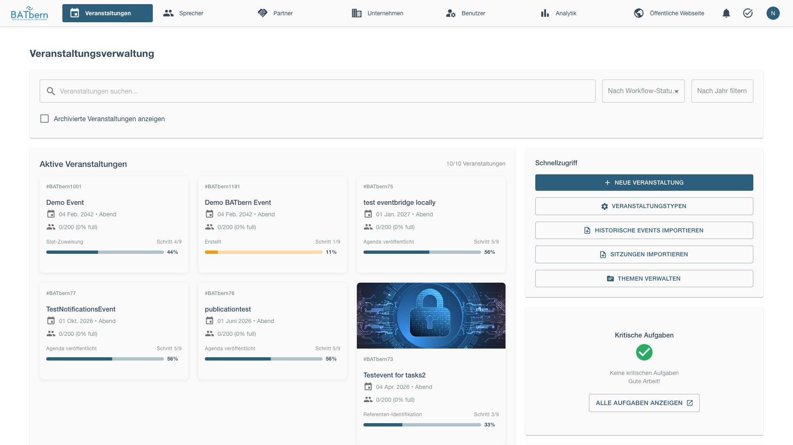
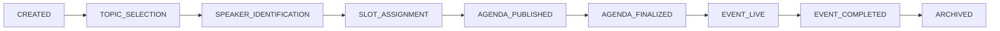

# Event Management

> Plan and coordinate BATbern conferences

<span class="feature-status implemented">Implemented</span>

## Overview

Events are BATbern conferences - the central entity that organizes all other platform activities. Each event represents a single conference occurrence (e.g., "BATbern 2025") with its own timeline, speakers, sessions, and partners.

## Event Types

<span class="feature-status implemented">Implemented</span>

BATbern supports 3 distinct event formats:

### 🌞 Full-Day Conference

<span style="background: #2C5F7C; color: white; padding: 4px 12px; border-radius: 12px; font-weight: 500;">FULL_DAY</span>

**Duration**: 8+ hours (e.g., 9:00 - 18:00)

**Typical Structure**:
- Morning keynote
- Multiple parallel tracks
- Lunch break
- Afternoon workshops
- Evening networking reception

**Sessions**: 8-12 presentations
**Speakers**: 10-15 speakers
**Capacity**: 200-500 attendees

**Best For**: Annual flagship conferences

### 🌤️ Afternoon Workshop

<span style="background: #4A90B8; color: white; padding: 4px 12px; border-radius: 12px; font-weight: 500;">AFTERNOON</span>

**Duration**: 3-4 hours (e.g., 14:00 - 18:00)

**Typical Structure**:
- Introduction
- 2-3 focused presentations
- Q&A and discussion
- Networking coffee

**Sessions**: 2-4 presentations
**Speakers**: 3-5 speakers
**Capacity**: 50-100 attendees

**Best For**: Specialized topics, workshops, training

### 🌙 Evening Lecture

<span style="background: #E67E22; color: white; padding: 4px 12px; border-radius: 12px; font-weight: 500;">EVENING</span>

**Duration**: 2-3 hours (e.g., 18:00 - 21:00)

**Typical Structure**:
- Welcome reception
- Keynote presentation
- Panel discussion or Q&A
- Networking drinks

**Sessions**: 1-2 presentations
**Speakers**: 1-3 speakers
**Capacity**: 30-80 attendees

**Best For**: Guest speakers, networking events, launch events

## Creating an Event

<div class="step" data-step="1">

**Navigate to Events**

Click **📅 Events** in the left sidebar.
</div>

<div class="step" data-step="2">

**Click "Create New Event"**

Click the **+ Create New Event** button (top-right).
</div>

<div class="step" data-step="3">

**Fill Event Details**

Complete the event creation form:

**Basic Information**:
- **Event Name*** - Unique name (e.g., "BATbern 2025")
- **Event Code*** - Auto-generated public identifier (e.g., "BAT-2025-001") - used in URLs and QR codes
- **Event Type*** - Select: Full-Day, Afternoon, or Evening
- **Description** - Event overview (optional, supports Markdown)
- **Max Attendees** - Registration capacity limit (optional)
- **Waitlist Enabled** - Allow waitlist when capacity reached

**Timeline**:
- **Event Date*** - Main conference date
- **Event Time*** - Start and end times
- **Registration Opens*** - When attendees can register
- **Registration Closes*** - Registration deadline

**Location**:
- **Venue Name** - Location name (e.g., "Kursaal Bern")
- **Address** - Full street address
- **City*** - Bern or other Swiss city
- **Canton** - Swiss canton (BE, ZH, etc.)
- **Postal Code** - Swiss postal code

**Publishing Settings**:
- **Auto-publish Speakers** - Automatically publish speaker profiles 30 days before event (default: enabled)
- **Auto-publish Agenda** - Automatically publish full agenda 14 days before event (default: enabled)
- **Auto-transition to Live** - Automatically transition to EVENT_LIVE state on event day (default: enabled)
- **Auto-transition to Completed** - Automatically transition to EVENT_COMPLETED state after event ends (default: enabled)

</div>

<div class="step" data-step="4">

**Save**

Click **Save** to create the event.

Event is created with initial state: **CREATED**

Success message: "Event 'BATbern 2025' created successfully. Ready to begin workflow."



</div>

## Event Workflow States

<span class="feature-status implemented">Implemented</span>

Events progress through a **9-state workflow** that tracks the high-level event lifecycle.

### State Machine Overview



### State Descriptions

| State | Description | How Reached |
|-------|-------------|-------------|
| **CREATED** | Event record created | Event creation form submitted |
| **TOPIC_SELECTION** | Topics chosen using heat map | Minimum 1 topic selected |
| **SPEAKER_IDENTIFICATION** | Building speaker pool, outreach ongoing | Minimum speaker candidates identified |
| **SLOT_ASSIGNMENT** | Assigning speakers to time slots | All confirmed speakers assigned |
| **AGENDA_PUBLISHED** | Public agenda live, accepting registrations | Publish agenda action |
| **AGENDA_FINALIZED** | Agenda locked for printing | Manual finalization (2 weeks before) |
| **EVENT_LIVE** | Event currently happening | Event day arrives |
| **EVENT_COMPLETED** | Event finished, post-processing | Manual transition after event |
| **ARCHIVED** | Event archived for historical reference | Manual archival action |

**Note**: Speakers progress through their own independent workflow (identified → contacted → ready → accepted → content_submitted → quality_reviewed → confirmed) in parallel with the event workflow.

See [Workflow System](../workflow/README.md) for complete workflow documentation.

## Event Timeline Management

### Date & Time Fields

**Event Date & Time**:
- Primary conference date and time
- Used for countdown timers
- Displayed on event landing pages

**Registration Window**:
- **Registration Opens**: When public can register
- **Registration Closes**: Cutoff for new registrations
- Automatic validation: `Opens` must be before `Closes`

**Recommended Lead Time**:
- Full-Day: 3-4 months advance registration
- Afternoon: 4-6 weeks advance registration
- Evening: 2-4 weeks advance registration

### Timeline Validation

The system validates timeline logic:

```
Registration Opens: 2025-01-15
Registration Closes: 2025-03-10
Event Date: 2025-03-15

✅ Valid timeline
```

```
Registration Opens: 2025-03-01
Registration Closes: 2025-02-28  ❌ Error
Event Date: 2025-03-15

Error: Registration closes before it opens
```

```
Registration Opens: 2025-01-15
Registration Closes: 2025-03-20  ❌ Error
Event Date: 2025-03-15

Error: Registration closes after event date
```

## Event Sessions

<span class="feature-status implemented">Implemented</span>

Events contain **sessions** - individual presentations or activities.

### Session Structure

Each session has:
- **Topic** - Subject matter (selected in Phase A)
- **Title** - Specific presentation title
- **Speaker(s)** - One or more presenters
- **Time Slot** - Scheduled time (assigned in Phase D)
- **Description** - Session overview (≤1000 chars)
- **Track** - Parallel track (for multi-track events)

### Session Types

**Main Presentations**:
- 45-60 minute talks
- Single speaker or panel

**Workshops**:
- 90-120 minute interactive sessions
- Multiple facilitators

**Keynotes**:
- 60-90 minute flagship presentations
- Prominent speakers

**Networking**:
- Break periods
- Coffee, lunch, reception

### Managing Sessions

Sessions are managed throughout the workflow:

1. **Phase A (Setup)**: Topics selected (becomes session topics), speakers brainstormed
2. **Phase B (Outreach)**: Speakers contacted and accept invitations
3. **Phase B (Content)**: Speakers submit presentation titles and content
4. **Phase C (Quality)**: Content reviewed and approved
5. **Phase D (Assignment)**: Sessions assigned to time slots, agenda published

See [Phase D: Assignment](../workflow/phase-d-assignment.md) for session slot assignment details.

## Event Speakers

### Speaker Assignment

Speakers are linked to events through sessions:

```
Event: BATbern 2025
├─ Session 1: Sustainable Building Materials
│  └─ Speaker: Hans Müller (Müller Architekten AG)
├─ Session 2: Digital Transformation
│  └─ Speaker: Anna Schmidt (Schmidt & Partner)
└─ Session 3: Urban Planning
   └─ Speakers: Peter Meier, Lisa Weber (Panel)
```

### Speaker Status Tracking

<span class="feature-status implemented">Implemented</span>

Each speaker progresses through their own workflow independently:

| Status | Description | Next Action |
|--------|-------------|-------------|
| **identified** | Potential speaker brainstormed | Contact speaker |
| **contacted** | Initial outreach recorded | Await response |
| **ready** | Speaker ready to accept/decline | Get acceptance |
| **accepted** | Speaker committed to presenting | Collect content |
| **declined** | Speaker not available | Contact backup |
| **content_submitted** | Presentation details submitted | Review quality |
| **quality_reviewed** | Content approved by organizer | Assign time slot |
| **confirmed** | Quality reviewed AND slot assigned | Ready for publication |
| **overflow** | Accepted but no slot available | Backup speaker |
| **withdrew** | Speaker dropped out after accepting | Find replacement |

**Note**: Speakers reach **confirmed** automatically when both quality_reviewed AND session.startTime exist (can happen in any order).

See [Phase B: Outreach](../workflow/phase-b-outreach.md) for speaker tracking details.

## Event Partners

<span class="feature-status implemented">Implemented</span>

Events can have **partners** - organizations providing sponsorship or collaboration.

### Partner Tiers

Partners are assigned tiers based on contribution level:

- 💎 **Diamond** - Highest tier, prominent placement
- 🥈 **Platinum** - Premium tier
- 🥇 **Gold** - Standard sponsorship
- 🥈 **Silver** - Supporting sponsorship
- 🥉 **Bronze** - Basic sponsorship

### Partner Benefits

Partners receive:
- Logo placement on event materials
- Booth/table at event venue
- Attendee list access (GDPR compliant)
- Speaking opportunities (higher tiers)
- Meeting coordination with attendees

See [Partner Management](partners.md) for details.

## Viewing Event Details

Event detail view shows comprehensive information:

### Tabs

**General**:
- Basic information (name, type, description)
- Timeline (dates, registration window)
- Location and venue

**Sessions** <span class="feature-status implemented">Implemented</span>:
- List of all sessions
- Session schedule (timeline view)
- Speaker assignments

**Speakers** <span class="feature-status in-progress">In Progress</span>:
- List of confirmed speakers
- Speaker status (IDENTIFIED → CONFIRMED)
- Contact history

**Partners** <span class="feature-status implemented">Implemented</span>:
- List of event partners
- Partner tier badges
- Meeting coordination

**Attendees** <span class="feature-status planned">Planned</span>:
- Registration list
- Attendance tracking
- Check-in status

**Analytics** <span class="feature-status planned">Planned</span>:
- Registration funnel
- Speaker engagement
- Attendee demographics

## Editing an Event

<div class="step" data-step="1">

**Find the Event**

Search or browse the event list.
</div>

<div class="step" data-step="2">

**Click Edit**

Click **📝 Edit** icon in event row.
</div>

<div class="step" data-step="3">

**Modify Fields**

Update event information. Note:
- Event type can be changed (affects session structure)
- Timeline dates can be adjusted (with validation)
- Workflow state cannot be manually changed (use workflow)

</div>

<div class="step" data-step="4">

**Save Changes**

Click **Save Changes** to persist updates.
</div>

## Deleting an Event

<div class="alert error">
❌ <strong>Caution:</strong> Deleting an event removes all associated sessions, speaker assignments, and registrations. This action cannot be undone.
</div>

<div class="step" data-step="1">

**Click Delete**

Click **🗑️ Delete** icon in event row.
</div>

<div class="step" data-step="2">

**Confirm Deletion**

```
Delete Event?
────────────────────────────────────
Delete "BATbern 2025"?

This will permanently delete:
- 8 sessions
- 12 speaker assignments
- 237 attendee registrations
- Event timeline and data

This action CANNOT be undone.

[Cancel]           [Delete]
```

Type event name to confirm: `BATbern 2025`

Click **Delete** to confirm.
</div>

## Resource Expansion

<span class="feature-status implemented">Implemented</span>

Optimize API requests by expanding related entities:

```
GET /api/events/123?expand=speakers,partners,sessions

{
  "id": "123",
  "name": "BATbern 2025",
  "eventType": "FULL_DAY",
  "eventDate": "2025-03-15",
  "speakers": [
    { "id": "456", "name": "Hans Müller", "status": "CONFIRMED" },
    { "id": "789", "name": "Anna Schmidt", "status": "CONFIRMED" }
  ],
  "sessions": [
    { "id": "101", "topic": "Sustainable Building", "speaker": "456" }
  ],
  "partners": [
    { "id": "202", "name": "Partner AG", "tier": "GOLD" }
  ]
}
```

Returns event with all related data in a single request.

## Event Dashboard Widget

<span class="feature-status implemented">Implemented</span>

Active events appear as cards on the organizer dashboard:

```
┌────────────────────────────────────────┐
│ BATbern 2025                           │
│ [FULL_DAY] [SPEAKERS_IDENTIFIED]       │
├────────────────────────────────────────┤
│ 📅 March 15, 2025                      │
│ ⏰ 45 days until event                 │
│ 🎤 8 of 12 speakers confirmed          │
│ 🎫 237 registrations (of 500)          │
├────────────────────────────────────────┤
│ [Continue Workflow] [View Details]     │
└────────────────────────────────────────┘
```

Click **Continue Workflow** to jump to the current workflow step.

## Common Issues

### "Registration opens after event date"

**Problem**: Invalid timeline configuration.

**Solution**:
- Ensure Registration Opens < Registration Closes < Event Date
- Adjust dates to maintain logical sequence

### "Cannot change event type after sessions created"

**Problem**: Changing event type affects session structure.

**Solution**:
- Delete existing sessions first (if needed)
- Or create a new event with the correct type
- Contact support if you need to migrate sessions

### "Event stuck in CREATED state"

**Problem**: Event not progressing through workflow.

**Solution**:
- Navigate to the event in Phase A workflow
- Select topics to advance to TOPIC_SELECTION state
- Add speaker candidates to reach SPEAKER_IDENTIFICATION
- See [Workflow System](../workflow/README.md)

## Related Topics

- [Workflow System →](../workflow/README.md) - 9-state event workflow, per-speaker workflow, task system
- [Phase A: Setup →](../workflow/phase-a-setup.md) - Event creation and initial configuration
- [Speaker Management →](speakers.md) - Manage event speakers
- [Partner Management →](partners.md) - Coordinate event partners
- [Topic Heat Map →](../features/heat-maps.md) - Select event topics

## API Reference

### Endpoints

```
POST   /api/events                 Create event
GET    /api/events                 List events (paginated)
GET    /api/events/{id}            Get event by ID
PUT    /api/events/{id}            Update event
DELETE /api/events/{id}            Delete event
GET    /api/events/{id}/sessions   Get event sessions
GET    /api/events/{id}/speakers   Get event speakers
GET    /api/events/{id}/partners   Get event partners
POST   /api/events/{id}/workflow   Advance workflow state
```

See [API Documentation](../../api/) for complete specifications.
