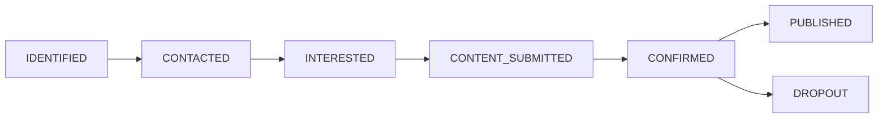

# Speaker Management

> Manage speaker profiles and session assignments

<span class="feature-status in-progress">In Progress</span>

## Overview

Speakers are architecture professionals who present at BATbern conferences. Each speaker has a profile containing biographical information, expertise areas, and contact details. Speakers progress through defined status states from initial identification through confirmed participation.

## Speaker Profiles

### Profile Components

**Personal Information**:
- First Name, Last Name
- Professional headshot (photo upload)
- Email, Phone
- LinkedIn profile (optional)

**Professional Details**:
- Company affiliation
- Job title
- Years of experience
- Professional biography (≤500 characters)

**Expertise**:
- Primary topics (e.g., "Sustainable Building", "Digital Transformation")
- Secondary topics (related interests)
- Languages spoken (German, French, Italian, English)

**Presentation History**:
- Past BATbern presentations
- External speaking engagements
- Publications and awards

## Creating a Speaker

<div class="step" data-step="1">

**Navigate to Speakers**

Click **🎤 Speakers** in the left sidebar.
</div>

<div class="step" data-step="2">

**Click "Create New Speaker"**

Click the **+ Create New Speaker** button (top-right).
</div>

<div class="step" data-step="3">

**Fill Speaker Details**

Complete the speaker creation form:

**Basic Information**:
- **First Name*** - Given name
- **Last Name*** - Family name
- **Email*** - Contact email
- **Phone** - Contact number

**Professional Profile**:
- **Company** - Select from autocomplete (optional)
- **Job Title** - Current position
- **Biography** - Professional summary (≤500 characters)

**Expertise**:
- **Primary Topics*** - Main areas of expertise (select 1-3)
- **Secondary Topics** - Related interests (optional)
- **Languages** - Spoken languages for presentations

**Visual Assets**:
- **Headshot** - Professional photo (PNG, JPG, max 2MB)

</div>

<div class="step" data-step="4">

**Save**

Click **Save** to create the speaker profile.

Speaker is created with initial status: **IDENTIFIED**
</div>

## Speaker Status States

<span class="feature-status implemented">Implemented</span>

Speakers progress through defined status states managed by the **16-step workflow**.

### Status Flow



### Status Descriptions

| Status | Description | Organizer Actions |
|--------|-------------|-------------------|
| **IDENTIFIED** | Potential speaker brainstormed | Send initial outreach |
| **CONTACTED** | Outreach email sent | Await response |
| **INTERESTED** | Speaker expressed interest | Provide content guidelines |
| **CONTENT_SUBMITTED** | Speaker submitted presentation details | Review content quality |
| **CONFIRMED** | Speaker confirmed for event | Assign time slot |
| **PUBLISHED** | Speaker visible on public agenda | Monitor for changes |
| **DROPOUT** | Speaker withdrew participation | Find replacement |

### Status Transitions

Status advances through workflow phases:

- **Phase A: Setup** - IDENTIFIED
- **Phase B: Outreach** - IDENTIFIED → CONTACTED → INTERESTED → CONTENT_SUBMITTED
- **Phase C: Quality** - Review content at CONTENT_SUBMITTED
- **Phase D: Assignment** - CONTENT_SUBMITTED → CONFIRMED (after slot assignment)
- **Phase E: Publishing** - CONFIRMED → PUBLISHED
- **Any Phase** - Any status → DROPOUT (if speaker withdraws)

See [16-Step Workflow](../workflow/README.md) for complete workflow documentation.

## Content Collection

<span class="feature-status in-progress">In Progress</span>

Speakers submit presentation content during **Phase B: Outreach**.

### Content Requirements

**Mandatory Fields**:
- **Presentation Title*** - Specific session title (≤100 characters)
- **Abstract*** - Session description (≤1000 characters)
- **Learning Objectives** - What attendees will learn (3-5 bullets)

**Optional Fields**:
- **Supporting Materials** - Slides, handouts, references (PDF upload)
- **Prerequisites** - Required attendee knowledge
- **Target Audience** - Who should attend (Beginners, Intermediate, Advanced)

### Character Limit Validation

Abstract field enforces 1000-character limit:

```
Abstract *
[Your presentation description here...     ]

Characters: 287 / 1000 ✅
```

```
Abstract *
[Very long text that exceeds the limit... ]

Characters: 1042 / 1000 ❌
Error: Abstract must be 1000 characters or less
```

### Content Review

Content is reviewed during **Phase C: Quality Control**:

1. **Organizer reviews content** for:
   - Relevance to event theme
   - Quality and clarity
   - Originality
   - Audience fit

2. **Feedback provided** if revisions needed:
   - Speaker receives comments
   - Speaker revises and resubmits
   - Status remains CONTENT_SUBMITTED until approved

3. **Content approved**:
   - Status advances to CONFIRMED
   - Speaker ready for slot assignment

See [Phase C: Quality Review](../workflow/phase-c-quality.md) for details.

## Outreach Tracking

<span class="feature-status implemented">Implemented</span>

Track all speaker communications during outreach phase.

### Contact History

```
Contact History - Hans Müller
────────────────────────────────────
2025-02-15 14:23 | Email Sent
Subject: "Invitation to speak at BATbern 2025"
Status: CONTACTED

2025-02-18 09:45 | Response Received
"Yes, interested in presenting on sustainable materials"
Status: INTERESTED

2025-02-20 16:30 | Content Reminder Sent
Subject: "Content submission deadline: March 1"

2025-02-28 11:15 | Content Received
Title: "Innovations in Sustainable Building Materials"
Status: CONTENT_SUBMITTED
```

### Outreach Templates

<span class="feature-status planned">Planned</span>

Pre-built email templates for common communications:

**Initial Invitation**:
```
Subject: Invitation to speak at BATbern 2025

Dear {{speaker_name}},

We are planning BATbern 2025 and would like to invite you
to present on "{{topic}}".

Event Details:
- Date: {{event_date}}
- Type: {{event_type}}
- Audience: {{expected_attendees}} architects

Are you interested? Please let us know by {{response_deadline}}.

Best regards,
{{organizer_name}}
```

**Content Request**:
```
Subject: Content submission for BATbern 2025

Dear {{speaker_name}},

Thank you for confirming your participation! Please submit:

- Presentation title (≤100 characters)
- Abstract (≤1000 characters)
- 3-5 learning objectives

Deadline: {{content_deadline}}

Submit via: {{submission_link}}

Looking forward to your presentation!
```

See [Phase B: Outreach](../workflow/phase-b-outreach.md) for outreach management details.

## Session Assignment

<span class="feature-status planned">Planned</span>

Confirmed speakers are assigned to event time slots during **Phase D: Assignment**.

### Slot Assignment Interface

Drag-and-drop interface for assigning speakers to slots:

```
BATbern 2025 - March 15, 2025
──────────────────────────────────────────

Morning Track A         | Morning Track B
────────────────────────────────────────
09:00-09:45            | 09:00-09:45
[Drag speaker here]     | [Hans Müller]
                        | Sustainable Materials

10:00-10:45            | 10:00-10:45
[Anna Schmidt]         | [Drag speaker here]
Digital Architecture    |
```

### Assignment Constraints

System enforces constraints:
- ✅ **No double-booking**: Speaker can't be in two slots simultaneously
- ✅ **Break enforcement**: Minimum 15-minute gap between speaker's sessions
- ✅ **Availability check**: Speakers can mark unavailable time slots
- ❌ **Conflict warnings**: Flag potential scheduling conflicts

See [Phase D: Assignment](../workflow/phase-d-assignment.md) for details.

## Speaker Directory

<span class="feature-status planned">Planned</span>

Public-facing speaker directory showcases confirmed speakers.

### Directory Display

```
BATbern 2025 Speakers
────────────────────────────────────────

[Photo]  Hans Müller
         Müller Architekten AG
         Senior Architect

         "Innovations in Sustainable Building Materials"

         Expert in sustainable design with 15 years experience.
         Previous speaker at BATbern 2022, 2023.

         [View Session Details]

────────────────────────────────────────

[Photo]  Anna Schmidt
         Schmidt & Partner
         Digital Innovation Lead

         "Digital Transformation in Architecture"

         Leading digital initiatives in architectural practice.

         [View Session Details]
```

## Editing a Speaker

<div class="step" data-step="1">

**Find the Speaker**

Search or browse the speaker list.
</div>

<div class="step" data-step="2">

**Click Edit**

Click **📝 Edit** icon in speaker row.
</div>

<div class="step" data-step="3">

**Modify Fields**

Update speaker information. Note:
- Email cannot be changed (linked to user account)
- Status should be changed through workflow (not manually)
- Content can be edited at any time

</div>

<div class="step" data-step="4">

**Save Changes**

Click **Save Changes** to persist updates.
</div>

## Handling Speaker Dropouts

<span class="feature-status planned">Planned</span>

If a speaker withdraws participation:

<div class="step" data-step="1">

**Mark as Dropout**

Change speaker status to **DROPOUT**.
</div>

<div class="step" data-step="2">

**Document Reason**

Add note explaining withdrawal:
- Schedule conflict
- Personal reasons
- Company policy
- Health issues
</div>

<div class="step" data-step="3">

**Find Replacement**

Options:
- **Promote backup speaker** from identified list
- **Reassign session** to confirmed speaker (if compatible topic)
- **Cancel session** and adjust agenda

</div>

<div class="step" data-step="4">

**Update Agenda**

If event already published:
- Update public agenda
- Send notification to registered attendees
- Update printed materials if time permits

</div>

See [Phase E: Finalization](../workflow/phase-e-publishing.md) for dropout handling.

## Searching Speakers

### Quick Search

```
🔍 [Müller]
```

Searches across:
- First name, Last name
- Company name
- Topics/expertise

### Filter by Status

```
status:CONFIRMED
```

```
status:CONTACTED,INTERESTED
```

### Filter by Topic

```
topic:Sustainable Building
```

## Common Issues

### "Speaker stuck in CONTACTED status"

**Problem**: Speaker contacted but no response received.

**Solution**:
- Send follow-up reminder (after 3-5 days)
- Try alternative contact method (phone instead of email)
- Move to backup speaker if deadline approaching
- Update status to DROPOUT if no response after 2 reminders

### "Content exceeds 1000 characters"

**Problem**: Speaker submitted abstract longer than limit.

**Solution**:
- Request speaker to revise and shorten
- Provide editing suggestions
- Emphasize need for concise, focused abstracts
- Offer to help edit if language barrier

### "Speaker has scheduling conflict after confirmation"

**Problem**: Confirmed speaker can't attend assigned time slot.

**Solution**:
- Check if alternative slot available
- Swap with another speaker if possible
- If no alternatives, may need to mark as DROPOUT
- Communicate changes promptly

## Related Topics

- [Phase B: Outreach →](../workflow/phase-b-outreach.md) - Speaker outreach process
- [Phase C: Quality →](../workflow/phase-c-quality.md) - Content review
- [Phase D: Assignment →](../workflow/phase-d-assignment.md) - Slot assignment
- [User Management →](users.md) - Link speakers to user accounts
- [Event Management →](events.md) - Event sessions and speakers

## API Reference

### Endpoints

```
POST   /api/speakers               Create speaker
GET    /api/speakers               List speakers (paginated)
GET    /api/speakers/{id}          Get speaker by ID
PUT    /api/speakers/{id}          Update speaker
DELETE /api/speakers/{id}          Delete speaker
PUT    /api/speakers/{id}/status   Update speaker status
POST   /api/speakers/{id}/content  Submit presentation content
POST   /api/speakers/{id}/photo    Request presigned URL for headshot upload
```

See [API Documentation](../../api/) for complete specifications.
