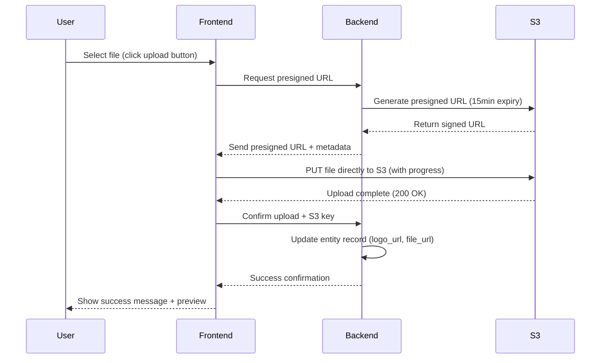

# File Uploads `[IMPLEMENTED]`

## Overview

The BATbern file upload system provides secure, direct-to-S3 file handling for:

- **Company Logos** - Brand images for partner directories and event materials
- **Speaker Materials** - Presentation slides, handouts, and supporting documents
- **Event Assets** - Venue maps, promotional images, sponsor materials `[PLANNED]`

The system uses **presigned S3 URLs** to enable secure, direct browser-to-cloud uploads without proxying files through the backend, ensuring:

- ✅ **Fast uploads** - No server bottleneck, files go directly to AWS S3
- ✅ **Security** - Time-limited, permission-scoped URLs prevent unauthorized access
- ✅ **Scalability** - No backend load, handles concurrent uploads efficiently
- ✅ **Reliability** - Automatic retry logic and progress tracking

## When to Use This Feature

### Primary Use Cases

1. **Company Logos (Entity Management)**
   - Upload company brand logos for partner directory
   - Display in event materials and website
   - Typical size: 100KB - 500KB
   - Formats: PNG, JPG, SVG

2. **Speaker Materials (Workflow Step 6)**
   - Collect presentation slides during content collection phase
   - Store handouts for attendee access `[PLANNED]`
   - Typical size: 2MB - 10MB
   - Formats: PDF, PPTX, KEY (converted to PDF)

3. **Event Assets `[PLANNED]`**
   - Venue floor plans and seating charts
   - Promotional images for event marketing
   - Sponsor logos and materials
   - Typical size: 500KB - 5MB
   - Formats: PDF, PNG, JPG

### File Size Limits

| File Type | Maximum Size | Recommended Size | Rationale |
|-----------|--------------|------------------|-----------|
| Company Logos | 5 MB | 200-500 KB | Web display optimization |
| Presentation Slides | 25 MB | 5-10 MB | Standard slide deck sizes |
| Handouts/Documents | 10 MB | 2-5 MB | Download speed optimization |
| Event Images | 5 MB | 1-2 MB | Web/email use |

## How It Works

### Upload Flow (Technical)



### Step-by-Step: Uploading a Company Logo

1. **Navigate to Company Profile**
   - Dashboard → Companies → Select company → Edit
   - Scroll to "Company Logo" section

2. **Initiate Upload**
   - Click "Upload Logo" button
   - File picker opens

3. **Select File**
   - Choose PNG, JPG, or SVG file
   - File is validated client-side:
     - ✅ Format check (accepted types only)
     - ✅ Size check (max 5 MB)
     - ✅ Image dimension check (min 200x200px, recommended 800x800px)

4. **Upload Progress**
   - Progress bar shows upload percentage
   - Real-time speed indicator (e.g., "2.3 MB/s")
   - Cancel button available during upload

5. **Preview & Confirm**
   - Thumbnail preview appears after upload
   - Click "Confirm" to finalize, or "Replace" to upload different file
   - Save company profile to persist changes

**Example Timeline**:
```
00:00 - User clicks "Upload Logo"
00:01 - File selected (500 KB PNG)
00:02 - Client validation passes
00:03 - Presigned URL requested from backend
00:04 - Direct S3 upload begins
00:06 - Upload completes (500 KB in 2 seconds)
00:07 - Preview displayed, waiting for confirmation
00:08 - User clicks "Confirm"
00:09 - Backend updates company record
00:10 - Success message: "Company logo uploaded successfully"
```

### Step-by-Step: Uploading Speaker Materials (Workflow Step 6)

1. **Navigate to Content Collection**
   - Dashboard → Events → Select event → Step 6: Content Collection
   - View list of speakers with "Pending Material" status

2. **Select Speaker**
   - Click speaker name or "Upload Materials" button
   - Speaker materials upload form opens

3. **Upload Presentation**
   - Drag & drop PDF/PPTX file, or click "Choose File"
   - File validated:
     - ✅ Format: PDF, PPTX, KEY (max 25 MB)
     - ✅ Slide count check (recommended 10-30 slides)

4. **Add Metadata `[OPTIONAL]`**
   - Presentation title (defaults to speaker name + event)
   - Description or abstract
   - Tags (e.g., "Technical", "Case Study", "Introduction")

5. **Upload & Process**
   - Direct S3 upload with progress tracking
   - PPTX/KEY files auto-convert to PDF for consistency `[PLANNED]`
   - Preview generated for verification

6. **Confirmation**
   - Speaker status updates to "Material Submitted"
   - Notification sent to speaker confirming receipt
   - File available for organizer review and attendee distribution

### Supported File Formats

| Category | Formats | Auto-Conversion | Notes |
|----------|---------|-----------------|-------|
| **Images** | PNG, JPG, JPEG, SVG | SVG → PNG (for previews) | Recommended for logos |
| **Presentations** | PDF, PPTX, KEY | PPTX/KEY → PDF `[PLANNED]` | Primary speaker content |
| **Documents** | PDF, DOCX `[PLANNED]` | DOCX → PDF `[PLANNED]` | Handouts and references |
| **Archives** | ZIP `[PLANNED]` | Extract and validate | Bulk material submission |

### Validation Rules

#### Client-Side Validation (Immediate Feedback)

- **File Type**: Check extension against allowed formats
- **File Size**: Verify within category limits
- **Image Dimensions**: Min 200x200px for logos, max 5000x5000px
- **Filename**: Sanitize (remove special characters, limit length)

#### Server-Side Validation (Before Generating Presigned URL)

- **User Permissions**: Verify organizer role and entity ownership
- **File Type**: Re-validate MIME type (prevents extension spoofing)
- **Virus Scan**: Check file hash against known malware signatures `[PLANNED]`
- **Quota Check**: Ensure user/org hasn't exceeded storage limits `[PLANNED]`

#### Post-Upload Validation (After S3 Upload)

- **File Integrity**: Verify file size matches expected
- **Image Processing**: Generate thumbnails, validate image format
- **Content Scan**: OCR and content validation for PDFs `[PLANNED]`

## Tips & Best Practices

### Optimizing File Sizes

1. **Company Logos**
   - Export as PNG with transparency (for flexible backgrounds)
   - Use web-optimized export (72 DPI, sRGB color space)
   - Compress with tools like TinyPNG (can reduce size by 60-80%)
   - Recommended dimensions: 800x800px (displays well at all sizes)

2. **Presentation Slides**
   - Export from PowerPoint as PDF (reduces size by 40-60%)
   - Compress embedded images before adding to slides
   - Avoid video embeds (link to external hosting instead)
   - Use web fonts (avoid embedding custom fonts)

3. **General Tips**
   - Upload during off-peak hours for faster speeds
   - Use wired connection for large files (>10 MB)
   - Close other bandwidth-intensive apps during upload

### Organizing Uploaded Files

1. **Naming Conventions**
   - Company Logos: `CompanyName_Logo_v1.png`
   - Speaker Materials: `SpeakerLastName_Event45_Presentation.pdf`
   - Event Assets: `Event45_VenueMap_Floor2.pdf`

2. **Version Control**
   - Platform auto-versions files (e.g., `file_v2.pdf`)
   - Access previous versions: File → History → Select version
   - Compare versions side-by-side for presentations `[PLANNED]`

3. **Bulk Operations**
   - Upload multiple files at once (drag & drop multiple)
   - Queue uploads (system processes sequentially)
   - Retry failed uploads automatically (3 attempts)

### Security Best Practices

1. **Never Upload Sensitive Data**
   - ❌ Personal information (passwords, SSNs, financial data)
   - ❌ Confidential business information
   - ❌ Copyright-protected materials without permission

2. **Review Before Sharing**
   - Check PDF metadata (author, company, edit history)
   - Remove comments and tracked changes from PowerPoint
   - Strip EXIF data from photos (location, camera info)

3. **Access Control**
   - Uploaded logos are publicly accessible (partner directory)
   - Speaker materials are restricted to organizers + attendees
   - Event assets access configurable per file `[PLANNED]`

## Troubleshooting

### Common Issues

#### "Upload failed: File too large"

**Cause**: File exceeds category maximum (5 MB for logos, 25 MB for presentations)

**Solutions**:
1. Compress the file using online tools (PDF: Smallpdf, Images: TinyPNG)
2. For presentations, export as PDF instead of PPTX (smaller size)
3. For images, reduce dimensions to recommended size (800x800px for logos)
4. Split large documents into multiple files if necessary

#### "Invalid file type"

**Cause**: File format not supported for this category

**Solutions**:
1. Convert file to supported format:
   - Images: Convert to PNG or JPG
   - Presentations: Export as PDF (universally accepted)
2. Check file extension matches actual file type (e.g., not a PDF renamed to .png)
3. Review [Supported File Formats](#supported-file-formats) section

#### "Upload stuck at X%"

**Possible Causes**:
- Network interruption
- Browser issue (memory, extensions)
- Presigned URL expired (15-minute limit)

**Solutions**:
1. Wait 30 seconds (may resume automatically)
2. Click "Cancel" and retry upload (generates new presigned URL)
3. Clear browser cache and cookies
4. Try different browser (Chrome recommended)
5. Check network stability (try smaller file first)

#### "Upload completed but file not showing"

**Possible Causes**:
- Backend confirmation failed
- Browser didn't send completion signal
- File processing delay (large files)

**Solutions**:
1. Refresh page (file may have uploaded successfully)
2. Check "Recent Uploads" section (files listed even if not associated yet)
3. Wait 2-3 minutes for processing (progress shown in background)
4. Re-upload if still not appearing after 5 minutes

#### "Poor upload speed (very slow)"

**Causes**:
- Network congestion
- Large file size
- Server-side rate limiting (many concurrent uploads)

**Solutions**:
1. Compress file to reduce size (see optimization tips)
2. Upload during off-peak hours (early morning, late evening)
3. Use wired Ethernet connection instead of WiFi
4. Close other bandwidth-heavy apps (streaming, downloads)
5. Check with IT if corporate firewall is throttling uploads

### Error Messages Explained

| Error Message | Meaning | Action |
|---------------|---------|--------|
| `INVALID_FILE_TYPE` | File format not allowed | Convert to supported format |
| `FILE_TOO_LARGE` | Exceeds size limit | Compress or split file |
| `UPLOAD_EXPIRED` | Presigned URL expired (>15 min) | Retry upload (new URL generated) |
| `PERMISSION_DENIED` | User lacks upload permission | Verify organizer role, contact admin |
| `STORAGE_QUOTA_EXCEEDED` | Organization storage limit reached `[PLANNED]` | Contact admin to increase quota |
| `VIRUS_DETECTED` | File failed security scan `[PLANNED]` | Scan file locally, contact support |

## Related Features

- **[Company Management](../entity-management/companies.md#logo-upload)** - Company logo upload workflow
- **[Speaker Materials](../workflow/phase-b-outreach.md#content-collection)** - Speaker content collection
- **[Upload Troubleshooting](../troubleshooting/uploads.md)** - Detailed error resolution

## Technical Details

### Presigned URL Security

**How It Works**:
1. Backend generates time-limited URL (15 minutes)
2. URL includes AWS signature (validates request origin)
3. URL scoped to specific S3 path (prevents directory traversal)
4. HTTPS enforced (encrypted transmission)

**Security Features**:
- Expires after 15 minutes (reduces attack window)
- One-time use (cannot reuse for different file)
- Content-Type validation (prevents MIME confusion attacks)
- CORS restrictions (only batbern.ch origin allowed)

### S3 Bucket Structure

```
batbern-assets-prod/
├── companies/
│   ├── {company-id}/
│   │   ├── logo.png
│   │   └── logo_v1.png (previous version)
├── speakers/
│   ├── {event-id}/
│   │   ├── {speaker-id}/
│   │   │   ├── presentation.pdf
│   │   │   ├── handout.pdf
│   │   │   └── headshot.jpg
└── events/
    ├── {event-id}/
    │   ├── venue_map.pdf
    │   └── promotional_image.jpg
```

### Performance Characteristics

- **Upload Speed**: Limited by user's internet connection (typically 10-50 Mbps)
- **Latency**: <100ms to generate presigned URL
- **Throughput**: 1000+ concurrent uploads supported
- **Storage**: Unlimited (AWS S3 scales automatically)
- **CDN**: CloudFront delivers files with <50ms latency globally

### Accessibility

- **Keyboard Navigation**: Full tab support, Enter to upload, Escape to cancel
- **Screen Readers**: ARIA labels for all upload states
- **Progress Announcements**: Live region updates for screen readers
- **Error Handling**: Clear, actionable error messages

---

**Next**: Learn about [Event Analytics](analytics.md) for performance insights →
