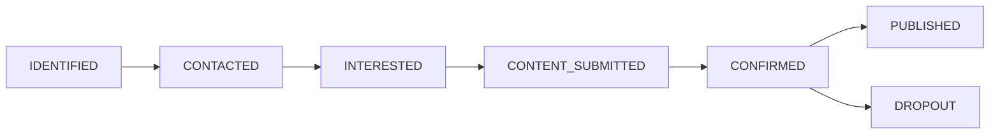

# 16-Step Workflow

> Complete event lifecycle management from concept to archival

<span class="feature-status in-progress">In Progress</span> - Phase A Complete (25%)

## Overview

The **16-Step Workflow** is BATbern's systematic approach to planning and executing successful architecture conferences. This workflow guides organizers through every stage of the event lifecycle, from initial topic selection through post-event archival.

## Workflow Philosophy

The 16-step workflow embodies best practices learned from 20+ years of organizing BATbern conferences:

- **Structured but Flexible** - Clear steps with room for adaptation
- **Quality-Focused** - Multiple review gates ensure high-quality content
- **Speaker-Centric** - Respectful of speaker time and expertise
- **Data-Driven** - Historical data informs topic selection
- **Transparent** - All stakeholders understand current progress

## Workflow Phases

The 16 steps are organized into 6 logical phases:

### Phase A: Setup <span class="feature-status implemented">Implemented</span>

<div class="workflow-phase phase-a">

**Steps 1-3: Event Configuration**

Define event structure, select topics using historical data, and brainstorm potential speakers.

**Duration**: 1-2 weeks
**Key Deliverable**: Event created with topics and speaker candidates identified

[Learn more →](phase-a-setup.md)
</div>

### Phase B: Outreach <span class="feature-status in-progress">In Progress</span>

<div class="workflow-phase phase-b">

**Steps 4-6: Speaker Engagement**

Contact speakers, track status through outreach, and collect presentation content.

**Duration**: 4-6 weeks
**Key Deliverable**: Confirmed speakers with submitted content

[Learn more →](phase-b-outreach.md)
</div>

### Phase C: Quality Control <span class="feature-status planned">Planned</span>

<div class="workflow-phase phase-c">

**Steps 7-8: Content Review**

Review speaker content quality and validate minimum threshold requirements.

**Duration**: 1-2 weeks
**Key Deliverable**: Approved content meeting quality standards

[Learn more →](phase-c-quality.md)
</div>

### Phase D: Assignment <span class="feature-status planned">Planned</span>

<div class="workflow-phase phase-d">

**Steps 9-10: Slot Assignment**

Handle overflow situations with voting and assign speakers to specific time slots.

**Duration**: 1 week
**Key Deliverable**: Complete event schedule with assigned speakers

[Learn more →](phase-d-assignment.md)
</div>

### Phase E: Publishing <span class="feature-status planned">Planned</span>

<div class="workflow-phase phase-e">

**Steps 11-12: Public Release**

Progressively publish event information and finalize agenda handling last-minute changes.

**Duration**: 2-4 weeks
**Key Deliverable**: Public agenda with confirmed speakers and schedule

[Learn more →](phase-e-publishing.md)
</div>

### Phase F: Communication <span class="feature-status planned">Planned</span>

<div class="workflow-phase phase-f">

**Steps 13-16: Execution & Archival**

Send newsletters, assign moderators, coordinate catering, and archive event data.

**Duration**: 2-4 weeks
**Key Deliverable**: Executed event with archived historical data

[Learn more →](phase-f-communication.md)
</div>

## Complete Step Listing

| Step | Name | Phase | Status |
|------|------|-------|--------|
| 1 | Event Type Definition | A | ✅ Implemented |
| 2 | Topic Selection with Heat Map | A | ✅ Implemented |
| 3 | Speaker Brainstorming | A | ✅ Implemented |
| 4 | Speaker Outreach Tracking | B | ✅ Implemented |
| 5 | Speaker Status Management | B | 🔄 In Progress |
| 6 | Speaker Content Collection | B | 🔄 In Progress |
| 7 | Content Quality Review | C | 📋 Planned |
| 8 | Minimum Threshold Validation | C | 📋 Planned |
| 9 | Overflow Management with Voting | D | 📋 Planned |
| 10 | Drag-and-Drop Slot Assignment | D | 📋 Planned |
| 11 | Progressive Publishing | E | 📋 Planned |
| 12 | Finalization with Dropout Handling | E | 📋 Planned |
| 13 | Newsletter Distribution | F | 📋 Planned |
| 14 | Moderator Assignment | F | 📋 Planned |
| 15 | Catering Coordination | F | 📋 Planned |
| 16 | Event Archival | F | 📋 Planned |

## Event Workflow State Machine

<span class="feature-status implemented">Implemented</span>

Events transition through defined states as they progress through the workflow:

```mermaid
graph LR
    A[CREATED] --> B[TOPIC_SELECTED]
    B --> C[SPEAKERS_IDENTIFIED]
    C --> D[OUTREACH_INITIATED]
    D --> E[CONTENT_COLLECTED]
    E --> F[QUALITY_REVIEWED]
    F --> G[SLOTS_ASSIGNED]
    G --> H[PUBLISHED]
    H --> I[FINALIZED]
    I --> J[EXECUTED]
    J --> K[ARCHIVED]
```



### State Mapping to Phases

| Workflow State | Completed Through |
|----------------|-------------------|
| **CREATED** | Event creation (not in workflow) |
| **TOPIC_SELECTED** | Phase A, Step 2 |
| **SPEAKERS_IDENTIFIED** | Phase A, Step 3 |
| **OUTREACH_INITIATED** | Phase B, Step 4 |
| **CONTENT_COLLECTED** | Phase B, Step 6 |
| **QUALITY_REVIEWED** | Phase C, Step 8 |
| **SLOTS_ASSIGNED** | Phase D, Step 10 |
| **PUBLISHED** | Phase E, Step 11 |
| **FINALIZED** | Phase E, Step 12 |
| **EXECUTED** | Manual transition (event day) |
| **ARCHIVED** | Phase F, Step 16 |

## Speaker Workflow State Machine

<span class="feature-status implemented">Implemented</span>

Speakers also transition through states:



Speakers can become **DROPOUT** at any stage if they withdraw participation.

## Starting the Workflow

<div class="step" data-step="1">

**Create Event**

First, create an event record via [Entity Management → Events](../entity-management/events.md).

Event is created with state: **CREATED**
</div>

<div class="step" data-step="2">

**Navigate to Workflow**

From the event list, click **Start Workflow** or open the event detail page and click **Workflow** tab.
</div>

<div class="step" data-step="3">

**Begin Phase A**

Workflow starts at **Step 1: Event Type Definition**.

Follow each step sequentially, completing acceptance criteria before advancing.
</div>

## Workflow Navigation

### Dashboard Workflow Widget

Active events show workflow status on the dashboard:

```
┌────────────────────────────────────────┐
│ BATbern 2025 Workflow                  │
│ [SPEAKERS_IDENTIFIED] Step 3 of 16     │
├────────────────────────────────────────┤
│ Phase A: Setup                    ✅   │
│ ├─ 1. Event Type Definition       ✅   │
│ ├─ 2. Topic Selection             ✅   │
│ └─ 3. Speaker Brainstorming       ✅   │
│                                        │
│ Phase B: Outreach                 🔄   │
│ ├─ 4. Outreach Tracking           ⏳  │
│ ├─ 5. Status Management           ⬜  │
│ └─ 6. Content Collection          ⬜  │
├────────────────────────────────────────┤
│ [Continue to Step 4]                   │
└────────────────────────────────────────┘
```

Click **Continue to Step 4** to advance to the next step.

### Step View

Each step shows:

- **Step Number & Name** - Current step identifier
- **Acceptance Criteria** - Requirements to complete step
- **Actions** - Interactive controls for step tasks
- **Progress Indicator** - Visual progress bar
- **Help Text** - Guidance and best practices

### Navigation Controls

- **Previous Step** - Review completed steps (read-only)
- **Next Step** - Advance after completing criteria (enabled when ready)
- **Save Progress** - Save without advancing (draft state)
- **Back to Dashboard** - Return to event dashboard

## Workflow Checkpoints

The workflow includes quality gates where progress pauses until criteria are met:

### Checkpoint 1: Phase A Complete

**Before Phase B**:
- ✅ Event type defined (Full-Day, Afternoon, or Evening)
- ✅ Topics selected (minimum based on event type)
- ✅ Speaker candidates identified (at least 2× needed speakers)

### Checkpoint 2: Phase B Complete

**Before Phase C**:
- ✅ All speakers contacted
- ✅ Minimum speaker confirmations received
- ✅ All confirmed speakers submitted content

### Checkpoint 3: Phase C Complete

**Before Phase D**:
- ✅ All content reviewed by organizers
- ✅ Quality threshold met (80%+ approval rate)
- ✅ Revisions completed for rejected content

### Checkpoint 4: Phase D Complete

**Before Phase E**:
- ✅ Overflow resolved (if applicable)
- ✅ All sessions assigned to time slots
- ✅ No scheduling conflicts detected

### Checkpoint 5: Phase E Complete

**Before Phase F**:
- ✅ Agenda published publicly
- ✅ All speakers confirmed (no pending dropouts)
- ✅ Finalization complete

## Workflow Flexibility

While the 16 steps provide structure, organizers have flexibility:

### Parallel Tasks

Some steps can be done in parallel:
- **Phase B**: Outreach can continue while collecting content from early responders
- **Phase F**: Newsletter drafting can begin while moderators are being assigned

### Skip Conditions

Some steps may be skipped based on event type:
- **Small Events** (Evening lectures) may skip Step 9 (Overflow Voting)
- **Single-Track Events** may simplify Step 10 (Slot Assignment)

### Rollback Support

<span class="feature-status planned">Planned</span>

If issues arise, organizers can roll back to previous phases:
- **Rollback from Phase C → B**: If content quality issues require more speakers
- **Rollback from Phase E → D**: If major speaker dropout requires rescheduling

Rollback preserves historical data while allowing corrections.

## Best Practices

### Start Early

**Recommended Lead Times**:
- **Full-Day Conference**: 3-4 months before event
- **Afternoon Workshop**: 6-8 weeks before event
- **Evening Lecture**: 4-6 weeks before event

Starting early provides buffer for unexpected delays.

### Maintain Communication

- Send regular updates to speakers (weekly during Phase B)
- Respond to speaker questions within 24-48 hours
- Keep stakeholders informed of progress

### Use Historical Data

The **Topic Heat Map** (Step 2) leverages 20+ years of historical data:
- Popular topics appear in dark blue (frequent)
- Rare topics appear in light blue (infrequent)
- Helps avoid topic fatigue and identify emerging trends

See [Phase A: Setup](phase-a-setup.md) for heat map usage.

### Track Metrics

<span class="feature-status planned">Planned</span>

Monitor key metrics throughout workflow:
- **Speaker Response Rate**: % of contacted speakers who respond
- **Content Approval Rate**: % of submitted content approved first time
- **Dropout Rate**: % of confirmed speakers who withdraw
- **On-Time Completion**: % of steps completed by target date

## Troubleshooting Workflow

### "Stuck at Step X - Can't advance"

**Problem**: Acceptance criteria not met.

**Solution**:
- Review acceptance criteria checklist
- Complete missing requirements
- Contact support if criteria unclear

### "Speaker dropped out after finalization"

**Problem**: Speaker withdrew after Phase E complete.

**Solution**:
- See [Phase E: Dropout Handling](phase-e-publishing.md#handling-dropouts)
- Options: Find replacement, reassign session, cancel session
- Update published agenda promptly

### "Not enough speaker confirmations"

**Problem**: Below minimum threshold for event type.

**Solution**:
- Extend outreach to additional candidates (Step 3)
- Adjust event timeline if needed
- Consider downgrading event type (Full-Day → Afternoon)

See [Troubleshooting Workflow Issues](../troubleshooting/workflow.md) for more solutions.

## Workflow Automation

<span class="feature-status planned">Planned</span>

Future automation features:

- **Auto-Reminders**: Automatic email reminders to speakers at key deadlines
- **Smart Scheduling**: AI-suggested slot assignments based on speaker preferences
- **Conflict Detection**: Automatic detection of speaker double-bookings
- **Progress Notifications**: Alert organizers when checkpoints are reached

## Related Topics

- [Event Management →](../entity-management/events.md) - Create and manage events
- [Speaker Management →](../entity-management/speakers.md) - Speaker profiles and status
- [Topic Heat Map →](../features/heat-maps.md) - Historical topic visualization

## What's Next?

Choose a phase to explore:

1. **[Phase A: Setup →](phase-a-setup.md)** - Start here for new events
2. **[Phase B: Outreach →](phase-b-outreach.md)** - Engage speakers
3. **[Phase C: Quality →](phase-c-quality.md)** - Review content
4. **[Phase D: Assignment →](phase-d-assignment.md)** - Schedule sessions
5. **[Phase E: Publishing →](phase-e-publishing.md)** - Publish agenda
6. **[Phase F: Communication →](phase-f-communication.md)** - Execute and archive
