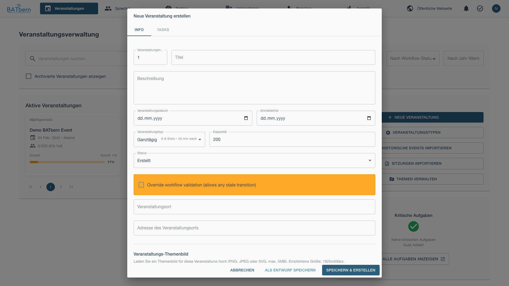
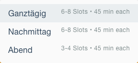
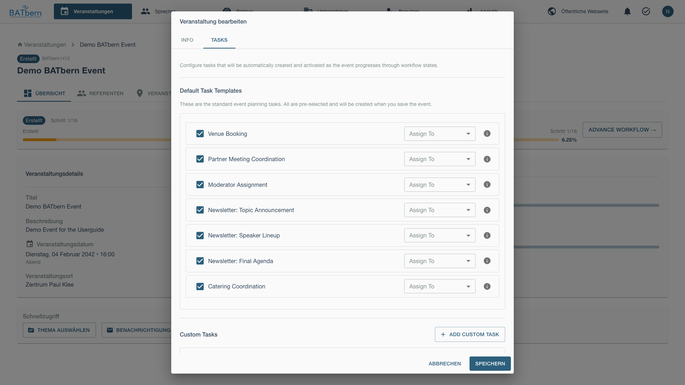
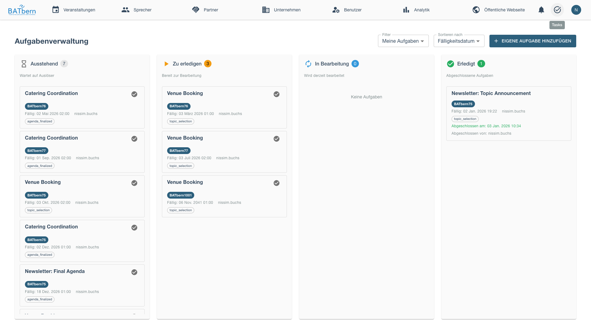
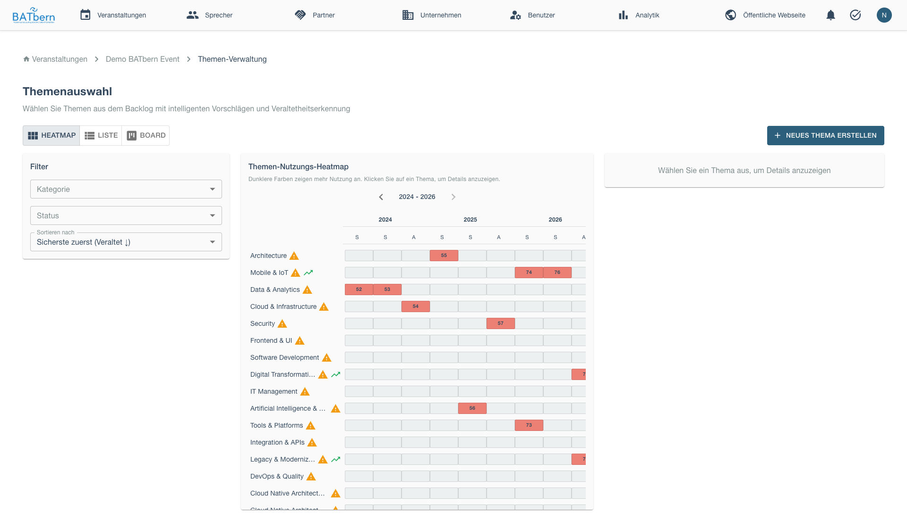
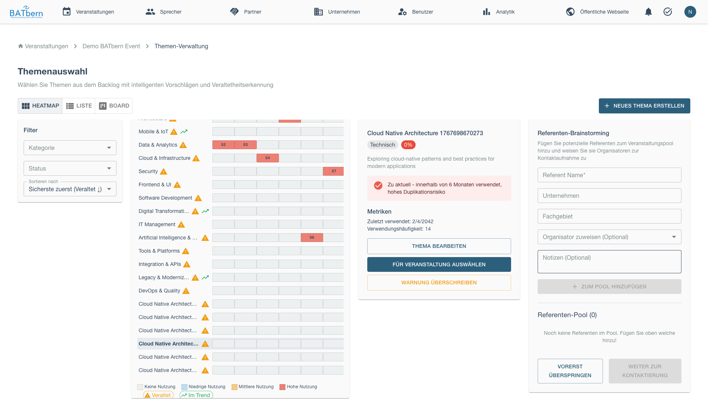

# Phase A: Setup (Steps 1-3)

> Define event structure, select topics, and identify speaker candidates

<div class="workflow-phase phase-a">
<strong>Phase A: Setup</strong><br>
Status: <span class="feature-status implemented">Implemented</span><br>
Duration: 1-2 weeks<br>
State Transitions: CREATED → TOPIC_SELECTED → SPEAKERS_IDENTIFIED
</div>

## Overview

Phase A establishes the foundation for your event. You'll define the event format, select topics based on historical data, and brainstorm potential speakers.

**Key Deliverable**: Event configured with selected topics and identified speaker candidates

## Step 1: Event Type Definition

<span class="feature-status implemented">Implemented</span>

### Purpose

Define the event format which determines timeline, session count, and speaker requirements.

### Accessing Event Creation

Navigate to the Events dashboard and click **Create Event**.


The event creation modal will open with the event configuration form.



### Acceptance Criteria

- ✅ Event type selected (Full-Day, Afternoon, or Evening)
- ✅ Event date and time confirmed
- ✅ Venue identified
- ✅ Registration timeline defined

### Event Type Selection

Choose the appropriate format for your conference:

#### 🌞 Full-Day Conference

**When to Use**:
- Annual flagship BATbern event
- Broad audience appeal (200+ expected attendees)
- Multiple topics to cover
- Budget supports full-day venue rental

**Configuration**:
- **Duration**: 8+ hours (e.g., 9:00 - 18:00)
- **Sessions**: 8-12 presentations
- **Speakers Needed**: 10-15 speakers
- **Parallel Tracks**: 2-3 tracks (optional)
- **Lead Time**: 3-4 months recommended

#### 🌤️ Afternoon Workshop

**When to Use**:
- Specialized topic deep-dive
- Smaller audience (50-100 attendees)
- Interactive format with Q&A
- Half-day commitment from speakers

**Configuration**:
- **Duration**: 3-4 hours (e.g., 14:00 - 18:00)
- **Sessions**: 2-4 presentations
- **Speakers Needed**: 3-5 speakers
- **Parallel Tracks**: Single track
- **Lead Time**: 6-8 weeks recommended

#### 🌙 Evening Lecture

**When to Use**:
- Guest speaker or keynote presentation
- Networking-focused event
- Shorter commitment for attendees
- Lower budget / less formal

**Configuration**:
- **Duration**: 2-3 hours (e.g., 18:00 - 21:00)
- **Sessions**: 1-2 presentations
- **Speakers Needed**: 1-3 speakers
- **Parallel Tracks**: Single track
- **Lead Time**: 4-6 weeks recommended

### How to Complete

<div class="step" data-step="1">

**Select Event Type**

In the event creation/edit form, select the appropriate type:



*The event type dropdown offers three conference formats: Full-Day Conference (8+ hours with multiple sessions), Afternoon Workshop (3-4 hours focused session), and Evening Lecture (2-3 hours single topic).*

</div>

<div class="step" data-step="2">

**Configure Timeline**

Set event date and registration windows:

<!-- TODO: Add timeline configuration screenshot (element-level capture) -->
*The timeline configuration form includes event date, event time (start and end), registration opening date, and registration closing date. Validation ensures logical sequencing: Registration Opens < Registration Closes < Event Date.*

Validation ensures logical timeline: Opens < Closes < Event Date
</div>

<div class="step" data-step="3">

**Specify Venue**

Enter venue details:

<!-- TODO: Add venue information screenshot (element-level capture) -->
*The venue information form collects venue name, street address, city, canton (dropdown for Swiss cantons), and postal code. City is a required field.*

</div>

<div class="step" data-step="4">

**Save Configuration**

Click **Save & Continue to Step 2**.

Event state advances to: **CREATED** (ready for topic selection)
</div>

### Assigning Tasks to Organizers

After creating the event, you can assign tasks to team members to distribute the workload.



Access the task list to view and manage assigned tasks.



## Step 2: Topic Selection with Heat Map

<span class="feature-status implemented">Implemented</span>

### Purpose

Select session topics using historical data to inform decisions and avoid topic fatigue.

### Acceptance Criteria

- ✅ Minimum topics selected based on event type:
  - Full-Day: 8-12 topics
  - Afternoon: 2-4 topics
  - Evening: 1-2 topics
- ✅ Topics reviewed for balance (not all from same category)
- ✅ Historical context considered via heat map

### Topic Heat Map

<span class="feature-status implemented">Implemented</span>

The **Topic Heat Map** visualizes 20+ years of BATbern conference history, showing topic frequency over time.

#### How the Heat Map Works



*The Topic Heat Map visualizes historical topic coverage across 20+ years of BATbern conferences. Topics are organized by category (rows) and time periods (columns). Color intensity indicates presentation frequency: dark blue for frequently presented topics (4+ times), light blue for occasional topics (1-3 times), and white for topics never or rarely presented.*

**Color Coding**:
- **Dark Blue**: Frequent topic (presented 4+ times in 5-year period)
- **Light Blue**: Occasional topic (1-3 times)
- **White**: Never or rarely presented

#### Interpreting the Heat Map

**Popular Topics** (Dark Blue columns):
- ✅ Proven audience interest
- ⚠️ Risk of topic fatigue if presented too often
- Consider new angles or subtopics

**Emerging Topics** (White → Light Blue transition):
- ✅ Fresh content, likely high interest
- ✅ Opportunity to be ahead of trends
- Consider pairing with established speakers

**Declining Topics** (Dark → Light Blue transition):
- ⚠️ May indicate waning interest
- Consider retiring or significantly updating

**Consistently Popular** (Dark Blue across all periods):
- ✅ Safe, reliable topics
- Ensure fresh perspective each time
- Examples: Sustainable Building, Energy Efficiency

### Topic Categories

Topics are organized into categories:

**Design & Aesthetics**:
- Minimalist Design
- Swiss Architecture
- Color Theory in Architecture

**Technology & Innovation**:
- Digital Transformation
- BIM and Digital Twins
- Smart Buildings
- Computational Design

**Sustainability**:
- Sustainable Building Materials
- Energy Efficiency
- Circular Economy
- Net-Zero Buildings

**Urban & Regional**:
- Urban Planning
- Public Spaces
- Transportation Integration
- Regional Development

**Heritage & History**:
- Heritage Preservation
- Adaptive Reuse
- Historical Context

**Practice & Business**:
- Project Management
- Client Relations
- Practice Development

### How to Complete

<div class="step" data-step="1">

**Open Heat Map**

In Step 2 of the workflow, click **View Topic Heat Map**.

Interactive heat map opens showing historical data.


</div>

<div class="step" data-step="2">

**Explore Historical Trends**

Hover over cells to see details:

<!-- TODO: Add heat map tooltip screenshot (element-level capture) -->
*Hovering over a heat map cell reveals detailed statistics: number of presentations, speakers (including panel sessions), average audience rating, and average attendance. Click on a year cell to view individual presentation details.*

Click year to see presentation details.
</div>

<div class="step" data-step="3">

**Select Topics**

Click topics to add to your event:

<!-- TODO: Add selected topics checklist screenshot (element-level capture) -->
*The selected topics checklist shows your current topic selections with a progress indicator (e.g., "4 of 8 required"). Each selected topic displays with a checkmark and a [Remove] button. An [+ Add Another Topic] button allows adding more topics until the minimum requirement is met.*

Add minimum required for your event type.
</div>

<div class="step" data-step="4">

**Review Balance**

Ensure topic diversity:

- ✅ Mix of popular and emerging topics
- ✅ Balance across categories (not all Technology)
- ✅ Variety in presentation formats (case studies, theory, practice)

</div>

<div class="step" data-step="5">

**Confirm Selection**

Click **Confirm Topic Selection**.

Event state advances to: **TOPIC_SELECTED**
</div>

### Topic Selection Tips

**Aim for Variety**:

<!-- TODO: Add topic balance summary screenshot (element-level capture) -->
*The topic balance indicator shows examples of good vs. poor topic distribution. Good balance includes diverse categories (Sustainability, Technology, Urban & Regional, Heritage). Poor balance concentrates all topics in a single category (e.g., all Technology topics like BIM, Smart Buildings, Digital Twins).*

**Consider Event Type**:
- **Full-Day**: Mix of broad appeal and specialized topics
- **Afternoon**: Focused theme with related topics
- **Evening**: Single compelling topic or contrasting pair

**Leverage Heat Map Insights**:
- Avoid topics presented last year (unless new angle)
- Identify 5+ year gaps as re-introduction opportunities
- Note which topics consistently draw high attendance

## Step 3: Speaker Brainstorming

<span class="feature-status implemented">Implemented</span>

### Purpose

Identify potential speakers for each selected topic, creating a pool of candidates for outreach in Phase B.

### Acceptance Criteria

- ✅ Each topic has 2-3 candidate speakers identified
- ✅ Total candidates = 2× needed speakers (e.g., 20 candidates for 10 speaker slots)
- ✅ Candidate diversity considered (companies, experience levels, demographics)
- ✅ Contact information captured (email minimum)

### Candidate Sources

**Past Speakers**:
- Review historical speaker database
- Filter by topic expertise
- Check availability (not presented recently)

**Company Referrals**:
- Ask partner companies for recommendations
- Leverage user/company database
- Contact industry associations

**Industry Experts**:
- LinkedIn searches
- Industry publications and blogs
- Conference speaker rosters (other events)

**Internal Knowledge**:
- Organizer team recommendations
- Board member suggestions
- Partner company employees

### How to Complete

<div class="step" data-step="1">

**Select Topic**

In Step 3, choose a topic to brainstorm speakers:

<!-- TODO: Add topic speaker status overview screenshot (element-level capture) -->
*The topic speaker status overview displays all selected topics with their current speaker candidate count. Topics are shown with visual indicators: ✅ for topics with adequate candidates (3+), ⚠️ for topics with insufficient candidates (0-2). Click any topic to add speaker candidates.*

Click topic to add speaker candidates.
</div>

<div class="step" data-step="2">

**Add Candidate**

Click **+ Add Speaker Candidate** to open the brainstorming form.



*The speaker brainstorming form collects candidate information: First Name, Last Name, Email (required fields), Company (with autocomplete search), Expertise Match (High/Medium/Low dropdown), Notes (optional, for recording speaker background or presentation history), and Source (Past Speaker, Company Referral, Industry Expert, or Internal). Candidates are created with status IDENTIFIED.*

Candidate is created with status: **IDENTIFIED**
</div>

<div class="step" data-step="3">

**Repeat for All Topics**

Add 2-3 candidates per topic. After adding candidates, the topic displays the candidate list showing names, expertise match level, and contact information, with an option to add more candidates.

</div>

<div class="step" data-step="4">

**Review Candidate Pool**

View all candidates across topics. The Speaker Candidate Summary displays: Total Candidates count, Speakers Needed count, Candidate-to-Speaker Ratio (✅ if 2:1 or better), breakdown by Company (highlighting over-representation from single companies), breakdown by Experience/Match Level (High/Medium/Low), and Diversity Warnings (alerts when too many candidates come from the same company).

</div>

<div class="step" data-step="5">

**Confirm Brainstorming Complete**

Once minimum candidates identified, click **Complete Brainstorming**.

Event state advances to: **SPEAKERS_IDENTIFIED**

Phase A is complete! ✅
</div>

### Brainstorming Tips

**Target 2:1 Ratio**:
- Identify 2× candidates per needed speaker
- Provides backup if speakers decline
- Allows selectivity based on responses

**Consider Diversity**:
- **Company**: Avoid 3+ speakers from same firm
- **Experience**: Mix established and emerging voices
- **Gender**: Aim for balanced representation
- **Geography**: Include speakers from different regions

**Prioritize Candidates**:
```
High Priority (contact first):
- Past speakers with excellent ratings
- Industry thought leaders
- Strong topic-expertise match

Medium Priority (contact if needed):
- New speakers with good credentials
- Medium topic match
- Company referrals

Low Priority (backup):
- Emerging speakers (unproven)
- Low topic match
- Last-resort options
```

**Capture Useful Notes**:
- Previous presentation history
- Presentation style (technical, storytelling, visual)
- Availability constraints (e.g., "Not available Fridays")
- Special requirements (e.g., "Needs translator")

## Phase A Completion

### Success Criteria

Before advancing to Phase B, confirm:

- ✅ Event type defined with timeline
- ✅ Topics selected using heat map data
- ✅ Speaker candidates identified (2:1 ratio)
- ✅ Event state = **SPEAKERS_IDENTIFIED**

### What Happens Next

**Phase B: Outreach** begins automatically:
- Candidates ready for contact (Step 4)
- Outreach tracking system active
- Email templates available

See [Phase B: Outreach →](phase-b-outreach.md) to continue.

## Troubleshooting Phase A

### "Heat map shows no data"

**Problem**: Heat map displays empty cells.

**Solution**:
- Historical data may not be imported yet (Epic 3 in progress)
- Proceed with topic selection based on organizer knowledge
- Contact support to import historical data

### "Can't find enough speaker candidates"

**Problem**: Insufficient candidates for 2:1 ratio.

**Solution**:
- Expand search to adjacent topics
- Consider emerging speakers (lower experience)
- Extend outreach timeline to allow more research
- Consider reducing event scope (fewer sessions)

### "Topics too similar"

**Problem**: Selected topics lack diversity.

**Solution**:
- Review heat map for adjacent categories
- Consult topic category list
- Replace 1-2 topics with different categories
- Ensure balance across Design, Technology, Sustainability

## Related Topics

- [Event Management →](../entity-management/events.md) - Event configuration
- [Topic Heat Map →](../features/heat-maps.md) - Detailed heat map guide
- [Speaker Management →](../entity-management/speakers.md) - Speaker profiles
- [Phase B: Outreach →](phase-b-outreach.md) - Next phase

## API Reference

### Workflow Endpoints

```
POST /api/events/{id}/workflow/step-1     Complete Step 1 (Event Type)
POST /api/events/{id}/workflow/step-2     Complete Step 2 (Topic Selection)
POST /api/events/{id}/workflow/step-3     Complete Step 3 (Brainstorming)
GET  /api/topics/heatmap                   Get heat map data
POST /api/speakers                         Create speaker candidate
```

See [API Documentation](../../api/) for complete specifications.
