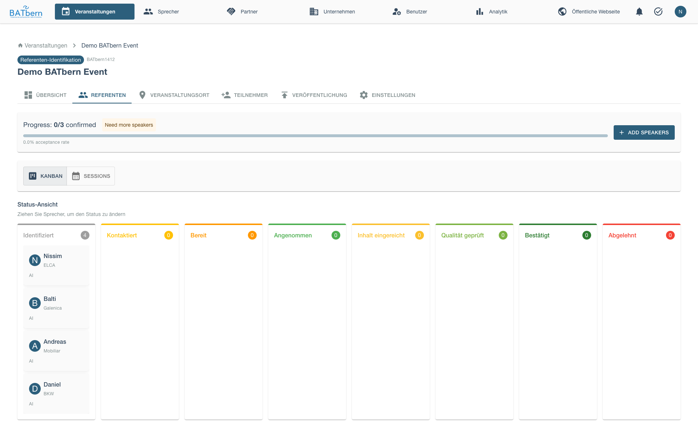
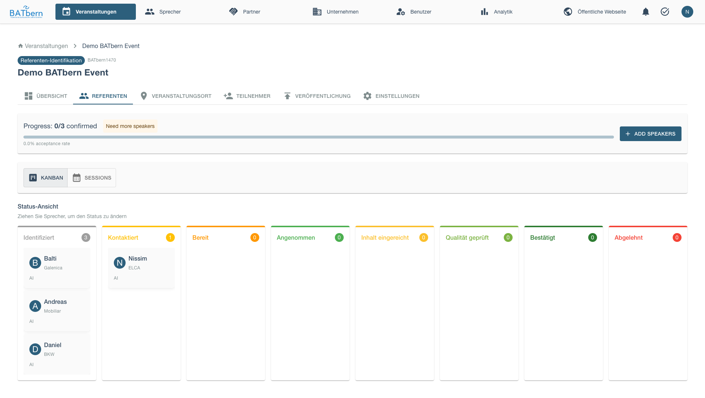
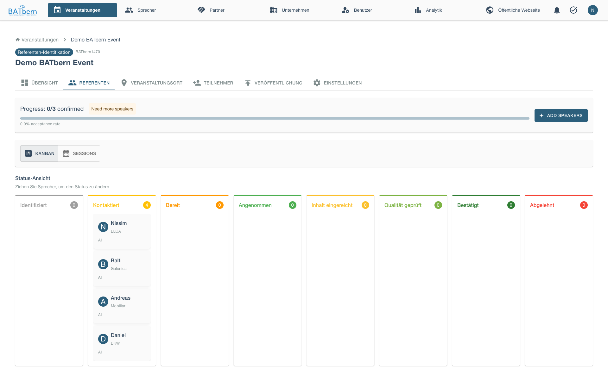
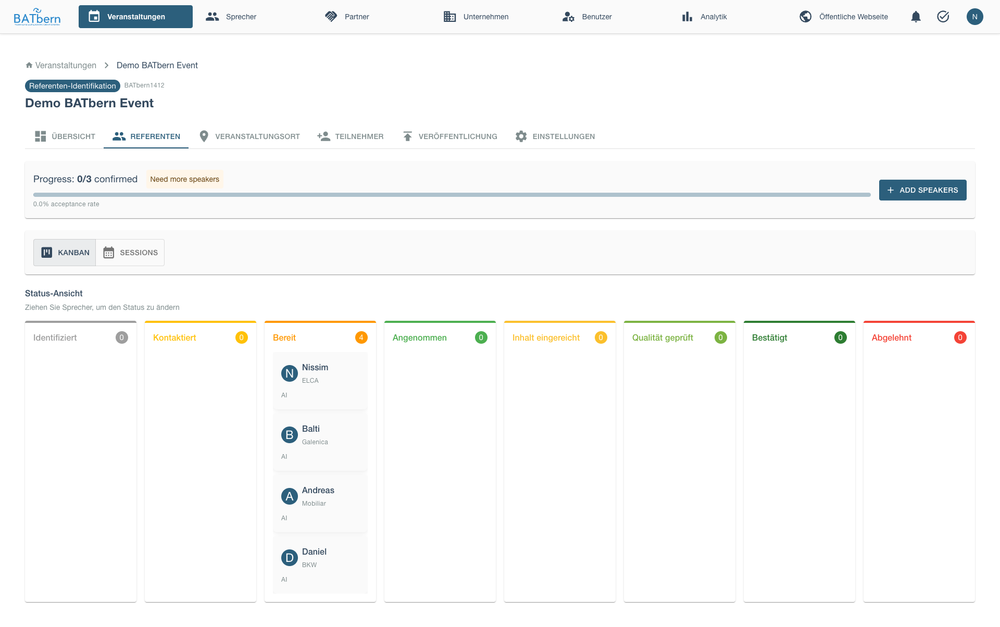
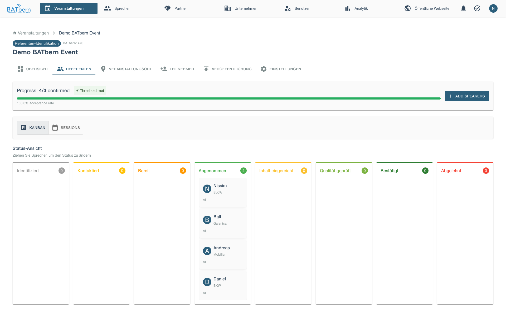
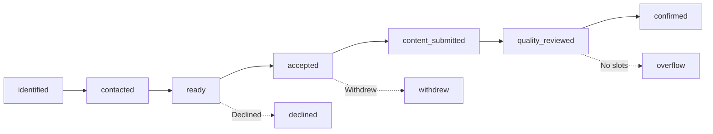
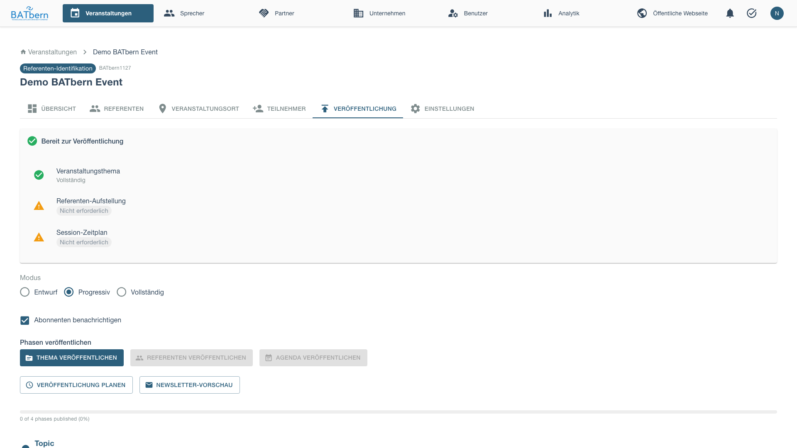
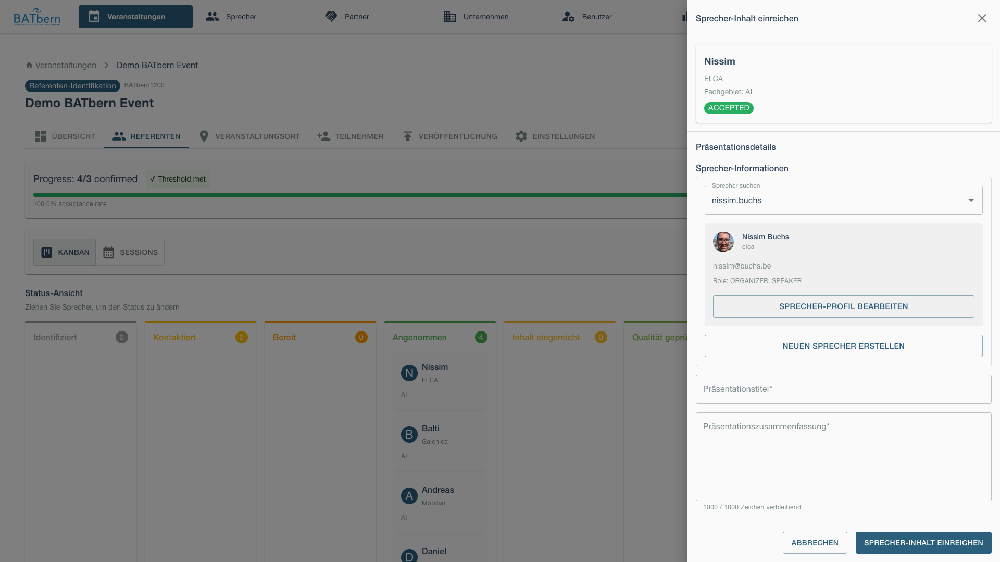
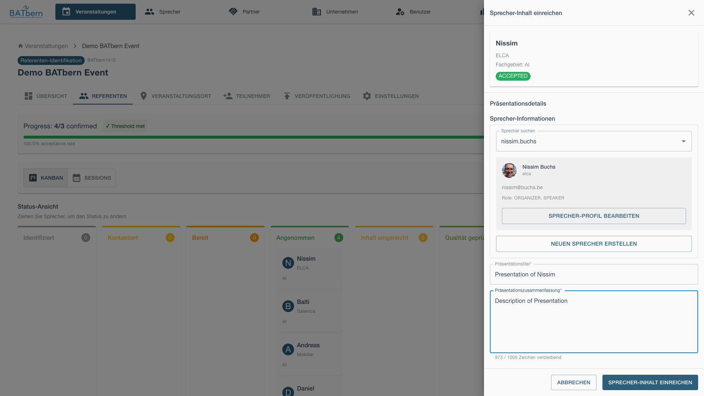

# Phase B: Outreach (Steps 4-6)

> Engage speakers, track responses, and collect presentation content

<div class="workflow-phase phase-b">
<strong>Phase B: Outreach</strong><br>
Status: <span class="feature-status implemented">Implemented</span><br>
Duration: 4-6 weeks<br>
Event State: SPEAKER_IDENTIFICATION (event remains in this state while speakers progress)<br>
Speaker States: identified → contacted → ready → accepted → content_submitted
</div>

## Overview

Phase B focuses on speaker engagement. You'll contact identified candidates, track their responses through their individual speaker workflows, and collect presentation content from accepted speakers.

**Key Concept**: The event remains in SPEAKER_IDENTIFICATION state while individual speakers progress through their own parallel workflows (identified → contacted → ready → accepted → content_submitted).

**Key Deliverable**: Accepted speakers with submitted content ready for quality review

## Step 4: Speaker Outreach Tracking

<span class="feature-status implemented">Implemented</span>

### Purpose

Systematically contact speaker candidates and track communication history to ensure no candidate falls through the cracks.

### Acceptance Criteria

- ✅ All identified candidates contacted
- ✅ Contact attempts logged with dates
- ✅ Response status tracked for each candidate
- ✅ Follow-up reminders sent as needed

### Outreach Strategy

**Initial Contact Timeline**:
1. **Day 1**: Contact high-priority candidates (past speakers, thought leaders)
2. **Day 3**: Contact medium-priority candidates
3. **Day 7**: Contact low-priority candidates (if still needed)

**Staging Approach**:
- Don't contact all candidates simultaneously
- Contact in waves based on priority
- Preserves backup options if high-priority speakers decline

### How to Complete

<div class="step" data-step="1">

**Open Outreach Dashboard**

Navigate to Step 4 in the workflow.

Outreach dashboard displays all candidates in a Kanban board by status.


The Kanban board supports drag-and-drop to update speaker status as you contact them and receive responses.
</div>

<div class="step" data-step="2">

**Select Candidates to Contact**

Select high-priority candidates for initial wave. The candidate selection interface displays checkboxes for each candidate with their priority level (High/Medium/Low), a "Select All" option, and a [Send Invitation Email] button to send bulk invitations to selected candidates.

</div>

<div class="step" data-step="3">

**Send Invitation Email**

Click **Send Invitation Email**.

The email template editor opens with pre-filled content including: recipient email, subject line ("Invitation to speak at BATbern [Year]"), personalized greeting, event overview (date, type, location, expected audience), presentation format (duration and Q&A allocation), invitation rationale based on speaker expertise, response deadline, organizer signature, and action buttons ([Edit Email] [Send] [Cancel]) to review, modify, and send the invitation.

Customize as needed, then click **Send**.
</div>

<div class="step" data-step="4">

**Log Contact**

Before contacting a speaker:



After sending, speaker status updates:
- Speaker Status: identified → **contacted**
- Event Status: Still SPEAKER_IDENTIFICATION (unchanged)
- Contact log entry created with timestamp
- Follow-up reminder scheduled (3-5 days)



*The contact history log displays a chronological timeline of all interactions with a speaker: timestamp, contact method (Email Sent, Phone Call, etc.), subject line or summary, current status (CONTACTED, INTERESTED, etc.), and next scheduled action with date.*

After contacting all speakers, the Kanban board shows them in the "Contacted" column:



</div>

<div class="step" data-step="5">

**Track Responses**

When speakers respond, update their status on the Kanban board. Drag speaker cards from "Contacted" to "Ready" as they show interest.


Then drag from "Ready" to "Accepted" as they confirm participation.



After all confirmations, your outreach board shows speakers in the Accepted column.



</div>

<div class="step" data-step="6">

**Send Follow-Ups**

For non-responders after 3-5 days, send reminder. The system displays candidates needing follow-up with their contact date and days since initial contact. A [Send Follow-Up Reminder] button sends a polite follow-up email with a subject line referencing the original invitation, a brief reminder of the opportunity, and an updated response deadline.

</div>

<div class="step" data-step="7">

**Handle Declines**

If speaker declines, the system displays the decline notification with date, reason (if provided), and action buttons: [Mark as DROPOUT] to update their status, and [Contact Backup Candidate] to initiate outreach to the next priority candidate from the same topic.
</div>

<div class="step" data-step="8">

**Complete Outreach**

Once minimum speakers show interest, click **Complete Outreach**.

Event state advances to: **OUTREACH_INITIATED**
</div>

### Outreach Metrics

<span class="feature-status planned">Planned</span>

Track outreach effectiveness. The Outreach Metrics dashboard displays: total candidates contacted, interested count with response rate percentage, declined count and percentage, no-response count and percentage, average response time in days, fastest and slowest response times with speaker names for reference.

## Step 5: Speaker Status Management

<span class="feature-status in-progress">In Progress</span>

### Purpose

Track speaker progression from interest through content submission, ensuring timely advancement and identifying blockers.

### Acceptance Criteria

- ✅ All interested speakers have clear status
- ✅ Status transitions logged with timestamps
- ✅ Blockers identified and resolved (e.g., awaiting content guidelines)
- ✅ Minimum speakers reached **CONTENT_SUBMITTED** status

### Speaker Status Flow



### Status Definitions

| Status | Meaning | Organizer Action | Speaker Action |
|--------|---------|------------------|----------------|
| **identified** | Potential candidate | Send invitation | - |
| **contacted** | Invitation sent | Await response | Respond to invitation |
| **ready** | Ready to accept/decline | Get acceptance | Decide to accept or decline |
| **accepted** | Committed to presenting | Send content guidelines | Submit content |
| **declined** | Not available | Contact backup candidate | - |
| **content_submitted** | Content received | Review content (Phase C) | - |
| **quality_reviewed** | Content approved | Assign time slot (Phase D) | - |
| **confirmed** | Quality reviewed AND slot assigned | Ready for publication | - |
| **overflow** | Accepted but no slots | Backup speaker | - |
| **withdrew** | Dropped out after accepting | Find replacement | - |

### How to Complete

<div class="step" data-step="1">

**Monitor Status Board**

The speaker pipeline displays INTERESTED speakers in a grouped view showing speaker name, assigned topic, and a [Request Content] action button for each. Summary metrics show counts for Content Guidelines Sent, Awaiting Content, and Content Received. A [Send Bulk Reminder] button allows sending reminder emails to all speakers awaiting content submission.

</div>

<div class="step" data-step="2">

**Send Content Guidelines**

For **INTERESTED** speakers, send content requirements:

```
To: hans.mueller@example.com
Subject: Content Guidelines - BATbern 2025

Hi Hans,

Great to have you confirmed for BATbern 2025!

Please submit the following by March 1, 2025:

Required:
- Presentation Title (≤100 characters)
- Abstract (≤1000 characters)
- 3-5 Learning Objectives

Optional:
- Target Audience (Beginner/Intermediate/Advanced)
- Prerequisites (required attendee knowledge)
- Supporting materials (slides, handouts)

Submit via: https://batbern.ch/submit-content/{token}

Looking forward to your presentation!

Best,
Anna Schmidt

[Send]
```
</div>

<div class="step" data-step="3">

**Track Content Submissions**

Monitor submission progress:

```
Content Submission Progress
────────────────────────────────────────
Target: 12 confirmed speakers
Deadline: March 1, 2025 (14 days remaining)

Status:
✅ Submitted: 6 speakers (43%)
⏳ In Progress: 4 speakers (29%)
⚠️ Not Started: 4 speakers (29%)

Recently Submitted:
- Hans Müller (2025-02-16)
- Peter Weber (2025-02-18)
- Lisa Meier (2025-02-19)

Overdue / At Risk:
⚠️ Martin Fischer (contacted 14 days ago, no content)
⚠️ Sophie Keller (said "in progress" 7 days ago)

[Send Reminder to At-Risk Speakers]
```
</div>

<div class="step" data-step="4">

**Send Reminders**

For speakers approaching deadline:

```
To: martin.fischer@example.com
Subject: Content Reminder - BATbern 2025 (Due March 1)

Hi Martin,

Friendly reminder that your presentation content for BATbern 2025
is due March 1 (in 5 days).

We still need:
- Presentation Title
- Abstract (≤1000 characters)
- Learning Objectives

Submit via: https://batbern.ch/submit-content/{token}

Let me know if you need an extension or have questions!

Thanks,
Anna
```
</div>

<div class="step" data-step="5">

**Update Status on Submission**

When content received, status automatically updates:
- Speaker Status: accepted → **content_submitted**
- Event Status: Still SPEAKER_IDENTIFICATION (unchanged)
- Content flagged for review (Phase C)

```
✅ Content Received - Hans Müller
────────────────────────────────────────
Title: "Innovations in Sustainable Building Materials"
Abstract: 287 characters / 1000 ✅
Learning Objectives: 4 ✅

Status: content_submitted
Next: Quality Review (Phase C)

[View Content] [Request Revision]
```
</div>

<div class="step" data-step="6">

**Handle Late Submissions**

For speakers missing deadline:

**Option 1**: Grant Extension
```
[Grant 3-Day Extension]
New deadline: March 4, 2025
```

**Option 2**: Mark as Withdrew
```
[Mark as withdrew]
Reason: Missed content deadline
→ Contact backup candidate
```
</div>

<div class="step" data-step="7">

**Complete Outreach**

Once minimum speakers at **content_submitted** state, you're ready for Phase C (Quality Review).

**Note**: Event state remains **SPEAKER_IDENTIFICATION** throughout Phase B and Phase C. It only advances to SLOT_ASSIGNMENT in Phase D after all speakers are assigned to time slots.
</div>

### Status Management Tips

**Set Clear Deadlines**:
- Give speakers 2-3 weeks for content submission
- Send reminder at 1 week before deadline
- Final reminder at 2 days before deadline

**Track Engagement**:
```
High Engagement (likely to deliver):
✅ Responds quickly to emails
✅ Asks clarifying questions
✅ Submits content early

Low Engagement (at risk):
⚠️ Slow to respond (>3 days)
⚠️ Says "I'll send it soon" multiple times
⚠️ Approaching deadline with no content
→ Prepare backup candidate
```

**Use Staging Strategy**:
- Don't release all slots to **INTERESTED** speakers
- Hold 20% as buffer for dropouts
- Example: Need 10 speakers, confirm 12 initially

## Step 6: Speaker Content Collection

<span class="feature-status in-progress">In Progress</span>

### Purpose

Collect detailed presentation content from speakers to enable quality review and agenda publishing.

### Acceptance Criteria

- ✅ All confirmed speakers submitted required content
- ✅ Content meets format requirements (title ≤100 chars, abstract ≤1000 chars)
- ✅ Learning objectives provided (3-5 per presentation)
- ✅ Supporting materials uploaded (if available)

### Content Requirements

**Mandatory Fields**:

| Field | Max Length | Purpose |
|-------|------------|---------|
| **Title** | 100 characters | Session listing, agenda |
| **Abstract** | 1000 characters | Detailed description for attendees |
| **Learning Objectives** | 3-5 bullets | What attendees will learn |

**Optional Fields**:

| Field | Format | Purpose |
|-------|--------|---------|
| **Target Audience** | Dropdown | Beginner/Intermediate/Advanced |
| **Prerequisites** | Text | Required attendee knowledge |
| **Supporting Materials** | PDF upload | Handouts, references |
| **Biography** | 500 characters | Speaker intro for agenda |

### Content Submission Portal

<span class="feature-status implemented">Implemented</span>

Before collecting content, publish the topic from the Publishing tab.



After publishing the topic, organizers can submit content on behalf of speakers using the content submission drawer.



Fill in the presentation details and submit.



Speakers can also receive unique submission links:

```
https://batbern.ch/submit-content/{token}
```

Portal displays:

```
BATbern 2025 Content Submission
────────────────────────────────────────
Hi Hans Müller!

Please provide details for your presentation on
"Sustainable Building Materials"

Presentation Title *
[Innovations in Sustainable Building Materials]
Characters: 48 / 100 ✅

Abstract *
[Describe your presentation here...
This session will explore recent innovations...]
Characters: 287 / 1000 ✅

Learning Objectives * (3-5 items)
1. [Understand key sustainable material types]
2. [Evaluate material lifecycle impacts]
3. [Apply selection criteria to projects]
[+ Add Objective]

Target Audience
[▼ Intermediate]

Prerequisites (optional)
[Basic understanding of building materials]

Supporting Materials (optional)
[Choose Files] No files chosen
PDF format, max 10MB

Speaker Biography * (for event program)
[Hans Müller is a Senior Architect at...]
Characters: 145 / 500 ✅

[Save Draft] [Submit for Review]
```

### Content Validation

System validates submissions:

**Title Validation**:
```
✅ Valid: "Innovations in Sustainable Building Materials" (48 chars)
❌ Invalid: "A Comprehensive Overview of Recent Innovations and Emerging Trends in Sustainable Building Material Selection and Application for Modern Architecture" (142 chars)
Error: Title must be 100 characters or less
```

**Abstract Validation**:
```
✅ Valid: 287 characters
❌ Invalid: 1042 characters
Error: Abstract exceeds 1000 character limit. Please shorten.
```

**Learning Objectives**:
```
✅ Valid: 4 objectives (within 3-5 range)
⚠️ Warning: 2 objectives (below recommended 3)
❌ Error: 0 objectives (minimum 3 required)
```

### How to Complete

<div class="step" data-step="1">

**Monitor Submissions**

Track content collection progress:

```
Content Collection Dashboard
────────────────────────────────────────
Target: 12 speakers
Deadline: March 1, 2025

Submitted: 10 ✅
Missing: 2 ⚠️
  - Martin Fischer (Heritage Reuse)
  - Sophie Keller (Digital Transform)

[Send Reminder]
```
</div>

<div class="step" data-step="2">

**Review New Submissions**

When content submitted, organizer reviews for completeness:

```
New Submission - Hans Müller
────────────────────────────────────────
Title: "Innovations in Sustainable Building Materials" ✅
Abstract: 287 chars ✅
Objectives: 4 ✅
Supporting Materials: sustainable-materials-overview.pdf ✅

[Accept] [Request Revision]
```

**Accept**: Content sufficient, advance to quality review (Phase C)
**Request Revision**: Issues found, request speaker revisions
</div>

<div class="step" data-step="3">

**Request Revisions (if needed)**

If content needs improvement:

```
[Request Revision]

Revision Notes for Hans Müller:
────────────────────────────────────────
- Abstract: Please add specific material examples
- Learning Objective #3: Too vague, please specify

Expected revision by: February 25, 2025

[Send Revision Request]
```

Speaker notified via email, can resubmit via same portal link.
</div>

<div class="step" data-step="4">

**Complete Collection**

Once all required speakers submitted content:

Phase B complete! ✅ Ready for Phase C (Quality Review)

**Note**: Event state remains **SPEAKER_IDENTIFICATION** (unchanged). Speakers have progressed to **content_submitted** state individually.
</div>

### Content Quality Tips

**Good Title Examples**:
- ✅ "Innovations in Sustainable Materials"
- ✅ "Digital Twins for Building Management"
- ✅ "Adaptive Reuse: From Factory to Housing"

**Poor Title Examples**:
- ❌ "Materials" (too vague)
- ❌ "A Comprehensive Study..." (unnecessarily long)
- ❌ "Part 1: Introduction to..." (implies incomplete)

**Good Abstract Structure**:
```
[Hook - 1 sentence]: Why this topic matters
[Context - 2-3 sentences]: Background and current state
[Content - 3-4 sentences]: What will be covered
[Outcome - 1 sentence]: What attendees will gain
```

**Good Learning Objectives**:
- ✅ Action-oriented: "Apply", "Evaluate", "Design"
- ✅ Specific and measurable
- ✅ Appropriate for target audience level

**Poor Learning Objectives**:
- ❌ "Understand sustainability" (too vague)
- ❌ "Learn about materials" (not specific)
- ❌ "Be aware of trends" (not action-oriented)

## Phase B Completion

### Success Criteria

Before advancing to Phase C, confirm:

- ✅ All high-priority candidates contacted
- ✅ Minimum speakers reached **accepted** state
- ✅ All accepted speakers submitted content
- ✅ Minimum speakers at **content_submitted** state
- ✅ Event state = **SPEAKER_IDENTIFICATION** (unchanged - progresses in Phase D)

### Minimum Speaker Requirements

| Event Type | Minimum Confirmed |
|------------|-------------------|
| Full-Day | 8 speakers (for 8-12 sessions) |
| Afternoon | 3 speakers (for 2-4 sessions) |
| Evening | 2 speakers (for 1-2 sessions) |

### What Happens Next

**Phase C: Quality Control** begins:
- Content reviewed by organizers
- Quality threshold validation
- Revision requests for subpar content

See [Phase C: Quality →](phase-c-quality.md) to continue.

## Troubleshooting Phase B

### "Too many speaker declines"

**Problem**: More than 50% of contacted speakers declined.

**Solution**:
- Review invitation message (too formal? unclear benefits?)
- Check event date (conflicts with holidays/other events?)
- Expand to backup candidates
- Consider extending timeline for more research

### "Content submission deadline missed"

**Problem**: Speakers not submitting by deadline.

**Solution**:
- Grant 3-5 day extension (one-time)
- Send urgent reminder with deadline emphasis
- Prepare backup speaker activation
- Mark chronic late-submitters as DROPOUT

### "Content quality insufficient"

**Problem**: Submitted content too vague or brief.

**Solution**:
- Request specific revisions via portal
- Provide examples of good content
- Offer to help edit if language barrier
- Last resort: Mark as DROPOUT, use backup

## Related Topics

- [Speaker Management →](../entity-management/speakers.md) - Speaker profiles
- [Phase A: Setup →](phase-a-setup.md) - Previous phase
- [Phase C: Quality →](phase-c-quality.md) - Next phase
- [Troubleshooting →](../troubleshooting/workflow.md) - Workflow issues

## API Reference

```
POST /api/events/{id}/workflow/step-4         Complete Step 4 (Outreach)
POST /api/events/{id}/workflow/step-5         Complete Step 5 (Status Mgmt)
POST /api/events/{id}/workflow/step-6         Complete Step 6 (Content Collection)
PUT  /api/speakers/{id}/status                Update speaker status
POST /api/speakers/{id}/content               Submit speaker content
GET  /api/speakers/{id}/contact-history       Get contact log
```

See [API Documentation](../../api/) for complete specifications.
