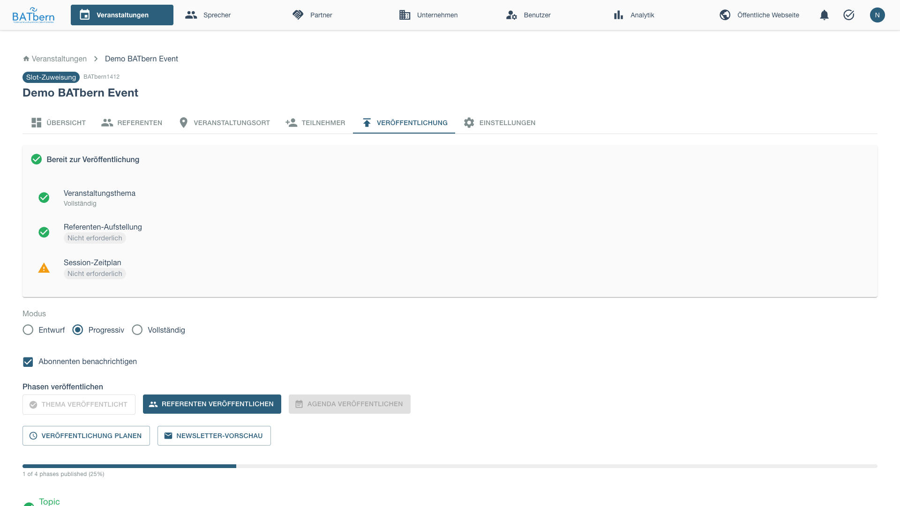
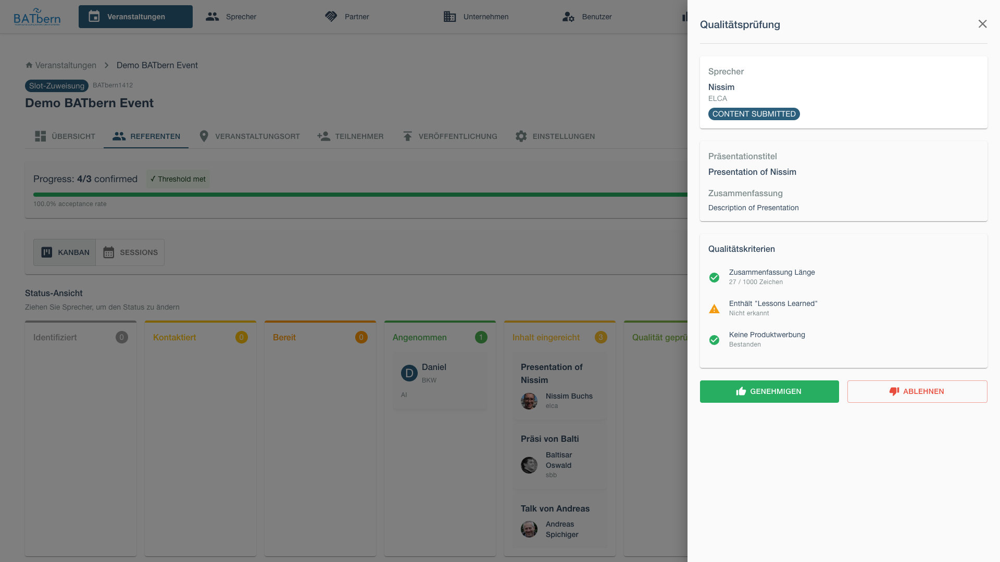
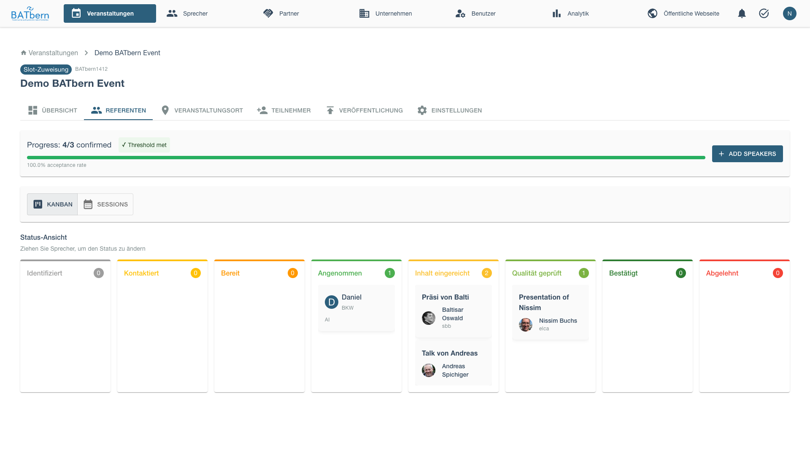

# Phase C: Quality Control (Steps 7-8)

> Review content quality and validate minimum threshold

<div class="workflow-phase phase-c">
<strong>Phase C: Quality Control</strong><br>
Status: <span class="feature-status implemented">Implemented</span><br>
Duration: 1-2 weeks<br>
State Transitions: CONTENT_COLLECTED → QUALITY_REVIEWED
</div>

## Overview

Phase C ensures submitted content meets quality standards before public release. Organizers review each presentation for relevance, clarity, and audience fit, then validate that enough high-quality content exists to proceed.

**Key Deliverable**: Approved content meeting 80% quality threshold

### Publishing Speakers

Before reviewing content, publish the speakers from the Publishing tab.



## Step 7: Content Quality Review

<span class="feature-status implemented">Implemented</span>

### Purpose

Systematically review speaker content to ensure presentations meet BATbern quality standards.

### Acceptance Criteria

- ✅ All submitted content reviewed by at least 1 organizer
- ✅ Quality scores assigned (1-5 scale)
- ✅ Revision requests sent for insufficient content
- ✅ All speakers either APPROVED or REVISION_REQUESTED

### Quality Criteria

**Relevance** (1-5):
- Aligns with selected topic
- Appropriate for BATbern audience (architects)
- Current and applicable content

**Clarity** (1-5):
- Clear presentation structure
- Well-defined learning objectives
- Concise and understandable abstract

**Originality** (1-5):
- New perspective or insights
- Not generic/basic content
- Demonstrates expertise

**Completeness** (1-5):
- All required fields provided
- Adequate detail in abstract
- Realistic learning objectives

### How to Complete

<div class="step" data-step="1">

**Open Review Queue**

Navigate to the Speakers tab after publishing speakers. Open the quality review drawer for each presentation.



</div>

<div class="step" data-step="2">

**Review Submission**

The content review interface displays: speaker name and topic, presentation title, abstract with character count, numbered learning objectives, quality scores for Relevance, Clarity, Originality, and Completeness (1-5 scale with visual indicators), calculated overall score (out of 5.0) with quality rating (EXCELLENT/GOOD/FAIR/POOR), optional reviewer notes field for feedback, and action buttons ([Approve] [Request Revision] [Reject]) to make the final decision.

</div>

<div class="step" data-step="3">

**Make Decision**

After reviewing the content, approve it to confirm the speaker.



**Approve** (score ≥ 3.5):
- Speaker status: CONTENT_SUBMITTED → **CONFIRMED**
- Speaker ready for slot assignment (Phase D)

**Request Revision** (score 2.5-3.4):
- Speaker notified with feedback
- Speaker status remains CONTENT_SUBMITTED
- Re-review after revision

**Reject** (score < 2.5):
- Speaker marked as DROPOUT (insufficient quality)
- Activate backup candidate

</div>

<div class="step" data-step="4">

**Send Revision Request** (if needed)

The revision request email includes: recipient email and subject line, personalized greeting, thanking the speaker for their submission, specific feedback organized by quality criterion (e.g., Relevance, Clarity) with scores and actionable improvement suggestions, concrete examples showing "before → after" transformations for clarity, revision deadline, secure revision link with authentication token, and organizer signature.

</div>

<div class="step" data-step="5">

**Complete Review**

Once all submissions reviewed, click **Complete Quality Review**.

Proceed to Step 8 (Threshold Validation).
</div>

### Review Best Practices

**Be Constructive**:
- Explain WHY revisions needed
- Provide specific examples
- Suggest improvements

**Consistent Standards**:
- Use same criteria for all speakers
- Multiple reviewers should calibrate scores
- Document rationale for borderline cases

**Time Management**:
- Review 2-3 submissions per day
- Don't batch all at end (spreads workload)
- Allow 1 week for speaker revisions

## Step 8: Minimum Threshold Validation

<span class="feature-status planned">Planned</span>

### Purpose

Ensure sufficient high-quality speakers to proceed with the event. Validates that at least 80% of needed speakers have approved content.

### Acceptance Criteria

- ✅ Quality threshold met (≥80% of needed speakers approved)
- ✅ Topic coverage validated (all selected topics have speakers)
- ✅ Backup plan identified if threshold not met

### Threshold Calculation

**Formula**:
```
Threshold = (Approved Speakers / Needed Speakers) × 100%

Target: ≥ 80%
```

**Example (Full-Day Event)**:
```
Needed Speakers: 12
Approved Speakers: 10
Threshold: 10/12 = 83.3% ✅ PASS

Remaining Slots: 2
Options:
- Promote 2 backup candidates
- Reduce to 10 sessions (still acceptable)
```

**Example (Insufficient)**:
```
Needed Speakers: 12
Approved Speakers: 8
Threshold: 8/12 = 66.7% ❌ FAIL

Options:
- Contact backup candidates immediately
- Request revisions on borderline cases (3.0-3.4 scores)
- Extend deadline for additional submissions
```

### How to Complete

<div class="step" data-step="1">

**View Threshold Dashboard**

The Quality Threshold Validation dashboard displays: target speaker count, approved count with percentage (✅ PASS if ≥80%, ❌ FAIL if <80%), needs-revision count with percentage, rejected count, topic-level breakdown showing approved speakers per topic with status indicators (✅ sufficient, ⚠️ insufficient), overall status determination (THRESHOLD MET/NOT MET), and action button ([Proceed to Phase D] if threshold met, or [Review Options] if threshold not met).

</div>

<div class="step" data-step="2">

**Handle Below-Threshold Scenarios**

If threshold NOT met:

**Option 1: Activate Backup Candidates** - The system displays available backup candidates with their topic specialization and priority level, along with a [Contact Backup Candidates] button to initiate outreach.

**Option 2: Request Expedited Revisions**
```
Borderline Cases (score 3.0-3.4):
- Peter Weber (3.2/5) - minor revisions needed
- Lisa Meier (3.4/5) - clarify learning objectives

[Send Expedited Revision Requests]
Deadline: 3 days (expedited)
```

**Option 3: Adjust Event Scope**
```
Current: Full-Day (12 speakers)
Proposed: Afternoon Workshop (8 speakers)

Impact:
- Reduce from 12 to 8 sessions
- Shorter event duration (4 hours vs 8 hours)
- Lower registration capacity

[Downgrade Event Type]
```
</div>

<div class="step" data-step="3">

**Validate Topic Coverage**

Ensure each selected topic has at least 1 approved speaker:

```
Topic Coverage Analysis
────────────────────────────────────────────
✅ Sustainable Materials: 3 speakers
✅ Digital Transformation: 2 speakers
✅ Urban Planning: 2 speakers
✅ Heritage Reuse: 2 speakers
⚠️ Materials Innovation: 0 approved speakers

Action Required:
Materials Innovation has no approved speakers.
Options:
1. Merge with "Sustainable Materials" topic
2. Activate backup candidate for this topic
3. Remove topic (requires 11 sessions instead of 12)

[Resolve Topic Gap]
```
</div>

<div class="step" data-step="4">

**Complete Threshold Validation**

Once threshold met and all topics covered:

Click **Complete Threshold Validation**

Event state: CONTENT_COLLECTED → **QUALITY_REVIEWED**

Phase C complete! ✅ Ready for Phase D (Slot Assignment)
</div>

## Phase C Completion

### Success Criteria

- ✅ All content reviewed and scored
- ✅ Quality threshold ≥ 80% achieved
- ✅ All topics have approved speakers
- ✅ Event state = **QUALITY_REVIEWED**

### What Happens Next

**Phase D: Assignment** begins:
- Approved speakers ready for slot assignment
- Overflow management (if more speakers than slots)
- Drag-and-drop scheduling interface

See [Phase D: Assignment →](phase-d-assignment.md) to continue.

## Troubleshooting Phase C

### "Too many rejections, below threshold"

**Problem**: Less than 80% of speakers approved.

**Solution**:
- Work with borderline speakers on revisions
- Activate backup candidates immediately
- Consider event scope adjustment
- Extend phase timeline if deadline allows

### "Revision requests ignored"

**Problem**: Speakers not responding to revision requests.

**Solution**:
- Follow up via phone (more personal)
- Offer to help edit content
- Set firm deadline (3 days)
- Mark as DROPOUT if no response, activate backup

### "Reviewer disagreement on quality scores"

**Problem**: Multiple reviewers score same content very differently.

**Solution**:
- Calibration meeting to align standards
- Use average of all reviewer scores
- Senior organizer breaks ties
- Document scoring guidelines for consistency

## Related Topics

- [Phase B: Outreach →](phase-b-outreach.md) - Previous phase
- [Phase D: Assignment →](phase-d-assignment.md) - Next phase
- [Speaker Management →](../entity-management/speakers.md) - Speaker content

## API Reference

```
POST /api/events/{id}/workflow/step-7     Complete Step 7 (Quality Review)
POST /api/events/{id}/workflow/step-8     Complete Step 8 (Threshold Validation)
POST /api/speakers/{id}/review            Submit quality review
GET  /api/events/{id}/quality-metrics     Get threshold status
```

See [API Documentation](../../api/) for complete specifications.
