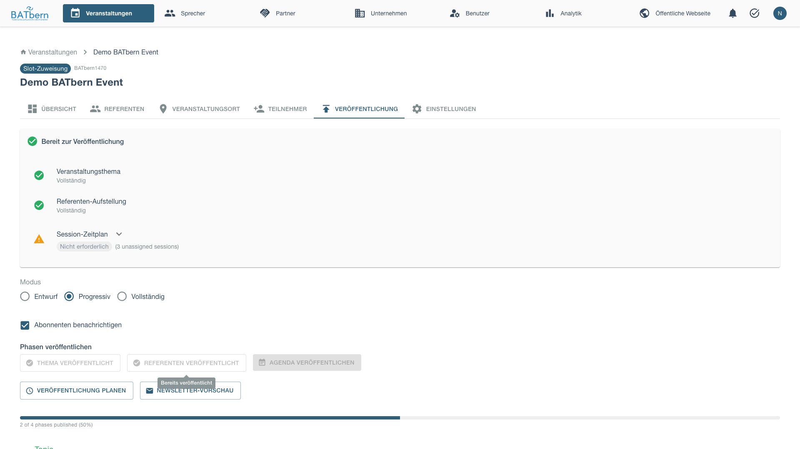
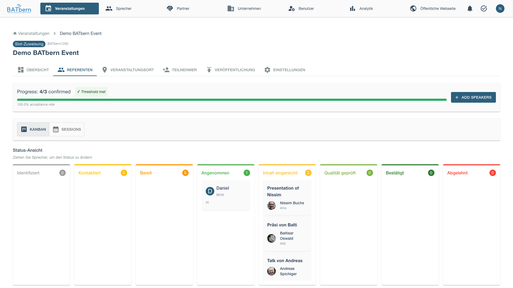

# Phase C: Quality Control (Steps 7-8)

> Review content quality and validate minimum threshold

<div class="workflow-phase phase-c">
<strong>Phase C: Quality Control</strong><br>
Status: <span class="feature-status implemented">Implemented</span><br>
Duration: 1-2 weeks<br>
Event State: SPEAKER_IDENTIFICATION (unchanged during quality review)<br>
Speaker States: content_submitted → quality_reviewed
</div>

## Overview

Phase C ensures submitted content meets quality standards before public release. Organizers review each presentation for relevance, clarity, and audience fit.

**Key Concept**: The event state remains **SPEAKER_IDENTIFICATION** during quality review. Individual speakers transition from **content_submitted** to **quality_reviewed** as their content is approved.

**Key Deliverable**: Quality-reviewed speakers ready for slot assignment in Phase D

### Publishing Speakers

Before reviewing content, publish the speakers from the Publishing tab.


After publishing speakers:



Return to the Speakers tab to begin content review:



## Step 7: Content Quality Review

<span class="feature-status implemented">Implemented</span>

### Purpose

Systematically review speaker content to ensure presentations meet BATbern quality standards.

### Acceptance Criteria

- ✅ All submitted content reviewed by at least 1 organizer
- ✅ Quality scores assigned (1-5 scale)
- ✅ Revision requests sent for insufficient content
- ✅ All speakers either APPROVED or REVISION_REQUESTED

### Quality Criteria

**Relevance** (1-5):
- Aligns with selected topic
- Appropriate for BATbern audience (architects)
- Current and applicable content

**Clarity** (1-5):
- Clear presentation structure
- Well-defined learning objectives
- Concise and understandable abstract

**Originality** (1-5):
- New perspective or insights
- Not generic/basic content
- Demonstrates expertise

**Completeness** (1-5):
- All required fields provided
- Adequate detail in abstract
- Realistic learning objectives

### How to Complete

<div class="step" data-step="1">

**Open Review Queue**

Navigate to the Speakers tab after publishing speakers. Open the quality review drawer for each presentation.


</div>

<div class="step" data-step="2">

**Review Submission**

The content review interface displays:
- Speaker name, company, and current workflow status
- Presentation title and abstract with character count
- **Uploaded materials** (if available) with download link to review presentation files
- Quality criteria checklist:
  - Abstract length ≤ 1000 characters
  - "Lessons learned" detection (English/German keywords)
  - No product promotion detected
  - Professional tone assessment
- Action buttons: [Approve] and [Reject]

</div>

<div class="step" data-step="3">

**Make Decision**

After reviewing the content, approve it to confirm the speaker.


**Approve** (score ≥ 3.5):
- Speaker status: content_submitted → **quality_reviewed**
- Event state: Still SPEAKER_IDENTIFICATION (unchanged)
- Speaker ready for slot assignment (Phase D)
- Will auto-confirm to **confirmed** when slot assigned

**Request Revision / Reject**:
- Speaker notified via email with:
  - Detailed feedback explaining what needs to change
  - **Magic link** to speaker portal (30-day validity) for easy content revision
  - Direct access to revision page without re-authentication
- Speaker content status set to REVISION_NEEDED
- Rejection feedback displayed in speaker contact history
- Re-review after speaker submits revised content

**Permanently Reject** (insufficient quality):
- Speaker marked as **withdrew**
- Activate backup candidate

</div>

<div class="step" data-step="4">

**Send Revision Request** (if needed)

When you reject content, the speaker automatically receives an email with:
- Personalized greeting thanking them for their submission
- Your feedback explaining what needs to change
- **Magic link** to the speaker portal (valid for 30 days)
- Direct access to content revision page - no login required
- Clear next steps for resubmission

The rejection feedback is also saved to the speaker's contact history, visible to all organizers in the speaker details drawer.

</div>

<div class="step" data-step="5">

**Complete Review**

Once all submissions reviewed, you're ready for Phase D (Slot Assignment).

**Note**: Event state remains **SPEAKER_IDENTIFICATION** (unchanged). Individual speakers have transitioned to **quality_reviewed** state.
</div>

### Review Best Practices

**Be Constructive**:
- Explain WHY revisions needed
- Provide specific examples
- Suggest improvements

**Consistent Standards**:
- Use same criteria for all speakers
- Multiple reviewers should calibrate scores
- Document rationale for borderline cases

**Time Management**:
- Review 2-3 submissions per day
- Don't batch all at end (spreads workload)
- Allow 1 week for speaker revisions

**Parallel Processing**:
- Quality review and slot assignment can happen in any order
- You can assign slots in Phase D before all quality reviews complete
- Speakers auto-confirm when BOTH quality_reviewed AND slot assigned (regardless of order)

## Phase C Completion

### Success Criteria

- ✅ All content reviewed and scored
- ✅ Minimum speakers at **quality_reviewed** state
- ✅ All topics have quality-reviewed speakers
- ✅ Event state = **SPEAKER_IDENTIFICATION** (unchanged - progresses in Phase D)

### What Happens Next

**Phase D: Assignment** begins:
- Quality-reviewed speakers ready for slot assignment
- Overflow management (if more speakers than slots)
- Drag-and-drop scheduling interface
- Speakers auto-confirm when assigned to slots

See [Phase D: Assignment →](phase-d-assignment.md) to continue.

## Troubleshooting Phase C

### "Too many rejections"

**Problem**: Many speakers rejected for quality issues.

**Solution**:
- Work with borderline speakers on revisions
- Activate backup candidates immediately
- Consider event scope adjustment
- Extend phase timeline if deadline allows

### "Revision requests ignored"

**Problem**: Speakers not responding to revision requests.

**Solution**:
- Follow up via phone (more personal)
- Offer to help edit content
- Set firm deadline (3 days)
- Mark as **withdrew** if no response, activate backup

### "Reviewer disagreement on quality scores"

**Problem**: Multiple reviewers score same content very differently.

**Solution**:
- Calibration meeting to align standards
- Use average of all reviewer scores
- Senior organizer breaks ties
- Document scoring guidelines for consistency

## Related Topics

- [Phase B: Outreach →](phase-b-outreach.md) - Previous phase
- [Phase D: Assignment →](phase-d-assignment.md) - Next phase
- [Speaker Management →](../entity-management/speakers.md) - Speaker content

## API Reference

```
POST /api/events/{id}/workflow/step-7     Complete Step 7 (Quality Review)
POST /api/events/{id}/workflow/step-8     Complete Step 8 (Threshold Validation)
POST /api/speakers/{id}/review            Submit quality review
GET  /api/events/{id}/quality-metrics     Get threshold status
```

See [API Documentation](../../api/) for complete specifications.
