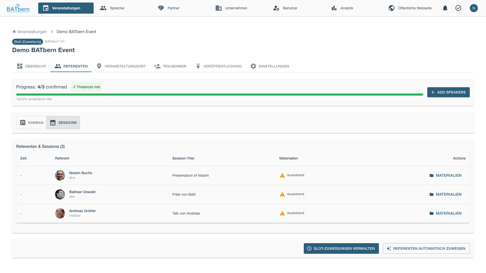
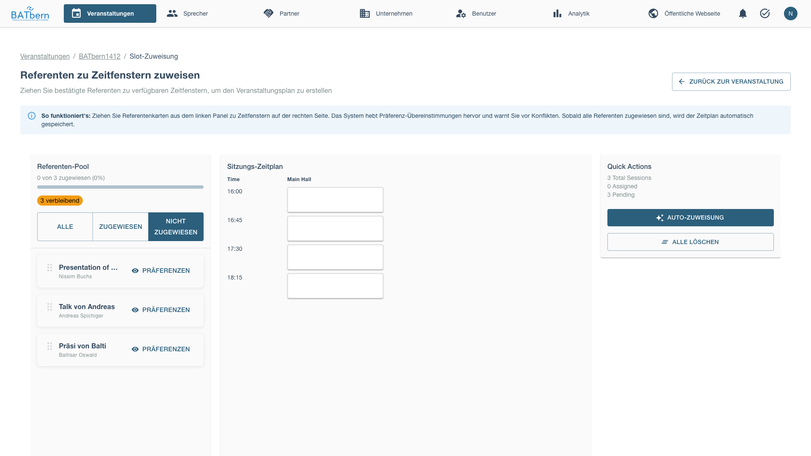
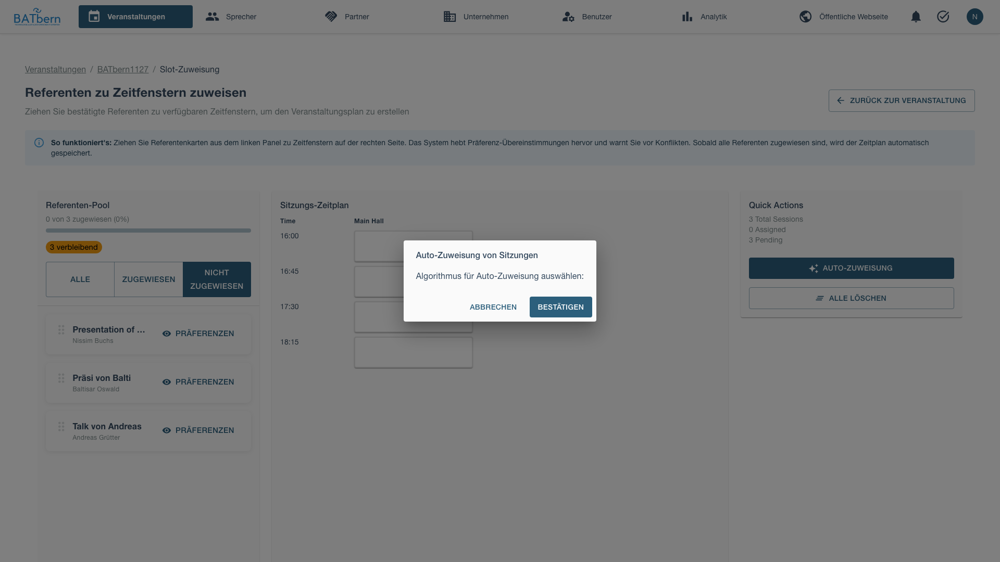
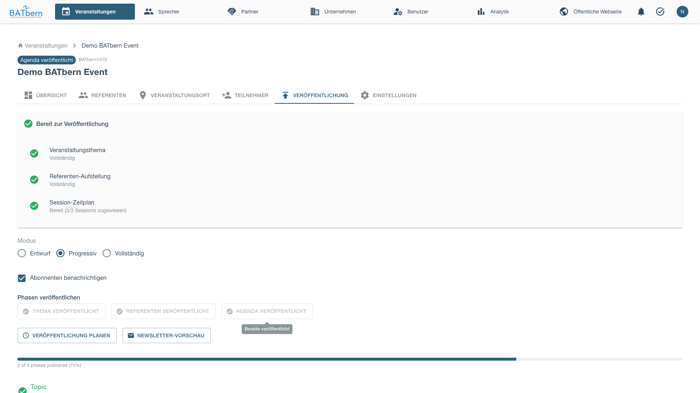

# Phase D: Assignment (Steps 9-10)

> Assign speakers to time slots and publish the agenda

<div class="workflow-phase phase-d">
<strong>Phase D: Assignment</strong><br>
Status: <span class="feature-status implemented">Implemented</span><br>
Duration: 1 week<br>
State Transitions: QUALITY_REVIEWED → SLOTS_ASSIGNED → AGENDA_PUBLISHED
</div>

## Overview

Phase D assigns approved speakers to specific time slots and publishes the finalized agenda.

**Key Deliverable**: Published event agenda with complete schedule

### Slot Assignment

Navigate to the Speakers tab and switch to Sessions view to manage slot assignments.



Click **Manage Slot Assignments** to open the assignment interface.



Use the **Auto-Assign** feature to automatically assign presentations to available slots.



### Publishing the Agenda

After assigning all sessions to slots, publish the agenda from the Publishing tab.



## Step 9: Assign Speakers to Time Slots

<span class="feature-status implemented">Implemented</span>

### Purpose

Assign approved presentations to available event time slots using the auto-assign feature.

### Acceptance Criteria

- ✅ All approved presentations assigned to slots
- ✅ Schedule conflicts resolved automatically
- ✅ Event ready for agenda publication

### How to Use Auto-Assign

The system automatically assigns presentations to available slots, balancing the schedule and avoiding conflicts.

<div class="step" data-step="1">

**Open Slot Assignment Interface**

From the Speakers tab, switch to Sessions view and click **Manage Slot Assignments**.

The slot assignment page shows all available time slots and unassigned presentations.

</div>

<div class="step" data-step="2">

**Use Auto-Assign Feature**

Click **Auto-Assign** to open the automatic assignment modal.

The system will:
- Distribute presentations across available time slots
- Balance topics across parallel tracks (if applicable)
- Avoid scheduling conflicts
- Optimize for speaker preferences (if configured)

Review the proposed assignments and confirm.

</div>

<div class="step" data-step="3">

**Manual Adjustments** (Optional)

After auto-assignment, you can manually adjust the schedule:
- Drag presentations to different slots
- Swap presentations between tracks
- Adjust timing to accommodate speaker constraints

All changes are validated to prevent conflicts.

</div>

<div class="step" data-step="4">

**Complete Slot Assignment**

Once satisfied with the schedule, save the assignments.

Event state: QUALITY_REVIEWED → **SLOTS_ASSIGNED**

</div>

## Step 10: Publish the Agenda

<span class="feature-status implemented">Implemented</span>

### Purpose

Make the finalized event agenda publicly available to attendees and stakeholders.

### How to Publish

<div class="step" data-step="1">

**Navigate to Publishing Tab**

From the event management interface, open the Publishing tab.

This tab shows all publishable content for the event (topics, speakers, agenda).

</div>

<div class="step" data-step="2">

**Publish Agenda**

Click **Publish Agenda** to make the schedule publicly visible.

The agenda publication includes:
- Complete session schedule with time slots
- Speaker assignments for each session
- Session titles and descriptions
- Track information (for multi-track events)

</div>

<div class="step" data-step="3">

**Verify Publication**

Check that the agenda appears on the public event page.

Attendees can now view:
- Full event schedule
- Session details
- Speaker information
- Track assignments

Event state: SLOTS_ASSIGNED → **AGENDA_PUBLISHED**

Phase D complete! ✅

</div>

## Phase D Completion

### Success Criteria

- ✅ All approved presentations assigned to time slots
- ✅ Schedule conflicts resolved
- ✅ Agenda published successfully
- ✅ Event state = **AGENDA_PUBLISHED**

### What Happens Next

**Phase E: Archival** (post-event):
- Event archival process
- Historical data preservation
- Reporting and analytics

See [Phase E: Publishing →](phase-e-publishing.md) for archival procedures.

## Troubleshooting Phase D

### "Auto-assign fails with scheduling conflicts"

**Problem**: Auto-assign cannot find valid assignment for all presentations.

**Solution**:
- Check for over-booking (more presentations than available slots)
- Review speaker availability constraints that may conflict
- Manually assign problematic presentations first, then auto-assign remainder
- Consider adding more time slots or removing lower-priority presentations

### "Cannot publish agenda - missing slot assignments"

**Problem**: Agenda publication blocked due to unassigned presentations.

**Solution**:
- Return to slot assignment interface
- Ensure all approved presentations have time slots
- Use auto-assign to fill remaining slots
- Verify all assignments saved before attempting publication

### "Published agenda shows incorrect schedule"

**Problem**: Public agenda doesn't match assigned slots.

**Solution**:
- Clear browser cache and refresh event page
- Verify assignments were saved correctly in slot management
- Re-publish agenda from Publishing tab
- Check that no manual edits were lost during save

## Related Topics

- [Phase C: Quality →](phase-c-quality.md) - Previous phase
- [Phase E: Publishing →](phase-e-publishing.md) - Next phase
- [Event Management →](../entity-management/events.md) - Event sessions

## API Reference

```
POST /api/events/{id}/workflow/step-9         Complete Step 9 (Slot Assignment)
POST /api/events/{id}/workflow/step-10        Complete Step 10 (Publish Agenda)
POST /api/events/{id}/sessions/auto-assign    Auto-assign presentations to slots
PUT  /api/events/{id}/sessions/{sid}/assign   Manually assign presentation to slot
GET  /api/events/{id}/schedule                 Get current schedule
POST /api/events/{id}/agenda/publish           Publish agenda
```

See [API Documentation](../../api/) for complete specifications.
