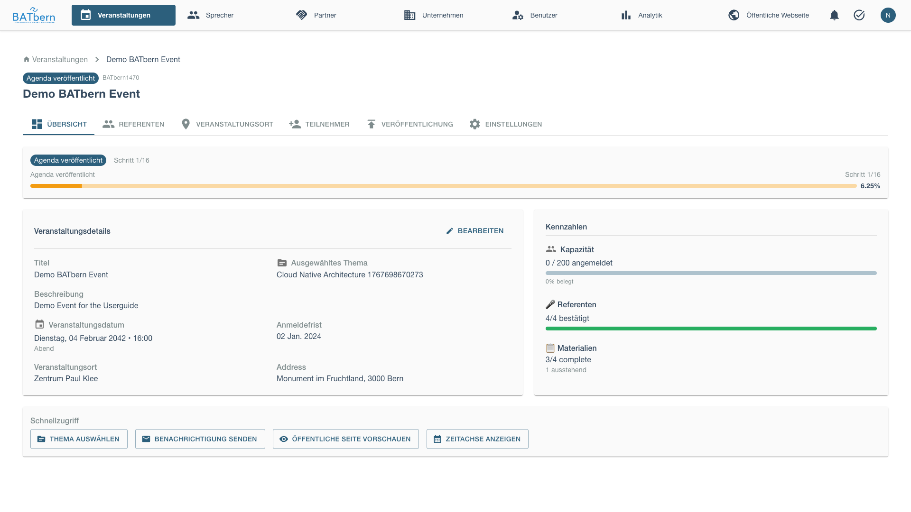
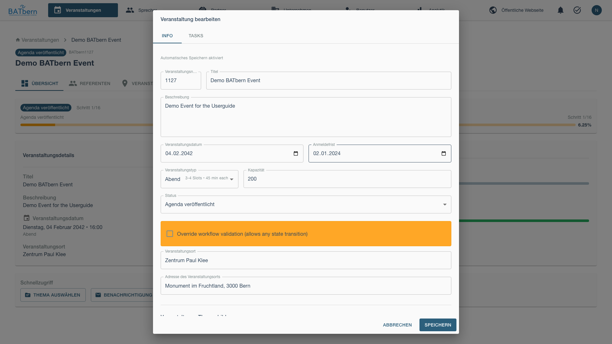
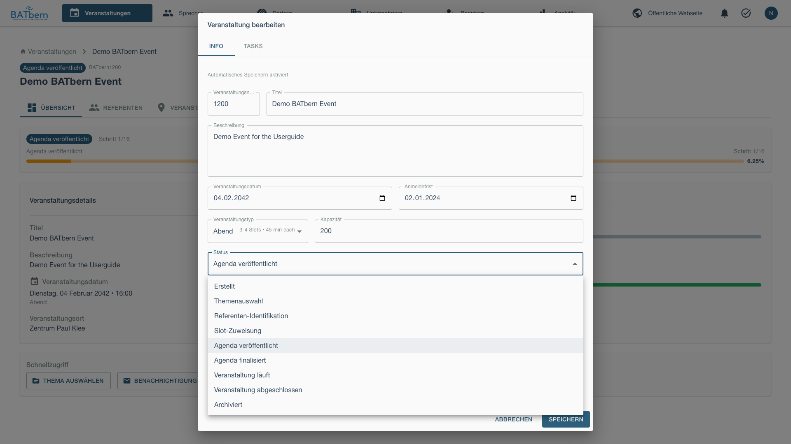
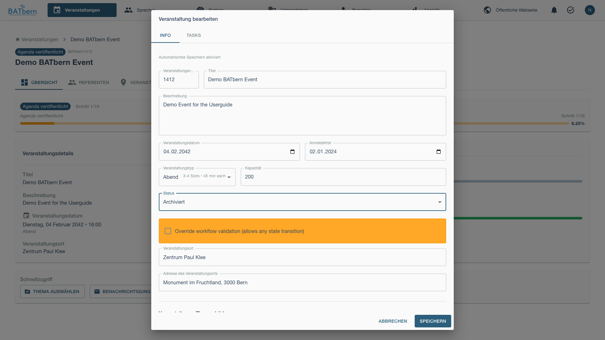
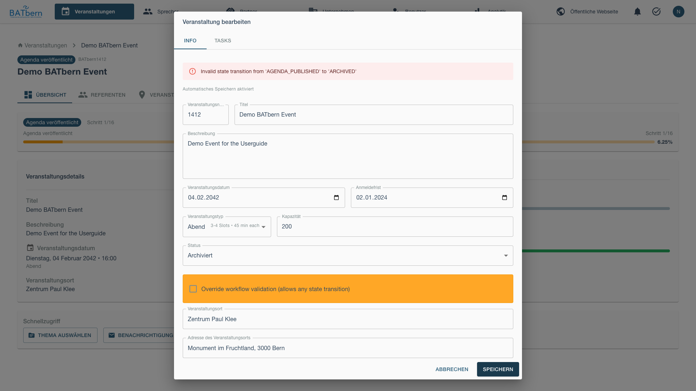
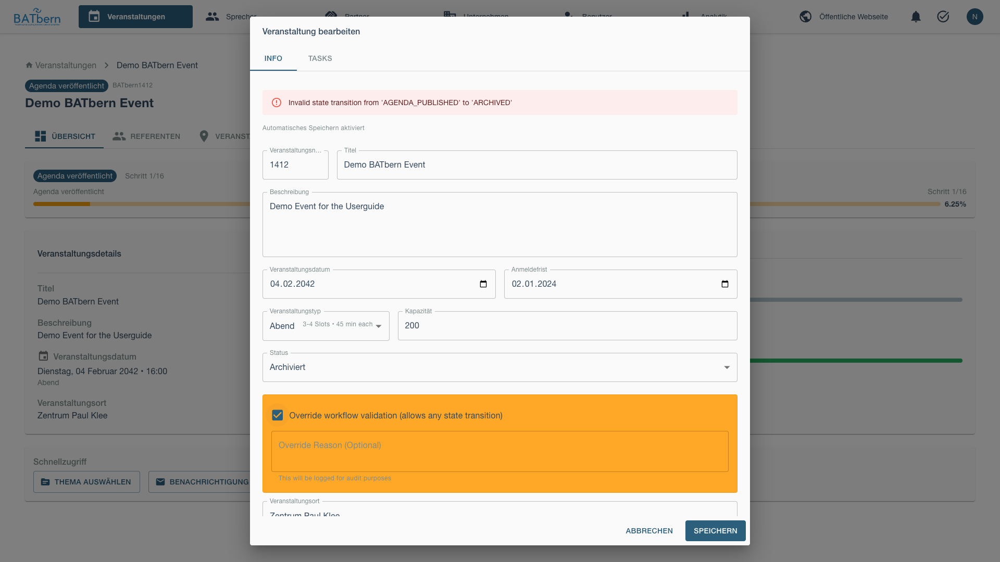
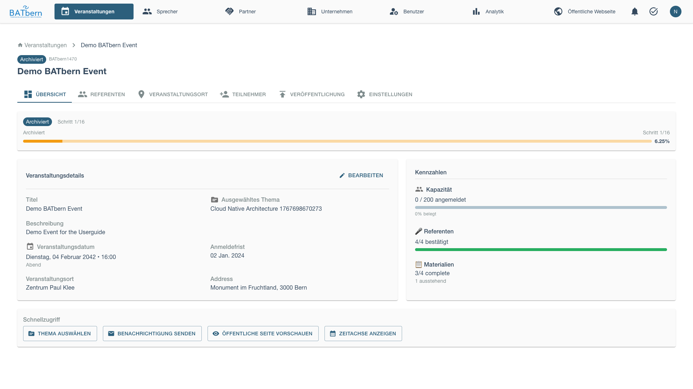

# Phase E: Archival & Publishing

> Archive completed events and manage publication workflows

<div class="workflow-phase phase-e">
<strong>Phase E: Event Lifecycle & Archival</strong><br>
Status: <span class="feature-status implemented">Implemented</span><br>
Event State Transitions: AGENDA_PUBLISHED → AGENDA_FINALIZED → EVENT_LIVE → EVENT_COMPLETED → ARCHIVED<br>
Auto-Publishing: Implemented (30-day speaker publish, 14-day agenda publish)<br>
Auto-Transitions: Implemented (EVENT_LIVE on event day, EVENT_COMPLETED after event ends)
</div>

## Overview

Phase E manages the event lifecycle from agenda finalization through execution to archival. The system includes automated publishing (speakers @ 30 days, agenda @ 14 days) and automated state transitions (EVENT_LIVE on event day, EVENT_COMPLETED after event ends).

**Key Deliverable**: Executed event with complete historical archive and automated lifecycle management

## Event Archival (Implemented)

<span class="feature-status implemented">Implemented</span>

### Purpose

Archive completed events to preserve historical data and free up the active event list for current planning.

### When to Archive

Archive events after:
- Event has concluded
- Post-event follow-up completed
- Attendee feedback collected
- All financial transactions settled

### How to Archive an Event

<div class="step" data-step="1">

**Navigate to Event Overview**

From the event dashboard, open the event you want to archive and navigate to the Overview tab.



Click the edit button to open the event configuration modal.



</div>

<div class="step" data-step="2">

**Change Status to ARCHIVED**

In the edit modal, locate the status dropdown and select **ARCHIVED**.





The system will initially show a validation error if the event hasn't completed all workflow steps.



</div>

<div class="step" data-step="3">

**Override Workflow Validation**

To archive an event that hasn't completed all workflow steps, check the **Override Workflow Validation** checkbox.



This allows archival regardless of workflow state, useful for cancelled events or special circumstances.

</div>

<div class="step" data-step="4">

**Save and Verify**

Save the changes and verify the event now shows the ARCHIVED badge.




Archived events are:
- Moved to archived events section
- Preserved for historical reference
- Excluded from active event workflows
- Available for reporting and analytics

Event state: Any workflow state → **ARCHIVED**

**Note**: Events can be archived from any state using the override validation checkbox (useful for cancelled events).

</div>

## Automated Publishing (Implemented)

<span class="feature-status implemented">Implemented</span>

### Auto-Publishing Schedule

BATbern automatically publishes event content on a fixed schedule to reduce manual work and ensure timely publication:

**Speaker Profiles** (30 days before event):
- Cron job runs daily at 00:00 UTC
- Checks all events in AGENDA_PUBLISHED or AGENDA_FINALIZED states
- For events exactly 30 days away (or past this date if not yet published):
  - Publishes all confirmed speaker profiles to public website
  - Sets speaker.publishedAt timestamp
  - Auto-creates "Newsletter: Speakers" task (if not exists)

**Full Agenda** (14 days before event):
- Cron job runs daily at 00:00 UTC
- Checks all events in AGENDA_FINALIZED state
- For events exactly 14 days away (or past this date if not yet published):
  - Publishes complete session schedule with time slots
  - Sets event.agendaPublishedAt timestamp
  - Auto-creates "Newsletter: Final" task (if not exists)

**Manual Override**:
- Organizers can manually publish speakers/agenda before auto-publish dates
- Use Publishing tab → "Publish Speakers Now" or "Publish Agenda Now"
- Prevents duplicate auto-publishing (checks publishedAt timestamps)

### Automated State Transitions (Implemented)

<span class="feature-status implemented">Implemented</span>

**EVENT_LIVE Transition** (on event day):
- Cron job runs hourly
- Checks all events in AGENDA_FINALIZED state
- For events where current date/time >= event start time:
  - Automatically transitions event to EVENT_LIVE state
  - Sends real-time notification to organizers
  - Triggers day-of-event systems (check-in, live updates)

**EVENT_COMPLETED Transition** (after event ends):
- Cron job runs hourly
- Checks all events in EVENT_LIVE state
- For events where current date/time >= event end time:
  - Automatically transitions event to EVENT_COMPLETED state
  - Sends post-event notification to organizers
  - Triggers post-event workflows (feedback collection, archival preparation)

**Configuration**:
- Auto-transitions enabled by default (can be disabled in event settings)
- Uses event.eventDate and event.eventTime for transition triggers
- Handles timezone correctly (all times stored as UTC)

### CDN Delivery (CloudFront)

Published content is served through **AWS CloudFront CDN** for low-latency delivery:

- Speaker photos, presentation materials, and event assets are stored in S3 and delivered via CloudFront (< 50 ms typical latency)
- Cache invalidation is triggered automatically when new content is published — on the auto-publish schedule and on manual publish
- Changes to speaker profiles or the agenda reach the public website within seconds of the publish job completing

### Archival Best Practices

**When to Archive**:
- Immediately after post-event activities complete
- Typically 1-2 weeks after event date
- After attendee feedback window closes

**What Gets Preserved**:
- Complete event configuration
- All speaker and presentation data
- Slot assignments and schedule
- Participant lists and attendance records
- Quality reviews and ratings

**Archival vs. Deletion**:
- ✅ Archive: Preserves all data, supports historical analysis
- ❌ Delete: Permanent removal, loses historical context
- Prefer archival to maintain 20+ year event history

---

## Agenda Finalization

<span class="feature-status implemented">Implemented</span>

### Purpose

Lock the final agenda approximately 2 weeks before the event to allow for printing and final communications.

### When to Finalize

Typically 14 days before the event, after:
- All speakers confirmed and reconfirmed
- All slot assignments complete
- Any last-minute dropouts resolved
- Ready to send to printer

### How to Finalize

<div class="step" data-step="1">

**Review Agenda Completeness**

Verify all slots filled and all speakers confirmed (quality_reviewed AND slot assigned = confirmed state).

</div>

<div class="step" data-step="2">

**Finalize Agenda**

In the event edit modal, advance event state from AGENDA_PUBLISHED to **AGENDA_FINALIZED**.

Event state: AGENDA_PUBLISHED → **AGENDA_FINALIZED**

**Auto-created Tasks**:
- Newsletter: Final (due: 14 days before event)
- Catering (due: 30 days before event)

</div>

<div class="step" data-step="3">

**Automatic Publishing Triggers**

Once finalized, the 14-day auto-publish countdown begins:
- System will auto-publish full agenda at 00:00 UTC 14 days before event
- Or you can manually publish immediately via Publishing tab

</div>

## Progressive Publishing

The auto-publishing schedule (speakers at 30 days, agenda at 14 days) handles the standard release timeline automatically. The controls below allow organizers to publish earlier or override the default schedule for special cases.

### Purpose

Control publishing timing when the automated 30/14-day schedule doesn't fit — for example, publishing speakers sooner to build anticipation, or delaying if late-breaking changes are expected.

### Manual Publishing Options

### Publishing Strategy

**Progressive Release Timeline**:

| When | What Published | Why |
|------|----------------|-----|
| **4 weeks before** | Event date, venue, registration | Open registration early |
| **3 weeks before** | Topic list | Build interest, no speaker commitment yet |
| **2 weeks before** | Speaker names and bios | Confirm speakers before announcing |
| **1 week before** | Complete schedule | Final agenda with time slots |

**Benefits**:
- Speakers have time to withdraw before public announcement
- Organizers can adjust topics if needed
- Marketing can build gradually
- Reduces last-minute changes to published agenda

### How to Complete

<div class="step" data-step="1">

**Stage 1: Event Basics** (4 weeks before)

Publish core event information:

```
[Publish Event Basics]

Public Information:
✅ Event name: "BATbern 2025"
✅ Date: March 15, 2025
✅ Time: 9:00 - 18:00
✅ Venue: Kursaal Bern
✅ Event type: Full-Day Conference
✅ Registration link: Active

Hidden:
⏸️ Topics (not yet published)
⏸️ Speakers (not yet published)
⏸️ Schedule (not yet published)

[Publish to Website]
```

Event landing page goes live at: `https://www.batbern.ch/events/batbern-2025`
</div>

<div class="step" data-step="2">

**Stage 2: Topics** (3 weeks before)

Publish selected topics:

```
[Publish Topics]

Topics for BATbern 2025:
✅ Sustainable Building Materials
✅ Digital Transformation in Architecture
✅ Urban Planning Innovations
✅ Heritage Adaptive Reuse
... (8 more)

Speakers: "Coming soon - Stay tuned!"

[Publish Topics]
```

Topics appear on event page, no speaker names yet.
</div>

<div class="step" data-step="3">

**Stage 3: Speakers** (2 weeks before)

Publish speaker profiles:

```
[Publish Speaker Profiles]

Confirm all speakers before publishing:
✅ Hans Müller - Last confirmation: 2 days ago
✅ Anna Schmidt - Last confirmation: 1 day ago
✅ Peter Weber - Last confirmation: 3 days ago
... (9 more)

⚠️ All speakers must confirm availability within 7 days

[Publish All Speakers]
```

Speaker directory goes live with photos, bios, and session titles.
</div>

<div class="step" data-step="4">

**Stage 4: Complete Agenda** (1 week before)

Publish full schedule:

```
[Publish Complete Agenda]

Full Schedule:
────────────────────────────────────────────────
09:00-09:45
Track A: Hans Müller - Sustainable Materials
Track B: Anna Schmidt - Digital Transformation

10:00-10:45
Track A: Peter Weber - Urban Planning
Track B: Martin Fischer - Heritage Reuse

[Continue for all sessions...]

[Publish Full Agenda]
```

Complete schedule with time slots appears on event page.

Event state: SLOT_ASSIGNMENT → **AGENDA_PUBLISHED**
</div>

### Website Preview

Public event page shows:

```
════════════════════════════════════════════════
BATbern 2025
Full-Day Conference | March 15, 2025 | Kursaal Bern
════════════════════════════════════════════════

[Register Now] - 45 days until event

────────────────────────────────────────────────
About This Event

Join 300+ architects for a full day of insights on...

Topics:
• Sustainable Building Materials
• Digital Transformation
• Urban Planning Innovations
• Heritage Adaptive Reuse
... and 8 more

────────────────────────────────────────────────
Speakers (12)

[Photo] Hans Müller
        Müller Architekten AG
        "Innovations in Sustainable Building Materials"
        [View Profile]

[Photo] Anna Schmidt
        Schmidt & Partner
        "Digital Transformation in Architecture"
        [View Profile]

... (10 more speakers)

────────────────────────────────────────────────
Schedule

09:00-09:45  Opening Sessions
[Track A] Hans Müller - Sustainable Materials
[Track B] Anna Schmidt - Digital Transformation

10:00-10:45  Morning Sessions
[Track A] Peter Weber - Urban Planning
[Track B] Martin Fischer - Heritage Reuse

[View Full Schedule]

────────────────────────────────────────────────
[Register Now]
````
</div>

### Publishing Notifications

Stakeholder communication at each publishing stage is handled through the **Task System** — the newsletter task templates (Newsletter: Topic, Newsletter: Speakers, Newsletter: Final) are automatically created at the relevant event state transitions and assigned to organizers for action. See [Task Templates](../administration/task-templates.md) for configuration.

Notify stakeholders at each stage:

**Registration Opened** (Stage 1):
- Email to all users: "Registration now open!"
- Social media announcement
- Partner notification

**Topics Announced** (Stage 2):
- Email to registered attendees
- Social media teaser
- Blog post

**Speakers Revealed** (Stage 3):
- Email to all with speaker highlights
- Social media speaker spotlights (1 per day)
- Press release

**Full Agenda Published** (Stage 4):
- Final email with complete schedule
- Downloadable PDF agenda
- Mobile app update (if available)

## Dropout Handling

### Purpose

Lock the final agenda while managing any last-minute speaker withdrawals.

### Acceptance Criteria

- ✅ All speakers reconfirmed within 1 week of event
- ✅ Dropout procedures executed (if needed)
- ✅ Agenda finalized and locked
- ✅ Event state = **AGENDA_FINALIZED**

### Reconfirmation Process

<div class="step" data-step="1">

**Send Reconfirmation Request** (1 week before)

Email all speakers:

```
To: hans.mueller@example.com
Subject: Final Confirmation - BATbern 2025 (1 week away!)

Hi Hans,

BATbern 2025 is one week away! Please confirm you're ready:

Your Session:
- Date: March 15, 2025
- Time: 09:00-09:45 (Track A)
- Topic: "Innovations in Sustainable Building Materials"
- Duration: 45 minutes (30 min talk + 15 min Q&A)

Please confirm by clicking:
[Yes, I'm Ready!] [I Need to Withdraw]

If confirming, please also confirm:
☐ Presentation slides ready (send by March 13)
☐ Technical requirements submitted
☐ Travel/accommodation arranged

See you next week!
Anna Schmidt
```
</div>

<div class="step" data-step="2">

**Track Confirmations**

Monitor response status:

```
Final Confirmation Status
────────────────────────────────────────
Deadline: March 8, 2025 (7 days before event)

Confirmed: 10 / 12 (83%) ✅
Pending: 2 / 12 (17%) ⚠️
  - Peter Weber (last contact: 3 days ago)
  - Lisa Meier (last contact: 5 days ago)

Dropout: 0

[Send Reminder to Pending]
```
</div>

<div class="step" data-step="3">

**Handle Dropouts** (if occur)

If speaker withdraws after publication:

```
⚠️ Dropout Alert

Martin Fischer withdrew (March 8, 2025)
Session: Heritage Adaptive Reuse (11:00-11:45 Track B)
Reason: "Family emergency"

Impact: 1 session affected, 1 week before event

Options:
1. [Promote Waitlist Speaker]
   Sophie Keller - Similar topic available

2. [Reassign Existing Speaker]
   Hans Müller could present second session

3. [Cancel Session]
   Reduce to 11 sessions, adjust schedule

4. [Merge Sessions]
   Combine with similar topic, extend duration

[Choose Option]
```
</div>

<div class="step" data-step="4">

**Option 1: Promote Waitlist Speaker**

Contact waitlist speaker immediately:

```
To: sophie.keller@example.com
Subject: URGENT: Speaker Slot Available - BATbern 2025

Hi Sophie,

A speaker slot has opened for BATbern 2025 (March 15).

Session Details:
- Topic: Heritage Adaptive Reuse
- Time: 11:00-11:45 (Track B)
- Notice: 6 days (expedited preparation)

Your waitlisted presentation "Circular Economy in Construction"
fits well. Are you available?

Please respond within 24 hours.

Urgently,
Anna Schmidt
```

If accepted:
- Update agenda immediately
- Notify registered attendees of change
- Update printed materials if not yet produced
</div>

<div class="step" data-step="5">

**Option 2/3/4: Adjust Schedule**

If no replacement available:

**Cancel Session**:
- Update online agenda
- Send attendee notification
- Adjust printed programs
- Offer partial refund if significant change

**Reassign or Merge**:
- Adjust affected speaker's content
- Update agenda and notify attendees
- Ensure quality maintained
</div>

<div class="step" data-step="6">

**Finalize Agenda**

Once all speakers confirmed and dropouts resolved:

```
[Finalize Agenda]

Final Status:
────────────────────────────────────────
Total Sessions: 12
Confirmed Speakers: 12 ✅
Dropouts Resolved: 1 (Sophie Keller replacement) ✅
Last Change: March 8, 2025

Lock agenda? After locking:
- No further changes allowed
- Printed materials can be produced
- Final attendee notification sent

[Lock Agenda] [Cancel]
```

Click **Lock Agenda**

Event state: AGENDA_PUBLISHED → **AGENDA_FINALIZED**

Phase E complete! ✅ The event will automatically transition to EVENT_LIVE when the event day arrives.
</div>

### Dropout Communication

**To Registered Attendees**:
```
Subject: Schedule Update - BATbern 2025

Hi [Attendee],

A schedule update for BATbern 2025:

Changed Session:
- Was: Martin Fischer - "Heritage Adaptive Reuse"
- Now: Sophie Keller - "Circular Economy in Construction"
- Time: 11:00-11:45 Track B (unchanged)

All other sessions remain as published.

See updated schedule: [link]

Thank you for your understanding!
BATbern Team
```

**To Dropout Speaker**:
```
Subject: Thank You - BATbern 2025

Hi Martin,

Thank you for letting us know about your situation.
We completely understand and hope everything is okay.

We'd love to have you present at a future BATbern event.
I'll reach out in a few months about BATbern 2026.

Best wishes,
Anna
```

## Phase E Completion

### Success Criteria (Complete Lifecycle)

- ✅ Agenda finalized (AGENDA_FINALIZED state)
- ✅ Auto-publishing configured (speakers @ 30 days, agenda @ 14 days)
- ✅ Event executed successfully (EVENT_LIVE → EVENT_COMPLETED auto-transitions)
- ✅ Post-event activities completed
- ✅ Event archived (ARCHIVED state)
- ✅ Historical data preserved

### What Happens Next

After archival:
- Event removed from active workflows
- Data available for historical reporting
- Heat map data updated with event statistics
- Event serves as reference for future planning

## Troubleshooting Phase E

### "Cannot archive - workflow validation error"

**Problem**: System prevents archiving because workflow steps incomplete.

**Solution**:
- Check **Override Workflow Validation** checkbox in edit modal
- This allows archival for cancelled events or special cases
- Verify all important data is preserved before archiving

### "Archived event still appears in active list"

**Problem**: Event shows ARCHIVED badge but remains in active events.

**Solution**:
- Refresh the page to update the event list
- Check that status was saved correctly (re-open edit modal)
- Clear browser cache if issue persists
- Verify event state in database if problem continues

### "Need to un-archive an event"

**Problem**: Event was archived prematurely or by mistake.

**Solution**:
- Re-open the event edit modal
- Change status back to appropriate workflow state (e.g., AGENDA_PUBLISHED)
- Uncheck override validation if needed
- Save changes to restore event to active status

## Related Topics

- [Phase D: Assignment →](phase-d-assignment.md) - Previous phase
- [Event Management →](../entity-management/events.md) - Event configuration and status
- [Screenshot Index →](../appendix/screenshot-index.md) - All workflow screenshots

## API Reference

```
PUT  /api/events/{id}/status                Update event status (including ARCHIVED)
GET  /api/events?status=ARCHIVED            List archived events
GET  /api/events/{id}/history               Get event workflow history
POST /api/events/{id}/restore               Restore archived event to active status
```

See [API Documentation](../../api/) for complete specifications.
