# BATbern Event Management Platform - Site Map (Mermaid Diagrams)

**Generated:** 2026-01-25
**Version:** 2.0 (MVP Completion Update)
**Purpose:** Visual representation of actual MVP implementation (Epics 1-5) and Phase 2+ deferrals

---

## Legend

### Status & Implementation Colors
- 🟢 **Green** - ✅ IMPLEMENTED IN MVP (Epics 1-5)
- 🔵 **Blue** - 🔄 PARTIAL/PLACEHOLDER (basic implementation, full features deferred)
- 🟡 **Yellow** - 📦 DEFERRED TO EPIC 6 (Speaker Self-Service Portal)
- 🟠 **Orange** - 📦 DEFERRED TO EPIC 7 (Attendee Experience Enhancements)
- 🟣 **Purple** - 📦 DEFERRED TO EPIC 8 (Partner Analytics & Voting)
- 🔴 **Red** - ❌ NOT IMPLEMENTED IN MVP (planned but not built)

### Role Indicators
- 🎯 Organizer
- 💼 Partner
- 🎤 Speaker
- 👤 Attendee
- 🌐 Public/Global

---

## 1. Platform Architecture Overview (MVP Reality)

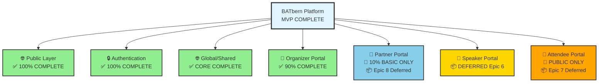
```mermaid
graph TB
    Root[BATbern Platform<br/>MVP COMPLETE]

    Root --> Public[🌐 Public Layer<br/>✅ 100% COMPLETE]
    Root --> Auth[🔒 Authentication<br/>✅ 100% COMPLETE]
    Root --> Global[🌐 Global/Shared<br/>✅ CORE COMPLETE]
    Root --> Organizer[🎯 Organizer Portal<br/>✅ 90% COMPLETE]
    Root --> Partner[💼 Partner Portal<br/>🔄 10% BASIC ONLY<br/>📦 Epic 8 Deferred]
    Root --> Speaker[🎤 Speaker Portal<br/>📦 DEFERRED Epic 6]
    Root --> Attendee[👤 Attendee Portal<br/>🔄 PUBLIC ONLY<br/>📦 Epic 7 Deferred]

    style Root fill:#e1f5ff,stroke:#333,stroke-width:3px
    style Public fill:#90EE90,stroke:#333,stroke-width:2px
    style Auth fill:#90EE90,stroke:#333,stroke-width:2px
    style Global fill:#90EE90,stroke:#333,stroke-width:2px
    style Organizer fill:#90EE90,stroke:#333,stroke-width:2px
    style Partner fill:#87CEEB,stroke:#333,stroke-width:2px
    style Speaker fill:#FFD700,stroke:#333,stroke-width:2px
    style Attendee fill:#FFA500,stroke:#333,stroke-width:2px
```

---

## 2. Public Layer & Authentication (✅ 100% IMPLEMENTED)

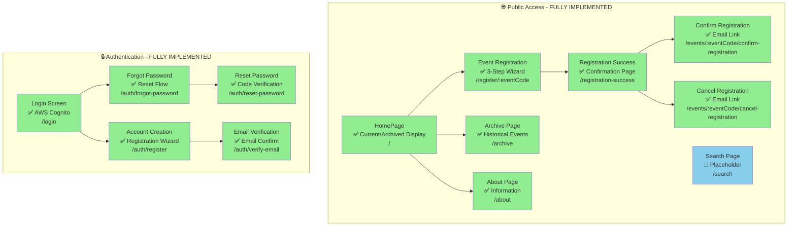
```mermaid
graph TB
    subgraph "🌐 Public Access - FULLY IMPLEMENTED"
        Homepage[HomePage<br/>✅ Current/Archived Display<br/>/]
        Registration[Event Registration<br/>✅ 3-Step Wizard<br/>/register/:eventCode]
        RegSuccess[Registration Success<br/>✅ Confirmation Page<br/>/registration-success]
        ConfirmReg[Confirm Registration<br/>✅ Email Link<br/>/events/:eventCode/confirm-registration]
        CancelReg[Cancel Registration<br/>✅ Email Link<br/>/events/:eventCode/cancel-registration]
        Archive[Archive Page<br/>✅ Historical Events<br/>/archive]
        About[About Page<br/>✅ Information<br/>/about]
        Search[Search Page<br/>🔄 Placeholder<br/>/search]
    end

    subgraph "🔒 Authentication - FULLY IMPLEMENTED"
        Login[Login Screen<br/>✅ AWS Cognito<br/>/login]
        Forgot[Forgot Password<br/>✅ Reset Flow<br/>/auth/forgot-password]
        ResetPwd[Reset Password<br/>✅ Code Verification<br/>/auth/reset-password]
        CreateAcct[Account Creation<br/>✅ Registration Wizard<br/>/auth/register]
        Verify[Email Verification<br/>✅ Email Confirm<br/>/auth/verify-email]
    end

    Homepage --> Registration
    Homepage --> Archive
    Homepage --> About
    Registration --> RegSuccess
    RegSuccess --> ConfirmReg
    RegSuccess --> CancelReg

    Login --> Forgot
    Forgot --> ResetPwd
    Login --> CreateAcct
    CreateAcct --> Verify

    style Homepage fill:#90EE90
    style Registration fill:#90EE90
    style RegSuccess fill:#90EE90
    style ConfirmReg fill:#90EE90
    style CancelReg fill:#90EE90
    style Archive fill:#90EE90
    style About fill:#90EE90
    style Search fill:#87CEEB
    style Login fill:#90EE90
    style Forgot fill:#90EE90
    style ResetPwd fill:#90EE90
    style CreateAcct fill:#90EE90
    style Verify fill:#90EE90
```

### 2.1 Public Features NOT Implemented

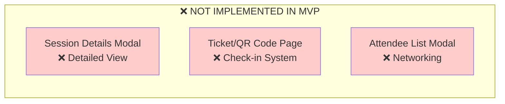
```mermaid
graph LR
    subgraph "❌ NOT IMPLEMENTED IN MVP"
        SessionModal[Session Details Modal<br/>❌ Detailed View]
        QRCode[Ticket/QR Code Page<br/>❌ Check-in System]
        AttendeeList[Attendee List Modal<br/>❌ Networking]
    end

    style SessionModal fill:#ffcccc
    style QRCode fill:#ffcccc
    style AttendeeList fill:#ffcccc
```

---

## 3. Global/Shared Screens (✅ CORE COMPLETE)

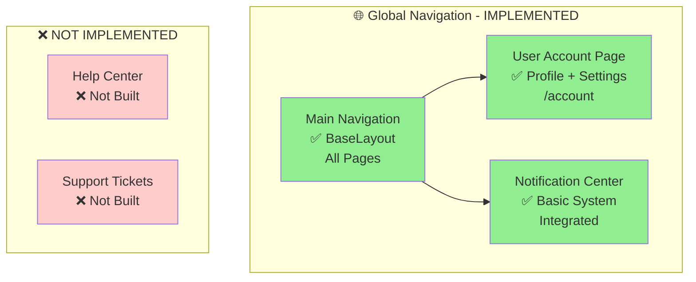
```mermaid
graph TB
    subgraph "🌐 Global Navigation - IMPLEMENTED"
        Nav[Main Navigation<br/>✅ BaseLayout<br/>All Pages]
        Account[User Account Page<br/>✅ Profile + Settings<br/>/account]
        Notifications[Notification Center<br/>✅ Basic System<br/>Integrated]
    end

    Nav --> Account
    Nav --> Notifications

    subgraph "❌ NOT IMPLEMENTED"
        Help[Help Center<br/>❌ Not Built]
        Support[Support Tickets<br/>❌ Not Built]
    end

    style Nav fill:#90EE90
    style Account fill:#90EE90
    style Notifications fill:#90EE90
    style Help fill:#ffcccc
    style Support fill:#ffcccc
```

---

## 4. Organizer Portal - Complete Structure (✅ 90% IMPLEMENTED)

### 4.1 Main Dashboard Hub

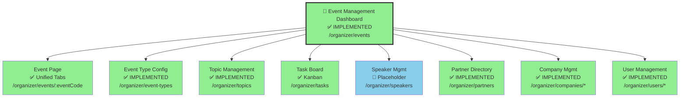
```mermaid
graph TB
    Dashboard[🎯 Event Management Dashboard<br/>✅ IMPLEMENTED<br/>/organizer/events]

    Dashboard --> EventPage[Event Page<br/>✅ Unified Tabs<br/>/organizer/events/:eventCode]
    Dashboard --> EventTypes[Event Type Config<br/>✅ IMPLEMENTED<br/>/organizer/event-types]
    Dashboard --> Topics[Topic Management<br/>✅ IMPLEMENTED<br/>/organizer/topics]
    Dashboard --> Tasks[Task Board<br/>✅ Kanban<br/>/organizer/tasks]
    Dashboard --> Speakers[Speaker Mgmt<br/>🔄 Placeholder<br/>/organizer/speakers]
    Dashboard --> Partners[Partner Directory<br/>✅ IMPLEMENTED<br/>/organizer/partners]
    Dashboard --> Companies[Company Mgmt<br/>✅ IMPLEMENTED<br/>/organizer/companies/*]
    Dashboard --> Users[User Management<br/>✅ IMPLEMENTED<br/>/organizer/users/*]

    style Dashboard fill:#90EE90,stroke:#333,stroke-width:3px
    style EventPage fill:#90EE90
    style EventTypes fill:#90EE90
    style Topics fill:#90EE90
    style Tasks fill:#90EE90
    style Speakers fill:#87CEEB
    style Partners fill:#90EE90
    style Companies fill:#90EE90
    style Users fill:#90EE90
```

### 4.2 Event Management Section (✅ FULLY IMPLEMENTED)

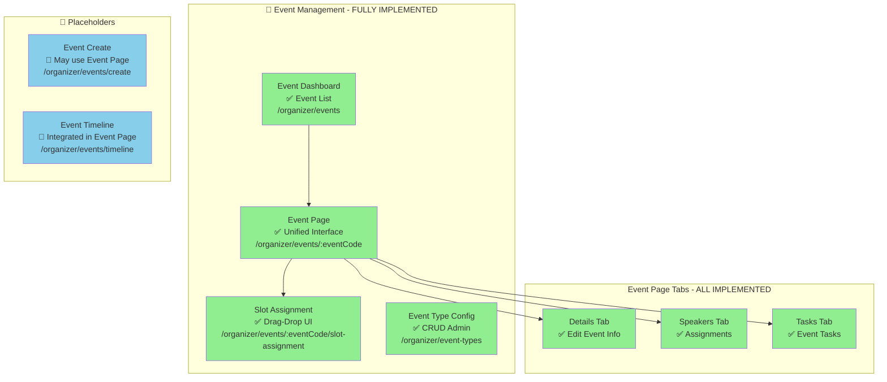
```mermaid
graph TB
    subgraph "🎯 Event Management - FULLY IMPLEMENTED"
        EventDash[Event Dashboard<br/>✅ Event List<br/>/organizer/events]
        EventPage[Event Page<br/>✅ Unified Interface<br/>/organizer/events/:eventCode]
        SlotAssign[Slot Assignment<br/>✅ Drag-Drop UI<br/>/organizer/events/:eventCode/slot-assignment]
        EventTypes[Event Type Config<br/>✅ CRUD Admin<br/>/organizer/event-types]
    end

    subgraph "Event Page Tabs - ALL IMPLEMENTED"
        DetailTab[Details Tab<br/>✅ Edit Event Info]
        SpeakerTab[Speakers Tab<br/>✅ Assignments]
        TaskTab[Tasks Tab<br/>✅ Event Tasks]
    end

    subgraph "🔄 Placeholders"
        EventCreate[Event Create<br/>🔄 May use Event Page<br/>/organizer/events/create]
        EventTimeline[Event Timeline<br/>🔄 Integrated in Event Page<br/>/organizer/events/timeline]
    end

    EventDash --> EventPage
    EventPage --> SlotAssign
    EventPage --> DetailTab
    EventPage --> SpeakerTab
    EventPage --> TaskTab

    style EventDash fill:#90EE90
    style EventPage fill:#90EE90
    style SlotAssign fill:#90EE90
    style EventTypes fill:#90EE90
    style DetailTab fill:#90EE90
    style SpeakerTab fill:#90EE90
    style TaskTab fill:#90EE90
    style EventCreate fill:#87CEEB
    style EventTimeline fill:#87CEEB
```

### 4.3 Topic & Task Management (✅ FULLY IMPLEMENTED)

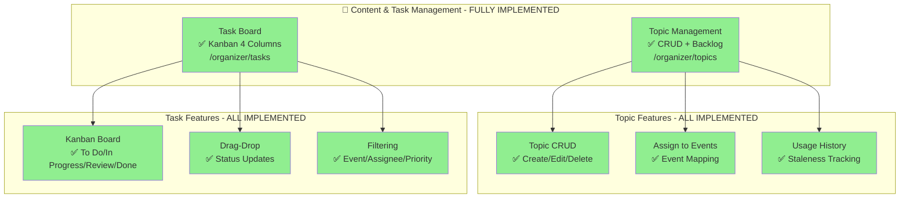
```mermaid
graph TB
    subgraph "🎯 Content & Task Management - FULLY IMPLEMENTED"
        Topics[Topic Management<br/>✅ CRUD + Backlog<br/>/organizer/topics]
        Tasks[Task Board<br/>✅ Kanban 4 Columns<br/>/organizer/tasks]
    end

    subgraph "Topic Features - ALL IMPLEMENTED"
        TopicCRUD[Topic CRUD<br/>✅ Create/Edit/Delete]
        TopicAssign[Assign to Events<br/>✅ Event Mapping]
        TopicHistory[Usage History<br/>✅ Staleness Tracking]
    end

    subgraph "Task Features - ALL IMPLEMENTED"
        TaskBoard[Kanban Board<br/>✅ To Do/In Progress/Review/Done]
        TaskDrag[Drag-Drop<br/>✅ Status Updates]
        TaskFilter[Filtering<br/>✅ Event/Assignee/Priority]
    end

    Topics --> TopicCRUD
    Topics --> TopicAssign
    Topics --> TopicHistory
    Tasks --> TaskBoard
    Tasks --> TaskDrag
    Tasks --> TaskFilter

    style Topics fill:#90EE90
    style Tasks fill:#90EE90
    style TopicCRUD fill:#90EE90
    style TopicAssign fill:#90EE90
    style TopicHistory fill:#90EE90
    style TaskBoard fill:#90EE90
    style TaskDrag fill:#90EE90
    style TaskFilter fill:#90EE90
```

### 4.4 Company & User Management (✅ FULLY IMPLEMENTED)

```mermaid
graph TB
    subgraph "🎯 Company & User Management - FULLY IMPLEMENTED"
        Companies[Company Management<br/>✅ Nested Routing<br/>/organizer/companies/*]
        Users[User Management<br/>✅ Nested Routing<br/>/organizer/users/*]
        Partners[Partner Directory<br/>✅ List + Detail<br/>/organizer/partners]
        PartnerDetail[Partner Detail<br/>✅ Full View<br/>/organizer/partners/:companyName]
    end

    subgraph "Company Features - ALL IMPLEMENTED"
        CompanyCRUD[Company CRUD<br/>✅ Create/Edit/Delete]
        LogoUpload[Logo Upload<br/>✅ S3 Presigned URLs]
        UIDVerify[Swiss UID Verify<br/>✅ Validation]
        PartnerToggle[Partner Status<br/>✅ Toggle]
    end

    subgraph "User Features - ALL IMPLEMENTED"
        UserList[User List<br/>✅ Search/Filter]
        UserDetail[User Detail<br/>✅ With userId]
        RoleMgmt[Role Management<br/>✅ Assign Roles]
        CompanyAssoc[Company Association<br/>✅ Link Users]
    end

    Companies --> CompanyCRUD
    Companies --> LogoUpload
    Companies --> UIDVerify
    Companies --> PartnerToggle

    Users --> UserList
    Users --> UserDetail
    Users --> RoleMgmt
    Users --> CompanyAssoc

    Partners --> PartnerDetail

    style Companies fill:#90EE90
    style Users fill:#90EE90
    style Partners fill:#90EE90
    style PartnerDetail fill:#90EE90
    style CompanyCRUD fill:#90EE90
    style LogoUpload fill:#90EE90
    style UIDVerify fill:#90EE90
    style PartnerToggle fill:#90EE90
    style UserList fill:#90EE90
    style UserDetail fill:#90EE90
    style RoleMgmt fill:#90EE90
    style CompanyAssoc fill:#90EE90
```

### 4.5 Organizer Features NOT Implemented

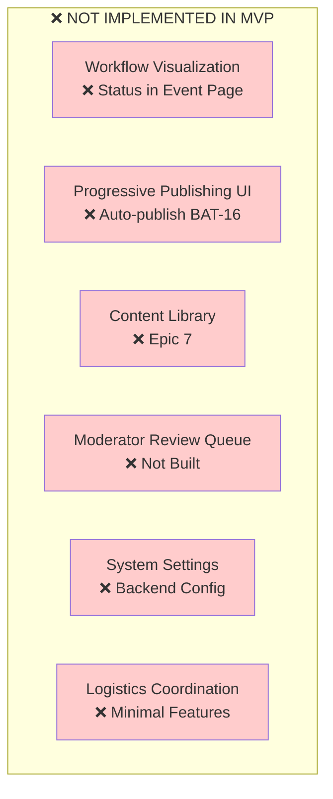
```mermaid
graph TB
    subgraph "❌ NOT IMPLEMENTED IN MVP"
        WorkflowViz[Workflow Visualization<br/>❌ Status in Event Page]
        ProgressivePub[Progressive Publishing UI<br/>❌ Auto-publish BAT-16]
        ContentLib[Content Library<br/>❌ Epic 7]
        ModQueue[Moderator Review Queue<br/>❌ Not Built]
        SysSettings[System Settings<br/>❌ Backend Config]
        Logistics[Logistics Coordination<br/>❌ Minimal Features]
    end

    style WorkflowViz fill:#ffcccc
    style ProgressivePub fill:#ffcccc
    style ContentLib fill:#ffcccc
    style ModQueue fill:#ffcccc
    style SysSettings fill:#ffcccc
    style Logistics fill:#ffcccc
```

---

## 5. Partner Portal (🔄 10% BASIC - Epic 8 Deferred)

### 5.1 What Was Implemented (Basic)

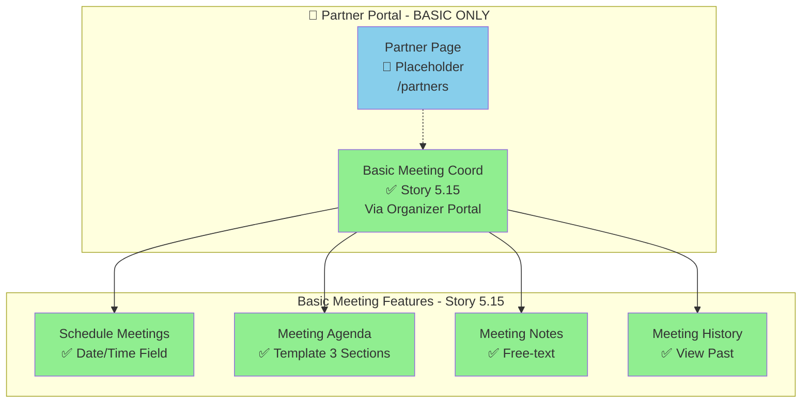
```mermaid
graph TB
    subgraph "💼 Partner Portal - BASIC ONLY"
        PartnerPage[Partner Page<br/>🔄 Placeholder<br/>/partners]
        BasicMeeting[Basic Meeting Coord<br/>✅ Story 5.15<br/>Via Organizer Portal]
    end

    subgraph "Basic Meeting Features - Story 5.15"
        Schedule[Schedule Meetings<br/>✅ Date/Time Field]
        Agenda[Meeting Agenda<br/>✅ Template 3 Sections]
        Notes[Meeting Notes<br/>✅ Free-text]
        History[Meeting History<br/>✅ View Past]
    end

    PartnerPage -.-> BasicMeeting
    BasicMeeting --> Schedule
    BasicMeeting --> Agenda
    BasicMeeting --> Notes
    BasicMeeting --> History

    style PartnerPage fill:#87CEEB
    style BasicMeeting fill:#90EE90
    style Schedule fill:#90EE90
    style Agenda fill:#90EE90
    style Notes fill:#90EE90
    style History fill:#90EE90
```

### 5.2 What Was Deferred (Epic 8)

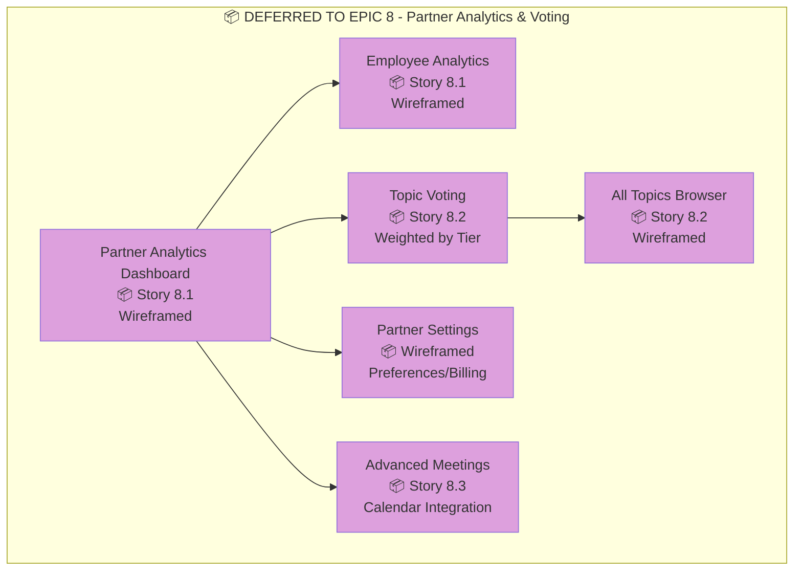
```mermaid
graph TB
    subgraph "📦 DEFERRED TO EPIC 8 - Partner Analytics & Voting"
        Analytics[Partner Analytics Dashboard<br/>📦 Story 8.1<br/>Wireframed]
        EmpAnalytics[Employee Analytics<br/>📦 Story 8.1<br/>Wireframed]
        TopicVote[Topic Voting<br/>📦 Story 8.2<br/>Weighted by Tier]
        TopicBrowser[All Topics Browser<br/>📦 Story 8.2<br/>Wireframed]
        PartnerSettings[Partner Settings<br/>📦 Wireframed<br/>Preferences/Billing]
        AdvMeetings[Advanced Meetings<br/>📦 Story 8.3<br/>Calendar Integration]
    end

    Analytics --> EmpAnalytics
    Analytics --> TopicVote
    TopicVote --> TopicBrowser
    Analytics --> PartnerSettings
    Analytics --> AdvMeetings

    style Analytics fill:#DDA0DD
    style EmpAnalytics fill:#DDA0DD
    style TopicVote fill:#DDA0DD
    style TopicBrowser fill:#DDA0DD
    style PartnerSettings fill:#DDA0DD
    style AdvMeetings fill:#DDA0DD
```

---

## 6. Speaker Portal (📦 DEFERRED TO EPIC 6)

### 6.1 All Speaker Features Deferred

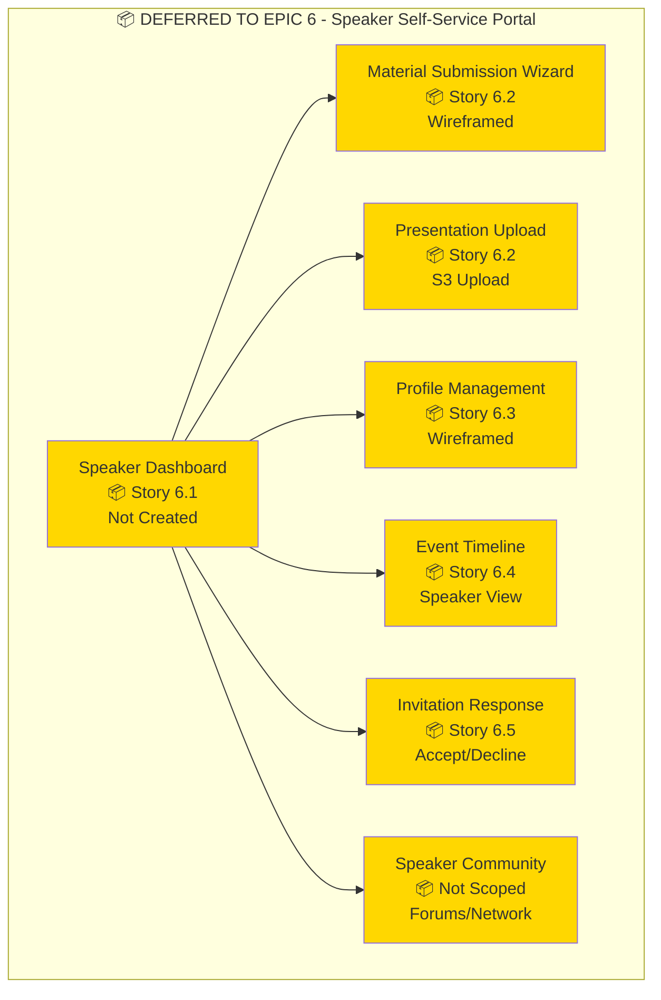
```mermaid
graph TB
    subgraph "📦 DEFERRED TO EPIC 6 - Speaker Self-Service Portal"
        SpeakerDash[Speaker Dashboard<br/>📦 Story 6.1<br/>Not Created]
        MatWizard[Material Submission Wizard<br/>📦 Story 6.2<br/>Wireframed]
        PresUpload[Presentation Upload<br/>📦 Story 6.2<br/>S3 Upload]
        ProfileMgmt[Profile Management<br/>📦 Story 6.3<br/>Wireframed]
        Timeline[Event Timeline<br/>📦 Story 6.4<br/>Speaker View]
        InviteResp[Invitation Response<br/>📦 Story 6.5<br/>Accept/Decline]
        Community[Speaker Community<br/>📦 Not Scoped<br/>Forums/Network]
    end

    SpeakerDash --> MatWizard
    SpeakerDash --> PresUpload
    SpeakerDash --> ProfileMgmt
    SpeakerDash --> Timeline
    SpeakerDash --> InviteResp
    SpeakerDash --> Community

    style SpeakerDash fill:#FFD700
    style MatWizard fill:#FFD700
    style PresUpload fill:#FFD700
    style ProfileMgmt fill:#FFD700
    style Timeline fill:#FFD700
    style InviteResp fill:#FFD700
    style Community fill:#FFD700
```

### 6.2 MVP Workaround (Organizer-Driven)

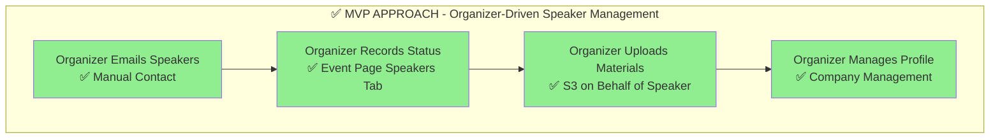
```mermaid
graph TB
    subgraph "✅ MVP APPROACH - Organizer-Driven Speaker Management"
        OrgEmail[Organizer Emails Speakers<br/>✅ Manual Contact]
        OrgRecords[Organizer Records Status<br/>✅ Event Page Speakers Tab]
        OrgUploads[Organizer Uploads Materials<br/>✅ S3 on Behalf of Speaker]
        OrgManages[Organizer Manages Profile<br/>✅ Company Management]
    end

    OrgEmail --> OrgRecords
    OrgRecords --> OrgUploads
    OrgUploads --> OrgManages

    style OrgEmail fill:#90EE90
    style OrgRecords fill:#90EE90
    style OrgUploads fill:#90EE90
    style OrgManages fill:#90EE90
```

---

## 7. Attendee Portal (🔄 PUBLIC ONLY - Epic 7 Deferred)

### 7.1 What Was Implemented (Public Access)

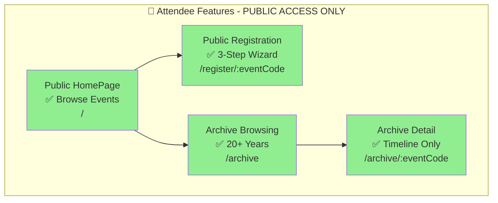
```mermaid
graph TB
    subgraph "👤 Attendee Features - PUBLIC ACCESS ONLY"
        PublicHome[Public HomePage<br/>✅ Browse Events<br/>/]
        PublicReg[Public Registration<br/>✅ 3-Step Wizard<br/>/register/:eventCode]
        Archive[Archive Browsing<br/>✅ 20+ Years<br/>/archive]
        ArchiveDetail[Archive Detail<br/>✅ Timeline Only<br/>/archive/:eventCode]
    end

    PublicHome --> PublicReg
    PublicHome --> Archive
    Archive --> ArchiveDetail

    style PublicHome fill:#90EE90
    style PublicReg fill:#90EE90
    style Archive fill:#90EE90
    style ArchiveDetail fill:#90EE90
```

### 7.2 What Was Deferred (Epic 7)

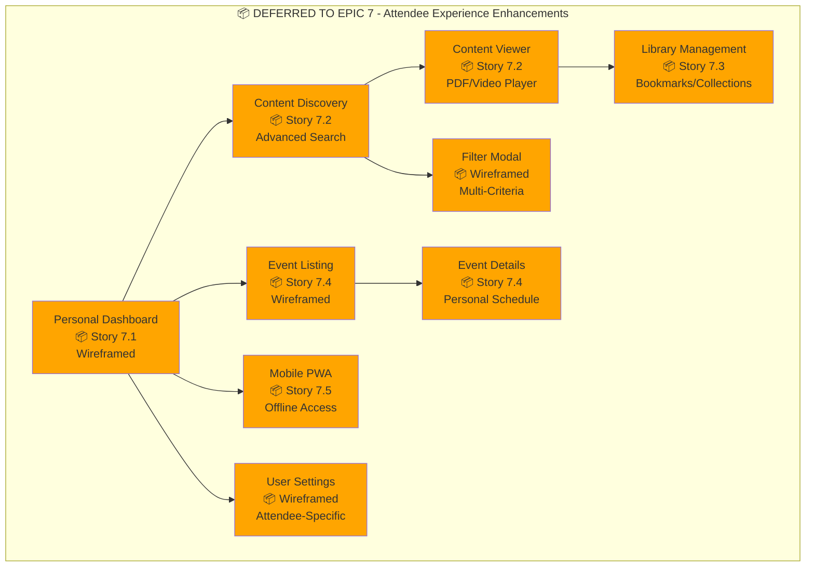
```mermaid
graph TB
    subgraph "📦 DEFERRED TO EPIC 7 - Attendee Experience Enhancements"
        PersonalDash[Personal Dashboard<br/>📦 Story 7.1<br/>Wireframed]
        ContentDisc[Content Discovery<br/>📦 Story 7.2<br/>Advanced Search]
        ContentView[Content Viewer<br/>📦 Story 7.2<br/>PDF/Video Player]
        LibraryMgmt[Library Management<br/>📦 Story 7.3<br/>Bookmarks/Collections]
        EventList[Event Listing<br/>📦 Story 7.4<br/>Wireframed]
        EventDetail[Event Details<br/>📦 Story 7.4<br/>Personal Schedule]
        FilterModal[Filter Modal<br/>📦 Wireframed<br/>Multi-Criteria]
        PWA[Mobile PWA<br/>📦 Story 7.5<br/>Offline Access]
        UserSettings[User Settings<br/>📦 Wireframed<br/>Attendee-Specific]
    end

    PersonalDash --> ContentDisc
    ContentDisc --> ContentView
    ContentView --> LibraryMgmt
    PersonalDash --> EventList
    EventList --> EventDetail
    ContentDisc --> FilterModal
    PersonalDash --> PWA
    PersonalDash --> UserSettings

    style PersonalDash fill:#FFA500
    style ContentDisc fill:#FFA500
    style ContentView fill:#FFA500
    style LibraryMgmt fill:#FFA500
    style EventList fill:#FFA500
    style EventDetail fill:#FFA500
    style FilterModal fill:#FFA500
    style PWA fill:#FFA500
    style UserSettings fill:#FFA500
```

---

## 8. User Journey Flows

### 8.1 Organizer Journey: Event Creation to Publishing (✅ IMPLEMENTED)

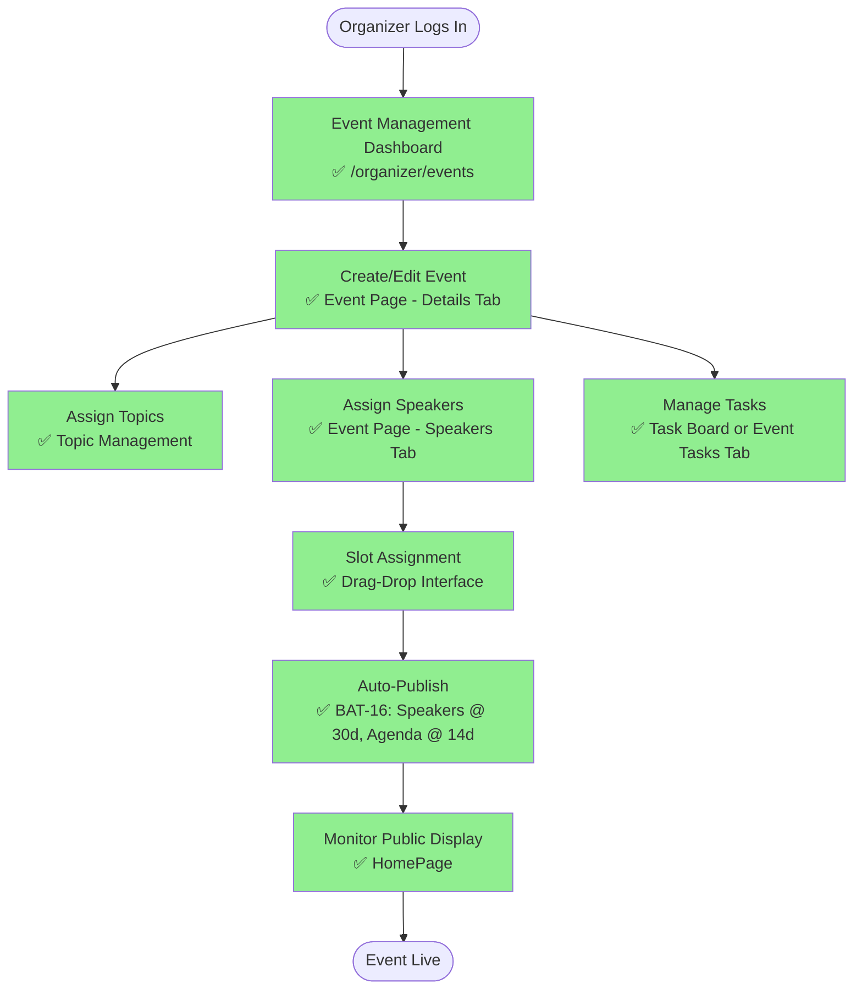
```mermaid
flowchart TD
    Start([Organizer Logs In])
    Dashboard[Event Management Dashboard<br/>✅ /organizer/events]
    CreateEvent[Create/Edit Event<br/>✅ Event Page - Details Tab]
    AssignTopics[Assign Topics<br/>✅ Topic Management]
    AssignSpeakers[Assign Speakers<br/>✅ Event Page - Speakers Tab]
    SlotAssign[Slot Assignment<br/>✅ Drag-Drop Interface]
    ManageTasks[Manage Tasks<br/>✅ Task Board or Event Tasks Tab]
    AutoPublish[Auto-Publish<br/>✅ BAT-16: Speakers @ 30d, Agenda @ 14d]
    Monitor[Monitor Public Display<br/>✅ HomePage]
    End([Event Live])

    Start --> Dashboard
    Dashboard --> CreateEvent
    CreateEvent --> AssignTopics
    CreateEvent --> AssignSpeakers
    AssignSpeakers --> SlotAssign
    CreateEvent --> ManageTasks
    SlotAssign --> AutoPublish
    AutoPublish --> Monitor
    Monitor --> End

    style Dashboard fill:#90EE90
    style CreateEvent fill:#90EE90
    style AssignTopics fill:#90EE90
    style AssignSpeakers fill:#90EE90
    style SlotAssign fill:#90EE90
    style ManageTasks fill:#90EE90
    style AutoPublish fill:#90EE90
    style Monitor fill:#90EE90
```

### 8.2 Public Attendee Journey: Discovery to Registration (✅ IMPLEMENTED)

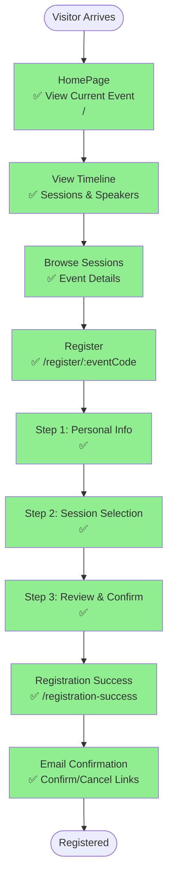
```mermaid
flowchart TD
    Start([Visitor Arrives])
    Home[HomePage<br/>✅ View Current Event<br/>/]
    Timeline[View Timeline<br/>✅ Sessions & Speakers]
    Browse[Browse Sessions<br/>✅ Event Details]
    Register[Register<br/>✅ /register/:eventCode]
    Step1[Step 1: Personal Info<br/>✅]
    Step2[Step 2: Session Selection<br/>✅]
    Step3[Step 3: Review & Confirm<br/>✅]
    Success[Registration Success<br/>✅ /registration-success]
    Email[Email Confirmation<br/>✅ Confirm/Cancel Links]
    End([Registered])

    Start --> Home
    Home --> Timeline
    Timeline --> Browse
    Browse --> Register
    Register --> Step1
    Step1 --> Step2
    Step2 --> Step3
    Step3 --> Success
    Success --> Email
    Email --> End

    style Home fill:#90EE90
    style Timeline fill:#90EE90
    style Browse fill:#90EE90
    style Register fill:#90EE90
    style Step1 fill:#90EE90
    style Step2 fill:#90EE90
    style Step3 fill:#90EE90
    style Success fill:#90EE90
    style Email fill:#90EE90
```

### 8.3 Historical Archive Journey (✅ IMPLEMENTED)

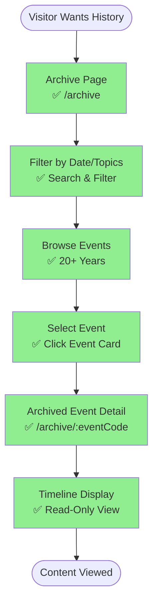
```mermaid
flowchart TD
    Start([Visitor Wants History])
    Archive[Archive Page<br/>✅ /archive]
    Filter[Filter by Date/Topics<br/>✅ Search & Filter]
    Browse[Browse Events<br/>✅ 20+ Years]
    Select[Select Event<br/>✅ Click Event Card]
    Detail[Archived Event Detail<br/>✅ /archive/:eventCode]
    Timeline[Timeline Display<br/>✅ Read-Only View]
    End([Content Viewed])

    Start --> Archive
    Archive --> Filter
    Filter --> Browse
    Browse --> Select
    Select --> Detail
    Detail --> Timeline
    Timeline --> End

    style Archive fill:#90EE90
    style Filter fill:#90EE90
    style Browse fill:#90EE90
    style Select fill:#90EE90
    style Detail fill:#90EE90
    style Timeline fill:#90EE90
```

### 8.4 Deferred User Journeys (Epic 6-8)

```mermaid
flowchart TD
    subgraph "📦 DEFERRED - Partner Journey (Epic 8)"
        P1[Partner Analytics Dashboard] --> P2[Review Employee Analytics]
        P2 --> P3[Vote on Topics]
        P3 --> P4[Schedule Meetings]
        P4 --> P5[View ROI Reports]
    end

    subgraph "📦 DEFERRED - Speaker Journey (Epic 6)"
        S1[Invitation Response] --> S2[Accept Invitation]
        S2 --> S3[Update Profile]
        S3 --> S4[Submit Materials Wizard]
        S4 --> S5[Upload Presentation]
        S5 --> S6[Review Timeline]
    end

    subgraph "📦 DEFERRED - Attendee Journey (Epic 7)"
        A1[Personal Dashboard] --> A2[Discover Content]
        A2 --> A3[View Content Viewer]
        A3 --> A4[Save to Library]
        A4 --> A5[Rate & Review]
        A5 --> A6[Track Learning Progress]
    end

    style P1 fill:#DDA0DD
    style P2 fill:#DDA0DD
    style P3 fill:#DDA0DD
    style P4 fill:#DDA0DD
    style P5 fill:#DDA0DD

    style S1 fill:#FFD700
    style S2 fill:#FFD700
    style S3 fill:#FFD700
    style S4 fill:#FFD700
    style S5 fill:#FFD700
    style S6 fill:#FFD700

    style A1 fill:#FFA500
    style A2 fill:#FFA500
    style A3 fill:#FFA500
    style A4 fill:#FFA500
    style A5 fill:#FFA500
    style A6 fill:#FFA500
```

---

## 9. Screen Implementation Summary

### 9.1 MVP Implementation Status by Portal

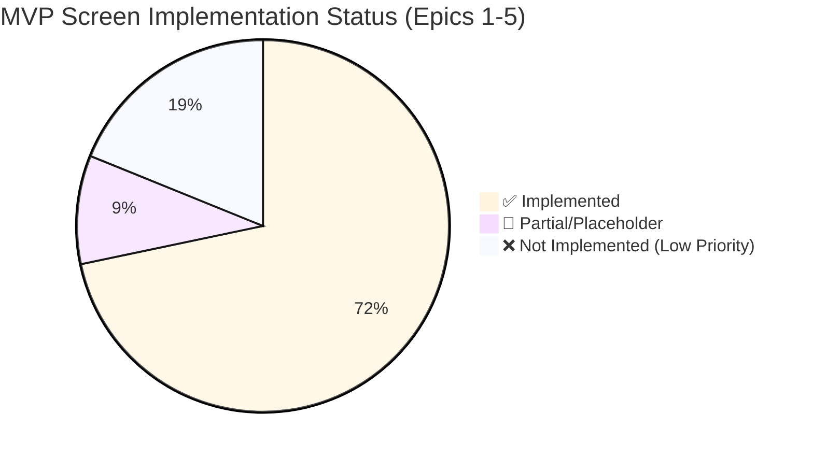
```mermaid
%%{init: {'theme':'base'}}%%
pie title MVP Screen Implementation Status (Epics 1-5)
    "✅ Implemented" : 38
    "🔄 Partial/Placeholder" : 5
    "❌ Not Implemented (Low Priority)" : 10
```

### 9.2 Implementation Coverage by Role Portal

```mermaid
%%{init: {'theme':'base'}}%%
xychart-beta
    title "Portal Implementation Coverage (%)"
    x-axis [Public, Auth, Global, Organizer, Partner, Speaker, Attendee]
    y-axis "Completion %" 0 --> 100
    bar [100, 100, 95, 90, 10, 0, 20]
```

### 9.3 Deferred Features by Epic

```mermaid
%%{init: {'theme':'base'}}%%
xychart-beta
    title "Deferred Features by Epic (Screen Count)"
    x-axis ["Epic 6 (Speaker)", "Epic 7 (Attendee)", "Epic 8 (Partner)", "Low Priority MVP"]
    y-axis "Number of Screens" 0 --> 15
    bar [6, 9, 6, 10]
```

---

## 10. Architecture Decision Visualization

### 10.1 What Was Built (MVP Architecture)

```mermaid
graph TB
    subgraph "✅ MVP ARCHITECTURE - FULLY OPERATIONAL"
        EventWorkflow[9-State Event Workflow<br/>✅ DRAFT → COMPLETED]
        UnifiedEvent[Unified Event Page<br/>✅ Tabs: Details/Speakers/Tasks]
        AutoPublish[Auto-Publishing<br/>✅ BAT-16 Lifecycle]
        SlotDragDrop[Slot Assignment<br/>✅ Drag-Drop UI]
        OrganizerDriven[Organizer-Driven<br/>✅ Manual Coordination]
        PublicFirst[Public-First Content<br/>✅ 20+ Years Archive]
        RoleBasedAuth[Role-Based Access<br/>✅ AWS Cognito]
        ModernFrontend[React 19 + TypeScript<br/>✅ Code Splitting]
    end

    EventWorkflow --> UnifiedEvent
    UnifiedEvent --> SlotDragDrop
    UnifiedEvent --> AutoPublish
    OrganizerDriven --> PublicFirst
    RoleBasedAuth --> ModernFrontend

    style EventWorkflow fill:#90EE90
    style UnifiedEvent fill:#90EE90
    style AutoPublish fill:#90EE90
    style SlotDragDrop fill:#90EE90
    style OrganizerDriven fill:#90EE90
    style PublicFirst fill:#90EE90
    style RoleBasedAuth fill:#90EE90
    style ModernFrontend fill:#90EE90
```

### 10.2 What Was Deferred (Scope Reductions)

```mermaid
graph TB
    subgraph "📦 DEFERRED - OPTIONAL ENHANCEMENTS"
        SpeakerSelfService[Speaker Self-Service<br/>📦 Epic 6<br/>40% Workload Reduction]
        PartnerAnalytics[Partner Analytics<br/>📦 Epic 8<br/>ROI Visibility]
        AttendeePersonal[Attendee Personal Features<br/>📦 Epic 7<br/>Bookmarks/PWA]
        ContentCMS[Content Management System<br/>❌ Not in MVP<br/>Manual S3 Upload]
        WorkflowViz[Workflow Visualization<br/>❌ Not in MVP<br/>Status Indicators Sufficient]
    end

    SpeakerSelfService -.->|Gather Feedback| Decide1{Implement?}
    PartnerAnalytics -.->|Assess Demand| Decide2{Implement?}
    AttendeePersonal -.->|User Demand| Decide3{Implement?}

    style SpeakerSelfService fill:#FFD700
    style PartnerAnalytics fill:#DDA0DD
    style AttendeePersonal fill:#FFA500
    style ContentCMS fill:#ffcccc
    style WorkflowViz fill:#ffcccc
```

---

## 11. Implementation Priority Matrix

### 11.1 MVP Features vs Deferred Features

```mermaid
quadrantChart
    title Screen Priority & Implementation Matrix
    x-axis Low Complexity --> High Complexity
    y-axis Deferred --> Implemented
    quadrant-1 MVP Core Features
    quadrant-2 Quick Wins (Implemented)
    quadrant-3 Low Priority (Deferred)
    quadrant-4 Complex (Deferred to Phase 2)

    Event Page Tabs: [0.6, 0.9]
    Slot Assignment: [0.7, 0.9]
    Topic Management: [0.5, 0.9]
    Task Board: [0.6, 0.9]
    Public Registration: [0.5, 0.9]
    Archive Browsing: [0.4, 0.9]
    User Account: [0.3, 0.9]
    Company CRUD: [0.4, 0.9]

    Speaker Portal: [0.7, 0.3]
    Partner Analytics: [0.8, 0.2]
    Content Viewer: [0.6, 0.3]
    Mobile PWA: [0.8, 0.2]
    Topic Voting: [0.6, 0.2]
    Workflow Viz: [0.5, 0.3]
    QR Codes: [0.4, 0.4]
    Help Center: [0.3, 0.4]
```

---

## 12. Cross-Role Navigation Patterns

### 12.1 Shared Multi-Role Components

```mermaid
graph TB
    subgraph "Multi-Role Shared Components"
        Company[Company Management<br/>✅ IMPLEMENTED]
        UserAccount[User Account Page<br/>✅ IMPLEMENTED]
    end

    subgraph "Role-Specific Access"
        OrgCompany[Organizer Access<br/>/organizer/companies/*<br/>✅ Full CRUD]
        SpeakerCompany[Speaker Access<br/>/speaker/company/*<br/>✅ Own Company Only]

        AllRoles[All Authenticated Roles<br/>/account<br/>✅ Profile + Settings]
    end

    Company --> OrgCompany
    Company --> SpeakerCompany
    UserAccount --> AllRoles

    style Company fill:#90EE90
    style UserAccount fill:#90EE90
    style OrgCompany fill:#90EE90
    style SpeakerCompany fill:#90EE90
    style AllRoles fill:#90EE90
```

---

## 13. Deployment & Release Timeline

### 13.1 MVP Implementation Timeline (Epics 1-5)

```mermaid
gantt
    title BATbern MVP Implementation (Epics 1-5 - COMPLETE)
    dateFormat YYYY-MM-DD

    section Epic 1: Foundation
    Core Infrastructure           :done, epic1, 2025-08-01, 4w
    API Gateway & Auth            :done, 2025-08-01, 4w
    React Frontend Foundation     :done, 2025-08-15, 3w

    section Epic 2: Entity CRUD
    Company/User Management       :done, epic2, 2025-09-01, 6w
    Event Service Core            :done, 2025-09-01, 6w
    Partner Service Foundation    :done, 2025-09-15, 4w

    section Epic 3: Historical Data
    Migration Tooling             :done, epic3, 2025-10-15, 3w
    Data Import (Production)      :milestone, 2026-01-31, 0d

    section Epic 4: Public Website
    Public Event Display          :done, epic4, 2025-11-01, 4w
    Registration Flow             :done, 2025-11-08, 3w
    Archive Browsing              :done, 2025-11-15, 3w

    section Epic 5: Enhanced Workflows
    Event Type Config             :done, epic5, 2025-11-22, 6w
    Topic Management              :done, 2025-11-22, 3w
    Task Management               :done, 2025-12-06, 3w
    Unified Event Page            :done, 2025-12-13, 4w
    Slot Assignment               :done, 2025-12-20, 3w
    Auto-Publishing (BAT-16)      :done, 2025-12-27, 2w

    section MVP Complete
    MVP Launch                    :milestone, mvp, 2026-01-10, 0d
```

### 13.2 Phase 2+ Deferred Epics

```mermaid
gantt
    title Phase 2+ Optional Enhancements (Epics 6-8)
    dateFormat YYYY-MM-DD

    section Epic 6: Speaker Portal
    Speaker Service Foundation    :epic6, 2026-02-01, 2.5w
    Material Submission           :2026-02-18, 3w
    Profile Management            :2026-03-11, 2w
    Invitation Response           :2026-03-25, 3w
    Speaker Dashboard             :2026-04-15, 2w

    section Epic 7: Attendee Experience
    Personal Dashboard            :epic7, 2026-05-01, 2w
    Content Discovery             :2026-05-15, 3w
    Content Viewer                :2026-06-05, 2w
    Mobile PWA                    :2026-06-19, 3w

    section Epic 8: Partner Analytics
    Analytics Dashboard           :epic8, 2026-07-10, 2w
    Topic Voting System           :2026-07-24, 2w
    Meeting Automation            :2026-08-07, 2w
```

---

## Notes on Diagram Usage

### Color Coding Reference
- 🟢 Green (`#90EE90`) = ✅ IMPLEMENTED IN MVP (Epics 1-5)
- 🔵 Light Blue (`#87CEEB`) = 🔄 PARTIAL/PLACEHOLDER
- 🟡 Gold (`#FFD700`) = 📦 DEFERRED TO EPIC 6 (Speaker Portal)
- 🟠 Orange (`#FFA500`) = 📦 DEFERRED TO EPIC 7 (Attendee Experience)
- 🟣 Purple (`#DDA0DD`) = 📦 DEFERRED TO EPIC 8 (Partner Analytics)
- 🔴 Red (`#ffcccc`) = ❌ NOT IMPLEMENTED IN MVP

### Rendering Notes
- These diagrams render in GitHub, GitLab, most markdown viewers
- Use [Mermaid Live Editor](https://mermaid.live) for editing/testing
- VS Code: Install "Mermaid Preview" extension for local viewing
- Confluence: Use Mermaid plugin for embedding

### Implementation Truth
- This sitemap reflects **actual implementation** as of 2026-01-25
- Routes verified against `/Users/nissim/dev/bat/BATbern-main/web-frontend/src/App.tsx`
- Epic status verified against `/Users/nissim/dev/bat/BATbern-main/docs/prd/epic-*.md`
- All ✅ IMPLEMENTED features are production-ready and deployed

---

**End of Mermaid Site Map**

*This document provides visual representations of the BATbern platform as implemented in MVP (Epics 1-5) and planned for Phase 2+ (Epics 6-8). Use in conjunction with sitemap.md for detailed textual descriptions.*
