# BATbern Event Management Platform - Site Map (Mermaid Diagrams)

**Generated:** 2025-10-01
**Version:** 1.0
**Purpose:** Visual representation of platform architecture using Mermaid diagrams

---

## Legend

### Status & Priority Colors
- 🟢 **Green** - Existing/Documented screens
- 🔴 **Red** - Missing HIGH priority screens
- 🟡 **Yellow** - Missing MEDIUM priority screens
- ⚪ **White** - Missing LOW priority screens

### Role Indicators
- 🎯 Organizer
- 💼 Partner
- 🎤 Speaker
- 👤 Attendee
- 🌐 Public/Global

---

## 1. Platform Architecture Overview

```mermaid
graph TB
    Root[BATbern Platform]

    Root --> Public[🌐 Public Layer]
    Root --> Auth[🔒 Authentication]
    Root --> Global[🌐 Global/Shared]
    Root --> Organizer[🎯 Organizer Portal]
    Root --> Partner[💼 Partner Portal]
    Root --> Speaker[🎤 Speaker Portal]
    Root --> Attendee[👤 Attendee Portal]

    style Root fill:#e1f5ff
    style Public fill:#fff9e6
    style Auth fill:#ffe6e6
    style Global fill:#e6ffe6
    style Organizer fill:#fff0e6
    style Partner fill:#f0e6ff
    style Speaker fill:#ffe6f0
    style Attendee fill:#e6f0ff
```

---

## 2. Public Layer & Authentication

```mermaid
graph LR
    subgraph "🌐 Public Access"
        Homepage[Public Homepage<br/>❌ MISSING 🟡]
        EventLanding[Current Event Landing<br/>✅ EXISTS]
        Registration[Event Registration<br/>🔄 PARTIAL]
    end

    subgraph "🔒 Authentication"
        Login[Login Screen<br/>❌ MISSING 🔴]
        Forgot[Forgot Password<br/>❌ MISSING 🟡]
        CreateAcct[Create Account<br/>❌ MISSING 🟡]
        Verify[Email Verification<br/>❌ MISSING 🟡]
    end

    subgraph "Registration Flow"
        RegStep1[Step 1: Personal Info<br/>✅ EXISTS]
        RegStep2[Step 2: Session Selection<br/>❌ MISSING 🔴]
        RegStep3[Step 3: Review & Confirm<br/>❌ MISSING 🔴]
        Confirmation[Confirmation Page<br/>❌ MISSING 🔴]
        Ticket[Ticket/QR Code<br/>❌ MISSING 🔴]
    end

    Homepage --> EventLanding
    Homepage --> Login
    EventLanding --> Registration

    Login --> Forgot
    Login --> CreateAcct
    CreateAcct --> Verify

    Registration --> RegStep1
    RegStep1 --> RegStep2
    RegStep2 --> RegStep3
    RegStep3 --> Confirmation
    Confirmation --> Ticket

    style Homepage fill:#ffcccc
    style EventLanding fill:#ccffcc
    style Login fill:#ffcccc
    style RegStep1 fill:#ccffcc
    style RegStep2 fill:#ffcccc
    style RegStep3 fill:#ffcccc
    style Confirmation fill:#ffcccc
    style Ticket fill:#ffcccc
```

---

## 3. Global/Shared Screens

```mermaid
graph TB
    subgraph "🌐 Global Navigation"
        Nav[Main Navigation<br/>❌ MISSING 🔴]
        Profile[User Profile<br/>❌ MISSING 🟡]
        Settings[User Settings<br/>❌ MISSING 🟡]
        Notifications[Notification Center<br/>✅ EXISTS]
        Help[Help Center<br/>❌ MISSING 🟡]
        Support[Support Ticket<br/>❌ MISSING 🟢]
    end

    Nav --> Profile
    Nav --> Settings
    Nav --> Notifications
    Nav --> Help

    Profile --> Settings
    Help --> Support

    style Notifications fill:#ccffcc
    style Nav fill:#ffcccc
    style Profile fill:#ffffcc
    style Settings fill:#ffffcc
    style Help fill:#ffffcc
    style Support fill:#ffffff
```

---

## 4. Organizer Portal - Complete Structure

### 4.1 Main Dashboard Hub

```mermaid
graph TB
    Dashboard[🎯 Event Management Dashboard<br/>✅ EXISTS]

    Dashboard --> Events[Event Management]
    Dashboard --> Content[Content Management]
    Dashboard --> Speakers[Speaker Management]
    Dashboard --> Logistics[Logistics & Venues]
    Dashboard --> Admin[Administrative]

    style Dashboard fill:#ccffcc
    style Events fill:#e6f3ff
    style Content fill:#e6f3ff
    style Speakers fill:#e6f3ff
    style Logistics fill:#e6f3ff
    style Admin fill:#e6f3ff
```

### 4.2 Event Management Section

```mermaid
graph TB
    subgraph "🎯 Event Management"
        Dashboard[Event Dashboard<br/>✅ EXISTS]
        EventDetail[Event Detail/Edit<br/>❌ MISSING 🔴]
        EventSettings[Event Settings<br/>❌ MISSING 🟡]
        Workflow[Workflow Visualization<br/>✅ EXISTS]
        Archive[Historical Archive<br/>✅ EXISTS]
    end

    Dashboard --> EventDetail
    Dashboard --> Workflow
    Dashboard --> Archive

    EventDetail --> EventSettings
    Workflow --> EventDetail

    style Dashboard fill:#ccffcc
    style Workflow fill:#ccffcc
    style Archive fill:#ccffcc
    style EventDetail fill:#ffcccc
    style EventSettings fill:#ffffcc
```

### 4.3 Content Management Section

```mermaid
graph TB
    subgraph "🎯 Content Management"
        TopicBacklog[Topic Backlog<br/>✅ EXISTS]
        Publishing[Publishing Engine<br/>✅ EXISTS]
        Progressive[Progressive Publishing<br/>✅ EXISTS]
        ContentLib[Content Library<br/>❌ MISSING 🟡]
        ContentDetail[Content Detail/Edit<br/>❌ MISSING 🟡]
        ModQueue[Moderator Review Queue<br/>❌ MISSING 🟡]
    end

    TopicBacklog --> ContentLib
    Publishing --> ContentDetail
    Progressive --> ContentDetail
    ContentLib --> ContentDetail
    Publishing --> ModQueue

    style TopicBacklog fill:#ccffcc
    style Publishing fill:#ccffcc
    style Progressive fill:#ccffcc
    style ContentLib fill:#ffffcc
    style ContentDetail fill:#ffffcc
    style ModQueue fill:#ffffcc
```

### 4.4 Speaker Management Section

```mermaid
graph TB
    subgraph "🎯 Speaker Management"
        Matching[Speaker Matching<br/>✅ EXISTS]
        SpeakerDetail[Speaker Detail View<br/>❌ MISSING 🔴]
        InviteMgmt[Invitation Management<br/>❌ MISSING 🟡]
        InviteResp[Invitation Response<br/>✅ EXISTS]
        CompanyMgmt[Company Management<br/>❌ MISSING 🟡]
    end

    Matching --> SpeakerDetail
    Matching --> InviteMgmt
    Matching --> CompanyMgmt
    InviteMgmt --> InviteResp

    style Matching fill:#ccffcc
    style InviteResp fill:#ccffcc
    style SpeakerDetail fill:#ffcccc
    style InviteMgmt fill:#ffffcc
    style CompanyMgmt fill:#ffffcc
```

### 4.5 Logistics & Venue Section

```mermaid
graph TB
    subgraph "🎯 Logistics & Venues"
        LogisticsCoord[Logistics Coordination<br/>✅ EXISTS]
        VenueDetail[Venue Details<br/>❌ MISSING 🔴]
        VenueBooking[Venue Booking<br/>❌ MISSING 🔴]
        Catering[Catering Management<br/>❌ MISSING 🟡]
    end

    LogisticsCoord --> VenueDetail
    VenueDetail --> VenueBooking
    LogisticsCoord --> Catering

    style LogisticsCoord fill:#ccffcc
    style VenueDetail fill:#ffcccc
    style VenueBooking fill:#ffcccc
    style Catering fill:#ffffcc
```

---

## 5. Partner Portal - Complete Structure

### 5.1 Main Dashboard Hub

```mermaid
graph TB
    PartnerDash[💼 Partner Analytics Dashboard<br/>✅ EXISTS]

    PartnerDash --> Analytics[Analytics & Metrics]
    PartnerDash --> Brand[Brand & Exposure]
    PartnerDash --> Budget[Budget & Finance]
    PartnerDash --> Strategic[Strategic Planning]
    PartnerDash --> Meetings[Meetings & Collaboration]

    style PartnerDash fill:#ccffcc
    style Analytics fill:#f0e6ff
    style Brand fill:#f0e6ff
    style Budget fill:#f0e6ff
    style Strategic fill:#f0e6ff
    style Meetings fill:#f0e6ff
```

### 5.2 Analytics & Metrics Section

```mermaid
graph TB
    subgraph "💼 Analytics & Metrics"
        Dashboard[Analytics Dashboard<br/>✅ EXISTS]
        SwitchAcct[Switch Account<br/>❌ MISSING 🟡]
        MetricDetail[Metric Details<br/>❌ MISSING 🔴]
        EmpAnalytics[Employee Analytics<br/>✅ EXISTS]
        EmpDetail[Employee Detail<br/>❌ MISSING 🟡]
    end

    Dashboard --> SwitchAcct
    Dashboard --> MetricDetail
    Dashboard --> EmpAnalytics
    EmpAnalytics --> MetricDetail
    EmpAnalytics --> EmpDetail

    style Dashboard fill:#ccffcc
    style EmpAnalytics fill:#ccffcc
    style MetricDetail fill:#ffcccc
    style SwitchAcct fill:#ffffcc
    style EmpDetail fill:#ffffcc
```

### 5.3 Brand & Exposure Section

```mermaid
graph TB
    subgraph "💼 Brand & Exposure"
        BrandExp[Brand Exposure<br/>✅ EXISTS]
        ExposureDetail[Exposure Details<br/>❌ MISSING 🟡]
        WebAnalytics[Website Analytics<br/>❌ MISSING 🟡]
        SocialReport[Social Media Report<br/>❌ MISSING 🟡]
        Competitor[Competitor Benchmarking<br/>❌ MISSING 🟡]
        ContentPerf[Content Performance<br/>❌ MISSING 🟡]
        ROITrend[ROI Trend Analysis<br/>❌ MISSING 🟡]
        PackageUpgrade[Package Upgrade<br/>❌ MISSING 🟡]
    end

    BrandExp --> ExposureDetail
    BrandExp --> WebAnalytics
    BrandExp --> SocialReport
    BrandExp --> Competitor
    BrandExp --> ContentPerf
    BrandExp --> ROITrend
    BrandExp --> PackageUpgrade

    style BrandExp fill:#ccffcc
    style ExposureDetail fill:#ffffcc
    style WebAnalytics fill:#ffffcc
    style SocialReport fill:#ffffcc
    style Competitor fill:#ffffcc
    style ContentPerf fill:#ffffcc
    style ROITrend fill:#ffffcc
    style PackageUpgrade fill:#ffffcc
```

### 5.4 Budget & Finance Section

```mermaid
graph TB
    subgraph "💼 Budget & Finance"
        BudgetMgmt[Budget Management<br/>✅ EXISTS]
        Forecasting[Budget Forecasting<br/>❌ MISSING 🟡]
        YoYComp[Year-over-Year Comparison<br/>❌ MISSING 🟡]
        ReportBuilder[Report Builder<br/>✅ EXISTS]
        ReportPreview[Report Preview<br/>❌ MISSING 🟡]
        ReportSchedule[Report Scheduling<br/>❌ MISSING 🟡]
    end

    BudgetMgmt --> Forecasting
    BudgetMgmt --> YoYComp
    BudgetMgmt --> ReportBuilder
    ReportBuilder --> ReportPreview
    ReportBuilder --> ReportSchedule

    style BudgetMgmt fill:#ccffcc
    style ReportBuilder fill:#ccffcc
    style Forecasting fill:#ffffcc
    style YoYComp fill:#ffffcc
    style ReportPreview fill:#ffffcc
    style ReportSchedule fill:#ffffcc
```

### 5.5 Strategic Planning Section

```mermaid
graph TB
    subgraph "💼 Strategic Planning"
        StratPlan[Strategic Planning<br/>✅ EXISTS]
        GoalsMgmt[Goals Management<br/>❌ MISSING 🔴]
        GoalDetail[Goal Details<br/>❌ MISSING 🟡]
        NewGoal[New Goal Creation<br/>❌ MISSING 🟡]
        TopicVote[Topic Voting<br/>✅ EXISTS]
        TopicBrowser[Topic Browser<br/>❌ MISSING 🟡]
        CertPaths[Certification Paths<br/>❌ MISSING 🟡]
        SkillDev[Skill Development<br/>❌ MISSING 🟡]
    end

    StratPlan --> GoalsMgmt
    GoalsMgmt --> GoalDetail
    GoalsMgmt --> NewGoal
    StratPlan --> TopicVote
    TopicVote --> TopicBrowser
    StratPlan --> CertPaths
    StratPlan --> SkillDev

    style StratPlan fill:#ccffcc
    style TopicVote fill:#ccffcc
    style GoalsMgmt fill:#ffcccc
    style GoalDetail fill:#ffffcc
    style NewGoal fill:#ffffcc
    style TopicBrowser fill:#ffffcc
    style CertPaths fill:#ffffcc
    style SkillDev fill:#ffffcc
```

### 5.6 Meetings & Collaboration Section

```mermaid
graph TB
    subgraph "💼 Meetings & Collaboration"
        Meetings[Partner Meetings<br/>✅ EXISTS]
        Calendar[Calendar View<br/>❌ MISSING 🔴]
        MeetingDetail[Meeting Details<br/>❌ MISSING 🟡]
        Materials[Materials Library<br/>❌ MISSING 🟡]
        Agenda[Agenda Proposal<br/>❌ MISSING 🟡]
        PastMeeting[Past Meetings<br/>❌ MISSING 🟡]
        ActionItems[Action Items<br/>❌ MISSING 🟡]
    end

    Meetings --> Calendar
    Calendar --> MeetingDetail
    Meetings --> Materials
    Meetings --> Agenda
    Meetings --> PastMeeting
    Meetings --> ActionItems

    style Meetings fill:#ccffcc
    style Calendar fill:#ffcccc
    style MeetingDetail fill:#ffffcc
    style Materials fill:#ffffcc
    style Agenda fill:#ffffcc
    style PastMeeting fill:#ffffcc
    style ActionItems fill:#ffffcc
```

---

## 6. Speaker Portal - Complete Structure

### 6.1 Main Dashboard Hub

```mermaid
graph TB
    SpeakerDash[🎤 Speaker Dashboard<br/>✅ EXISTS]

    SpeakerDash --> Content[Content & Materials]
    SpeakerDash --> Profile[Profile & Community]
    SpeakerDash --> Communication[Communication]
    SpeakerDash --> Events[Events & Timeline]

    style SpeakerDash fill:#ccffcc
    style Content fill:#ffe6f0
    style Profile fill:#ffe6f0
    style Communication fill:#ffe6f0
    style Events fill:#ffe6f0
```

### 6.2 Content & Materials Section

```mermaid
graph TB
    subgraph "🎤 Content & Materials"
        MatWizard[Material Submission Wizard<br/>✅ EXISTS]
        PresUpload[Presentation Upload<br/>✅ EXISTS]
        ContentLib[My Presentations<br/>🔗 to Content Library]
    end

    MatWizard --> PresUpload
    MatWizard --> ContentLib

    style MatWizard fill:#ccffcc
    style PresUpload fill:#ccffcc
```

### 6.3 Profile & Community Section

```mermaid
graph TB
    subgraph "🎤 Profile & Community"
        ProfileMgmt[Profile Management<br/>✅ EXISTS]
        ProfileEdit[Profile Edit<br/>❌ MISSING 🟡]
        ProfilePreview[Public Preview<br/>❌ MISSING 🟢]
        Community[Speaker Community<br/>✅ EXISTS]
        SpeakerNetwork[Speaker Network<br/>❌ MISSING 🔴]
        Discussion[Discussion Thread<br/>❌ MISSING 🔴]
        NewDiscussion[New Discussion<br/>❌ MISSING 🟡]
        MentorProfile[Mentor Profile<br/>❌ MISSING 🟡]
        ResourceViewer[Resource Viewer<br/>❌ MISSING 🟡]
        CommunityFeatures[Community Features<br/>✅ EXISTS]
        DiscussionBrowser[Discussion Browser<br/>❌ MISSING 🟡]
        MyDiscussions[My Discussions<br/>❌ MISSING 🟡]
        StudyGroup[Study Group<br/>❌ MISSING 🟢]
    end

    ProfileMgmt --> ProfileEdit
    ProfileMgmt --> ProfilePreview

    Community --> SpeakerNetwork
    Community --> Discussion
    Community --> NewDiscussion
    Community --> MentorProfile
    Community --> ResourceViewer

    CommunityFeatures --> DiscussionBrowser
    CommunityFeatures --> MyDiscussions
    CommunityFeatures --> StudyGroup

    style ProfileMgmt fill:#ccffcc
    style Community fill:#ccffcc
    style CommunityFeatures fill:#ccffcc
    style SpeakerNetwork fill:#ffcccc
    style Discussion fill:#ffcccc
    style ProfileEdit fill:#ffffcc
    style NewDiscussion fill:#ffffcc
    style MentorProfile fill:#ffffcc
    style ResourceViewer fill:#ffffcc
    style DiscussionBrowser fill:#ffffcc
    style MyDiscussions fill:#ffffcc
    style ProfilePreview fill:#ffffff
    style StudyGroup fill:#ffffff
```

### 6.4 Communication Section

```mermaid
graph TB
    subgraph "🎤 Communication"
        CommHub[Communication Hub<br/>✅ EXISTS]
        Announcements[Announcement Details<br/>❌ MISSING 🟡]
        Messages[Messages]
        Notifications[Notifications]
    end

    CommHub --> Announcements
    CommHub --> Messages
    CommHub --> Notifications

    style CommHub fill:#ccffcc
    style Announcements fill:#ffffcc
```

### 6.5 Events & Timeline Section

```mermaid
graph TB
    subgraph "🎤 Events & Timeline"
        Timeline[Event Timeline<br/>✅ EXISTS]
        InviteResp[Invitation Response<br/>✅ EXISTS]
        EventDetail[Event Details<br/>🔗 Speaker View]
    end

    Timeline --> EventDetail
    InviteResp --> Timeline

    style Timeline fill:#ccffcc
    style InviteResp fill:#ccffcc
```

---

## 7. Attendee Portal - Complete Structure

### 7.1 Main Dashboard Hub

```mermaid
graph TB
    AttendeeDash[👤 Personal Dashboard<br/>✅ EXISTS]

    AttendeeDash --> Discovery[Discovery & Content]
    AttendeeDash --> Events[Events & Registration]
    AttendeeDash --> Learning[Learning & Progress]
    AttendeeDash --> Mobile[Mobile & Offline]
    AttendeeDash --> Community[Community & Social]

    style AttendeeDash fill:#ccffcc
    style Discovery fill:#e6f0ff
    style Events fill:#e6f0ff
    style Learning fill:#e6f0ff
    style Mobile fill:#e6f0ff
    style Community fill:#e6f0ff
```

### 7.2 Discovery & Content Section

```mermaid
graph TB
    subgraph "👤 Discovery & Content"
        ContentDisc[Content Discovery<br/>✅ EXISTS]
        ContentViewer[Content Viewer<br/>❌ MISSING 🔴]
        LibraryMgmt[Library Management<br/>❌ MISSING 🟡]
        FilterModal[Filter Modal<br/>❌ MISSING 🟡]
        AllReviews[All Reviews<br/>❌ MISSING 🟢]
        TopRated[Top Rated Content<br/>❌ MISSING 🟢]
    end

    ContentDisc --> ContentViewer
    ContentDisc --> FilterModal
    ContentDisc --> AllReviews
    ContentDisc --> TopRated
    ContentViewer --> LibraryMgmt

    style ContentDisc fill:#ccffcc
    style ContentViewer fill:#ffcccc
    style LibraryMgmt fill:#ffffcc
    style FilterModal fill:#ffffcc
    style AllReviews fill:#ffffff
    style TopRated fill:#ffffff
```

### 7.3 Events & Registration Section

```mermaid
graph TB
    subgraph "👤 Events & Registration"
        EventList[Event Listing<br/>❌ MISSING 🟡]
        EventDetail[Event Details<br/>❌ MISSING 🔴]
        EventLanding[Event Landing<br/>✅ EXISTS]
        Registration[Registration Flow<br/>🔄 PARTIAL]
        SessionModal[Session Details<br/>❌ MISSING 🔴]
        SpeakerList[Speaker List<br/>❌ MISSING 🟡]
        Schedule[Complete Schedule<br/>❌ MISSING 🟡]
        Confirmation[Confirmation Page<br/>❌ MISSING 🔴]
        Ticket[Ticket/QR Code<br/>❌ MISSING 🔴]
        AttendeeList[Attendee List<br/>❌ MISSING 🟢]
    end

    EventList --> EventDetail
    EventDetail --> EventLanding
    EventLanding --> SessionModal
    EventLanding --> Registration
    Registration --> Confirmation
    Confirmation --> Ticket
    EventDetail --> SpeakerList
    EventDetail --> Schedule
    EventDetail --> AttendeeList

    style EventLanding fill:#ccffcc
    style EventDetail fill:#ffcccc
    style SessionModal fill:#ffcccc
    style Confirmation fill:#ffcccc
    style Ticket fill:#ffcccc
    style EventList fill:#ffffcc
    style SpeakerList fill:#ffffcc
    style Schedule fill:#ffffcc
    style AttendeeList fill:#ffffff
```

### 7.4 Learning & Progress Section

```mermaid
graph TB
    subgraph "👤 Learning & Progress"
        Dashboard[Personal Dashboard<br/>✅ EXISTS]
        LearningPath[Learning Path Details<br/>❌ MISSING 🟡]
        PathSelection[Path Selection<br/>❌ MISSING 🟡]
        Achievements[Achievements Gallery<br/>❌ MISSING 🟢]
        Leaderboard[Leaderboard<br/>❌ MISSING 🟢]
    end

    Dashboard --> LearningPath
    Dashboard --> PathSelection
    Dashboard --> Achievements
    Dashboard --> Leaderboard

    style Dashboard fill:#ccffcc
    style LearningPath fill:#ffffcc
    style PathSelection fill:#ffffcc
    style Achievements fill:#ffffff
    style Leaderboard fill:#ffffff
```

### 7.5 Mobile & Offline Section

```mermaid
graph TB
    subgraph "👤 Mobile & Offline"
        PWA[Mobile PWA<br/>✅ EXISTS]
        OfflineContent[Offline Content Manager<br/>✅ EXISTS]
        StorageMgmt[Storage Management<br/>❌ MISSING 🟡]
        OfflineSettings[Offline Settings<br/>❌ MISSING 🟡]
        BundleList[Bundle Content List<br/>❌ MISSING 🟡]
        SyncRules[Smart Sync Rules<br/>❌ MISSING 🟢]
        SyncHistory[Sync History<br/>❌ MISSING 🟡]
        OfflineViewer[Offline Viewer<br/>❌ MISSING 🔴]
    end

    PWA --> OfflineContent
    OfflineContent --> StorageMgmt
    OfflineContent --> OfflineSettings
    OfflineContent --> BundleList
    OfflineContent --> SyncRules
    OfflineContent --> SyncHistory
    OfflineContent --> OfflineViewer

    style PWA fill:#ccffcc
    style OfflineContent fill:#ccffcc
    style OfflineViewer fill:#ffcccc
    style StorageMgmt fill:#ffffcc
    style OfflineSettings fill:#ffffcc
    style BundleList fill:#ffffcc
    style SyncHistory fill:#ffffcc
    style SyncRules fill:#ffffff
```

### 7.6 Community & Social Section

```mermaid
graph TB
    subgraph "👤 Community & Social"
        Forum[Community Forum<br/>❌ MISSING 🟡]
        DiscussionThread[Discussion Thread<br/>🔗 Shared]
        TopicBrowser[Topic Browser<br/>❌ MISSING 🟡]
        MyDiscussions[My Discussions<br/>❌ MISSING 🟡]
        StudyGroup[Study Group<br/>❌ MISSING 🟢]
    end

    Forum --> DiscussionThread
    Forum --> TopicBrowser
    Forum --> MyDiscussions
    Forum --> StudyGroup

    style Forum fill:#ffffcc
    style TopicBrowser fill:#ffffcc
    style MyDiscussions fill:#ffffcc
    style StudyGroup fill:#ffffff
```

---

## 8. User Journey Flows

### 8.1 Organizer Journey: Event Creation to Publishing

```mermaid
flowchart TD
    Start([Organizer Logs In])
    Dashboard[Event Management Dashboard]
    CreateEvent[Create Event<br/>Event Detail/Edit]
    AssignTopics[Assign Topics<br/>Topic Backlog]
    MatchSpeakers[Match Speakers<br/>Speaker Matching]
    SendInvites[Send Invitations]
    TrackResp[Track Responses]
    ConfigVenue[Configure Venue<br/>Logistics Coordination]
    BookVenue[Book Venue]
    PublishEvent[Publish Event<br/>Progressive Publishing]
    Monitor[Monitor Registration]
    End([Event Live])

    Start --> Dashboard
    Dashboard --> CreateEvent
    CreateEvent --> AssignTopics
    CreateEvent --> MatchSpeakers
    MatchSpeakers --> SendInvites
    SendInvites --> TrackResp
    CreateEvent --> ConfigVenue
    ConfigVenue --> BookVenue
    CreateEvent --> PublishEvent
    PublishEvent --> Monitor
    Monitor --> End

    style Dashboard fill:#ccffcc
    style CreateEvent fill:#ffcccc
    style AssignTopics fill:#ccffcc
    style MatchSpeakers fill:#ccffcc
    style ConfigVenue fill:#ccffcc
    style PublishEvent fill:#ccffcc
    style BookVenue fill:#ffcccc
```

### 8.2 Partner Journey: Analytics to Strategic Planning

```mermaid
flowchart TD
    Start([Partner Logs In])
    Dashboard[Partner Analytics Dashboard]
    ReviewEmp[Review Employee Analytics]
    IdentifyNeeds[Identify Training Needs]
    SetGoals[Set Goals<br/>Goals Management]
    VoteTopics[Vote on Topics<br/>Topic Voting]
    TrackROI[Track ROI<br/>Budget Management]
    GenReports[Generate Reports<br/>Report Builder]
    Schedule[Schedule Meetings<br/>Partner Meetings]
    End([Strategic Plan Complete])

    Start --> Dashboard
    Dashboard --> ReviewEmp
    ReviewEmp --> IdentifyNeeds
    IdentifyNeeds --> SetGoals
    SetGoals --> VoteTopics
    Dashboard --> TrackROI
    TrackROI --> GenReports
    Dashboard --> Schedule
    VoteTopics --> End

    style Dashboard fill:#ccffcc
    style ReviewEmp fill:#ccffcc
    style SetGoals fill:#ffcccc
    style VoteTopics fill:#ccffcc
    style TrackROI fill:#ccffcc
    style GenReports fill:#ccffcc
    style Schedule fill:#ccffcc
```

### 8.3 Speaker Journey: Invitation to Presentation

```mermaid
flowchart TD
    Start([Receives Invitation])
    InviteResp[Invitation Response]
    Accept{Accept?}
    Dashboard[Speaker Dashboard]
    UpdateProfile[Update Profile<br/>Profile Management]
    SubmitMat[Submit Materials<br/>Material Wizard]
    UploadPres[Upload Presentation]
    ReviewTime[Review Timeline<br/>Event Timeline]
    Community[Engage Community]
    Present([Presentation Day])

    Start --> InviteResp
    InviteResp --> Accept
    Accept -->|Yes| Dashboard
    Accept -->|No| End([Declined])
    Dashboard --> UpdateProfile
    Dashboard --> SubmitMat
    SubmitMat --> UploadPres
    Dashboard --> ReviewTime
    Dashboard --> Community
    UploadPres --> Present

    style InviteResp fill:#ccffcc
    style Dashboard fill:#ccffcc
    style UpdateProfile fill:#ccffcc
    style SubmitMat fill:#ccffcc
    style UploadPres fill:#ccffcc
    style ReviewTime fill:#ccffcc
    style Community fill:#ccffcc
```

### 8.4 Attendee Journey: Discovery to Attendance

```mermaid
flowchart TD
    Start([Browses Public Site])
    Landing[Event Landing Page]
    Register[Registration Flow]
    Step1[Step 1: Personal Info]
    Step2[Step 2: Session Selection]
    Step3[Step 3: Confirm]
    Confirm[Confirmation Page]
    Ticket[Get Ticket/QR Code]
    Discover[Discover Content]
    View[View Content]
    Save[Save to Library]
    Track[Track Progress<br/>Personal Dashboard]
    Attend([Event Day])

    Start --> Landing
    Landing --> Register
    Register --> Step1
    Step1 --> Step2
    Step2 --> Step3
    Step3 --> Confirm
    Confirm --> Ticket
    Landing --> Discover
    Discover --> View
    View --> Save
    Save --> Track
    Ticket --> Attend

    style Landing fill:#ccffcc
    style Step1 fill:#ccffcc
    style Step2 fill:#ffcccc
    style Step3 fill:#ffcccc
    style Confirm fill:#ffcccc
    style Ticket fill:#ffcccc
    style Discover fill:#ccffcc
    style View fill:#ffcccc
    style Track fill:#ccffcc
```

---

## 9. Cross-Role Navigation Patterns

### 9.1 Shared Content Access

```mermaid
graph TB
    subgraph "Multi-Role Content Access"
        Content[Content Item]

        OrgView[🎯 Organizer View<br/>Full Edit Access]
        SpeakerView[🎤 Speaker View<br/>Own Content Edit]
        AttendeeView[👤 Attendee View<br/>Read Only]
        PartnerView[💼 Partner View<br/>Analytics]
    end

    Content --> OrgView
    Content --> SpeakerView
    Content --> AttendeeView
    Content --> PartnerView

    style Content fill:#e1f5ff
    style OrgView fill:#fff0e6
    style SpeakerView fill:#ffe6f0
    style AttendeeView fill:#e6f0ff
    style PartnerView fill:#f0e6ff
```

### 9.2 Event Details - Role-Specific Views

```mermaid
graph TB
    Event[Event Entity]

    OrgEdit[🎯 Event Detail/Edit<br/>Full Management]
    PartnerAnalytics[💼 Event in Analytics<br/>ROI & Metrics]
    SpeakerTimeline[🎤 Event Timeline<br/>Tasks & Dates]
    AttendeePublic[👤 Event Details Page<br/>Public Info]
    PublicLanding[🌐 Event Landing<br/>Registration]

    Event --> OrgEdit
    Event --> PartnerAnalytics
    Event --> SpeakerTimeline
    Event --> AttendeePublic
    Event --> PublicLanding

    style Event fill:#e1f5ff
    style OrgEdit fill:#ffcccc
    style PartnerAnalytics fill:#ccffcc
    style SpeakerTimeline fill:#ccffcc
    style AttendeePublic fill:#ffcccc
    style PublicLanding fill:#ccffcc
```

### 9.3 Profile & Directory Access

```mermaid
graph TB
    Speaker[Speaker Profile]

    OrgDetail[🎯 Speaker Detail View<br/>Search & Match]
    SpeakerMgmt[🎤 Profile Management<br/>Edit Own Profile]
    AttendeeView[👤 Speaker in Directory<br/>Public View]
    PublicView[🌐 Public Profile<br/>Bio & Sessions]

    Speaker --> OrgDetail
    Speaker --> SpeakerMgmt
    Speaker --> AttendeeView
    Speaker --> PublicView

    style Speaker fill:#e1f5ff
    style OrgDetail fill:#ffcccc
    style SpeakerMgmt fill:#ccffcc
    style AttendeeView fill:#ffffcc
```

---

## 10. Screen Implementation Status Overview

### 10.1 Status Distribution

```mermaid
pie title Screen Status Distribution (157+ Total Screens)
    "Existing/Documented" : 40
    "Missing - HIGH Priority" : 28
    "Missing - MEDIUM Priority" : 52
    "Missing - LOW Priority" : 16
    "Partial/Referenced" : 21
```

### 10.2 Coverage by Role Portal

```mermaid
%%{init: {'theme':'base'}}%%
graph TB
    subgraph "Portal Coverage Analysis"
        Org["🎯 Organizer Portal<br/>~35% Complete<br/>10 Existing / 18 Missing"]
        Part["💼 Partner Portal<br/>~22% Complete<br/>8 Existing / 29 Missing"]
        Speak["🎤 Speaker Portal<br/>~29% Complete<br/>7 Existing / 17 Missing"]
        Attend["👤 Attendee Portal<br/>~16% Complete<br/>5 Existing / 27 Missing"]
        Global["🌐 Global/Shared<br/>~17% Complete<br/>1 Existing / 5 Missing"]
    end

    style Org fill:#ffddaa
    style Part fill:#ffaaaa
    style Speak fill:#ffccaa
    style Attend fill:#ff9999
    style Global fill:#ffcccc
```

### 10.3 Priority Matrix

```mermaid
%%{init: {'theme':'base'}}%%
quadrantChart
    title Screen Priority & Complexity Matrix
    x-axis Low Complexity --> High Complexity
    y-axis Low Priority --> High Priority
    quadrant-1 Build First (High Pri, High Complex)
    quadrant-2 Quick Wins (High Pri, Low Complex)
    quadrant-3 Nice to Have (Low Pri, Low Complex)
    quadrant-4 Plan Carefully (Low Pri, High Complex)
    Event Detail/Edit: [0.7, 0.9]
    Speaker Profile Detail: [0.6, 0.9]
    Content Viewer: [0.5, 0.9]
    Goals Management: [0.6, 0.8]
    Metric Details: [0.7, 0.8]
    Session Details Modal: [0.3, 0.9]
    User Settings: [0.4, 0.8]
    Filter Modal: [0.2, 0.6]
    Help Center: [0.4, 0.5]
    Achievements Gallery: [0.5, 0.3]
    Study Group Details: [0.6, 0.3]
    Smart Sync Rules: [0.8, 0.3]
    Venue Booking: [0.8, 0.9]
    Meeting Calendar: [0.7, 0.7]
    Report Builder: [0.8, 0.6]
```

---

## 11. Implementation Roadmap (Visual)

### 11.1 Phase-Based Implementation

```mermaid
gantt
    title Screen Implementation Roadmap
    dateFormat YYYY-MM-DD
    section Phase 1: MVP Critical
    Event Detail/Edit           :crit, p1_1, 2025-10-01, 2w
    Speaker Profile Detail      :crit, p1_2, 2025-10-01, 2w
    Content Viewer              :crit, p1_3, 2025-10-15, 2w
    Venue Details & Booking     :crit, p1_4, 2025-10-15, 2w
    Session Details Modal       :crit, p1_5, 2025-10-29, 1w
    Registration Steps 2&3      :crit, p1_6, 2025-10-29, 2w
    Ticket/QR Code              :crit, p1_7, 2025-11-12, 1w

    section Phase 2: Core Features
    Metric Detail Screens       :p2_1, 2025-11-19, 2w
    Goals Management            :p2_2, 2025-11-19, 2w
    Speaker Network             :p2_3, 2025-12-03, 1w
    Discussion Threads          :p2_4, 2025-12-03, 2w
    Meeting Calendar            :p2_5, 2025-12-17, 1w

    section Phase 3: Enhancement
    Content Library             :p3_1, 2025-12-24, 2w
    Learning Paths              :p3_2, 2026-01-07, 2w
    Partner Analytics Details   :p3_3, 2026-01-21, 2w

    section Phase 4: Polish
    Community Features          :p4_1, 2026-02-04, 3w
    Admin Settings              :p4_2, 2026-02-25, 2w
    Help & Support              :p4_3, 2026-03-11, 1w
```

### 11.2 Dependency Flow

```mermaid
graph LR
    subgraph "Foundation Layer"
        Auth[Authentication Screens]
        UserProf[User Profile/Settings]
        Nav[Main Navigation]
    end

    subgraph "Core Layer"
        EventDetail[Event Detail/Edit]
        SpeakerDetail[Speaker Detail]
        ContentView[Content Viewer]
        Dashboard[Role Dashboards]
    end

    subgraph "Feature Layer"
        Analytics[Analytics & Metrics]
        Community[Community Features]
        Meetings[Meetings & Scheduling]
        Offline[Offline & Mobile]
    end

    subgraph "Enhancement Layer"
        Advanced[Advanced Features]
        Reports[Custom Reports]
        Gamification[Gamification]
    end

    Auth --> UserProf
    Auth --> Nav
    UserProf --> Dashboard
    Nav --> Dashboard

    Dashboard --> EventDetail
    Dashboard --> SpeakerDetail
    Dashboard --> ContentView

    EventDetail --> Analytics
    SpeakerDetail --> Community
    ContentView --> Offline
    Dashboard --> Meetings

    Analytics --> Reports
    Community --> Gamification
    Meetings --> Advanced

    style Auth fill:#ffcccc
    style UserProf fill:#ffcccc
    style Nav fill:#ffcccc
    style EventDetail fill:#ffcccc
    style SpeakerDetail fill:#ffcccc
    style ContentView fill:#ffcccc
```

---

## 12. Navigation Depth Analysis

### 12.1 Maximum Click Depth by Portal

```mermaid
graph LR
    subgraph "🎯 Organizer Portal - Max 4 Clicks"
        O1[Dashboard]
        O2[Event Mgmt]
        O3[Event Detail]
        O4[Event Settings]
        O1 --> O2 --> O3 --> O4
    end

    subgraph "💼 Partner Portal - Max 4 Clicks"
        P1[Dashboard]
        P2[Strategic Planning]
        P3[Goals Management]
        P4[Goal Details]
        P1 --> P2 --> P3 --> P4
    end

    subgraph "🎤 Speaker Portal - Max 3 Clicks"
        S1[Dashboard]
        S2[Community]
        S3[Discussion Thread]
        S1 --> S2 --> S3
    end

    subgraph "👤 Attendee Portal - Max 3 Clicks"
        A1[Dashboard]
        A2[Content Discovery]
        A3[Content Viewer]
        A1 --> A2 --> A3
    end
```

---

## 13. Summary Statistics

### 13.1 Screen Count by Category

```mermaid
%%{init: {'theme':'base'}}%%
xychart-beta
    title "Screens by Category"
    x-axis [Event Mgmt, Speaker Mgmt, Content, Analytics, Community, Logistics, Admin, Settings]
    y-axis "Number of Screens" 0 --> 25
    bar [12, 15, 18, 22, 14, 8, 6, 10]
```

### 13.2 Missing Screens by Priority

```mermaid
%%{init: {'theme':'base'}}%%
xychart-beta
    title "Missing Screens by Priority Level"
    x-axis [HIGH Priority, MEDIUM Priority, LOW Priority]
    y-axis "Number of Screens" 0 --> 60
    bar [28, 52, 16]
```

---

## Notes on Diagram Usage

### Best Practices
1. **Mermaid Rendering**: These diagrams render in GitHub, GitLab, most markdown viewers, and documentation platforms
2. **Color Coding**: Consistent color scheme across all diagrams for status/priority
3. **Interactive Navigation**: In supported viewers, nodes can be clickable
4. **Scalability**: Large diagrams may need to be viewed individually

### Limitations
- Some very large diagrams may not render well in all viewers
- Complex flows simplified for clarity
- Cross-references indicated with 🔗 symbol

### Recommended Tools
- **GitHub/GitLab**: Native rendering
- **VS Code**: Mermaid Preview extension
- **Confluence**: Mermaid plugin
- **Notion**: Embed as code blocks
- **Mermaid Live Editor**: https://mermaid.live for editing

---

**End of Mermaid Site Map**

*This document provides visual representations of the complete BATbern platform architecture. Use in conjunction with sitemap.md for detailed screen specifications.*
